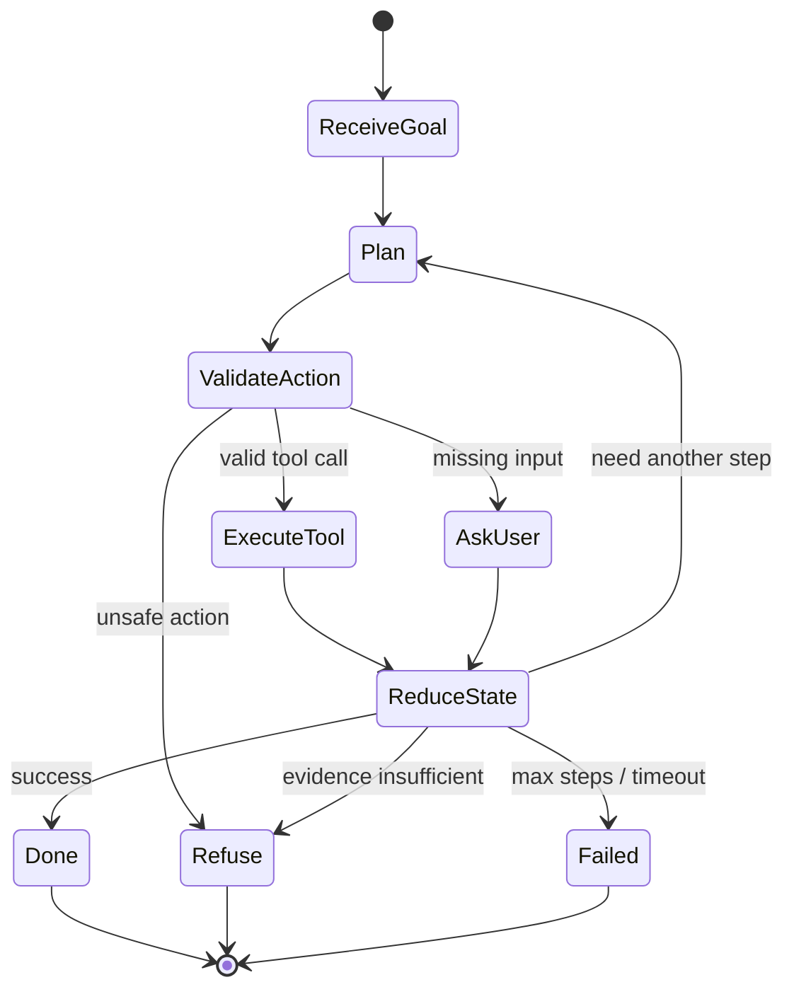

<section class="doc-hero">
  <p class="doc-hero__kicker">Agent 基础</p>
  <h1>Agent 运行循环 Agent Loop</h1>
  <p class="doc-hero__lead">一个可靠 Agent 的循环，必须能计划、行动、观察、更新状态，并且知道什么时候停。</p>
  <div class="doc-hero__meta" aria-label="本文信息">
    <span>适合阶段：Agent 工程实现</span>
    <span>核心机制：Think / Act / Observe / Reduce</span>
    <span>面试重点：状态机与停止条件</span>
  </div>
</section>

> Agent loop 是任务推进器，不是 while true 调模型。

## 面试官想考什么

读完这篇你要能正面回答下面这些题。每题后面括号里是面试官真正想看你答出什么。

<div class="interview-grid">
  <div>
    <strong>一个 Agent loop 最少包含哪些步骤？</strong>
    <span>考 plan / action / observation / state update / stop。</span>
  </div>
  <div>
    <strong>为什么不能用 while true 一直让模型决定下一步？</strong>
    <span>考循环失控、重复调用、成本和安全。</span>
  </div>
  <div>
    <strong>observation 应该怎么写回 state？谁来负责写回？</strong>
    <span>考 reducer，不能让模型自称状态已更新。</span>
  </div>
  <div>
    <strong>Agent loop 里的错误怎么分类处理？</strong>
    <span>考 retryable、non-retryable、permission、validation。</span>
  </div>
  <div>
    <strong>怎么设计 stop condition？</strong>
    <span>考 max steps、目标达成、证据不足、人工交接。</span>
  </div>
  <div>
    <strong>ReAct loop 和事件驱动状态机有什么关系？</strong>
    <span>考论文模式到工程状态机的转换。</span>
  </div>
  <div>
    <strong>如何评估一次 loop 是否跑得好？</strong>
    <span>考 trace 指标、无效调用、成功率、延迟、成本。</span>
  </div>
</div>

---

## 为什么需要专门设计 Agent loop

很多 Agent demo 看起来只有十几行：

```text
while not done:
    ask_llm_what_to_do()
    call_tool()
    append_result_to_messages()
```

这个 demo 可以演示概念，但拿去做生产会遇到四类事故：

- 工具失败后反复调用同一个参数，直到烧完预算。
- 模型忘记前面已经查过，重复查数据库。
- 工具返回权限错误，模型仍然生成“已完成”。
- 用户目标已经满足，Agent 继续搜索、总结、再搜索。

ReAct 论文把 reasoning 和 acting 交替组织起来，这给了 Agent loop 的语言层模板。但工程实现还需要状态机：每次 action 都要验证参数、调用工具、解析 observation、写回 state、判断是否停止。

Anthropic 的 [Building effective agents](https://www.anthropic.com/engineering/building-effective-agents) 里提到多种 agentic pattern，包括 routing、parallelization、orchestrator-workers、evaluator-optimizer。它们看起来不一样，但都需要同一个底层能力：可控循环。

## Agent loop 是怎么工作的

它实际是一个带预算的状态机。



这张图里有两个点容易被忽略：

- `ValidateAction` 在工具调用前。模型给出的 action 只是提案，代码要检查工具名、参数、权限和预算。
- `ReduceState` 在工具调用后。observation 不能只追加到 messages，要提取成结构化状态。

OpenAI Agents SDK 强调 trace，LangGraph 把 Agent 工作流建模成 graph / state / node。无论用哪个框架，面试时你都可以把底层讲成这五步：select action、validate、execute、reduce、stop。

## 核心原理 / 关键设计

### 1. Action 必须结构化

不要让模型输出“我接下来要查一下订单”。让它输出可验证动作：

```json
{
  "type": "tool",
  "name": "lookup_order",
  "args": {"order_id": "O-1389"},
  "reason": "需要确认订单状态和金额"
}
```

结构化 action 带来三个好处：工具名可白名单校验，参数可 schema 校验，reason 可用于审计和评估。

### 2. Observation 要区分成功、失败和可重试

工具结果应该像 API response，不应该像一段散文。

```json
{
  "ok": false,
  "error_code": "RATE_LIMITED",
  "retryable": true,
  "retry_after_seconds": 3
}
```

这样 loop 才能决定：等待重试、换工具、请求用户、降级回答，还是停止。

### 3. Reducer 负责把 observation 写回 state

模型负责提议，reducer 负责记账。

```python
def reduce_state(state, action, observation):
    if action["name"] == "lookup_order" and observation["ok"]:
        state["order"] = observation["data"]
    if observation.get("error_code") == "PERMISSION_DENIED":
        state["blocked_reason"] = "permission"
    state["trace"].append({"action": action, "observation": observation})
```

这一步应该尽量确定性。否则你会遇到一种很麻烦的 bug：模型在自然语言里说已经更新状态，但下一步又忘了。

### 4. Stop condition 要写成代码

停止条件至少包括：

```text
success: 目标字段满足
need_user: 缺少用户输入
refuse: 不安全或无权限
handoff: 需要人工
budget: max_steps / max_tokens / timeout
stuck: 重复动作超过阈值
```

Agent loop 的成熟度，经常就体现在 stop reason 是否清晰。一个只会返回“失败”的 Agent，很难排障；一个能返回 `permission_denied`、`max_steps_reached`、`insufficient_evidence` 的 Agent，才方便进入评估和运营。

### 5. Trace 要能还原每一步

每一步 trace 至少包含：

```json
{
  "step": 3,
  "state_hash": "s:91ab",
  "action": {"name": "lookup_policy", "args": {"topic": "partial shipment refund"}},
  "observation": {"ok": true, "evidence_id": "policy/refund#4"},
  "latency_ms": 210,
  "tokens": 480,
  "stop_reason": null
}
```

这不是为了好看。没有 trace，你无法回答“为什么多花了 8 次工具调用”“为什么错查了政策库”“为什么没有转人工”。

## 怎么用：标准库实现一个带停止原因的 loop

这段代码模拟一个订单退款 Agent。Planner 用规则代替 LLM，但 loop 的结构和生产实现相同。

```python
from dataclasses import dataclass, field
from typing import Any


@dataclass
class Action:
    name: str
    args: dict[str, Any] = field(default_factory=dict)


@dataclass
class State:
    order_id: str
    order: dict[str, Any] | None = None
    policy: dict[str, Any] | None = None
    ticket_id: str | None = None
    stop_reason: str | None = None
    trace: list[dict[str, Any]] = field(default_factory=list)


def planner(state: State) -> Action:
    if state.order is None:
        return Action("lookup_order", {"order_id": state.order_id})
    if state.policy is None:
        return Action("lookup_policy", {"status": state.order["status"]})
    if state.order["amount"] > state.policy["auto_refund_limit"]:
        return Action("create_ticket", {"reason": "amount_above_limit"})
    return Action("refund_order", {"order_id": state.order_id})


def execute(action: Action) -> dict[str, Any]:
    if action.name == "lookup_order":
        return {"ok": True, "data": {"amount": 1280, "status": "partial_shipped"}}
    if action.name == "lookup_policy":
        return {"ok": True, "data": {"auto_refund_limit": 500}}
    if action.name == "create_ticket":
        return {"ok": True, "ticket_id": "T-42"}
    if action.name == "refund_order":
        return {"ok": True, "refund_id": "R-77"}
    return {"ok": False, "error_code": "UNKNOWN_TOOL", "retryable": False}


def validate(action: Action) -> str | None:
    allowed = {"lookup_order", "lookup_policy", "create_ticket", "refund_order"}
    if action.name not in allowed:
        return "invalid_tool"
    if action.name == "refund_order":
        return "requires_human_approval"
    return None


def reduce_state(state: State, action: Action, obs: dict[str, Any]) -> None:
    state.trace.append({"action": action.name, "args": action.args, "obs": obs})
    if not obs["ok"]:
        state.stop_reason = obs.get("error_code", "tool_error")
    elif action.name == "lookup_order":
        state.order = obs["data"]
    elif action.name == "lookup_policy":
        state.policy = obs["data"]
    elif action.name == "create_ticket":
        state.ticket_id = obs["ticket_id"]
        state.stop_reason = "handoff_to_human"
    elif action.name == "refund_order":
        state.stop_reason = "success"


def run(order_id: str, max_steps: int = 5) -> State:
    state = State(order_id=order_id)
    seen_actions: dict[str, int] = {}
    for _ in range(max_steps):
        action = planner(state)
        key = f"{action.name}:{action.args}"
        seen_actions[key] = seen_actions.get(key, 0) + 1
        if seen_actions[key] > 2:
            state.stop_reason = "repeated_action"
            break
        validation_error = validate(action)
        if validation_error:
            state.stop_reason = validation_error
            break
        reduce_state(state, action, execute(action))
        if state.stop_reason:
            break
    else:
        state.stop_reason = "max_steps_reached"
    return state


state = run("O-1389")
print(state.stop_reason)
print([step["action"] for step in state.trace])
```

输出会是：

```text
handoff_to_human
['lookup_order', 'lookup_policy', 'create_ticket']
```

面试时可以拿这段解释：Agent loop 的关键不在“planner 是不是 LLM”，而在 loop 的外壳是否可控。把 planner 换成 LLM 后，validate、execute、reduce、stop 这些代码仍然要留着。

## 容易踩的坑

### 坑 1：把 observation 直接拼进 messages

**现象**：上下文越跑越长，模型还是忘记已经完成的步骤。

**根因**：没有结构化状态，只有一串自然语言日志。

**修法**：observation 进入 reducer，抽取关键字段写入 state。messages 只保留必要摘要和最近上下文。

### 坑 2：所有工具错误都走同一个 retry

**现象**：权限错误、参数错误也被重试，Agent 原地打转。

**根因**：工具返回没有 `retryable`、`error_code`、`retry_after`。

**修法**：错误分成 transient、validation、permission、not_found、unsafe。只有 transient 才自动重试。

### 坑 3：没有检测重复动作

**现象**：Agent 连续查同一个 query，或者连续创建类似工单。

**根因**：loop 不记录 action signature，也没有 stuck detector。

**修法**：用 `tool_name + normalized_args` 计数；超过阈值就改写 query、请求澄清或停止。

### 坑 4：停止条件只写在 prompt 里

**现象**：prompt 说“完成后停止”，模型仍继续调用工具。

**根因**：停止条件没有写成代码检查。

**修法**：用状态字段判断 success / refuse / handoff / budget。模型可以建议停止，系统必须验证。

### 坑 5：没有把人工介入做成状态

**现象**：创建人工工单后，Agent 还继续尝试处理。

**根因**：handoff 被当成工具调用结果，没有变成 `stop_reason`。

**修法**：把 `handoff_to_human` 作为终止状态。后续由新事件唤醒 Agent，而不是在同一次 loop 里继续跑。

## 与相似概念的区别

| 模式 | 运行方式 | 优点 | 风险 |
|---|---|---|---|
| 单次 tool calling | 模型选一个或几个工具 | 简单、延迟低 | 不适合多步任务 |
| ReAct loop | Thought / Action / Observation 交替 | 易懂，适合探索 | 容易循环，成本难控 |
| 状态机 loop | action、validation、reducer、stop 显式分开 | 可控、可测、可恢复 | 实现成本更高 |
| Graph workflow | 节点和边显式定义 | 适合复杂分支和人工审批 | 图太细会维护困难 |
| Plan-and-Execute | 先规划，再逐步执行 | 适合长任务 | 初始计划可能过时 |

真实系统经常混用：外层用状态机或 graph 控制风险，内层某些节点用 ReAct 或 tool calling 处理开放子任务。

## 面试题深度解析

**Q1: 一个 Agent loop 最少包含哪些步骤？**

- **30 秒版本**：接收目标、读取状态、选择 action、验证 action、执行工具、写回 observation、判断停止。
- **追问 1**：哪一步最容易被 demo 省掉？validate 和 reduce。demo 直接调用工具并追加消息，生产需要参数校验和状态写回。
- **追问 2**：为什么 reducer 重要？它把不稳定的自然语言 observation 变成稳定状态，后续 planner 才能可靠决策。

**Q2: 怎么避免 Agent 无限循环？**

- **30 秒版本**：max steps、timeout、重复动作检测、预算、明确 stop reason。工具错误要分类，不能所有失败都重试。
- **追问 1**：重复动作怎么判断？规范化 action name 和 args，做 signature 计数。相同 signature 超阈值就停止或换策略。
- **追问 2**：模型说还没完成怎么办？系统看状态字段。成功条件、权限失败、证据不足都由代码判断，不能完全交给模型。

**Q3: observation 应该怎么写回 state？**

- **30 秒版本**：用 reducer 写回。工具返回结构化 JSON，reducer 根据 action 类型更新对应字段。
- **追问 1**：能让 LLM 总结状态吗？可以总结非关键上下文，但权限、支付、删除、审批等关键字段要由代码确定性更新。
- **追问 2**：长任务怎么压缩状态？保留结构化事实、短摘要、证据 id、最近动作；旧 trace 存外部日志或数据库。

**Q4: loop 怎么评估？**

- **30 秒版本**：不要只看最终成功率，还要看每步 action 是否正确、参数是否有效、工具是否被重复调用、stop reason 是否合理。
- **追问 1**：有哪些指标？task success、tool selection accuracy、argument validity、invalid tool rate、average steps、retry rate、p95 latency、cost per task。
- **追问 2**：怎么 debug？按 trace 回放每一步，把失败归因到 planner、validator、tool、reducer、stop condition。

## 延伸阅读

- 论文：[ReAct](https://arxiv.org/abs/2210.03629) — 理解 Thought / Action / Observation 的原始模式。
- 论文：[Toolformer](https://arxiv.org/abs/2302.04761) — 理解模型学习工具调用的动机。
- 文档：[Anthropic Building effective agents](https://www.anthropic.com/engineering/building-effective-agents) — 看常见 agentic patterns 如何组织控制流。
- 文档：[OpenAI Agents SDK Tracing](https://openai.github.io/openai-agents-python/tracing/) — 学习生产 Agent 为什么需要完整 trace。
- 文档：[LangGraph Concepts](https://langchain-ai.github.io/langgraph/concepts/why-langgraph/) — 把 Agent loop 放进 stateful graph 的一个参考实现。
