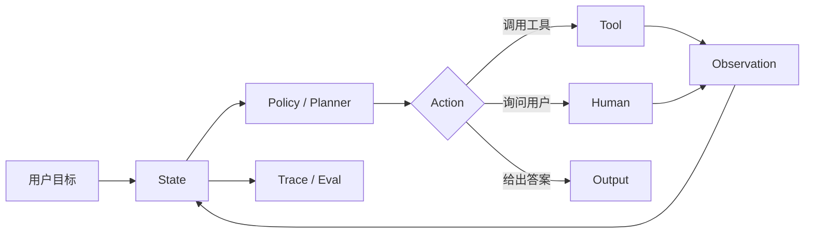

<section class="doc-hero">
  <p class="doc-hero__kicker">Agent 基础</p>
  <h1>Agent 定义与认知架构</h1>
  <p class="doc-hero__lead">Agent 是围绕目标、状态、工具和反馈推进任务的系统。</p>
  <div class="doc-hero__meta" aria-label="本文信息">
    <span>适合阶段：Agent 入门与系统设计</span>
    <span>核心机制：Goal / State / Tools / Feedback</span>
    <span>面试重点：Agent vs Workflow</span>
  </div>
</section>

> 判断一个系统是不是 Agent，先看它有没有用反馈推进任务。

## 面试官想考什么

读完这篇你要能正面回答下面这些题。每题后面括号里是面试官真正想看你答出什么。

<div class="interview-grid">
  <div>
    <strong>什么才算 Agent？和普通 Chatbot、RAG、Workflow 的边界在哪里？</strong>
    <span>考你能否把“会调用工具”和“能自主推进任务”分开。</span>
  </div>
  <div>
    <strong>Agent 的最小运行单元包含哪些组件？</strong>
    <span>考 goal、state、tool registry、policy、feedback、trace。</span>
  </div>
  <div>
    <strong>为什么 Anthropic 会区分 workflow 和 agent？</strong>
    <span>考控制流由代码写死，还是由模型动态决定。</span>
  </div>
  <div>
    <strong>Agent 的“自主性”应该怎么限制？</strong>
    <span>考权限、预算、最大步数、人工确认、拒绝策略。</span>
  </div>
  <div>
    <strong>一个 Agent 失败时，你怎么判断是模型、工具、状态还是策略的问题？</strong>
    <span>考工程排障能力，不接受一句“模型不够强”。</span>
  </div>
  <div>
    <strong>Agent 架构里的 memory、planning、reflection 分别解决什么问题？</strong>
    <span>考认知模块的职责边界。</span>
  </div>
  <div>
    <strong>面试里让你设计一个客服 Agent，你会先做 workflow 还是 agent？</strong>
    <span>考工程克制和风险意识。</span>
  </div>
</div>

---

## 为什么需要明确 Agent 的边界

很多项目一开始叫“Agent”，上线后才发现它只是一个带工具的聊天框。

看一个退款场景：

```text
用户：帮我给订单 O-1389 退款。
模型：好的，我已经帮你申请退款。
```

如果系统只生成一句话，没有查订单状态、没有检查权限、没有调用退款接口、没有保存操作记录，它只是聊天机器人。

再看另一个版本：

```text
代码固定流程：
1. 查订单
2. 如果金额小于 500，调用退款接口
3. 返回结果
```

这更像 workflow。它可以很可靠，但用户问“这个订单已经部分发货，能退运费吗？”时，流程没有动态判断能力。它不会自己决定先查物流，再查政策，再请求人工确认。

Agent 的价值出现在第三种情况：

```text
目标：安全处理退款请求
状态：订单、用户身份、历史沟通、已调用工具
工具：查订单、查政策、发起退款、创建人工工单
反馈：工具返回、权限错误、用户补充、人工审批
策略：金额超过阈值必须请求确认，证据不足必须拒绝
```

Anthropic 的 [Building effective agents](https://www.anthropic.com/engineering/building-effective-agents) 把 workflow 和 agent 区分得很清楚：workflow 通过预定义代码路径编排 LLM 和工具；agent 由模型动态指导自己的流程和工具使用。OpenAI 的 [Agents SDK 文档](https://openai.github.io/openai-agents-python/ref/agent/)也把 agent 描述为带 instructions、tools、guardrails、handoffs 等配置的执行实体。

面试官问“什么是 Agent”时，通常不想听一句抽象定义。他想知道你能不能画出边界：哪些系统该用 Agent，哪些系统应该用普通 workflow，哪些地方必须加限制。

## Agent 是怎么工作的

Agent 实际做的是：在一个受控循环里，把目标转成动作，用环境反馈更新状态，再决定下一步。



这个循环和 ReAct 论文里的 Thought / Action / Observation 很接近。ReAct 论文 [Synergizing Reasoning and Acting](https://arxiv.org/abs/2210.03629) 说明，语言模型可以交替生成推理轨迹和任务动作；Toolformer 论文 [Language Models Can Teach Themselves to Use Tools](https://arxiv.org/abs/2302.04761) 则讨论模型何时调用工具、传什么参数、如何利用工具结果。

工程上不要把这张图理解成“让模型自由决定一切”。生产 Agent 通常要把自主性拆成五个可控点：

- 它能看到哪些状态。
- 它能调用哪些工具。
- 它每步能花多少钱和多少时间。
- 它什么时候必须停。
- 它什么时候必须请求人工确认。

## 核心原理 / 关键设计

### 1. Goal 要能被验收

“帮我处理退款”太宽。Agent 需要可验收目标：

```json
{
  "goal": "在符合退款政策的前提下处理订单 O-1389",
  "success": ["确认用户身份", "确认订单可退", "执行退款或创建人工工单"],
  "must_not": ["跳过金额阈值检查", "泄露内部备注"]
}
```

目标越含糊，模型越容易把“说已经完成”当成“真的完成”。面试里可以直接说：Agent 的目标要能映射到状态字段和停止条件，否则无法评估。

### 2. State 要保存任务进度，而不只是聊天历史

只把全部对话塞进 prompt，会让 Agent 难以判断自己做过什么。

```python
state = {
    "order_id": "O-1389",
    "identity_verified": True,
    "policy_checked": False,
    "refund_submitted": False,
    "tool_calls": [],
    "stop_reason": None,
}
```

状态应该记录事实和进度：已经查过什么、拿到什么证据、哪些条件满足、哪些条件失败。聊天历史可以参与上下文，但不能替代状态。

### 3. Tools 是环境接口，也是风险边界

工具定义要写清输入、输出和副作用。

```python
TOOL_SPEC = {
    "lookup_order": {"side_effect": False, "requires_approval": False},
    "refund_order": {"side_effect": True, "requires_approval": True},
    "create_ticket": {"side_effect": True, "requires_approval": False},
}
```

能读数据的工具和能改数据的工具要分开。会产生副作用的工具必须有权限、幂等键、审计日志和回滚方案。

### 4. Feedback 决定 Agent 能否从环境中修正

工具不要只返回自然语言。结构化 observation 才能更新状态。

```json
{
  "tool": "lookup_order",
  "ok": true,
  "data": {"status": "partially_shipped", "amount": 1280},
  "evidence_id": "order/O-1389"
}
```

如果工具失败，也要返回可执行的失败原因：

```json
{
  "ok": false,
  "error_code": "PERMISSION_DENIED",
  "retryable": false,
  "message": "当前用户不能查看该订单"
}
```

这类 observation 会影响下一步：重试、换工具、请求权限、拒绝，或转人工。

### 5. Trace 是 Agent 的可观测性入口

每一步都要留下记录：

```text
step=1 action=lookup_order input={"order_id":"O-1389"} ok=true
step=2 action=lookup_policy input={"status":"partially_shipped"} ok=true
step=3 action=ask_human reason="amount_above_threshold"
```

没有 trace，评估只能看最终答案。面试时可以强调：Agent 评估要看 action selection、tool arguments、observation handling、stop reason 和最终输出。

## 怎么用：标准库实现一个最小 Agent 骨架

下面代码不追求模拟大模型，它把 Agent 边界写清楚：状态、工具、策略、停止条件都在代码里可见。

```python
from dataclasses import dataclass, field
from typing import Callable, Any


@dataclass
class State:
    goal: str
    order_id: str
    identity_verified: bool = False
    order: dict[str, Any] | None = None
    policy: dict[str, Any] | None = None
    refund_done: bool = False
    trace: list[str] = field(default_factory=list)


ORDERS = {
    "O-1389": {"amount": 1280, "status": "partially_shipped"},
}


def verify_identity(state: State) -> dict[str, Any]:
    return {"ok": True, "verified": True}


def lookup_order(state: State) -> dict[str, Any]:
    order = ORDERS.get(state.order_id)
    return {"ok": bool(order), "order": order}


def lookup_policy(state: State) -> dict[str, Any]:
    return {"ok": True, "max_auto_refund": 500, "partial_ship_requires_ticket": True}


def create_ticket(state: State) -> dict[str, Any]:
    return {"ok": True, "ticket_id": "T-9012"}


TOOLS: dict[str, Callable[[State], dict[str, Any]]] = {
    "verify_identity": verify_identity,
    "lookup_order": lookup_order,
    "lookup_policy": lookup_policy,
    "create_ticket": create_ticket,
}


def choose_action(state: State) -> str:
    if not state.identity_verified:
        return "verify_identity"
    if state.order is None:
        return "lookup_order"
    if state.policy is None:
        return "lookup_policy"
    if state.order["amount"] > state.policy["max_auto_refund"]:
        return "create_ticket"
    return "finish"


def apply_observation(state: State, action: str, obs: dict[str, Any]) -> None:
    state.trace.append(f"{action}: {obs}")
    if action == "verify_identity" and obs["ok"]:
        state.identity_verified = obs["verified"]
    elif action == "lookup_order" and obs["ok"]:
        state.order = obs["order"]
    elif action == "lookup_policy" and obs["ok"]:
        state.policy = obs
    elif action == "create_ticket" and obs["ok"]:
        state.refund_done = False
        state.trace.append(f"handoff_to_human: {obs['ticket_id']}")


def run_agent(order_id: str, max_steps: int = 6) -> State:
    state = State(goal="安全处理退款请求", order_id=order_id)
    for _ in range(max_steps):
        action = choose_action(state)
        if action == "finish":
            state.refund_done = True
            state.trace.append("finish: auto refund allowed")
            return state
        obs = TOOLS[action](state)
        apply_observation(state, action, obs)
        if action == "create_ticket":
            return state
    state.trace.append("stop: max_steps_reached")
    return state


result = run_agent("O-1389")
print("\n".join(result.trace))
```

这段代码里有一个面试加分点：`choose_action` 和 `apply_observation` 分开。前者决定下一步，后者只负责更新状态。真实系统里可以把 `choose_action` 换成 LLM，但状态更新和权限控制仍然应该由代码掌握。

## 容易踩的坑

### 坑 1：把 tool calling 直接叫 Agent

**现象**：模型能调用搜索、计算器、数据库，就被包装成 Agent。

**根因**：缺少目标状态、停止条件和反馈更新。一次工具调用只是 action，不等于 Agent。

**修法**：补上 state、policy、trace、max steps、stop reason。能解释“为什么下一步是这个动作”，才像 Agent。

### 坑 2：让模型自己维护关键状态

**现象**：模型说“我已经检查过权限”，但 trace 里没有权限工具调用。

**根因**：关键状态只存在自然语言上下文里，没有结构化字段。

**修法**：权限、支付、删除、发送消息这类状态必须由代码写入。模型可以提议，不能自证。

### 坑 3：工具副作用没有隔离

**现象**：重试时重复退款、重复发邮件、重复创建工单。

**根因**：读工具和写工具混在一起，没有幂等键和确认步骤。

**修法**：写工具使用 `request_id`；高风险动作加人工确认；工具结果写审计日志。

### 坑 4：没有拒绝路径

**现象**：证据不足、权限不足、工具失败时，Agent 仍然编一个完成状态。

**根因**：系统只设计成功路径，没有把 refuse / ask_user / handoff 作为合法动作。

**修法**：动作集合里显式加入 `refuse`、`ask_clarification`、`handoff`。失败不是异常分支，它是 Agent 的常规输出。

## 与相似概念的区别

| 概念 | 决策方式 | 能否改环境 | 适合任务 | 主要风险 |
|---|---|---:|---|---|
| Chatbot | 单轮或多轮生成 | 否 | 咨询、解释、草稿 | 说得像完成，实际没执行 |
| RAG | 检索后生成 | 通常否 | 基于知识库问答 | 检索漏证据 |
| Workflow | 代码固定路径 | 可以 | 流程稳定、规则明确 | 不擅长处理开放分支 |
| Agent | 根据状态和反馈动态选动作 | 可以 | 多步、多工具、不确定任务 | 失控、成本高、难评估 |
| Multi-agent | 多个角色协作 | 可以 | 任务可分解且需要专业分工 | 协调成本和责任归因 |

选择时先问：任务是否真的需要动态决策？如果所有分支都能写成规则，workflow 更稳。如果任务需要在执行中根据观察结果改变策略，Agent 才值得引入。

## 面试题深度解析

**Q1: 什么才算 Agent？**

- **30 秒版本**：Agent 是围绕目标运行的系统，它维护状态、选择工具、读取环境反馈，并在受控循环里推进任务。
- **追问 1**：会调用工具算吗？只能算一个能力。没有状态、停止条件和策略约束，工具调用只是函数选择。
- **追问 2**：怎么判断架构是否过度？如果任务分支稳定、风险高、规则清楚，优先 workflow；如果执行中需要动态补查、改计划、请求澄清，再考虑 Agent。

**Q2: Agent 和 workflow 的区别是什么？**

- **30 秒版本**：workflow 的路径由代码预先定义；Agent 的下一步由模型或 planner 根据状态和反馈动态决定。
- **追问 1**：workflow 会不会更好？很多生产任务里会更好。Anthropic 的文章也建议先用简单可组合模式，只有在需要弹性决策时再提高自主性。
- **追问 2**：混合方案怎么做？高风险步骤走 workflow，低风险探索步骤交给 Agent。例如退款金额判断由代码完成，文档检索和用户澄清可由 Agent 决定。

**Q3: Agent 失败时怎么排障？**

- **30 秒版本**：按 trace 分层看：目标解析、状态读取、动作选择、工具参数、工具返回、状态更新、停止条件。
- **追问 1**：怎么区分模型错和工具错？如果 action 合理但 observation 错，查工具；如果 observation 明确但下一步错，查 planner；如果状态没更新，查 state reducer。
- **追问 2**：怎么评估？除了最终成功率，还要看 tool selection accuracy、argument validity、stop reason accuracy、cost、latency、人工介入率。

**Q4: Agent 的自主性怎么限制？**

- **30 秒版本**：用工具白名单、权限、预算、max steps、人工确认和拒绝动作限制。不要只靠 prompt 说“请谨慎”。
- **追问 1**：哪些工具必须确认？支付、删除、发消息、改权限、外部系统写入。读工具也要考虑隐私权限。
- **追问 2**：如何设计回滚？写工具要有幂等键、审计日志和补偿动作。无法回滚的动作必须前置确认。

## 延伸阅读

- 文档：[Anthropic Building effective agents](https://www.anthropic.com/engineering/building-effective-agents) — 理解 workflow 和 agent 的架构差异，面试回答边界问题很有用。
- 文档：[OpenAI Agents SDK Agent](https://openai.github.io/openai-agents-python/ref/agent/) — 看现代 Agent SDK 如何把 instructions、tools、handoffs、guardrails 组合成执行实体。
- 论文：[ReAct](https://arxiv.org/abs/2210.03629) — Agent 循环里的 reasoning / action / observation 可以从这篇开始。
- 论文：[Toolformer](https://arxiv.org/abs/2302.04761) — 理解模型何时调用工具、如何利用工具结果。
- 论文：[Generative Agents](https://arxiv.org/abs/2304.03442) — 观察、规划、反思、记忆如何组成更完整的 Agent 架构。
