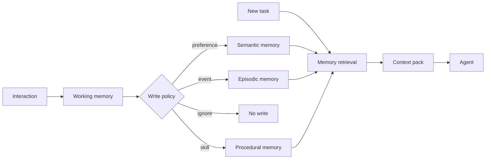

<section class="doc-hero">
  <p class="doc-hero__kicker">Agent 进阶</p>
  <h1>记忆架构 Memory（MemGPT / Mem0）</h1>
  <p class="doc-hero__lead">Agent 记忆要把可复用事实、偏好、经验和技能分层管理。</p>
  <div class="doc-hero__meta" aria-label="本文信息">
    <span>适合阶段：长任务与个性化 Agent</span>
    <span>核心机制：Working / Episodic / Semantic / Procedural</span>
    <span>面试重点：写入、检索、过期和隐私</span>
  </div>
</section>

> 好记忆会让 Agent 更稳定，坏记忆会让错误长期存在。

## 面试官想考什么

读完这篇你要能正面回答下面这些题。每题后面括号里是面试官真正想看你答出什么。

<div class="interview-grid">
  <div>
    <strong>Agent memory 和 RAG 有什么区别？</strong>
    <span>考知识库检索和个体经验/状态记忆的边界。</span>
  </div>
  <div>
    <strong>短期记忆、长期记忆、情景记忆、语义记忆分别是什么？</strong>
    <span>考 memory taxonomy，不接受“都放向量库”。</span>
  </div>
  <div>
    <strong>MemGPT 为什么用操作系统类比？</strong>
    <span>考 context window、外部存储、分页和控制流。</span>
  </div>
  <div>
    <strong>记忆什么时候写入？谁来决定写入？</strong>
    <span>考 memory write policy 和人工确认。</span>
  </div>
  <div>
    <strong>记忆检索怎么避免把旧信息或错误信息拿回来？</strong>
    <span>考时间、置信度、命名空间、冲突解决。</span>
  </div>
  <div>
    <strong>长期记忆会带来哪些安全和隐私问题？</strong>
    <span>考 consent、PII、删除权、权限隔离。</span>
  </div>
  <div>
    <strong>怎么评估一个 memory system？</strong>
    <span>考 recall、precision、staleness、contradiction、task success。</span>
  </div>
</div>

---

## 为什么需要记忆架构

一个没有长期记忆的客服 Agent 会这样：

```text
第 1 次：用户说“以后报告都给我 Markdown，不要 PDF。”
第 2 次：Agent 又问“你想要 Markdown 还是 PDF？”
第 3 次：用户再次说明偏好。
```

把所有历史聊天都塞进上下文可以缓解一部分问题，但很快会遇到上下文窗口、成本、噪声和隐私问题。更麻烦的是，历史里可能有过期信息：

```text
旧记忆：用户所在团队是 Growth。
新事实：用户已经转到 Platform。
```

如果 memory system 不处理时间和冲突，Agent 会持续拿旧事实做决策。

Generative Agents 论文 [Interactive Simulacra of Human Behavior](https://arxiv.org/abs/2304.03442) 把 memory stream、reflection、planning 组合成 Agent 行为系统。MemGPT 论文 [Towards LLMs as Operating Systems](https://arxiv.org/abs/2310.08560) 则把有限 context window 类比成主存，把外部存储类比成磁盘，通过函数调用管理 memory paging。Mem0 论文 [Building Production-Ready AI Agents with Scalable Long-Term Memory](https://arxiv.org/abs/2504.19413) 和 LangChain 的 [long-term memory docs](https://docs.langchain.com/oss/python/langchain/long-term-memory) 更偏工程化：如何跨会话保存和召回用户、任务、事实。

## Memory 是怎么工作的

一个实用 memory 架构通常分层：



常见分层：

| 类型 | 存什么 | 例子 | 典型风险 |
|---|---|---|---|
| Working memory | 当前任务状态 | 已查订单、当前计划 | 上下文过长 |
| Episodic memory | 发生过的事件 | 上次投诉、失败轨迹 | 旧事件误用 |
| Semantic memory | 稳定事实和偏好 | 用户偏好 Markdown | 冲突和过期 |
| Procedural memory | 技能和流程 | 成功修复某类 bug 的步骤 | 技能过拟合 |

## 核心原理 / 关键设计

### 1. 写入策略比存储介质更重要

不要把每句话都存进向量库。先判断它是否值得记：

```json
{
  "candidate": "用户以后希望报告用 Markdown",
  "type": "preference",
  "scope": "user:yibo",
  "confidence": 0.95,
  "expires_at": null,
  "requires_consent": false
}
```

适合写入的内容：稳定偏好、长期目标、明确事实、可复用失败经验、成功技能。临时情绪、一次性上下文、敏感信息、未经确认的推断不该随便写。

### 2. 检索要同时看相关性、时间和置信度

Generative Agents 使用 recency、importance、relevance 组合来取 memory。工程实现也可以类似：

```text
score = 0.55 * relevance + 0.25 * importance + 0.20 * recency
```

只靠向量相似度会拿到旧记忆；只靠时间会漏掉重要长期偏好。两者要一起看。

### 3. 记忆要有 namespace

常见命名空间：

```text
user:{user_id}:preferences
user:{user_id}:facts
org:{org_id}:policies
agent:{agent_id}:skills
task:{task_id}:scratchpad
```

命名空间是权限边界。用户 A 的偏好不能被用户 B 检索到；组织政策不能被个人记忆覆盖；临时 scratchpad 不应该进入长期 memory。

### 4. 冲突解决要显式

同一事实可能变化：

```text
2026-05-01: 用户在 Growth 团队
2026-06-01: 用户在 Platform 团队
```

策略可以是：

```text
新事实覆盖旧事实，但保留历史事件。
低置信记忆不覆盖高置信记忆。
敏感或关键字段需要用户确认后覆盖。
```

没有冲突策略，Agent 会把互相矛盾的记忆一起塞进 prompt。

### 5. 记忆需要删除和审计

长期记忆涉及隐私。系统要支持：

```text
查看我记住了什么
删除某条记忆
禁用长期记忆
导出用户记忆
按租户隔离审计
```

这是生产 memory system 的基本要求。

## 怎么用：实现一个带 recency / importance / relevance 的 memory store

下面代码模拟一个很小的 memory store。为了可运行，相关性用关键词重叠代替 embedding。

```python
from dataclasses import dataclass
from datetime import datetime, timedelta
import math


@dataclass
class Memory:
    id: str
    text: str
    namespace: str
    importance: float
    created_at: datetime
    confidence: float = 1.0


def tokenize(text: str) -> set[str]:
    return {word.lower().strip("，。,.") for word in text.split()}


def relevance(query: str, memory: Memory) -> float:
    q = tokenize(query)
    m = tokenize(memory.text)
    if not q or not m:
        return 0.0
    return len(q & m) / len(q | m)


def recency(memory: Memory, now: datetime) -> float:
    days = max((now - memory.created_at).days, 0)
    return math.exp(-days / 30)


def score(query: str, memory: Memory, now: datetime) -> float:
    return (
        0.50 * relevance(query, memory)
        + 0.25 * memory.importance
        + 0.15 * recency(memory, now)
        + 0.10 * memory.confidence
    )


class MemoryStore:
    def __init__(self) -> None:
        self.items: list[Memory] = []

    def add(self, memory: Memory) -> None:
        self.items.append(memory)

    def search(self, query: str, namespace: str, limit: int = 3) -> list[Memory]:
        now = datetime(2026, 6, 1)
        candidates = [item for item in self.items if item.namespace == namespace]
        return sorted(candidates, key=lambda item: score(query, item, now), reverse=True)[:limit]


store = MemoryStore()
store.add(Memory("m1", "用户偏好 Markdown 报告，不要 PDF", "user:yibo:preferences", 0.9, datetime(2026, 5, 20)))
store.add(Memory("m2", "用户曾经在 Growth 团队", "user:yibo:facts", 0.4, datetime(2026, 3, 1), 0.6))
store.add(Memory("m3", "用户现在在 Platform 团队", "user:yibo:facts", 0.8, datetime(2026, 6, 1), 0.95))

for memory in store.search("报告 输出 格式 Markdown", "user:yibo:preferences"):
    print(memory.id, memory.text)
for memory in store.search("用户 团队", "user:yibo:facts"):
    print(memory.id, memory.text)
```

这段代码很简单，但包含了生产 memory 的几个要点：namespace 隔离、重要性、时间衰减、置信度。真实系统会把 `relevance` 换成 embedding 或 hybrid search。

## 容易踩的坑

### 坑 1：把聊天历史等同于记忆

**现象**：上下文持续变长，模型仍然找不到关键偏好。

**根因**：历史是原始日志，记忆是筛选后的可复用信息。

**修法**：对话结束或关键事件后做 memory extraction，写入结构化记忆。

### 坑 2：所有记忆都进同一个向量库

**现象**：用户偏好、公司政策、任务 scratchpad 混在一起，权限和冲突都难处理。

**根因**：缺少 namespace 和 memory type。

**修法**：按 user、org、agent、task 分命名空间；按 preference、fact、episode、skill 分类型。

### 坑 3：旧记忆覆盖新事实

**现象**：用户已经换团队，Agent 还按旧团队给权限建议。

**根因**：检索只看相似度，不看时间和置信度。

**修法**：检索评分加入 recency 和 confidence；冲突字段用最新高置信事实。

### 坑 4：自动写入敏感信息

**现象**：Agent 记住用户的私人地址、健康信息、内部密钥片段。

**根因**：write policy 没有隐私过滤和 consent。

**修法**：PII 检测、敏感类型黑名单、用户可查看和删除、租户隔离审计。

### 坑 5：记忆没有评估

**现象**：团队觉得 Agent “有记忆”，但不知道它什么时候用对、什么时候用错。

**根因**：没有 memory eval set。

**修法**：构造偏好召回、事实更新、冲突处理、隐私隔离、删除生效测试集。

## 与相似概念的区别

| 概念 | 存储对象 | 生命周期 | 典型用途 |
|---|---|---|---|
| Context window | 当前输入片段 | 单次调用 | 临时推理 |
| Chat history | 原始对话日志 | 会话级或长期 | 审计、回放 |
| RAG knowledge base | 外部文档知识 | 由文档更新 | 问答和引用 |
| Agent memory | 用户、任务、经验、技能 | 跨会话 | 个性化、长期任务 |
| Cache | 输入输出或中间结果 | 短期 | 降成本、降延迟 |

Agent memory 和 RAG 经常一起用：RAG 查组织知识，memory 查这个用户或这个 Agent 的历史经验。

## 面试题深度解析

**Q1: Agent memory 和 RAG 有什么区别？**

- **30 秒版本**：RAG 面向外部知识库，memory 面向用户偏好、任务状态、历史经验和可复用技能。
- **追问 1**：能都放向量库吗？底层可以都用向量检索，但写入策略、权限、过期和冲突处理完全不同。
- **追问 2**：怎么组合？回答政策问题时用 RAG；决定输出格式、用户偏好、上次失败经验时用 memory。

**Q2: 记忆什么时候写入？**

- **30 秒版本**：当信息稳定、可复用、获得确认且不违反隐私策略时写入。临时上下文和敏感推断不写长期记忆。
- **追问 1**：谁决定写入？可以由 LLM 提议，但代码或 policy 审核。高风险记忆需要用户确认。
- **追问 2**：写错怎么办？支持删除、覆盖、降置信度和审计。记忆必须可管理。

**Q3: MemGPT 的操作系统类比怎么理解？**

- **30 秒版本**：context window 类似主存，外部 memory store 类似磁盘。Agent 通过函数调用把信息移入或移出上下文。
- **追问 1**：这个类比解决什么？有限上下文下的长文档、长对话和多会话记忆问题。
- **追问 2**：工程风险是什么？paging 策略错了会漏关键记忆；写入策略错了会污染长期存储。

**Q4: memory system 怎么评估？**

- **30 秒版本**：看该记的是否记住、该忘的是否忘掉、旧事实是否被新事实覆盖、权限隔离是否生效。
- **追问 1**：有哪些指标？memory recall、memory precision、staleness rate、contradiction rate、privacy leak rate、task success。
- **追问 2**：怎么做测试集？构造跨会话偏好、事实更新、冲突、删除请求、不同用户隔离样本。

## 延伸阅读

- 论文：[Generative Agents](https://arxiv.org/abs/2304.03442) — 学习 memory stream、reflection、planning 的组合方式。
- 论文：[MemGPT](https://arxiv.org/abs/2310.08560) — 从 virtual memory 角度理解 context 和外部存储。
- 论文：[Mem0](https://arxiv.org/abs/2504.19413) — 面向生产长期记忆的系统化方案。
- 文档：[LangChain Long-term memory](https://docs.langchain.com/oss/python/langchain/long-term-memory) — 看现代 Agent 框架如何处理跨会话存储。
- 文档：[LangMem Concepts](https://langchain-ai.github.io/langmem/concepts/conceptual_guide/) — 学习 memory operation、namespace、store 的工程组织方式。
- 论文：[Voyager](https://arxiv.org/abs/2305.16291) — procedural memory / skill library 在开放环境中的典型例子。
