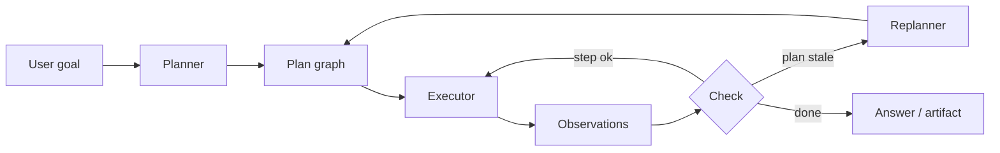

<section class="doc-hero">
  <p class="doc-hero__kicker">Agent 模式</p>
  <h1>先规划后执行 Plan-and-Execute / ReWOO</h1>
  <p class="doc-hero__lead">长任务不要每一步都临场发挥，先拆计划，再按步骤执行、校验和必要时重规划。</p>
  <div class="doc-hero__meta" aria-label="本文信息">
    <span>适合阶段：长任务 Agent</span>
    <span>核心机制：Planner / Executor / Replanner</span>
    <span>面试重点：计划过时与依赖管理</span>
  </div>
</section>

> Plan-and-Execute 把“想清楚步骤”和“执行每一步”拆开。

## 面试官想考什么

读完这篇你要能正面回答下面这些题。每题后面括号里是面试官真正想看你答出什么。

<div class="interview-grid">
  <div>
    <strong>Plan-and-Execute 和 ReAct 的差异是什么？</strong>
    <span>考逐步决策和先规划再执行的取舍。</span>
  </div>
  <div>
    <strong>Planner 的输出应该是自然语言清单，还是结构化任务图？</strong>
    <span>考依赖、状态、验收标准和可执行性。</span>
  </div>
  <div>
    <strong>计划执行到一半发现前提错了怎么办？</strong>
    <span>考 replanning、partial rollback、human confirmation。</span>
  </div>
  <div>
    <strong>ReWOO 为什么要把 reasoning 和 observation 解耦？</strong>
    <span>考减少重复模型调用和变量引用。</span>
  </div>
  <div>
    <strong>哪些步骤可以并行？哪些步骤不能并行？</strong>
    <span>考依赖图和副作用工具。</span>
  </div>
  <div>
    <strong>长任务 Agent 怎么评估？</strong>
    <span>考 plan quality、step success、dependency violation、replan rate。</span>
  </div>
  <div>
    <strong>什么时候不该用 Plan-and-Execute？</strong>
    <span>考短任务、强交互任务、环境变化快的任务。</span>
  </div>
</div>

---

## 为什么需要 Plan-and-Execute

ReAct 很适合“查一步、看结果、再查一步”。但长任务会暴露短视问题：

```text
用户：调研三家竞品的价格、功能差异和客户评价，整理成对比报告。
```

如果用纯 ReAct，每一步都让模型临时决定下一步，可能出现：

- 已经查过 A 公司价格，又重复查一遍。
- 查完功能，忘记还要客户评价。
- 报告开始写了，才发现缺 B 公司的证据。
- 每一步都调用大模型，成本高。

Plan-and-Execute 的思路更直接：先让 planner 把任务拆成结构化步骤，再让 executor 执行。执行中如果观察结果和计划冲突，再重规划。

LangGraph 的 [plan-and-execute 教程](https://langchain-ai.github.io/langgraph/tutorials/plan-and-execute/plan-and-execute/) 就按 planner、agent executor、re-plan step 来组织。ReWOO 论文 [Reasoning WithOut Observation](https://arxiv.org/abs/2305.18323) 则进一步提出：先生成带变量引用的推理计划，后续 worker 按计划取工具结果，减少每一步都调用大模型的成本。

## Plan-and-Execute 是怎么工作的

典型流程是：



Planner 输出不能只是：

```text
1. 查资料
2. 分析
3. 写报告
```

这种计划无法执行，也无法评估。更好的计划要包含工具、输入、依赖和验收标准：

```json
{
  "id": "price_acme",
  "tool": "web_search",
  "input": "Acme Cloud pricing enterprise 2026",
  "depends_on": [],
  "success": "找到价格页或报价说明，并保存来源"
}
```

## 核心原理 / 关键设计

### 1. Plan 要结构化到能执行

Planner 的输出建议包含：

```json
{
  "steps": [
    {
      "id": "a",
      "description": "查 Acme 价格",
      "tool": "search_web",
      "args": {"query": "Acme Cloud pricing enterprise"},
      "depends_on": [],
      "acceptance": ["source_url", "price_or_contact_sales"]
    }
  ]
}
```

这样 executor 可以校验工具是否存在、参数是否完整、依赖是否满足。评估也能看每一步是否达标。

### 2. Executor 不应该重新解释整个任务

Executor 执行单个 step。它只需要当前步骤、依赖结果和相关状态。

```text
executor input:
- step: 查 Acme 价格
- dependencies: none
- constraints: 必须保存 URL
```

如果每个 executor 都看到完整任务并自由发挥，计划很快会漂移。面试里可以说：Planner 负责全局意图，Executor 负责局部完成。

### 3. Replanner 只在证据改变时介入

不是每个失败都要重规划。工具超时可以重试；参数缺失可以补参；前提变化才需要 replanning。

```text
需要重规划：
- 某竞品价格页已下线，需要换信息源。
- 发现用户限定的三家公司里有一家不存在。
- 任务中途新增约束：只看美国市场。
```

重规划要基于当前状态，不要丢掉已完成步骤。

### 4. ReWOO 用变量把计划和观察分开

ReWOO 的计划可以长这样：

```text
E1 = Search["Acme pricing"]
E2 = Search["BetaCloud pricing"]
E3 = LLM["Compare pricing using #E1 and #E2"]
```

Planner 先生成完整推理结构和变量引用，Worker 再执行每个 `E`。好处是减少每步都让 planner 重新思考；限制是计划初始质量更关键，环境变化时需要检测并修正。

### 5. 并行只能发生在无依赖、低副作用步骤

竞品 A/B/C 的价格搜索可以并行；创建退款、发送邮件、改数据库不能随便并行。

```text
parallel ok:
search price A, search price B, search price C

parallel risky:
send email, update CRM, issue refund
```

并行前要看依赖和副作用。副作用步骤建议串行，并加幂等键。

## 怎么用：实现一个小型 Plan-and-Execute

下面代码演示结构化计划、依赖检查、执行和重规划。为了可运行，工具用本地字典模拟。

```python
from dataclasses import dataclass, field
from typing import Any


@dataclass
class Step:
    id: str
    tool: str
    args: dict[str, Any]
    depends_on: list[str] = field(default_factory=list)
    status: str = "pending"
    result: dict[str, Any] | None = None


DATA = {
    "Acme pricing": "Acme Enterprise starts at $30/user/month.",
    "BetaCloud pricing": "BetaCloud Business is contact sales.",
    "CoraCloud pricing": "CoraCloud Pro is $24/user/month.",
}


def plan(goal: str) -> list[Step]:
    return [
        Step("acme", "search", {"query": "Acme pricing"}),
        Step("beta", "search", {"query": "BetaCloud pricing"}),
        Step("cora", "search", {"query": "CoraCloud pricing"}),
        Step("compare", "compare", {}, ["acme", "beta", "cora"]),
    ]


def execute(step: Step, completed: dict[str, dict[str, Any]]) -> dict[str, Any]:
    if step.tool == "search":
        text = DATA.get(step.args["query"])
        return {"ok": bool(text), "text": text, "source": step.args["query"]}
    if step.tool == "compare":
        texts = [completed[item]["text"] for item in step.depends_on]
        return {"ok": True, "text": " | ".join(texts)}
    return {"ok": False, "error": "unknown_tool"}


def ready(step: Step, completed: dict[str, dict[str, Any]]) -> bool:
    return step.status == "pending" and all(dep in completed for dep in step.depends_on)


def replan(steps: list[Step]) -> list[Step]:
    for step in steps:
        if step.status == "failed" and step.tool == "search":
            step.args["query"] = step.args["query"] + " official"
            step.status = "pending"
            step.result = None
    return steps


def run(goal: str, max_rounds: int = 4) -> tuple[list[Step], dict[str, dict[str, Any]]]:
    steps = plan(goal)
    completed: dict[str, dict[str, Any]] = {}
    for _ in range(max_rounds):
        progressed = False
        for step in steps:
            if ready(step, completed):
                result = execute(step, completed)
                step.result = result
                step.status = "done" if result["ok"] else "failed"
                progressed = True
                if result["ok"]:
                    completed[step.id] = result
        if all(step.status == "done" for step in steps):
            return steps, completed
        if any(step.status == "failed" for step in steps):
            steps = replan(steps)
        if not progressed:
            break
    return steps, completed


steps, completed = run("比较三家竞品价格")
print([(step.id, step.status) for step in steps])
print(completed["compare"]["text"])
```

这段代码故意把 plan 和 execute 分开。真实系统里，`plan` 可以换成 LLM，`execute` 可以调用工具，`replan` 可以由规则或 LLM 触发。

## 容易踩的坑

### 坑 1：计划太抽象

**现象**：Planner 输出“调研市场、分析差异、写报告”，Executor 无法执行。

**根因**：步骤没有工具、输入、依赖和验收标准。

**修法**：计划输出结构化 JSON。每步必须说明 tool、args、depends_on、acceptance。

### 坑 2：计划过时仍照做

**现象**：第一步发现用户限定的公司不存在，后面还继续查它的价格、评价、案例。

**根因**：Executor 只按清单跑，没有 check 和 replan。

**修法**：每步执行后做 observation check。前提变化时重规划，保留已完成结果。

### 坑 3：每个步骤都重新规划

**现象**：成本很高，步骤还会漂移。

**根因**：Planner 和 Executor 职责混在一起。

**修法**：Executor 只处理当前步骤。需要全局变更时才调用 Replanner。

### 坑 4：并行忽略副作用

**现象**：多个 worker 同时写同一条记录或重复发送消息。

**根因**：只按依赖判断并行，没有看工具副作用。

**修法**：工具 metadata 标注 `read_only`、`idempotent`、`requires_approval`。副作用步骤串行执行。

### 坑 5：没有评估 plan quality

**现象**：最终答案错了，但不知道是计划漏步骤，还是执行失败。

**根因**：只看最终产物，没有评估计划。

**修法**：保存 plan version，给每步记录状态。评估 plan completeness、dependency correctness、step success、replan rate。

## 与相似概念的区别

| 模式 | 计划生成 | 执行方式 | 适合任务 | 主要风险 |
|---|---|---|---|---|
| ReAct | 每步即时决定 | 观察后继续 | 探索、短任务、多工具查询 | 循环和短视 |
| Plan-and-Execute | 先生成步骤 | 按步骤执行，可重规划 | 长任务、报告、调研、代码修改 | 计划过时 |
| ReWOO | 先生成带变量计划 | Worker 执行变量步骤 | 工具结果可预估的任务 | 初始计划质量要求高 |
| LLMCompiler | 生成可并行任务图 | 调度器并行执行 | 独立子任务多的场景 | 依赖分析难 |
| Workflow | 人写固定计划 | 稳定流程执行 | 高风险、规则明确 | 弹性不足 |

面试里可以这样回答：ReAct 适合边走边看；Plan-and-Execute 适合先拆任务；ReWOO 适合降低多步工具调用里的大模型调用次数。

## 面试题深度解析

**Q1: Plan-and-Execute 和 ReAct 的差异是什么？**

- **30 秒版本**：ReAct 每一步根据 observation 决定下一步；Plan-and-Execute 先产出计划，再按步骤执行，必要时重规划。
- **追问 1**：哪个更稳？短任务 ReAct 灵活；长任务 Plan-and-Execute 更容易覆盖所有步骤。
- **追问 2**：能混合吗？可以。外层计划拆任务，某个开放步骤内部用 ReAct 搜索和校验。

**Q2: Planner 输出应该是什么格式？**

- **30 秒版本**：结构化任务图，至少包含 step id、tool、args、depends_on、acceptance。
- **追问 1**：为什么不用自然语言清单？自然语言清单不能校验依赖，也无法自动调度和评估。
- **追问 2**：如何防 planner 幻觉工具？工具列表和 schema 放进 planner 输入，输出后由代码验证。

**Q3: 执行中发现计划错了怎么办？**

- **30 秒版本**：先判断是工具临时失败、参数错误、还是计划前提变化。只有前提变化才重规划。
- **追问 1**：重规划会不会丢结果？不应该。Replanner 输入当前 state 和已完成步骤，保留可复用 observation。
- **追问 2**：副作用步骤怎么处理？已产生副作用的步骤要有审计、幂等键和补偿动作，重规划不能重复执行。

**Q4: ReWOO 的价值在哪里？**

- **30 秒版本**：ReWOO 先生成带变量引用的计划，再让 worker 执行工具，减少每一步都调用大模型做 reasoning。
- **追问 1**：代价是什么？如果初始计划错，后面 worker 会沿着错误计划执行。
- **追问 2**：怎么补救？给 worker 或 checker 加失败检测，遇到变量缺失、证据不足、工具失败时触发 replan。

## 延伸阅读

- 文档：[LangGraph Plan-and-Execute](https://langchain-ai.github.io/langgraph/tutorials/plan-and-execute/plan-and-execute/) — 看 planner、executor、replanner 如何落成状态图。
- 论文：[ReWOO](https://arxiv.org/abs/2305.18323) — 理解“reasoning without observation”的变量计划。
- 论文：[Plan-and-Solve Prompting](https://arxiv.org/abs/2305.04091) — 看先计划再求解如何缓解 zero-shot CoT 的漏步问题。
- 论文：[LLMCompiler](https://arxiv.org/abs/2312.04511) — 学习把多工具调用编译成可并行执行图的思路。
- 文档：[Anthropic Building effective agents](https://www.anthropic.com/engineering/building-effective-agents) — 对比 orchestrator-workers、parallelization 和 evaluator-optimizer。
