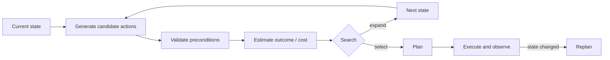

<section class="doc-hero">
  <p class="doc-hero__kicker">Agent 进阶</p>
  <h1>规划算法 Planning</h1>
  <p class="doc-hero__lead">Agent 规划要在状态、动作、约束和反馈之间搜索可执行路径。</p>
  <div class="doc-hero__meta" aria-label="本文信息">
    <span>适合阶段：复杂任务分解</span>
    <span>核心机制：State / Action / Search / Replan</span>
    <span>面试重点：搜索空间与可执行性</span>
  </div>
</section>

> 规划的难点不在列步骤，而在步骤能否被执行和修正。

## 面试官想考什么

读完这篇你要能正面回答下面这些题。每题后面括号里是面试官真正想看你答出什么。

<div class="interview-grid">
  <div>
    <strong>Agent 里的 planning 和普通任务拆解有什么区别？</strong>
    <span>考状态、动作前置条件、后置效果和反馈。</span>
  </div>
  <div>
    <strong>HTN、Tree of Thoughts、MCTS 在 LLM Agent 里分别怎么用？</strong>
    <span>考算法思想，而不是背名词。</span>
  </div>
  <div>
    <strong>为什么 LLM 生成的计划经常不可执行？</strong>
    <span>考工具约束、缺依赖、步骤粒度、环境变化。</span>
  </div>
  <div>
    <strong>规划时怎么控制搜索空间？</strong>
    <span>考 beam、启发式、深度限制、动作白名单。</span>
  </div>
  <div>
    <strong>什么时候需要 replan？什么时候只需要 retry？</strong>
    <span>考失败分类和状态更新。</span>
  </div>
  <div>
    <strong>计划质量怎么评估？</strong>
    <span>考 completeness、validity、cost、dependency violation。</span>
  </div>
  <div>
    <strong>规划算法和 Agent memory 有什么关系？</strong>
    <span>考长期偏好、历史失败、可复用技能。</span>
  </div>
</div>

---

## 为什么需要规划算法

让模型“列一个计划”很容易：

```text
1. 了解需求
2. 收集资料
3. 分析资料
4. 输出结果
```

这类计划在面试里拿不到分，因为它无法执行。真实 Agent 需要知道：

- 哪一步依赖哪一步。
- 每一步用哪个工具。
- 工具需要哪些参数。
- 执行后状态发生什么变化。
- 哪些失败需要重试，哪些失败需要改计划。

Tree of Thoughts 论文 [Deliberate Problem Solving with Large Language Models](https://arxiv.org/abs/2305.10601) 把中间思路组织成搜索树，允许模型探索、评估、回溯。RAP 论文 [Reasoning with Language Model is Planning with World Model](https://arxiv.org/abs/2305.14992) 把 LLM 当作世界模型来做规划。LATS 论文 [Language Agent Tree Search](https://arxiv.org/abs/2310.04406) 则把搜索、动作、环境反馈和反思结合起来。

这些方法背后的共同问题是：LLM 单次生成容易漏步，规划需要搜索和评估。

## Planning 是怎么工作的

把规划抽象成四个元素：

```text
state: 当前已经知道什么、完成什么
action: 可以做什么
transition: 做完 action 后状态如何变化
score: 哪条路径更接近目标、成本更低、风险更小
```

画成流程：



LLM 可以参与多个位置：生成候选动作、评估路径、总结状态、预测风险。但工具 schema、权限、预算和状态转移最好由代码约束。

## 核心原理 / 关键设计

### 1. 用前置条件和后置效果约束动作

动作不是一句“查资料”。它要有条件和效果。

```json
{
  "name": "send_refund_email",
  "preconditions": ["identity_verified", "refund_result_exists"],
  "effects": ["customer_notified"],
  "side_effect": true
}
```

没有前置条件，Planner 会安排“先发送邮件，再查询退款结果”这种错误顺序。

### 2. HTN 适合有固定领域结构的任务

HTN（Hierarchical Task Network）的想法是把高层任务逐层分解：

```text
处理退款
  - 验证身份
  - 查询订单
  - 判断退款路径
    - 自动退款
    - 创建人工工单
  - 通知用户
```

客服、运维、审批这类领域通常有稳定流程，HTN 很适合做外层骨架。LLM 可以负责填参数和处理开放问法。

### 3. ToT 适合需要探索候选思路的问题

Tree of Thoughts 把“中间思路”当成节点，扩展多个候选，再评分保留。

```text
goal: 修复 failing test
thought A: 可能是输入校验问题
thought B: 可能是缓存状态问题
thought C: 可能是测试数据过期
```

这类方法适合数学、代码调试、策略选择。限制也明显：搜索分支越多，成本越高；评分器如果不准，会保留错误路径。

### 4. MCTS / LATS 适合有环境反馈的任务

当 Agent 能执行动作并观察结果，树搜索就更有意义。

```text
node = state after running a command
edge = action such as edit file / run test / search docs
reward = tests passed, error count reduced, evidence found
```

LATS 把 language agent、tree search、environment feedback 和反思结合起来。面试回答可以说：这类方法适合代码修复、网页任务、游戏和交互环境；不适合每步执行成本很高、反馈很慢的任务。

### 5. Replan 要基于状态变化，而不是模型心情

常见失败类型：

```text
retry: 网络超时、临时限流
repair: 参数格式错、缺必填字段
replan: 目标前提变了、依赖结果不存在、工具不支持原计划
refuse: 权限不足、安全违规
```

区分这些类型，才能避免一失败就重规划，或者该重规划时还在重试。

## 怎么用：写一个有前置条件的规划搜索

下面代码用很小的状态空间演示 planning。它不追求模拟 LLM，只让你看清状态、动作、前置条件、效果和搜索。

```python
from dataclasses import dataclass
from collections import deque


@dataclass(frozen=True)
class Action:
    name: str
    requires: frozenset[str]
    adds: frozenset[str]
    cost: int = 1


ACTIONS = [
    Action("verify_identity", frozenset(), frozenset({"identity_verified"})),
    Action("lookup_order", frozenset({"identity_verified"}), frozenset({"order_loaded"})),
    Action("lookup_policy", frozenset({"order_loaded"}), frozenset({"policy_loaded"})),
    Action("refund_order", frozenset({"policy_loaded"}), frozenset({"refund_done"}), cost=3),
    Action("create_ticket", frozenset({"policy_loaded"}), frozenset({"ticket_created"}), cost=2),
    Action("notify_user", frozenset({"refund_done"}), frozenset({"user_notified"})),
]


def applicable(state: frozenset[str], action: Action) -> bool:
    return action.requires.issubset(state)


def plan(start: frozenset[str], goal: frozenset[str], max_depth: int = 6) -> list[str] | None:
    queue = deque([(start, [], 0)])
    best_seen = {start: 0}
    while queue:
        state, path, cost = queue.popleft()
        if goal.issubset(state):
            return path
        if len(path) >= max_depth:
            continue
        for action in ACTIONS:
            if not applicable(state, action):
                continue
            next_state = frozenset(set(state) | set(action.adds))
            next_cost = cost + action.cost
            if next_cost >= best_seen.get(next_state, 10**9):
                continue
            best_seen[next_state] = next_cost
            queue.append((next_state, path + [action.name], next_cost))
    return None


print(plan(frozenset(), frozenset({"user_notified"})))
print(plan(frozenset(), frozenset({"ticket_created"})))
```

输出：

```text
['verify_identity', 'lookup_order', 'lookup_policy', 'refund_order', 'notify_user']
['verify_identity', 'lookup_order', 'lookup_policy', 'create_ticket']
```

这段代码可以直接迁移到 Agent 面试回答：LLM 可以生成 action 候选，但 action 是否可用、状态如何变化、目标是否满足，应由系统检查。

## 容易踩的坑

### 坑 1：计划没有可执行动作

**现象**：计划看起来完整，执行时每步都要重新问模型“这一步怎么做”。

**根因**：计划只写自然语言，没有绑定工具和参数。

**修法**：每步输出 action schema。没有工具承接的步骤，要拆小或转人工。

### 坑 2：搜索空间失控

**现象**：ToT 或 MCTS 一开，成本暴涨，结果还不稳定。

**根因**：分支数、深度、评分调用都没有限制。

**修法**：设置 beam width、max depth、预算和早停；用规则先剪掉非法动作。

### 坑 3：评分器只看“像不像好计划”

**现象**：计划语言漂亮，但执行失败。

**根因**：评分只看自然语言质量，没有看前置条件、工具可用性、成本和风险。

**修法**：评分拆成 validity、coverage、cost、risk。能由代码验证的先用代码验证。

### 坑 4：重试和重规划混在一起

**现象**：网络超时就推翻计划，或者前提错了还在重复调用同一工具。

**根因**：失败类型没有分类。

**修法**：工具错误返回 `retryable`；状态冲突触发 replan；安全和权限问题直接拒绝或转人工。

### 坑 5：计划不记录版本

**现象**：任务跑了 20 分钟后失败，没人知道哪版计划导致的。

**根因**：plan、replan、step result 没有进入 trace。

**修法**：每次 plan 和 replan 都保存版本、触发原因、差异和执行结果。

## 与相似概念的区别

| 方法 | 思路 | 适合任务 | 风险 |
|---|---|---|---|
| Prompt task decomposition | 直接让模型列步骤 | 简单长任务 | 可执行性弱 |
| HTN | 高层任务逐层分解 | 领域流程稳定 | 需要人工建模 |
| Tree of Thoughts | 扩展多条思路并评分 | 推理、代码、策略选择 | 成本高，评分器难 |
| MCTS / LATS | 在环境反馈上做树搜索 | 可交互任务、代码修复 | 执行动作成本高 |
| Plan-and-Execute | 先计划再执行 | 报告、调研、多工具任务 | 计划过时 |

算法名称不重要，面试重点是你能否说清：状态是什么，动作有哪些，搜索怎么剪枝，反馈怎么改变计划。

## 面试题深度解析

**Q1: planning 和普通任务拆解有什么区别？**

- **30 秒版本**：任务拆解只列步骤；planning 要考虑状态、动作前置条件、后置效果、依赖、成本和失败恢复。
- **追问 1**：为什么 LLM 计划常不可执行？它会写出没有工具承接、缺参数、依赖顺序错的步骤。
- **追问 2**：怎么修？工具 schema 进入 planner 输入，输出后用代码验证 precondition 和 dependencies。

**Q2: ToT 和 MCTS 在 Agent 中怎么用？**

- **30 秒版本**：ToT 扩展多个候选思路并评分；MCTS 在可执行环境里按动作扩展状态树，并用反馈估计路径价值。
- **追问 1**：什么时候值得用？问题需要探索，且有可用评分或环境反馈时。
- **追问 2**：什么时候别用？动作昂贵、反馈慢、风险高、任务本来能用简单 workflow 解决时。

**Q3: 什么时候 replan？**

- **30 秒版本**：当前计划的前提被 observation 推翻时 replan；临时错误 retry；参数错误 repair；权限和安全问题拒绝或转人工。
- **追问 1**：怎么判断前提被推翻？依赖结果不存在、工具不支持原动作、目标约束变化、关键证据与计划假设冲突。
- **追问 2**：replan 会不会浪费已完成工作？不该浪费。Replanner 输入当前 state 和完成步骤，只替换受影响部分。

**Q4: 如何评估计划质量？**

- **30 秒版本**：看完整性、可执行性、依赖正确性、成本、风险和最终成功率。
- **追问 1**：有哪些指标？plan validity、step success rate、dependency violation rate、replan rate、average cost、task success。
- **追问 2**：怎么做回归？保存固定任务集和工具模拟器，每次改 planner prompt 或模型都回放。

## 延伸阅读

- 论文：[Tree of Thoughts](https://arxiv.org/abs/2305.10601) — 学习如何把中间思路组织成搜索树。
- 论文：[RAP](https://arxiv.org/abs/2305.14992) — 理解把语言模型当世界模型做规划的思路。
- 论文：[Language Agent Tree Search](https://arxiv.org/abs/2310.04406) — 看语言 Agent、树搜索、环境反馈和反思如何结合。
- 论文：[Plan-and-Solve Prompting](https://arxiv.org/abs/2305.04091) — 先规划再求解的基础提示方法。
- 论文：[DEPS](https://arxiv.org/abs/2302.01560) — 从开放世界多任务 Agent 角度看描述、解释、计划和选择。
