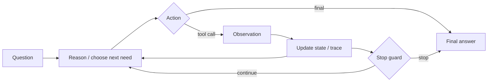

<section class="doc-hero">
  <p class="doc-hero__kicker">Agent 模式</p>
  <h1>ReAct 模式 Reasoning + Acting</h1>
  <p class="doc-hero__lead">ReAct 让模型在推理、行动、观察之间往返，用工具反馈修正下一步。</p>
  <div class="doc-hero__meta" aria-label="本文信息">
    <span>适合阶段：工具调用 Agent</span>
    <span>核心机制：Thought / Action / Observation</span>
    <span>面试重点：何时循环，何时停止</span>
  </div>
</section>

> ReAct 把“想一下”和“做一步”交替放进同一个循环。

## 面试官想考什么

读完这篇你要能正面回答下面这些题。每题后面括号里是面试官真正想看你答出什么。

<div class="interview-grid">
  <div>
    <strong>ReAct 和普通 function calling 有什么区别？</strong>
    <span>考多步观察反馈，而不是一次工具选择。</span>
  </div>
  <div>
    <strong>Thought 能不能暴露给用户？现代产品里怎么处理？</strong>
    <span>考 chain-of-thought 安全和可观测性取舍。</span>
  </div>
  <div>
    <strong>ReAct 为什么容易循环？怎么加停止条件？</strong>
    <span>考 max steps、重复动作检测、证据评分。</span>
  </div>
  <div>
    <strong>Observation 应该返回多长？返回原文还是结构化结果？</strong>
    <span>考上下文预算和工具契约。</span>
  </div>
  <div>
    <strong>ReAct 适合长任务吗？什么时候换 Plan-and-Execute？</strong>
    <span>考短视决策和长任务规划差异。</span>
  </div>
  <div>
    <strong>ReAct 里的工具失败如何处理？</strong>
    <span>考 retry、换工具、请求澄清、拒绝。</span>
  </div>
  <div>
    <strong>如何评估 ReAct Agent？</strong>
    <span>考轨迹评估：action、args、observation、final answer。</span>
  </div>
</div>

---

## 为什么需要 ReAct

直接问模型一个需要查证的问题，模型可能把“看起来合理”当成答案：

```text
用户：Acme Cloud 的企业版 SLA 是多少？如果达不到怎么赔付？
模型：企业版 SLA 通常是 99.9%，赔付以服务积分形式发放。
```

这句话听起来很像真的，但它没有查文档。普通 function calling 可以让模型调用一次 `search_docs`，但复杂问题往往需要多步：

```text
1. 先查 "Acme Cloud 企业版 SLA"。
2. 发现文档分成 "SLA" 和 "service credits" 两页。
3. 再查赔付规则。
4. 组合答案并引用来源。
```

ReAct 论文 [Synergizing Reasoning and Acting in Language Models](https://arxiv.org/abs/2210.03629) 提出的关键做法，就是把 reasoning traces 和 task-specific actions 交错生成。模型每一步先说明当前要解决的小问题，再执行动作，读取 observation 后继续。

这非常适合 Agent 工程面试。因为它把工具调用从“能调”变成“会根据结果继续调”。

## ReAct 是怎么工作的

ReAct 的经典格式是：

```text
Question: ...
Thought: 我需要先找到 SLA 数字。
Action: search_docs["Acme Cloud enterprise SLA"]
Observation: enterprise SLA is 99.95%.
Thought: 还需要查赔付规则。
Action: search_docs["Acme Cloud service credits"]
Observation: below SLA customers receive service credits...
Thought: 证据足够，可以回答。
Final: ...
```

画成工程流程就是：



现代系统里不一定把 `Thought` 原样暴露给用户。OpenAI、Anthropic 等模型产品通常不建议把完整 chain-of-thought 当作用户可见输出。工程上可以保存短的 action rationale 或 structured trace，比如“为什么调用这个工具”，但不要把私有推理逐字展示成产品解释。

## 核心原理 / 关键设计

### 1. Thought 是动作选择的中间层

ReAct 里的 Thought 不是写作文，它服务于动作选择。

```text
bad:
Thought: 我会仔细思考这个问题，因为它涉及很多因素。

better:
Thought: 需要先查企业版 SLA 数字。
Action: search_docs["enterprise SLA"]
```

面试回答里可以强调：Thought 应该短、可审计、指向下一步动作。它不应该变成冗长自言自语。

### 2. Action 必须从白名单选择

ReAct demo 常用文本解析 action，生产里要用结构化输出。

```json
{
  "action": "search_docs",
  "args": {"query": "enterprise SLA service credits"},
  "why": "需要赔付条款"
}
```

工具名、参数、权限和预算都由代码校验。模型生成的 action 是提案，不是命令。

### 3. Observation 要短而可引用

工具返回不宜直接塞整篇文档。

```json
{
  "source": "sla.md#enterprise",
  "text": "Enterprise plan monthly uptime commitment is 99.95%.",
  "score": 0.82
}
```

返回 source id 可以支持引用；返回 score 可以支持后续判断；返回短文本可以控制上下文。

### 4. Stop guard 要独立于模型

ReAct 论文展示了模型能根据 observation 继续推理，但工程上必须加外层 guard：

```python
if step >= max_steps:
    stop("max_steps")
if repeated_same_action(trace):
    stop("repeated_action")
if has_required_evidence(state):
    stop("ready_to_answer")
```

模型可以说“我还想查一下”，系统仍要根据预算和证据判断是否继续。

### 5. Trace 是评估对象

一次 ReAct 结果要保存：

```text
step, thought_summary, action, args, observation_id, latency, token_usage, stop_reason
```

评估时不要只看 final answer。错误可能在 action 选错、args 写错、observation 无关、重复调用、过早停止。

## 怎么用：写一个可控 ReAct loop

下面用标准库模拟 ReAct。`policy` 代替 LLM，重点是 loop 的结构：action 白名单、observation、停止条件、trace。

```python
from dataclasses import dataclass, field
from typing import Any


@dataclass
class Step:
    thought: str
    action: str
    args: dict[str, Any]
    observation: str = ""


@dataclass
class State:
    question: str
    evidence: dict[str, str] = field(default_factory=dict)
    trace: list[Step] = field(default_factory=list)
    stop_reason: str | None = None


DOCS = {
    "enterprise SLA": "sla.md: Enterprise plan monthly uptime commitment is 99.95%.",
    "service credits": "credits.md: If uptime falls below commitment, customers receive service credits.",
}


def search_docs(query: str) -> str:
    for key, value in DOCS.items():
        if key in query:
            return value
    return "no matching evidence"


def policy(state: State) -> Step:
    joined = " ".join(state.evidence.values())
    if "99.95%" not in joined:
        return Step("需要先查企业版 SLA 数字", "search_docs", {"query": "enterprise SLA"})
    if "service credits" not in joined:
        return Step("还需要查 SLA 未达标后的赔付规则", "search_docs", {"query": "service credits"})
    return Step("证据已覆盖 SLA 和赔付规则", "final", {})


def repeated_action(trace: list[Step], step: Step) -> bool:
    signature = (step.action, tuple(sorted(step.args.items())))
    seen = [(s.action, tuple(sorted(s.args.items()))) for s in trace]
    return seen.count(signature) >= 2


def run_react(question: str, max_steps: int = 5) -> State:
    state = State(question=question)
    for _ in range(max_steps):
        step = policy(state)
        if step.action == "final":
            state.trace.append(step)
            state.stop_reason = "ready_to_answer"
            return state
        if step.action != "search_docs":
            state.stop_reason = "invalid_action"
            return state
        if repeated_action(state.trace, step):
            state.stop_reason = "repeated_action"
            return state
        step.observation = search_docs(step.args["query"])
        state.trace.append(step)
        if step.observation != "no matching evidence":
            state.evidence[step.args["query"]] = step.observation
    state.stop_reason = "max_steps"
    return state


result = run_react("Acme Cloud 的企业版 SLA 是多少？达不到怎么赔付？")
print(result.stop_reason)
for item in result.trace:
    print(item.thought, "=>", item.action, item.args, "=>", item.observation)
```

这段代码的面试价值在 `repeated_action` 和 action validation。很多 ReAct demo 只展示 Thought / Action / Observation 格式，却没有防止循环和非法工具。

## 容易踩的坑

### 坑 1：把完整 Thought 展示给用户

**现象**：产品把模型内部推理全文显示出来，出现多余猜测、隐私信息或不稳定解释。

**根因**：把 ReAct 论文格式直接搬到用户界面。

**修法**：用户可见的是结论、引用和简短理由；系统 trace 保存 action rationale，不展示完整私有推理。

### 坑 2：Observation 太长

**现象**：工具返回一整页，几步后上下文爆掉，模型开始忽略早期证据。

**根因**：工具没有做摘要、截断和 source id。

**修法**：工具返回短证据片段、metadata、score、source。长文档交给 retriever/reranker 处理。

### 坑 3：没有动作重复检测

**现象**：Agent 一直搜索同一个 query，或不断换同义词搜索。

**根因**：ReAct 允许模型根据 observation 继续，但外层没有 stuck detector。

**修法**：记录 normalized action signature。重复超过阈值时停止、改写 query 或请求用户补充。

### 坑 4：Final answer 过早

**现象**：只查到 SLA 数字，还没查赔付规则，模型就回答完整问题。

**根因**：停止条件只看模型意愿，没有检查必需证据。

**修法**：把问题拆成 required slots，例如 `sla_number`、`credit_policy`。slots 没填满就不能 final。

### 坑 5：工具失败后继续编

**现象**：search 返回 no result，模型仍给出“通常是 99.9%”。

**根因**：observation 缺少失败语义，prompt 没有把拒绝当成合法输出。

**修法**：工具返回结构化错误；动作集合加入 `ask_user` 和 `refuse`；最终答案必须绑定 evidence id。

## 与相似概念的区别

| 模式 | 决策节奏 | 适合任务 | 主要限制 |
|---|---|---|---|
| 单次 function calling | 一次选择工具 | 简单查询、结构化 API | 观察反馈不足 |
| ReAct | 每步观察后再选动作 | 多步查询、工具探索、网页任务 | 容易循环，长任务成本高 |
| Plan-and-Execute | 先产计划，再执行步骤 | 长任务、步骤可预估 | 计划可能过时 |
| Workflow | 代码固定路径 | 高风险稳定流程 | 弹性弱 |
| Agent graph | 状态图控制节点跳转 | 复杂生产系统 | 设计和维护成本高 |

ReAct 适合作为最小工具 Agent 模式。任务很长、步骤依赖明显时，可以把外层换成 Plan-and-Execute 或状态图，局部节点仍用 ReAct。

## 面试题深度解析

**Q1: ReAct 和普通 function calling 有什么区别？**

- **30 秒版本**：function calling 常是一次性选工具；ReAct 会在 Thought / Action / Observation 之间多轮往返，根据工具反馈决定下一步。
- **追问 1**：为什么要多轮？因为一次工具结果可能只解决部分问题，或者暴露出新的子问题。
- **追问 2**：代价是什么？延迟、成本和循环风险上升，所以要有 max steps、重复检测和 evidence slots。

**Q2: Thought 能不能暴露？**

- **30 秒版本**：不建议暴露完整私有推理。可以给用户简短理由和引用，把详细 trace 留给开发者观测。
- **追问 1**：为什么？完整推理可能包含不稳定猜测、敏感内容、提示词细节，也可能让用户误解模型的确定性。
- **追问 2**：怎么保留可解释性？展示“我查了哪些来源、得到哪些证据、因此给出什么结论”，不要逐字展示内部推理。

**Q3: ReAct 怎么避免循环？**

- **30 秒版本**：max steps、timeout、重复 action signature、必需证据 slots、失败动作上限。
- **追问 1**：只靠 prompt 行不行？不行。停止条件要写在 loop 外层，由代码执行。
- **追问 2**：如果重复是合理的呢？区分相同参数重复和带新信息的补查。记录 normalized args，允许受控改写，不允许原地打转。

**Q4: ReAct 适合长任务吗？**

- **30 秒版本**：短到中等、多步观察反馈任务适合。长任务如果每步都重新思考，成本高且容易漂移。
- **追问 1**：什么时候换 Plan-and-Execute？任务目标清晰、步骤可拆、依赖关系明确，比如“调研竞品并生成报告”。
- **追问 2**：可以混合吗？可以。外层先规划，执行每个开放步骤时用 ReAct。

## 延伸阅读

- 论文：[ReAct](https://arxiv.org/abs/2210.03629) — 原始模式，重点看 HotpotQA、Fever、ALFWorld、WebShop 实验。
- 论文：[Toolformer](https://arxiv.org/abs/2302.04761) — 理解工具调用如何被语言模型纳入生成过程。
- 文档：[LangChain ReAct agents](https://python.langchain.com/docs/how_to/migrate_agent/) — 观察 ReAct 思想如何转成工具 Agent。
- 文档：[OpenAI Function Calling](https://platform.openai.com/docs/guides/function-calling) — 对比结构化工具调用和 ReAct loop 的关系。
- 文档：[Anthropic Building effective agents](https://www.anthropic.com/engineering/building-effective-agents) — 对比 routing、orchestrator、evaluator 等更高层模式。
