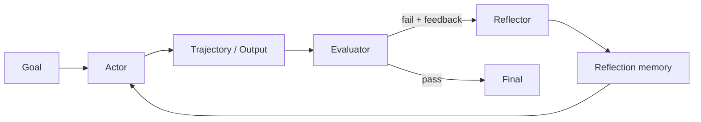

<section class="doc-hero">
  <p class="doc-hero__kicker">Agent 进阶</p>
  <h1>自我反思 Reflexion / Self-Refine</h1>
  <p class="doc-hero__lead">Reflexion 把失败反馈写成可复用经验，让下一次尝试少犯同样的错。</p>
  <div class="doc-hero__meta" aria-label="本文信息">
    <span>适合阶段：多轮尝试与失败复盘</span>
    <span>核心机制：Actor / Evaluator / Reflector / Memory</span>
    <span>面试重点：反思质量与评估信号</span>
  </div>
</section>

> 反思要把失败原因变成下一轮约束。

## 面试官想考什么

读完这篇你要能正面回答下面这些题。每题后面括号里是面试官真正想看你答出什么。

<div class="interview-grid">
  <div>
    <strong>Reflexion 和普通 retry 有什么区别？</strong>
    <span>考失败反馈是否写入长期或短期经验。</span>
  </div>
  <div>
    <strong>Reflexion 需要什么 evaluator？没有反馈信号还能用吗？</strong>
    <span>考自动评测、工具反馈、人工反馈和弱监督。</span>
  </div>
  <div>
    <strong>Self-Refine、CRITIC、Reflexion 的差异是什么？</strong>
    <span>考自反馈、工具交互批判、语言反思记忆。</span>
  </div>
  <div>
    <strong>反思内容应该怎么存？存自然语言还是结构化字段？</strong>
    <span>考 memory schema、检索和污染控制。</span>
  </div>
  <div>
    <strong>反思可能带来什么坏处？</strong>
    <span>考错误经验、过拟合、循环自证、成本。</span>
  </div>
  <div>
    <strong>代码 Agent 里 Reflexion 怎么落到工程上？</strong>
    <span>考测试失败、patch、错误摘要、下一轮约束。</span>
  </div>
  <div>
    <strong>Reflexion 怎么评估？</strong>
    <span>考 first-pass success、retry success、reflection usefulness。</span>
  </div>
</div>

---

## 为什么需要 Reflexion

很多 Agent 失败后会直接重试：

```text
attempt 1: 生成 SQL，执行失败：column "total" does not exist
attempt 2: 重新生成 SQL，仍然使用 total
attempt 3: 继续失败
```

这不是学习，只是重复采样。真正有价值的是把失败写成下一轮约束：

```text
reflection:
表 orders 没有 total 字段，金额字段叫 amount_cents。下一次生成 SQL 时必须使用 amount_cents，并除以 100 输出美元。
```

Reflexion 论文 [Language Agents with Verbal Reinforcement Learning](https://arxiv.org/abs/2303.11366) 提出让语言 Agent 从失败轨迹中生成 verbal reflection，并把它放进 episodic memory，下一轮尝试时一起输入。Self-Refine 论文 [Iterative Refinement with Self-Feedback](https://arxiv.org/abs/2303.17651) 则强调模型可以对自己的输出给 feedback，再 refine。CRITIC 论文 [Large Language Models Can Self-Correct with Tool-Interactive Critiquing](https://arxiv.org/abs/2305.11738) 把外部工具接入批判过程，比如用搜索、代码执行、约束检查来指出错误。

面试里要抓住一点：反思不是“模型再想想”。它需要反馈信号、反思生成、记忆注入和下一轮验证。

## Reflexion 是怎么工作的

典型结构是四个角色：



一次循环可以写成：

```text
1. Actor 尝试完成任务。
2. Evaluator 用测试、规则、工具或人工反馈判断结果。
3. Reflector 读取失败轨迹，生成可执行反思。
4. 下一次 Actor 带着反思重试。
```

Evaluator 决定反思质量。如果反馈只是一句“错了”，反思会很空；如果反馈包含错误位置、缺失条件、失败输入，反思才有用。

## 核心原理 / 关键设计

### 1. 反思必须绑定具体失败

空泛反思没有价值：

```text
bad:
下次要更加仔细，注意边界情况。

better:
测试 test_refund_partial_shipment 失败，因为代码把 partially_shipped 当成不可退款。政策允许退未发货部分，下次要分开计算 shipped 和 unshipped items。
```

反思要包含失败样本、根因、下一轮约束。没有这三项，就很难被复用。

### 2. Evaluator 比 Reflector 更关键

Reflexion 需要可置信反馈：

```text
代码任务：单元测试、lint、类型检查
RAG 任务：引用支持、answer correctness、retrieval recall
网页任务：页面状态、按钮是否点击成功
客服任务：规则引擎、人工审核、用户确认
```

没有 evaluator 时，可以用 LLM judge，但要有 rubric 和人工校准。否则 reflector 很容易编一个看似合理的失败原因。

### 3. 反思记忆要可检索、可过期

不要把每次失败全文塞进 prompt。更好的格式：

```json
{
  "task_type": "sql_generation",
  "failure": "unknown_column_total",
  "lesson": "orders 表金额字段是 amount_cents，不是 total",
  "applies_when": ["query_orders", "revenue_sql"],
  "created_at": "2026-06-01",
  "confidence": 0.92
}
```

下次任务来了，根据 task_type、schema、error_code 检索相关反思。过期 schema 或低质量反思要能删除。

### 4. Reflection 不能替代修复验证

反思只是下一轮约束，修复后还要跑 evaluator。

```text
fail -> reflect -> retry -> evaluate
```

如果 retry 后不验证，反思会变成自我安慰。代码 Agent 必须跑测试；RAG Agent 必须查引用；工具 Agent 必须看环境状态。

### 5. 反思要控制写入权限

不是每次失败都值得写长期记忆：

```text
写短期反思：一次性任务、临时网络错误、用户本轮偏好
写长期反思：稳定 schema、长期用户偏好、可复用技能、真实失败模式
拒绝写入：敏感信息、未经确认的推断、明显过期信息
```

这个边界和记忆架构强相关。写错长期记忆，会让 Agent 之后持续犯错。

## 怎么用：实现一个 Reflexion retry loop

下面代码模拟 SQL 生成任务。第一次使用错误字段，测试反馈进入 reflection，第二次根据 reflection 修正。

```python
from dataclasses import dataclass, field


SCHEMA = {"orders": ["id", "amount_cents", "status"]}


@dataclass
class Attempt:
    sql: str
    feedback: str
    passed: bool


@dataclass
class AgentState:
    reflections: list[str] = field(default_factory=list)
    attempts: list[Attempt] = field(default_factory=list)


def actor(question: str, reflections: list[str]) -> str:
    memory = " ".join(reflections)
    if "amount_cents" in memory:
        return "SELECT SUM(amount_cents) / 100.0 AS revenue FROM orders;"
    return "SELECT SUM(total) AS revenue FROM orders;"


def evaluate(sql: str) -> tuple[bool, str]:
    if "total" in sql:
        return False, "column total does not exist; use orders.amount_cents"
    if "amount_cents" not in sql:
        return False, "missing amount_cents"
    return True, "query passed schema check"


def reflect(attempt: Attempt) -> str:
    if "total does not exist" in attempt.feedback:
        return "orders 表没有 total 字段；收入查询必须使用 amount_cents，并除以 100。"
    return "保留失败反馈，下一轮先检查 schema。"


def solve(question: str, max_attempts: int = 3) -> AgentState:
    state = AgentState()
    for _ in range(max_attempts):
        sql = actor(question, state.reflections)
        passed, feedback = evaluate(sql)
        attempt = Attempt(sql, feedback, passed)
        state.attempts.append(attempt)
        if passed:
            return state
        state.reflections.append(reflect(attempt))
    return state


result = solve("统计订单收入")
for index, attempt in enumerate(result.attempts, 1):
    print(index, attempt.passed, attempt.sql, attempt.feedback)
print(result.reflections)
```

这段代码里有三个可迁移点：反馈来自 evaluator，反思写进 memory，下一轮 actor 会读取 memory。真实系统里 actor 和 reflector 可以用 LLM，但 evaluator 最好尽量工具化。

## 容易踩的坑

### 坑 1：把“再试一次”当反思

**现象**：失败后 prompt 加一句“请认真检查”，结果仍错。

**根因**：没有把失败根因变成具体约束。

**修法**：反思格式固定为 failure、root cause、next constraint。少写鸡汤，多写可验证规则。

### 坑 2：没有可靠 evaluator

**现象**：Reflector 生成一段很像样的总结，但根因是错的。

**根因**：没有测试、工具、人工反馈，只靠模型自评。

**修法**：优先使用可执行反馈。代码跑测试，SQL 查 schema，RAG 查引用，网页任务看 DOM 状态。

### 坑 3：长期记忆被污染

**现象**：一次临时失败被写成长期经验，之后所有任务都受影响。

**根因**：反思写入没有置信度、适用范围和过期机制。

**修法**：反思加 `applies_when`、`confidence`、`ttl`。低置信反思只放短期上下文。

### 坑 4：反思持续变长

**现象**：每次尝试都把所有历史反思塞进 prompt，成本上升且模型注意力分散。

**根因**：没有反思检索和压缩。

**修法**：按任务类型和错误码检索 top-k；定期合并重复反思；过期记忆清理。

### 坑 5：反思绕过安全策略

**现象**：Agent 记住“下次直接跳过确认更快”，后续触发高风险动作。

**根因**：反思被当成高优先级指令，盖过系统策略。

**修法**：memory 永远低于 system policy。反思只能建议，不能改变权限和安全边界。

## 与相似概念的区别

| 概念 | 输入反馈 | 是否写记忆 | 适合任务 | 风险 |
|---|---|---:|---|---|
| Retry | 失败信号很少 | 否 | 临时失败 | 重复犯错 |
| Self-Refine | 模型自评反馈 | 通常短期 | 文本改写、结构优化 | 自评偏差 |
| CRITIC | 工具交互批判 | 可短期 | 事实核查、代码、约束检查 | 工具成本 |
| Reflexion | evaluator + verbal reflection | 是 | 多轮尝试、可复用经验 | 记忆污染 |
| RL fine-tuning | 奖励信号 | 写入参数 | 大规模稳定任务 | 训练成本高 |

Reflexion 适合没有训练预算，但有可用反馈和多轮尝试空间的任务。

## 面试题深度解析

**Q1: Reflexion 和普通 retry 有什么区别？**

- **30 秒版本**：retry 只是重新尝试；Reflexion 会根据失败轨迹生成反思，并把反思注入下一轮尝试。
- **追问 1**：为什么反思有用？它把失败压缩成下一轮约束，减少重复错误。
- **追问 2**：什么时候没用？没有可靠 evaluator、任务没有重试空间、失败原因不可观察时，反思收益很低。

**Q2: 反思内容怎么存？**

- **30 秒版本**：短期反思放本轮上下文，长期反思写 memory store。建议结构化保存 failure、lesson、applies_when、confidence、ttl。
- **追问 1**：自然语言可以吗？可以，但要有 metadata，否则检索和清理很难。
- **追问 2**：怎么防污染？低置信反思只短期使用；长期写入需要 evaluator 通过或人工确认。

**Q3: Self-Refine、CRITIC、Reflexion 怎么区分？**

- **30 秒版本**：Self-Refine 偏自反馈和改写；CRITIC 用外部工具做批判；Reflexion 把失败经验写进记忆，影响后续尝试。
- **追问 1**：哪个更适合代码 Agent？CRITIC 和 Reflexion组合更实用：测试给反馈，反思总结失败，下轮修改。
- **追问 2**：哪个更适合文本润色？Self-Refine 成本更低。

**Q4: Reflexion 怎么评估？**

- **30 秒版本**：看加入反思后 retry success 是否提升，重复错误是否下降，平均尝试次数和成本是否可接受。
- **追问 1**：怎么做 ablation？同一任务集跑 no-reflection、short-term reflection、long-term reflection 三组。
- **追问 2**：怎么评估反思本身？人工或 judge 标注 root cause 是否正确、next constraint 是否可执行、是否被下一轮用到。

## 延伸阅读

- 论文：[Reflexion](https://arxiv.org/abs/2303.11366) — 语言反思作为 verbal reinforcement 的代表工作。
- 论文：[Self-Refine](https://arxiv.org/abs/2303.17651) — 看反馈和 refinement 如何在同一模型内迭代。
- 论文：[CRITIC](https://arxiv.org/abs/2305.11738) — 学习如何用外部工具增强自我纠错。
- 论文：[Voyager](https://arxiv.org/abs/2305.16291) — 观察 Agent 如何把成功代码写进技能库，实现长期改进。
- 论文：[Generative Agents](https://arxiv.org/abs/2304.03442) — 理解 observation、reflection、planning、memory 的组合。
