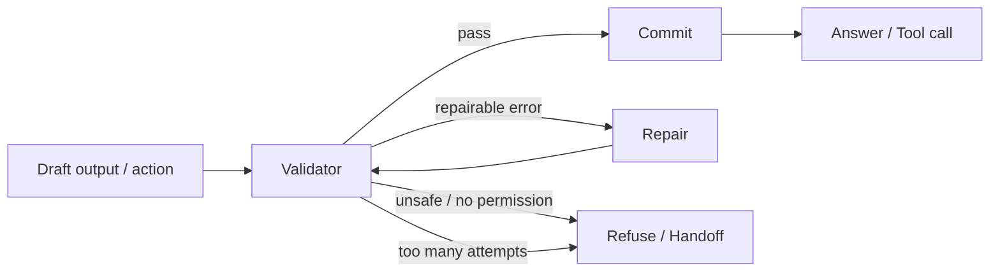

<section class="doc-hero">
  <p class="doc-hero__kicker">Agent 工程化</p>
  <h1>自我纠错 Self-Correction</h1>
  <p class="doc-hero__lead">自我纠错要用验证器、工具反馈和回滚机制把错误挡在输出前。</p>
  <div class="doc-hero__meta" aria-label="本文信息">
    <span>适合阶段：输出可靠性与安全</span>
    <span>核心机制：Detect / Repair / Verify / Commit</span>
    <span>面试重点：纠错需要外部信号</span>
  </div>
</section>

> 能纠错的 Agent，必须先知道错在哪里。

## 面试官想考什么

读完这篇你要能正面回答下面这些题。每题后面括号里是面试官真正想看你答出什么。

<div class="interview-grid">
  <div>
    <strong>LLM 自我纠错为什么经常不可靠？</strong>
    <span>考没有外部验证信号时的自评偏差。</span>
  </div>
  <div>
    <strong>Self-correction 和 Reflexion 有什么区别？</strong>
    <span>考本轮修复和跨轮经验写入的差异。</span>
  </div>
  <div>
    <strong>纠错 loop 应该怎么设计？</strong>
    <span>考 detect、repair、verify、commit、rollback。</span>
  </div>
  <div>
    <strong>哪些错误适合自动纠正，哪些必须拒绝或转人工？</strong>
    <span>考风险分级和副作用控制。</span>
  </div>
  <div>
    <strong>结构化输出纠错怎么做？</strong>
    <span>考 schema validation、json repair、typed output。</span>
  </div>
  <div>
    <strong>代码 Agent 自我纠错怎么实现？</strong>
    <span>考单测、lint、patch、回滚、diff 审计。</span>
  </div>
  <div>
    <strong>怎么评估纠错机制有没有帮忙？</strong>
    <span>考 first-pass vs after-repair、false repair、cost。</span>
  </div>
</div>

---

## 为什么需要 Self-Correction

Agent 最常见的失败，往往是输出只差一点：

```json
{
  "order_id": "O-1389",
  "refund_amount": "128.00",
  "currency": "USD",
  "notify_user": "yes"
}
```

如果后端 schema 要求 `refund_amount` 是 number，`notify_user` 是 boolean，这个输出会失败。简单做法是把错误返回给模型：“请修复 JSON”。这能解决一部分问题，但远远不够。

更危险的是带副作用的错误：

```text
Agent 以为订单可退，直接调用 refund_order。
工具返回：policy_violation，部分发货订单需要人工审核。
Agent 继续尝试另一个退款接口。
```

这类错误不能靠“再想想”。要有验证器挡住非法动作，有回滚或拒绝路径，有最大修复次数。

Self-Refine、CRITIC、Reflexion 这些工作都在解决类似问题：模型输出后，用反馈、批判或外部工具修正。CRITIC 特别强调 tool-interactive critiquing，即用外部工具发现模型自己看不到的错。

## Self-Correction 是怎么工作的

一个可靠纠错 loop 可以写成：



这里最该盯住的是 `Validator`。没有 validator，模型只能靠自评；有 validator，纠错才有锚点。

Validator 可以是：

- JSON schema、Pydantic、类型检查。
- 单元测试、lint、静态分析。
- SQL explain、权限检查、业务规则引擎。
- RAG 引用校验、事实核查工具。
- 人工审批。

## 核心原理 / 关键设计

### 1. 先分类错误，再决定能否修

错误可以分成：

```text
repairable: JSON 格式错、缺字段、类型错、引用格式错
retryable: 网络超时、限流、临时服务错误
needs_context: 缺用户输入、缺权限、缺证据
unsafe: 越权、泄露隐私、高风险副作用
```

只有 repairable 才适合自动修。unsafe 应直接拒绝或转人工。

### 2. 修复提示要带具体错误

不要只说“输出格式不对”。要把 validator 的错误精确传回：

```text
字段 notify_user 期望 boolean，但收到 string "yes"。
字段 refund_amount 期望 number，但收到 string "128.00"。
只返回 JSON，不要解释。
```

错误越具体，修复越稳定。

### 3. Commit 前再验证一次

修复后的输出不能直接执行。必须重新跑 validator。

```text
draft -> validate fail -> repair -> validate pass -> commit
```

带副作用动作还要在 commit 前做权限和人工确认。

### 4. 自动修复要有次数上限

常见配置：

```text
max_repair_attempts = 2
max_total_tokens = ...
stop_reason = validation_failed | unsafe | success
```

超过次数后不要继续“修到天荒地老”。返回错误、请求澄清，或交给人工。

### 5. 纠错结果要进入评估

记录这些指标：

```text
first_pass_valid_rate
after_repair_valid_rate
repair_attempts_avg
false_repair_rate
unsafe_block_rate
cost_per_success
```

如果 after-repair 提升很少但成本增加很多，说明 validator 或 repair prompt 需要重写。

## 怎么用：结构化输出纠错 loop

下面代码用标准库实现一个 JSON validator 和 repair。真实项目里 repair 可以由 LLM 做，这里用确定性函数演示流程。

```python
import json
from dataclasses import dataclass
from typing import Any


@dataclass
class ValidationResult:
    ok: bool
    errors: list[str]


def validate_refund(payload: dict[str, Any]) -> ValidationResult:
    errors = []
    if not isinstance(payload.get("order_id"), str):
        errors.append("order_id must be string")
    amount = payload.get("refund_amount")
    if not isinstance(amount, (int, float)):
        errors.append("refund_amount must be number")
    elif amount <= 0:
        errors.append("refund_amount must be positive")
    if not isinstance(payload.get("currency"), str):
        errors.append("currency must be string")
    if not isinstance(payload.get("notify_user"), bool):
        errors.append("notify_user must be boolean")
    return ValidationResult(not errors, errors)


def repair(payload: dict[str, Any], errors: list[str]) -> dict[str, Any]:
    fixed = dict(payload)
    if "refund_amount must be number" in errors:
        fixed["refund_amount"] = float(fixed["refund_amount"])
    if "notify_user must be boolean" in errors:
        fixed["notify_user"] = str(fixed["notify_user"]).lower() in {"yes", "true", "1"}
    return fixed


def correction_loop(raw: str, max_repairs: int = 2) -> tuple[dict[str, Any] | None, str, list[str]]:
    try:
        payload = json.loads(raw)
    except json.JSONDecodeError as exc:
        return None, "invalid_json", [str(exc)]

    all_errors: list[str] = []
    for _ in range(max_repairs + 1):
        result = validate_refund(payload)
        if result.ok:
            return payload, "success", all_errors
        all_errors.extend(result.errors)
        payload = repair(payload, result.errors)
    return None, "validation_failed", all_errors


raw_output = '{"order_id":"O-1389","refund_amount":"128.00","currency":"USD","notify_user":"yes"}'
payload, status, errors = correction_loop(raw_output)
print(status)
print(payload)
print(errors)
```

这段代码可以替换成 LLM repair，但外壳不要变：validate、repair、validate、commit。面试时你可以把它映射到代码 Agent：生成 patch、跑测试、根据失败修 patch、再跑测试，通过后再提交。

## 容易踩的坑

### 坑 1：没有外部验证信号

**现象**：模型自称已修复，但实际输出仍不符合要求。

**根因**：纠错只靠模型自评，没有 schema、测试或工具检查。

**修法**：每类任务配 validator。能用代码验证的，不交给模型猜。

### 坑 2：纠错 loop 没有上限

**现象**：同一个 JSON 来回修，成本持续上升。

**根因**：没有 max repair attempts 和 stop reason。

**修法**：设置尝试次数和预算；失败后返回可读错误或请求澄清。

### 坑 3：把 unsafe 当 repairable

**现象**：越权动作被模型改个参数后继续执行。

**根因**：错误分类粗糙，安全错误进入自动修复。

**修法**：permission、privacy、payment、delete、send message 这类错误直接拒绝或人工确认。

### 坑 4：修复后不重新验证

**现象**：第一次修复解决了字段类型，又引入缺字段。

**根因**：repair 输出被直接 commit。

**修法**：任何修复结果都回到 validator。通过 validator 后才进入 commit。

### 坑 5：纠错破坏原任务意图

**现象**：为了满足 schema，模型把未知字段随便填成默认值。

**根因**：validator 只看格式，不看语义。

**修法**：区分缺失和可推断。不能推断的字段请求用户或上游工具，不要伪造默认值。

## 与相似概念的区别

| 概念 | 时间范围 | 依赖信号 | 适合问题 |
|---|---|---|---|
| Output validation | 输出前检查 | schema / rule | 格式、类型、字段 |
| Self-correction | 本轮修复 | validator / tool feedback | 可修复错误 |
| Reflexion | 跨轮改进 | evaluator + memory | 重复失败模式 |
| Guardrails | 动作边界 | policy / permission | 安全、合规、越权 |
| Human review | 人工判断 | 人类专家 | 高风险和模糊问题 |

Self-correction 适合挡住“可自动确认的错误”。没有验证信号的高风险判断，不应该包装成自动纠错。

## 面试题深度解析

**Q1: LLM 自我纠错为什么经常不可靠？**

- **30 秒版本**：没有外部信号时，模型可能无法判断自己错在哪里，只会生成另一版看似合理的答案。
- **追问 1**：怎么提高可靠性？引入 validator：schema、测试、工具、规则、引用检查、人工审核。
- **追问 2**：所有错误都能纠吗？不能。安全、权限、支付、删除这类错误要拒绝或人工确认。

**Q2: Self-correction 和 Reflexion 有什么区别？**

- **30 秒版本**：Self-correction 解决本轮输出错误；Reflexion 把失败经验写入记忆，影响后续任务。
- **追问 1**：代码 Agent 里怎么组合？本轮 patch 失败后先根据测试修复；多次出现同类错误，再写 reflection。
- **追问 2**：哪个更容易评估？Self-correction 更容易，因为 validator 直接给 pass/fail。

**Q3: 纠错 loop 怎么设计？**

- **30 秒版本**：draft、validate、repair、validate、commit。中间加错误分类、尝试上限和安全拦截。
- **追问 1**：修复提示怎么写？带具体错误、原输出、目标 schema、输出格式要求。
- **追问 2**：怎么防止伪造默认值？validator 区分 missing、invalid、unknown。缺信息时请求用户或工具，不自动编。

**Q4: 怎么评估纠错机制？**

- **30 秒版本**：看 first-pass valid rate、after-repair valid rate、平均修复次数、false repair、成本和延迟。
- **追问 1**：如果 after-repair 提升不大怎么办？先看错误是否 repairable，再看 repair prompt 是否拿到具体 validator errors。
- **追问 2**：怎么做回归？保存一组坏输出样本，每次改模型或 prompt 都跑 correction suite。

## 延伸阅读

- 论文：[Self-Refine](https://arxiv.org/abs/2303.17651) — 理解反馈和修复如何迭代。
- 论文：[CRITIC](https://arxiv.org/abs/2305.11738) — 学习用工具交互做批判和纠错。
- 论文：[Reflexion](https://arxiv.org/abs/2303.11366) — 区分本轮纠错和跨轮反思记忆。
- 文档：[OpenAI Structured Outputs](https://platform.openai.com/docs/guides/structured-outputs) — 结构化输出和 schema 约束的工程入口。
- 文档：[Anthropic Building effective agents](https://www.anthropic.com/engineering/building-effective-agents) — evaluator-optimizer 模式与纠错 loop 关系很近。
