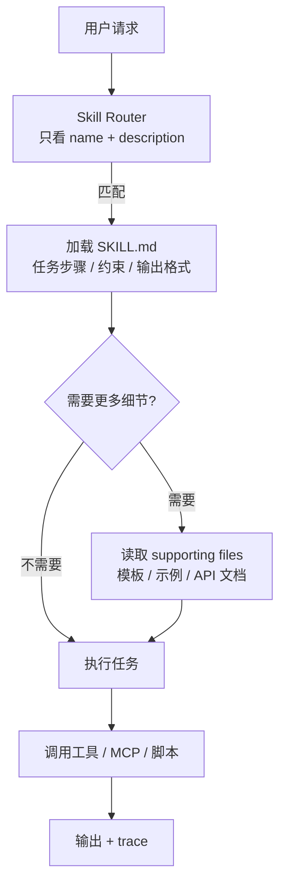

<section class="doc-hero">
  <p class="doc-hero__kicker">Agent 核心理论</p>
  <h1>Agent Skills：把经验做成可加载能力</h1>
  <p class="doc-hero__lead">Skill 不是一个新工具，而是让 Agent 按需加载任务经验的工程单元。</p>
  <div class="doc-hero__meta" aria-label="本文信息">
    <span>适合阶段：Agent 进阶 / 团队工程化</span>
    <span>核心机制：Progressive Disclosure</span>
    <span>面试重点：Skill / Tool / MCP / Subagent 边界</span>
  </div>
</section>

> Skill 把"怎么做一类任务"从聊天记录里抽出来，变成可版本化、可复用、可测试的能力包。

> **本文边界**：本文讲 Skill 作为 Agent 能力组织方式。工具执行细节看 [自定义工具开发](../tools/custom-tools)，MCP 协议层看 [MCP 详解](../tools/mcp)，长期状态看 [记忆架构](./memory-arch)，Claude 官方文章导读看 [Agent Skills](../industry/anthropic/equipping-agents-for-the-real-world-with-agent-skills)。

## 面试官想考什么

<div class="interview-grid">
  <div>
    <strong>Skill 和 Tool 到底差在哪？为什么不能都写成 function calling？</strong>
    <span>考你能否区分流程知识和执行接口。</span>
  </div>
  <div>
    <strong>为什么 Skill 要按需加载，而不是全部塞进 system prompt？</strong>
    <span>考上下文成本、位置偏置和上下文污染。</span>
  </div>
  <div>
    <strong>一个好的 SKILL.md 应该写什么，不该写什么？</strong>
    <span>考面向模型的文档设计，而不是给人写 README。</span>
  </div>
  <div>
    <strong>Skill 的 description 为什么比正文还关键？</strong>
    <span>考触发路由。description 写烂，正文再好也不会被加载。</span>
  </div>
  <div>
    <strong>Skill、MCP Server、Subagent、Memory 怎么组合？</strong>
    <span>考系统分层：知识、工具、执行者、状态各归各位。</span>
  </div>
  <div>
    <strong>Skill 会不会变成新的 prompt injection 入口？怎么防？</strong>
    <span>考供应链、权限和工作区信任。</span>
  </div>
  <div>
    <strong>Skill 更新后怎么避免回归？</strong>
    <span>考测试、版本、评估集和变更审查。</span>
  </div>
</div>

---

## 为什么需要 Skills

一个团队做了客服 Agent，最开始只给它一段 system prompt：

```text
你是客服助手。处理退款时先查订单，再查政策。
如果是海外订单要看跨境退货规则。
如果用户是企业客户要看合同。
如果订单包含赠品要先撤销赠品库存。
如果用户提到发票要同步开票系统。
如果金额超过 500 元要转人工。
如果工具失败要重试 2 次。
如果用户情绪激动要安抚。
如果是 VIP 用户要升级优先级。
...
```

这段 prompt 越写越长，问题不是 token 多这么简单。

更严重的是：模型每一轮都要读全部规则，哪怕用户只是问"我的订单什么时候到"。久了以后，规则之间开始互相干扰。模型可能在普通物流问题里突然套用退款流程，也可能在跨境退款时忘了企业合同，因为那条规则被埋在中间。

Skill 解决的是这个问题：**把稳定的任务流程拆成可发现、可加载、可维护的小能力包**。退款用退款 Skill，发票用发票 Skill，合同审查用合同 Skill。模型只在需要时加载对应 Skill，而不是每轮背着整本操作手册。

Anthropic 的 Claude Code Skills 文档把这种机制叫 progressive disclosure：先让模型看到短 description，匹配到任务后再加载 `SKILL.md`，复杂细节继续放到 supporting files 里按需读取。这个设计的关键不在"多了一个 Markdown 文件"，而在**上下文加载从常驻变成按需**。

## Skills 是怎么工作的

Skill 实际做三件事：暴露触发描述、加载任务说明、引用外部材料。



一个典型 Skill 目录长这样：

```text
.claude/skills/review-api-change/
├── SKILL.md
├── checklist.md
├── examples/
│   └── risky-change.md
└── scripts/
    └── inspect_openapi.py
```

`SKILL.md` 不是把所有资料复制进去，而是做导航：

```markdown
---
name: review-api-change
description: Review API schema changes for backward compatibility, auth impact, and client breakage.
allowed-tools: Read Grep Bash
---

## Task

Review an API change before merge.

## Steps

1. Read the changed OpenAPI files.
2. Compare removed fields, renamed paths, auth changes, and response status changes.
3. If the diff is large, run `scripts/inspect_openapi.py`.
4. Report only blocking risks and required follow-up tests.

## Additional resources

- Compatibility checklist: [checklist.md](checklist.md)
- Example report: [examples/risky-change.md](examples/risky-change.md)
```

面试里要抓住这个点：**Skill 的主体不是知识库，而是任务执行协议**。它告诉 Agent 什么时候用、怎么做、用哪些材料、在哪里停。

## 核心原理 / 关键设计

### 1. description 是路由器，不是营销文案

Skill 是否会被加载，主要看 description 能不能和用户意图匹配。写得太泛会误触发，写得太窄会漏触发。

```yaml
# 太泛：几乎所有开发任务都会误触发
description: Helps with backend development.

# 更好：写清任务、触发词和边界
description: Review database migration changes for data loss, locking risk, rollback safety, and required backfill steps.
```

这里的设计逻辑和 tool schema 一样：description 是给模型做选择的，不是给人类展示的。它要包含可判别信号，比如 "database migration"、"data loss"、"rollback"。

### 2. SKILL.md 要短，细节放 supporting files

Skill 一旦加载，正文会留在上下文里。把 2000 行规范塞进 `SKILL.md`，等于每轮都拖着一本手册。

```text
SKILL.md               # 触发、步骤、边界、输出格式
references/policy.md   # 完整政策，需要时读
examples/good.md       # 输出样例，需要时读
scripts/validate.py    # 可执行检查，不塞进 prompt
```

Claude Code 文档也建议把详细参考材料放进 supporting files，并从 `SKILL.md` 指向它们。这样模型先读任务骨架，只有遇到细节问题才读完整资料。

### 3. Skill 可以调用工具，但不要把工具定义写进 Skill

Skill 是"怎么组合工具"，Tool 是"能做什么动作"。

```markdown
## Steps

1. Use `Read` to inspect changed schema files.
2. Use `Bash` to run `python scripts/check_breaking_changes.py`.
3. If the script reports removed fields, verify whether a migration note exists.
```

不要在 Skill 里重新解释 Bash 怎么工作，也不要复制 MCP tool 的 JSON schema。工具定义归工具层，Skill 只引用它们。

### 4. 有副作用的 Skill 要限制模型自动触发

部署、发邮件、删数据这类 Skill 不能让模型自己看到"好像该做"就执行。

```yaml
---
name: deploy-production
description: Deploy a verified release to production after explicit user request.
disable-model-invocation: true
allowed-tools: Bash Read
---
```

这个设计背后是权限分层：低风险 Skill 可以自动触发，高风险 Skill 必须用户显式调用。否则 Skill 会变成"包装后的危险工具"。

### 5. 重要 Skill 必须有测试

Skill 是代码旁边的流程资产，也会回归。测试不一定复杂，至少要覆盖三类 case：

```text
tests/
├── normal-input.md       # 应该触发
├── near-miss.md          # 不应该触发
└── risky-output.md       # 输出必须包含风险项
```

很多团队只测试工具，不测试 Skill。结果工具都正常，Agent 还是走错流程，因为 Skill description 写偏了、输出格式没约束、步骤顺序被模型改了。

## 怎么用：写一个最小 Skill Router

下面这段代码不模拟大模型，只演示 Skill 的核心工程动作：读取 `SKILL.md`、用 description 做粗路由、按需加载正文。它可以直接运行。

```python
from dataclasses import dataclass
from pathlib import Path
import re
import tempfile


@dataclass
class Skill:
    name: str
    description: str
    body: str
    path: Path


def parse_skill(path: Path) -> Skill:
    text = path.read_text(encoding="utf-8")
    match = re.match(r"---\n(.*?)\n---\n(.*)", text, re.S)
    if not match:
        raise ValueError(f"{path} missing YAML frontmatter")

    frontmatter, body = match.groups()
    fields = {}
    for line in frontmatter.splitlines():
        if ":" in line:
            key, value = line.split(":", 1)
            fields[key.strip()] = value.strip().strip('"')

    return Skill(
        name=fields.get("name", path.parent.name),
        description=fields["description"],
        body=body.strip(),
        path=path,
    )


def score(query: str, skill: Skill) -> int:
    words = set(re.findall(r"[a-zA-Z0-9_-]+", query.lower()))
    desc = set(re.findall(r"[a-zA-Z0-9_-]+", skill.description.lower()))
    return len(words & desc)


def choose_skill(query: str, skills_dir: Path) -> Skill | None:
    skills = [parse_skill(p) for p in skills_dir.glob("*/SKILL.md")]
    ranked = sorted(skills, key=lambda s: score(query, s), reverse=True)
    return ranked[0] if ranked and score(query, ranked[0]) >= 2 else None


def demo() -> None:
    with tempfile.TemporaryDirectory() as tmp:
        root = Path(tmp)
        skill_dir = root / "review-migration"
        skill_dir.mkdir()
        (skill_dir / "SKILL.md").write_text(
            """---
name: review-migration
description: Review database migration changes for data loss, locking risk, rollback safety, and backfill steps.
---

## Steps

Read the migration diff, check for destructive operations, then report blocking risks.
""",
            encoding="utf-8",
        )

        query = "Please review this database migration for rollback and data loss risk"
        skill = choose_skill(query, root)
        if skill:
            print(f"Loaded skill: {skill.name}")
            print(skill.body)


if __name__ == "__main__":
    demo()
```

真实系统会用 embedding、LLM router 或平台内建机制做匹配，但这段代码已经说明了 Skill 的关键接口：**description 常驻，正文按需加载，supporting files 延迟读取**。

## 容易踩的坑

### 坑 1：Skill 写成大号 system prompt

- **现象**：一个 `SKILL.md` 几千行，里面塞满背景、政策、FAQ、示例、历史解释。
- **根因**：没有理解 progressive disclosure。Skill 变成了另一种常驻上下文污染源。
- **修法**：`SKILL.md` 只保留触发、步骤、边界、输出格式。完整材料放 `references/`，并说明什么时候读。

### 坑 2：description 写得像标题

- **现象**：Skill 名叫 `review`，description 也写 "Review code changes"，结果几乎所有代码任务都会触发。
- **根因**：description 没有可判别词。
- **修法**：写出任务对象、风险类型、触发场景和排除边界，例如 "Review database migrations for lock time, data loss, rollback, and backfill risks."

### 坑 3：把有副作用动作做成自动 Skill

- **现象**：用户说"准备上线清单"，模型直接触发 deploy Skill。
- **根因**：Skill 被模型自动调用，且内部包含写操作。
- **修法**：高风险 Skill 设置为用户显式触发；执行层仍要做权限确认。不要把安全只寄托在 Skill 文案上。

### 坑 4：Skill 和工具 schema 重复维护

- **现象**：工具参数改了，Skill 里的调用示例没改，Agent 按旧参数调用失败。
- **根因**：Skill 复制了工具定义，形成双重真相源。
- **修法**：工具 schema 只在工具层维护。Skill 只写"使用某工具检查 X"，不要复制参数表。

### 坑 5：自动改进 Skill 没有回归测试

- **现象**：Agent 根据一次失败修改 Skill，下次类似任务更差。
- **根因**：把单次失败当成普遍规律写回了流程。
- **修法**：关键 Skill 进版本控制；变更前跑触发测试和输出测试；自动更新只生成 PR，不直接覆盖生产 Skill。

## 与相邻概念的区别

| 概念 | 本质 | 谁触发 | 保存什么 | 适合什么 |
|---|---|---|---|---|
| Skill | 可加载任务经验 | 模型或用户 | 步骤、约束、模板、示例 | 重复出现的一类任务 |
| Tool | 可执行动作 | 模型 | 函数名、参数、返回值 | 查数据、改状态、跑命令 |
| MCP Server | 跨进程工具协议 | Host / Client | tools/resources/prompts | 给多个 Agent 共享外部能力 |
| Subagent | 独立执行者 | 主 Agent / 编排器 | 独立上下文和目标 | 可并行或需隔离的子任务 |
| Memory | 长期状态 | 系统策略 | 用户偏好、事实、经验 | 跨 session 个性化和回忆 |

一句话区分：Tool 解决"能不能做"，Skill 解决"怎么把一类事做好"，MCP 解决"工具怎么接入"，Subagent 解决"谁来做"，Memory 解决"下次还记不记得"。

## 面试题深度解析

### Q: Skill 和 Tool 到底差在哪？

- **30 秒版本**：Tool 是可执行接口，Skill 是任务流程说明。Tool 像 `lookup_order(order_id)`，Skill 像"处理退款时先验身份、再查订单、再按金额决定自动退款还是转人工"。
- **追问：为什么不把 Skill 也写成一个大工具？** 大工具会把决策藏进代码，模型看不到流程，也难以根据上下文调整。Skill 保留了模型的判断空间，同时把稳定经验外置。
- **追问：什么时候该把 Skill 固化成代码？** 当流程完全确定、风险高、验收标准清楚时，应该变成 workflow 或工具；当流程有稳定骨架但需要模型判断细节时，适合 Skill。

### Q: 为什么按需加载比长 system prompt 更好？

- **30 秒版本**：长 system prompt 会让所有规则常驻上下文，增加成本，也增加规则互相干扰。Skill 只让 description 常驻，正文在相关任务里加载。
- **追问：按需加载会漏掉重要规则吗？** 会，所以 description 和触发测试很关键。重要合规规则不能只放 Skill，应该放更高优先级的系统策略或工具权限层。
- **追问：Skill 加载后还会污染上下文吗？** 会。Skill 正文加载后通常会留在后续上下文里，所以正文要短，复杂材料继续延迟读取。

### Q: Skill、MCP、Subagent 怎么组合？

- **30 秒版本**：Skill 告诉 Agent 怎么做，MCP 提供外部工具，Subagent 用独立上下文执行子任务。三者不是替代关系。
- **追问：举个例子。** "审查数据库迁移"可以是 Skill；读取 schema、查线上慢查询是 MCP tools；让一个独立 Agent 专门做兼容性审查是 Subagent。
- **追问：安全边界放哪里？** Skill 只能提供流程约束，真正的安全边界要放在工具权限、MCP server、沙箱和人工确认里。

### Q: Skill 怎么测试？

- **30 秒版本**：测三件事：该触发时触发，不该触发时不触发，触发后输出包含必要检查项。
- **追问：只靠人工 review 行不行？** 不够。Skill 的主要失败是路由和格式偏差，人眼很难覆盖大量近似请求。
- **追问：测试样本从哪来？** 从真实任务日志、事故复盘、用户常用问法和 near-miss 请求里抽。Skill 改一次，跑一次回归。

## 延伸阅读

- 官方文档：[Claude Code Skills](https://docs.claude.com/en/docs/claude-code/skills) — 重点看 frontmatter、supporting files、invocation control 和上下文加载规则。
- 官方说明：[What are Skills?](https://support.claude.com/en/articles/12512176-what-are-skills) — 适合理解 progressive disclosure 为什么能减少上下文负担。
- 工程博客：[Equipping agents for the real world with Agent Skills](https://www.anthropic.com/engineering/equipping-agents-for-the-real-world-with-agent-skills) — 从产品和组织经验角度理解 Skills 的价值。
- 本站：[Hermes Agent](../frameworks/hermes-agent) — 看 Skill 自生成和自改进的另一种设计，重点关注自动改进带来的回归风险。
- 本站：[工具 Schema 设计](../tools/schema-design) — description 写法与 Skill 触发描述高度相似，建议对照读。
