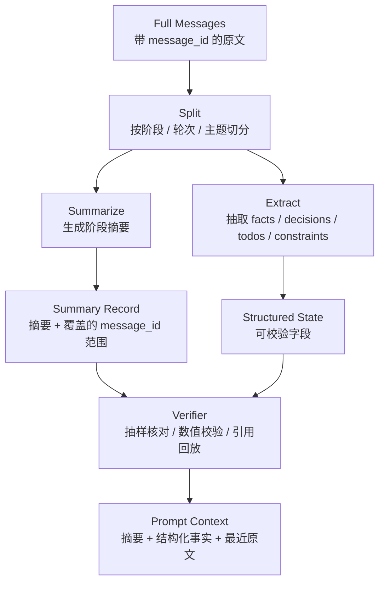

<section class="doc-hero">
  <p class="doc-hero__kicker">匿名真实面经</p>
  <h1>Context Engineering 面试深挖：上下文不是越多越好</h1>
  <p class="doc-hero__lead">面试官追问的不是“你有没有做摘要”，而是“你怎么保证模型看见正确的东西”。</p>
  <div class="doc-hero__meta" aria-label="本文信息">
    <span>适合阶段：Agent 工程师 / 平台架构面</span>
    <span>核心能力：预算 · 布局 · 压缩 · 缓存 · 召回</span>
    <span>脱敏原则：只保留技术追问，不保留项目细节</span>
  </div>
</section>

> Context engineering 的核心不是把 prompt 写长，而是让模型在每一轮只看到对当前决策最有用、最可信、最省成本的上下文。

> **本文边界**：这篇是面试追问型文章。上下文压缩算法看 [上下文压缩与摘要](./compression)，会话内 history 管理看 [会话历史管理](./history)，长期记忆治理看 [记忆系统](./memory)，prefix / prompt cache 看 [上下文缓存](./caching)，位置偏置看 [Lost in the Middle](./window-bias)。

> **脱敏说明**：本文来自多场 Agent 工程岗位面试中反复出现的上下文追问链。文中不出现公司、项目、用户规模、业务指标和内部系统名，所有例子都改成通用业务 Agent 场景。

## 面试官想考什么

这些题听起来像细节题，其实是在考你有没有把 context 当成一个工程系统来管理。

<div class="interview-grid">
  <div>
    <strong>你说做了 context engineering，具体控制了哪些东西？</strong>
    <span>考你能不能从 prompt 技巧上升到输入预算、布局和运行时策略。</span>
  </div>
  <div>
    <strong>长上下文没到窗口上限，为什么还要压缩？</strong>
    <span>考你是否知道压缩有硬触发和软触发，也知道压缩会带来信息损失。</span>
  </div>
  <div>
    <strong>摘要怎么保证“符合原文”？出错后能回溯吗？</strong>
    <span>考摘要保真、message 序号、关键事实结构化、原文可回放。</span>
  </div>
  <div>
    <strong>压缩会不会让 prompt cache / prefix cache 失效？怎么布局？</strong>
    <span>考稳定前缀、动态区域、cache 命中和 token 减少之间的权衡。</span>
  </div>
  <div>
    <strong>RAG 召回内容拿到后，直接拼进 prompt 可以吗？</strong>
    <span>考资料角色隔离、去重、排序、citation、冲突处理和位置策略。</span>
  </div>
  <div>
    <strong>history、memory、RAG、tool definitions 都在抢窗口，怎么分预算？</strong>
    <span>考你是否能把上下文当作有限资源，而不是谁都无限塞。</span>
  </div>
  <div>
    <strong>除了摘要，还有哪些压缩方式？子 Agent 委派算不算压缩？</strong>
    <span>考方法库边界：rolling summary、结构化抽取、检索式上下文、外部状态。</span>
  </div>
  <div>
    <strong>上下文污染、旧事实、错误工具结果进入 prompt 后怎么清理？</strong>
    <span>考 context hygiene，不只是 context packing。</span>
  </div>
</div>

## 为什么“塞更多上下文”会变成事故

一个长会话 Agent 很容易长成下面这样：

```text
[System Prompt: 2K]
[Tool Definitions: 15K]
[用户最近 30 轮对话: 25K]
[历史摘要: 3K]
[长期记忆 profile: 6K]
[RAG Top-10 文档: 18K]
[工具 trace / 报错日志: 10K]
[当前用户问题: 200]
```

这看起来很“信息充分”，但实际会出四类问题：

- **重要信息被埋中间**：Lost in the Middle 论文（Liu et al., 2023）显示，长上下文模型对开头和结尾的信息更敏感，中间信息更容易被忽略。
- **错误信息被放大**：一次错误摘要、一个旧工具结果、一条过期 memory，后面每一轮都会被当成事实再利用。
- **成本和首 token 延迟变差**：prefill 要处理整段上下文，输入越长越慢，cache miss 时更明显。
- **权限和角色混淆**：RAG 资料、用户话、系统规则、工具日志如果没有物理隔离，模型可能把参考资料当指令，把旧用户话当当前请求。

面试官问 context engineering，本质是在问：

```text
你有没有一套机制，决定每一轮给模型看什么、不看什么、怎么排列、怎么验证、怎么回溯？
```

如果回答只停在“我们会做摘要”，会被继续追问；如果能把上下文拆成预算、布局、压缩、召回、缓存、清理六件事，答案就稳得多。

## 面试里的一句话骨架

可以先用这段压住全局：

```text
我理解的 context engineering 是运行时输入治理。
它不是把 prompt 写长，而是控制模型每轮看到什么、以什么结构看到、看到多少、哪些保持稳定前缀、哪些动态召回、哪些必须从上下文里清理。
```

接着拆五层：

| 层 | 面试说法 | 典型机制 |
|---|---|---|
| 布局 | 不同来源的信息要物理隔离 | system、tools、state、memory、RAG、history、current query 分区 |
| 预算 | 每类上下文都有 token 上限 | tools top-k、memory top-k、RAG top-k、recent N turns |
| 压缩 | 旧历史不等于丢掉 | rolling summary、分层摘要、结构化 facts/decisions/todos |
| 召回 | 长期信息按当前任务取用 | memory retrieval、RAG rerank、query rewrite |
| 卫生 | 错误和过期内容要清理 | tool result clearing、TTL、冲突检测、source trace |

Anthropic 的 context engineering 文章把 context 称为有限资源，并强调 agent 的表现往往取决于能否把正确的信息放进上下文，而不是单纯优化某句 prompt。这一点很适合面试：**context 是运行时资源，不是文案容器**。

## 追问链一：没到窗口为什么也压缩

坏的回答：

```text
因为长上下文会有 lost in the middle，所以要压缩。
```

这个回答只答了一半。面试官接着问：“可是你窗口还没满，为什么现在就压？”

更稳的答案要先分触发类型：

| 触发类型 | 具体场景 | 风险 |
|---|---|---|
| 硬触发 | 接近窗口上限、成本过高、首 token 变慢、cache hit 下降 | 必须压，否则系统不可用 |
| 软触发 | 阶段切换、会话结束、产品需要摘要、准备写入 memory | 可以压，但要承认信息损失 |

可以这样答：

```text
技术上如果窗口、延迟、成本都没问题，可以不压缩，因为压缩一定有损失。
提前压缩通常是软触发：比如任务阶段切换，需要把旧阶段沉淀成 facts、decisions、open questions；
或者产品侧需要会话摘要，可以复用为后续上下文。
我的做法不是只留 summary，而是最近 N 轮保留原文，远端历史做摘要，关键事实单独结构化保存，原始消息仍然可回放。
```

这里有个关键句：**压缩是喂给模型的输入策略，不是删除历史数据**。如果消息原文已经全量持久化，摘要出错时还能根据 message id 回看原文；如果压缩等于丢原文，那就是不可审计的设计。

## 追问链二：摘要怎么保证符合原文

摘要最大的问题不是短，而是不可信。它可能漏掉订单号、改错数值、把用户不确定的话写成确定事实。

一个稳的压缩链路应该长这样：



面试时重点说三件事：

1. **摘要要带范围**：每段 summary 覆盖哪些 `message_id`，方便回放和重摘。
2. **关键事实不只放自然语言摘要**：订单号、金额、时间、指标、权限、风险字段要抽成结构化 state。
3. **摘要要可验证**：数值、实体、引用来源可以用规则校验；开放文本可以抽样人工或 LLM judge。

可以给一个反例：

```text
用户第 2 轮说“订单 ABC-1234 还没到”，摘要写成“用户询问订单 ABC-1243”。
如果只有自然语言摘要，后面每轮都错；如果结构化 facts 里有 order_id=ABC-1234，并且 summary 绑定 message_id=2，就能回放定位。
```

这就是“摘要保真”的工程含义。它不是让模型承诺“我会忠于原文”，而是给摘要加来源、结构和校验。

## 追问链三：压缩和 prompt cache 的冲突

压缩会减少输入 token，但不一定让系统更快、更便宜。原因是 prompt caching / prefix caching 依赖稳定前缀。

如果每轮都把历史摘要重写到 prompt 前半段：

```text
[System 固定]
[Tools 固定]
[History Summary 每轮改写]  ← 这里一变，后面的前缀基本都 miss
[Memory]
[RAG]
[Current Query]
```

你省了 token，但可能破坏了缓存命中。更稳的布局是：

```text
[稳定 System Prompt]
[稳定 Safety Policy]
[稳定 Tool Group Definitions]
[稳定 Output Schema]
--- cache-friendly prefix boundary ---
[Structured State: 小而动态]
[Memory Top-K: 动态]
[RAG Top-K: 动态]
[Rolling Summary: 固定区域，低频更新]
[Recent N Turns: 动态]
[Current User Query]
```

面试答法：

```text
压缩对性能是双刃剑。输入 token 变少会降低 prefill 成本，但如果改写了 prompt 的早期部分，会让 prompt caching / prefix caching 命中率下降。
所以我会把 system、safety、tool definitions、output schema 这些稳定内容放在前缀，尽量少动；
rolling summary 放在固定区域，按阶段低频更新；高度动态的 RAG、memory、当前问题放后面。
```

Anthropic prompt caching 使用显式 `cache_control` breakpoint，OpenAI 和 DeepSeek 更偏自动前缀命中，但底层设计都奖励“稳定前缀”。面试里不必背所有厂商细节，但必须知道：**越早的位置变化，cache 损失越大**。

## 追问链四：RAG 结果怎么放进上下文

RAG 结果不是用户指令，也不是系统规则。它是参考资料。

坏的拼法：

```text
用户历史...
检索结果1...
检索结果2...
用户问题...
```

这种拼法的问题是角色混乱。更稳的布局：

```text
[System]
你只能基于“检索资料”和“工具结果”回答事实问题。
如果资料不足，要说资料不足。

[Retrieved Context]
doc_id: d1
title: ...
source: ...
content: ...

doc_id: d2
title: ...
source: ...
content: ...

[Conversation State]
...

[Current User Question]
...
```

RAG 注入前至少做四步：

| 步骤 | 目的 | 例子 |
|---|---|---|
| 去重 | 避免同一段反复占 token | 同一 FAQ 多个版本只保留最新 |
| 排序 | 关键资料靠近当前问题 | top rerank 结果放在 RAG 区顶部或靠近 query |
| 标注来源 | 方便 citation 和追责 | `doc_id`、标题、版本、时间 |
| 冲突处理 | 新旧资料谁优先 | 明确“以工具结果 / 最新版本 / 权威来源为准” |

如果资料太多，不要把 top-20 全塞进去。可以先做 rerank，再把 top-k 注入；或把资料压成结构化要点，同时保留引用 id。RAG 文章讲检索链路，这里强调的是：**检索结果进入 prompt 后，仍然需要 context engineering**。

## 追问链五：history、memory、RAG 怎么分工

这三个词很容易混在一起：

| 来源 | 生命周期 | 解决的问题 | 面试里的坑 |
|---|---|---|---|
| History | 同一 session 内 | 这通对话刚才说过什么 | 全量塞会成本爆炸，滑窗会丢早期约束 |
| Memory | 跨 session 持久化 | 用户长期偏好、事实、历史任务经验 | 写入错误会长期污染 |
| RAG | 外部知识库 | 模型没学过或需要权威来源的知识 | 召回噪音会干扰回答 |
| State | 当前任务结构化状态 | 目标、阶段、已知事实、约束、已完成动作 | 只放自然语言历史，runtime 无法校验 |
| Tool Results | 当前执行证据 | 工具返回的权威结果 | 大段日志污染上下文 |

一个好答案会明确优先级：

```text
对于当前任务是否完成，优先看 structured state 和 tool result；
对于用户长期偏好，看 memory retrieval；
对于外部事实，看 RAG 和 citation；
对于对话连贯性，看 recent history 和 rolling summary。
这些来源冲突时不能让模型自己猜，要在 system 或 policy 里写清优先级。
```

这比“我们把历史和资料一起拼进去”强很多，因为它承认上下文来源有不同可信度。

## 怎么用：一个可跑的 Context Builder

下面这段代码演示一个最小 context builder：分预算、稳定前缀、动态 memory / RAG、最近历史、摘要保留来源范围。它不依赖外部库，可以直接运行。

```python
from dataclasses import dataclass, field
from typing import Iterable


def token_estimate(text: str) -> int:
    return max(1, len(text) // 4)


@dataclass
class Message:
    message_id: str
    role: str
    content: str


@dataclass
class ContextItem:
    name: str
    content: str
    priority: int
    source: str
    stable: bool = False

    @property
    def tokens(self) -> int:
        return token_estimate(self.content)


@dataclass
class ContextBuilder:
    token_budget: int
    section_budget: dict[str, int]
    items: list[ContextItem] = field(default_factory=list)

    def add(self, item: ContextItem) -> None:
        self.items.append(item)

    def add_history(self, messages: list[Message], recent_turns: int) -> None:
        recent = messages[-recent_turns * 2 :]
        text = "\n".join(f"{m.role}[{m.message_id}]: {m.content}" for m in recent)
        self.add(ContextItem("recent_history", text, 70, "history"))

    def add_summary(self, covered_ids: Iterable[str], summary: str) -> None:
        ids = ",".join(covered_ids)
        text = f"covered_message_ids: {ids}\nsummary: {summary}"
        self.add(ContextItem("rolling_summary", text, 60, "summary"))

    def add_rag(self, docs: list[dict], limit: int) -> None:
        blocks = []
        for doc in docs[:limit]:
            blocks.append(
                f"doc_id: {doc['id']}\ntitle: {doc['title']}\nsource: {doc['source']}\ncontent: {doc['content']}"
            )
        self.add(ContextItem("retrieved_context", "\n\n".join(blocks), 65, "rag"))

    def build(self) -> str:
        selected: list[ContextItem] = []
        used_total = 0
        used_by_source = {source: 0 for source in self.section_budget}

        for item in sorted(self.items, key=lambda x: (not x.stable, -x.priority)):
            source_limit = self.section_budget.get(item.source, self.token_budget)
            if used_by_source.get(item.source, 0) + item.tokens > source_limit:
                continue
            if used_total + item.tokens > self.token_budget:
                continue
            selected.append(item)
            used_total += item.tokens
            used_by_source[item.source] = used_by_source.get(item.source, 0) + item.tokens

        return "\n\n".join(f"## {item.name}\n{item.content}" for item in selected)


if __name__ == "__main__":
    builder = ContextBuilder(
        token_budget=900,
        section_budget={"system": 250, "tools": 200, "summary": 150, "history": 180, "rag": 250, "memory": 120},
    )
    builder.add(ContextItem("system", "你是一个业务 Agent。工具结果优先于模型先验；资料不足时要说明不足。", 100, "system", stable=True))
    builder.add(ContextItem("tools", "available_tools: read_profile, search_docs, create_ticket", 90, "tools", stable=True))
    builder.add(ContextItem("memory", "- 用户偏好：回复尽量简洁\n- 用户约束：需要引用来源", 80, "memory"))
    builder.add_summary(["m1", "m2", "m3"], "用户正在处理一个账号问题，已经确认账号邮箱，但还没有完成工单创建。")
    builder.add_history(
        [
            Message("m4", "user", "我刚才说的邮箱还能用吗？"),
            Message("m5", "assistant", "可以，我会用已确认的邮箱继续处理。"),
            Message("m6", "user", "那帮我提交工单。"),
        ],
        recent_turns=2,
    )
    builder.add_rag(
        [
            {"id": "d1", "title": "工单创建规则", "source": "kb/v3", "content": "创建工单前必须确认邮箱和问题类型。"},
            {"id": "d2", "title": "账号恢复 SLA", "source": "kb/v2", "content": "账号恢复工单一般在 24 小时内处理。"},
        ],
        limit=2,
    )
    print(builder.build())
```

这段代码的重点不是 token 估算多准，而是四个设计习惯：

- 稳定内容靠前，尽量不动。
- 每类来源有预算，避免 RAG 或历史把窗口吃光。
- 摘要带 `covered_message_ids`，方便回放。
- RAG 带 `doc_id/source/title`，方便 citation 和 badcase 归因。

## 常见踩坑

### 坑一：把 context engineering 等同于摘要

**现象**：被问“context engineering 常用手段”，只能列 rolling summary。

**根因**：只看到了历史压缩，没有看到工具、memory、RAG、state、cache、cleaning 都是上下文治理。

**修法**：用“布局、预算、压缩、召回、缓存、清理”六件事回答。

### 坑二：摘要覆盖掉原文

**现象**：摘要写错数字或实体后，系统后续一直错，无法定位。

**根因**：压缩被当成数据删除，而不是 prompt 输入策略。

**修法**：原文持久化；摘要带 message id 范围；关键事实结构化；必要时重新从原文生成摘要。

### 坑三：为了省 token 破坏 cache

**现象**：压缩后输入 token 少了，但延迟和成本没有明显下降，甚至变差。

**根因**：每轮改写 prompt 前缀，prompt cache / prefix cache 命中率下降。

**修法**：稳定 system、tools、schema 前缀；动态内容靠后；summary 放固定区域并低频更新；监控 cache hit tokens。

### 坑四：RAG 资料和用户消息混在一起

**现象**：模型把检索资料里的描述当成用户要求，或把旧文档当成当前事实。

**根因**：上下文来源没有角色隔离和优先级。

**修法**：单独 `Retrieved Context` 区块；带 doc_id/source/version；明确资料只是参考；冲突时按工具结果或权威来源优先。

### 坑五：工具结果全量塞回 prompt

**现象**：日志、HTML、JSON 大对象撑爆上下文，模型还抓不到重点。

**根因**：没有把 tool observation 设计成结构化摘要。

**修法**：完整结果存 artifact，prompt 只放 `ok/error/summary/key_fields/next_hint/artifact_id`。

### 坑六：长期记忆全量注入

**现象**：用户几十条偏好全塞进 system，模型引用过期偏好，甚至把无关记忆拿来回答。

**根因**：memory 没有按当前意图召回和 rerank。

**修法**：结构化过滤 + 向量召回 + 重要性 / 时效性 / 置信度 rerank，只注入 top-k。

## 与相邻概念的区别

| 概念 | 它解决什么 | 和 context engineering 的关系 |
|---|---|---|
| Prompt Engineering | 这一轮怎么写指令 | context engineering 决定有哪些材料进入这轮 prompt |
| Prompt Compression | token 级压缩字符串 | 只是上下文压缩的一类手段 |
| History Management | 同一 session 内消息怎么保留 | context engineering 的 history 子问题 |
| Memory | 跨 session 的长期事实和经验 | context engineering 决定何时召回、召回几条、放哪 |
| RAG | 外部知识检索 | context engineering 决定检索结果怎么组织进 prompt |
| Tool Result Clearing | 工具输出怎么清理 | context hygiene 的一部分 |
| Prompt / Prefix Cache | 复用稳定前缀的计算 | context layout 要为 cache 命中服务 |

面试里可以压成一句：

```text
Prompt engineering 关注“怎么说”，context engineering 关注“给模型看什么”；RAG、memory、history、tools 都是上下文来源，压缩和缓存是治理手段，最终目标是让当前决策所需的信息以可控成本进入窗口。
```

## 面试题深度解析

### Q1：Context engineering 常用手段有哪些？

**30 秒版本**：  
我会按六类讲：context map / dynamic tool loading / skill loading / structured state / memory retrieval / context budget / stable prefix / rolling summary / verifier feedback。核心不是列技巧，而是控制模型每轮看什么、怎么看、看多少。

**追问 1：为什么不是写更详细 prompt？**  
因为 prompt 只是指令，上下文还包含工具定义、历史、RAG、memory、状态和工具结果。这些来源如果没分区、没预算、没优先级，再好的指令也会被噪音淹没。

**追问 2：怎么体现 runtime 控制？**  
Runtime 在每轮调用前构建 context：根据 intent 算 allowed tools，根据 state 放必要事实，根据 query 召回 memory/RAG，根据预算裁剪历史，根据 cache 策略保持稳定前缀。模型只消费结果，不自己决定全部上下文。

### Q2：窗口没满为什么压缩？

**30 秒版本**：  
技术上可以不压，因为压缩有信息损失。没满也压通常是软触发：阶段切换、产品要摘要、会话结束沉淀、写入长期记忆，或为了成本/延迟提前治理。关键是保留最近原文、摘要带来源、关键事实结构化。

**追问 1：摘要错了怎么办？**  
摘要不能替代原文。原文要持久化，摘要要记录覆盖的 message id；关键事实用结构化字段保存；出错时根据 id 回放原文或重摘。

**追问 2：除了摘要还有什么？**  
结构化抽取、分层摘要、滑动窗口、重要性评分、去重、entity-centric memory、retrieval-based context、外部 state。子 Agent 委派是隔离任务，不是压缩方法本身。

### Q3：压缩和 prompt cache 怎么权衡？

**30 秒版本**：  
压缩减少 token，但如果改写早期 prompt，会破坏 prompt caching / prefix caching。稳定 system、tools、schema 放前面，动态 summary、memory、RAG、当前问题放后面；summary 固定位置、低频更新，并监控 cache hit rate。

**追问 1：为什么早期变化影响大？**  
prefix cache 复用的是从开头开始的一段相同 token。越靠前的 token 变化，后续越难复用。不是“改一个字只 miss 一个字”，而是从变化点之后都可能失去命中。

**追问 2：什么时候宁可牺牲 cache？**  
当旧上下文已经造成质量下降、污染或风险时，正确性优先于 cache。cache 是成本优化，不是安全边界。

### Q4：RAG 内容怎么进入 prompt？

**30 秒版本**：  
RAG 是参考资料，不是用户指令。召回后要去重、rerank、带 doc_id/source/version，单独放在 Retrieved Context 区块，并明确资料不足时不要编；与工具结果冲突时，通常工具结果或权威来源优先。

**追问 1：top-k 越多越好吗？**  
不是。top-k 太大引入噪音和位置偏置。要用 rerank、阈值、引用质量和 answer faithfulness 评估，而不是固定越多越好。

**追问 2：检索资料和历史对话冲突怎么办？**  
不要让模型自由猜。系统层要定义优先级：实时工具结果 > 权威知识库 > 结构化 memory > 历史对话摘要；同时记录来源，方便 badcase 归因。

## 延伸阅读

- [Anthropic: Effective context engineering for AI agents](https://www.anthropic.com/engineering/effective-context-engineering-for-ai-agents)  
  为什么读：这篇把 context 从 prompt 文案提升到运行时资源管理，适合建立“上下文有限、必须取舍”的面试表达。
- [Claude Cookbook: Context engineering - memory, compaction, and tool clearing](https://platform.claude.com/cookbook/tool-use-context-engineering-context-engineering-tools)  
  为什么读：它把 memory、compaction、tool result clearing 放在一起讲，正好对应面试里的“除了摘要还有什么”。
- [Liu et al., Lost in the Middle: How Language Models Use Long Contexts](https://arxiv.org/abs/2307.03172)  
  为什么读：面试里解释“为什么长上下文不是越长越好”时，这是最经典的实验证据。
- [Anthropic: Prompt caching](https://docs.anthropic.com/en/docs/build-with-claude/prompt-caching)  
  为什么读：显式 cache breakpoint 很适合理解稳定前缀、动态区域和压缩之间的冲突。
- [OpenAI: Prompt caching](https://platform.openai.com/docs/guides/prompt-caching)  
  为什么读：OpenAI 的自动 prompt caching 帮你理解为什么相同前缀、长度门槛、cache hit tokens 应该进入成本观测。
- [LangChain: How to trim messages](https://python.langchain.com/docs/how_to/trim_messages/)  
  为什么读：工程上怎么裁剪 chat history，LangChain 给了很直接的 message trimming 思路。
- [LangGraph: Memory concepts](https://langchain-ai.github.io/langgraph/concepts/memory/)  
  为什么读：短期 thread state 和长期 memory 的边界很清楚，适合准备 history vs memory 的追问。
- 配套阅读：[上下文压缩与摘要](./compression)、[会话历史管理](./history)、[记忆系统](./memory)、[上下文缓存](./caching)、[上下文污染与清理](./pollution)。
