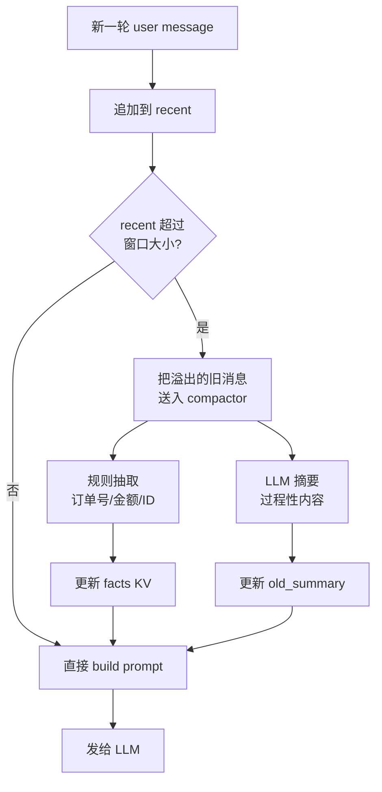

<section class="doc-hero">
  <p class="doc-hero__kicker">上下文工程</p>
  <h1>会话历史管理</h1>
  <p class="doc-hero__lead">每轮对话都要把完整 messages 重发给 LLM——history 单调增长是所有多轮 Agent 的共同宿命。本文讲在一个 session 里怎么管这堆消息：留什么、压什么、扔什么、怎么不踩 cache。</p>
  <div class="doc-hero__meta" aria-label="本文信息">
    <span>适合阶段：Agent 进阶</span>
    <span>核心：in-session 的 messages 管理</span>
    <span>面试重点：策略选型 + cache 配合</span>
  </div>
</section>

> **本文边界**：聚焦 **同一 session 内 chat history 的工程管理**——messages 数组怎么布局、怎么截断、怎么压。**跨 session 的持久化记忆**见 [Agent 记忆系统](./memory)；**通用上下文压缩算法**（Map-Reduce / Refine / Stuff）见 [上下文压缩与摘要](./compression)；**长 history 触发的位置失明**见 [上下文窗口与位置偏置](./window-bias)。

## 面试官想考什么

读完这篇你要能正面回答下面这些题。每题后面括号里是面试官真正想看你答出什么。

<div class="interview-grid">
  <div>
    <strong>为什么每轮对话都要把整个 messages 数组重发给 LLM？这意味着什么？</strong>
    <span>考对 LLM 无状态本质的理解，能不能讲清 prompt 单调增长的根因。</span>
  </div>
  <div>
    <strong>ConversationBufferWindowMemory、SummaryMemory、SummaryBufferMemory 各自什么场景？</strong>
    <span>考 LangChain 经典三件套的取舍辨析。</span>
  </div>
  <div>
    <strong>滑动窗口截断最容易丢的是什么信息？怎么补救？</strong>
    <span>考工程细节，能不能说出"system 之后的早期约束"被忽略的真实坑。</span>
  </div>
  <div>
    <strong>什么时候触发摘要压缩？基于 token、轮次还是主题切换？</strong>
    <span>考触发策略设计，是否考虑过 cache 命中率。</span>
  </div>
  <div>
    <strong>history 怎么布局才能让 prefix cache 不失效？</strong>
    <span>考成本意识——是否理解 cache 命中和 history 动态修改的矛盾。</span>
  </div>
  <div>
    <strong>从 history 里召回相关片段——什么时候这么做有用？</strong>
    <span>考向量召回作为 history 管理手段的边界。</span>
  </div>
  <div>
    <strong>Claude Code 的 auto-compact 触发条件是什么？压缩后保留什么？</strong>
    <span>考实战观察，了解主流编程 Agent 的真实做法。</span>
  </div>
  <div>
    <strong>history 摘要时把订单号 ABC-1234 写成 ABC-1243 怎么防？</strong>
    <span>考关键事实保真的工程方案。</span>
  </div>
</div>

---

## 为什么这件事本身就是个工程问题

LLM 是 **无状态** 的。第 10 轮对话时，模型并不"记得"第 1 轮——你必须把第 1 轮到第 10 轮的所有消息**完整重发**一次：

```python
# 第 1 轮
messages = [
    {"role": "system", "content": "你是客服助理"},
    {"role": "user", "content": "我的订单 ABC-1234 还没到"},
]
reply_1 = llm.chat(messages)

# 第 2 轮——必须把第 1 轮的全部内容再发一次
messages = [
    {"role": "system", "content": "你是客服助理"},
    {"role": "user", "content": "我的订单 ABC-1234 还没到"},
    {"role": "assistant", "content": reply_1},
    {"role": "user", "content": "麻烦帮我催一下"},   # 新消息
]
reply_2 = llm.chat(messages)
```

10 轮之后 prompt 里有 21 条消息，100 轮之后有 201 条。这就是 **prompt 的单调增长**——每轮请求长度都比上一轮长。

这个特性导致三件事很快变得不可接受：

1. **成本爆炸**——按 input token 计费，每轮都要付"全量历史"的钱。100 轮对话的总 token 成本是 O(N²)，不是 O(N)
2. **延迟飙升**——LLM 的 prefill 阶段时间正比于 prompt 长度，长 history 让首字延迟从几百毫秒涨到几秒
3. **质量下降**——长 history 触发 [Lost in the Middle](./window-bias)，早期 system prompt 的约束在 50 轮后基本被忽略

```python
# 不做任何管理的极端反例：成本曲线
# 假设每轮 user + assistant 共 500 token
# 第 N 轮的总 prompt token ≈ 500 * N
# 跑 100 轮的累计 input token ≈ 500 * (1+2+...+100) = 2,525,000

# 用 gpt-4 ($30/M input) 跑 100 轮纯聊天：
# 累计成本 ≈ $75
# 同样 100 轮如果只保留最近 5 轮：
# 累计成本 ≈ $7.5
# 10 倍差距，对话质量基本无差
```

**会话历史管理的核心命题就是**：在每轮请求里，决定 messages 数组里塞什么、不塞什么、怎么塞，才能既保留对话连贯性、又不让 prompt 无限膨胀。

这件事和[跨 session 的长期记忆](./memory) 不是一回事——那个是"上周说过的事这周还记得"，本文是"这一通对话讲了 50 句之后还知道开头说了什么"。前者是持久化存储问题，后者是 in-prompt 的工程问题。

---

## 三种基础策略：留全 / 截窗 / 摘要

最朴素的三种做法，覆盖 80% 的简单场景。

### 策略 1：完整保留（buffer）

```python
class BufferHistory:
    def __init__(self, system_prompt: str):
        self.messages = [{"role": "system", "content": system_prompt}]

    def add(self, role: str, content: str):
        self.messages.append({"role": role, "content": content})

    def build(self):
        return self.messages
```

LangChain 的 `ConversationBufferMemory` 就这么干。

- **适合**：短对话（< 10 轮）、原型开发、demo
- **不适合**：生产环境、任何长对话

**为什么大多数生产系统不用**：N 轮对话后，prompt 里有 N 条消息全部按原文发出去——成本和延迟都不可控。

### 策略 2：滑动窗口（sliding window）

只保留最近 N 轮，旧的直接扔：

```python
class WindowHistory:
    def __init__(self, system_prompt: str, k: int = 10):
        self.system = {"role": "system", "content": system_prompt}
        self.recent = []
        self.k = k  # 保留最近 k 轮（每轮 = 1 user + 1 assistant）

    def add(self, role: str, content: str):
        self.recent.append({"role": role, "content": content})
        # 保留最近 k 轮 = 2k 条消息
        if len(self.recent) > 2 * self.k:
            self.recent = self.recent[-2 * self.k:]

    def build(self):
        return [self.system] + self.recent
```

LangChain 的 `ConversationBufferWindowMemory(k=10)` 就是这个。

- **适合**：闲聊、问答、不依赖长程上下文的助手
- **不适合**：任务型对话（订单进度、多步表单填写）

**坑**：直接扔旧消息会让"早期约定"消失。如果用户在第 1 轮说了"请用英文回答"，第 12 轮就被滑出窗口，模型立刻切回中文。所以滑动窗口必须配合**关键约束放 system prompt** + **每轮 user 末尾隐式重申**——单纯靠窗口不行。

### 策略 3：摘要替换（summary）

把旧对话用 LLM 摘要成一段话，替换原文：

```python
class SummaryHistory:
    def __init__(self, system_prompt: str, llm, max_tokens: int = 2000):
        self.system = {"role": "system", "content": system_prompt}
        self.summary = ""  # 累积的对话摘要
        self.recent = []
        self.llm = llm
        self.max_tokens = max_tokens

    def add(self, role: str, content: str):
        self.recent.append({"role": role, "content": content})
        if self._est_tokens() > self.max_tokens:
            self._compact()

    def _compact(self):
        # 用 LLM 把"旧摘要 + 最近若干轮"重新摘要成新摘要
        old_text = "\n".join(f"{m['role']}: {m['content']}" for m in self.recent)
        prompt = f"""把下面的对话历史压缩成不超过 300 字的摘要。
保留：用户身份/偏好、已确定的事实、未完成的任务、关键约束。
省略：寒暄、模型的冗长解释、已解决的小问题。

已有摘要：{self.summary or "(无)"}

新增对话：
{old_text}

新摘要："""
        self.summary = self.llm.chat(prompt)
        self.recent = []  # 全部消化进摘要

    def build(self):
        msgs = [self.system]
        if self.summary:
            msgs.append({"role": "system", "content": f"先前对话摘要：{self.summary}"})
        msgs.extend(self.recent)
        return msgs
```

对应 LangChain 的 `ConversationSummaryMemory` / `ConversationSummaryBufferMemory`。两者区别：前者**每轮都重摘**（贵），后者**超过 token 阈值才摘**（实用）。

- **适合**：长对话、需要保留"早期上下文要点"
- **不适合**：对事实精度要求高的场景（金融、医疗、客服带订单号的）

**最大风险**：摘要本身是 LLM 生成的，**关键事实可能被改写**。"订单 ABC-1234" 被压缩成 "订单 ABC-1243" 就是真实发生过的事故——摘要中字符级 typo 在压缩到原文 1/10 长度时概率不可忽略。所以**纯摘要绝不能用在事实型场景**，要配合后面的"关键事实抽取"。

---

## 进阶：分层 + 向量召回

基础三策略各有偏废。生产 Agent 通常**组合使用**，形成两个进阶模式。

### 进阶 1：分层历史（Tiered History）

把 history 按"时间远近"和"重要性"分层，不同层用不同策略：

```
┌─────────────────────────────────┐
│ System Prompt                   │ ← 永远保留，固定
├─────────────────────────────────┤
│ Old Summary                     │ ← LLM 摘要，定期更新
├─────────────────────────────────┤
│ Key Facts (structured)          │ ← 规则抽取，KV 结构
│   - user_id: u_001              │
│   - order_id: ABC-1234          │
│   - language: zh-CN             │
├─────────────────────────────────┤
│ Recent N turns (raw)            │ ← 最近 N 轮原文
└─────────────────────────────────┘
```



这个结构的好处在于**事实和过程分开**：

- 订单号、用户名、关键 ID → 用规则/NER 提取存 KV（绝对保真）
- 用户的偏好、Agent 的中间思考 → 用 LLM 摘要（保留语义即可）
- 最近几轮 → 保留原文（最大保真）

每一层用最适合自己的存储和压缩策略。

### 进阶 2：向量召回历史片段（Retrieval-augmented History）

当对话非常长（几百轮、跨越数天但仍是同一 session，比如 Claude Code 的长任务），即使摘要也撑不住，可以把**旧消息当成"小型知识库"**——存进向量库，每轮根据当前 user message 检索相关片段：

```python
class RetrievalHistory:
    def __init__(self, system_prompt: str, embedder, recent_k: int = 5, retrieve_k: int = 3):
        self.system = {"role": "system", "content": system_prompt}
        self.recent = []
        self.archived = []  # [(embedding, message)]
        self.embedder = embedder
        self.recent_k = recent_k
        self.retrieve_k = retrieve_k

    def add(self, role: str, content: str):
        msg = {"role": role, "content": content}
        self.recent.append(msg)
        if len(self.recent) > 2 * self.recent_k:
            # 溢出的旧消息嵌入后归档
            to_archive = self.recent[:-2 * self.recent_k]
            for m in to_archive:
                emb = self.embedder.encode(m["content"])
                self.archived.append((emb, m))
            self.recent = self.recent[-2 * self.recent_k:]

    def build(self, current_query: str):
        msgs = [self.system]
        # 从归档里检索和当前 query 相关的旧片段
        if self.archived:
            q_emb = self.embedder.encode(current_query)
            scored = [(cos(q_emb, e), m) for e, m in self.archived]
            scored.sort(key=lambda x: -x[0])
            relevant = [m for _, m in scored[:self.retrieve_k]]
            if relevant:
                ctx = "\n".join(f"[过往] {m['role']}: {m['content']}" for m in relevant)
                msgs.append({"role": "system", "content": f"以下是历史对话中可能相关的片段：\n{ctx}"})
        msgs.extend(self.recent)
        return msgs
```

这本质上是把 [RAG](../rag/basics) 用到自己的 history 上。

**什么时候这么做有用**：
- 长 session（几百轮），且不同话题穿插（用户问 A，过 50 轮又回来问 A 相关）
- 用户经常引用很早之前说过的事（"我之前提到过的那个项目"）
- 摘要会丢细节，但全量保留太贵

**什么时候不要这么做**：
- 短对话（< 30 轮）——窗口 + 摘要就够，引入检索是过度设计
- 强连续叙事（一步一步推理）——检索会破坏顺序，反而干扰
- 实时性要求高的场景（每轮多一次 embedding + 检索 = 几十毫秒延迟）

---

## 五种策略对比

| 策略 | 实现复杂度 | Token 成本 | 召回率 | 适合场景 |
|---|---|---|---|---|
| **完整保留 buffer** | 极低 | O(N²) | 100% | 短对话 / demo |
| **滑动窗口** | 低 | O(N·k) | 仅最近 k 轮 | 闲聊、不依赖长程 |
| **摘要替换** | 中 | O(N·k) + 摘要调用 | 高（语义）/ 低（事实） | 长对话非事实型 |
| **分层（摘要+事实+最近）** | 中高 | O(N·k) + 摘要调用 | 高（事实保真） | 任务型 Agent、客服 |
| **向量召回 history** | 高 | O(k) + 检索 | 高（话题跳跃） | 超长 session、跨话题 |

**经验法则**：
- 5 轮以内：buffer 就行
- 5-50 轮：滑动窗口 + system 重申约束
- 50-200 轮：分层（摘要 + 关键事实 KV + 最近窗口）
- 200+ 轮 / 跨话题：分层 + 向量召回

---

## 触发策略：什么时候压缩

"什么时候触发摘要/压缩"和"怎么压"同样重要。常见触发器：

### 触发器 A：token 阈值

```python
if estimated_tokens(messages) > max_tokens * 0.7:
    compact()
```

最常用。**阈值不要设太高**——等到 95% 才压，已经触发 Lost in the Middle 了。一般 70-80% 触发。

### 触发器 B：轮次阈值

```python
if len(messages) > 30:
    compact()
```

简单但粗糙。同样 30 轮，可能是 3000 token 也可能是 30000 token——不如 token 阈值精准。但**有个优点**：轮次是确定的，不依赖 tokenizer，调试方便。

### 触发器 C：主题切换

LLM 判断当前轮和上一轮是否换话题，换了就压缩之前的：

```python
if llm_detect_topic_shift(messages[-2:]):
    summarize_and_archive(messages[:-2])
```

理论很美——天然的语义边界。**实际很难**：判断"是否换话题"本身要一次 LLM 调用，准确率不高，且话题往往是渐变的。生产里很少单独用，常作为辅助信号。

### 触发器 D：显式压缩点

让用户或上层 Agent 主动触发：

```python
@tool
def compact_context():
    """当用户说'换个话题'、'重新开始'或当前任务完成时调用"""
    history.compact()
```

Claude Code 的 `/compact` 命令是显式触发的典型——用户知道自己刚做完一个大任务，主动让 Agent "总结一下，从新状态继续"。

**生产推荐**：token 阈值（被动）+ 显式命令（主动）双轨。轮次和主题切换作为辅助 metric 监控用。

---

## 关键事实抽取：摘要不可靠时的兜底

任何依赖 LLM 摘要的策略都有"事实改写"风险。生产场景的兜底方案是 **把结构化事实独立抽取存储**：

```python
import re

FACT_PATTERNS = {
    "order_id": r"(?:订单号?|order)\s*[:#：]?\s*([A-Z0-9]{4,}-[A-Z0-9]+)",
    "phone": r"1[3-9]\d{9}",
    "email": r"[\w.+-]+@[\w-]+\.[\w.-]+",
    "amount": r"(?:￥|RMB|元|$)\s*(\d+(?:\.\d+)?)",
}


def extract_facts(message: str) -> dict:
    """规则 + 正则抽取硬事实——比 LLM 摘要可靠"""
    facts = {}
    for name, pattern in FACT_PATTERNS.items():
        m = re.search(pattern, message)
        if m:
            facts[name] = m.group(1) if m.groups() else m.group(0)
    return facts


class TieredHistory:
    def __init__(self, system_prompt: str, llm, recent_k: int = 8):
        self.system = system_prompt
        self.facts: dict = {}        # 结构化硬事实
        self.summary: str = ""       # LLM 摘要（软上下文）
        self.recent: list = []
        self.llm = llm
        self.recent_k = recent_k

    def add(self, role: str, content: str):
        # 每轮都抽取硬事实——绝不依赖摘要保留
        if role == "user":
            new_facts = extract_facts(content)
            self.facts.update(new_facts)
        self.recent.append({"role": role, "content": content})
        if len(self.recent) > 2 * self.recent_k:
            self._compact_old()

    def _compact_old(self):
        old = self.recent[:-2 * self.recent_k]
        text = "\n".join(f"{m['role']}: {m['content']}" for m in old)
        prompt = f"""更新对话摘要。保留语义脉络，不要复述用户具体 ID/订单号/电话——这些已经独立存储。

已有摘要：{self.summary or "(无)"}
新增对话：
{text}

更新后的摘要："""
        self.summary = self.llm.chat(prompt)
        self.recent = self.recent[-2 * self.recent_k:]

    def build(self):
        msgs = [{"role": "system", "content": self.system}]
        ctx_parts = []
        if self.summary:
            ctx_parts.append(f"先前对话摘要：{self.summary}")
        if self.facts:
            ctx_parts.append("已确认事实：")
            for k, v in self.facts.items():
                ctx_parts.append(f"  - {k}: {v}")
        if ctx_parts:
            msgs.append({"role": "system", "content": "\n".join(ctx_parts)})
        msgs.extend(self.recent)
        return msgs
```

这个实现的核心思想是**"硬事实走规则，软上下文走 LLM"**。订单号是硬事实——必须 100% 保真，所以规则抽取存 KV；用户的诉求脉络是软上下文——LLM 摘要就够。两条独立路径，互不污染。

> 实战时 NER 比 regex 更稳，但 regex 对**已知格式**（订单号、手机号、邮箱、金额）几乎不会错——这些占了 80% 的事实抽取需求。复杂关系（"用户提到的那个项目和上次的那个是同一个吗"）才需要 LLM 帮忙。

---

## 配合 Prefix Cache：history 布局的禁忌

[Prefix Cache](./caching) 让 LLM 服务端缓存"prompt 前缀"的 KV cache，下次相同前缀直接复用——能省 80%+ prefill 成本，是长 prompt 的关键优化。但**它对 prompt 的布局极其敏感**：

```
缓存命中规则：从头开始，第一个不一样的 token 之后全部失效
```

这导致 history 管理必须遵守一条铁律：**变化频繁的内容放后面，稳定的放前面**。

### 推荐布局

```
┌──────────────────────────┐
│ 1. System Prompt         │ ← 永不变，最佳缓存
├──────────────────────────┤
│ 2. Few-shot 示例         │ ← 不变
├──────────────────────────┤
│ 3. 历史摘要              │ ← 偶尔变（压缩时才更新）
├──────────────────────────┤
│ 4. 关键事实 KV           │ ← 偶尔变
├──────────────────────────┤
│ 5. 最近 N 轮原文         │ ← 每轮都变
└──────────────────────────┘
```

最近对话放最后——它每轮都加新消息，导致后缀缓存失效，但前面的 system / few-shot / 摘要的缓存仍然有效。

### 禁忌布局

```
❌ 把"当前时间戳"放 system prompt 开头
   → 每秒一变，整个 cache 全废
❌ 摘要每轮都重新生成
   → 摘要内容每轮不一样，从摘要那行开始缓存全失效
❌ 把最新 user message 插在 history 中间
   → 中间一改，后面全废
```

### 摘要策略和 cache 的协同

摘要必然是动态的——这天然破坏 cache。设计时要让"破坏的发生尽可能少且批量"：

```python
# ❌ 反例：每轮都重新摘要
def _compact_every_turn(self):
    self.summary = llm.summarize(self.history)
    # → 每轮 summary 都不一样，cache 命中率几乎为 0

# ✅ 正例：N 轮才压缩一次
def _compact(self):
    if len(self.recent) < 2 * self.recent_k:
        return
    # 一次性把 k 轮压成新摘要，之后 k 轮都用这个摘要——cache 命中
    self.summary = llm.summarize(self.recent[:-2*self.recent_k])
    self.recent = self.recent[-2*self.recent_k:]
```

**摘要频率越低，cache 命中率越高**。8-10 轮压一次比每轮都压在成本上能省 5 倍以上。

详细的 cache 机制和优化技巧见 [上下文缓存](./caching)。

---

## 主流 Agent 的实战观察

看看真实产品怎么做的。

### Claude Code：auto-compact + 显式 `/compact`

Anthropic 的 Claude Code 在长 session（如做完一整个 PR 的多步任务）会触发 **auto-compact**：

- **触发条件**：context 用量接近上限（约 80%）
- **压缩方式**：让模型生成"过去工作的摘要"——包含已读取/修改的文件列表、关键决策、已验证/未验证的假设、未完成的待办
- **保留**：system prompt + 工作摘要 + 关键状态 + 最近几步
- **丢弃**：早期的工具调用大输出、已被覆盖的中间编辑

用户也可以输入 `/compact` 主动触发。这个设计的精髓是 **把"压缩"做成 Agent 的一个明确动作**——而不是后台静默发生，用户能看见、能干预。

### Cursor：工具结果截断 + 文件按需重读

Cursor 的 chat 模式里，文件内容不会持续保留在 context。第一次让它读 `auth.py`，原文进入 context；过几步它会自己调 `read_file` 重新读——因为旧的原文已经在 history 滑出窗口或被摘要替代。

**这种"按需重读"是 Agent 上下文管理的核心模式**：宁可多调一次工具，也不让 context 无限增长。代价是几十毫秒的工具延迟，收益是 context 稳定 + cache 命中率高。

### ChatGPT：双层架构（in-session + memory）

ChatGPT 的 Chat 是 **完整 buffer + 软上限**——单次对话内基本全保留，超过模型上限才截断（用户能看到"Conversation is getting too long"提示）。但它另有一套独立的 **Memory** 系统（左侧"管理记忆"那个），跨 session 持久化用户偏好。

这种设计的逻辑：单 session 内的对话连贯性 > 成本，跨 session 的关键事实独立管理（这部分是 [Agent 记忆系统](./memory) 的范畴）。

### LangChain 三件套对比

LangChain 经典的三个 memory 类，对应本文的三种基础策略：

| 类 | 策略 | 适合 |
|---|---|---|
| `ConversationBufferMemory` | 完整保留 | 短对话 |
| `ConversationBufferWindowMemory(k=N)` | 滑动窗口 | 闲聊 |
| `ConversationSummaryBufferMemory(max_tokens=N)` | token 阈值触发摘要 | 长对话 |

注意 LangChain 0.3+ 已经把 memory 模块标为 legacy，新代码推荐用 **LangGraph 的 checkpoint + 自己实现的 history manager**（更灵活、可序列化）。但这三个类的思路值得理解——所有 history 管理本质上都是这三种的变种或组合。

---

## 常见陷阱

### 陷阱 1：忘了 system 也在 messages 里

**现象**：用滑动窗口 `messages[-2*k:]`，跑几轮后发现 system prompt 消失了——模型彻底不按角色回答。

**根因**：朴素的 `messages[-N:]` 切片会把 system message 也滑出去。早期 LangChain 教程里这个 bug 出现过很多次。

**修法**：永远把 system 单独存：

```python
class History:
    def __init__(self, system):
        self.system = system   # 独立字段
        self.turns = []        # 只存 user/assistant

    def build(self):
        return [self.system] + self.turns[-2*self.k:]
```

不要把 system 塞进同一个 list 然后用切片管理——出错只是时间问题。

### 陷阱 2：摘要把订单号写错

**现象**：客服 Agent 长对话压缩后，"订单 ABC-1234" 在摘要里变成 "订单 ABC-1243"。下次用户问进度时，Agent 拿错的订单号查库——查不到，用户抓狂。

**根因**：LLM 摘要本质有幻觉风险。在压缩到原文 1/10 长度时，字符级 typo 在数字 ID 上的概率不可忽略。模型不知道"ABC-1234"是事实而不是修辞。

**修法**：
- 关键 ID（订单号、手机号、金额、用户名）用 regex / NER 抽取存独立 KV，**绝不依赖摘要**
- 摘要 prompt 里明确说："不要复述任何 ID、订单号、金额——它们已经独立存储"
- 召回时 system message 里把硬事实和软摘要分开标注，让模型知道哪些是 100% 准的、哪些是大意

### 陷阱 3：每轮都重新摘要，cache 全失效

**现象**：实现了 SummaryMemory，跑起来发现 LLM 调用成本反而比不压缩还高。

**根因**：每轮调用 LLM 时摘要内容都不一样（因为每轮都包含上一轮的新内容），prefix cache 从摘要那行开始全部失效。压缩省下的 token 还不够付每轮"摘要 LLM 调用"+"cache miss" 的开销。

**修法**：
- 摘要要**批量更新**：8-10 轮才触发一次压缩，而不是每轮重摘
- 摘要内容尽量稳定——已经存在的部分不要动，只追加新内容
- 把"最近 k 轮原文"放最后，让"system + summary"前缀保持稳定

详见 [上下文缓存](./caching)。

### 陷阱 4：滑动窗口切断了 tool_call / tool_result 的配对

**现象**：用滑动窗口处理 function calling 的 history，跑着跑着 API 报错 `tool_call_id xxx not found`。

**根因**：tool_call 消息和 tool_result 消息是配对的——很多 LLM API（OpenAI、Anthropic）要求 `tool_result` 必须能找到对应的 `tool_call`。粗暴 `messages[-N:]` 切片会切到中间，留下"孤儿 tool_result"或"孤儿 tool_call"，API 直接拒绝。

**修法**：滑动时按"对话回合"而不是"单条消息"切：

```python
def safe_slide(messages, k_turns):
    """从后往前找完整 turn 边界，保留最近 k 个 turn"""
    turns = []
    current_turn = []
    for m in reversed(messages):
        current_turn.insert(0, m)
        if m["role"] == "user":
            turns.insert(0, current_turn)
            current_turn = []
            if len(turns) >= k_turns:
                break
    return [msg for turn in turns for msg in turn]
```

或者更稳：自己维护"turn"对象（包含 user message + 后续所有 assistant / tool 消息），滑动时按 turn 整体操作。

### 陷阱 5：相信"长上下文模型不用管 history"

**现象**：选了 Claude 200K / Gemini 2M，团队觉得"context 那么大，不管 history 也行"。上线后用户反馈"对话越来越慢"、"模型开始忘事"。

**根因**：长 context ≠ 实际可用长度。RULER 测试显示，所有模型在 32K 之后都开始退化。更要命的是成本——200K input token 一次调用就是几块钱，多轮对话累计能让账单失控。

**修法**：即使有 200K context，也要主动管 history：
- 当作 32K context 来用，主动压缩
- 监控每轮 token 用量和成本，设置告警
- 详见 [上下文窗口与位置偏置](./window-bias)

### 陷阱 6：用户敏感信息留在 history 但忘了删

**现象**：用户在第 3 轮输入了密码 / 信用卡号（错放在了 chat 里），Agent 处理完之后这条消息一直在 history 里反复发给 LLM。

**根因**：所有"放进 messages"的内容都会被发给 LLM 服务端。敏感信息一旦进 history，就会反复传输 + 被供应商日志记录。

**修法**：
- 敏感字段在写入 history 前 **mask** 或 **替换占位符**：`"密码：****"`
- 加 PII 检测层，识别到银行卡 / 身份证等内容时拒绝写入 history 原文（写一个"用户提供了银行卡，已脱敏"的占位）
- 定期清理 history 存储（GDPR / 隐私法规要求）

---

## 与跨 session 记忆的边界

| 维度 | In-Session History | Cross-Session Memory |
|---|---|---|
| **存活期** | 一个 session | 跨 session 跨天跨月 |
| **形态** | messages 数组 | 结构化 store（vector / KV / KG） |
| **写入** | 每轮自动追加 | 主动抽取 + 决策 |
| **读取** | 整个数组直接进 prompt | 检索 + 注入 |
| **关注点** | 成本 / cache / 截断策略 | 召回质量 / 去重 / 隔离 |
| **代表实现** | 滑动窗口 / 摘要 / 分层 | mem0 / Letta / Zep |

**简单说**：本文管的是"这一通对话怎么发给 LLM"，[Agent 记忆系统](./memory) 管的是"上一通对话结束后留下什么"。

实际生产 Agent 会**两者都做**——in-session 用本文的分层策略管 messages，session 结束时把对话提炼成 long-term memory 写入持久化存储，下次该用户再来对话时从 memory 检索相关事实注入到新 session 的 system prompt。两层架构互补，缺一不可。

---

## 面试题深度解析

### Q: 为什么每轮对话都要重发完整 messages？

**30 秒版本**：因为 LLM API 本质是**无状态的**——服务端不保留你上一轮的 KV cache 状态（即使有 prefix cache，那也是性能优化，不是逻辑状态）。从模型角度看，每次 `chat()` 都是一次独立的 prompt 推理，它对"上一轮发生了什么"一无所知。要让模型有"对话记忆"，唯一办法就是把过去的 messages 作为这次 prompt 的一部分重新喂进去。这导致 prompt 单调增长，是所有多轮 LLM 应用的共同问题。

**追问**：那 Anthropic 的 prompt caching 不是缓存了状态吗？
那是 **KV cache 的物理缓存**，不是"对话状态的逻辑缓存"。模型仍然需要看到 prompt 里的 messages 才知道对话内容；只是因为前缀相同，prefill 阶段不用重算 KV，省了计算成本。从你客户端代码看，每轮还是要把完整 messages 数组传过去。**Prompt caching 省的是 GPU 算力（钱），不是网络传输和"逻辑状态管理"**。

**追问**：那有没有真正的"有状态 API"？
有，但很少。比如 OpenAI 的 Assistants API 有 thread 概念，服务端管理 messages，你只发 delta。但实际生产很少用——黑盒、不可移植、不可细粒度控制。**主流做法仍然是 stateless API + 客户端管 history**，因为这样你能完全控制窗口、压缩、cache 策略——这些控制权对生产 Agent 极其重要。

### Q: SummaryMemory 把订单号写错了怎么办？

**30 秒版本**：这是 LLM 摘要的固有风险——压缩到原文 1/10 时，字符级 typo 在数字 ID 上概率不可忽略。生产场景的标准解法是 **关键事实独立抽取**：用 regex / NER 把订单号、手机号、金额、用户名等硬事实在写入时抽取出来，存到独立的 KV 字段，**绝不依赖摘要保留这些**。摘要 prompt 里明确说"不要复述任何 ID、金额——已经独立存储"。召回时把硬事实和软摘要分开标注进 system prompt，让模型知道哪些 100% 准确、哪些是大意。

**追问**：如果是非标准格式的"事实"怎么抽？比如用户随口说"我的项目代号叫 Phoenix"。
退一层。规则抽不到的，让 LLM 主动抽——但用结构化 schema 而不是自由摘要：

```python
{"type": "project_code", "value": "Phoenix", "confidence": 0.8}
```

让 LLM 输出 JSON 而不是自由文本。JSON 里的 "Phoenix" 比摘要里 "用户提到了项目 Phoenix" 准确率高得多——schema 强制让模型不能"模糊化"。再加 confidence 字段，多次出现才升级到高置信度。

**追问**：那对所有用户输入都跑事实抽取太贵了吧？
所以**分层触发**：第一层 regex（极快、几乎免费）抓硬模式；regex 没抓到再走 LLM 抽取（用便宜模型如 gpt-4o-mini）；用户消息含关键词（"我的"、"我是"、"记住"）才触发 LLM 抽取，不然跳过。生产里 regex 能覆盖 70%，LLM 兜底 20%，剩下 10% 是真摘要里的——成本可控。

### Q: history 怎么布局才能让 prefix cache 不失效？

**30 秒版本**：核心铁律 —— **变化频繁的内容放后面，稳定的放前面**。具体布局：(1) system prompt 永不变放最前；(2) few-shot 示例放次前（不变）；(3) 老对话摘要放第三（偶尔变，压缩时才更新）；(4) 关键事实 KV 放第四（偶尔变）；(5) 最近 N 轮原文放最后（每轮都变）。这样新增一轮 user message 只让最后一段 cache 失效，前面的 system + few-shot + summary + facts 缓存仍命中。最忌讳：把"当前时间"放 system 开头、每轮都重新摘要、把动态内容插在 history 中间——任何一个都会让整个 cache 报废。

**追问**：那压缩时摘要必然要变，怎么尽量降低影响？
两个手段：(1) **批量压缩**——8-10 轮才触发一次，而不是每轮都重摘。压缩之后的 N 轮，摘要内容稳定不变，cache 命中率高；(2) **摘要内容追加式而非重写式**——新摘要在旧摘要后面追加增量而不是整段重写，让前缀仍有重叠机会（虽然完全的 prefix cache 还是会失效，但部分模型/服务支持 fuzzy cache）。本质上 cache 失效是摘要的固有代价，你只能让"失效发生的次数少 + 每次失效带来的收益大"。

**追问**：Anthropic prompt caching 的 5 分钟 / 1 小时 TTL 怎么影响这个策略？
直接影响。Anthropic 的 cache 默认 5 分钟过期，长时间对话间隔大于 5 分钟就要重新付 cache write 成本（1.25x 单次 input 价）。如果用户间歇性回来（聊 10 句、停 1 小时、再聊 10 句），cache 频繁过期反而比不用 cache 还贵。**对策**：(a) 用 1 小时 cache 选项（更贵的 cache write 但适合慢节奏对话）；(b) 短间隔密集对话才用 cache；(c) 实测命中率，没命中就关掉。Cache 不是免费午餐。

### Q: 滑动窗口配合 function calling 怎么不出 tool_call_id 配对错？

**30 秒版本**：粗暴 `messages[-N:]` 会切断 tool_call 和 tool_result 的配对——OpenAI / Anthropic API 严格要求 `tool_result` 必须能找到对应的 `tool_call`，否则报错。**正确做法**：滑动按"对话回合（turn）"而不是"单条消息"切。一个 turn 包含一条 user message + 它触发的所有 assistant 消息 + 所有 tool_call/tool_result（可能多条）。从后往前找 user message 作为 turn 边界，保留最近 K 个完整 turn。或者更稳：自己维护 Turn 对象，滑动时按 turn 整体操作，绝不在 turn 内部切。

**追问**：那压缩的时候 tool_result 大输出怎么办？经常几千行日志。
两层处理：(1) **写入时截断**——tool_result 写入 history 时就只保留 head 100 + tail 100 + "...(N lines omitted)..."，原文存到独立 log 文件供 debug；(2) **压缩时进一步摘要**——把"工具调用 + 结果"整体压成一句"调用了 X 工具，返回了 Y（成功/失败 + 关键信息）"。Claude Code、Cursor 都这么做——工具返回经常是"判断成功/失败 + 关键 ID"就够了，全文是浪费。

**追问**：那 ReAct 的 thought-action-observation 链滑动怎么处理？
本质上每个 ReAct 步骤就是一个 mini-turn（thought + action + observation）。滑动时按步骤整体保留或整体丢弃，不要切中间——丢一半思维链比丢整个步骤还乱。如果用 LangGraph，把每个 step 包成 checkpoint，按 checkpoint 滑动而不是按 message 滑动，天然规避这个问题。

---

## 延伸阅读

- **LangChain 文档：Memory（legacy）** ([python.langchain.com](https://python.langchain.com/docs/versions/migrating_memory/))
  ConversationBufferMemory / ConversationBufferWindowMemory / ConversationSummaryBufferMemory 三件套源码。读它是为了搞清楚三种基础策略的工程细节，以及为什么 0.3+ 把它们标为 legacy——主流转向 LangGraph 的 checkpoint 模式。

- **LangGraph 文档：Memory** ([langchain-ai.github.io/langgraph](https://langchain-ai.github.io/langgraph/concepts/memory/))
  LangGraph 把 short-term（checkpoint）和 long-term（store）正式区分开。读它是为了理解新一代框架怎么把 history 管理和 memory 系统解耦——本文讲的是前者，[Agent 记忆系统](./memory) 讲的是后者。

- **Anthropic 文档：Prompt Caching** ([docs.anthropic.com](https://docs.anthropic.com/en/docs/build-with-claude/prompt-caching))
  Cache 的具体行为、TTL、计费模型。读它是为了知道 history 布局的真实约束——脱离 cache 谈 history 管理就是空中楼阁。

- **Claude Code 工程博客：Agentic Context Management** (搜 "Claude Code context management")
  Anthropic 工程团队对长 session Agent 的上下文管理实践。读它能看到 auto-compact 的真实触发逻辑、压缩后保留什么、为什么这么设计。

- **论文：MemGPT** ([arxiv 2310.08560](https://arxiv.org/abs/2310.08560))
  虽然主要讲跨 session 记忆，但 main context（本质就是 in-session history）的 self-managed 思路对本文也适用——让 LLM 自己决定什么留、什么换页到外部。

- **配套阅读**：
  - [上下文窗口与位置偏置](./window-bias) — 为什么 history 不能无限堆，理解 Lost in the Middle 才能理解为什么要压缩
  - [上下文压缩与摘要](./compression) — Map-Reduce / Refine 等通用压缩算法，本文的摘要环节用的就是这些
  - [Agent 记忆系统](./memory) — 跨 session 的持久化记忆，和本文 short-term 的 history 管理互补
  - [上下文缓存](./caching) — prefix cache 的工作原理和优化技巧，决定 history 布局的关键约束
  - [Prompt 注入攻防](../prompt/injection) — history 里的内容如果包含外部数据，要警惕间接注入
