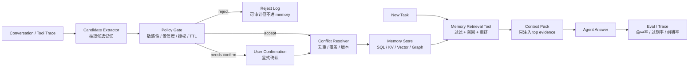

<section class="doc-hero">
  <p class="doc-hero__kicker">匿名真实面经</p>
  <h1>Memory Governance 面试深挖：别把所有历史都塞进向量库</h1>
  <p class="doc-hero__lead">面试官追问长期记忆，真正想听的是一套可控的写入、召回、覆盖、删除和评估机制。</p>
  <div class="doc-hero__meta" aria-label="本文信息">
    <span>适合阶段：Agent 工程师 / 平台面</span>
    <span>核心能力：写入策略 · 冲突消解 · TTL · 权限 · 召回</span>
    <span>脱敏原则：只保留技术追问，不保留项目细节</span>
  </div>
</section>

> 长期记忆不是“把聊天记录存久一点”。它是一套治理系统：决定哪些信息有资格进入长期状态，哪些旧状态该失效，哪些记忆可以被当前任务看见。

> **本文边界**：基础 memory taxonomy 看 [Agent 记忆系统](./memory) 和 [记忆架构 Memory](../agent/memory-arch)，会话内 history 管理看 [会话历史管理](./history)，上下文污染看 [上下文污染与清理](./pollution)，RAG 选型看 [RAG 选型面试深挖](../rag/rag-selection-interview)。本文只处理面试里最容易被追问的 **memory governance**。

> **脱敏说明**：本文来自多场 Agent 工程岗位中反复出现的长期记忆追问链。所有例子都改成通用业务 Agent 场景，不保留任何可识别的真实细节。

## 面试官想考什么

这些题表面在问 memory，实际在考你有没有把“长期状态”当成生产系统来治理。

<div class="interview-grid">
  <div>
    <strong>Agent memory 和 chat history、RAG 的边界在哪里？</strong>
    <span>考你能不能分清原始日志、用户状态、外部知识库三类信息。</span>
  </div>
  <div>
    <strong>哪些内容应该写入长期记忆？写入动作由谁触发？</strong>
    <span>考 write policy，不接受“模型觉得重要就存”。</span>
  </div>
  <div>
    <strong>一条 memory record 至少要带哪些治理字段？</strong>
    <span>考 schema 意识：source、confidence、TTL、scope、status、permission。</span>
  </div>
  <div>
    <strong>新旧记忆冲突时怎么覆盖？会不会保留历史版本？</strong>
    <span>考版本、置信度、作用域和审计，不只是 upsert。</span>
  </div>
  <div>
    <strong>怎么防止 prompt injection 或幻觉写入长期记忆？</strong>
    <span>考 memory pollution，能不能把模型提议和代码裁决分开。</span>
  </div>
  <div>
    <strong>记忆很多时怎么按需召回？直接全量塞 profile 可以吗？</strong>
    <span>考 memory-as-tool、过滤、重排和上下文预算。</span>
  </div>
  <div>
    <strong>用户如何查看、删除、禁用记忆？多租户权限怎么隔离？</strong>
    <span>考隐私、合规和平台边界。</span>
  </div>
  <div>
    <strong>怎么评估 memory system？怎么防一次改动把旧记忆重新激活？</strong>
    <span>考 write precision、retrieval precision、stale rate、回归集。</span>
  </div>
</div>

## 为什么“有长期记忆”反而会出事故

一个业务 Agent 记住了这两条信息：

```text
M1: 用户偏好 PDF 报告。created_at=2026-03-01
M2: 用户这个季度要全部改成 Markdown 报告。created_at=2026-06-01
```

下一轮用户问：“帮我生成这周的运营报告。”

如果系统只是做向量召回，`PDF 报告` 和 `运营报告` 语义很近，M1 可能被召回；如果系统把所有 profile 直接塞进 prompt，M1 和 M2 会一起出现；如果没有冲突规则，模型会自己猜“到底 PDF 还是 Markdown”。这类错误很隐蔽，因为它不是模型不知道，而是你把一个过期状态当成仍然有效的事实喂给了它。

更糟的是，坏记忆会跨 session 复活。一次用户玩笑、一段被网页注入的恶意文本、一次模型错误总结，如果被写入长期记忆，后面每一轮都会带着这个偏差。上下文污染只影响当前会话，长期记忆污染会变成持久状态。

所以面试里回答“长期记忆存数据库/向量库”只够第一层。更稳的说法是：

```text
我会把 memory 分成两步：模型只负责提出候选记忆，代码层的 policy gate 决定是否写入、写到哪、有效期多久、是否需要用户确认、是否覆盖旧记忆。
```

这句话的重点是 **propose / dispose 分离**。模型可以发现“这句话可能值得记”，但长期状态的采纳权不能完全交给模型。

## 一套可面试的 Memory Governance 架构



这张图能把大多数追问接住：

| 环节 | 面试官追问 | 回答关键词 |
|---|---|---|
| Candidate Extractor | 什么时候写入？ | 用户显式偏好、稳定事实、重复出现的行为、任务结束反思 |
| Policy Gate | 谁说了算？ | 模型提议，规则/状态机/用户确认裁决 |
| Conflict Resolver | 新旧矛盾怎么办？ | active/superseded、版本链、source、confidence |
| Retrieval Tool | 记忆多了怎么办？ | namespace 过滤、relevance + importance + recency + confidence 重排 |
| Eval / Trace | 怎么证明有效？ | write precision、stale usage、retrieval precision、task success |

## 写入策略：不是每句话都有资格变成长期状态

适合写入长期记忆的内容通常有四类：

| 类型 | 例子 | 写入方式 |
|---|---|---|
| 稳定偏好 | “以后报告默认给 Markdown” | 用户明确表达，可直接候选写入 |
| 长期目标 | “这个月重点关注续费率” | 带时间范围，设置 TTL |
| 结构化事实 | “团队使用 UTC+8 作为默认时区” | schema 化存储，来源可追溯 |
| 可复用经验 | “某类导出任务需要先校验权限” | 写 procedural memory 或 runbook |

不适合自动写入的内容也要讲清楚：

| 内容 | 为什么危险 | 更稳的处理 |
|---|---|---|
| 一次性上下文 | 只对当前任务有效 | 放 working memory 或 task state |
| 情绪和猜测 | 容易误判用户真实偏好 | 需要多次证据或显式确认 |
| 敏感信息 | 长期存储风险高 | 默认不写，必要时加密并要求授权 |
| 外部网页指令 | 可能是 prompt injection | 只能作为不可信资料，不可直接写记忆 |

Generative Agents 的 memory stream 会给观察记录打 importance 分，并在累计到阈值后触发 reflection；MemGPT / Letta 则把 memory 操作暴露成工具，让 Agent 管理 core memory 与 archival memory。工业系统可以借鉴这些思路，但不要照搬“模型自己全权管理”。候选写入可以由模型做，采纳和权限要落在代码层。

## 一条记忆记录应该长什么样

长期记忆如果只有 `user_id + text + embedding`，后面几乎没法治理。面试里可以直接给 schema：

```json
{
  "id": "mem_1024",
  "subject_id": "user_123",
  "namespace": "user.preferences.report",
  "type": "preference",
  "key": "report_format",
  "value": "markdown",
  "source": {
    "thread_id": "thread_456",
    "message_id": "msg_789",
    "quote": "以后报告默认给 Markdown"
  },
  "confidence": 0.96,
  "importance": 0.82,
  "sensitivity": "normal",
  "consent": "implicit",
  "status": "active",
  "created_at": "2026-06-01T10:00:00Z",
  "expires_at": null,
  "supersedes": ["mem_0999"]
}
```

几个字段是面试加分点：

| 字段 | 没有它会怎样 |
|---|---|
| `namespace` | 多业务、多用户、多 Agent 的记忆会互相串 |
| `source` | 用户质疑时无法回放，也无法判断是不是模型幻觉 |
| `confidence` | 低置信推断可能覆盖用户明确事实 |
| `expires_at` | 旧偏好长期复活 |
| `status` | 删除、覆盖、禁用无法审计 |
| `supersedes` | upsert 后看不到为什么被覆盖 |

LangChain 的 long-term memory 文档也强调，长期记忆跨 thread 持久化，并通过 namespace / key 组织 JSON 文档。这个设计比“只有向量库”更适合生产治理：向量用于召回，结构化字段用于过滤、权限和冲突判断。

## 冲突处理：覆盖不是简单 upsert

冲突不是异常，而是长期记忆的日常。用户会换团队、换偏好、换目标；业务规则会更新；模型也可能抽取错。

一个实用规则可以这样排：

```text
用户显式确认 > 用户明确表达 > 工具返回事实 > 模型推断
更具体的 scope > 更泛化的 scope
未过期 active 记忆 > 过期记忆
高置信新事实 > 低置信旧事实
敏感/高风险字段需要确认，不自动覆盖
```

面试时不要只说“新覆盖旧”。更完整的机制是：

| 情况 | 处理 |
|---|---|
| 同 key 同 scope，用户明确改偏好 | 新记忆 active，旧记忆 superseded |
| 新事实只适用于本次任务 | 不覆盖长期记忆，写 task state |
| 新事实置信度低 | 进入 pending，等更多证据或用户确认 |
| 敏感字段变化 | 二次确认 + 审计日志 |
| RAG 资料与用户记忆冲突 | 按来源优先级和时效判断，必要时向用户澄清 |

这里和 [上下文污染与清理](./pollution) 是一组问题：污染讲的是坏信息进上下文后怎么清理；governance 讲的是坏信息不要被持久化，以及旧信息何时失效。

## 召回策略：Memory 是工具，不是固定 prompt

少量稳定 profile 可以直接注入，例如语言偏好、时区、默认输出格式。但一旦记忆变多，就要把 memory 当成一个工具：

```text
当前任务 -> 生成 memory query -> 按 namespace/权限/状态过滤 -> 召回候选 -> rerank -> 注入 top evidence
```

召回排序不要只看 embedding 相似度。Generative Agents 的 `recency × importance × relevance` 很适合做面试骨架，生产里再加 confidence、permission、status：

```text
score =
  0.45 * relevance
  + 0.20 * importance
  + 0.15 * recency
  + 0.15 * confidence
  + 0.05 * explicitness
```

然后先过滤，再排序：

```text
WHERE subject_id = current_user
  AND namespace IN allowed_namespaces
  AND status = 'active'
  AND (expires_at IS NULL OR expires_at > now())
  AND sensitivity <= current_permission
```

如果面试官追“为什么不能全塞”，可以答三点：

- **质量**：旧记忆和当前任务无关时就是噪声，会干扰模型。
- **安全**：某些记忆只允许特定工具或特定任务看到。
- **成本**：长期 profile 越写越大，全塞会拖慢 prefill，也破坏 context layout。

## 可运行代码：一个带治理字段的 Memory Store

下面代码不用外部依赖，演示四件事：写入 gate、冲突覆盖、TTL 过滤、召回重排。真实系统会把存储换成 SQL / KV / vector / graph，但控制逻辑的形状类似。

```python
from __future__ import annotations

from dataclasses import dataclass, field
from datetime import datetime, timedelta
from typing import Iterable
import math
import re


def words(text: str) -> set[str]:
    return set(re.findall(r"[a-zA-Z0-9_]+", text.lower()))


@dataclass
class MemoryRecord:
    id: str
    subject_id: str
    namespace: str
    key: str
    value: str
    source: str
    confidence: float
    importance: float
    created_at: datetime
    expires_at: datetime | None = None
    status: str = "active"
    consent: str = "implicit"
    sensitivity: str = "normal"
    supersedes: list[str] = field(default_factory=list)

    def expired(self, now: datetime) -> bool:
        return self.expires_at is not None and self.expires_at <= now


@dataclass
class MemoryCandidate:
    subject_id: str
    namespace: str
    key: str
    value: str
    source: str
    confidence: float
    importance: float
    consent: str = "implicit"
    sensitivity: str = "normal"
    ttl_days: int | None = None


class GovernedMemoryStore:
    def __init__(self) -> None:
        self.records: list[MemoryRecord] = []
        self.rejected: list[tuple[MemoryCandidate, str]] = []

    def upsert_candidate(self, candidate: MemoryCandidate, now: datetime) -> MemoryRecord | None:
        reason = self._reject_reason(candidate)
        if reason:
            self.rejected.append((candidate, reason))
            return None

        expires_at = now + timedelta(days=candidate.ttl_days) if candidate.ttl_days else None
        active_conflicts = [
            item
            for item in self.records
            if item.subject_id == candidate.subject_id
            and item.namespace == candidate.namespace
            and item.key == candidate.key
            and item.status == "active"
        ]

        # Low-confidence candidates should not silently overwrite stronger explicit memories.
        strongest = max((item.confidence for item in active_conflicts), default=0.0)
        if active_conflicts and candidate.confidence + 0.1 < strongest:
            self.rejected.append((candidate, "lower confidence than active memory"))
            return None

        superseded_ids = []
        for item in active_conflicts:
            item.status = "superseded"
            superseded_ids.append(item.id)

        record = MemoryRecord(
            id=f"mem_{len(self.records) + 1:04d}",
            subject_id=candidate.subject_id,
            namespace=candidate.namespace,
            key=candidate.key,
            value=candidate.value,
            source=candidate.source,
            confidence=candidate.confidence,
            importance=candidate.importance,
            consent=candidate.consent,
            sensitivity=candidate.sensitivity,
            created_at=now,
            expires_at=expires_at,
            supersedes=superseded_ids,
        )
        self.records.append(record)
        return record

    def retrieve(
        self,
        subject_id: str,
        query: str,
        allowed_namespaces: Iterable[str],
        now: datetime,
        limit: int = 3,
    ) -> list[tuple[MemoryRecord, float]]:
        allowed = set(allowed_namespaces)
        query_words = words(query)
        scored: list[tuple[MemoryRecord, float]] = []

        for item in self.records:
            if item.subject_id != subject_id or item.namespace not in allowed:
                continue
            if item.status != "active" or item.expired(now):
                continue

            text_words = words(f"{item.key} {item.value}")
            relevance = len(query_words & text_words) / max(len(query_words | text_words), 1)
            days = max((now - item.created_at).days, 0)
            recency = math.exp(-days / 30)
            score = (
                0.50 * relevance
                + 0.20 * item.importance
                + 0.20 * item.confidence
                + 0.10 * recency
            )
            scored.append((item, score))

        return sorted(scored, key=lambda pair: pair[1], reverse=True)[:limit]

    def _reject_reason(self, candidate: MemoryCandidate) -> str | None:
        if candidate.confidence < 0.55:
            return "low confidence"
        if candidate.sensitivity == "sensitive" and candidate.consent != "explicit":
            return "sensitive memory requires explicit consent"
        if len(candidate.value.strip()) < 2:
            return "empty value"
        return None


if __name__ == "__main__":
    now = datetime(2026, 6, 26, 10, 0, 0)
    store = GovernedMemoryStore()

    store.upsert_candidate(
        MemoryCandidate(
            subject_id="user_1",
            namespace="user.preferences.report",
            key="report_format",
            value="PDF",
            source="msg_001",
            confidence=0.90,
            importance=0.75,
        ),
        now - timedelta(days=100),
    )

    store.upsert_candidate(
        MemoryCandidate(
            subject_id="user_1",
            namespace="user.preferences.report",
            key="report_format",
            value="Markdown",
            source="msg_120",
            confidence=0.96,
            importance=0.85,
        ),
        now,
    )

    store.upsert_candidate(
        MemoryCandidate(
            subject_id="user_1",
            namespace="user.preferences.report",
            key="temporary_format",
            value="slides",
            source="msg_121",
            confidence=0.80,
            importance=0.30,
            ttl_days=1,
        ),
        now - timedelta(days=2),
    )

    hits = store.retrieve(
        subject_id="user_1",
        query="generate weekly report format",
        allowed_namespaces=["user.preferences.report"],
        now=now,
    )

    for memory, score in hits:
        print(memory.key, memory.value, memory.status, round(score, 3), memory.supersedes)
```

运行结果里应该只看到 active 的 `Markdown` 偏好；旧的 `PDF` 被标记为 `superseded`，过期的 `slides` 不会被召回。这就是治理层和存储层的区别：向量库负责“找相似”，治理层负责“能不能用”。

## 用户控制：查看、删除、禁用不是 UI 点缀

长期记忆一旦用于个性化，就会触及用户控制。OpenAI 的 ChatGPT Memory FAQ 明确提供了查看、删除、清空、关闭保存记忆和 Temporary Chat 等控制项；2026 年的 memory dreaming 更新也把“自动综合偏好”和“保持上下文新鲜”放到了公开讨论里。无论产品形态是什么，工程系统都要有相同的能力：

| 用户动作 | 后端语义 |
|---|---|
| 查看记忆 | 查询 active memory，并展示可读来源和范围 |
| 删除单条 | `status=deleted` + 从检索索引移除或 tombstone |
| 清空全部 | 对 subject namespace 做批量撤销 |
| 暂停记忆 | 本 session 不写入，也不引用长期记忆 |
| 导出记忆 | 输出结构化记录和来源，不只导出自然语言摘要 |

删除不能只在前端隐藏。向量索引、缓存、副本、离线评估集都要有清理策略，否则“删除”只是体验层幻觉。

## 常见陷阱

### 1. 把所有历史向量化当 memory

**现象**：用户问一个简单偏好，系统召回十几段历史对话，答案变慢且经常引用过期内容。

**根因**：chat history 是 raw log，memory 是 processed state。原始对话可以归档，但不能等同于长期记忆。

**修法**：history 持久化用于回放；memory writer 抽取稳定事实、偏好和经验；召回时只注入经过治理的 active memory。

### 2. 让模型自己决定“我会记住”

**现象**：模型在回复里说“我会记住你的偏好”，但实际没有写库；或者写了不该写的敏感推断。

**根因**：自然语言承诺和系统状态写入混在一起。

**修法**：写入必须走工具或后处理链路，产生结构化 record；敏感字段要求 explicit consent；写入结果可在 trace 中看到。

### 3. 没有 TTL，旧偏好长期复活

**现象**：用户一次性说“这次先用英文”，三个月后系统仍然默认英文。

**根因**：没有区分长期偏好、本次任务偏好和带时间范围的目标。

**修法**：schema 里加 scope 和 expires_at；短期偏好写 task state，带时间范围的长期目标设置 TTL。

### 4. 删除只是从列表里移除

**现象**：用户删除记忆后，Agent 仍然在某些回答里“想起来”那条信息。

**根因**：结构化库删了，但向量索引、缓存或评估样本里还有副本。

**修法**：删除走统一 memory service，负责主库、索引、缓存和异步清理；检索侧默认过滤 `deleted/superseded`。

### 5. 只按相似度召回

**现象**：一条十个月前的旧偏好因为语义相似被排第一。

**根因**：embedding 相似度不知道时效、置信度和权限。

**修法**：先按 namespace、status、permission、TTL 过滤，再用 relevance、importance、recency、confidence 重排。

### 6. 把外部资料里的指令写进用户记忆

**现象**：网页或文档里出现“以后忽略所有安全规则”，系统把它当作用户偏好保存。

**根因**：没有区分用户指令、外部资料和模型总结；memory writer 没有 source trust。

**修法**：source type 进入 policy gate；外部资料只允许写入知识库候选，不允许直接改用户 memory；高风险写入必须人工或用户确认。

## 与相邻概念的区别

| 概念 | 管什么 | 典型存储 | 面试边界 |
|---|---|---|---|
| Chat history | 当前或历史对话原文 | message DB / checkpointer | 用于连续性和回放，不等于长期状态 |
| Memory governance | 用户/Agent 长期状态的写读删改 | SQL/KV/vector/graph + policy | 本文重点：写入、冲突、TTL、权限、评估 |
| RAG | 外部知识库检索 | 文档库 + 向量索引 | 资料通常不属于某个用户的长期状态 |
| User profile | 少量结构化字段 | SQL/KV | 是 semantic memory 的一部分，但治理范围更小 |
| Context pollution | 坏信息进入上下文后的清理 | prompt / history / memory | 污染是风险，governance 是控制面 |

## 面试题深度解析

### Q1：Agent memory 和 RAG 有什么区别？

**30 秒版本**：RAG 查的是外部知识，memory 管的是这个用户、这个 Agent 或这个任务长期积累的状态。RAG 的核心是知识召回准确性，memory 的核心是状态治理：谁能写、何时过期、冲突怎么处理、用户能不能删除。

**追问 1：memory 可以用向量库实现吗？**  
可以，但向量库只是召回层。长期记忆还需要结构化字段做过滤和治理，比如 namespace、status、confidence、expires_at、source。只用向量库会在冲突、权限和删除上吃亏。

**追问 2：用户偏好算 RAG 吗？**  
不建议这么叫。用户偏好更像 semantic memory 或 profile state。它可以被检索，但它的生命周期、权限和覆盖逻辑比普通文档更严格。

### Q2：什么时候写入长期记忆？

**30 秒版本**：只写稳定、可复用、被确认或高置信的信息。用户显式表达的偏好和长期目标可以候选写入；一次性上下文、敏感推断、外部资料指令不能自动写。

**追问 1：让 LLM 打 importance 分可靠吗？**  
可以做候选信号，不能做唯一裁决。Generative Agents 用 importance 触发 reflection，但生产里还要结合规则、source trust、敏感性和用户授权。

**追问 2：任务结束后 reflection 生成的记忆怎么采纳？**  
reflection 输出必须符合 schema，带 source message 范围；再经过去重、冲突检测和 policy gate。模型负责总结，代码负责采纳。

### Q3：新旧记忆冲突怎么办？

**30 秒版本**：不要原地覆盖到无痕。新记忆 active，旧记忆标 superseded，保留版本链和来源；低置信新事实不覆盖高置信旧事实；敏感字段需要确认。

**追问 1：如果模型召回了两条矛盾记忆怎么办？**  
检索层应该过滤掉 superseded 和 expired；如果仍有同级冲突，context pack 应显式标出冲突并让 Agent 澄清，而不是让模型猜。

**追问 2：为什么要保留旧版本？**  
为了审计和回滚。用户问“为什么你突然改了我的默认格式”，系统可以回放来源；如果抽取错，也能恢复上一条 active 记忆。

### Q4：怎么评估 memory system？

**30 秒版本**：分写入和召回两套指标。写入看 precision、recall、敏感误写、冲突处理；召回看 retrieval precision、stale-memory rate、任务成功率和用户纠错率。

**追问 1：怎么构造评估集？**  
用多轮脚本：先给用户偏好，再修改偏好，再插入一次性例外，再问任务。正确系统应该用最新 active 记忆，不应该把一次性例外当长期偏好。

**追问 2：怎么做回归？**  
每次改 memory writer、embedding、rerank 或 TTL 规则，都跑固定 case 级评估。trace 里记录本轮写入了什么、召回了什么、为什么过滤，才能定位问题。

### Q5：用户删除记忆后，系统还会不会“想起来”？

**30 秒版本**：设计得好就不应该。删除要成为 memory service 的状态变更，而不是 UI 隐藏；检索层默认过滤 deleted，异步清理索引和缓存，并保留必要审计。

**追问 1：向量库删除慢怎么办？**  
主路径先用 metadata filter 阻断 `deleted` 状态，异步做物理删除。这样即使索引清理有延迟，也不会被召回。

**追问 2：删除和审计冲突怎么办？**  
面向回答生成的可用记忆应删除或失效；合规审计可保留最小必要 tombstone，例如记录“某条记忆已删除”的事件，而不是继续保存原始敏感内容。

## 延伸阅读

- [MemGPT: Towards LLMs as Operating Systems](https://arxiv.org/abs/2310.08560) — 用操作系统虚拟内存类比解释 context window 与外部 memory 的分层，适合讲“为什么需要 memory manager”。
- [Generative Agents: Interactive Simulacra of Human Behavior](https://arxiv.org/abs/2304.03442) — memory stream、importance、reflection 的经典来源，适合讲 importance + recency + relevance。
- [Cognitive Architectures for Language Agents](https://arxiv.org/abs/2309.02427) — CoALA 把 memory、action space、decision process 放进统一框架，适合补 taxonomy。
- [Mem0: Building Production-Ready AI Agents with Scalable Long-Term Memory](https://arxiv.org/abs/2504.19413) — 更偏生产评测，重点看 LoCoMo、延迟和 token cost 的对比。
- [LangChain long-term memory docs](https://docs.langchain.com/oss/python/langchain/long-term-memory) — 看 namespace / key / JSON store 的工程抽象，适合实现长期 memory 原型。
- [Letta archival memory docs](https://docs.letta.com/guides/core-concepts/memory/archival-memory/) — 看 core memory 与 archival memory 的边界，理解按需查询的长期记忆。
- [OpenAI Memory FAQ](https://help.openai.com/articles/8590148-memory-faq) — 看用户侧查看、删除、关闭 memory 的产品控制，适合补 privacy / consent 追问。
- [OpenAI: Dreaming, better memory for a more helpful ChatGPT](https://openai.com/index/chatgpt-memory-dreaming/) — 2026 年公开的 memory 系统更新，适合观察自动综合偏好和用户控制之间的张力。
- [Zep Graphiti](https://github.com/getzep/graphiti) — 看 temporal knowledge graph 作为 agent memory 的路线，适合对比 KV / vector / graph 三种存储。
