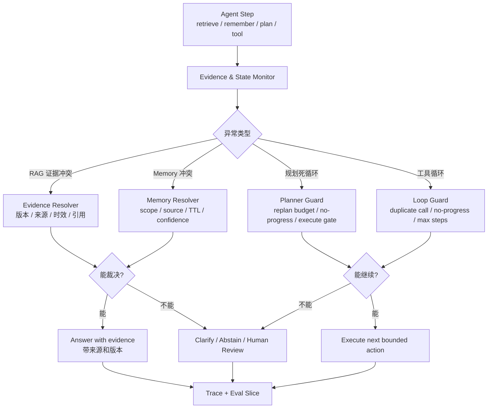

<section class="doc-hero">
  <p class="doc-hero__kicker">匿名真实面经</p>
  <h1>Agent 工程异常处理面试深挖：RAG 打架、记忆冲突、规划死循环怎么办</h1>
  <p class="doc-hero__lead">面试官问“资料互相矛盾怎么办”，不是在等一个标准答案，而是在看你有没有工程裁决机制。</p>
  <div class="doc-hero__meta" aria-label="本文信息">
    <span>适合阶段：Agent 工程师 / 平台架构面</span>
    <span>核心能力：冲突归因 · 停止条件 · 证据裁决 · 回归闭环</span>
    <span>脱敏原则：只保留工程方法，不保留真实业务细节</span>
  </div>
</section>

> 真实 Agent 线上问题很少长得像“模型不会答”。更多时候是：RAG 捞出两份互相矛盾的资料，长期记忆和最新输入打架，Planner 一直重新规划，工具失败后反复重试。

> **本文边界**：[RAG 选型面试深挖](../rag/rag-selection-interview) 讲方案选择，[RAG 评估](../rag/evaluation) 讲指标，[Memory Governance](../context/memory-governance-interview) 讲长期记忆治理，[工具调用死循环](../tools/tool-loop-interview) 讲工具 loop，[规划算法](../agent/planning) 和 [Plan-and-Execute](../agent/plan-execute) 讲规划机制。本文只讲面试里更难的那层：**工程异常出现后怎么归因、裁决、停止、降级和复盘**。

> **脱敏说明**：本文来自多场 Agent 工程岗位里反复出现的系统深挖题。所有案例都改写成通用业务 Agent，不出现可识别组织、具体案例、真实数量、业务口径数字、内部称呼或私有数据。

## 面试官想考什么

这组题没有一个“背下来就满分”的标准答案。面试官看的是你能不能把混乱问题拆成可执行决策。

<div class="interview-grid">
  <div>
    <strong>RAG 召回了多篇文档，但内容互相矛盾，你让模型怎么答？</strong>
    <span>考证据分组、时效、来源可信度、引用和澄清，而不是“让模型自己判断”。</span>
  </div>
  <div>
    <strong>长期记忆说用户偏好 A，当前对话里用户又说要 B，谁优先？</strong>
    <span>考 memory 的 scope、source、confidence、TTL 和覆盖机制。</span>
  </div>
  <div>
    <strong>检索出来的资料有旧版、新版和噪声，怎么避免拼成一个混合答案？</strong>
    <span>考 stale evidence、版本过滤、answer abstention 和冲突标注。</span>
  </div>
  <div>
    <strong>Agent 一直在规划、重规划，不进入执行，怎么办？</strong>
    <span>考规划死循环的停止条件、replan budget、no-progress detector 和人工/澄清分支。</span>
  </div>
  <div>
    <strong>怎么区分 retry、repair、replan、refuse？</strong>
    <span>考失败分类：瞬时错误、参数错误、前提变化和安全/权限边界不能混着处理。</span>
  </div>
  <div>
    <strong>如果没有足够证据，Agent 应该继续检索、提问澄清，还是直接回答“不知道”？</strong>
    <span>考 evidence policy 和用户体验，不是盲目扩大 top-k。</span>
  </div>
  <div>
    <strong>这类异常怎么进评估集？怎么防止修一个 case 又引入新问题？</strong>
    <span>考 conflict slice、loop slice、case-level diff 和回归门禁。</span>
  </div>
  <div>
    <strong>如果你现在重做，会把这些异常处理沉到哪一层？</strong>
    <span>考平台化抽象：retrieval evaluator、memory resolver、planner guard、runtime policy。</span>
  </div>
</div>

## 为什么“让模型综合一下”会失分

看一个典型 RAG trace：

```text
用户：采购合同超过多少金额需要复核？

retrieved docs:
1. policy_2024.md：超过 100 万需要复核。
2. policy_2026.md：超过 50 万需要复核。
3. faq.md：重要合同需要保留审批记录。

模型回答：
采购合同超过 100 万或 50 万都可能需要复核，建议根据具体情况判断。
```

这个答案看起来“谨慎”，实际是坏答案。它把旧版、新版、泛化 FAQ 混在一起，没有判断哪个证据适用，也没有向用户暴露冲突来源。用户得到的是一个折中幻觉。

再看一个规划 trace：

```text
Goal: 生成一份竞品分析

round 1: planner -> 需要收集资料、分析、输出报告
round 2: replanner -> 资料还不够，需要继续规划搜索策略
round 3: replanner -> 当前信息仍不足，需要制定更细计划
round 4: replanner -> 继续拆分子任务
runtime -> step limit reached
```

这里不是“规划能力强”，而是 Planner 进入了逃避执行的循环。它每轮都能产出看似合理的计划，但没有新增证据、没有执行动作、没有收敛目标。

成熟回答要先把这两类问题放到同一张图里：

```text
不确定性出现 -> 归因 -> 选择动作

证据冲突：分组 / 裁决 / 澄清 / 拒答
记忆冲突：按 source / scope / time / confidence 覆盖或降权
规划循环：预算 / 进展检测 / 执行门槛 / 中止
工具循环：去重 / no-progress / 错误分类 / fallback
```

换句话说，Agent Runtime 不能只会“继续问模型”。它要知道什么时候继续、什么时候停、什么时候澄清、什么时候人工介入。

## 一张异常处理控制面



这张图的意思很简单：异常处理要从“模型生成”前移到 runtime。模型可以参与判断，但系统要有独立的 policy 和 trace。

## RAG 证据冲突：先分型，再决定怎么答

“文档不一致”不是一个单一问题。不同冲突类型，期望行为完全不同。

| 冲突类型 | 表面现象 | 更稳的处理 |
|---|---|---|
| 版本冲突 | 旧版政策和新版政策同时召回 | 优先新版，旧版降权，并引用版本 |
| 实体歧义 | 同名产品、同名人、同名接口 | 反问澄清或按实体分组输出 |
| 来源可信度冲突 | 官方文档和论坛帖子不一致 | 来源分级，低可信来源只作参考 |
| 口径冲突 | 财务口径、运营口径、技术口径不同 | 标明口径，不强行合并 |
| 噪声冲突 | 无关文档因为关键词相似混入 | rerank / evaluator 过滤 |
| 缺证冲突 | 没有足够证据，但模型有参数知识 | 明确证据不足，不凭模型记忆编 |

2025 年的 *Retrieval-Augmented Generation with Conflicting Evidence* 提出 RAMDocs 数据集，专门模拟 ambiguity、misinformation 和 noise 同时出现的检索场景，并指出标准 RAG 在这类复杂冲突下仍然困难；论文里的 MADAM-RAG 用多 Agent debate + aggregator 处理多种证据冲突，但作者也说明仍有明显提升空间（[arXiv:2504.13079](https://arxiv.org/abs/2504.13079)）。这正好支持工程面试里的判断：**不要假设“多给几篇文档”就会自动变可靠**。

一个实用的证据裁决顺序：

```text
权限过滤 > 实体匹配 > 版本/时间 > 来源可信度 > 业务口径 > 相关性分数 > 模型总结
```

这里相关性分数排得很靠后。原因是向量相似度只能说明“像不像”，不能说明“新不新”“权威不权威”“适不适用于当前实体”。

## 记忆冲突：不要让旧记忆压过当前用户

长期记忆和 RAG 的冲突很常见：

```text
Memory: 用户默认要 PDF 报告。created_at=三个月前
Current message: 这次请给 Markdown。
RAG doc: 报告系统支持 PDF、Markdown、HTML。
```

如果系统直接把 memory 拼进 prompt，模型可能会优先遵循“默认 PDF”。这就是旧状态压过当前意图。

更稳的规则是：

| 来源 | 推荐优先级 | 说明 |
|---|---:|---|
| 当前用户明确指令 | 最高 | 只要不越权、不违规，应覆盖旧偏好 |
| 工具返回的实时事实 | 高 | 例如当前权限、订单状态、配置状态 |
| 最新官方知识 | 高 | 适合 RAG 里的政策、文档、规范 |
| 长期记忆 active record | 中 | 要看 source、TTL、scope、confidence |
| 模型推断出的偏好 | 低 | 默认不应覆盖明确事实 |
| 过期或 superseded 记忆 | 不注入 | 只能审计，不参与回答 |

这部分和 [Memory Governance 面试深挖](../context/memory-governance-interview) 的原则一致：长期记忆要有 `source`、`confidence`、`expires_at`、`status`、`supersedes`。没有这些字段，冲突时只能靠模型猜。

面试时可以这么答：

```text
我不会把 memory 当成永远正确的 profile。每条 memory 都有 source、scope、confidence、TTL 和 status。当前用户明确表达优先于旧偏好；实时工具事实优先于模型推断；过期或被覆盖的记忆不进入 context。
```

## 规划死循环：Planner 一直产出计划，却没有新增状态

你刚才补充的“意图规划总是持续出现规划”很典型。Planner 死循环不是工具死循环，但根因相似：系统没有定义“规划何时足够”“什么时候必须执行”“重规划的预算是多少”。

常见 trace：

```text
round 1: plan = ["收集资料", "分析", "输出"]
round 2: critique = "计划还不够细，需要补充资料来源"
round 3: replan = ["先明确目标", "再收集资料", "再分析"]
round 4: critique = "仍需更多背景"
round 5: replan = ["确认需求", "收集资料", "分析"]
```

这几轮都没有新增外部观察。它们只是把“我还不确定”包装成新计划。

LangGraph 的 `GRAPH_RECURSION_LIMIT` 文档把这类问题说得很直接：图在命中停止条件前达到最大步数，常见原因就是无限循环；正确方向是修 stop condition，`recursion_limit` 只是防线（[LangGraph GRAPH_RECURSION_LIMIT](https://docs.langchain.com/oss/python/langgraph/errors/GRAPH_RECURSION_LIMIT)）。Graph API 文档也说明 recursion limit 是单次执行的最大 super-steps，达到后会抛 `GraphRecursionError`，可以运行时配置，但这不等于业务逻辑正常结束（[LangGraph Graph API](https://docs.langchain.com/oss/python/langgraph/graph-api)）。

规划死循环的 guard 可以分四层：

| Guard | 检测什么 | 触发后怎么做 |
|---|---|---|
| Replan budget | 重规划次数超过上限 | 强制执行当前最佳计划或澄清 |
| No-new-evidence | 多轮没有工具结果、用户输入、状态变化 | 停止重规划，进入执行/澄清 |
| Plan similarity | 新计划和旧计划高度相似 | 认为无进展，压缩为当前计划 |
| Execute gate | 计划已有可执行第一步 | 不允许继续规划，必须执行 |

面试回答不要只说“加 max_steps”。更成熟的说法：

```text
我会区分计划不足和逃避执行。只要计划里已经有合法的第一步，就进入执行；只有执行反馈改变前提才允许 replan。连续两轮没有新增证据或新计划相似度很高，就触发澄清或人工，而不是继续让 planner 自嗨。
```

## retry、repair、replan、refuse 要分清

很多 Agent 失控，是因为所有失败都被塞进同一个动作：“再试一次”。

| 类型 | 例子 | 正确动作 | 错误动作 |
|---|---|---|---|
| retry | 网络超时、429、临时 5xx | 指数退避、熔断、备用服务 | 重新规划整个任务 |
| repair | 参数缺字段、JSON 格式错 | 定向补参、结构化修复 | 全量重跑 |
| replan | 工具结果证明前提不成立 | 更新状态后换路径 | 同参数重复调用 |
| clarify | 实体歧义、需求缺关键约束 | 问用户一个窄问题 | 擅自选一个实体 |
| abstain | 证据不足、高风险、权限不足 | 说明无法可靠回答 / 转人工 | 编一个折中答案 |
| refuse | 安全或权限边界命中 | 固定边界话术 / 审计 | 继续找绕路方案 |

这张表是面试里的“万能骨架”。它能同时接住 RAG 冲突、记忆冲突、规划死循环、工具重试循环。

## 可运行代码：EvidenceResolver + PlannerGuard

下面这段代码演示一个最小 runtime policy：它会检测 RAG 文档证据冲突，按来源/时间/置信度选证据；如果证据无法裁决，就要求澄清；同时检测 Planner 是否进入无进展重规划循环。

```python
from __future__ import annotations

from dataclasses import dataclass
from datetime import datetime
from difflib import SequenceMatcher
from enum import Enum


class Decision(str, Enum):
    ANSWER = "answer"
    CLARIFY = "clarify"
    ABSTAIN = "abstain"
    EXECUTE = "execute"
    STOP_PLANNING = "stop_planning"


@dataclass(frozen=True)
class Evidence:
    id: str
    claim_key: str
    claim_value: str
    source_type: str      # official / internal / forum / memory
    version: str
    updated_at: datetime
    confidence: float


@dataclass
class EvidenceDecision:
    decision: Decision
    value: str | None
    reason: str
    selected_ids: list[str]
    conflicting_ids: list[str]


SOURCE_WEIGHT = {
    "official": 4,
    "internal": 3,
    "memory": 2,
    "forum": 1,
}


class EvidenceResolver:
    def resolve(self, items: list[Evidence]) -> EvidenceDecision:
        if not items:
            return EvidenceDecision(
                Decision.ABSTAIN,
                None,
                "没有可用证据，不应凭模型参数知识回答。",
                [],
                [],
            )

        groups: dict[str, list[Evidence]] = {}
        for item in items:
            groups.setdefault(item.claim_value, []).append(item)

        if len(groups) == 1:
            value = next(iter(groups))
            return EvidenceDecision(
                Decision.ANSWER,
                value,
                "证据一致，可以回答并引用来源。",
                [item.id for item in items],
                [],
            )

        scored = []
        for value, group in groups.items():
            best_source = max(SOURCE_WEIGHT.get(item.source_type, 0) for item in group)
            newest = max(item.updated_at for item in group)
            avg_conf = sum(item.confidence for item in group) / len(group)
            scored.append((best_source, newest, avg_conf, value, group))

        scored.sort(reverse=True, key=lambda row: (row[0], row[1], row[2]))
        winner = scored[0]
        runner_up = scored[1]

        same_authority = winner[0] == runner_up[0]
        close_confidence = abs(winner[2] - runner_up[2]) < 0.08
        days_apart = abs((winner[1] - runner_up[1]).days)
        if same_authority and close_confidence and days_apart < 90:
            return EvidenceDecision(
                Decision.CLARIFY,
                None,
                "高可信证据互相冲突且时间接近，不能强行裁决。",
                [item.id for item in winner[4]],
                [item.id for _, _, _, _, group in scored[1:] for item in group],
            )

        return EvidenceDecision(
            Decision.ANSWER,
            winner[3],
            "按来源可信度、更新时间和置信度选择当前证据。",
            [item.id for item in winner[4]],
            [item.id for _, _, _, _, group in scored[1:] for item in group],
        )


@dataclass
class PlanState:
    plans: list[str]
    evidence_count: int
    executed_steps: int
    replan_count: int


class PlannerGuard:
    def __init__(self, max_replans: int = 2, similarity_threshold: float = 0.86) -> None:
        self.max_replans = max_replans
        self.similarity_threshold = similarity_threshold

    def inspect(self, state: PlanState) -> tuple[Decision, str]:
        if state.replan_count > self.max_replans:
            return Decision.STOP_PLANNING, "重规划次数超过预算。"

        if len(state.plans) >= 2:
            ratio = SequenceMatcher(None, state.plans[-2], state.plans[-1]).ratio()
            if ratio >= self.similarity_threshold and state.executed_steps == 0:
                return Decision.EXECUTE, "新计划和旧计划高度相似，且尚未执行任何步骤，应停止继续规划并执行第一步。"

        if state.evidence_count == 0 and state.replan_count >= 1:
            return Decision.CLARIFY, "没有新增证据却持续重规划，应向用户澄清关键约束。"

        return Decision.EXECUTE, "计划足够进入有界执行。"


if __name__ == "__main__":
    docs = [
        Evidence("d_old", "approval_limit", "100w", "official", "2024", datetime(2024, 6, 1), 0.95),
        Evidence("d_new", "approval_limit", "50w", "official", "2026", datetime(2026, 1, 1), 0.93),
        Evidence("d_faq", "approval_limit", "important_contract", "internal", "2025", datetime(2025, 8, 1), 0.70),
    ]
    print(EvidenceResolver().resolve(docs))

    planning = PlanState(
        plans=[
            "收集资料 -> 分析 -> 输出报告",
            "先收集资料，然后分析资料，最后输出报告",
        ],
        evidence_count=0,
        executed_steps=0,
        replan_count=2,
    )
    print(PlannerGuard().inspect(planning))
```

这段代码刻意很小，但面试足够用。它表达了三个重点：

- 证据冲突要显式记录 `selected_ids` 和 `conflicting_ids`，不能只输出最终答案。
- 不能裁决时返回 `CLARIFY` 或 `ABSTAIN`，不是让模型折中。
- 规划循环要看 replan 次数、计划相似度、是否新增证据、是否已经执行。

## 没有统一答案时，回答要有决策表

用户问“资料冲突怎么办”，不要直接给一个固定规则。先反问或在系统里判断业务风险：

| 场景 | 推荐动作 |
|---|---|
| 低风险、冲突可解释 | 标明不同来源，给出倾向和引用 |
| 高风险、冲突不可裁决 | 不给最终建议，澄清或人工 |
| 新旧版本冲突 | 默认按最新版，旧版只作为冲突记录 |
| 来源可信度差距很大 | 选择高可信来源，说明低可信来源未采纳 |
| 实体歧义 | 不猜实体，问用户选择 |
| 规划迟迟不执行 | 停止规划，执行第一步或澄清关键约束 |
| 工具重复失败 | 区分 retry/repair/replan/refuse，不无限重试 |

这就是“没有统一标准答案”的答法：不是没有原则，而是原则要依赖风险、证据、权限、时效和用户体验。

## 这类异常怎么评估

把异常写进评估集时，不要只写 happy path。

| Eval slice | 样本长什么样 | 期望行为 |
|---|---|---|
| `conflicting_versions` | top-k 同时有旧版和新版 | 选择新版并引用，记录旧版冲突 |
| `ambiguous_entity` | 同名实体多份资料 | 澄清，不擅自选择 |
| `memory_override` | 旧记忆与当前指令冲突 | 当前指令覆盖旧记忆 |
| `no_evidence` | 检索为空或低相关 | abstain 或扩大检索，不编答案 |
| `planner_loop` | 多轮 replan 无执行 | 触发 execute gate 或 clarify |
| `duplicate_tool_call` | 同工具同参数重复 | 拦截并复用已有结果 |
| `stale_memory` | 过期记忆被召回 | 不注入 active context |

指标也要分开：

- conflict detection recall：该发现冲突的是否发现。
- wrong arbitration rate：冲突裁决是否选错证据。
- abstain precision：拒答是否真的证据不足。
- replan rate：每个任务平均重规划次数。
- no-progress abort rate：多少任务因无进展被停止。
- human escalation precision：转人工的样本是否值得转。
- regression pass rate：修复后旧 case 有没有回退。

这和 [Agent 线上质量治理](./agent-quality-interview) 是同一套闭环：trace -> badcase -> slice -> regression。

## 常见陷阱

### 陷阱 1：把 top-1 当真理

**现象**：RAG top-1 是旧文档，模型直接按旧文档回答。

**根因**：ranking score 被当成事实可信度，缺少版本、来源和口径过滤。

**修法**：检索后先做 evidence validation。版本字段、来源等级、实体匹配和权限过滤要早于生成。

### 陷阱 2：把冲突交给模型自由综合

**现象**：模型生成一个“二者都可能”的折中答案。

**根因**：prompt 要求“综合资料”，但没有要求识别冲突、标注来源、不能裁决时 abstain。

**修法**：先让 resolver 输出结构化 verdict：一致、冲突、缺证、歧义。只有一致或可裁决时才进入生成。

### 陷阱 3：长期记忆永不过期

**现象**：用户当前明确改了偏好，Agent 仍按旧偏好回答。

**根因**：memory 没有 status、TTL、supersedes，也没有当前输入优先级。

**修法**：记忆写入和召回都要带治理字段；当前用户明确输入优先于旧偏好。

### 陷阱 4：Planner 把“不确定”变成无限规划

**现象**：Agent 一直说需要更细计划，却不执行任何可验证动作。

**根因**：缺少 execute gate、replan budget 和 no-progress detector。

**修法**：只允许执行反馈触发 replan；计划已有合法第一步时必须进入执行；多轮无新增证据就澄清或中止。

### 陷阱 5：所有失败都重试

**现象**：权限不足、参数错误、证据不足都被当成“再试一次”。

**根因**：没有失败类型。retry、repair、replan、clarify、abstain、refuse 混在一起。

**修法**：工具和 resolver 返回结构化 error_type；runtime policy 决定下一步动作。

### 陷阱 6：只修 prompt，不修 trace

**现象**：这个 case 暂时好了，下次换文档、换模型又坏。

**根因**：没有把冲突证据、裁决理由、planner 状态写入 trace，无法回归。

**修法**：每次异常记录 selected evidence、conflicting evidence、decision、policy version、planner rounds，进入 eval slice。

## 与相邻文章的区别

| 文章 | 解决的问题 | 本文的边界 |
|---|---|---|
| [RAG 选型面试深挖](../rag/rag-selection-interview) | 托管/自建、向量库、评估指标和退出条件 | 本文只讲检索后证据冲突怎么裁决 |
| [RAG 评估](../rag/evaluation) | retrieval / grounding / answer quality 指标 | 本文补充 conflict、abstain、planner_loop 这些异常 slice |
| [Memory Governance](../context/memory-governance-interview) | 记忆写入、TTL、权限、覆盖 | 本文只讲 memory 与当前输入/RAG 冲突时怎么决策 |
| [工具调用死循环](../tools/tool-loop-interview) | 工具重复调用、状态机和 loop guard | 本文把工具循环放进更大的异常处理框架 |
| [Plan-and-Execute](../agent/plan-execute) | 规划/执行/重规划模式 | 本文专讲规划死循环和停止条件 |

## 面试题深度解析

### Q1：RAG 召回多篇互相矛盾的文档，怎么答？

**30 秒版本**：先不要让模型直接综合。检索后做 evidence validation：按实体、权限、版本、来源可信度、更新时间分组。能裁决就回答并引用；不能裁决就标明冲突、澄清或拒答。

**追问 1：如果新版文档和旧版文档都很像用户问题呢？**  
相似度不能当可信度。版本和发布时间应早于向量分数。回答要引用新版，并把旧版作为冲突 trace，不应该混成折中答案。

**追问 2：如果两个高可信来源口径不同呢？**  
不要强行选。先判断是否是口径差异，比如财务口径和运营口径。能分口径就并列说明；不能分就澄清或人工复核。

### Q2：长期记忆和当前用户输入冲突，谁优先？

**30 秒版本**：当前用户明确输入优先于旧偏好，实时工具事实优先于模型推断。长期记忆必须有 source、scope、confidence、TTL、status，过期或 superseded 记忆不应进入上下文。

**追问 1：旧记忆还要不要保留？**  
保留审计和版本链，但状态改为 superseded 或 inactive。它可以帮助复盘，不应该继续参与回答。

**追问 2：模型推断出的偏好能覆盖用户显式偏好吗？**  
不能。模型推断最多进入 pending，需要多次证据或用户确认。显式输入和工具事实优先级更高。

### Q3：Agent 一直重规划、不执行，怎么办？

**30 秒版本**：给 Planner 加 replan budget、execute gate、no-progress detector。只要已有可执行第一步，就进入执行；只有执行反馈改变前提才允许 replan。

**追问 1：max_steps 不就解决了吗？**  
max_steps 是保险丝，不是修复。真正修复是 stop condition 和状态更新。LangGraph 的 recursion limit 命中通常说明没有到达正常停止条件。

**追问 2：如果信息确实不足呢？**  
不要继续空转规划。向用户问一个窄澄清问题，或者执行最小信息收集动作。没有新增证据的 replan 没有价值。

### Q4：怎么区分 retry、repair、replan、refuse？

**30 秒版本**：看失败原因。临时 5xx/429 是 retry；参数缺字段是 repair；工具结果推翻前提是 replan；权限或安全边界是 refuse；实体不清是 clarify；证据不足是 abstain。

**追问 1：为什么不能都重试？**  
确定性错误重试只会烧成本。权限不足、证据冲突、实体歧义不会因为多试几次自动变好。

**追问 2：这靠 prompt 还是代码？**  
代码。工具结果和 resolver 应返回结构化 error_type，runtime policy 决定下一步。prompt 可以解释原因，但不能负责裁决。

### Q5：这种没有标准答案的问题怎么做评估？

**30 秒版本**：把异常类型做成 eval slice：conflicting_versions、ambiguous_entity、memory_override、planner_loop、duplicate_tool_call、no_evidence。每类定义期望行为，不只看最终答案。

**追问 1：LLM judge 能评吗？**  
可以评一部分，比如是否识别冲突、是否引用来源、是否不编答案。但高风险 slice 要人工校准，judge 本身也要固定版本和 rubric。

**追问 2：线上 case 怎么回流？**  
每次 conflict、clarify、abstain、loop abort、human escalation 都写 trace，抽样进入回归集。改 resolver 或 planner guard 后跑 case-level diff。

## 延伸阅读

- [Retrieval-Augmented Generation with Conflicting Evidence](https://arxiv.org/abs/2504.13079)  
  为什么读：专门讨论 RAG 里的 ambiguity、misinformation、noise 同时出现，适合支撑“冲突证据不是边缘问题”。
- [Corrective Retrieval Augmented Generation](https://arxiv.org/abs/2401.15884)  
  为什么读：CRAG 用 lightweight retrieval evaluator 判断检索质量，再触发纠正动作，是证据质量门控的典型思路。
- [Self-RAG](https://arxiv.org/abs/2310.11511)  
  为什么读：Self-RAG 用 reflection tokens 决定是否检索、评价证据和生成质量，适合理解“检索不是固定 top-k”。
- [LangGraph GRAPH_RECURSION_LIMIT](https://docs.langchain.com/oss/python/langgraph/errors/GRAPH_RECURSION_LIMIT)  
  为什么读：官方明确把达到递归限制和缺失停止条件、无限循环联系起来，正好对应规划死循环。
- [LangGraph Graph API - Recursion limit](https://docs.langchain.com/oss/python/langgraph/graph-api)  
  为什么读：理解 recursion limit 是 super-step 上限，避免把它误当成业务终止逻辑。
- [DRAGged into Conflicts](https://arxiv.org/abs/2506.08500)  
  为什么读：提出 RAG 知识冲突类型和期望行为的 taxonomy，适合设计 eval slice。
- [CONFACT](https://arxiv.org/abs/2505.17762)  
  为什么读：从事实核查角度研究不同可信来源的冲突证据，能补“来源可信度”这条工程轴。

配套阅读：

- [RAG 评估](../rag/evaluation)：把 conflict slice 接进 retrieval / grounding / answer quality 评估体系。
- [Memory Governance 面试深挖](../context/memory-governance-interview)：长期记忆冲突、覆盖和 TTL 的详细治理方案。
- [工具调用死循环面试深挖](../tools/tool-loop-interview)：重复 tool call、no-progress detector 和 loop guard 的细节。
- [Plan-and-Execute](../agent/plan-execute)：规划/执行/重规划的基本模式。
- [Agent 线上质量治理面试深挖](./agent-quality-interview)：把异常 trace 回流到 badcase 和回归集。
