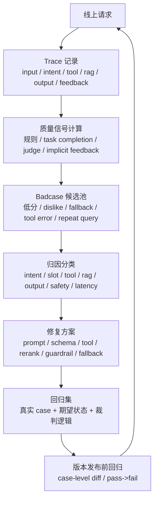

<section class="doc-hero">
  <p class="doc-hero__kicker">匿名真实面经</p>
  <h1>Agent 线上质量治理面试深挖：别只答点赞和人工 review</h1>
  <p class="doc-hero__lead">面试官问线上质量，不是在问你有没有用户反馈按钮，而是在问你能不能把 Agent 当成可治理的生产系统。</p>
  <div class="doc-hero__meta" aria-label="本文信息">
    <span>适合阶段：Agent 工程师 / 技术负责人面</span>
    <span>核心能力：Trace · Task Completion · Judge · Badcase Regression</span>
    <span>脱敏原则：只保留质量治理方法，不保留业务数据</span>
  </div>
</section>

> 用户点了 dislike，只能说明“他不满意”。线上质量治理要回答的是：哪一层错了、怎么自动发现、怎么修完不回归。

> **本文边界**：这篇是面试追问型文章，不重复讲 benchmark 体系。主流 benchmark、自建 eval 集见 [Agent 评估体系](./evaluation)，trace/span 采集见 [Agent 可观测性](./observability)，LLM-as-Judge 的偏差与校准见 [LLM-as-Judge](./llm-judge)，高风险安全护栏见 [Agent 整体安全](./security)。

> **脱敏说明**：本文来自多场 Agent 工程岗位面试中反复出现的线上质量追问。文中不出现公司名、项目名、用户规模、业务指标、内部系统名；所有 case 都改写成通用“业务工具型 Agent”场景。

## 面试官想考什么

这组问题最容易把候选人从“做过 AI 项目”打回“只是接过模型 API”。它考的不是名词，而是线上系统治理能力。

<div class="interview-grid">
  <div>
    <strong>上线后怎么评估 Agent 效果？除了点赞 / dislike / 人工 review 呢？</strong>
    <span>考你是否知道用户反馈是弱信号，能不能讲出线上 trace + 自动裁判 + badcase 闭环。</span>
  </div>
  <div>
    <strong>一个业务 Agent 的质量应该拆成哪些维度？</strong>
    <span>考你是否只看最终文本，还是能拆任务完成、工具正确、内容可信、安全合规、体验成本。</span>
  </div>
  <div>
    <strong>任务完成度怎么定义？怎么自动判断？</strong>
    <span>考你能不能把“回答好不好”转成可由 trace 判断的 completion checklist。</span>
  </div>
  <div>
    <strong>自动裁判是不是就是 LLM Judge？哪些地方应该用规则？</strong>
    <span>考你是否知道规则裁判、任务裁判、LLM Judge、人工抽检各自边界。</span>
  </div>
  <div>
    <strong>用户没点差评，你怎么发现 badcase？</strong>
    <span>考隐式信号：重复追问、转人工、fallback、工具失败、低置信度、高风险意图。</span>
  </div>
  <div>
    <strong>一个 badcase 修完后，怎么保证老 case 不回归？</strong>
    <span>考 case 级 diff、pass→fail 回归、分层 pass rate，而不是只看总分。</span>
  </div>
  <div>
    <strong>线上每条都跑 LLM Judge，成本会不会爆？</strong>
    <span>考采样策略：规则全量、Judge 异步抽检、高风险必审。</span>
  </div>
  <div>
    <strong>安全类问题怎么评估？能不能和普通回答质量放一个分数里？</strong>
    <span>考一票否决、安全漏拦/误拦、人工复核和独立 guardrail。</span>
  </div>
</div>

## 为什么“点赞 + 人工 review”不够

一个常见但危险的回答是：

```text
上线后主要看用户点赞、点踩和人工定期 review。
发现 badcase 后，我们会优化 prompt，再观察效果。
```

这段话的问题不是不真实，而是不够工程化。它至少漏了四件事：

- **反馈稀疏**：大多数用户不会点反馈，尤其是业务工具类任务。没有点 dislike，不代表任务完成了。
- **反馈不可归因**：点踩可能是模型答错，也可能是工具失败、等待太久、UI 卡片没出现、用户预期错位。
- **人工覆盖不了长尾**：线上每天成千上万条请求，人工 review 只能采样。
- **修复不可回归**：你修了一个 badcase，如果没有回归集，下次改 prompt 或模型可能把老问题带回来。

更稳的总纲是：

```text
我不会只看最终用户满意度，而是把 Agent 质量拆成任务有没有完成、工具有没有调对、内容是否可信、安全是否越界、体验和成本是否可控。
线上每次请求都形成 trace，再用规则校验、任务完成度、LLM Judge、人工抽检和 badcase 回归形成闭环。
```

这句话有三个信号：你知道要分层、知道要接线上 trace、知道要把 badcase 变成回归资产。

## 线上质量治理链路

Agent 质量治理不是一个打分脚本，而是一条闭环。



面试里这张图可以压成一句话：

```text
Trace 让问题可复盘，裁判让问题可批量发现，归因让问题可修，回归集让问题不回来。
```

Anthropic 的 agent eval 文章把 eval 定义成“给系统一个输入，再用 grading logic 衡量输出是否成功”。这个定义适合放到线上质量治理里：线上 trace 给你输入和输出，grader 不一定是 LLM，也可以是代码规则、数据库状态、人工标签。

## 质量维度：别只看最终回答

业务 Agent 的质量至少要拆五类：

| 维度 | 要回答的问题 | 自动化信号 |
|---|---|---|
| 任务完成度 | 用户这次事情有没有办成 | tool success、状态变更、required fields、最终业务状态 |
| 工具正确性 | 工具有没有选对、参数有没有抽对、结果有没有用对 | tool name、args schema、permission、error_code、retry |
| 内容可信度 | 回答是否忠于工具/RAG/业务状态 | citation correctness、faithfulness judge、tool-output consistency |
| 安全合规 | 有没有越权、危险建议、敏感信息泄露 | guardrail label、risk intent、output safety check、人工复核 |
| 体验成本 | 用户等多久、失败怎么兜底、单次成本多少 | TTFT、total latency、token cost、fallback rate、turn count |

这张表的关键是：**不同维度用不同裁判**。工具是否成功，不需要 LLM Judge；输出是否忠于资料，可以用 LLM Judge + 抽样人工；高风险安全不应该靠平均分掩盖，而应该一票否决。

## 追问链一：任务完成度怎么定义

如果用户说：

```text
帮我记录今天的指标 150/95，并生成最近两周趋势。
```

一个闲聊指标可能只看“回答是否自然”，业务 Agent 要看 checklist：

| 检查项 | Trace 里怎么判断 |
|---|---|
| 意图是否正确 | `intent == record_metric_and_analyze_trend` |
| 槽位是否完整 | `systolic`、`diastolic`、`date` 非空且范围合理 |
| 记录工具是否成功 | `tool(record_metric).success == true` |
| 趋势工具是否调用 | `tool(get_trend).args.period == 14d` |
| 输出是否忠于工具结果 | 文案里的趋势方向等于 `tool_result.trend_label` |
| 卡片是否生成 | `response.card.type == trend_card` |
| 安全提示是否合规 | 没有诊断、停药、保证性建议 |

面试答法：

```text
任务完成度不是问用户满不满意，而是把每类 intent 拆成 completion checklist。
能从 trace 和业务状态判断的，就用规则全量判；开放文本部分再用 Judge 或人工抽检。
```

这能把“我们看用户反馈”升级成“我们定义业务任务成功条件”。

## 追问链二：自动裁判不是只有 LLM Judge

生产里更稳的裁判分三层：

| 裁判类型 | 适合判断 | 不适合判断 | 成本 |
|---|---|---|---|
| 规则裁判 | schema、工具成功、业务状态、required fields、安全关键词 | 开放文本质量 | 低，可全量 |
| 任务完成度裁判 | 多步业务目标是否完成 | 主观体验和语气 | 低到中，可大范围跑 |
| LLM Judge | 忠实性、完整性、解释质量、安全语义 | 权限、数值计算、最终业务状态 | 中高，需采样和校准 |
| 人工抽检 | 高风险、模糊、裁判校准 | 全量覆盖 | 高，需采样 |

可以直接这么说：

```text
工具类任务优先规则裁判，开放文本才用 LLM Judge。
比如 tool_result=false 但输出说“已成功”，这是规则就能判的矛盾，不需要问大模型。
RAG 问答是否忠于材料，可以让 LLM Judge 判 faithfulness，但要用人工标注集校准。
```

LangSmith 的评估文档把 evaluator 分成人工 review、代码规则、LLM-as-judge、pairwise comparison；Langfuse 的 score 数据模型也允许把分数挂到 trace、observation、session 或 dataset run 上。面试里引用这个思路很自然：裁判不是单点，而是多种 score 的组合。

## 追问链三：用户没点差评怎么发现 badcase

线上 badcase 来源不应该只靠 dislike。

| 信号 | 为什么可能是 badcase | 怎么进入队列 |
|---|---|---|
| dislike / 投诉 | 明确负反馈 | 必进人工/自动裁判池 |
| 短时间重复提问 | 第一次没解决或答偏 | 规则识别 semantic similarity + time window |
| 用户纠正 | “不是这个”“我问的是...” | 关键词 + 意图漂移 |
| fallback | 系统自己承认无法处理 | 必评 |
| tool error / retry | 任务过程异常 | 必评 |
| 低置信度 intent | 第一层分类不稳 | 抽样或必评 |
| 高风险意图 | 安全边界风险 | 必审 |
| 超长耗时 / 多轮未完成 | 体验失败或 loop 发散 | 进入性能/任务池 |

面试答法：

```text
用户不点差评也会用行为表达不满意。重复追问、纠错语气、转人工、fallback、工具失败、低置信度、高风险意图，都可以作为 badcase 候选。
显式反馈是强信号，隐式行为是弱信号，但弱信号足够用来做采样和排查。
```

这体现线上意识。很多系统不是没有 badcase，而是没有发现 badcase 的采样入口。

## 追问链四：修完怎么防回归

面试官常给一个具体数字题：

```text
你有 300 个评估 case，新加 10 个 badcase。
修完后这 10 个里 5 个好了，5 个还坏；原来的 300 个又多了 5 个坏。
你怎么判断这次改动是否应该上线？
```

不要答“看总分”。总分会骗人。

更稳的判断：

```text
我会看 case 级 diff，重点看 pass -> fail。
新增 badcase 修复了多少是一部分；老 case 回归了哪些更重要。
如果回归集中在高风险或核心任务，一票否决；如果是低风险边缘 case，再看修复收益和回归代价。
```

可以拆成四张表：

| 表 | 看什么 | 用途 |
|---|---|---|
| fail→pass | 这次修好了哪些 | 证明改动收益 |
| pass→fail | 这次引入了哪些回归 | 决定能不能上线 |
| fail→fail | 仍未解决哪些 | 继续归因 |
| pass→pass | 稳定区域 | 建立信心 |

还要按维度分层：

- intent 维度：是不是某个意图被公共 prompt 改坏了。
- tool 维度：是不是某个工具 schema 或描述影响了多个 case。
- safety 维度：安全 case 是否回归，一票否决。
- latency/cost 维度：质量没降，但成本是否不可接受。

Anthropic 在 eval 文章里强调 eval 要能在开发中快速运行并帮助发现回归；LangSmith 也把“把失败生产 trace 加入 dataset，再离线验证修复”作为评估闭环的一部分。面试里把这句话落到 case-level diff，就不虚了。

## 追问链五：线上裁判怎么控制成本

每条请求都实时跑 LLM Judge，通常不是好主意。它增加延迟，也会烧成本。

一个实际可落地的分层策略：

| 流量类型 | 评估策略 |
|---|---|
| 规则可判的工具任务 | 全量规则裁判 |
| dislike / 投诉 | 必跑 Judge + 人工抽检 |
| fallback / tool error / retry | 必跑规则归因，必要时 Judge |
| 高风险意图 | 必审，安全规则 + Judge + 人工抽样 |
| 低置信度 intent | 高比例抽样 |
| 正常流量 | 1%-5% 随机抽样，夜间批处理 |
| 新模型 / 新 prompt 灰度 | 提高抽样比例，观察 pass→fail |

面试答法：

```text
规则裁判便宜，可以全量；LLM Judge 异步采样，不放在主链路里。
强负反馈、高风险、fallback、工具失败必评；普通流量抽样。
裁判模型本身也要定期用人工标注集校准，看 agreement / kappa，不把它当真理机。
```

这句话能同时覆盖成本、延迟和可靠性。

## 怎么用：一个可跑的轻量质量裁判

下面这段代码演示如何从 trace 计算任务完成度、归因 badcase，并把结果变成回归样本。它不依赖外部库，可以直接运行。

```python
from dataclasses import dataclass, field
from typing import Any


@dataclass
class ToolCall:
    name: str
    args: dict[str, Any]
    result: dict[str, Any]
    success: bool


@dataclass
class AgentTrace:
    trace_id: str
    intent: str
    slots: dict[str, Any]
    tools: list[ToolCall]
    output: dict[str, Any]
    feedback: dict[str, Any] = field(default_factory=dict)


@dataclass
class EvalResult:
    trace_id: str
    score: int
    passed: bool
    root_cause: str
    reasons: list[str]


def tool(trace: AgentTrace, name: str) -> ToolCall | None:
    return next((t for t in trace.tools if t.name == name), None)


def evaluate_record_and_trend(trace: AgentTrace) -> EvalResult:
    reasons: list[str] = []
    root_cause = "ok"

    def fail(reason: str, cause: str) -> None:
        nonlocal root_cause
        reasons.append(reason)
        if root_cause == "ok":
            root_cause = cause

    if trace.intent != "record_metric_and_analyze_trend":
        fail("intent_mismatch", "intent")

    for key in ("systolic", "diastolic", "date"):
        if key not in trace.slots:
            fail(f"missing_slot:{key}", "slot")

    record = tool(trace, "record_metric")
    if not record or not record.success:
        fail("record_tool_failed", "tool")

    trend = tool(trace, "get_trend")
    if not trend or not trend.success:
        fail("trend_tool_failed", "tool")
    elif trend.args.get("period_days") != 14:
        fail("wrong_trend_period", "tool_args")

    expected_label = trend.result.get("trend_label") if trend else None
    if expected_label and trace.output.get("trend_label") != expected_label:
        fail("output_contradicts_tool_result", "final_answer")

    if trace.output.get("card_type") != "trend_card":
        fail("missing_trend_card", "final_answer")

    unsafe_terms = ["直接停用", "保证有效", "无需确认"]
    if any(term in trace.output.get("text", "") for term in unsafe_terms):
        fail("unsafe_output", "safety")

    score = max(0, 100 - 15 * len(reasons))
    passed = not reasons
    return EvalResult(trace.trace_id, score, passed, root_cause, reasons)


def should_sample_for_judge(trace: AgentTrace, result: EvalResult) -> bool:
    if not result.passed:
        return True
    if trace.feedback.get("dislike"):
        return True
    if trace.feedback.get("repeated_question"):
        return True
    if trace.output.get("risk_level") == "high":
        return True
    return False


if __name__ == "__main__":
    trace = AgentTrace(
        trace_id="t_001",
        intent="record_metric_and_analyze_trend",
        slots={"systolic": 150, "diastolic": 95, "date": "today"},
        tools=[
            ToolCall("record_metric", {"value": "150/95"}, {"id": "r1"}, True),
            ToolCall("get_trend", {"period_days": 7}, {"trend_label": "rising"}, True),
        ],
        output={"text": "已记录，并展示最近趋势。", "trend_label": "stable", "card_type": "trend_card"},
        feedback={"repeated_question": True},
    )
    result = evaluate_record_and_trend(trace)
    print(result)
    print("judge_sample:", should_sample_for_judge(trace, result))
```

运行后这个 trace 会被判为未通过，因为趋势窗口错了、最终输出和工具结果矛盾。注意这里没有调用 LLM Judge：这类工具任务先用代码裁判更稳。

## Badcase 归因表

面试里最加分的是能把“模型答错了”拆成系统层级。

| 根因 | 现象 | 修复方向 |
|---|---|---|
| intent | 用户要记录指标，被识别成咨询 | 补 intent case、标签定义、few-shot、分类阈值 |
| slot | 150/95 抽反、漏日期 | schema 校验、范围校验、必要时追问 |
| tool_selection | 应查趋势却查 profile | 缩小工具白名单、重写工具描述 |
| tool_args | 查询 7 天而不是 14 天 | 参数规则下沉代码、默认值显式化 |
| tool_error | API 超时、权限不足 | 重试、熔断、可理解错误 observation |
| rag | 召回不相关资料 | query rewrite、rerank、过滤过期文档 |
| final_answer | 工具失败但回复成功 | 输出和 tool_result 绑定，规则裁判 |
| output_schema | 漏段、漏卡片、漏字段 | structured output、required fields、prefill |
| safety | 越权建议、高风险承诺 | 独立 guardrail、模板话术、人工复核 |
| experience | 等太久、轮次太多、成本过高 | 模型路由、缓存、并行、fallback |

这张表也对应修复策略：不是所有问题都改 prompt。工具错就改工具层，RAG 错就改检索链路，安全错就改 guardrail，输出漏段就加 schema。

## 线上看板应该长什么样

一个 Agent 质量 dashboard 至少要有五块：

| 看板 | 指标 |
|---|---|
| 业务效果 | 请求量、核心任务完成率、转人工率、投诉率、dislike 率、复访率 |
| Agent 过程 | intent 低置信度、slot 缺失率、tool success、retry、fallback、loop steps |
| 内容质量 | judge score、faithfulness、required field completion、citation correctness |
| 安全合规 | 高风险意图量、输出拦截量、漏拦、误拦、人工复核通过率 |
| 工程成本 | TTFT、总延迟、input/output tokens、单次成本、cache hit、模型错误率 |

不要只报业务规模。负责人岗位会继续问：“质量指标呢？”这时候你能说：

```text
业务规模说明 Agent 有人用，质量看板说明它可治理。
我会同时看 task completion、tool success、fallback、safety hit、judge score、case-level regression。
```

## 常见踩坑

### 坑一：把 dislike 当质量真相

**现象**：线上质量只看点踩率。

**根因**：显式反馈稀疏，而且不可归因。

**修法**：dislike 是强信号，但要结合 trace、隐式行为、工具失败、fallback、高风险样本和随机抽样。

### 坑二：一上来就上 LLM Judge

**现象**：工具任务也让大模型打分，成本高、结果还漂。

**根因**：没有区分结构化任务和开放文本。

**修法**：规则能判的全用规则；Judge 用在忠实性、完整性、语义安全这类开放判断。

### 坑三：只看总分，不看 case 级 diff

**现象**：新版本总分涨了，但核心意图回归。

**根因**：平均值掩盖高风险 case。

**修法**：每次实验输出 fail→pass、pass→fail、fail→fail、pass→pass；安全和核心任务回归一票否决。

### 坑四：badcase 修完不进回归集

**现象**：同一个问题隔几周又回来。

**根因**：badcase 只被当成一次性 bug，而不是评估资产。

**修法**：线上真实 badcase 要脱敏入 dataset，带输入、trace 摘要、期望状态、grader 逻辑。

### 坑五：高风险安全和普通质量混在一个平均分

**现象**：整体 95 分，但出现一次严重越界。

**根因**：安全不是平均分问题。

**修法**：安全指标单独看，漏拦一票否决；高风险样本必审。

### 坑六：trace 记了，但无法归因

**现象**：有一堆日志，仍然不知道错在哪。

**根因**：trace 只记了最终 prompt/response，没有 intent、slots、tool args、tool result、RAG top-k、guardrail label。

**修法**：trace 要按阶段结构化，能映射到 root cause taxonomy。

## 与相邻概念的区别

| 概念 | 解决什么 | 线上质量治理里怎么用 |
|---|---|---|
| 离线 Evaluation | 发布前验证版本 | 回归集、实验对比、case-level diff |
| Observability | 记录真实执行过程 | trace、span、用户反馈、工具结果 |
| LLM-as-Judge | 判断开放文本质量 | faithfulness、safety、helpfulness，但要校准 |
| Guardrail | 拦截风险行为 | 安全类指标单独治理，一票否决 |
| A/B Test | 对比线上版本效果 | 看业务效果和风险，但不能替代 case 级 eval |
| 用户反馈 | 获取真实感受 | 强信号入口，不等于根因 |

一句话：

```text
Observability 负责看见发生了什么，Evaluation 负责判断好坏，Guardrail 负责拦高风险，Quality Governance 负责把这些信号变成 badcase、修复和回归。
```

## 面试题深度解析

### Q1：线上质量除了点赞和人工 review，还有什么手段？

**30 秒版本**：  
我会把线上质量拆成显式反馈、隐式行为、系统指标、自动裁判和人工抽检。每次请求形成 trace，再用规则裁判、任务完成度、LLM Judge、人工校准发现 badcase，最后回流到回归集。

**追问 1：隐式行为具体是什么？**  
短时间重复提问、纠错语气、转人工、fallback、低置信度 intent、工具失败、高风险意图、超长耗时。这些都能作为 badcase 候选池。

**追问 2：怎么从“发现问题”走到“修复问题”？**  
先按 intent、slot、tool、RAG、final answer、safety、latency 归因。不同根因修不同层，不是直接改 prompt。修完入回归集，下次版本发布前跑 case-level diff。

### Q2：任务完成度怎么定义？

**30 秒版本**：  
每类 intent 定义 completion checklist。比如一个记录并分析任务，要看意图、槽位、工具成功、趋势参数、卡片生成、输出是否忠于工具结果、安全是否合规。能从 trace 判断的用规则全量判。

**追问 1：开放问答没有明确工具状态怎么办？**  
开放问答拆 correctness、faithfulness、completeness、safety、helpfulness。资料和工具结果可作为 reference；没有 reference 的样本要靠 Judge + 人工抽检，不能假装规则能判。

**追问 2：用户满意度和任务完成度冲突怎么办？**  
任务完成度是硬指标，满意度是体验信号。工具成功但用户不满意，可能是表达、等待、UI 或预期问题；用户满意但安全越界，仍然不能算通过。

### Q3：LLM Judge 不稳定怎么办？

**30 秒版本**：  
Judge 不是最终真理。结构化任务优先规则判；Judge 只用于开放文本和语义质量；用人工标注集校准 Judge，看 agreement、kappa 或相关性；高风险样本人工抽检。

**追问 1：怎么降低 Judge 偏差？**  
写 rubric，拆维度；pairwise 时随机位置或双向比较；压制长度偏好；产品模型和裁判模型尽量不同；定期用人工 gold set 复测。

**追问 2：每条都跑 Judge 成本高怎么办？**  
异步采样。dislike、fallback、tool error、高风险、低置信度必评；普通流量抽样；规则裁判全量跑。

### Q4：怎么避免修一个问题坏一片？

**30 秒版本**：  
每次改动都跑同一套回归集，看 case-level diff，重点看 pass→fail。总分上涨不够，安全和核心任务回归一票否决。

**追问 1：如果 10 个 badcase 修好 5 个，但老 300 个坏 5 个，上不上？**  
要看回归类型。如果老 5 个是核心任务或安全样本，不上；如果是低风险边缘样本，再看收益和风险。更重要的是定位是否公共 prompt 或共享工具造成连带伤害。

**追问 2：真实线上 badcase 怎么进入回归集？**  
脱敏保存输入、关键 trace、期望状态、root cause、grader。不要保存敏感原文；能用规则判的写规则，开放文本写 judge rubric + 人工标签。

## 延伸阅读

- [Anthropic: Demystifying evals for AI agents](https://www.anthropic.com/engineering/demystifying-evals-for-ai-agents)  
  为什么读：它把 eval 拆成 task + grading logic，很适合理解“业务 Agent 不是只看最终回答”的评估设计。
- [LangSmith Evaluation docs](https://docs.langchain.com/langsmith/evaluation)  
  为什么读：官方文档清楚展示 dataset、evaluator、experiment、生产 trace 回流 dataset 的闭环。
- [LangSmith Evaluation concepts](https://docs.langchain.com/langsmith/evaluation-concepts)  
  为什么读：offline / online evaluation 的区别正好对应“上线前回归”和“上线后质量治理”。
- [Langfuse Scores](https://langfuse.com/docs/evaluation/scores/overview)  
  为什么读：scores 可以挂到 trace、observation、session、dataset run 上，适合理解质量信号怎么结构化存储。
- [Langfuse Datasets](https://langfuse.com/docs/evaluation/experiments/datasets)  
  为什么读：线上 badcase 进入 dataset 后才能做版本实验和回归，而不是停留在问题列表。
- [Arize Phoenix Evaluation](https://arize.com/docs/phoenix/evaluation/llm-evals)  
  为什么读：Phoenix 把 evaluator 自身也 trace 起来，适合理解“裁判模型也需要可观测”。
- [OpenAI Evals repository](https://github.com/openai/evals)  
  为什么读：它展示了 eval 作为工程资产的基本形态：私有 eval、registry、grader、repeatable experiment。
- [OpenTelemetry GenAI Semantic Conventions](https://opentelemetry.io/docs/specs/semconv/registry/attributes/gen-ai/)  
  为什么读：Agent 质量治理最终要落到标准化 telemetry，模型、token、latency、request 参数都应该有统一字段。
- 配套阅读：[Agent 评估体系](./evaluation)、[Agent 可观测性](./observability)、[LLM-as-Judge](./llm-judge)、[Agent 整体安全](./security)。
