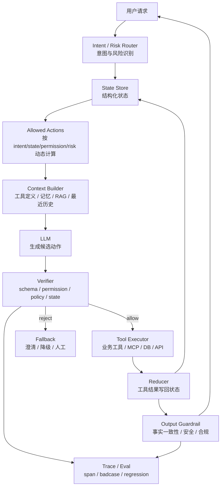

<section class="doc-hero">
  <p class="doc-hero__kicker">匿名真实面经</p>
  <h1>Agent Runtime 面试深挖：从业务 Agent 讲到平台引擎</h1>
  <p class="doc-hero__lead">面试官追问的不是“你接了几个工具”，而是“谁控制循环、谁校验动作、谁为结果负责”。</p>
  <div class="doc-hero__meta" aria-label="本文信息">
    <span>适合阶段：Agent 工程师 / 平台架构面</span>
    <span>核心能力：架构命名 · 机制边界 · 追问应对</span>
    <span>脱敏原则：只保留技术问题，不保留公司、项目、指标细节</span>
  </div>
</section>

> 业务 Agent 的第一层面试是“你做过什么”，Agent Runtime 的第二层面试是“这套系统凭什么可控”。

> **本文边界**：这篇是面试复盘型文章，不重复讲 Agent Runtime 的完整系统设计。完整模块拆解看 [从业务 Agent 到 Agent Runtime](./agent-runtime)，单任务运行环境看 [Agent Harness 设计](./harness)，外层长周期循环看 [Loop Engineering](./loop-engineering)，工具权限细节看 [工具沙箱与权限](../tools/sandbox)。

> **脱敏说明**：本文来自多场 Agent 工程岗位面试中反复出现的追问链抽象。文中不出现公司名、项目名、业务指标、内部系统名，也不复述任何私有业务流程；所有例子都改写成通用的“高风险业务 Agent”场景。

## 面试官想考什么

这些题通常不会按顺序出现。真实面试里，面试官会先让你讲一个项目，然后沿着你回答里最虚的一处往下追。

<div class="interview-grid">
  <div>
    <strong>你能不能先用一句话概括这个 Agent 的整体架构？</strong>
    <span>考你能不能先命名架构，而不是从意图识别、工具调用这些实现细节开始散讲。</span>
  </div>
  <div>
    <strong>你说这是受限 Agent，受限在哪里？模型到底有哪些自主权？</strong>
    <span>考你能否把局部自主和系统控制权分开。</span>
  </div>
  <div>
    <strong>工具执行由谁决定？loop 是模型主控，还是 orchestrator 主控？</strong>
    <span>考 Agent loop 的控制边界，尤其是候选动作和最终执行的区别。</span>
  </div>
  <div>
    <strong>Reflection 还是模型自己生成的，为什么这就叫 harness 控制？</strong>
    <span>考你是否知道反思只是候选状态更新，采纳必须由 schema、verifier、state machine 或人控。</span>
  </div>
  <div>
    <strong>如果现在重做，你会从业务 Agent 升级到什么形态？</strong>
    <span>考架构演进能力：tool registry、memory service、guardrail、eval/trace 是否能沉成平台能力。</span>
  </div>
  <div>
    <strong>高风险场景里，流式输出已经展示给用户后才发现违规怎么办？</strong>
    <span>考输出侧 guardrail，尤其是服务端 buffer、abort/retract、审计和降级策略。</span>
  </div>
  <div>
    <strong>长期记忆很多时怎么按需使用？什么时候允许写入？</strong>
    <span>考 memory governance，而不是只会说“存数据库”或“查向量库”。</span>
  </div>
  <div>
    <strong>你为什么选这个框架、RAG 方案或观测平台？有没有对比和退出条件？</strong>
    <span>考选型判断：阶段性选择、评估指标、替换条件，而不是“当时就用了”。</span>
  </div>
</div>

## 为什么这类面试会把人问崩

一个业务 Agent 项目介绍，常见开场是这样的：

```text
我们做了一个业务对话 Agent，主要分三层：
意图识别、工具调用、输出生成。
意图识别判断用户要做什么，工具调用查数据或写数据，最后模型生成回答。
```

这段不算错，但在平台岗或高级工程岗里会很危险。面试官听到的不是“架构清晰”，而是“这个候选人还在按流程节点讲实现，没有说控制权在哪里”。

接下来他通常会追：

```text
那工具到底是谁选的？
模型能不能连续调很多次？
它调错工具怎么办？
如果工具返回数据和模型想的不一致，谁说了算？
如果最终输出违规，前面已经流式展示了怎么办？
如果让你把这套能力给多个业务线复用，你会抽哪些模块？
```

候选人如果继续补细节，很容易越讲越碎。更稳的第一句话应该是：

```text
我会把它定义成“状态机约束下的 agentic workflow”。
外层 runtime 负责状态、权限、安全、终止条件和 fallback；
LLM 只在当前允许的工具集合里生成候选动作和解释文本。
```

这句话的价值不在术语，而在控制边界。它先回答了面试官最关心的问题：系统不是让模型自由跑，而是把模型放进一个确定性运行时。

## 一条能扛追问的回答骨架

遇到“介绍项目 / 重新设计 / 你怎么理解 Agent Runtime”这类题，可以按五步走：

| 步骤 | 你要说什么 | 面试官在听什么 |
|---|---|---|
| 命名 | 这是状态机约束下的 agentic workflow，或 constrained agent loop | 你是否有架构抽象能力 |
| 拆层 | 控制面、工具面、记忆面、安全面、观测评估面 | 你是否知道生产 Agent 的职责边界 |
| 划边界 | LLM 产出候选动作，runtime 决定是否执行 | 你是否能管理不确定性 |
| 给例子 | 当前意图只加载当前工具，写操作要 schema/权限/幂等校验 | 你是否真的做过工程落地 |
| 给演进 | 静态 prompt 升级为 tool/skill registry、memory service、guardrail、eval/trace | 你是否能从单项目上升到平台能力 |

背“控制面、工具面、记忆面”没有用。加分点在于你能把每一层和一个失败模式连起来：

- 没有控制面，Agent 会死循环、状态漂移、重复执行。
- 没有工具面，模型可能调错工具、越权写入、参数污染。
- 没有记忆治理，玩笑话和错误抽取会变成长期事实。
- 没有安全面，高风险输出会在生成后才被发现。
- 没有观测评估面，线上 badcase 只能靠猜。

## Runtime 在面试语境里到底做什么

面试里讲 Agent Runtime，不要从“它包含哪些模块”开始。先讲一轮请求里实际发生了什么。



这张图最关键的不是节点多，而是箭头方向：LLM 不直接连到工具执行，也不直接连到最终用户。它只能给出候选动作。候选动作要经过 verifier，工具结果要写回 state，最终输出还要过 guardrail。

如果面试官继续问“那模型到底有什么自由”，你可以这样答：

```text
模型有局部自由：理解用户意图、在允许工具里选择下一步、生成参数草案、解释工具结果。
模型没有系统控制权：不能绕过状态机，不能自己扩展工具集合，不能决定权限，不能跳过输出审查，也不能自己宣布高风险任务完成。
```

这个区分非常重要。它能把你从“会调模型 API 的应用开发”拉到“能设计 Agent 运行时的工程师”。

## 追问链一：整体架构怎么介绍

坏的回答往往是流程型：

```text
第一层是意图识别，第二层是工具调用，第三层是生成回答。
```

这听起来像把代码目录念了一遍。更稳的回答是架构型：

```text
这是一个高风险业务里的 constrained agent loop。
外层用确定性 runtime 管状态、权限、风险和 fallback；
模型只在当前场景的工具白名单内生成候选 tool call；
工具结果再进入结构化 state，最终输出过安全和事实一致性检查。
```

如果面试官问“为什么不用纯 workflow”，你不要急着说“Agent 更智能”。更好的答案是：

```text
纯 workflow 适合流程稳定的任务，但用户自然语言输入很长尾，固定分支会膨胀。
完全自由的 Agent 又不适合高风险业务，所以中间形态是受限 loop：
流程边界由代码控制，局部选择交给模型。
```

这就是面试里的“折中判断”。高级工程师不是永远选最先进的形态，而是能说明为什么在某个风险等级下选某种自主性。

## 追问链二：loop 谁主控

这题很容易踩坑。如果你说“模型主控”，面试官会担心失控；如果你说“代码主控”，他又会怀疑这是不是普通 workflow。

比较准确的说法是：

> Orchestrator 主控循环，LLM 主控候选动作。

可以直接画成下面这段伪代码：

```text
while not done:
  state = load_state(session_id)
  allowed_tools = policy.allowed_tools(state, user)
  context = build_context(state, allowed_tools, memory, rag)
  action = llm.propose(context)

  if verifier.allow(action, state, user):
      result = tool_executor.run(action)
      state = reducer.apply(state, result)
  else:
      state = reducer.reject(state, action)

  done = runtime.should_stop(state)
```

面试官如果追问“那 LLM 的推理有什么意义”，答案也很清楚：

```text
LLM 的价值在于处理非结构化输入、生成工具参数、在多个候选动作中做语义判断、把工具结果解释成人能理解的话。
但业务权限、状态推进、终止条件和高风险降级必须由 runtime 拥有。
```

这里不要用“模型负责智能，代码负责兜底”这种模糊话。要说清楚四个动作：propose、verify、execute、reduce。谁做哪个动作，边界就稳了。

## 追问链三：Reflection 为什么不是模型自嗨

面试官问“反思是谁做的”，其实不是反对 reflection。他是在问：如果反思还是模型写的，为什么这就叫工程控制？

稳的回答是：

```text
Reflection 不是安全边界，也不是最终事实。
它只是模型生成的候选状态更新。
是否采纳，要经过 schema、证据、冲突检测、policy 和必要的人审。
```

举一个匿名通用例子：

```json
{
  "candidate_memory": {
    "type": "user_preference",
    "key": "notification_channel",
    "value": "sms",
    "evidence_message_ids": ["m_102", "m_109"],
    "confidence": 0.76
  },
  "write_policy": {
    "allowed": true,
    "ttl_days": 90,
    "requires_user_confirm": false
  }
}
```

这个 JSON 的重点是：模型不能只说“我记住了用户喜欢短信”。它必须给出字段、证据、置信度和风险等级。Runtime 再决定能不能写入。高风险记忆，比如偏好、身份、健康、金融风险承受能力、权限相关信息，不能靠模型一句话直接落库。

如果被追到更深，可以补一句：

```text
我会把 reflection 分成 candidate generation 和 candidate adoption 两段。
前者可以由模型做，后者必须由确定性系统、独立 verifier 或 human gate 控制。
```

这句话能把“看过 Reflexion”升级成“知道怎么上线 reflection”。

## 追问链四：工具白名单为什么不是小事

很多候选人会说：“我们会在 prompt 里告诉模型只能调用这些工具。”这在面试里不够。

更工程化的说法是：

```text
工具白名单不是 prompt 文案，而是 policy engine 每一轮动态算出的 allowed actions。
它至少由 intent、state、user permission、risk level 四个因素共同决定。
```

| 维度 | 决定什么 | 例子 |
|---|---|---|
| intent | 当前任务属于哪类能力 | 查询类意图只加载读工具 |
| state | 当前流程走到哪一步 | 未确认前不能执行写操作 |
| permission | 用户是否有权限 | 普通用户不能调用管理后台工具 |
| risk level | 风险是否升高 | 高风险请求只允许安全话术或人工介入 |

面试官听这个点，是在判断你有没有权限模型意识。工具不是“给 Agent 的能力玩具”，工具是系统能力边界。工具集合越大，模型越容易误选；工具描述越长，context 越脏；工具权限越粗，越容易越权。

Anthropic 在工具设计文章里把 tools 说成确定性系统和非确定性 Agent 之间的契约，并强调工具选择、命名空间、返回上下文和 token 效率都要被评估。这个观点很适合用来支撑面试答案：工具设计不是 API 包装，而是 Agent 的交互协议。

## 追问链五：输出侧安全，尤其是流式输出

高风险业务里，输入侧识别不够。用户绕过了前置意图，或者模型在解释工具结果时说过头，最终输出一样可能越界。

更麻烦的是流式输出。很多系统是 token 一生成就推给前端，如果输出到一半才发现违规，用户可能已经看到了关键句。

面试里可以这样回答：

```text
我会把输出护栏放在服务端，而不是只靠前端回退。
低风险内容可以句子级 buffer，通过规则或轻量 classifier 后再 flush；
高风险内容先生成结构化草稿，过 policy 后再渲染自然语言；
一旦触发风险，服务端发 abort/retract 事件，落审计日志，并进入固定兜底或人工。
```

这比“我们有关键词过滤”强很多，因为它说出了三个关键机制：buffer、tripwire、audit。

OpenAI Agents SDK 的 guardrails 文档把输入、输出和工具 guardrails 分开处理，其中工具 guardrail 可以在工具执行前后拦截，输出 guardrail 面向最终输出。这种分层很适合面试表达：安全不是一个总开关，而是输入、工具、输出三条链路各自有拦截点。

## 怎么用：一个脱敏版 Runtime 面试骨架

下面这段代码不是业务系统，而是面试时可以讲清楚的最小 runtime。它演示四件事：动态工具白名单、候选动作校验、反思写入 gate、输出 buffer 审查。

```python
from dataclasses import dataclass, field
from typing import Any, Callable


@dataclass
class Tool:
    name: str
    permission: str
    risk: str
    required: set[str]
    handler: Callable[[dict[str, Any]], dict[str, Any]]


@dataclass
class State:
    intent: str
    stage: str
    risk_level: str
    user_permissions: set[str]
    facts: dict[str, Any] = field(default_factory=dict)
    trace: list[dict[str, Any]] = field(default_factory=list)
    steps: int = 0
    max_steps: int = 4


class Runtime:
    def __init__(self, tools: dict[str, Tool]) -> None:
        self.tools = tools

    def allowed_tools(self, state: State) -> set[str]:
        allowed = set()
        for name, tool in self.tools.items():
            if tool.permission not in state.user_permissions:
                continue
            if state.risk_level == "high" and tool.risk != "safe":
                continue
            if state.intent == "lookup" and name.startswith("read_"):
                allowed.add(name)
            if state.intent == "handoff" and name == "handoff_to_human":
                allowed.add(name)
        return allowed

    def verify_action(self, state: State, action: dict[str, Any]) -> Tool:
        name = action.get("tool")
        args = action.get("args", {})
        if name not in self.allowed_tools(state):
            raise PermissionError(f"tool_not_allowed:{name}")
        tool = self.tools[name]
        missing = tool.required - set(args)
        if missing:
            raise ValueError(f"missing_args:{sorted(missing)}")
        return tool

    def apply_reflection(self, state: State, reflection: dict[str, Any]) -> None:
        candidate = reflection.get("candidate_memory")
        if not candidate:
            return
        evidence = candidate.get("evidence_ids", [])
        confidence = candidate.get("confidence", 0)
        risk = candidate.get("risk", "medium")
        if confidence < 0.8 or not evidence:
            state.trace.append({"event": "memory_rejected", "reason": "weak_evidence"})
            return
        if risk == "high":
            state.trace.append({"event": "memory_pending_review", "candidate": candidate})
            return
        state.facts[candidate["key"]] = candidate["value"]
        state.trace.append({"event": "memory_written", "key": candidate["key"]})

    def safe_flush(self, chunks: list[str]) -> list[str]:
        flushed = []
        buffer = ""
        for chunk in chunks:
            buffer += chunk
            if buffer.endswith(("。", "！", "？", "\n")):
                if self.output_risky(buffer):
                    flushed.append("[已切换到安全兜底回复]")
                    return flushed
                flushed.append(buffer)
                buffer = ""
        if buffer and not self.output_risky(buffer):
            flushed.append(buffer)
        return flushed

    def output_risky(self, text: str) -> bool:
        banned = ["保证收益", "替你决定", "无需审批", "直接停用"]
        return any(word in text for word in banned)

    def run_once(self, state: State, action: dict[str, Any]) -> dict[str, Any]:
        if state.steps >= state.max_steps:
            return {"status": "fallback", "reason": "max_steps"}
        tool = self.verify_action(state, action)
        result = tool.handler(action["args"])
        state.steps += 1
        state.trace.append({"event": "tool_called", "tool": tool.name, "result": result})
        state.facts.update(result.get("facts", {}))
        return {"status": "ok", "facts": state.facts}
```

这段代码里，模型没有出现。面试时这正好能说明一件事：Agent Runtime 不是“换一个更强模型”，而是模型外面的控制骨架。真实系统会把 `action` 换成 LLM tool call，把 `output_risky` 换成规则 + classifier + LLM judge，把 `trace` 接到 Langfuse、OpenTelemetry 或自建日志平台。

## 常见踩坑

### 坑一：一上来讲实现细节，没有架构名

**现象**：你讲了意图识别、RAG、工具调用、Langfuse，但面试官打断：“能不能先概括一下架构？”

**根因**：你在按开发顺序讲系统，不是在按控制边界讲系统。

**修法**：先给架构名，再拆层。比如“这是状态机约束下的 agentic workflow，控制面确定，工具选择局部自主”。

### 坑二：把 prompt 当安全边界

**现象**：你说 system prompt 里写了不能输出某类内容，面试官继续问“如果它还是输出了呢？”

**根因**：prompt 是软约束，高风险场景需要独立 guardrail。

**修法**：输入意图拦截、工具执行前后校验、输出侧 buffer 审查、审计和人工兜底分开讲。

### 坑三：说“模型主控 loop”

**现象**：面试官开始追问死循环、越权、重复写入、工具失败。

**根因**：你没有区分候选动作和执行权。

**修法**：固定说法是“orchestrator 主控循环，LLM 生成候选动作，runtime 校验后才执行”。

### 坑四：工具白名单写死在 prompt

**现象**：工具越来越多，模型误选工具；面试官问“不同用户权限怎么处理”，回答变虚。

**根因**：工具权限没有被建模，只是被描述。

**修法**：把 allowed tools 说成 intent、state、permission、risk level 的动态计算结果。

### 坑五：Reflection 结果直接写 memory

**现象**：你说 Agent 会反思并更新长期记忆，面试官问“写错怎么办？”

**根因**：把候选记忆当成事实。

**修法**：候选写入必须带证据、置信度、版本、TTL、冲突检测；高风险写入需要确认。

### 坑六：选型只说“当时用了”

**现象**：被问为什么选某个 RAG、框架或观测平台，你只能说交付快、团队熟、方便。

**根因**：没有指标和退出条件。

**修法**：给出阶段性选择 + 对比维度 + 何时替换。比如 recall@k、faithfulness、延迟、成本、可运维性、合规审计。

## 与相邻概念的区别

| 概念 | 面试里该怎么定位 | 常见误区 |
|---|---|---|
| Business Agent | 面向具体业务任务的 Agent 应用 | 只讲业务流程，不讲运行时控制 |
| Agent Runtime | 支撑 Agent 安全运行的控制系统 | 以为 runtime 就是框架或 SDK |
| Agent Harness | 单个任务的执行环境，强调状态、工具、权限、验证、恢复 | 和 runtime 混用，忘了 runtime 更偏平台能力 |
| Workflow | 代码预定义路径，适合稳定流程 | 把所有 Agent 都贬成 workflow，忽略局部自主 |
| ReAct Loop | 模型在 thought/action/observation 中循环 | 以为有 ReAct 就能上线 |
| LangGraph / Agents SDK | 实现 runtime/harness 的框架选择 | 把框架能力当成业务安全边界 |

真实面试里，这张表可以压成一句话：

```text
业务 Agent 是具体应用，runtime 是支撑它安全运行的平台能力；workflow 偏预定义路径，Agent loop 偏动态选择；harness 管单次任务稳定执行，runtime 负责把状态、工具、记忆、安全和观测沉成可复用能力。
```

## 面试题深度解析

### Q1：你怎么一句话介绍一个生产级业务 Agent？

**30 秒版本**：  
我不会把它说成 Chatbot + tools，而会定义成状态机约束下的 agentic workflow。Runtime 控制状态、权限、工具白名单、终止条件和 fallback；LLM 只负责意图理解、候选 tool call、参数草案和解释文本。

**追问 1：为什么不直接说 workflow？**  
因为用户输入和工具选择有长尾，纯 workflow 分支会膨胀。但业务风险又不允许完全自由 Agent，所以用受限 loop：边界由代码控制，局部选择给模型。

**追问 2：怎么证明它不是靠 prompt 硬撑？**  
看四个东西：结构化 state 是否外置，tool call 是否经过 schema/权限校验，输出是否有独立 guardrail，线上是否有 trace/eval 回归。没有这些，就只是 prompt 包装。

### Q2：loop 到底是谁主控？

**30 秒版本**：  
Orchestrator 主控循环，LLM 只生成候选动作。每轮 runtime 计算 allowed tools，模型返回 tool call 草案，verifier 校验工具名、参数、权限、状态，合法才执行，结果再由 reducer 写回 state。

**追问 1：模型不能主控会不会不够智能？**  
不会。模型的智能用在语义判断和候选动作生成上；业务权限、终止条件、写操作和高风险降级由确定性系统控制。这不是削弱模型，而是把责任边界放对。

**追问 2：如果工具失败或模型反复选错怎么办？**  
Runtime 要记录失败原因，限制重试次数，把错误作为结构化 observation 写回上下文；连续失败进入澄清、降级或人工。不能让模型无限自我修复。

### Q3：Reflection / memory 写入怎么做才可控？

**30 秒版本**：  
Reflection 只能生成候选记忆或候选改进，不能直接修改长期状态。写入前要有 schema、证据、置信度、冲突检测、TTL 和风险分级，高风险记忆需要用户或人工确认。

**追问 1：为什么不能每轮都总结写入？**  
长期记忆一旦写错，后续每轮都会被污染。玩笑、临时偏好、模型误抽取、工具旧数据都可能变成错误事实，所以写入要比读取更严格。

**追问 2：记忆很多时怎么读？**  
结构化字段直接过滤，非结构化记忆走 query + vector retrieval + rerank；最后只把 top-k 高相关、高置信、权限允许的记忆放进上下文。不要全量注入。

### Q4：高风险场景里流式输出怎么做 guardrail？

**30 秒版本**：  
低风险内容可以流式，但服务端要按句子或小窗口 buffer，过规则或 classifier 后再 flush。高风险内容先生成结构化草稿，过安全和合规检查再渲染；触发风险时 abort/retract、审计、降级或转人工。

**追问 1：为什么不能前端发现后改写？**  
因为违规 token 可能已经展示给用户。高风险业务里，前端回退只能补体验，不能当合规边界。安全边界应该在服务端输出链路上。

**追问 2：会不会影响延迟？**  
会，所以按风险分层：低风险句子级 buffer，高风险非流式审查或模板化回复。安全、延迟、体验要按业务风险做取舍。

## 脱敏写面经时保留什么

这类真实面经可以公开，但要保留“问题结构”，不要保留“私有事实”。

| 可以写 | 不要写 |
|---|---|
| 面试官追问链：先问架构，再问 loop 控制，再问 guardrail | 公司名、团队名、面试日期、岗位细节组合 |
| 匿名业务类型：高风险业务 Agent、企业内部流程 Agent | 真实项目名、产品名、客户名、用户规模 |
| 通用技术机制：状态机、tool registry、memory governance、trace | 内部表结构、接口名、云资源、真实业务流程 |
| 错误答法与更稳答法 | “我当时怎么答错了”的个人复盘口吻 |
| 可复用代码骨架和伪数据 | 线上真实指标、成本、token 量、转化数据 |

这样写出来的文章既有真实面试味，又不会泄露个人或项目细节。

## 延伸阅读

- [Anthropic: Building effective agents](https://www.anthropic.com/engineering/building-effective-agents)  
  为什么读：这篇把 workflows 和 agents 的边界讲得很清楚，也强调先用简单可组合模式，不要一上来堆复杂框架。
- [Anthropic: Effective context engineering for AI agents](https://www.anthropic.com/engineering/effective-context-engineering-for-ai-agents)  
  为什么读：面试里被问 context engineering 时，不要只说“压缩历史”，要能讲上下文是有限资源，必须管理 system、tools、memory、message history。
- [Claude Cookbook: Context engineering: memory, compaction, and tool clearing](https://platform.claude.com/cookbook/tool-use-context-engineering-context-engineering-tools)  
  为什么读：它把 memory、compaction、tool-result clearing 的边界拆开，适合准备“除了摘要还有什么压缩方式”这类追问。
- [Anthropic: Writing effective tools for agents](https://www.anthropic.com/engineering/writing-tools-for-agents)  
  为什么读：工具不是普通 API 包装，而是确定性系统和非确定性 Agent 的契约。工具命名、返回上下文、评估都会影响 Agent 表现。
- [OpenAI Agents SDK: Agents guide](https://developers.openai.com/api/docs/guides/agents)  
  为什么读：官方文档把 running agents、handoffs、guardrails、state、tracing 串成一条工程路径，适合建立 runtime 分层感。
- [OpenAI Agents SDK: Tracing](https://github.com/openai/openai-agents-python/blob/main/docs/tracing.md)  
  为什么读：面试里说可观测性时，trace 不只是日志，而是 LLM generation、tool call、handoff、guardrail 等 span 的结构化记录。
- [OpenAI Agents SDK: Guardrails](https://openai.github.io/openai-agents-python/guardrails/)  
  为什么读：输入、工具、输出 guardrails 的边界很适合用来回答高风险业务安全问题。
- 配套阅读：[从业务 Agent 到 Agent Runtime](./agent-runtime)、[Agent Harness 设计](./harness)、[上下文工程](../context/)、[工具 Schema 设计](../tools/schema-design)、[Agent 整体安全](./security)。
