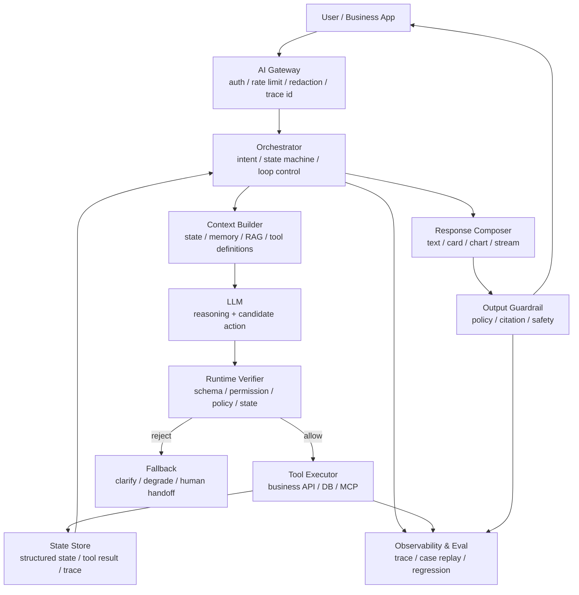
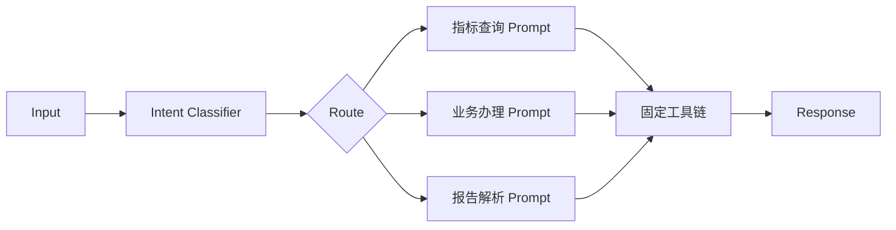
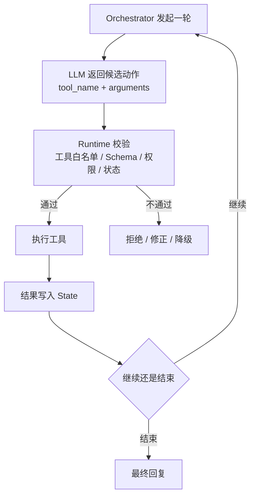
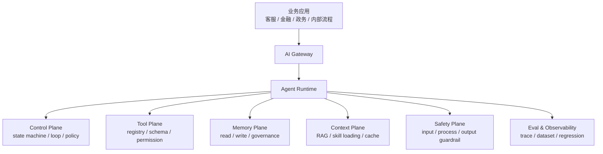
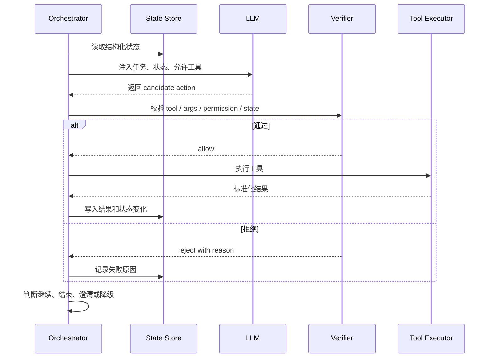
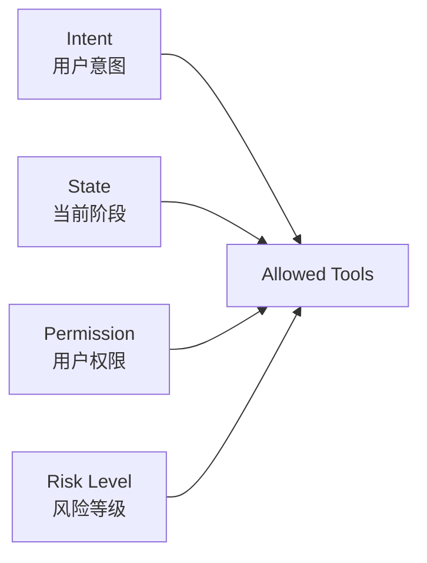
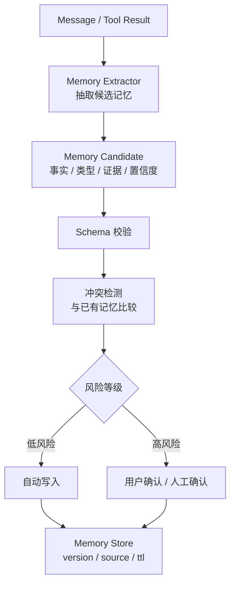
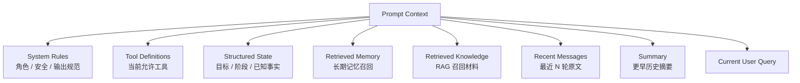
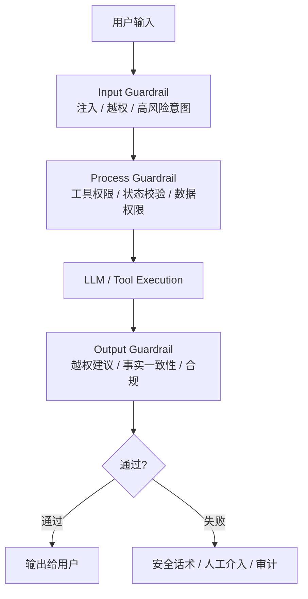

<section class="doc-hero">
  <p class="doc-hero__kicker">Agent 工程化</p>
  <h1>从业务 Agent 到 Agent Runtime</h1>
  <p class="doc-hero__lead">模型提出候选动作，runtime 决定能不能执行、怎么执行、何时中断、如何记录和评估。</p>
  <div class="doc-hero__meta" aria-label="本文信息">
    <span>适合阶段：系统设计 / 生产落地</span>
    <span>核心机制：Control + Tools + Memory + Context + Safety + Eval</span>
    <span>面试重点：业务 Agent 如何抽象成平台 Runtime</span>
  </div>
</section>

> Agent Runtime 的核心原则：LLM proposes, runtime disposes.

> **本文来源**：这篇文章基于一份面经复盘资料《从业务 Agent 到 Agent Runtime：生产级 Agent 系统的工程化拆解》重新组织，保留它的业务 Agent 视角，但改写成更适合站内学习和面试复盘的系统设计文章。单个任务的运行环境见 [Agent Harness 设计](./harness)，驱动 Agent 反复运行的外层系统见 [Loop Engineering](./loop-engineering)，工具权限细节见 [工具沙箱与权限](../tools/sandbox)，整体安全框架见 [Agent 整体安全](./security)。

## 面试官想考什么

读完这篇你要能正面回答下面这些题。每题后面括号里是面试官真正想看你答出什么。

<div class="interview-grid">
  <div>
    <strong>为什么生产级 Agent 不能只是 Chatbot + tools？Runtime 多出来的职责是什么？</strong>
    <span>考你是否能把模型能力和工程控制面分开。</span>
  </div>
  <div>
    <strong>Workflow、受限 Agent Loop、Agentic Runtime 三种形态怎么选？</strong>
    <span>考你能不能按业务风险和自主性做架构分层。</span>
  </div>
  <div>
    <strong>一个 Agent Runtime 至少要有哪些模块？哪些模块可以先不做？</strong>
    <span>考 MVP 到平台化的演进判断。</span>
  </div>
  <div>
    <strong>为什么要让 Orchestrator 主控循环，而不是让 LLM 自己决定一直跑？</strong>
    <span>考状态机、终止条件、权限校验和 fallback。</span>
  </div>
  <div>
    <strong>工具白名单为什么应该动态计算，而不是在 prompt 里写一串工具？</strong>
    <span>考 intent、state、permission、risk level 四个约束维度。</span>
  </div>
  <div>
    <strong>长期记忆为什么不能让模型自由写？Memory write path 应该怎么设计？</strong>
    <span>考候选记忆、证据、冲突检测、TTL 和人工确认。</span>
  </div>
  <div>
    <strong>强约束业务场景里，模型应该负责什么，确定性系统应该负责什么？</strong>
    <span>考金融、政务、企业服务里的责任边界。</span>
  </div>
  <div>
    <strong>怎么判断一个业务 Agent 已经具备平台化 Runtime 的雏形？</strong>
    <span>考抽象能力：能不能从单场景经验上升到通用运行时。</span>
  </div>
</div>

---

## 为什么需要 Agent Runtime

很多业务团队第一次做 Agent，会从一条简单链路开始：

```text
User Input -> Prompt -> LLM -> Text Output
```

接一个模型，写一段 system prompt，再加几个工具，demo 很快能跑。但一上线，问题会从“模型答得好不好”变成另一组更硬的工程问题：

- 用户有没有权限看这份数据？
- 当前任务处于哪个业务阶段？
- 这轮允许调用哪些工具？
- 工具参数是否合法，写操作能不能重复执行？
- 模型引用的数据是不是权威来源？
- 输出是否越过业务、权限或合规边界？
- 失败后如何重试、降级、审计、回放？
- 线上 badcase 怎么复盘，修复后怎么防回归？

裸 Chatbot 只能回答文本问题。业务 Agent 要进入真实流程，就必须被放进一个可控的运行时。这个运行时不负责“变聪明”，它负责把模型的聪明限制在业务允许的边界里。

一个生产级 Agent 的基本形态更接近下面这张图：



这张图里，LLM 只是一个候选动作生成器。真正让系统能上线的，是模型外面的 runtime：它决定模型能看到什么、能做什么、做错后怎么处理、谁来背业务责任。

---

## 三种形态：Workflow、受限 Agent Loop、Agentic Runtime

Agent 系统不是越自主越好。很多面试候选人一讲 Agent 就直接上 planner、memory、多 Agent，反而暴露了一个问题：没有根据业务风险选架构。

### 确定性 Workflow

流程提前写死，模型只在某些节点做分类、抽取或生成。



它适合金融、政务、企业核心流程里那些强约束场景：流程稳定、风险高、每一步都能被业务规则定义。代价是扩展新场景要改代码，复杂任务适应性差。

### 受限 Agent Loop

外层流程仍由代码控制，模型在当前场景、当前工具白名单和当前状态里选择下一步。



多数生产业务 Agent 都应该先做到这一层：模型有一定自主性，但每一步都被 runtime 验证。你能既保留自然语言交互的灵活性，又不把业务权限交给模型。

### Agentic Runtime

当一个团队不再只做单场景 Agent，而是要服务多个业务线，就会把状态机、工具注册、记忆治理、上下文构建、安全护栏、评估回归抽成平台能力。



Agentic Runtime 不是让模型自由跑，而是把一批业务 Agent 共同需要的运行能力沉下来。业务差异留在工具、流程、策略和数据层；共性能力由 runtime 承担。

---

## 六个核心平面

一个能支撑业务场景复用的 Agent Runtime，至少要有六个平面。

| 平面 | 解决的问题 | 典型机制 | 站内延伸 |
|---|---|---|---|
| 控制面 | Agent 怎么跑、何时停、怎么恢复 | 状态机、max steps、timeout、fallback | [Agent Loop](../agent/agent-loop) / [Harness](./harness) |
| 工具面 | Agent 能做哪些动作 | Tool registry、schema、权限、幂等、审计 | [Function Calling](../tools/function-calling) / [Schema 设计](../tools/schema-design) |
| 记忆面 | Agent 记住什么、如何写入 | working memory、semantic memory、候选写入、TTL | [记忆系统](../context/memory) |
| 上下文面 | 每轮模型看到什么 | dynamic tools、RAG、summary、prefix cache | [上下文工程](../context/) |
| 安全面 | Agent 不能越过什么边界 | input / process / output guardrail、HITL | [整体安全](./security) |
| 观测评估面 | 怎么知道错在哪里 | trace、span、eval dataset、case regression | [可观测性](./observability) / [评估体系](./evaluation) |

面试里不要把这六个平面背成清单。更好的讲法是：**每个平面都对应一个生产事故类型**。没有控制面，会死循环和状态漂移；没有工具面，会越权执行；没有记忆面，会记错用户；没有上下文面，会把噪音塞给模型；没有安全面，会把注入和越权放进流程；没有观测评估面，出事后连根因都找不到。

---

## 控制面：让 Orchestrator 主控循环

一个容易讲错的点是：到底是模型控制 Agent，还是代码控制 Agent？

生产系统里更稳的答案是：

> Orchestrator 控制循环，LLM 只产生候选动作。



结构化状态不是为了“架构好看”，而是为了让 runtime 能检查模型行为。

```json
{
  "session_id": "s_123",
  "user_id": "u_456",
  "intent": "metric_analysis",
  "stage": "tool_result_received",
  "risk_level": "normal",
  "facts": {
    "period": "last_7_days",
    "records_loaded": true,
    "has_abnormal_metric": true
  },
  "allowed_tools": ["get_metric_records", "render_metric_chart"],
  "completed_tools": ["get_metric_records"],
  "max_steps": 4,
  "current_step": 2
}
```

有了这个状态，runtime 才能判断当前是否允许写操作、是否已经拿到必要数据、是否超过最大步数、是否必须转人工。没有结构化状态，这些判断就只能交给模型“记得住、想得对、说得准”。这不是生产工程。

---

## 工具面：动态白名单比工具清单重要

Tool registry 不是一个函数列表。它是 Agent 的能力目录，每个工具都带着 schema、权限、风险等级、超时、幂等和 owner。

```json
{
  "name": "get_metric_records",
  "description": "查询用户指定时间范围内的业务指标记录",
  "input_schema": {
    "type": "object",
    "properties": {
      "user_id": { "type": "string" },
      "start_date": { "type": "string" },
      "end_date": { "type": "string" }
    },
    "required": ["user_id", "start_date", "end_date"]
  },
  "permission": "user.read.metric_records",
  "risk_level": "low",
  "idempotent": true,
  "timeout_ms": 3000
}
```

但 registry 只是原料。真正关键的是每一轮动态算出 `allowed_tools`。



例子很具体：

- 指标分析场景只允许读指标、画趋势图。
- 业务办理场景可以写工单，但必须带幂等键。
- 普通用户不能调用后台管理工具。
- 高风险请求不加载普通工具，只允许安全话术或人工介入。

这就是受限 Agent Loop 的核心：模型可以选工具，但候选工具集合必须由 runtime 计算。把 40 个工具全塞进 prompt，然后相信模型“不乱用”，这在强约束业务里等于裸奔。

---

## 记忆面：读取可以宽，写入必须严

记忆系统最危险的不是查不到，而是写错。用户一句玩笑、模型一次误抽取、工具返回的旧数据，都可能被写成长期事实，后续每一轮都被污染。

一个稳的记忆写入链路应该长这样：



候选记忆要带证据，而不是只有一句自然语言摘要。

```json
{
  "type": "user_profile",
  "field": "risk_preference",
  "value": "low_risk",
  "evidence": {
    "message_ids": ["m_102", "m_103"],
    "source": "user_statement"
  },
  "confidence": 0.82,
  "risk_level": "medium",
  "ttl": "180d"
}
```

读取路径也不能简单“全量塞上下文”。业务字段有限时，全量 profile 可以；通用 Agent 的长期记忆会不断增长，应该做结构化过滤 + 向量召回 + rerank。记忆治理要处理去重、冲突、过期、权限和来源，这些都不是 prompt 能兜住的事。

---

## 上下文面：让模型看见正确的东西

Context engineering 在 runtime 里不是“prompt 写长一点”，而是每一轮精确决定模型能看到什么。



真正的难点是预算分配：

- system prompt 太长，会挤占业务事实。
- 工具定义太多，会干扰选择。
- 历史会话太多，会增加成本和延迟。
- 摘要太激进，会丢关键约束。
- RAG 召回太多，会引入噪音。

一个很实用的布局原则：

```text
[稳定 System Prompt]
[稳定 Safety Policy]
[稳定 Tool Group Definitions]
[结构化 State]
[长期 Memory Top-K]
[RAG Top-K]
[历史 Summary 固定区域]
[最近 N 轮原文]
[当前用户问题]
```

稳定内容靠前，动态内容靠后。这样既能提高 prompt cache / prefix cache 命中率，也能降低上下文污染。业务上真正关键的事实，不要只放在历史摘要里，要抽成结构化 state 或 memory。

---

## 安全面：强约束业务里模型不能当裁判

金融、政务、企业内部流程、客服工单，这些场景都有共同点：模型可以解释，但不能绕过确定性系统做最终裁判。



模型不应该直接决定：

- 用户是否有权限访问某份数据。
- 某个业务事项是否自动通过。
- 收益率、费用、风险等级这类数值判断。
- 是否跳过审批或风控。

这些应该交给规则引擎、权限系统、业务工具或人工。模型更适合做自然语言理解、候选计划、工具结果解释和交互回复。安全不是在 system prompt 里写一句“不要违规”，而是输入、过程、输出三层都能拦。

流式输出还要额外小心：token 一旦推给前端，违规内容可能已经被用户看到。强约束场景里，服务端需要按句子或窗口 buffer，先审查再 flush；高风险回答可以不走自由生成，改走模板或人工。

---

## 怎么用：一个最小 Agent Runtime 骨架

下面这段代码不接真实 LLM，用 `mock_llm` 模拟模型返回候选动作。重点看 runtime 做了什么：动态工具白名单、schema 校验、权限校验、状态推进、trace 记录和终止条件。

```python
from dataclasses import dataclass, field, asdict
from typing import Any, Callable
import json
import time
import uuid


@dataclass
class ToolSpec:
    name: str
    permission: str
    risk_level: str
    idempotent: bool
    required: list[str]
    handler: Callable[[dict[str, Any]], dict[str, Any]]


@dataclass
class AgentState:
    user_id: str
    intent: str
    stage: str = "start"
    risk_level: str = "normal"
    current_step: int = 0
    max_steps: int = 4
    facts: dict[str, Any] = field(default_factory=dict)
    trace: list[dict[str, Any]] = field(default_factory=list)


class AgentRuntime:
    def __init__(self, tools: dict[str, ToolSpec], user_permissions: set[str]):
        self.tools = tools
        self.user_permissions = user_permissions

    def allowed_tools(self, state: AgentState) -> list[str]:
        allowed = []
        for name, spec in self.tools.items():
            if spec.permission not in self.user_permissions:
                continue
            if state.risk_level == "high" and spec.risk_level != "safe":
                continue
            if state.intent == "metric_analysis" and name.startswith("metric_"):
                allowed.append(name)
            if state.intent == "handoff" and name == "handoff_to_human":
                allowed.append(name)
        return allowed

    def verify(self, state: AgentState, action: dict[str, Any]) -> ToolSpec:
        name = action.get("tool_name")
        args = action.get("arguments", {})

        if name not in self.allowed_tools(state):
            raise PermissionError(f"tool_not_allowed: {name}")

        spec = self.tools[name]
        missing = [key for key in spec.required if key not in args]
        if missing:
            raise ValueError(f"missing_arguments: {missing}")

        if spec.permission not in self.user_permissions:
            raise PermissionError(f"permission_denied: {spec.permission}")

        return spec

    def run(self, state: AgentState, user_query: str) -> dict[str, Any]:
        trace_id = str(uuid.uuid4())

        while state.current_step < state.max_steps:
            context = {
                "query": user_query,
                "state": asdict(state),
                "allowed_tools": self.allowed_tools(state),
            }
            action = mock_llm(context)

            event = {
                "trace_id": trace_id,
                "step": state.current_step,
                "action": action,
                "ts": time.time(),
            }

            try:
                spec = self.verify(state, action)
                result = spec.handler(action["arguments"])
                event["result"] = result
                state.facts.update(result.get("facts", {}))
                state.stage = result.get("next_stage", state.stage)
            except Exception as exc:
                event["error"] = str(exc)
                state.stage = "fallback"
                state.trace.append(event)
                return {"status": "fallback", "reason": str(exc), "trace_id": trace_id}

            state.trace.append(event)
            state.current_step += 1

            if action.get("finish"):
                return {"status": "done", "facts": state.facts, "trace_id": trace_id}

        return {"status": "max_steps_exceeded", "facts": state.facts, "trace_id": trace_id}


def metric_records(args: dict[str, Any]) -> dict[str, Any]:
    return {
        "facts": {"records_loaded": True, "period": args["period"]},
        "next_stage": "tool_result_received",
    }


def mock_llm(context: dict[str, Any]) -> dict[str, Any]:
    if "metric_get_records" in context["allowed_tools"]:
        return {
            "tool_name": "metric_get_records",
            "arguments": {"user_id": context["state"]["user_id"], "period": "last_7_days"},
            "finish": True,
        }
    return {"tool_name": "handoff_to_human", "arguments": {"reason": "no_allowed_tool"}}


runtime = AgentRuntime(
    tools={
        "metric_get_records": ToolSpec(
            name="metric_get_records",
            permission="user.read.metric_records",
            risk_level="low",
            idempotent=True,
            required=["user_id", "period"],
            handler=metric_records,
        )
    },
    user_permissions={"user.read.metric_records"},
)

state = AgentState(user_id="u_123", intent="metric_analysis")
print(json.dumps(runtime.run(state, "帮我看一下最近 7 天指标有没有异常"), ensure_ascii=False, indent=2))
```

这段代码里最重要的不是 `mock_llm`，而是模型外面的部分：`allowed_tools()`、`verify()`、`max_steps`、`trace_id`、结构化 `state`。生产系统会把它们拆成服务或模块，但职责不会消失。

---

## 业务 Agent 到平台 Runtime 的升级路线

一个团队通常不是第一天就做平台。更现实的路线是从单场景业务 Agent 长出来。

| 阶段 | 典型形态 | 主要目标 | 最容易欠债的地方 |
|---|---|---|---|
| Demo | 单 prompt + 少量工具 | 验证模型能不能解决用户问题 | 无权限、无 trace、无 eval |
| 业务 Agent | workflow + 受限 tool loop | 接入真实业务系统 | 状态散落、工具硬编码、badcase 靠人工看 |
| 业务 Agent 集群 | 多场景、多工具、多策略 | 复用能力、统一治理 | 每个场景重复造上下文、安全和评估 |
| Agent Runtime | 平台化控制面和能力面 | 让不同业务共享运行时 | 抽象过度、平台比业务跑得慢 |

升级时不要一口气造“大而全平台”。可以按痛点拆：

- 工具多到 prompt 塞不下：先做 tool registry 和动态白名单。
- badcase 查不清：先补 trace 和 case 级回归。
- 长会话经常忘事：先把关键事实抽成 state / memory。
- 高风险场景上线受阻：先做 process guardrail 和人工确认。
- 多业务重复接工具：再抽 context service、memory service、guardrail service。

平台化的关键不是把所有东西都做成中台，而是把**重复且高风险的控制逻辑**从业务代码里拿出来。

---

## 容易踩的坑

### 坑 1：把 Runtime 当成更复杂的 Prompt

**现象**：system prompt 越写越长，里面塞满业务规则、工具限制、安全要求、输出格式，模型仍然偶发越界。

**根因**：prompt 只能影响模型倾向，不能提供确定性执行控制。权限、状态、幂等、审计这些必须由 runtime 执行。

**修法**：把规则分层：可解释性要求放 prompt，硬约束放 verifier / policy / tool executor。只要出错会造成业务损失，就不要只靠 prompt。

### 坑 2：工具白名单静态配置

**现象**：同一套工具在所有场景都可见，模型偶尔调到不该调的工具；工具越加越多，选择准确率下降。

**根因**：工具集合没有跟 intent、state、permission、risk level 绑定。模型在一堆不相关工具里做选择，本身就是噪音环境。

**修法**：把 `allowed_tools` 改成每轮动态计算。高风险状态只给安全工具，写入工具默认需要幂等和确认。

### 坑 3：长期记忆自由写入

**现象**：用户一次临时偏好被永久记住；模型误总结的事实影响后续回复；客服纠错后系统仍沿用旧记忆。

**根因**：memory write path 没有候选、证据、冲突检测、TTL 和确认机制。

**修法**：低风险偏好可以自动写，高风险事实必须带证据并可回滚；冲突记忆不要覆盖，要保留版本和来源。

### 坑 4：只看最终回复，不看中间链路

**现象**：用户说“回答错了”，团队只看到最终文本，不知道是意图识别、RAG、工具参数、安全拦截还是模型总结出了问题。

**根因**：没有 trace，把 Agent 当成单次 LLM call 记录。

**修法**：trace 至少记录 request、intent、context snapshot、LLM call、tool calls、guardrail、response、eval score。修 badcase 时按阶段归因。

### 坑 5：平台化过早

**现象**：业务场景还没跑通，就开始设计复杂 runtime、DSL、插件系统和管理后台。

**根因**：没有从真实业务痛点抽象，而是从框架想象出平台。

**修法**：先让 1-2 个业务 Agent 跑出稳定 badcase 闭环，再抽共性。平台的第一批抽象应该来自重复代码和重复事故，不是架构图。

---

## 与相似概念的区别

| 概念 | 关注层级 | 负责什么 | 不负责什么 |
|---|---|---|---|
| Agent Loop | 单个 Agent 的最小状态机 | Thought / Action / Observation / stop | 不管权限、记忆治理和平台复用 |
| Agent Harness | 单个任务的运行环境 | state、tools、checkpoint、verification | 不管多个业务场景的统一抽象 |
| Agent Runtime | 平台级运行时 | 控制面、工具面、记忆面、上下文面、安全面、观测面 | 不替代具体业务工具和策略 |
| Workflow | 确定性流程编排 | 固定步骤、固定分支、可解释流程 | 不擅长开放式动态任务 |
| MCP Server | 工具协议与连接层 | 标准化暴露 tools/resources/prompts | 不天然提供业务权限和状态机 |
| Loop Engineering | 外层自动调度系统 | cadence、并行、跨运行接力、maker/checker | 不替代 runtime 内部控制面 |

一句话区分：**harness 让一个 Agent 的一次任务跑稳，runtime 让一类业务 Agent 在同一套治理框架下复用，loop engineering 让这些运行可以被自动调度和反复驱动。**

---

## 面试题深度解析

### Q: 生产级 Agent 为什么不能只是 Chatbot + tools？

**30 秒版本**：Chatbot + tools 只解决“模型能不能调用外部能力”，没解决“谁允许它调用、调用前后怎么校验、状态怎么持久化、失败怎么恢复、怎么审计和评估”。生产 Agent 的核心不是工具数量，而是 runtime 控制模型行动的边界。

**追问 1：那是不是所有 Agent 都要完整 Runtime？**  
不需要。低风险内部助手可以从 workflow 或简单受限 loop 起步。只要涉及业务写操作、权限数据、合规输出、多轮长任务，就要逐步补控制面、工具面、安全面和观测面。

**追问 2：怎么判断已经从 demo 到生产？**  
看三件事：关键动作是否由确定性系统校验，所有中间步骤是否有 trace，badcase 是否能进回归集。缺任何一个，都还停在 demo 或灰度阶段。

### Q: Workflow、受限 Agent Loop、Agentic Runtime 怎么选？

**30 秒版本**：流程固定、风险高，用 workflow；任务需要模型在小范围里选工具，用受限 Agent Loop；多个业务场景重复出现状态、工具、记忆、安全和评估能力，再抽 Agentic Runtime。

**追问 1：金融/政务里能不能用 Agent？**  
能，但通常不是开放式自主 Agent。外层用 workflow 控流程和安全边界，内层在工具调用或材料解释阶段给模型有限自主性。模型负责理解和解释，权限、数值、审批和风控交给业务系统。

**追问 2：Runtime 平台化最大的风险是什么？**  
抽象过早。平台如果没有真实业务 badcase 喂养，很容易变成复杂但没人用的中台。好的 runtime 抽象应该来自重复事故：工具越权、记忆污染、上下文撑爆、trace 缺失、评估无法回归。

### Q: 为什么 Orchestrator 要主控循环？

**30 秒版本**：因为循环终止、权限校验、状态转移、fallback 都是工程责任，不应该交给概率模型自觉遵守。LLM 可以提议下一步，但 Orchestrator 必须决定是否执行。

**追问 1：模型返回了不合法 tool_call 怎么办？**  
不要直接报错崩掉。verifier 应该返回结构化拒绝原因：工具不允许、参数缺失、权限不足、状态不合法。低风险错误可以让模型修正一次，高风险错误直接 fallback 或人工。

**追问 2：max_steps 是不是拍脑袋？**  
不是。它和业务任务复杂度、工具延迟、成本预算、风险等级有关。指标查询可能 2-4 步，复杂研究任务可能 10+ 步。关键是超过上限要有可解释的失败状态，而不是静默截断。

### Q: 长期记忆为什么不能让模型自由写？

**30 秒版本**：长期记忆会跨会话影响未来决策，写错一次会污染很多轮。模型只能抽取候选记忆，runtime 要做 schema、证据、冲突、TTL、权限和确认。

**追问 1：哪些记忆可以自动写？**  
低风险、用户明确表达、可撤销的偏好可以自动写，比如“喜欢中文回答”。高风险事实、业务状态、权限、健康/金融偏好，应带证据并需要用户或人工确认。

**追问 2：记忆冲突怎么处理？**  
不要简单覆盖。保留版本、来源和时间；读取时按时效、可信来源和权限 rerank。必要时向用户澄清：“你之前说偏好低风险，现在又提到高收益产品，以哪次为准？”

---

## 延伸阅读

- 本站面经复盘资料：《从业务 Agent 到 Agent Runtime：生产级 Agent 系统的工程化拆解》  
  读它是为了看业务 Agent 项目如何从具体系统经验抽象出六个 runtime 平面。本文就是基于这份资料重写成站内文章。

- Anthropic Engineering：[Building effective agents](https://www.anthropic.com/engineering/building-effective-agents)  
  读它是为了理解“先用 workflow，必要时再升级 Agent”的工程立场。Agent Runtime 不是一上来就自由规划，而是自主性和控制性的平衡。

- Anthropic Engineering：[Harness design for long-running application development](https://www.anthropic.com/engineering/harness-design-long-running-apps)  
  读它是为了区分 harness 和 runtime：harness 让单个任务可恢复，runtime 把这套能力平台化复用。

- OpenAI Engineering：[Harness engineering](../industry/openai/harness-engineering)  
  读它是为了看 Codex 类产品如何把工具、状态、执行环境和 UI 事件组织成完整 harness，而不是一次性 API 调用。

- OWASP：[Top 10 for Large Language Model Applications](https://owasp.org/www-project-top-10-for-large-language-model-applications/)  
  读它是为了建立 Agent Runtime 的安全威胁模型，尤其是 Excessive Agency、Sensitive Information Disclosure、Unbounded Consumption。

- 本站：[Agent Harness 设计](./harness)、[Loop Engineering](./loop-engineering)、[可观测性](./observability)、[Agent 整体安全](./security)  
  这几篇和本文组成一条工程化主线：单次任务怎么跑稳、外层循环怎么驱动、线上怎么观测、安全边界怎么守住。
