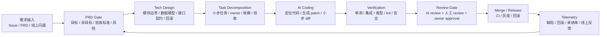

<section class="doc-hero">
  <p class="doc-hero__kicker">匿名真实面经</p>
  <h1>AI Coding SDLC 面试深挖：别只说“代码大多让 AI 写”</h1>
  <p class="doc-hero__lead">面试官真正想听的是：你怎么让 AI 生成的代码可理解、可验证、可评审、可回滚。</p>
  <div class="doc-hero__meta" aria-label="本文信息">
    <span>适合阶段：Agent 工程师 / 技术负责人面</span>
    <span>核心能力：PRD · Tech Design · Task · TDD · Review Gate</span>
    <span>脱敏原则：只保留方法论，不保留真实项目细节</span>
  </div>
</section>

> AI Coding 的分水岭不是“谁写代码”，而是“谁定义需求、谁控制边界、谁验证结果”。模型可以大量生成实现，人必须拥有验收标准和风险判断。

> **本文边界**：编程 Agent 的产品架构看 [编程 Agent](../vertical/coding-agent)，单个 Agent 的运行环境看 [Agent Harness 设计](./harness)，长周期自动化看 [Loop Engineering](./loop-engineering)，工具权限与沙箱看 [工具沙箱与权限](../tools/sandbox)。本文专注真实面试里的 **AI Coding 如何接入软件研发流程**。

> **脱敏说明**：本文来自多场 Agent / AI Coding 岗位面试中反复出现的流程追问。所有例子都改成通用业务系统，不保留任何可识别的真实细节。

## 面试官想考什么

这些问题听起来在问“你会不会用 AI 写代码”，实际是在问你有没有软件工程控制力。

<div class="interview-grid">
  <div>
    <strong>你说 AI 写了大量代码，那你负责什么？</strong>
    <span>考责任边界：需求理解、架构设计、风险判断、review 和验收不能外包给模型。</span>
  </div>
  <div>
    <strong>AI Coding 怎么嵌入 PRD、技术方案、任务拆解和开发流程？</strong>
    <span>考 SDLC 视角，不接受“我打开工具让它写”。</span>
  </div>
  <div>
    <strong>PRD 很模糊时，AI 应该直接开写还是先澄清？</strong>
    <span>考需求 gate：可验收、可拆分、无无关愿望项。</span>
  </div>
  <div>
    <strong>为什么 TDD 在 AI Coding 里反而更重要？</strong>
    <span>考你是否理解代码有天然 verifier，测试是 reward 也是安全带。</span>
  </div>
  <div>
    <strong>怎么防止 Agent 乱改无关代码、越权改核心模块？</strong>
    <span>考权限、diff 粒度、高风险文件保护和 owner approval。</span>
  </div>
  <div>
    <strong>AI 生成代码怎么做 review？人审和 AI review 怎么分工？</strong>
    <span>考 maker/checker 分离、审查清单和责任归属。</span>
  </div>
  <div>
    <strong>怎么评估 AI Coding 是否真的提高研发效率，而不是制造维护债？</strong>
    <span>考效率、质量、采纳率三类指标。</span>
  </div>
  <div>
    <strong>线上问题排查能不能也交给 AI？边界在哪里？</strong>
    <span>考日志权限、复现脚本、只读数据、生产库边界和审计。</span>
  </div>
</div>

## 为什么“AI 写了 90% 代码”不是好答案

面试里最容易踩的坑，是把 AI Coding 讲成比例：

```text
我现在大部分代码都用 AI 写，效率很高。
```

这个回答会立刻引出三类担心：

- **你是不是只是在接受模型输出？** 如果需求、架构、边界、验证都没说清，面试官会默认你把责任交给了工具。
- **代码质量怎么兜住？** AI 写得越多，越要解释测试、review、diff 控制和回归验证。
- **团队怎么复制？** 个人重度使用不等于团队流程。技术负责人岗位更关心规范、门禁和指标。

更稳的表达是：

```text
我会把 AI Coding 看成一套研发流程改造。
前面由人主控需求澄清和技术设计，中间让 AI 高吞吐生成 patch，后面用测试、review、CI、灰度和线上 trace 兜住质量。
AI 提升的是实现速度，真正决定质量的是输入约束和验证闭环。
```

这段话把“我很会用工具”升级成“我能设计 AI 时代的软件工程流程”。面试官要的是后者。

## AI Coding SDLC 是怎么工作的



这条链路的面试重点不是“AI 在 E 阶段写代码”，而是 **每个阶段都有产物和门禁**：

| 阶段 | 产物 | Gate |
|---|---|---|
| PRD | 目标、非目标、用户路径、验收标准 | 模糊项必须澄清，愿望项不能进开发范围 |
| Tech Design | 数据模型、接口、状态流、风险、回滚 | 高风险设计先 review，不让 Agent 自己拍板 |
| Task | 小任务、依赖、文件范围、测试要求 | 每个 task 都能独立验证 |
| Coding | patch / diff | 小步提交，不直接改主干 |
| Verification | 测试报告、lint、类型检查、安全扫描 | 失败不能 merge，原因进入 trace |
| Review | 人审意见、AI review、owner 结论 | maker 和 checker 分离 |
| Release | 灰度、监控、回滚预案 | 线上指标异常能撤回 |

OpenAI 在 Codex harness 文章里讲到的关键转变，是工程师从“手写代码的人”变成“设计 harness、架构和验证环境的人”。Anthropic 的 Claude Code best practices 也强调先探索代码库、制定计划、再编码和提交；Claude Code 文档把 common workflows 拆成探索、修 bug、重构、测试、PR、worktree 并行等具体配方。它们背后的共识是同一个：**代码生成本身只是中间环节，工程流程才是产出质量的外壳**。

## 追问链一：PRD 不清楚时，AI 应该做什么

坏流程通常长这样：

```text
需求：做一个“更智能”的导出功能，后面可能要支持多种格式。
Agent：开始改导出模块，顺便加了 xlsx、pdf、邮件发送、权限提示。
结果：代码很多，但没人知道本期到底要验收什么。
```

AI Coding 里，PRD gate 要先挡住这类输入。一个可执行 PRD 至少要有：

| 字段 | 作用 |
|---|---|
| `goal` | 本次到底解决哪个问题 |
| `non_goals` | 明确本次不做什么，防止 Agent 加戏 |
| `acceptance_criteria` | 能跑出 pass/fail 的验收条件 |
| `user_flow` | 用户从哪里触发、看到什么结果 |
| `risk` | 权限、数据、兼容性、性能风险 |
| `rollback` | 出问题怎么撤 |

面试答法：

```text
我不会让 Agent 直接吃一个模糊 PRD 开写。
第一步是让 AI 帮我把需求转成结构化 PRD：目标、非目标、验收标准、风险和开放问题。
开放问题由人确认；确认前只允许出方案，不允许改代码。
```

这句话有一个重要信号：**AI 可以帮忙澄清需求，但不能替人决定需求边界**。

## 追问链二：技术方案为什么不能省

AI 写代码越快，越容易绕过技术方案。这个诱惑很大：反正模型能直接改文件，何必写设计？

问题是，模型擅长局部补丁，不擅长长期架构一致性。没有技术方案，它可能在三个地方各加一套判断，把状态写在不该写的层，或者为了通过测试引入隐藏耦合。

技术方案至少要回答六件事：

| 维度 | 面试说法 |
|---|---|
| 模块边界 | 改哪些模块，不改哪些模块 |
| 数据模型 | 新增字段、状态枚举、迁移和兼容 |
| 接口契约 | 输入输出 schema、错误码、幂等 |
| 权限与安全 | 谁能调用、哪些路径需要审批 |
| 验证策略 | 单测、集成、回归、手工验收 |
| 灰度与回滚 | feature flag、兼容旧数据、撤回路径 |

面试时可以这样压缩：

```text
AI Coding 不是不要设计，而是更需要设计。
因为模型的实现吞吐很高，如果设计边界没锁住，它会更快地产生更多不可控代码。
我会让 AI 先出方案草稿，但方案必须由人 review 后才能进入编码。
```

这比“我让 AI 先写个方案”更稳，因为你明确了方案的所有权。

## 追问链三：TDD 为什么在 AI Coding 里更关键

普通文本生成很难自动判定好坏，代码不同。代码可以编译、测试、lint、跑 CI。SWE-agent 论文强调，为软件工程 Agent 设计好的 agent-computer interface，会显著影响它导航代码库、编辑文件、运行测试的能力；SWE-bench 的流行，也正是因为它把“修复真实 GitHub issue”变成可以自动跑测试的评估任务。

AI Coding 最应该利用这个特点：

```text
需求 -> 先写/补测试 -> 看测试失败 -> 让 Agent 实现 -> 跑测试 -> 修复 -> 通过 -> review diff
```

注意这里的顺序：测试不只是最后检查，而是给 Agent 一个明确的 reward。

| 做法 | 风险 |
|---|---|
| 先让 AI 写实现，最后人工点点看 | 很容易只验证 happy path |
| 先让 AI 写测试，再写实现 | 测试可能配合实现造假，需要人审测试 |
| 人定义验收测试，AI 写实现 | 最稳，但人力更重 |
| 真实 bug 先复现，再修复 | 最适合线上问题和回归 case |

面试答法：

```text
代码任务的优势是天然有 verifier。
我会尽量把需求转成测试、lint、类型检查、快照或回归脚本，让 AI 在这个闭环里迭代。
AI 可以写测试初稿，但关键验收测试要人审，否则会出现“测试和实现一起自洽，但需求没满足”。
```

## 追问链四：AI review 和人工 review 怎么分工

不要把 AI review 当成替代人审。它更适合做机械检查和第二视角：

| Review 类型 | 适合交给 AI | 必须人负责 |
|---|---|---|
| 需求一致性 | 对照 PRD 检查是否漏项 | 判断需求是否真的合理 |
| 代码风格 | 命名、重复、简单坏味道 | 架构取舍和业务语义 |
| 测试覆盖 | 提醒未覆盖分支 | 判断测试是否代表真实验收 |
| 安全风险 | 扫常见越权、注入、敏感日志 | 高风险权限和数据边界 |
| diff 摘要 | 生成变更说明 | 决定是否 merge |

面试里可以用 maker/checker 语言：

```text
生成 patch 的 Agent 是 maker，review Agent 是 checker。
checker 用干净上下文重新读 PRD、技术方案和 diff，输出阻塞问题。
但 merge 权限仍在人和 owner 手里，AI review 是输入，不是批准。
```

这和 [Loop Engineering](./loop-engineering) 里的 maker/checker 拆分是一致的：写代码和验收代码不能由同一个上下文闭环自嗨。

## 追问链五：怎么避免乱改代码

AI Coding 平台必须把“能改哪里、怎么改、改完谁验”写成硬规则。

| 风险 | 防线 |
|---|---|
| 一次 diff 太大 | 限制 task 粒度，超过阈值必须重新拆分 |
| 改到高风险文件 | CODEOWNERS / protected paths / owner approval |
| Agent 直接提交主干 | 只允许工作分支、patch、PR，不允许直推 |
| 生产配置误改 | 敏感目录只读，或需要显式审批 |
| 测试失败仍继续包装 | CI gate 一票否决 |
| 模型凭空改架构 | 技术方案先审，must_not 写入 task contract |

GitHub Copilot cloud agent 的产品形态也是类似路线：Agent 在后台处理任务、产出分支和 PR，开发者 review diff 后再决定合并。Anthropic Claude Code 的 hooks 文档则把 deterministic control 放进生命周期钩子，例如提交前强制跑格式化、测试或策略检查。共同点很清楚：**把风险边界放在工具和流程里，不放在“模型会自觉”里**。

## 可运行代码：一个 AI Coding Gate Board

下面代码模拟一个最小 SDLC gate。它不接真实 LLM，而是演示流程资产怎么被机器检查：PRD 没验收标准不能进入设计；设计没风险和回滚不能拆 task；patch 没测试不能 review；高风险文件需要 owner。

```python
from __future__ import annotations

from dataclasses import dataclass, field
from enum import Enum
from typing import Iterable


class Stage(str, Enum):
    PRD = "prd"
    DESIGN = "design"
    TASK = "task"
    PATCH = "patch"
    REVIEW = "review"
    READY = "ready"
    BLOCKED = "blocked"


@dataclass
class PRD:
    goal: str
    non_goals: list[str]
    acceptance_criteria: list[str]
    open_questions: list[str] = field(default_factory=list)


@dataclass
class TechDesign:
    modules: list[str]
    data_changes: list[str]
    risks: list[str]
    rollback: str
    tests_required: list[str]


@dataclass
class CodingTask:
    id: str
    scope_files: list[str]
    protected_files: list[str]
    required_tests: list[str]
    owner: str | None = None


@dataclass
class Patch:
    changed_files: list[str]
    tests_passed: list[str]
    ai_review_blockers: list[str]
    human_approved: bool = False
    owner_approved: bool = False


@dataclass
class GateResult:
    stage: Stage
    ok: bool
    reasons: list[str]


class AICodingGateBoard:
    def check_prd(self, prd: PRD) -> GateResult:
        reasons = []
        if not prd.goal.strip():
            reasons.append("missing goal")
        if not prd.acceptance_criteria:
            reasons.append("missing acceptance criteria")
        if prd.open_questions:
            reasons.append("open questions must be resolved before coding")
        return GateResult(Stage.PRD, not reasons, reasons)

    def check_design(self, design: TechDesign) -> GateResult:
        reasons = []
        if not design.modules:
            reasons.append("modules boundary is empty")
        if not design.risks:
            reasons.append("risk section is empty")
        if not design.rollback.strip():
            reasons.append("rollback plan is missing")
        if not design.tests_required:
            reasons.append("tests are not specified")
        return GateResult(Stage.DESIGN, not reasons, reasons)

    def check_task(self, task: CodingTask, allowed_files: Iterable[str]) -> GateResult:
        allowed = set(allowed_files)
        reasons = []
        out_of_scope = [path for path in task.scope_files if path not in allowed]
        if out_of_scope:
            reasons.append(f"task touches out-of-scope files: {out_of_scope}")
        if task.protected_files and not task.owner:
            reasons.append("protected files require an owner")
        if not task.required_tests:
            reasons.append("task has no required tests")
        return GateResult(Stage.TASK, not reasons, reasons)

    def check_patch(self, task: CodingTask, patch: Patch) -> GateResult:
        reasons = []
        unexpected = [path for path in patch.changed_files if path not in task.scope_files]
        missing_tests = [name for name in task.required_tests if name not in patch.tests_passed]
        protected_changed = [path for path in patch.changed_files if path in task.protected_files]

        if unexpected:
            reasons.append(f"patch changed files outside task scope: {unexpected}")
        if missing_tests:
            reasons.append(f"required tests not passed: {missing_tests}")
        if patch.ai_review_blockers:
            reasons.append(f"AI review blockers remain: {patch.ai_review_blockers}")
        if protected_changed and not patch.owner_approved:
            reasons.append("protected files changed without owner approval")
        if not patch.human_approved:
            reasons.append("human review approval is missing")

        return GateResult(Stage.READY, not reasons, reasons)


if __name__ == "__main__":
    board = AICodingGateBoard()

    prd = PRD(
        goal="Add export job retry status to the admin page",
        non_goals=["Do not redesign the export workflow"],
        acceptance_criteria=[
            "failed jobs show retryable/non-retryable status",
            "existing export jobs keep backward compatibility",
        ],
    )
    design = TechDesign(
        modules=["admin/export_status", "services/export_jobs"],
        data_changes=["add nullable retry_reason column"],
        risks=["old jobs may not have retry metadata"],
        rollback="hide the new column behind a feature flag",
        tests_required=["unit:export_status", "integration:export_jobs"],
    )
    task = CodingTask(
        id="T-42",
        scope_files=["admin/export_status.py", "services/export_jobs.py"],
        protected_files=["services/export_jobs.py"],
        required_tests=["unit:export_status", "integration:export_jobs"],
        owner="export-platform-owner",
    )
    patch = Patch(
        changed_files=["admin/export_status.py", "services/export_jobs.py"],
        tests_passed=["unit:export_status", "integration:export_jobs"],
        ai_review_blockers=[],
        human_approved=True,
        owner_approved=True,
    )

    for result in [
        board.check_prd(prd),
        board.check_design(design),
        board.check_task(task, allowed_files=task.scope_files),
        board.check_patch(task, patch),
    ]:
        print(result.stage.value, "PASS" if result.ok else "BLOCKED", result.reasons)
```

这段代码表达的是流程原则：AI Coding 平台的核心不是“让模型更努力”，而是让每个阶段都有可检查的输入和输出。真实系统里，`check_patch` 会接 Git diff、CI status、CODEOWNERS、静态扫描、review comments 和发布系统。

## 怎么评估 AI Coding 是否真的有效

不要只看“AI 生成代码行数”。代码行数甚至可能是负指标：写得越多，维护负担越大。

更靠谱的指标分三组：

| 指标组 | 看什么 | 例子 |
|---|---|---|
| 效率 | 周期是否缩短 | 需求 lead time、编码耗时、review 等待时间、线上问题定位时间 |
| 质量 | 缺陷是否变少 | 编译通过率、测试通过率、线上缺陷率、回滚率、重复返工率 |
| 采纳率 | 团队是否真的用 | AI patch 保留率、PR 采纳率、开发者活跃度、场景覆盖率 |

面试答法：

```text
我不会用“生成了多少行代码”做核心指标。
我会看交付周期、测试通过率、PR 采纳率、人工修改比例、线上缺陷率和回滚率。
如果 AI 让编码更快但 review 时间翻倍、缺陷率上升，那不是提效，是把成本转移到了后面。
```

SWE-bench 适合评估“真实 issue 能不能修”；SWE-agent、AutoCodeRover 这类论文适合学习 agent-computer interface、结构化代码搜索和测试反馈；企业内部还要补自己的 repo case，因为公共 benchmark 无法覆盖内部架构规范、业务约束和发布流程。

## 线上问题排查：AI 能帮忙，但权限要硬

AI 很适合做故障排查里的机械环节：

- 读错误栈，定位可能的调用链。
- 生成最小复现脚本。
- 对比最近变更和报错时间线。
- 分析日志模式。
- 提出假设和验证步骤。

但生产环境边界必须清楚：

| 能开放 | 要谨慎 | 默认不开放 |
|---|---|---|
| 脱敏日志、trace、错误栈、只读指标 | 受控查询、采样数据、临时凭证 | 生产写权限、全量敏感数据、直接数据库修改 |

面试答法：

```text
我会让 AI 帮忙读 trace、错误栈和脱敏日志，生成复现脚本或排查假设。
但生产库、敏感数据和写操作不能直接开放给 Agent。
如果必须查线上数据，也要走受控只读工具、最小权限、审计和脱敏。
```

这句话很重要。AI Coding 讲得越激进，越要把权限边界讲硬。否则面试官会担心你把生产系统交给模型裸奔。

## 常见陷阱

### 1. 把 AI Coding 讲成“我个人效率很高”

**现象**：回答停留在“我平时用某工具写代码很快”。

**根因**：个人工具经验没有上升到团队流程、规范、指标和质量门禁。

**修法**：讲 PRD、设计、task、TDD、review、CI、灰度和线上反馈。用流程证明你能复制给团队。

### 2. 需求没澄清就让 Agent 开写

**现象**：代码很多，验收时发现方向错了。

**根因**：模型把模糊需求里的愿望项都实现了，或者漏掉了真正的验收标准。

**修法**：先做 PRD gate。开放问题没有关闭前，只能产出问题清单和技术方案，不进入编码。

### 3. AI 写测试，AI 写实现，没人审测试

**现象**：测试全绿，但用户场景仍然失败。

**根因**：测试和实现一起自洽，验收标准没有外部约束。

**修法**：关键验收测试由人定义或审查；AI 可以补边界 case，但不能单独拥有测试标准。

### 4. Review 只看最终 diff，不看上下文

**现象**：代码局部看没问题，但违反原始需求、技术方案或模块边界。

**根因**：review 丢了 PRD 和设计上下文，只按普通代码审查。

**修法**：review Agent 和人审都要拿到 PRD、design、task contract、diff、测试结果。审查“是否该这么改”，不是只审“代码能不能跑”。

### 5. 没有指标，AI Coding 变成 demo

**现象**：团队都说用了 AI，但不知道效率和质量有没有提高。

**根因**：没有度量采纳率、质量、交付周期和缺陷。

**修法**：建立最小 dashboard：AI patch 保留率、PR 采纳率、测试通过率、review 耗时、线上缺陷率、回滚率。

### 6. 权限边界太软

**现象**：Agent 能读太多数据、跑太多命令，或者在高风险目录随意改。

**根因**：把“用户会看着”当成安全策略。

**修法**：权限分级、protected paths、owner approval、sandbox、只读日志工具、真实 UI 审批。安全边界必须在模型外。

## 与相邻概念的区别

| 概念 | 重点 | 面试边界 |
|---|---|---|
| 编程 Agent | 能在代码库里定位、修改、测试 | 产品/技术架构，见 [编程 Agent](../vertical/coding-agent) |
| Agent Harness | 单个任务怎么稳定运行 | 状态、工具、权限、恢复，见 [Harness](./harness) |
| Loop Engineering | 多次运行、并行和无人值守 | 调度、worktree、maker/checker，见 [Loop Engineering](./loop-engineering) |
| AI Coding SDLC | 如何接入研发流程 | 本文重点：PRD、设计、task、TDD、review、指标 |
| Agent Skills | 把团队流程沉淀成可加载能力 | 适合承载 PRD 模板、review checklist、模块规范 |

## 面试题深度解析

### Q1：你说 AI 写了大量代码，那你负责什么？

**30 秒版本**：AI 负责高吞吐实现，我负责需求澄清、架构边界、风险判断、review 和验收。代码可以由 AI 生成，但责任不能由 AI 承担。

**追问 1：如果 AI 写得比人快很多，人还需要懂代码吗？**  
更需要。人要判断设计是否合理、diff 是否越界、测试是否真的覆盖需求。AI 提高了实现吞吐，也放大了错误传播速度。

**追问 2：怎么避免被认为只是“AI 搬运工”？**  
不要讲“我让它写”。讲你如何定义 PRD、技术方案、验收测试、review gate 和回滚策略。工程判断才是你的价值。

### Q2：AI Coding 怎么接入团队研发流程？

**30 秒版本**：用 PRD -> tech design -> task -> patch -> verification -> review -> release 的链路接入。AI 可以参与每一环，但每一环都有结构化产物和 gate。

**追问 1：团队怎么复用你的经验？**  
把流程沉淀成模板、rules、skills、checklist、CI gate 和示例仓库，而不是靠口口相传。Skill 负责“怎么做”，CI 和 review 负责“是否过”。

**追问 2：是不是所有需求都适合 AI Coding？**  
不是。低风险、验收明确、上下文充分的任务最适合；架构方向不确定、业务规则模糊、高风险数据变更的任务要先做人审设计。

### Q3：怎么评估 AI 生成代码质量？

**30 秒版本**：看效率、质量、采纳率三组指标。效率看 lead time，质量看测试通过、缺陷和回滚，采纳率看 AI patch 保留和 PR 接受。

**追问 1：SWE-bench 分数能代表团队效果吗？**  
只能代表一部分。SWE-bench 测真实 issue 修复能力，但团队内部还要测自己的 repo、架构规范、业务约束、CI 和 review 流程。

**追问 2：AI 生成代码很多但 review 时间变长，算提效吗？**  
不算。那只是把编码成本转移给 reviewer。好的 AI Coding 应该同时降低实现时间和 review 返工，而不是制造更大的审查负担。

### Q4：怎么防止 AI 乱改代码？

**30 秒版本**：用 task scope、protected paths、owner approval、小步 diff、CI gate 和人工 review。Agent 默认只产出 patch / PR，不直接合并主干。

**追问 1：prompt 里写“不要乱改”够吗？**  
不够。必须把边界放到工具和流程里，比如只允许编辑 task scope 内文件，高风险目录需要 owner approval，CI 失败不能 merge。

**追问 2：如果 Agent 为了过测试改了测试怎么办？**  
测试文件也要分权限。关键验收测试只读或需要人审，Agent 可以新增辅助测试，但不能随意弱化现有测试。

### Q5：线上问题排查能交给 AI 吗？

**30 秒版本**：可以交给 AI 做日志阅读、错误栈分析、复现脚本和假设生成，但不能给它生产写权限和敏感数据全量访问。

**追问 1：怎么让 AI 查日志又不泄露隐私？**  
通过受控只读工具暴露脱敏日志，按 trace id 或时间窗口查询，工具层做 masking 和审计。不要把数据库账号直接交给 Agent。

**追问 2：AI 生成的修复怎么上线？**  
仍然走同一条 SDLC：复现测试、最小 patch、CI、review、灰度和回滚。线上问题紧急，也不能跳过验证，只能缩短验证路径。

## 延伸阅读

- [OpenAI: Harness engineering, leveraging Codex in an agent-first world](https://openai.com/index/harness-engineering/) — 看工程师角色如何从写代码转向设计架构、规范和验证环境。
- [OpenAI: Unlocking the Codex harness](https://openai.com/index/unlocking-the-codex-harness/) — 看 Codex App Server 如何把同一套 coding harness 暴露给 CLI、IDE、Web 和其他产品界面。
- [Anthropic: Claude Code best practices](https://www.anthropic.com/engineering/claude-code-best-practices) — 看 explore-plan-code-commit、上下文管理、测试和团队协作的官方实践。
- [Claude Code common workflows](https://docs.anthropic.com/en/docs/claude-code/common-workflows) — 看官方如何拆探索代码库、修 bug、重构、测试、PR 和 worktree 并行。
- [Claude Code hooks](https://docs.anthropic.com/en/docs/claude-code/hooks-guide) — 看怎样用 deterministic hooks 在模型外强制规则和自动化检查。
- [SWE-agent: Agent-Computer Interfaces Enable Automated Software Engineering](https://arxiv.org/abs/2405.15793) — 看 agent-computer interface 如何影响代码定位、编辑和测试能力。
- [AutoCodeRover: Autonomous Program Improvement](https://arxiv.org/abs/2404.05427) — 看结构化代码搜索、AST / 测试反馈如何帮助 Agent 修真实 issue。
- [SWE-bench](https://www.swebench.com/) — 看真实 GitHub issue 修复 benchmark，理解为什么 coding agent 评估必须能跑测试。
- [GitHub Copilot cloud agent](https://docs.github.com/copilot/concepts/agents/cloud-agent/about-cloud-agent) — 看后台 coding agent 如何以分支、日志和 PR 的方式进入 GitHub 工作流。
- [OpenHands](https://github.com/OpenHands/openhands) — 看开源 coding agent 平台如何组织计划、代码修改、运行环境和企业级协作。
