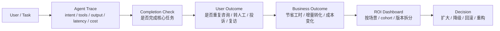

<section class="doc-hero">
  <p class="doc-hero__kicker">匿名真实面经</p>
  <h1>Agent 业务效果与 ROI 面试深挖：别只说“有多少人用了”</h1>
  <p class="doc-hero__lead">面试官问上线效果，不是在问访问量，而是在问这个 Agent 到底替用户、团队或业务省下了什么。</p>
  <div class="doc-hero__meta" aria-label="本文信息">
    <span>适合阶段：Agent 工程师 / 技术负责人面</span>
    <span>核心能力：任务完成 · 自动化率 · 成本归因 · A/B 验证</span>
    <span>脱敏原则：只保留指标方法，不保留真实业务数字</span>
  </div>
</section>

> DAU 只能证明有人进来，不能证明 Agent 有价值。价值要落到完成了多少任务、少转了多少人工、少花了多少时间、质量有没有掉。

> **本文边界**：线上质量归因、自动裁判和 badcase 回归见 [Agent 线上质量治理](./agent-quality-interview)；成本压缩、模型路由和 batch 见 [成本优化](./cost-optimization)；模型选型与灰度见 [模型选型与持续重评](../llm/model-selection-interview)。本文专讲面试里“上线后效果怎么样”的回答框架。

> **脱敏说明**：本文抽象自多场 Agent 工程岗位里的效果追问。所有数字都使用示例数据，不对应任何真实业务。

## 面试官想考什么

这组问题经常决定面试官把你当“做过 demo 的工程师”，还是“能把 AI 应用落地到业务结果的人”。

<div class="interview-grid">
  <div>
    <strong>Agent 上线后效果怎么样？除了 DAU 和请求量还有什么？</strong>
    <span>考你能不能从流量指标切到任务完成、自动化、体验和成本。</span>
  </div>
  <div>
    <strong>怎么证明是 Agent 带来的提升，而不是自然增长或运营活动？</strong>
    <span>考 A/B、灰度、双跑、cohort 和前后对比的归因意识。</span>
  </div>
  <div>
    <strong>一个 Agent 的北极星指标应该是什么？</strong>
    <span>考你会不会按场景定义，而不是所有 Agent 都看满意度。</span>
  </div>
  <div>
    <strong>任务完成率、自动化率、转人工率、满意度冲突时看哪个？</strong>
    <span>考指标优先级和安全边界。</span>
  </div>
  <div>
    <strong>AI 替代人工，怎么计算 ROI？</strong>
    <span>考节省成本、增量收入、质量损失、模型成本和运营成本的完整账。</span>
  </div>
  <div>
    <strong>为什么“AI 解决率很高”也可能是坏指标？</strong>
    <span>考重复咨询、误解决、用户沉默和人工回流。</span>
  </div>
  <div>
    <strong>技术指标和业务效果怎么打通？</strong>
    <span>考 trace 到 outcome 的链路：意图、工具、回复、用户行为和最终结果。</span>
  </div>
  <div>
    <strong>你会怎么向老板汇报 Agent 价值？</strong>
    <span>考能不能把工程语言翻译成容量、成本、风险和增长。</span>
  </div>
</div>

## 为什么 DAU 很容易误导

一个常见回答是：

```text
上线后每天有很多人使用，主动提问也不少，说明效果还可以。
```

这句话只能说明入口有人点。它回答不了四个关键问题：

- 用户的问题有没有被解决？
- 解决后有没有重复来问同一个问题？
- 有没有减少人工处理或提升流程效率？
- 单次成功任务的成本是不是低于原方案？

更稳的回答应该像这样：

```text
我不会只报使用量。我会把效果拆成四层：覆盖面、完成度、体验和经济账。
覆盖面看有多少目标用户进入 Agent；完成度看核心任务是否办成；体验看转人工、重复咨询、满意度和耗时；经济账看每个成功任务的模型成本、人工成本节省和额外运营成本。
```

这句话的关键不是指标多，而是层次对：**流量只是入口，完成才是价值，成本和质量决定能不能规模化**。

## 一套能面试的指标分层

| 层级 | 典型指标 | 回答的问题 | 常见误用 |
|---|---|---|---|
| 覆盖面 | 目标用户触达率、Agent 使用率、活跃请求数 | 有多少人接触到 Agent | 把访问量当成功 |
| 任务完成 | 核心任务完成率、一次解决率、自动化率 | 用户有没有把事情办完 | 只看模型回答好不好 |
| 人工负担 | 转人工率、人工接管时长、重复咨询率 | 是否真的减少人力压力 | 转人工下降但投诉上升 |
| 体验质量 | CX/CSAT、等待时长、用户努力程度 | 用户是否愿意继续用 | 满意度样本偏稀疏 |
| 经济账 | 成功任务成本、节省工时、增量转化、毛利影响 | 值不值得继续投 | 只看 token 成本 |
| 风险 | 错误解决、投诉、越权、回滚率 | 有没有把风险转嫁给用户 | 用平均指标盖住事故 |

Google HEART 框架里有一个很实用的方法：先定义目标，再找行为信号，最后才落成指标。Agent 也是一样。不要先问“看哪些指标”，先问“这个 Agent 要替谁完成什么目标”。

## 不同 Agent 的北极星不一样

| Agent 类型 | 北极星指标 | 配套护栏 |
|---|---|---|
| 客服 Agent | 自动化率 × CX 不下降 | 重复咨询率、转人工率、投诉率 |
| 数据分析 Agent | 正确洞察被采纳的比例 | SQL 安全、口径一致、人工审阅 |
| 编程 Agent | 合并后无回滚的有效 PR 比例 | 测试通过、review 修改量、线上缺陷 |
| 研究 Agent | 可采纳报告数 / 人工小时节省 | 引用正确率、事实核查 |
| 内部知识 Agent | 自助解决率 | 搜索失败率、过期答案率 |
| 运营 Agent | 增量转化 / 人工配置时长下降 | 误触达、退订、合规审核 |

面试里最忌讳把所有 Agent 都归到“用户满意度”。满意度有用，但它太慢、太稀疏、太容易受预期影响。工程上更硬的是任务完成和后续行为。

客服 Agent 是公开案例最多的场景。OpenAI 的 Klarna 案例里不只报“对话量”，还报了两类更硬的结果：重复咨询下降、解决时间从 11 分钟降到 2 分钟以内，并估算年度利润改善。Intercom Fin 的官方指标也把 automation rate 拆成 involvement rate × resolution rate：覆盖面和有效解决要分开算。

这个拆法可以迁移到任何业务 Agent：

```text
Automation = Coverage × Success
```

覆盖面高但 success 低，说明 Agent 触达了人但解决不了问题；success 高但覆盖面低，说明能力可用但入口、召回或场景覆盖不够。

## 一条从 Trace 到 ROI 的链路



这条链路比“Agent 调用量曲线”更有说服力。它把一次模型调用连接到最终结果：

- trace 告诉你这次 Agent 做了什么。
- completion check 告诉你任务是否完成。
- user outcome 告诉你用户是否接受这个结果。
- business outcome 告诉你它是否值得继续投入。

如果没有这条链路，很多 AI 项目会停在“大家觉得挺智能”，但没人能说明它到底节省了什么。

## 可运行代码：从事件日志算 Agent ROI

下面代码用一组脱敏事件计算核心指标。它故意把指标拆开，避免一个“解决率”掩盖问题。

```python
from __future__ import annotations

from dataclasses import dataclass
from statistics import mean


@dataclass(frozen=True)
class AgentEvent:
    conversation_id: str
    exposed: bool
    involved: bool
    resolved_by_agent: bool
    handed_off: bool
    repeated_within_24h: bool
    positive_feedback: bool | None
    latency_seconds: float
    model_cost_usd: float
    human_minutes_saved: float


@dataclass(frozen=True)
class AgentMetrics:
    exposure_rate: float
    involvement_rate: float
    resolution_rate: float
    automation_rate: float
    handoff_rate: float
    repeat_rate: float
    cx_score: float | None
    avg_latency_seconds: float
    cost_per_resolution: float
    estimated_labor_savings_usd: float
    net_savings_usd: float


def pct(numerator: float, denominator: float) -> float:
    if denominator == 0:
        return 0.0
    return round(numerator / denominator, 4)


def compute_metrics(events: list[AgentEvent], labor_cost_per_hour: float) -> AgentMetrics:
    total = len(events)
    exposed = [e for e in events if e.exposed]
    involved = [e for e in events if e.involved]
    resolved = [e for e in events if e.resolved_by_agent]
    handed_off = [e for e in events if e.handed_off]
    repeated = [e for e in events if e.repeated_within_24h]
    feedback = [e.positive_feedback for e in events if e.positive_feedback is not None]

    model_cost = sum(e.model_cost_usd for e in events)
    labor_hours_saved = sum(e.human_minutes_saved for e in resolved) / 60
    labor_savings = labor_hours_saved * labor_cost_per_hour

    return AgentMetrics(
        exposure_rate=pct(len(exposed), total),
        involvement_rate=pct(len(involved), total),
        resolution_rate=pct(len(resolved), len(involved)),
        automation_rate=pct(len(resolved), total),
        handoff_rate=pct(len(handed_off), len(involved)),
        repeat_rate=pct(len(repeated), len(resolved)),
        cx_score=pct(sum(1 for value in feedback if value), len(feedback)) if feedback else None,
        avg_latency_seconds=round(mean(e.latency_seconds for e in events), 2),
        cost_per_resolution=round(model_cost / max(len(resolved), 1), 4),
        estimated_labor_savings_usd=round(labor_savings, 2),
        net_savings_usd=round(labor_savings - model_cost, 2),
    )


if __name__ == "__main__":
    sample = [
        AgentEvent("c1", True, True, True, False, False, True, 3.2, 0.012, 6),
        AgentEvent("c2", True, True, False, True, False, False, 6.5, 0.018, 0),
        AgentEvent("c3", True, True, True, False, True, False, 4.1, 0.011, 5),
        AgentEvent("c4", True, False, False, False, False, None, 0.0, 0.000, 0),
        AgentEvent("c5", True, True, True, False, False, True, 2.7, 0.010, 7),
    ]
    metrics = compute_metrics(sample, labor_cost_per_hour=30)
    print(metrics)
```

这段输出里最值得看的是三组关系：

- `involvement_rate` vs `resolution_rate`：Agent 有没有机会解决，和它能不能解决。
- `automation_rate` vs `repeat_rate`：看似解决了，用户会不会回来问同一个问题。
- `cost_per_resolution` vs `net_savings`：token 成本很低，不代表整体 ROI 高；如果维护、人工复核和误解决成本很高，净收益会被吃掉。

## ROI 公式：不要只算 token 成本

一个能站住的 ROI 公式至少要这样：

```text
Net Value =
  labor_saved
+ incremental_revenue
+ risk_reduction_value
- model_cost
- infra_cost
- human_review_cost
- quality_loss_cost
- maintenance_cost
```

面试里不用精确到财务模型，但要表达完整账：

| 成本/收益 | 怎么估 | 容易漏掉什么 |
|---|---|---|
| 节省人工 | 自动解决数 × 平均人工处理分钟 × 人力单价 | 不是所有自动解决都等于可裁撤人力 |
| 增量收入 | A/B 中转化、复购、留存提升 | 自然增长、运营活动干扰 |
| 风险降低 | 少错、少投诉、少违规 | 很难货币化，但要独立看 |
| 模型成本 | input/output token + tool cost | 重试、judge、embedding、rerank |
| 运营成本 | 标注、知识维护、人工抽检 | 知识变更越频繁成本越高 |
| 质量损失 | 误解决、重复咨询、投诉、退款 | 平均满意度盖不住高风险个案 |

很多 Agent 项目表面 ROI 很好，是因为只算了 `model_cost`，没算知识维护、人工复核和误解决。

## A/B 和灰度：证明“是 Agent 带来的”

上线效果最难的是归因。前后对比很容易被误导：

```text
上线前本来就是淡季。
上线后刚好做了运营活动。
用户量变了，问题分布也变了。
人工团队同时改了 SOP。
```

更稳的验证方式：

| 方法 | 适合 | 注意 |
|---|---|---|
| A/B Test | 有足够流量，能随机分流 | 先定义主指标和护栏指标 |
| 灰度 Cohort | 不方便完全随机 | 关注 cohort 差异 |
| Shadow Run | 不影响用户，离线比较 Agent 建议 | 只能证明潜力，不证明用户体验 |
| Before/After | 早期探索 | 必须标注外部干扰 |
| Topic-level Diff | 多场景 Agent | 看哪个主题真的产生价值 |

面试时可以这样答：

```text
上线前用离线 eval 做准入，上线后用小流量灰度看真实 outcome。主指标是核心任务完成或自动化率，护栏指标是投诉、重复咨询、转人工、延迟和成本。只有主指标升、护栏不恶化，才扩大流量。
```

这和 [评估体系](./evaluation) 里的关系一样：离线 eval 是上线前的过滤器，A/B 是上线后的真实检验。

## 指标冲突时怎么决策

真实世界里指标很少一起变好。

| 冲突 | 怎么判断 |
|---|---|
| 自动化率上升，满意度下降 | 可能把复杂问题也硬拦在 AI 内，需要降低覆盖或更早 handoff |
| 转人工率下降，重复咨询上升 | 可能是“误解决”，用户没当场转人工但问题没解决 |
| 成本下降，任务完成下降 | 便宜模型或缓存策略伤了质量，净收益不一定更好 |
| 任务完成上升，延迟上升 | 看任务价值和用户等待容忍度，必要时拆同步/异步 |
| 满意度上升，风险事件增加 | 风险优先，不能用体验覆盖安全 |

一个清晰的优先级：

```text
安全和合规是硬门槛；任务完成是主指标；体验和成本是约束；覆盖面是增长杠杆。
```

如果面试官问“满意度和任务完成冲突怎么办”，可以答：

```text
任务完成更硬，但不能忽略体验。工具成功但用户差评，说明表达、等待、预期或 UI 有问题；用户满意但系统给了越权建议，仍然不能算成功。
```

## 技术指标怎么翻译成业务语言

工程师容易汇报这些：

```text
意图识别准确率 93%
工具调用成功率 96%
P95 延迟 4.2 秒
单次成本 0.03 美元
```

负责人真正关心的是：

```text
多少请求不需要人工？
用户问题是否更快解决？
人工团队是否释放了容量？
失败时有没有风险扩大？
继续投钱能换来什么增长？
```

翻译表：

| 技术指标 | 业务解释 |
|---|---|
| Intent accuracy | 用户是否被路由到正确流程 |
| Tool success | 系统是否真的办成事 |
| Judge score | 内容是否可被信任 |
| Latency | 用户等待成本 |
| Token cost | 单次服务边际成本 |
| Fallback rate | 主链路稳定性和体验风险 |
| Handoff rate | 人工容量压力 |
| Repeat rate | 是否误解决或不彻底 |

面试里能做这层翻译，会显得你不是只盯模型，而是能把模型放进业务系统里。

## 常见陷阱

### 陷阱 1：把使用量当价值

**现象**：汇报只讲日活、请求量、对话轮次。

**根因**：这些是入口指标，不是结果指标。用户可能因为 Agent 不好用反复问，轮次反而更高。

**修法**：至少补核心任务完成率、重复咨询率、转人工率和单次成功成本。

### 陷阱 2：只看自动化率，不看误解决

**现象**：AI 解决率很高，但用户第二天又回来问，或投诉增加。

**根因**：把“没有转人工”当成“已解决”。

**修法**：自动化率要配 repeat rate、complaint rate、delayed handoff。没有后续行为验证的解决率不可信。

### 陷阱 3：只算模型账单，不算运营账

**现象**：单次模型调用很便宜，但团队维护知识库、抽检、修 badcase 花了大量时间。

**根因**：ROI 只算 token，没有算维护和质量损失。

**修法**：把标注、审核、知识更新、事故处理、人类兜底都放进成本项。

### 陷阱 4：把整体平均盖过场景差异

**现象**：整体完成率 80%，但某个高价值主题只有 30%。

**根因**：没有按 intent、topic、用户层级、版本拆分。

**修法**：看 topic-level ROI。高频低价值场景和低频高价值场景要分开决策。

### 陷阱 5：没有护栏指标，A/B 只追主指标

**现象**：新版本提升自动化率，但投诉、误解决、成本或延迟恶化。

**根因**：只设一个增长指标，没有设安全和体验边界。

**修法**：每个实验至少有主指标和护栏指标。护栏破了，即使主指标涨也不能放量。

### 陷阱 6：把“节省时间”直接等同于“节省成本”

**现象**：说 AI 节省了很多小时，但团队人数、SLA、产出都没变。

**根因**：时间节省不一定变成财务收益，可能只是释放容量。

**修法**：区分 hard savings 和 soft savings。hard savings 是明确减少外包、人力或成本；soft savings 是处理更多任务、缩短等待、提升响应能力。

## 与相邻文章的区别

| 文章 | 重点 | 本文不重复什么 |
|---|---|---|
| [Agent 线上质量治理](./agent-quality-interview) | 技术质量、badcase、自动裁判 | 不展开 judge 和归因细节 |
| [成本优化](./cost-optimization) | 降低 token、延迟和推理成本 | 不把 ROI 简化成模型账单 |
| [模型选型与持续重评](../llm/model-selection-interview) | 模型候选评估和灰度 | 不展开模型能力对比 |
| [可观测性](./observability) | trace/span 和调试链路 | 不讲工具平台选型 |
| [AI Coding SDLC](./ai-coding-sdlc-interview) | AI 编码流程和团队质量门禁 | 不聚焦研发效能指标 |

本文回答的是“这个 Agent 值不值得继续投”，不是“它技术上有没有做对”。

## 面试题深度解析

### Q1：Agent 上线后效果怎么样？除了 DAU 还能说什么？

**30 秒版本**：我会分四层讲：覆盖面、任务完成、体验和经济账。DAU 只说明有人用，真正要看核心任务完成率、自动化率、转人工率、重复咨询率、满意度、单次成功成本和净节省。

**追问 1：如果没有完整数据怎么办？**

坦白现状，但给路线。可以说当前只有使用量和人工回顾，下一步会补 trace 到 outcome 的链路，先从核心 intent 的任务完成率和转人工率做起。

**追问 2：怎么避免指标太多？**

选一个北极星，加三到五个护栏。比如客服 Agent 的北极星是 automation rate，护栏是 CX、repeat rate、complaint、handoff、cost。

### Q2：怎么证明是 Agent 带来的提升？

**30 秒版本**：优先 A/B 或灰度 cohort。上线前跑离线 eval，线上小流量分流，对比核心 outcome；同时看护栏指标。没有随机实验时，要标注运营活动、流量结构和时间周期干扰。

**追问 1：样本量不够怎么办？**

先做 topic-level shadow run 和人工标注，找高价值场景。小流量阶段看方向性信号，不急着宣称统计显著。

**追问 2：A/B 显示任务完成上升但投诉也上升？**

不能扩大。投诉是护栏。要切 topic 看是不是某类场景被错误自动化，必要时降低覆盖或提前 handoff。

### Q3：怎么计算 AI 替代人工的 ROI？

**30 秒版本**：不是 `解决数 × 人工成本 - token 成本` 这么简单。要加上模型、基础设施、标注、知识维护、人工抽检、质量损失和事故成本；收益也要区分 hard savings 和 soft savings。

**追问 1：hard savings 和 soft savings 怎么讲？**

hard savings 是预算真的减少，例如外包量下降、加班下降、单位处理成本下降。soft savings 是容量释放，例如等待时间下降、同样团队处理更多请求。

**追问 2：如果 ROI 算不清还要做吗？**

可以先用 leading indicators：任务完成、处理时长、人工接管、重复咨询。等流量和流程稳定后再转成财务模型。

### Q4：自动化率高为什么可能不是好事？

**30 秒版本**：因为自动化率可能把“没有转人工”误当成“解决”。如果用户沉默、重复咨询、投诉、后续人工升级增加，说明 AI 可能是在误解决。

**追问 1：怎么发现误解决？**

看 24h/7d repeat、delayed handoff、同主题再次打开、投诉、退款或人工备注。用户不点差评也会用行为表达失败。

**追问 2：怎么修？**

按 topic 切分，把高误解决场景降级为澄清、转人工或只读建议。不要为了冲 automation rate 把所有问题都硬拦在 AI 内。

### Q5：你会怎么向老板汇报 Agent 价值？

**30 秒版本**：用业务语言汇报：覆盖了多少目标流量、自动完成了多少核心任务、减少了多少人工接管、缩短了多少处理时间、单次成功成本多少、护栏指标有没有恶化、下一步扩大到哪些场景。

**追问 1：工程细节要不要讲？**

讲结论和风险，不讲实现细枝末节。比如“fallback rate 上升导致自动化率下降”，要翻译成“主链路稳定性影响了人工容量释放”。

**追问 2：如果效果一般怎么办？**

不要硬夸。说明哪个环节限制 ROI：覆盖不足、任务完成低、知识维护成本高、转人工太晚、模型成本过高。然后给下一阶段实验假设。

## 延伸阅读

- [Google Research: HEART framework](https://research.google/pubs/measuring-the-user-experience-on-a-large-scale-user-centered-metrics-for-web-applications/)  
  为什么读：Goals-Signals-Metrics 的思路很适合 Agent 指标设计，先定义目标，再找可观测信号。

- [Intercom: Monitor Fin performance](https://www.intercom.com/help/en/articles/11390083-monitor-fin-s-performance-with-clarity-and-confidence)  
  为什么读：公开产品把 automation、resolution、involvement、CX 放在同一张看板，是客服 Agent 指标的好模板。

- [Intercom: Fin AI Agent Automation Rate](https://www.intercom.com/help/en/articles/13533623-fin-ai-agent-automation-rate)  
  为什么读：Automation Rate = Involvement Rate × Resolution Rate，这个拆法非常适合面试解释“覆盖”和“解决”的区别。

- [OpenAI: Klarna customer story](https://openai.com/index/klarna/)  
  为什么读：公开案例里同时给了对话量、人工等效、重复咨询下降、解决时长和利润改善，说明 ROI 不能只报访问量。

- [OpenAI: How agents are transforming work](https://openai.com/index/how-agents-are-transforming-work/)  
  为什么读：把 Agent 从单次聊天推进到长周期任务，提醒我们指标也要从“单轮满意度”转向“任务委派和完成”。

- [METR: Measuring AI Ability to Complete Long Tasks](https://metr.org/blog/2025-03-19-measuring-ai-ability-to-complete-long-tasks/)  
  为什么读：task horizon 是衡量 Agent 能力和真实影响的一个好视角，不只看单步 benchmark。

- 配套阅读：[Agent 线上质量治理](./agent-quality-interview)、[成本优化](./cost-optimization)、[模型选型与持续重评](../llm/model-selection-interview)、[可观测性](./observability)。  
  为什么读：业务效果要落到 trace、质量、成本和灰度上，不能孤立看。
