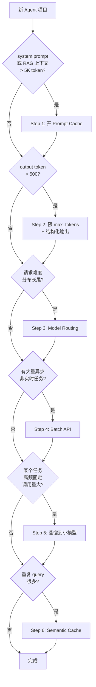

<section class="doc-hero">
  <p class="doc-hero__kicker">工程化</p>
  <h1>Agent 成本优化</h1>
  <p class="doc-hero__lead">一个高频 RAG Agent 月账单 50 万——拆开账单看，input token、output token、cache write/read、工具调用，每个口子都能省 50%-90%。会不会用决定了产品能不能 scale。</p>
  <div class="doc-hero__meta" aria-label="本文信息">
    <span>适合阶段：生产 / 财务治理</span>
    <span>核心：七大手段 + 决策框架 + 成本测算</span>
    <span>面试重点：分场景选型 + break-even 测算</span>
  </div>
</section>

## 面试官想考什么

读完这篇你要能正面回答下面这些题。每题后面括号里是面试官真正想看你答出什么。

<div class="interview-grid">
  <div>
    <strong>一个高频 RAG Agent 月账单 50 万，你按什么顺序优化？</strong>
    <span>考成本结构分析——能不能先拆账单再动手，而不是无脑套技术。</span>
  </div>
  <div>
    <strong>Model routing 怎么判断请求"难度"？路由器本身的成本怎么 cover？</strong>
    <span>考路由实现的工程细节——路由错一次的代价 vs 省下的钱。</span>
  </div>
  <div>
    <strong>Batch API 50% 折扣，什么场景能用、什么不能？</strong>
    <span>考"延迟换价格"的边界——异步场景的识别能力。</span>
  </div>
  <div>
    <strong>Semantic cache 的 hit rate 怎么提高？什么场景必然失效？</strong>
    <span>考向量相似度阈值、长尾 query、上下文依赖的辨析。</span>
  </div>
  <div>
    <strong>用小模型省钱和保证质量的边界在哪？怎么测量这条线？</strong>
    <span>考能不能拿出量化方法——不是凭感觉说"小模型够用"。</span>
  </div>
  <div>
    <strong>output token 失控是怎么发生的？怎么挡？</strong>
    <span>考对 output 单价（通常是 input 的 3-5 倍）的敏感度。</span>
  </div>
  <div>
    <strong>为什么"用更便宜的模型"经常反而更贵？</strong>
    <span>考端到端思考——重试次数、上下文膨胀、人工兜底成本。</span>
  </div>
</div>

---

## 为什么成本优化是 Agent 工程的核心

先看一个真实的数字感。假设你做了一个客服 RAG Agent：

- 日活 10 万用户，人均 5 轮对话 = 50 万次请求/天
- 每次请求带 8K token 的检索上下文 + 2K token 历史 = 10K input token
- 输出 500 token
- 用 Claude Sonnet 4.x（input $3/M、output $15/M）

不做任何优化的月账单：

```
input 成本 = 50万 × 10K × $3/M × 30 = $450,000
output 成本 = 50万 × 500 × $15/M × 30 = $112,500
月账单 ≈ $562,500
```

**56 万美元/月**。这不是"将来要考虑"的事——上线第二个月财务就会找上门。

同样的请求量、同样的产品形态，做完该做的优化后：

```
input 成本（开 cache + 压缩）：$45,000   ← 省 90%
output 成本（结构化限长）：$67,500       ← 省 40%
+ Batch API 处理异步部分：再省 30%
月账单 ≈ $80,000-$100,000
```

差距是 5-7 倍。**这就是为什么成本优化不是锦上添花，是 Agent 产品能不能 scale 的决定性变量。**

更隐蔽的是：用错模型 / 不优化的成本差距常常达到 **10-100 倍**——把所有请求无脑送 GPT-4o 和把 80% 简单请求路由到 GPT-4o-mini 的差距，可以让一个产品的毛利率从 -20% 变成 +60%。

> "Cursor 早期把所有 autocomplete 请求送 GPT-4，月烧 200K，几乎做死。改用自研小模型 + 缓存后单次成本降到 1/30，才跑通商业模型。"——这种故事在 LLM 应用圈每个季度都会重演一次。

---

## 成本到底花在哪：先拆账单

不拆账单就优化，多半在做无用功。Agent 应用的成本通常由五块组成：

```
总成本 = Input Token × 单价
       + Output Token × 单价（通常 3-5 倍 input）
       + Cache Write Token × 单价（比 input 贵 25-100%）
       + Cache Read Token × 单价（比 input 便宜 80-90%）
       + 工具调用费用（搜索 API、code execution、第三方 SaaS）
       + 自部署 GPU/推理服务（如果走开源模型）
```

每个 LLM 提供商都提供 usage 字段，把这些数字打到 [可观测性](./observability) 系统才能做下一步决策。一个典型的成本拆解可能长这样：

| 成本项 | 占比 | 单次绝对值 |
|---|---|---|
| Input token | 55% | $0.030 |
| Output token | 30% | $0.016 |
| Cache write | 8% | $0.004 |
| Cache read | 2% | $0.001 |
| 工具调用（搜索 API） | 5% | $0.003 |
| **小计** | **100%** | **$0.054** |

看完这张表你就知道：**先优化 input（55%）回报最高**，先优化 cache read（2%）是抓芝麻丢西瓜。

不同产品形态的成本结构完全不同——长上下文 RAG 的 input 占大头、长报告生成的 output 占大头、Code Agent 的工具调用占大头。**没拆账单之前，不要谈优化方向**。

---

## 七大优化手段总览

| 手段 | 典型省幅 | 实现复杂度 | 适用场景 | 风险 |
|---|---|---|---|---|
| **1. Prompt Caching** | 50%-90% input | 低（标个字段） | system prompt 长 / RAG 长上下文 / 多轮对话 | 字节级敏感，prefix 污染就 0 命中 |
| **2. Model Routing** | 70%-95% | 中（要写路由器） | 请求难度差异大 | 路由错的请求质量崩塌 |
| **3. Semantic Caching** | 30%-80%（视命中率） | 中（embedding + 向量库） | 高频重复 query（FAQ / 客服） | 长尾 query / 个性化场景失效 |
| **4. 蒸馏 / Fine-tune 小模型** | 80%-95% | 高（要数据 + 训练 + 部署） | 固定高频任务（分类 / 抽取） | 训练数据偏 → 长尾崩塌 |
| **5. Batch API** | 50% | 极低（换个 endpoint） | 异步任务（24h 内出结果即可） | 不能用于实时交互 |
| **6. 上下文压缩** | 30%-70% input | 中（要选压缩器） | 长上下文 / RAG 多文档 | 信息损失 → 召回下降 |
| **7. Output Token 控制** | 30%-60% output | 低（max_tokens / structured） | 任何场景 | 截断关键信息 |

这张表是这篇文章的"骨"。下面每节展开。

---

## 1. Prompt Caching——长前缀复用的杀手锏

**适用判断**：如果你的 system prompt > 1K token，或者每次请求带的 RAG 上下文 > 5K token 且会被同一 session 多次复用——立刻开 cache。

这是回报最高、实现最简单的优化。Anthropic 命中部分按 input 价格的 10% 计费（省 90%），OpenAI 50%（省 50%），DeepSeek 自动且零代码改造。

一个长合同问答的真实测算（10 轮对话，前缀 80K token）：

```
不开 cache：$3.17 / session
开 cache：  $0.79 / session  （省 75%）
```

**关键设计点**：

- 越稳定的内容越靠前（system → tools → few-shot → RAG → 历史 → 当前 query）
- 不要在 prefix 里塞时间戳、user_id 这种动态字段
- Anthropic 写入贵 25%——cache 至少被命中 2 次以上才回本
- 必须监控 `cache_read_input_tokens / total_input_tokens` 比率，低于预期立刻报警

cache 的协议细节（四家 API 对比、breakpoint 布局、TTL、失效监控、Agent 多轮场景的分层 cache）整篇都在 [上下文缓存](../context/caching)，本文不重复。**这是七种手段里收益最高的一种，没读 caching 那篇就先去读**。

---

## 2. Model Routing / Cascading——按难度分流

**核心观察**：用户请求的难度分布是长尾的。80% 的请求 GPT-4o-mini / Haiku 完全能搞定，剩下 20% 才真正需要 Opus / GPT-5。无脑全送大模型，你为那 80% 多付了 10-20 倍。

但这有个先决问题——**怎么判断"这个请求该走哪个模型"**？三种主流做法：

### 做法 A：用最小模型做难度分类

让一个极便宜的小模型（GPT-4o-mini / Haiku，甚至自部署的 Llama-3-8B）先看一眼请求，输出 `simple / medium / hard`。

```python
from openai import OpenAI

client = OpenAI()

ROUTING_PROMPT = """你是一个请求难度分类器。判断用户请求需要的模型能力等级：

- simple: 闲聊、简单 FAQ、单步任务、明确的事实查询
- medium: 多步推理、需要工具调用 1-3 次、有上下文但不复杂
- hard: 复杂规划、多文档综合分析、需要长上下文、代码编写/调试

只输出一个单词：simple / medium / hard。不要解释。"""

MODEL_MAP = {
    "simple": "gpt-4o-mini",     # $0.15 / $0.60 per M
    "medium": "gpt-4o",          # $2.50 / $10 per M
    "hard":   "gpt-5",           # $10 / $30 per M
}

def route_and_call(user_query: str, history: list) -> dict:
    """先用 mini 判断难度，再选模型调用"""
    # 路由步骤：成本约 $0.0001（300 token input + 1 token output）
    routing_resp = client.chat.completions.create(
        model="gpt-4o-mini",
        messages=[
            {"role": "system", "content": ROUTING_PROMPT},
            {"role": "user", "content": user_query[:500]},  # 截断防止路由本身变贵
        ],
        max_tokens=4,
        temperature=0,
    )
    difficulty = routing_resp.choices[0].message.content.strip().lower()
    chosen_model = MODEL_MAP.get(difficulty, "gpt-4o")

    # 实际调用
    main_resp = client.chat.completions.create(
        model=chosen_model,
        messages=history + [{"role": "user", "content": user_query}],
    )
    return {
        "answer": main_resp.choices[0].message.content,
        "routed_to": chosen_model,
        "difficulty": difficulty,
        "routing_cost": _estimate(routing_resp.usage, "gpt-4o-mini"),
        "main_cost": _estimate(main_resp.usage, chosen_model),
    }


def _estimate(usage, model: str) -> float:
    """简化版成本估算，实际项目要从 pricing 表读"""
    rates = {
        "gpt-4o-mini": (0.15, 0.60),
        "gpt-4o":      (2.50, 10.0),
        "gpt-5":       (10.0, 30.0),
    }
    in_price, out_price = rates[model]
    return (usage.prompt_tokens * in_price + usage.completion_tokens * out_price) / 1_000_000


# 用法
result = route_and_call("帮我把这段中文翻译成英文：你好", history=[])
# → routed_to: gpt-4o-mini, 节省约 95% 成本
```

### 做法 B：基于特征的规则路由

不调 LLM 判断难度，直接用启发式规则：

```python
def route_by_features(query: str, ctx: dict) -> str:
    if len(query) < 50 and ctx["has_code"] is False:
        return "gpt-4o-mini"
    if ctx["needs_tools"] or ctx["context_tokens"] > 50_000:
        return "gpt-5"
    return "gpt-4o"
```

更快、更便宜（路由本身零成本），但召回不如 LLM 路由——比如"帮我写一段斐波那契"这种短 query 实际需要 GPT-4o 才能写对，规则会把它送到 mini。

### 做法 C：Cascade（级联回退）

先送小模型，结果不好再升级。难点是怎么判断"结果不好"——常见做法是让大模型做一次 [LLM-as-Judge](./llm-judge) 评估，或者用 logprob / 自我评估。

```
小模型回答 → 评分 < 阈值 → 用大模型重新生成
```

cascade 在质量敏感场景更稳，但**对延迟不友好**——两次调用串行。

### 路由器自身的成本

经常被忽略的细节：**路由器调用本身要花钱**。GPT-4o-mini 的输入 $0.15/M，路由一次大约 300 token input + 4 token output = $0.000048。如果路由器把 50% 请求成功路由到 mini，节省的钱远大于路由成本；但如果你的请求本身就只值 $0.0001，加个 $0.00005 的路由器就吃掉了一半。

**经验值**：单次请求平均成本低于 $0.001 的场景不值得做 LLM 路由（用规则路由），高于 $0.01 的场景几乎一定值得。

---

## 3. Semantic Caching——相似 query 复用历史回答

不是 prompt cache（那是 prefix 字节级匹配），而是**语义级匹配**——用 embedding 算 query 相似度，命中就直接返回历史回答，不调 LLM。

```
新 query → embedding → 向量库找最近邻 → 相似度 > 0.95 → 返回历史 answer
```

典型工具是 [GPTCache](https://github.com/zilliztech/GPTCache)。

**适合场景**：

- 高频重复 FAQ 客服（"怎么退款"、"营业时间"——同一意思有 100 种问法）
- 公共信息查询（"巴黎天气"、"GPT-4 多少参数"）
- 文档站点的搜索引导

**不适合场景**：

- 强个性化（"我的订单状态"——每个用户的答案不一样）
- 强上下文依赖（"刚才那个怎么改"——脱离上下文 cache 没意义）
- 时效敏感（"今天的股价"——5 分钟前的答案就是错的）

### hit rate 怎么提高

semantic cache 的 hit rate 直接决定省多少钱。三个关键调参点：

**1. 相似度阈值**。设太高（0.99）几乎不命中，设太低（0.85）会返回不相关答案。生产里通常 0.92-0.95，要按业务分别调。

**2. embedding 模型质量**。BGE-large、OpenAI text-embedding-3-large 的召回比小模型高 5-15%。embedding 成本相对 LLM 调用是零头，**不要在 embedding 上省钱**。

**3. 查询归一化**。"怎么退款？" / "如何退款" / "退款流程" 字面不同但语义相同——预处理时统一去标点、去停用词、用 GPT 改写成规范问法再 embedding。

**反模式：把 cache 当真理**。LLM 答案可能在某次特殊问法下错了，被存进 cache 后所有相似问法都返回错答案——必须有定期淘汰策略 + 用户负反馈触发失效。

---

## 4. 蒸馏 / Fine-tune 小模型——重复任务的终极方案

**核心场景**：某个高频固定任务（分类、抽取、改写）每天调用 100 万次，每次都跑 GPT-4o——这种场景蒸馏到 Llama-3-8B 或 Qwen-7B 微调版几乎一定划算。

蒸馏流程：

```
1. 用 GPT-4o 跑 10K-100K 真实样本，得到 (input, output) 对
2. 用这些对 fine-tune 一个小模型（LoRA / 全参数 SFT）
3. 在测试集上验证小模型质量是否 ≥ GPT-4o 的 95%
4. 部署小模型，把流量切过去
```

成本对比（假设单次请求 1K input + 200 output）：

| 方案 | 单次成本 | 100 万次 | 备注 |
|---|---|---|---|
| GPT-4o API | $0.0045 | $4,500 | 无前期投入 |
| 自部署 Llama-3-8B | $0.00005 | $50 | 但要付 GPU 月租 ~$2,000 |
| 自部署 + 微调 | $0.00005 | $50 | 一次性训练成本 ~$500 |

**90 倍成本差距**。但前提是任务确实够窄、调用量确实够大——盈亏平衡点大约是月调用量 5-10 万次以上。

### 蒸馏的边界

不是所有任务都适合蒸馏。三个判断标准：

- **任务边界清晰**：分类、抽取、改写、翻译——OK；开放式推理、长文生成——慎重
- **质量可量化**：能定义 accuracy / F1 / BLEU 之类的指标对比小模型和大模型
- **长尾可控**：小模型在长尾分布上崩得快——80% 流量上跑得好，10% 边缘 case 可能完全错

工业界主流方案是 **路由 + 蒸馏组合**：高频确定任务走蒸馏小模型，长尾 / 复杂请求路由到大模型。这样既享受蒸馏的极低成本，又用大模型兜住质量。

自部署 vs API 的更详细决策框架见 [开源 vs 闭源模型](../llm/open-vs-closed)。

---

## 5. Batch API——异步场景的 50% 折扣

Anthropic 和 OpenAI 都提供 Batch API——把多个请求打包提交，24 小时内异步返回结果，**价格是实时 API 的 50%**。

```python
# OpenAI Batch API 示例
batch_input = [
    {"custom_id": f"req-{i}",
     "method": "POST",
     "url": "/v1/chat/completions",
     "body": {"model": "gpt-4o", "messages": [...]}}
    for i in range(10000)
]

# 1. 上传 jsonl 文件
file = client.files.create(file=open("batch.jsonl", "rb"), purpose="batch")
# 2. 创建 batch job
batch = client.batches.create(
    input_file_id=file.id,
    endpoint="/v1/chat/completions",
    completion_window="24h",
)
# 3. 24h 内轮询 batch.status，完成后下载结果
```

### 什么场景能用

- **数据预处理**：100 万条文档过一遍 LLM 做分类 / 抽取
- **离线评估**：跑 eval set 测试新 prompt
- **报告生成**：每日凌晨生成日报，第二天早上看
- **数据集构建**：为微调准备训练数据（用 GPT-4o 给样本打标）

### 什么场景不能用

- **任何用户在等的请求**——24h SLA 不可接受
- **依赖前一步结果的多步任务**——batch 是无状态的，每个请求独立
- **会因延迟错过时效的任务**——比如新闻分析必须当天出

Anthropic 的 [Message Batches API](https://docs.anthropic.com/en/docs/build-with-claude/batch-processing) 限制类似，价格也是 50%。

**关键认知**：Batch API 不是"半价的实时 API"，是**完全不同的产品形态**。把它当成"异步任务队列"——产品设计阶段就要识别出哪些任务能容忍延迟。

---

## 6. 上下文压缩——长 RAG 的必需品

如果每次请求都拼 50K token 的检索结果进去，input 成本会失控。两种压缩思路：

### 思路 A：检索层压缩（rerank + 截断）

第一步 retriever 召回 Top-50 文档，然后用 rerank 模型重排取 Top-5，丢掉其余 45 个。

```python
# 召回 50 个粗排
candidates = vector_db.search(query, k=50)
# Cohere Rerank / BGE Reranker 精排
reranked = reranker.rank(query, candidates, top_n=5)
# 只把 Top-5 喂 LLM
context = "\n\n".join(reranked)
```

省的不光是 token——Top-5 的精度通常比 Top-50 的精度高（噪声少）。

### 思路 B：内容层压缩（LLMLingua 等）

[LLMLingua](https://github.com/microsoft/LLMLingua) 用一个小模型做 token-level 删减，保留高信息量 token，删掉冗余。论文里报告能压缩 6-20 倍，质量损失小。

```
原文 5000 token → LLMLingua 压缩 → 500 token → 喂大模型
```

但要注意：压缩本身有成本（要跑小模型），节省必须大于压缩开销才划算。**短文本压缩通常不划算**，1K token 以下不要碰 LLMLingua。

### 思路 C：摘要式压缩

对话历史超过 N 轮就摘要——把前 40 轮压成一个 summary，重新作为"伪历史"塞回去。这是长对话 Agent 的标配，详见 [上下文压缩](../prompt/compression)。

**压缩的风险**：信息丢失。如果压缩掉的恰好是用户真正需要的细节，质量直接崩。生产里必须做**对照实验**：压缩前后的回答用 [LLM-as-Judge](./llm-judge) 打分，确认质量损失 < 5% 才能上线。

---

## 7. Output Token 控制——常被忽略的大头

output token 通常比 input 贵 3-5 倍——Sonnet input $3/M、output $15/M。**但很多团队完全不管 output 长度**，模型想说多少说多少。

三个手段，都很简单但效果显著：

### max_tokens 硬限制

```python
response = client.messages.create(
    model="claude-sonnet-4-5",
    max_tokens=500,   # 强制不超过 500 token
    messages=[...],
)
```

但要小心——截断会让模型答到一半就断。配合 system prompt 里写"请用 N 字内回答"通常更稳。

### stop 序列

```python
response = client.messages.create(
    stop_sequences=["##", "\n\n下一步"],  # 命中就停
)
```

适合结构化输出场景，让模型生成完关键部分就停。

### 结构化输出强约束格式

用 [structured output](../tools/function-calling) 强制 JSON schema，比让模型生成自由文本省 30-50% token——因为没有解释性文字、没有 markdown 装饰。

```python
# 自由文本输出（典型 800 token）
"这是一个非常有趣的问题。根据您提供的信息，我认为...[长篇大论]"

# JSON schema 输出（典型 200 token）
{"answer": "...", "confidence": 0.85, "sources": [...]}
```

**反模式：让模型"想多少说多少"**。GPT-4o 的默认风格会输出大量礼貌性铺垫和总结性收尾——纯浪费 output token。在 system prompt 里明确写"直接回答，不要总结、不要客套"能省 20-40% output。

---

## 实战：一个完整的成本测算 case

场景：法律 RAG Agent，月调用量 100 万次。

**优化前**：

```
每次请求：system 2K + RAG 检索 30K + 历史 5K + query 0.5K = 37.5K input
              + 800 output
模型：GPT-4o（$2.50 / $10）
单次成本 = 37.5K × $2.50/M + 800 × $10/M = $0.0938 + $0.008 = $0.102
月成本 = $0.102 × 100万 = $102,000
```

**逐步优化**：

| 优化步骤 | 措施 | 单次成本 | 月成本 | 节省 |
|---|---|---|---|---|
| 0 | 基线 | $0.102 | $102,000 | — |
| 1 | 开 prompt cache（system + RAG 共 32K 标 cache） | $0.027 | $27,000 | -74% |
| 2 | + rerank 把 RAG 从 30K 压到 8K | $0.011 | $11,000 | -90% 累计 |
| 3 | + Model routing（60% 流量路由到 GPT-4o-mini） | $0.006 | $6,000 | -94% 累计 |
| 4 | + Output 限长到 400 token + 结构化 | $0.005 | $5,000 | -95% 累计 |
| 5 | + 离线评估走 Batch API（10% 请求量） | $0.0048 | $4,800 | -95% 累计 |

**月账单从 10.2 万降到 4,800 美元**。这不是理论上限——是真实可达的工程结果，需要 1-2 个工程师 2-4 周的工作。

注意优化顺序——**先做 cache + 压缩，再做路由，最后碰蒸馏**。原因：cache 和压缩零质量损失（只要 prefix 设计对），路由有小概率把请求送错模型，蒸馏前期投入大。**永远先做高回报零风险的**。

---

## 决策框架：什么场景用什么手段



按这个顺序走，单个项目能 cover 70%-90% 的优化空间。

---

## 监控指标：成本可观测性

成本优化必须配监控，否则上线后悄悄退化没人发现。核心指标：

| 指标 | 计算 | 告警阈值（建议） |
|---|---|---|
| **Cost per request** | 当日总成本 / 当日请求数 | 比 7 日均值高 30% |
| **Cost per session** | 单次完整对话总成本 | 比基线高 50% |
| **Cost per user** | 单用户日活成本 | 看分位数尾部，P99 异常 |
| **Cache hit rate** | cache_read / total_input | 低于历史均值 20% |
| **Output / Input ratio** | output_tokens / input_tokens | 突然走高（模型变啰嗦） |
| **Model distribution** | 各模型调用占比 | 大模型占比突增 |
| **Monthly burn** | 月度累计 | 接近月预算 80% 报警 |

把这些指标推到 [可观测性](./observability) 系统的 dashboard。**单看月账单太晚——账单出来时钱已经花掉了**。要看分钟级别的实时趋势，异常 30 分钟内能发现。

**配套：[Rate limiting](./rate-limiting) 是成本失控的最后一道兜底**——任何一个用户/接口的 token 用量异常飙升，要能立刻挡住。

---

## 反模式：为省钱牺牲质量得不偿失

最容易犯的错：盯着 LLM 单价表，把所有请求都切到最便宜的模型，结果质量崩塌、用户流失。

真实案例的展开：

某 SaaS 公司把客服 Agent 从 GPT-4 切到 GPT-3.5-turbo，单次成本从 $0.05 降到 $0.003（省 94%）。一个月后发现：

- 用户复述率从 15% 涨到 38%（机器人答不准，用户得问 2-3 次）
- 转人工率从 8% 涨到 22%（机器人搞不定，转人工兜底）
- 客户满意度从 4.5 跌到 3.2
- 人工坐席成本反而上涨 60%

**总成本算下来是涨的，不是降的**。

教训：

- **API token 成本只是显性成本**，隐性成本是质量下降的所有连锁反应——复述、重试、人工兜底、用户流失
- 优化前必须有 **质量基线指标**（accuracy / 满意度 / 复述率），优化后这些指标不能掉
- "省钱"和"保证质量"是一个 Pareto 前沿，**不是选一个最便宜的点**

更稳的做法：用 A/B test 在小流量上验证质量没掉再切。优化目标应该是"**在质量下降 < 3% 的前提下成本最低**"，不是单纯成本最低。

---

## 真实案例：Notion / Cursor / Perplexity 的成本控制

### Notion AI

Notion 公开过他们的 RAG Q&A 成本架构（2024 年的技术博客）：

- 用 OpenAI Embedding 做向量化，每个用户的 workspace 增量更新
- 检索 + rerank 后只把 Top-5 chunk 喂 GPT-4，控制 input 在 3K 以内
- 对短 query / 简单问题路由到 GPT-3.5，复杂综合查询才走 GPT-4
- 内部测算 routing 让平均成本降低 60%+

关键经验："**input 长度是变量，要在每次请求时动态决定，不能用静态模板**"——这是把 RAG 成本控制住的核心。

### Cursor

Cursor 的 autocomplete（"Tab"）是高频低价值场景的典型：

- 用户每打几个字就触发一次补全
- 单次请求要在 200ms 内出结果
- 大模型既贵又慢

他们的解法是 **自研专用小模型 + 多级缓存**：

- 训了一个 7B 左右的专门做代码补全的模型
- 同样的代码上下文走 prefix cache 命中
- 单次成本压到 GPT-4 的 1/30 量级

但 Composer / Agent 模式仍然走大模型（Claude 4.5 / GPT-5）——**高价值复杂任务该花的钱花**。这就是"按场景选模型"的真实应用。

### Perplexity

Perplexity 公开过他们的核心成本拆解：

- 搜索 API（Brave / 自家爬虫）：固定成本，每次查询 $0.005-0.01
- Embedding：单次成本很低，但量大累计也不少
- 主 LLM 调用（用户可选 GPT-5 / Claude / Sonar）：占大头
- 用户分层：免费用户路由到便宜的 Sonar 小模型，Pro 用户才可以用旗舰

教训：**搜索类产品的成本天花板不在 LLM 在搜索 API**，优化时不能只盯模型那一块。

---

## 容易踩的坑

### 陷阱 1：过度优化损失质量

**现象**：账单降 80%，但用户满意度从 4.5 跌到 3.5，复述率翻倍。
**根因**：单纯优化 LLM 成本，没考虑端到端的"用户为完成任务的总成本"——重试、转人工、流失。
**修法**：优化必须配 A/B test 对比质量基线指标，"质量损失 < 3% 前提下最低成本"才是真目标。

### 陷阱 2：Cache 失效悄悄涨成本

**现象**：上线时 cache 命中率 85%，几个月后变成 30%，账单悄悄涨 3 倍没人发现。
**根因**：某次发版有人在 system prompt 里加了时间戳 / user_id / 改了换行，prefix 字节级变化。或者 TTL 短于请求间隔导致反复重写。
**修法**：cache hit rate 必须上监控大盘，低于历史均值 20% 持续 1 小时报警。详见 [上下文缓存](../context/caching) 的陷阱小节。

### 陷阱 3：Output token 失控

**现象**：模型突然变啰嗦，output token 从平均 300 涨到 800，账单一夜涨 60%。
**根因**：换了模型版本（如 GPT-4o 升 GPT-4o-2024-08）默认行为变了；或者 prompt 改动让模型不知道该多简洁。
**修法**：监控 `output_tokens / input_tokens` 比率，设硬告警。永远在 system prompt 里写明输出长度期望。

### 陷阱 4：Model routing 路由器自身成本失控

**现象**：加了 routing 后单次成本反而涨了。
**根因**：路由器对每个请求都调一次 LLM 判断难度，但被路由的请求本身价值很低，路由开销反而占大头。
**修法**：单次主调用成本 < $0.001 的场景用规则路由不用 LLM 路由；或者把路由器换成更便宜的模型（用 Haiku/mini 而不是 Sonnet/4o）。

### 陷阱 5：Semantic cache 返回过时答案

**现象**：用户问"今天股价"，cache 返回了 3 天前的答案。
**根因**：semantic cache 没设 TTL，或者对时效性 query 没做识别。
**修法**：(1) 短 TTL（小时级而非天级）；(2) 业务侧标注"时效敏感 query"绕过 cache；(3) 在 cache value 里存"生成时间"，应用层判断是否过期。

### 陷阱 6：把蒸馏当银弹

**现象**：花 2 个月蒸馏一个小模型，部署后发现长尾 case 错误率高，反而又得回退到大模型兜底。
**根因**：蒸馏数据集没覆盖长尾分布，小模型只学到了 head 流量的模式。
**修法**：蒸馏前必须做错误分布分析——小模型在哪些 case 上崩。常见方案：**蒸馏 + 路由组合**，小模型置信度低时回退到大模型，不是无脑全切。

### 陷阱 7：Batch API 用在不该用的场景

**现象**：把"用户上传文档后立刻分析"的请求送进 Batch，用户 5 分钟没看到结果就走了。
**根因**：低估了 batch 的 24h SLA——实际可能 2-6 小时返回，但产品 UX 假设是秒级。
**修法**：Batch 只用于"明确异步、用户不在线等结果"的场景——日报、数据预处理、离线评估。任何同步流程不要碰。

---

## 与相关概念的辨析

| 概念 | 关注点 | 范围 |
|---|---|---|
| **Cost optimization**（本文） | 降低单位请求成本 | 全栈 |
| **[Rate limiting](./rate-limiting)** | 防止异常流量打爆账单 | 兜底保护 |
| **[Observability](./observability)** | 成本数据采集 + 可视化 | 数据来源 |
| **[Prompt caching](../context/caching)** | input token 复用 | 单一手段（占 1/7） |
| **[Prompt compression](../prompt/compression)** | 上下文压缩算法 | 单一手段 |
| **[Open vs Closed](../llm/open-vs-closed)** | 自部署 vs API | 成本结构选型 |
| **[Models](../llm/models)** | 各模型定价对比 | 选型基础 |

辨析要点：
- 成本优化是**目标**，cache / 压缩 / 路由是**手段**
- Rate limiting 是**事前**保护，cost optimization 是**结构性**降本
- Observability 提供数据，optimization 基于数据决策——两者必须配套

---

## 面试题深度解析

### Q: 一个高频 RAG Agent 月账单 50 万，怎么优化？

**30 秒版本**：不拆账单的优化都是耍流氓。先用 observability 系统拆出 input / output / cache / 工具调用 / 自部署 GPU 各占多少，找最大头先动手。RAG 场景大概率是 input 占 60%-80%（每次拼 RAG 检索结果），第一刀切 prompt cache（省 50%-90% input），第二刀切检索压缩（rerank + Top-K 截断省 60%-80%），第三刀切 model routing（简单 query 走小模型省 70%-90%）。这三刀下去通常能把 50 万降到 5-10 万，再深度优化加 batch / 蒸馏 / semantic cache。**关键是不要先动 cache、再动模型——要先看账单**。

**追问 1**：你说先拆账单——具体看哪些字段？
看四组数：(1) input/output token 总量与单价；(2) cache_creation vs cache_read（如果用了 cache）；(3) 各模型调用次数与占比（如果路由了）；(4) 每用户/每 session 的成本分布——P50/P95/P99，重点看 P99 异常用户。比如发现 0.1% 的用户消耗了 30% 的成本（典型 abuse 场景），先做 [rate limiting](./rate-limiting) 而不是别的。Anthropic / OpenAI 的 usage API 都返回这些字段，落到自家数仓做切片分析。

**追问 2**：怎么验证优化不会损害质量？
任何优化都必须 A/B test。准备一个固定的 eval set（200-500 条覆盖各场景的真实样本），每次优化前后跑一遍 [LLM-as-Judge](./llm-judge) 或人工评估。生产灰度时 1% 流量先开优化版本，对比关键业务指标（满意度、复述率、转人工率）24-48 小时无显著退化才扩大。**没有 eval 基线的优化等于盲飞**，省了 80% 成本但把产品搞砸的故事每年都在重演。

### Q: Model routing 怎么判断"难度"？路由器本身的成本怎么 cover？

**30 秒版本**：三种判断方式按成本递增：规则路由（基于 query 长度、是否带代码、context 大小等特征，零 LLM 成本）→ 小模型路由（用 GPT-4o-mini / Haiku 调一次给三档难度评分，约 $0.0001/次）→ Cascade 路由（先送小模型、质量不够再升级，双倍延迟）。路由器成本 cover 的判断公式：**(被路由到小模型的请求比例 × 节省的差价) > 路由器单次成本**。经验值：单次主调用 < $0.001 不值得 LLM 路由（路由成本占比太高），> $0.01 几乎一定值得。

**追问 1**：路由错的代价怎么算？
两种错向：simple 误判为 hard（钱白花，质量没问题），hard 误判为 simple（钱省了但质量崩）。后者代价大得多——一次糟糕的回答 = 用户流失 / 复述 / 转人工兜底，加起来可能是 100 次正确路由省下的钱。所以路由器的"召回 hard"必须高（保守路由——拿不准的归到 hard）。Cursor、Perplexity 这些产品的实践是：路由器宁可保守不准，让 5%-10% 的 simple 请求走大模型（多花点钱），也不让 hard 请求走小模型（崩质量）。

**追问 2**：怎么持续优化路由器准确率？
打日志 + 离线训练。每次路由完记录 (query, routed_model, user_satisfaction, retry_count)。每周离线分析：被路由到小模型但用户复述 / 重试 / 给负反馈的 case，标记为"hard 被误判为 simple"，加进路由器的 negative example。**理想情况下路由器本身可以蒸馏成一个专用小模型**——用历史路由日志当训练数据 fine-tune 一个分类器，比通用 GPT-4o-mini 准确率更高、成本更低。这是 routing + 蒸馏的组合应用。

### Q: Batch API 50% 折扣，什么场景能用、什么不能？

**30 秒版本**：能用的核心特征是"用户不在线等"。具体三类：(1) 数据预处理——给 100 万文档过一遍 LLM 做分类 / 抽取；(2) 离线评估——跑 eval set 测新 prompt / 新模型；(3) 异步报告——每日凌晨生成日报、月度分析。不能用的核心特征是"任何同步交互"——用户在 UI 里点击等结果、多步任务前一步依赖后一步、时效敏感（新闻、股价）。Batch API 的 SLA 是 24 小时（实际通常 2-6 小时返回），任何对延迟敏感的场景都不可用。

**追问 1**：能不能把"用户感知的同步任务"拆成"实时部分 + batch 部分"？
能。这是一个常见的成本优化设计模式。比如客服场景：用户提问的瞬时响应走实时 API（贵但快），但"用户离开后的对话总结、用户画像更新、知识库回写"这些后台任务走 batch（24h 内完成即可）。产品设计阶段就要区分这两类任务——把 batch 适用部分尽量拆出来。一些公司的 batch 流量占比能做到总请求的 30%-50%。

**追问 2**：Batch 没及时返回怎么办？业务怎么兜底？
Batch 的 SLA 是 24h 但**不保证**——服务过载时可能超时。生产里必须做兜底：(1) 设置自家的超时阈值（比如 12 小时未完成就 fallback 到实时 API 跑一份）；(2) 任务依赖关系要清晰，下游任务不能假设 batch 一定按时返回；(3) batch 结果回来后要 verify 完整性——可能有部分请求失败需要补跑。Anthropic / OpenAI 都提供 batch status 查询接口，应用要轮询不能只等 webhook。

### Q: 用小模型省钱和保证质量的边界在哪？怎么测量这条线？

**30 秒版本**：边界由任务特性决定，不是凭感觉。三个量化方法：(1) **能力 benchmark**——任务相关的标准评测（如 GSM8K 看数学、HumanEval 看代码、MMLU 看综合）上小模型分数是不是接近大模型；(2) **业务 eval set**——拿 200-500 条真实样本，让大小模型各跑一遍，用 LLM-as-Judge 或人工评估对比，看小模型质量是不是 ≥ 大模型的 95%；(3) **A/B test**——线上小流量灰度，对比业务指标（满意度、复述率、转化率）有没有统计显著退化。三个一起看才靠谱——benchmark 高不代表你的业务能用，eval 通过不代表线上没坑。

**追问 1**：那如果三个指标矛盾呢？比如 benchmark 接近、eval 通过、但 A/B test 显示业务指标退化。
信 A/B test，不信前两个。原因：benchmark 是通用任务，你的业务可能在它没覆盖的维度上有要求；eval set 不管多用心都覆盖不全长尾分布。线上 A/B test 测到的是真实分布，不会撒谎。常见模式：eval 上小模型质量 = 大模型的 96%，A/B 显示用户满意度跌 8%——差距来自小模型在 5% 的特殊 case 上崩，eval set 恰好没有这种 case，但真实流量里有。解法：把这些 case 找出来加进 eval set，重新 fine-tune 或回退到大模型。

**追问 2**：如果小模型能用但担心未来某些 case 崩，怎么设防线？
两层防线。第一层：**置信度检测**——小模型输出时让它同时给一个 confidence score（让模型自己评估这次回答有多确定），低于阈值自动 cascade 到大模型。这是 cascade routing 的核心思路。第二层：**异常监控**——监控小模型在线上的输出特征（输出长度、特定关键词出现率、用户负反馈率），任一指标异常飙升就触发回退到大模型。配合用户负反馈渠道（"这个回答不好"按钮），把负反馈样本回流去 fine-tune 或加进 eval set。

---

## 延伸阅读

- **官方文档：Anthropic Prompt Caching** ([docs.anthropic.com/en/docs/build-with-claude/prompt-caching](https://docs.anthropic.com/en/docs/build-with-claude/prompt-caching))
  cache 是七种手段里收益最高的一种。这份文档讲清写入溢价、命中折扣、breakpoint 数量、TTL 选项——开 cache 前必读。Anthropic 在博客里也给了 benchmark：书籍问答 90% 成本下降、Agent 多轮 80% 下降。

- **官方文档：OpenAI Batch API** ([platform.openai.com/docs/guides/batch](https://platform.openai.com/docs/guides/batch))
  Batch API 完整规格——jsonl 格式、24h SLA、50% 折扣。包含失败重试、部分完成、status 轮询的细节。设计异步任务流前必读。

- **官方文档：Anthropic Message Batches** ([docs.anthropic.com/en/docs/build-with-claude/batch-processing](https://docs.anthropic.com/en/docs/build-with-claude/batch-processing))
  Anthropic 版本的 Batch API。和 OpenAI 略有差异：每个 batch 最多 10 万请求，24h 内返回。和 prompt caching 可以叠加用——batch + cache 是冷数据处理的极致省钱组合。

- **GitHub：GPTCache** ([github.com/zilliztech/GPTCache](https://github.com/zilliztech/GPTCache))
  semantic cache 的主流开源实现。读它的源码（特别是 similarity_evaluation 模块）理解阈值调参、淘汰策略的工程实现。生产用之前要看清楚它的局限——不是开箱即用的银弹。

- **GitHub：LLMLingua** ([github.com/microsoft/LLMLingua](https://github.com/microsoft/LLMLingua))
  Microsoft 的上下文压缩库，论文 [arXiv:2310.05736](https://arxiv.org/abs/2310.05736)。读论文理解为什么 token-level 删减能保持语义——核心是用 perplexity 识别"冗余 token"。生产用要做对照实验确认你的任务能容忍。

- **论文：FrugalGPT** ([arxiv 2305.05176](https://arxiv.org/abs/2305.05176))
  Chen et al. 2023，最早系统论述 LLM cascade routing 的论文。提出"用便宜模型先试 + 失败再升级"的 cascade 思想。今天大多数 routing 工程实践的理论基础在这。

- **博客：Cursor — How We Built Cursor Tab** ([cursor.com/blog](https://cursor.com/blog))
  Cursor 公开的 autocomplete 成本控制经验。讲他们怎么用自研小模型 + 多级 cache 把单次成本压到 GPT-4 的 1/30。读它建立"高频低价值场景必须做蒸馏"的直觉。

- **博客：Notion AI Engineering** ([notion.so/blog](https://www.notion.so/blog))
  Notion 公开的 RAG 成本架构。重点学他们的 routing 决策——按 query 类型动态选模型，平均成本降 60%+。

- **AWS Architecture Blog — Cost optimization for LLM workloads** ([aws.amazon.com/blogs/architecture](https://aws.amazon.com/blogs/architecture))
  AWS 视角的 LLM 成本优化，强调自部署 vs API 的盈亏平衡分析。读它建立"什么 QPS 之上自部署划算"的量化感觉。

- **配套阅读**：[上下文缓存](../context/caching)——prompt cache 的全部细节，本文最强引用；[上下文压缩](../prompt/compression)——LLMLingua、摘要压缩算法；[可观测性](./observability)——成本数据的采集与监控大盘；[Rate limiting](./rate-limiting)——成本失控的最后一道防线；[模型对比](../llm/models)——各模型定价表；[开源 vs 闭源](../llm/open-vs-closed)——自部署 vs API 的成本决策；[LLM-as-Judge](./llm-judge)——验证优化不损害质量的核心工具。
