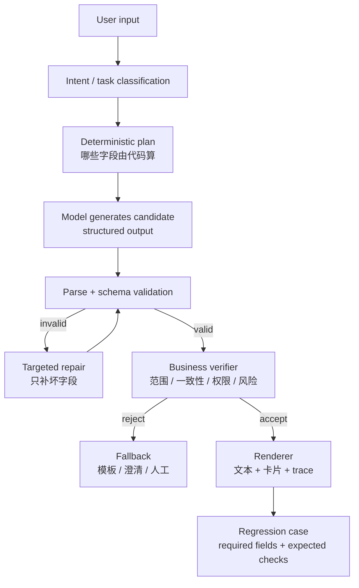

<section class="doc-hero">
  <p class="doc-hero__kicker">匿名真实面经</p>
  <h1>Agent 确定性控制面试深挖：别把概率问题继续交给 prompt</h1>
  <p class="doc-hero__lead">模型漏段、日期算错、JSON 偶发坏掉，这些不是“再优化一下提示词”就能稳定解决的问题。</p>
  <div class="doc-hero__meta" aria-label="本文信息">
    <span>适合阶段：Agent 工程师 / AI 应用架构面</span>
    <span>核心能力：代码下沉 · Structured Output · Verifier · 定向修复</span>
    <span>脱敏原则：只保留工程方法，不保留真实业务细节</span>
  </div>
</section>

> 成熟 Agent 工程的关键不是让模型“更听话”，而是把模型输出放进确定性系统里裁决。

> **本文边界**：工具 schema 文本怎么写见 [工具 Schema 设计](../tools/schema-design)，工具错误返回和重试见 [工具错误处理](../tools/error-handling)，整体运行时控制见 [Agent Harness](./harness) 和 [Agent Runtime](./agent-runtime)，线上质量和 badcase 回流见 [Agent 线上质量治理](./agent-quality-interview)。本文专讲真实面试里最常被追问的 **输出不稳定如何工程化收敛**。

> **脱敏说明**：本文只抽象面试问题和解决套路，所有例子都改成通用业务 Agent 场景，不包含任何可识别组织、真实项目、私有数据或业务规模。

## 面试官想考什么

这组题经常出现在项目深挖里。它不是考你会不会写 prompt，而是考你知不知道 prompt 的边界在哪里。

<div class="interview-grid">
  <div>
    <strong>一个 prompt 要求输出 A/B/C 三段，模型总漏 C，加 few-shot 还是漏，怎么办？</strong>
    <span>考你会不会从自由文本切到结构化字段、代码校验和定向补段。</span>
  </div>
  <div>
    <strong>日期窗口、金额计算、排序规则这些要不要交给模型？</strong>
    <span>考确定性下沉：能用代码算的，不要让模型凭语义判断。</span>
  </div>
  <div>
    <strong>Structured Outputs 和 JSON mode 有什么区别？为什么 JSON 合法还可能没用？</strong>
    <span>考 schema adherence，而不是只会说“输出 JSON”。</span>
  </div>
  <div>
    <strong>schema 校验通过了，为什么还可能是错的？</strong>
    <span>考格式正确、语义正确和业务正确三层边界。</span>
  </div>
  <div>
    <strong>prefill、few-shot、显式编号这些 prompt 手段还要不要用？</strong>
    <span>考软约束和硬约束的优先级，不是非黑即白。</span>
  </div>
  <div>
    <strong>模型输出坏了，是整体重试还是只修坏字段？</strong>
    <span>考定向修复、局部重试和可解释的 fallback。</span>
  </div>
  <div>
    <strong>verifier 到底验证什么？规则、模型裁判、人工 gate 怎么分工？</strong>
    <span>考你能不能把验证拆成格式、范围、权限、一致性和风险。</span>
  </div>
  <div>
    <strong>这类稳定性问题怎么进评估集？</strong>
    <span>考 badcase 归因、required fields、case-level diff 和回归门禁。</span>
  </div>
</div>

## 为什么“再加一句 prompt”会失效

看一个很常见的坏 case：

```text
请按下面三段输出：
A. 操作确认
B. 数据卡片
C. 后续建议
```

线上偶尔只输出 A 和 B。你加了 few-shot：

```text
示例：
A. ...
B. ...
C. ...
```

还是会漏。再加一句“不要遗漏 C”，短期好一点，过几天换模型、换输入、换上下文，又漏。

问题不在模型“看不懂 C”，而在任务结构本身太软：A/B/C 只是自然语言里的段落约定，模型可以在生成过程中把 C 当成“可选收尾”。few-shot 改变的是输出分布的先验，不是合法性约束。

面试里更稳的回答是：

```text
我不会继续堆 prompt。会先把 A/B/C 变成三个 required fields，解析后由代码检查字段是否存在、是否为空、是否和工具结果一致。缺哪段就只补哪段；如果这段可由工具结果确定，直接用代码生成，不再让模型自由发挥。
```

这句话背后的原则是：

> 模型负责 propose，代码负责 dispose。

模型可以提出候选内容，但是否采纳、是否补齐、是否执行，必须由模型外面的确定性系统决定。

## 四层收敛：从硬到软

遇到输出不稳定，不要从 prompt 开始，而要从更硬的层往下看。

| 层级 | 手段 | 解决什么 | 失败时怎么办 |
|---|---|---|---|
| 代码计算 | 日期、金额、排序、卡片类型、状态转移 | 能确定的业务逻辑 | 不让模型参与决策 |
| Schema 约束 | required fields、enum、类型、数组长度 | 输出结构和字段完整性 | 拒绝、补段、fallback |
| Verifier | 规则、Pydantic、业务一致性、权限、安全 | 格式之外的正确性 | 定向修复或人工 gate |
| Prompt 技巧 | prefill、few-shot、编号、拆任务 | 模型生成风格和稳定性 | 作为辅助，不当安全边界 |

面试中可以把这张表压成一句话：

```text
能确定就代码算，能约束就 schema 卡，能验证就 verifier 判，prompt 只负责让模型更容易生成候选答案。
```

## 一条稳定输出链路



这条链路里，模型只是 D 和 F 的一部分。C、E、G、H 都是工程系统。

一个成熟的 Agent 系统，不会让模型决定“自己是否合格”。模型生成候选，runtime 解析，verifier 判断，renderer 输出。任何一步失败都要进入可解释分支。

## 可运行代码：required fields + 规则 verifier + 定向补段

下面代码演示一个通用报告 Agent。模型应该输出四个字段：确认、卡片、分析、下一步。代码会做三类控制：

- 窗口天数和卡片类型由代码确定，不让模型算。
- 必填字段缺失时，只生成缺失字段的修复请求。
- 字段存在但和工具结果不一致时，进入 fallback。

```python
from __future__ import annotations

from dataclasses import dataclass
from enum import Enum
from typing import Any


class CardType(str, Enum):
    WEEKLY = "weekly_summary"
    MONTHLY = "monthly_summary"


@dataclass(frozen=True)
class ToolResult:
    metric_name: str
    window_days: int
    values: list[float]

    @property
    def card_type(self) -> CardType:
        return CardType.WEEKLY if self.window_days <= 7 else CardType.MONTHLY

    @property
    def average(self) -> float:
        return round(sum(self.values) / len(self.values), 2)


@dataclass(frozen=True)
class ValidationReport:
    ok: bool
    missing_fields: list[str]
    errors: list[str]
    repair_prompt: str | None = None


REQUIRED_FIELDS = ["confirm_message", "card", "analysis_text", "follow_up_tip"]


def validate_agent_output(output: dict[str, Any], tool: ToolResult) -> ValidationReport:
    missing = [field for field in REQUIRED_FIELDS if not output.get(field)]
    errors: list[str] = []

    card = output.get("card")
    if isinstance(card, dict):
        if card.get("type") != tool.card_type.value:
            errors.append(
                f"card.type={card.get('type')} does not match expected {tool.card_type.value}"
            )
        if card.get("window_days") != tool.window_days:
            errors.append(
                f"card.window_days={card.get('window_days')} does not match {tool.window_days}"
            )
        if card.get("average") != tool.average:
            errors.append(
                f"card.average={card.get('average')} does not match {tool.average}"
            )
    elif "card" not in missing:
        errors.append("card must be an object")

    if missing:
        repair_prompt = build_repair_prompt(missing, output, tool)
        return ValidationReport(False, missing, errors, repair_prompt)

    if errors:
        return ValidationReport(False, [], errors, None)

    return ValidationReport(True, [], [], None)


def build_repair_prompt(missing: list[str], output: dict[str, Any], tool: ToolResult) -> str:
    return (
        "Only generate the missing fields. Do not rewrite existing fields.\n"
        f"Missing fields: {missing}\n"
        f"Existing keys: {list(output.keys())}\n"
        "Use these deterministic values exactly:\n"
        f"- metric_name: {tool.metric_name}\n"
        f"- window_days: {tool.window_days}\n"
        f"- card_type: {tool.card_type.value}\n"
        f"- average: {tool.average}\n"
        "Return JSON with only the missing keys."
    )


def render_fallback(report: ValidationReport) -> str:
    if report.missing_fields:
        return "输出缺少必要字段，已触发定向补全。"
    return "当前结果未通过一致性校验，请稍后重试或转人工处理。"


if __name__ == "__main__":
    tool_result = ToolResult(
        metric_name="active_minutes",
        window_days=14,
        values=[32, 41, 38, 29, 35, 44, 39],
    )

    model_output = {
        "confirm_message": "已完成记录。",
        "card": {
            "type": "weekly_summary",
            "window_days": 7,
            "average": 36.86,
        },
        "analysis_text": "最近一段时间整体比较稳定。",
        # follow_up_tip is missing
    }

    report = validate_agent_output(model_output, tool_result)
    print("ok:", report.ok)
    print("missing:", report.missing_fields)
    print("errors:", report.errors)
    print("fallback:", render_fallback(report))
    if report.repair_prompt:
        print("--- repair prompt ---")
        print(report.repair_prompt)
```

输出会长这样：

```text
ok: False
missing: ['follow_up_tip']
errors: ['card.type=weekly_summary does not match expected monthly_summary', 'card.window_days=7 does not match 14']
fallback: 输出缺少必要字段，已触发定向补全。
--- repair prompt ---
Only generate the missing fields. Do not rewrite existing fields.
...
```

这里故意让模型同时犯两种错：漏字段、卡片类型不一致。工程处理也不一样：

- 漏 `follow_up_tip` 可以定向补段。
- `card.type` 和 `window_days` 错，不能靠补段解决，因为它已经违反工具结果，应该 fallback 或重生成卡片。

这就是 verifier 的价值：它不只是“JSON 能不能 parse”，而是判断模型候选是否能被系统采纳。

## Structured Outputs 解决的是 schema adherence，不是业务正确

OpenAI 的 Structured Outputs 文档把 JSON mode 和 Structured Outputs 区分得很清楚：JSON mode 只保证有效 JSON，Structured Outputs 才保证遵守 JSON Schema。OpenAI 在发布文章里也强调，过去开发者经常靠 prompt、开源工具和反复重试来让输出匹配格式，Structured Outputs 通过约束模型匹配 schema 来解决这个问题。

但面试里要讲下一层：**schema adherence 不等于业务正确**。

| 层 | 能保证什么 | 不能保证什么 |
|---|---|---|
| JSON mode | 输出是合法 JSON | 字段齐不齐、类型对不对 |
| Structured Outputs | 字段、类型、enum、required 更稳定 | 值是否和工具结果一致 |
| Pydantic / JSON Schema | 本地解析和类型约束 | 业务语义是否正确 |
| Business verifier | 范围、权限、状态、一致性 | 开放文本审美和人类偏好 |
| Human review | 高风险最终判断 | 覆盖所有请求 |

例如：

```json
{
  "card": {
    "type": "weekly_summary",
    "window_days": 7,
    "average": 36.86
  }
}
```

这个 JSON 可能完全符合 schema，但如果工具返回的是 14 天窗口，它就是错的。schema 管“像不像一个合法对象”，verifier 管“这个对象是否和事实一致”。

Pydantic 的文档也有一个很适合面试的表述：validation 更准确地说是把输入处理成符合类型和约束的模型实例。换句话说，Pydantic 能保证结构符合你的类型定义，但你仍然要写业务 validator。

## prefill、few-shot、编号：什么时候还有用

软约束不是没用，只是不能当最后防线。

| 手段 | 适合 | 不适合 |
|---|---|---|
| prefill | 去掉模型开场白、固定输出开头、轻量模板 | 强制复杂 schema、替代 verifier |
| few-shot | 让模型学习风格、边界和分类口径 | 修复“字段必须存在”这种合法性问题 |
| 显式编号 | 让模型注意输出顺序 | 证明输出完整 |
| 拆成多次调用 | 每段都需要独立注意力 | 低延迟高并发场景 |
| self-check | 让模型自查明显遗漏 | 替代独立校验器 |

Anthropic 的一致性文档也给了类似排序：如果要保证 JSON schema conformance，优先用 Structured Outputs；prefill、示例、拆 prompt 这些适合一般输出一致性。并且新模型并不都支持旧式 prefill，这也说明 prefill 不能作为长期架构边界。

更稳的策略是：

```text
硬约束负责合法性，软约束负责让模型更容易一次生成合法候选。
```

## 定向修复，不要每次整体重试

整体重试有三个问题：

- 成本高：重新生成全部字段。
- 不稳定：原本正确的字段可能被改坏。
- 不可解释：你不知道它修了什么。

定向修复更像补丁：

```text
缺 analysis_text，就只让模型生成 analysis_text。
card_type 错，就不要让模型修；因为 card_type 应该由代码确定。
tool args 缺 required field，就让模型补那个参数；权限不通过就不要补，直接拒绝。
```

一个实用规则：

| 错误类型 | 处理方式 |
|---|---|
| JSON parse 失败 | 重新生成结构，或用 structured output |
| required field 缺失 | 定向补字段 |
| enum 值非法 | 如果可由上下文确定，用代码修；否则澄清 |
| 与工具结果不一致 | 拒绝输出，重跑或 fallback |
| 权限不通过 | 不修，直接拒绝或人工 |
| 高风险越界 | 不修，走安全模板或人工 |

这能把“模型输出不稳定”变成可分类处理的工程问题。

## Verifier 到底验证什么

verifier 不应该只有一个“通过/不通过”。它至少拆五类：

| 验证维度 | 例子 | 适合工具 |
|---|---|---|
| 格式 | 能 parse、字段齐、类型对 | JSON Schema / Pydantic |
| 范围 | 数值上下限、日期窗口、数组长度 | 规则 |
| 一致性 | 输出字段和工具结果一致 | 规则 + trace |
| 权限 | 当前用户能不能执行这个动作 | ACL / policy engine |
| 风险 | 是否需要拒答、人工或模板 | guardrail / judge / 人工 |

工程上最危险的是只做第一层格式验证。格式通过后就直接发给用户，等于把业务正确性交给模型自觉。

面试可以这样讲：

```text
我的 verifier 不只检查 JSON，而是检查“能不能被系统采纳”。格式错是 parse 问题，范围错是规则问题，和工具结果不一致是事实问题，权限错是安全问题。不同错误进入不同分支。
```

## 这类问题怎么进入评估集

确定性控制要和评估闭环接起来，否则你只是在修一个现象。

一个输出漏段 badcase，进入评估集时不能只保存原始 prompt。要保存：

```json
{
  "case_id": "output_required_sections_001",
  "input": "生成一次任务完成后的用户回复",
  "tool_result": {
    "window_days": 14,
    "card_type": "monthly_summary",
    "average": 36.86
  },
  "expected_checks": {
    "required_fields": ["confirm_message", "card", "analysis_text", "follow_up_tip"],
    "card.type": "monthly_summary",
    "card.window_days": 14,
    "forbidden": ["unsupported_claim"]
  }
}
```

真正有价值的是 `expected_checks`。它让这个 case 可以长期回归，不依赖某个人记得“上次漏的是 C 段”。

和 [Agent 线上质量治理](./agent-quality-interview) 里的思路一致：badcase 修完后要变成可执行回归，而不是写进复盘文档就结束。

## 常见陷阱

### 陷阱 1：把 JSON 当成结构化输出

**现象**：模型确实输出了 JSON，但字段名不稳定、缺 required、类型漂移。

**根因**：JSON mode 只管语法，不管 schema。

**修法**：能用 Structured Outputs 就用 schema；不能用时，本地做严格 parse + validation + 定向修复。

### 陷阱 2：把 schema 当成业务 verifier

**现象**：schema 全过，用户看到的卡片或结论仍然错。

**根因**：schema 只验证形状，不验证事实一致性。

**修法**：把工具结果、状态机、权限和业务规则接入 verifier。字段值要和确定性来源比对。

### 陷阱 3：让模型做日期、金额、排序和分支判断

**现象**：大多数时候对，偶尔把 7 天当 14 天，把降序排成升序。

**根因**：这些是确定性逻辑，却被放进概率生成。

**修法**：代码计算后把结果传给模型。模型只解释，不裁决。

### 陷阱 4：整体重试把正确字段改坏

**现象**：第一次只漏一个字段，第二次补上了但改坏另一个字段。

**根因**：整体重试没有冻结正确部分。

**修法**：定向补段。已有字段作为只读上下文，缺什么补什么。

### 陷阱 5：prefill 变成架构依赖

**现象**：某模型上 prefill 很稳，换模型或换 API 后失效。

**根因**：prefill 是提示技巧，不是跨模型稳定契约。

**修法**：prefill 只做辅助。长期边界放在 schema、verifier 和 renderer。

### 陷阱 6：schema 里塞动态敏感值

**现象**：为了约束 enum，把用户相关的动态值写进 schema。

**根因**：混淆了 schema 和 message content。某些平台会编译和缓存 schema，schema 不应该承载私密内容。

**修法**：schema 只放通用字段名和固定枚举。动态数据放 message 或 tool result，再由 verifier 比对。

## 与相邻文章的区别

| 文章 | 重点 | 本文不重复什么 |
|---|---|---|
| [Agent Harness](./harness) | 长任务执行环境、checkpoint、状态外置 | 不展开整体 harness 架构 |
| [Agent Runtime](./agent-runtime) | 状态机、工具、权限、恢复 | 不重复六平面模型 |
| [工具 Schema 设计](../tools/schema-design) | 工具 name/description/参数怎么写 | 不讲工具文案细节 |
| [工具错误处理](../tools/error-handling) | tool_result、错误码、重试 | 不讲 provider/API 异常 |
| [Agent 线上质量治理](./agent-quality-interview) | trace、judge、badcase 回归 | 不展开质量平台 |

本文更像一套面试答题骨架：当面试官问“模型不稳定怎么办”，你要能把概率生成拆成确定性工程控制点。

## 面试题深度解析

### Q1：模型总漏 C 段，加 few-shot 还漏，怎么办？

**30 秒版本**：不要继续堆 prompt。把 A/B/C 改成 required fields，用 schema 强制字段存在，代码检查空值；缺 C 就只补 C，如果 C 可由工具结果确定，直接代码生成。

**追问 1：为什么 few-shot 不够？**

few-shot 改的是模型分布，不是合法性。模型仍然可以在某些输入下认为 C 可省略。required field 才能把“应该有”变成“不存在就不合法”。

**追问 2：如果 structured output 也失败呢？**

看失败类型。schema 不支持、模型不支持或 streaming 中断，就本地 parse + validation + repair；如果字段语义错，进业务 verifier，不要只依赖结构化输出。

### Q2：日期、金额、排序这类逻辑为什么不交给模型？

**30 秒版本**：因为它们是确定性计算。模型可以解释结果，但不应该裁决结果。把日期窗口、金额、排序、状态转移放在代码里，模型只拿最终字段生成文案。

**追问 1：模型很强，为什么还不行？**

不是能力绝对不行，而是生产系统不该为可确定问题引入概率误差。即使 99% 正确，剩下 1% 也会变成线上 badcase。

**追问 2：哪些可以交给模型？**

开放表达、摘要、解释、模糊意图、候选方案生成可以交给模型。最终分支、权限、写操作、数值计算、风险拒答要由确定性系统裁决。

### Q3：schema 校验通过了，为什么还要 verifier？

**30 秒版本**：schema 只保证输出形状，不能保证值正确。`window_days` 是整数不代表它等于工具返回的窗口；`action` 是 enum 不代表当前用户有权限执行。

**追问 1：verifier 放在哪一层？**

放在模型输出之后、执行或渲染之前。tool call 的 verifier 在执行前；最终回复的 verifier 在展示前；memory 写入的 verifier 在持久化前。

**追问 2：verifier 用规则还是模型？**

能规则判就规则判。开放文本忠实性、语气、复杂风险可以用模型裁判，但要校准。高风险场景需要人工或 fail closed。

### Q4：prefill 还有必要吗？

**30 秒版本**：有用，但只是软约束。它适合去掉废话开头、固定格式开头、提高一次生成命中率；但不能替代 schema 和 verifier。

**追问 1：什么时候不用 prefill？**

当平台提供可靠 structured output 时，优先用 schema。跨模型、跨 provider 或长期维护时，不要把 prefill 当唯一契约。

**追问 2：prefill 和 prefix cache 冲突吗？**

可能。频繁变化的 prefill 或动态模板会降低前缀稳定性。静态 schema 和工具定义放前，动态数据放后，更利于缓存和可维护性。

### Q5：怎么把输出稳定性 badcase 做成回归？

**30 秒版本**：保存输入、工具结果、模型输出和 expected checks。不要只保存“当时错了什么”，要保存可执行检查：required fields、enum、范围、一致性、禁用内容。

**追问 1：回归通过标准怎么定？**

格式检查全过、业务一致性全过、高风险规则全过。开放文本可以用 judge，但结构化字段不要让 judge 判。

**追问 2：新模型上线前怎么跑？**

用同一批 output-stability cases 做 case-level diff。看 pass→fail 回归，不只看平均分。任何 required field 或高风险 fail 都是一票否决。

## 延伸阅读

- [OpenAI Structured Outputs Guide](https://developers.openai.com/api/docs/guides/structured-outputs)  
  为什么读：清楚区分 Structured Outputs 和 JSON mode，适合回答“为什么合法 JSON 还不够”。

- [OpenAI: Introducing Structured Outputs in the API](https://openai.com/index/introducing-structured-outputs-in-the-api/)  
  为什么读：解释 constrained decoding、strict schema 和复杂 JSON schema eval，是结构化输出的原始发布材料。

- [Anthropic: Increase Output Consistency](https://platform.claude.com/docs/en/test-and-evaluate/strengthen-guardrails/increase-consistency)  
  为什么读：把 Structured Outputs、prefill、examples、prompt chaining 的适用边界讲得很清楚。

- [Anthropic Tool Use Overview](https://platform.claude.com/docs/en/agents-and-tools/tool-use/overview)  
  为什么读：strict tool use、tool_choice、client/server tools 的边界，能补足工具调用里的硬约束。

- [Anthropic Fine-Grained Tool Streaming](https://platform.claude.com/docs/en/agents-and-tools/tool-use/fine-grained-tool-streaming)  
  为什么读：说明低延迟 streaming 可能带来 invalid / partial JSON，提醒你不要忘记本地解析和错误分支。

- [Pydantic Models](https://pydantic.dev/docs/validation/latest/concepts/models/) 与 [Pydantic Validators](https://pydantic.dev/docs/validation/latest/concepts/validators/)  
  为什么读：把 schema、类型、validator 放到本地工程层，而不是只相信模型输出。

- [Guardrails AI Quickstart](https://guardrailsai.com/guardrails/docs/getting_started/quickstart)  
  为什么读：理解 output validation 和 guardrails 在应用内怎么落地，适合扩展本文的 verifier 思路。

- 配套阅读：[Agent Harness](./harness)、[Agent Runtime](./agent-runtime)、[工具 Schema 设计](../tools/schema-design)、[Agent 线上质量治理](./agent-quality-interview)。  
  为什么读：本文讲“单个坏输出怎么收敛”，这些文章讲它在完整 Agent 工程体系里的位置。
