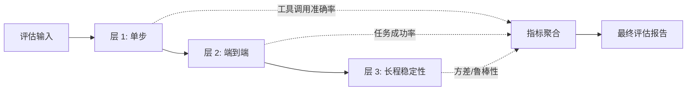
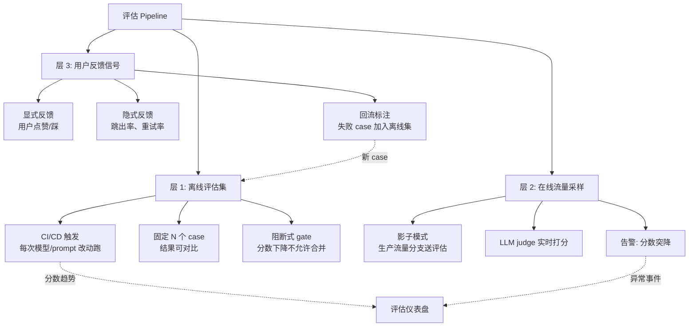

<section class="doc-hero">
  <p class="doc-hero__kicker">工程化</p>
  <h1>Agent 评估体系</h1>
  <p class="doc-hero__lead">主流 benchmark、自建评估集、评估方法论——为什么 Agent 评估比 LLM 评估难得多，以及怎么搭一个生产可用的评估流水线。</p>
  <div class="doc-hero__meta" aria-label="本文信息">
    <span>适合阶段：生产 Agent 必读</span>
    <span>核心：benchmark + 自建集 + 在线反馈三层</span>
    <span>面试重点：评估难点 + 指标体系 + 排坑</span>
  </div>
</section>

## 面试官想考什么

读完这篇你要能正面回答下面这些题。每题后面括号里是面试官真正想看你答出什么。

<div class="interview-grid">
  <div>
    <strong>为什么 Agent 评估比 LLM 评估难得多？</strong>
    <span>考能不能识别多轮交互、工具非确定、没有标准答案这些结构性差异。</span>
  </div>
  <div>
    <strong>SWE-bench 的设计为什么这么有区分度？</strong>
    <span>考对真实 benchmark 设计要素的理解——任务源、自动判分、防泄露。</span>
  </div>
  <div>
    <strong>怎么从零给一个客服 Agent 建评估集？</strong>
    <span>考能不能落地——case 采样、标注、维护、版本化。</span>
  </div>
  <div>
    <strong>线下评估 90% 通过，上线后用户反馈差，怎么 debug？</strong>
    <span>考评估集与真实分布偏离的诊断思路。</span>
  </div>
  <div>
    <strong>评估指标该看 Pass@1 还是 Pass@K？</strong>
    <span>考对 Agent 多次尝试的成本/收益辨析，不是机械套公式。</span>
  </div>
  <div>
    <strong>GAIA 和 SWE-bench 各自考察什么能力？什么场景该选哪个？</strong>
    <span>考主流 benchmark 的覆盖差异——通用助手 vs 编程修复。</span>
  </div>
  <div>
    <strong>LLM-as-judge 评估 Agent 输出有什么偏差？怎么校正？</strong>
    <span>考自动评估的边界，引出 judge 偏差专题。</span>
  </div>
  <div>
    <strong>评估成本失控怎么办？一次跑完 SWE-bench Verified 多少钱？</strong>
    <span>考工程现实——评估本身是高成本投入，要预算管理。</span>
  </div>
</div>

---

## 为什么 Agent 评估特别难

先看一个反例。假设你正在评估一个 LLM 摘要任务，标准做法是：

```python
# LLM 单步评估
prediction = llm.summarize(article)
score = rouge_l(prediction, gold_summary)  # 一个数字，跑完
```

输入定、输出定、有 reference。这套范式在 BLEU/ROUGE 时代就成熟了。

现在换成 Agent 评估：让 Agent 帮用户"修复这个 GitHub Issue"。会变成什么样？

```python
# Agent 评估
agent = SWEAgent(llm, tools=[bash, edit, search])
trajectory = agent.run("Fix issue #1234 in repo X")  # 平均 30 步、5 分钟、$2 成本
# trajectory 里包含 N 次工具调用、M 次思考、最终 patch
score = ???  # 这个 ??? 就是问题
```

要打这个分，至少有五个结构性难点把传统评估范式打穿了。

**1. 没有标准答案**。同一个 issue 可以有无数种合理修法——改 A 函数能修，改 B 函数也能修。即使用"测试是否通过"判分，也只能判一个 issue；换成"重构这段代码"就完全没有 gold patch。

**2. 多轮交互**。Agent 不是输入-输出函数，是一条轨迹。第 5 步走错路、第 12 步纠正回来——单看最终输出可能是对的，但中间花了 50K token、跑了 8 分钟。你的评估指标只看终态吗？

**3. 工具调用结果非确定**。Agent 调 `web_search("React 19 changelog")`，今天搜到的和明天搜到的不一样；调数据库查询，每次结果可能因为时间变了。**同样的 prompt、同样的模型，跑两次轨迹完全不同**——这让 benchmark 的可复现性成为永恒难题。

**4. 成本高昂**。一次 SWE-bench Verified（500 个任务）full run，按 Claude Sonnet 4 + 平均 30 步算，单次成本 $1500-3000，跑完要 6-12 小时。**评估本身就是大笔投入**——你不可能每改一个 prompt 就跑一次。

**5. 评估指标分散**。用户体验是"对不对 + 快不快 + 多少钱 + 用起来顺不顺"的综合。你看 Pass Rate，开发者看 token 消耗，PM 看延迟，财务看成本。**没有单一指标能代表 Agent 质量**——这和 LLM benchmark 那种"一个 MMLU 分数搞定"的世界完全不同。

把这五点摆一起看，就明白为什么 Agent 评估是工程化的核心难题。不是"换个数据集"的事，是评估方法论本身要重做。

---

## 评估的三个层次

Agent 评估必须分层做。一锅炖出来的结果什么也定位不了。

**层 1：单步能力（unit）**。这一步模型选对工具了吗？参数填对了吗？输出符合 schema 吗？这是最像传统 LLM 评估的层——输入定、输出定、能用规则或简单 judge 打分。代表 benchmark：BFCL（Berkeley Function Calling Leaderboard）、ToolBench。

**层 2：端到端任务（task）**。给一个完整任务（修 issue / 订机票 / 写报告），看最终是否完成。中间过程不直接打分，但用步数、成本作为辅助指标。代表 benchmark：SWE-bench、GAIA、τ-bench。

**层 3：长程稳定性（robustness）**。Agent 跑 100 次同一个任务，成功率方差多大？换个 prompt 措辞，性能掉多少？面对对抗性输入（用户故意捣乱、工具返回脏数据），还能完成吗？代表 benchmark：AgentBench、MMAU。



实际工程里这三层都要测，但优先级随阶段变化：
- 模型/Agent 刚开发：层 1 为主，调 prompt 时主要看单步
- 准备上线前：层 2 为主，看真实任务能不能完成
- 上线后稳定性优化：层 3 为主，看长尾失败

跳过任何一层都会被反噬。只测层 1 上线后会发现"每步都对但任务做不完"；只测层 2 不知道是哪一步出问题；只测层 3 没基线对比改进。

---

## 主流 benchmark 对比

下面这张表是这一节的"骨"。后面每个 benchmark 单独展开。

| Benchmark | 任务类型 | 数据量 | 评估方式 | 典型分数 | 主要价值 |
|---|---|---|---|---|---|
| **SWE-bench Verified** | 真实 GitHub Issue 修复 | 500 | 自动跑测试 | Claude Sonnet 4.5 ~77% / GPT-5 ~74% | 编程 Agent 标杆 |
| **GAIA** | 通用助手任务（多模态+工具） | 466 | 字符串精确匹配 | GPT-5 ~75% / 普通人 ~92% | 通用 Agent 助手 |
| **τ-bench (tau-bench)** | 双 Agent 模拟客服对话 | 200+ | 数据库状态 + 规则 | Sonnet 4 ~76% (retail) | 真实业务对话 |
| **AgentBench** | 8 类环境（OS/DB/KG/卡牌等） | 1000+ | 各任务自定义 | GPT-4o ~4.0/10 | 通用环境覆盖 |
| **BFCL v3** | function calling 单步 + 多步 | 4000+ | AST 比对 / 执行结果 | GPT-5 ~76% | function calling 专项 |
| **MMAU** | 多任务 Agent 理解 | 3000+ | 准确率 | GPT-4o ~55% | 跨领域综合 |
| **ToolBench** | 真实 API 工具调用 | 16000+ | 通过率 + 胜率 | ChatGPT ~70% | 工具使用规模化 |

注意分数都是大致区间——这些 benchmark 每个月都在被刷，具体数字看 leaderboard。但相对排序和考察重点比较稳定。

### SWE-bench / SWE-bench Verified

**任务长什么样**：从真实 Python 项目（django / sympy / sklearn 等）的 GitHub 历史里抓 issue + PR。Agent 拿到 repo 当前状态 + issue 描述，要产出 patch 让 PR 里那些测试用例通过。

**为什么有区分度**：
- **任务源是真实代码**——不是合成的 toy 题，而是开发者真的修过的 bug。Agent 要看懂业务代码、理解 codebase 结构、找到真正的根因
- **判分完全自动且无歧义**——跑测试就行，不需要 judge。Pass 就是 Pass，不存在"看起来对"
- **覆盖完整工程能力**：搜代码 + 读 issue + 改文件 + 跑测试 + 处理失败。任意一环弱就过不去

**Verified 子集的故事**：原始 SWE-bench 有 2294 个任务，但人工审查发现部分任务有问题（测试用例隐含修法、issue 描述不完整、环境难复现）。Princeton + OpenAI 团队人工筛出 500 个"明确可解"的任务作为 SWE-bench Verified。这个子集是当前编程 Agent 的事实标杆。

**怎么读它的分数**：注意区分 `Pass@1`（一次尝试）和 `Pass@K`（K 次中至少一次过）。还要看 trajectory 中位长度（步数）和成本——能用 10 步过的 Agent 比用 50 步过的便宜 5 倍。

[swebench.com](https://www.swebench.com/) 的 leaderboard 是当前最受关注的 Agent 排行榜，没有之一。

### GAIA

GAIA（General AI Assistant Benchmark，Mialon et al. 2023）的核心问题是：**通用 AI 助手能不能像一个聪明的实习生一样完成混合任务**。

任务样例（从论文翻译）：
> "在 2008 年发行、由 Yoko Ono 演唱的某张专辑里，第三首歌的时长是多少秒？"

要答出来，Agent 需要：搜索 → 定位专辑 → 找曲目列表 → 提取时长 → 转换单位。任何一环错都不会得分（最终判分是字符串精确匹配）。

**GAIA 的设计哲学**：
- 任务对人简单（普通人 92% 正确率）
- 对模型困难（GPT-4 + 浏览器原始 30% 左右，GPT-5 + 工具升到 75%）
- 三个难度级别（L1/L2/L3），L3 平均需要 20+ 步工具调用

**为什么和 SWE-bench 互补**：SWE-bench 测"编程能力"，GAIA 测"通用问题求解 + 多模态 + 工具协调"。一个 Agent 在 SWE-bench 高分不代表能在 GAIA 高分——前者吃代码理解，后者吃信息检索和综合。

### τ-bench (tau-bench)

Sierra AI 团队 2024 推出的 [τ-bench](https://github.com/sierra-research/tau-bench) 解决了一个长期被忽视的问题：**怎么评估"真实业务对话 Agent"**。

设计很巧妙——双 Agent 模拟：
- **User simulator**：另一个 LLM 扮演用户，按一个隐藏的"用户目标"（比如"退掉订单 12345 并重新下单"）和 Agent 对话
- **被评估 Agent**：拿到航空/零售业的工具（查订单、改订单、退款），目标是满足用户需求
- **判分**：对话结束后，看数据库最终状态是不是符合预期（订单是不是真退了，是不是真重下了）

为什么这个设计重要：
- **真实对话流不可预测**——用户可能改主意、说不清楚、提反复要求，Agent 要 robust
- **判分基于状态而非字符串**——你回复说"已退款"没用，数据库里订单状态得真的变
- **覆盖了 chatbot 上线最常翻车的场景**——多轮、上下文累积、工具调用错误恢复

τ-bench 的成绩有意思：GPT-4o 在 retail 子集只能拿到 50% 左右，远低于它在静态任务上的表现。**这暴露了"对话稳定性"是大部分模型的短板**——单轮对它来说不难，多轮就垮。

### AgentBench

[AgentBench](https://github.com/THUDM/AgentBench)（Liu et al. 2023）的特色是**环境多样**——8 类完全不同的环境塞在一起：

1. Operating System（让 Agent 操作 Linux shell）
2. Database（让 Agent 写 SQL 解题）
3. Knowledge Graph（让 Agent 查 Freebase）
4. Digital Card Game（让 Agent 玩 Aquawar 卡牌）
5. Lateral Thinking Puzzles（脑筋急转弯）
6. House-Holding（家务任务模拟）
7. Web Shopping（在线购物模拟）
8. Web Browsing（浏览器导航）

每类任务的成功标准都不同，最后聚合一个 0-10 分。

**它的价值在哪**：暴露了"通才 vs 专才"。一个在 OS 子集高分的模型可能在 KG 子集低分——AgentBench 让你看到模型的能力分布而不是一个综合数。**适合做"我们的 Agent 框架在哪类任务有短板"的诊断**。

短板：环境维护成本高，部分任务已经开始过拟合（开源模型反复在 AgentBench 上训练后分数虚高）。

### BFCL（Berkeley Function Calling Leaderboard）

[BFCL](https://gorilla.cs.berkeley.edu/leaderboard.html) 是 function calling 单点能力的事实标杆。它不测端到端任务，只测一件事：**给 Agent 一个工具列表 + 一个用户 query，Agent 能不能选对工具、填对参数**。

v3 版本覆盖：
- Simple（单工具单调用）
- Multiple（多工具中选一个）
- Parallel（同时调多个工具）
- Multi-turn（多轮对话中调用）
- Java/JavaScript 跨语言
- Hallucination detection（应该说"我不知道"的场景，看模型会不会硬调工具）

**判分方式**：AST 比对（解析模型生成的 function call，和 ground truth 比结构）+ 执行结果比对（真的跑一遍工具看输出对不对）。

为什么 function calling 要单独 benchmark：在端到端任务里，模型可能"歪打正着"——调错工具但还是猜对答案。BFCL 强行隔离这一步，看模型在"必须调对工具"场景下的真实能力。

### 其他值得关注的

- **MMAU**（Yin et al. 2024）：3000+ 题，覆盖 5 个领域（工具使用、DAG QA、数据科学、编程、数学）+ 5 种能力（理解、推理、规划、问题求解、自我纠错）。适合做 Agent 模型的能力雷达图。
- **ToolBench**（Qin et al. 2023）：16000+ 真实 RapidAPI 工具，让 Agent 在大规模 API 池里完成任务。规模上是最大的 tool use benchmark。
- **API-Bank**（Li et al. 2023）：73 个 API + 314 个任务，专注"评估 + 调用"两个阶段。它独有的一个维度是"什么时候不该调工具"。
- **WebArena**（Zhou et al. 2024）：真实网站环境（Reddit / GitLab / OpenStreetMap 复制版）让 Agent 浏览器操作。是浏览器 Agent 的标杆。

---

## 评估指标体系

只看一个数字（Pass Rate）会被欺骗。生产 Agent 的指标至少要看这六个维度。

### 成功率 (Success Rate)

最基础的指标——任务有没有完成。但要明确"完成"的定义：

```python
# 严格定义
def is_success(trajectory) -> bool:
    return trajectory.final_state == expected_state

# 宽松定义
def is_success(trajectory) -> bool:
    return llm_judge_says_acceptable(trajectory)
```

严格定义靠规则（测试通过 / 数据库状态匹配），适合有明确终态的任务（SWE-bench、τ-bench）。宽松定义用 LLM judge，适合开放任务（写报告、做研究），但要警惕 judge 偏差——详见 [LLM-as-judge](./llm-judge)。

### Pass@K

让 Agent 跑 K 次同一个任务，至少一次成功就算 Pass。

```
Pass@1 = 1 次中成功率
Pass@5 = 5 次中至少 1 次成功的比例
Pass@K = 1 - (1 - p)^K  （理论值，假设独立）
```

**Pass@1 vs Pass@K 的取舍**：
- Pass@1 反映"一次性可用"——用户视角，他们不会等你重跑
- Pass@K 反映"模型潜力"——研究视角，模型知道但有时输出错
- 生产场景几乎都用 Pass@1。Pass@K 适合论文 / 离线 ablation

注意 Pass@K 计算的统计陷阱：实际跑只能跑 N 次（N ≤ K），用无偏估计：

```python
def pass_at_k(n, c, k):
    """OpenAI HumanEval 论文里的无偏估计"""
    if n - c < k:
        return 1.0
    return 1.0 - np.prod(1.0 - k / np.arange(n - c + 1, n + 1))
```

### 步数效率 (Step Efficiency)

同样完成任务，用 10 步 vs 用 50 步差距巨大——后者成本是前者 5 倍、延迟也长得多。

```python
steps_p50 = median([len(t.steps) for t in successful_trajectories])
steps_p90 = percentile([len(t.steps) for t in successful_trajectories], 90)
```

**为什么看 P90 而不只是均值**：均值会被少数极端长的轨迹拉高，P90 更能反映"最坏体验"。

### 成本与延迟

```python
cost_p50 = median(input_tokens * price_in + output_tokens * price_out)
latency_p95 = percentile(wall_clock_seconds, 95)
```

成本看 P50（平均成本），延迟看 P95（最差用户体验）——这两个分位点的差别很关键。

### 鲁棒性 (Robustness)

同一任务跑 N 次，方差多大？

```python
runs = [agent.run(task) for _ in range(20)]
success_rate = sum(r.success for r in runs) / 20
std_dev = np.std([r.success for r in runs])  # 越低越稳
```

低鲁棒性的典型表现：模型 5 次中 3 次过、2 次不过——平均看 60% 但你不知道下次是哪种。鲁棒性差的 Agent 上线后会反复被用户抱怨。

### 工具调用质量

针对层 1 评估：

- **Tool Selection Accuracy**：选对工具的比例
- **Argument Accuracy**：参数填对的比例
- **Hallucination Rate**：不该调工具时硬调的比例
- **Invalid Call Rate**：违反 schema 的调用比例

详见 [function calling](../tools/function-calling) 和 [custom tools](../tools/custom-tools)。

---

## 自建评估集：生产场景的核心

公开 benchmark 永远不能完全代表你的业务。τ-bench 测的是 retail/airline，你做医疗客服没用；SWE-bench 是 Python，你做 Java 修复也没用。**生产 Agent 必须有自建评估集**。

### 怎么构造

四个来源，按价值排序：

**1. 真实生产流量**（最有价值）。从生产日志里采样真实用户 query。优势：分布完全真实；劣势：要做 PII 脱敏 + 隐私合规。

```python
def sample_for_evaluation(logs, n=200):
    """采样策略：分层 + 难度均衡"""
    sampled = []
    # 30% 高频 query（保证覆盖主要场景）
    sampled += stratified_sample(logs.high_freq, n=60)
    # 30% 长尾 query（暴露 corner case）
    sampled += stratified_sample(logs.low_freq, n=60)
    # 20% 失败 case（强化薄弱环节）
    sampled += stratified_sample(logs.user_complained, n=40)
    # 20% 边界 case（人工 curated 的难题）
    sampled += stratified_sample(logs.edge_cases, n=40)
    return sampled
```

**2. 历史失败 case**。从过去事故、用户投诉里抠出来的难题。这些就是你的 Agent 实际会翻车的地方——评估集里必须有。

**3. 人工构造对抗性 case**。让产品经理或测试同学故意写"刁难"的 query：模糊的、矛盾的、含恶意的、跨多个意图的。这是发现脆弱性的最快方式。

**4. 合成数据**。用更强的 LLM（比如 GPT-5 / Claude Opus）按种子模板生成 query。便宜，但质量比真实流量低一档——用作补充而不是主力。

### 怎么标注

每个 case 至少要有这些字段：

```python
@dataclass
class EvalCase:
    id: str
    input: str                          # 用户 query
    context: dict                       # 用户身份、session 历史等
    expected_outcome: str               # 期望结果（自然语言）
    expected_state: dict | None         # 期望终态（如有）
    success_criteria: list[str]         # 显式判分标准
    difficulty: str                     # easy / medium / hard
    category: str                       # 业务分类
    must_call_tools: list[str] | None   # 必须调用的工具（如有）
    must_not_call_tools: list[str]      # 不该调用的工具
    notes: str                          # 标注者的额外说明
```

**success_criteria 是关键**——写成可被 judge 验证的具体条件，不是"答案正确"这种空话：

```python
# ❌ 模糊
success_criteria = ["回答正确"]

# ✅ 具体
success_criteria = [
    "Agent 调用了 search_order 工具",
    "Agent 提到订单号 ORD-9876",
    "Agent 询问了取消原因或确认了取消意图",
    "Agent 没有泄露其他用户的订单信息",
]
```

### 怎么维护

评估集会衰减——业务变了、模型变了、用户行为变了。需要定期维护：

- **版本化**：评估集要打 tag（如 `eval-v2024.06`），所有跑过的结果绑定版本号，对比时只看同版本
- **季度更新**：每季度从最新生产流量补 10-20% 新 case，淘汰 5-10% 过时 case
- **泄漏防护**：模型训练数据不能见到评估集——评估集要私有保管，不要 commit 到公开仓库
- **难度均衡**：按难度分层，每层都要有足够 case，否则改 prompt 时分数变化全来自某一层

---

## 评估 pipeline 设计

生产 Agent 的评估不是一次性活动，是持续的流水线。三层结构：



三层各司其职：

- **离线评估集**：在固定数据集上保证不退化。每次 PR 必跑，分数下降阻断合并
- **在线流量采样**：在真实分布上发现新问题。检测离线评估集没覆盖的场景
- **用户反馈**：发现模型自信但用户不满意的隐性问题。回流标注后补充评估集

少了任何一层都不行。只有离线评估 = 过拟合到评估集；只有在线 = 没基线对比无法迭代；只有用户反馈 = 反馈太稀疏太慢。

---

## 实战：用 deepeval 搭一个评估流程

[deepeval](https://github.com/confident-ai/deepeval) 是一个轻量的 LLM/Agent 评估框架，类 pytest 风格。下面是一个完整可跑的客服 Agent 评估示例。

```python
"""客服 Agent 评估流程
依赖: pip install deepeval openai
"""
import json
from dataclasses import dataclass
from deepeval import evaluate
from deepeval.test_case import LLMTestCase
from deepeval.metrics import (
    GEval,                    # 自定义 LLM judge 指标
    ToolCorrectnessMetric,    # 工具调用准确率
    TaskCompletionMetric,     # 任务完成度
)
from your_agent import CustomerServiceAgent  # 你的 Agent

# 1. 加载评估集（从 JSON 文件，每行一个 case）
def load_eval_cases(path: str) -> list[dict]:
    with open(path) as f:
        return [json.loads(line) for line in f]

# 2. 跑 Agent，收集轨迹
def run_agent_on_case(agent, case: dict) -> dict:
    trajectory = agent.run(
        user_input=case["input"],
        context=case.get("context", {}),
    )
    return {
        "input": case["input"],
        "actual_output": trajectory.final_response,
        "expected_output": case["expected_outcome"],
        "tools_called": [s.tool for s in trajectory.steps],
        "expected_tools": case.get("must_call_tools", []),
        "trajectory": trajectory,
        "tokens": trajectory.total_tokens,
        "latency_ms": trajectory.duration_ms,
    }

# 3. 定义指标
correctness_metric = GEval(
    name="Correctness",
    criteria=(
        "判断 Agent 回复是否准确解决了用户问题。"
        "要求：(1) 信息正确 (2) 没有泄露其他用户数据 (3) 语气符合客服规范"
    ),
    evaluation_params=["input", "actual_output", "expected_output"],
    threshold=0.7,
)

tool_metric = ToolCorrectnessMetric(threshold=0.8)
task_metric = TaskCompletionMetric(threshold=0.7)

# 4. 主流程
def main():
    cases = load_eval_cases("eval/customer_service_v2024_06.jsonl")
    agent = CustomerServiceAgent()
    test_cases = []
    total_cost = 0.0
    total_latency = 0
    for case in cases:
        result = run_agent_on_case(agent, case)
        total_cost += result["tokens"] * 0.000003  # 示意价格
        total_latency += result["latency_ms"]
        test_cases.append(LLMTestCase(
            input=result["input"],
            actual_output=result["actual_output"],
            expected_output=result["expected_output"],
            tools_called=result["tools_called"],
            expected_tools=result["expected_tools"],
        ))
    # 5. 运行评估，聚合指标
    eval_result = evaluate(
        test_cases=test_cases,
        metrics=[correctness_metric, tool_metric, task_metric],
    )
    # 6. 输出汇总：质量 + 成本 + 延迟一起看
    print(f"Total cases: {len(cases)}")
    print(f"Correctness Pass@1: {eval_result.correctness_pass_rate:.1%}")
    print(f"Tool accuracy: {eval_result.tool_pass_rate:.1%}")
    print(f"Task completion: {eval_result.task_pass_rate:.1%}")
    print(f"Avg cost per case: ${total_cost / len(cases):.4f}")
    print(f"Avg latency: {total_latency / len(cases):.0f}ms")

if __name__ == "__main__":
    main()
```

几个生产化要点：

- **质量 + 成本 + 延迟三个维度一起报**——只看准确率不看成本，调出来的 prompt 可能是天价的
- **GEval 的 criteria 必须具体**——"判断回复是否好"完全没用，要列出具体可验证的子条件
- **threshold 是业务决策**——0.7 还是 0.9 不是技术问题，是业务能容忍的门槛
- **eval 跑完结果要持久化**——CI 里要对比"这次 PR vs 主干"的分数差，分数倒退就阻断

替代方案：[promptfoo](https://github.com/promptfoo/promptfoo)（YAML 配置 + CLI 友好）、[LangSmith](https://www.langchain.com/langsmith)（深度集成 LangChain 生态）、[Braintrust](https://www.braintrust.dev/)（仪表盘强）。选型主要看你是否已经在某个生态里。

---

## 容易踩的坑

### 陷阱 1：评估集污染（benchmark contamination）

公开 benchmark 长期跑下去几乎一定会被模型训练数据见过。GPT-4 早期在 HumanEval 上被发现做过类似题；SWE-bench 的部分 issue 也在 GitHub 公开，可能进了训练集。

**现象**：模型在公开 benchmark 上分数很高，但你换一个相似但未见过的私有任务，分数掉一半。

**根因**：模型见过原题或类似分布，分数虚高。

**修法**：(1) 关键评估用私有集，不公开；(2) 定期出新版本（SWE-bench Verified 之后又有 SWE-bench Multimodal、SWE-bench Live）；(3) 看 benchmark 时关注"数据截止日期 vs 模型训练截止日期"的差。

### 陷阱 2：LLM judge 偏差

用 LLM 来评估 LLM 输出方便但有偏差：

- **位置偏差**：把答案 A 放前面 vs B 放前面，judge 倾向选靠前的
- **冗长偏差**：judge 倾向打高分给长答案，即使长答案是废话
- **同模型偏差**：用 GPT-4 评 GPT-4 的输出，分数比评 Claude 高
- **格式偏差**：带 bullet 的答案分数高于纯文本，即使内容一样

**修法**：(1) 用更强的 judge 模型（GPT-5 judge Sonnet 4）；(2) swap 位置跑两遍取平均；(3) 关键指标用规则而不是 judge；(4) 用多 judge 投票。详见 [LLM-as-judge](./llm-judge)。

### 陷阱 3：评估集与真实分布偏离

线下评估 90% 通过，上线后用户反馈差——典型症状是评估集和真实流量分布不一致。

**现象**：评估集主要是"清晰明确的问题"，但用户实际问题大多是"模糊+多轮+夹带情绪"的。

**根因**：标注同学按"标准问题"构造，真实用户不按标准说话。

**修法**：(1) 大部分 case 直接采样自生产流量；(2) 监控线上分布和评估集分布的 KL 散度，偏离超阈值就重建评估集；(3) 加入"对抗性 case"——故意模糊、故意改主意的多轮场景。

### 陷阱 4：只看单一指标

只看 Pass Rate 调出的 Agent，可能 token 消耗失控；只看 token 调出的 Agent，可能任务做不完。

**现象**：换个 prompt，Pass Rate 升 3%，但平均成本翻倍；老板看着 Pass Rate 满意，财务报表炸了。

**根因**：把多目标问题简化成单目标。

**修法**：建立"组合指标"——例如 `质量分数 / log(成本)` 或 `Pass@1 / steps_p50`。每次 PR 不光看绝对值，看这个组合的趋势。

### 陷阱 5：忽略成本

跑一次 SWE-bench Verified 用 Claude Sonnet 4 + 平均 30 步，单 run 成本 $1500-3000。一周内迭代 prompt 5 次，预算 $10K-15K 没了。

**修法**：(1) 大评估集分层——快速迭代用 50 个核心 case 子集，正式发布前才跑全量；(2) 用便宜模型做"smoke test"先过一遍，分数太低不投正式 run；(3) cache 评估轨迹——同样的 (model, prompt) 不重复跑。

### 陷阱 6：忽略可复现性

工具调用涉及外部服务（搜索结果变化、API 限流、时间相关数据），同样的 prompt 跑两次结果可能完全不同。

**修法**：(1) 工具层加 mock / 录制回放（vcrpy 这类库）；(2) 关键评估固定随机种子、固定时间戳；(3) 报告分数时一定附带"跑了几次取平均 + 方差"。

---

## 评估 vs Observability 的关系

评估和 [可观测性](./observability) 是互为输入输出的双胞胎。

| 维度 | 评估 (Evaluation) | 可观测性 (Observability) |
|---|---|---|
| **场景** | 离线 / 上线前 | 在线 / 上线后 |
| **样本** | 固定数据集 | 真实流量 |
| **目的** | 决定能不能上 | 发现已上线的问题 |
| **指标** | 准确率、Pass@K | 错误率、延迟、成本 |
| **触发** | CI / 手动 | 持续 |

它们的协作链路是：

```
评估集 → 发现问题 → 修改 → 评估通过 → 上线
                                          ↓
observability 监控 → 发现新问题 → 抽样标注 → 回流评估集
```

任何一边断了都会出事。只有评估没 observability：上线后看不见问题。只有 observability 没评估：发现问题但改了之后不知道有没有改回退。

---

## 评估 vs 相邻概念

| 概念 | 关注点 | 范围 |
|---|---|---|
| **评估 (Evaluation)** | 整体能力测量 | 本文 |
| **[LLM-as-judge](./llm-judge)** | 用 LLM 做评估的方法论 | 评估的一种实现 |
| **[Observability](./observability)** | 线上监控 | 评估的运行时镜像 |
| **[Reflexion](../agent/reflexion)** | Agent 自评 + 学习 | Agent 内部，单次任务级 |
| **A/B Test** | 上线后对比两个版本 | 评估的生产形态 |
| **Red Teaming** | 对抗性测试 | 评估的安全子集 |

辨析要点：
- 评估关心**整体质量**，observability 关心**运行时异常**——前者要结论，后者要 trace
- 评估是**人定义的测试**，Reflexion 是**Agent 自己的反思**——前者外部视角，后者内部视角
- 评估是 **A/B Test 的离线版本**——上线前用评估、上线后用 A/B

---

## 面试题深度解析

### Q: 为什么 Agent 评估比 LLM 评估难得多？

**30 秒版本**：五个结构性差异叠加。**(1) 没有标准答案**——同一任务多种合理解法，连 reference 都不一定有；**(2) 多轮交互**——评估对象是一条轨迹而不是单点输入输出，要看终态还是看过程是个设计问题；**(3) 工具调用非确定**——同样 prompt 同样模型跑两次可能完全不同，可复现性差；**(4) 成本高**——一次 full run 几千刀几小时，不能像 LLM benchmark 那样随便跑；**(5) 指标多维**——准确率、步数、成本、延迟、鲁棒性五个轴，没有单一数能代表。这五个里任意一个对评估范式都是颠覆性的，叠加起来意味着传统的 BLEU/ROUGE/MMLU 那套方法论完全失效。

**追问**：那 LLM benchmark 的分数对 Agent 完全没参考价值吗？
有参考但要重新校准。比如 MMLU 高的模型确实在 Agent 推理任务上倾向更强，但相关性远低于你想象——Claude 3.5 Sonnet 的 MMLU 比某些前沿模型低，但 SWE-bench 显著领先。**底层语言能力是必要不充分条件**。专项 benchmark（BFCL 的 function calling 准确率、HumanEval 的代码能力）相关性会更高，因为更接近 Agent 单步能力。但端到端的 Agent 任务还是要直接测——任何 LLM 指标都不能替代。

**追问**：你怎么向非技术 stakeholder 解释为什么评估这么贵？
类比"自动驾驶的路测"。LLM 评估像在固定路段试驾——线路定、距离定，跑完看时间。Agent 评估像测自动驾驶——要在各种天气、各种路况、各种司机干扰下跑几千公里。每次"路测"成本高、耗时长，但少了它就不知道车能不能上路。具体到数字：跑一次 SWE-bench Verified 大约 $2000、6 小时；要做 prompt 迭代实验，一周内可能跑 5 次。这就是为什么评估预算往往占 Agent 项目总开销的 20-30%——和"开发"差不多。

### Q: 怎么从零给一个客服 Agent 建评估集？

**30 秒版本**：四步走。**第一步采样**——从生产日志按"高频 30% + 长尾 30% + 失败 case 20% + 人工 curated 边界 20%"分层采样，目标 200 个 case 起步；**第二步脱敏**——PII 替换为占位（"用户 A"、"订单 X-001"），跨数据合规边界的内容直接剔除；**第三步标注**——每个 case 写明 `input + context + expected_outcome + success_criteria + must_call_tools + difficulty`，关键是 success_criteria 要具体可验证（"调用了 search_order 工具" 而不是"答得对"）；**第四步建立维护机制**——版本化、季度更新 10-20%、监控线上分布偏离、回流失败 case。整个过程 2-3 周首版完成，之后持续迭代。

**追问**：200 个 case 够吗？少了显得没说服力，多了又跑不起。
看场景。如果 Agent 业务范围窄（比如只处理订单类客服），200 case 能覆盖主要场景；范围宽（综合客服 + 售后 + 投诉），需要 500+。判断够不够的方法：分层抽样后看每层 case 数 ≥ 20。太少的层换 prompt 时分数变化会被噪音淹没，看不出真实差异。统计上经验值是单层至少 30——能让 95% 置信区间宽度在 ±15% 以内，可以分辨"明显改进"和"在噪音里"。

**追问**：标注要不要让真实客服参与？
强烈建议。客服同事知道"用户实际怎么说话"——他们标注的 case 比工程师写的真实度高一档。但要注意两点：(1) 客服不熟悉技术指标，要把 success_criteria 转译成业务语言（"是否解决了用户问题" 而不是 "是否调用了正确工具"）；(2) 一致性要 calibrate——同样 case 让 3 个客服独立标注，一致性 > 80% 才上正式集。Cohen's kappa 算下来 < 0.6 说明标注定义不清晰，要回去改 rubric。

### Q: 线下评估 90% 通过，上线后用户反馈差，怎么 debug？

**30 秒版本**：90% pass 的离线 + 差反馈的线上，最常见是**评估集与真实分布偏离**。三步诊断：**第一步抓真实差评 trace**——从用户投诉里挑 20 个最严重的，看 trajectory 哪里翻车；**第二步算分布距离**——把评估集的 query 和真实差评 query 做 embedding，看聚类。如果差评聚成评估集没覆盖的几个簇，问题确认；**第三步看薄弱维度**——评估集如果只测"清晰单意图问题"，真实用户大多是"模糊 + 多轮 + 改主意"的，离线分数虚高。**修法是把生产差评回流成新评估 case，重新跑评估，看分数是不是真的从 90% 掉到 60%**——如果是，离线评估集就要扩展；如果还是 90%，说明判分标准本身和用户感知不一致，要 revisit success_criteria。

**追问**：怎么避免这种情况再发生？
建立"线上-线下一致性监控"。每周抽样 100 个线上 case，让 LLM judge 打分；同时跑评估集，让同样的 judge 打分。两个分数应该接近——偏差 > 10% 就告警。这能在用户大规模抱怨前发现问题。Anthropic 在 Claude Code 的工程实践里有类似机制——他们叫 "online-offline drift detection"，本质就是这个。

**追问**：那 LLM judge 自己会不会就是偏差源？
完全可能。所以要做"judge 校准"——定期人工标注一批 case，看 judge 和人的一致性。如果 judge 一致性高（>85%）那它的偏差稳定可信；如果一致性低，judge 本身不能信，要换 judge 模型或改 prompt。最稳的做法是关键指标用规则（"是否调用了某工具"、"输出是否包含 PII"），LLM judge 只用于"语气合规"、"回答相关性"这类难以规则化的维度。

### Q: 评估指标该看 Pass@1 还是 Pass@K？

**30 秒版本**：**生产场景几乎都看 Pass@1**——用户不会等你重跑。Pass@K 主要用于研究和离线分析：理解模型"知道但有时表达错"的潜力上限、做 ablation 时拉开信号、对比"模型能力"和"采样策略"的贡献。具体取舍：(1) 给用户的 SLA → Pass@1；(2) 论文里展示模型上限 → Pass@K（K=5 或 10）；(3) 调 sampling 温度做 trade-off → 两者都看，温度 0 看 Pass@1，温度 0.7 看 Pass@K；(4) 任务允许重试的特殊场景（比如背后有 verifier 能判断成功失败）→ Pass@K 有实际意义。**别只看其中一个**——Pass@1 高 Pass@K 也高说明模型稳定；Pass@1 低 Pass@K 高说明模型有能力但不稳，需要 self-consistency 这类技术兜底；两个都低说明能力不够，加采样救不了。

**追问**：那 Pass@K 怎么用更合适？K 选多少？
Pass@K 的核心用途是"理解模型能力上限"。K 通常选 5 或 10——再大边际收益递减且成本翻倍。具体场景：(1) 决定要不要上 self-consistency——Pass@5 - Pass@1 差距大说明加多次采样投票收益大；(2) 评估 reranker / verifier 价值——如果有一个 verifier 能判断成功失败，Pass@K 就是这个 verifier 配合 K 次采样后的真实表现；(3) 模型选型对比——同等成本下，模型 A 的 Pass@1 高，模型 B 的 Pass@5 高，看你愿不愿意付 5x 成本换更高上限。OpenAI 的 HumanEval 论文里 Pass@K 的无偏估计公式被广泛用，注意要用无偏估计而不是简单平均，否则在 N 较小时方差很大。

**追问**：Agent 多轮场景下，"重试"指什么？整条轨迹重跑还是某一步重试？
两个都有意义但意义不同。**整条轨迹重跑** = 看模型在随机性下的整体稳定性（不同思维路径，最终是否都能到达正确答案）。**单步重试** = 看在错误恢复机制下的表现（比如工具失败后重试、模型自我纠错后再来一次）。生产里通常关心后者——前者更像研究指标。具体怎么测：单步重试要在 Agent 框架里支持"observation 反馈后允许重新规划"，然后看引入重试机制前后 Pass@1 的变化。Anthropic 的 Computer Use 报告里展示过这个曲线——加上 self-correction 后 Pass@1 提升约 8-12%，但 token 消耗增 30-40%。**这就是 evaluation 的核心价值——量化 trade-off**。

---

## 延伸阅读

- **论文：SWE-bench: Can Language Models Resolve Real-World GitHub Issues?** ([arxiv 2310.06770](https://arxiv.org/abs/2310.06770))
  Jimenez et al. 2023, Princeton。SWE-bench 原始论文。读它看清楚 benchmark 是怎么从真实 PR 历史里挖出来的、为什么用"运行测试"作为判分。Section 4 的难度分析特别值得看——为什么很多任务对模型困难。

- **论文：GAIA: a benchmark for General AI Assistants** ([arxiv 2311.12983](https://arxiv.org/abs/2311.12983))
  Mialon et al. 2023, Meta + HuggingFace。GAIA 论文。读它了解"任务对人简单对模型难"这个反直觉现象——以及怎么设计这种区分度的题。

- **论文：τ-bench: A Benchmark for Tool-Agent-User Interaction in Real-World Domains** ([arxiv 2406.12045](https://arxiv.org/abs/2406.12045))
  Yao et al. 2024, Sierra AI。τ-bench 论文。重点读 Section 3 的"用户模拟器"设计——这是真实业务 Agent 评估的范式革新。

- **论文：AgentBench: Evaluating LLMs as Agents** ([arxiv 2308.03688](https://arxiv.org/abs/2308.03688))
  Liu et al. 2023, THU + 上海交大。AgentBench 论文。读它的失败模式分析——8 类环境下模型在哪类任务掉链子，对你的 Agent 设计有直接启发。

- **博客：Anthropic — Engineering of SWE-bench Verified** ([anthropic.com/research/swe-bench-sonnet](https://www.anthropic.com/research/swe-bench-sonnet))
  Anthropic 团队详细讲他们怎么调 Claude 在 SWE-bench 上的表现，工程细节满满——包括 prompt 设计、错误恢复、prompt caching 怎么省钱。

- **博客：OpenAI — Introducing SWE-bench Verified** ([openai.com/index/introducing-swe-bench-verified](https://openai.com/index/introducing-swe-bench-verified))
  Verified 子集的设计过程。读它了解为什么人工清洗对 benchmark 质量至关重要。

- **博客：Hamel Husain — Your AI product needs evals** ([hamel.dev/blog/posts/evals](https://hamel.dev/blog/posts/evals/))
  来自 ML 实战派的评估方法论。中心论点："你的 AI 产品需要 evals" 听起来废话但他讲得很细——什么时候建评估集、怎么标注、怎么和业务对齐。生产视角必读。

- **博客：Eugene Yan — Patterns for Building LLM Systems & Products** ([eugeneyan.com/writing/llm-patterns](https://eugeneyan.com/writing/llm-patterns/))
  其中"Evals"一节系统总结了 LLM 评估的范式。读它建立心智地图。

- **GitHub：deepeval** ([github.com/confident-ai/deepeval](https://github.com/confident-ai/deepeval))
  开源评估框架，pytest 风格。读 README 和 examples 能快速上手。

- **GitHub：promptfoo** ([github.com/promptfoo/promptfoo](https://github.com/promptfoo/promptfoo))
  YAML + CLI 风格的评估工具。和 deepeval 互补——前者代码化，后者声明式。

- **配套阅读**：[LLM-as-judge](./llm-judge)——评估的关键实现方法；[可观测性](./observability)——评估的运行时镜像；[Reflexion](../agent/reflexion)——Agent 自评；[Prompt 模板](../prompt/templates)——评估 prompt 的设计；[Custom Tools](../tools/custom-tools)——工具评估的前置知识；[Coding Agent](../vertical/coding-agent)——SWE-bench 类评估的落地场景。
