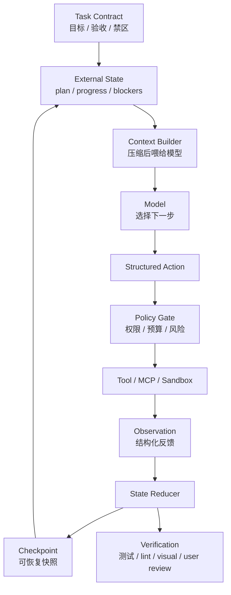

<section class="doc-hero">
  <p class="doc-hero__kicker">Agent 工程化</p>
  <h1>Agent Harness 设计：让模型稳定做长任务的运行环境</h1>
  <p class="doc-hero__lead">模型负责判断下一步，harness 负责让任务可观察、可验证、可恢复。</p>
  <div class="doc-hero__meta" aria-label="本文信息">
    <span>适合阶段：生产 Agent / 长周期任务</span>
    <span>核心机制：Task State + Tool Loop + Checkpoint</span>
    <span>面试重点：Harness vs Prompt vs Workflow</span>
  </div>
</section>

> Harness 不是更长的 prompt，而是包住 Agent 的执行系统。

> **本文边界**：本文讲 Agent harness 的通用设计。Agent loop 的最小状态机见 [Agent 运行循环](../agent/agent-loop)，工具权限见 [工具沙箱与权限](../tools/sandbox)，观测链路见 [可观测性](./observability)，OpenAI / Anthropic 的工程文章导读见 [Harness 工程](../industry/openai/harness-engineering) 和 [长周期 Agent Harness](../industry/anthropic/effective-harnesses-for-long-running-agents)。

## 面试官想考什么

<div class="interview-grid">
  <div>
    <strong>Harness 和 prompt、workflow、agent loop 分别差在哪？</strong>
    <span>考你能不能把执行环境和模型指令分开。</span>
  </div>
  <div>
    <strong>为什么长周期 Agent 不能只靠长上下文或自动压缩？</strong>
    <span>考状态外置、检查点和恢复策略。</span>
  </div>
  <div>
    <strong>一个 coding agent harness 至少要提供哪些能力？</strong>
    <span>考文件、命令、测试、日志、diff、权限、回滚。</span>
  </div>
  <div>
    <strong>Harness 怎么防止目标漂移？</strong>
    <span>考任务契约、验收标准、阶段性检查和用户确认。</span>
  </div>
  <div>
    <strong>工具返回大段日志时，harness 应该怎么处理？</strong>
    <span>考 observation 设计和上下文污染控制。</span>
  </div>
  <div>
    <strong>Harness、MCP、Skill、Sandbox 这些层怎么配合？</strong>
    <span>考平台级分层能力。</span>
  </div>
  <div>
    <strong>怎么评估一个 harness 是否比另一个更好？</strong>
    <span>考除了模型分数以外的环境变量控制。</span>
  </div>
</div>

---

## 为什么需要 Harness

让 Agent "做一个设置页"和让 Agent "连续几小时开发一个完整应用"不是同一类任务。

短任务里，prompt 可能够用：

```text
请修改 settings 页面，加一个通知开关，跑测试。
```

长任务里，这种写法会逐渐失控。模型改了哪些文件、哪些测试已经跑过、当前卡在哪、用户确认过什么、哪些设计不能动，这些事实如果只藏在聊天历史里，压缩一次就可能丢，换 session 就更危险。

坏的长任务 prompt 往往长这样：

```text
你要从头构建一个 SaaS dashboard。
请保持设计一致，注意响应式，写测试，保证质量。
如果遇到问题自己解决。
```

这不是任务输入，而是愿望清单。模型可能一开始很积极，后面开始漂移：加了不需要的页面，跳过测试，把报错解释成"已完成"，或者在上下文变长后忘了最早的验收标准。

Harness 要解决的是：**把长任务拆成可执行、可观察、可恢复的工程回路**。Anthropic 在 long-running agents 文章里把问题说得很直接：Agent 跨多个 context window 工作时，持续稳定推进仍然是开放问题。OpenAI 的 Codex App Server 文章也展示了同一件事：真正的 Agent 产品不是一次 HTTP 请求，而是一套能承载流式状态、工具调用、用户输入、取消和恢复的协议。

## Harness 是怎么工作的

Harness 包住模型，控制它能看到什么、能做什么、怎么记录、怎么恢复。



这个图里，模型只是其中一层。Harness 真正控制的是：

- 任务如何被表达成 contract。
- 当前进度如何存在外部 state。
- 工具结果如何压缩成 observation。
- 哪些动作要权限确认。
- 什么时候 checkpoint。
- 怎么验证任务是否真的完成。
- 出错后从哪里恢复。

## 核心原理 / 关键设计

### 1. Task contract 要比用户 prompt 更硬

用户原话通常含糊，harness 要把它转成任务契约。

```json
{
  "goal": "实现设置页通知开关",
  "success_criteria": [
    "用户可以打开和关闭邮件通知",
    "刷新页面后状态保留",
    "移动端布局不溢出",
    "相关测试通过"
  ],
  "must_not": [
    "修改账单页面",
    "引入新的 UI 框架",
    "绕过现有权限检查"
  ]
}
```

这一步不是形式主义。没有 success criteria，模型很容易把"写了代码"当成"完成任务"。没有 must_not，模型可能为了完成当前目标破坏已有边界。

### 2. State 要外置，不能只存在 messages

长任务至少要保存这些字段：

```json
{
  "plan": ["定位设置页", "实现开关", "持久化状态", "补测试"],
  "completed": ["定位设置页"],
  "current_step": "实现开关",
  "blockers": [],
  "touched_files": ["app/settings/page.tsx"],
  "verified": {"tests": false, "visual": false},
  "user_decisions": ["沿用现有 Toggle 组件"]
}
```

聊天历史可以被压缩，state 不应该被随意压缩。state 是恢复的依据，也是下一轮 context builder 的输入。

### 3. Observation 要短、准、可行动

工具返回不应该直接把 2000 行日志塞给模型。

```json
{
  "tool": "npm test",
  "ok": false,
  "summary": "2 tests failed in settings notification suite",
  "next_hint": "Read tests/settings-notifications.test.ts lines 41-66",
  "artifact": "logs/test-2026-06-03.txt"
}
```

完整日志可以存 artifact，模型上下文里只放判断下一步需要的信息。这个设计能减少上下文污染，也能让失败恢复更稳定。

### 4. Checkpoint 要按风险触发

不是每一步都要 checkpoint，但这些点必须存：

```text
- 任务 contract 生成后
- 大批量文件修改前
- 用户确认设计方案后
- 测试从失败变成通过后
- 高风险工具调用前后
- session 压缩或切换前
```

checkpoint 不是只存聊天摘要。至少要包含 state、关键 artifacts、工具 trace、代码 diff、用户决策和验证结果。

### 5. Harness 要把验证变成默认动作

模型说"完成了"不算完成。harness 要有独立验证路径。

```text
代码任务：unit tests + typecheck + lint + diff review
前端任务：screenshot + responsive check + console error check
数据任务：row count + schema check + sample validation
客服任务：policy check + no PII leak + escalation rule
```

验证最好由代码、测试或另一个 judge 完成，不要只让同一个模型自评。

## 怎么用：标准库写一个最小长任务 Harness

这段代码演示 harness 的关键结构：外部 state、工具 observation、checkpoint、验证。它没有接真实 LLM，用固定 planner 代替模型，方便你看清 harness 本身做什么。

```python
from dataclasses import dataclass, asdict, field
from pathlib import Path
import json
import tempfile


@dataclass
class TaskState:
    goal: str
    plan: list[str]
    completed: list[str] = field(default_factory=list)
    current_step: str | None = None
    blockers: list[str] = field(default_factory=list)
    verified: bool = False
    trace: list[dict] = field(default_factory=list)


class Harness:
    def __init__(self, workdir: Path, state: TaskState) -> None:
        self.workdir = workdir
        self.state = state

    def checkpoint(self, name: str) -> None:
        path = self.workdir / f"{name}.json"
        path.write_text(json.dumps(asdict(self.state), ensure_ascii=False, indent=2))

    def next_action(self) -> str:
        for step in self.state.plan:
            if step not in self.state.completed:
                self.state.current_step = step
                return step
        return "verify"

    def run_tool(self, action: str) -> dict:
        if action == "edit settings page":
            (self.workdir / "settings.txt").write_text("notification_toggle=true")
            return {"ok": True, "summary": "settings page updated"}
        if action == "add persistence":
            (self.workdir / "storage.txt").write_text("save notification_toggle")
            return {"ok": True, "summary": "persistence added"}
        if action == "write tests":
            (self.workdir / "tests.txt").write_text("test notification toggle")
            return {"ok": True, "summary": "tests written"}
        if action == "verify":
            expected = ["settings.txt", "storage.txt", "tests.txt"]
            missing = [p for p in expected if not (self.workdir / p).exists()]
            return {"ok": not missing, "summary": f"missing={missing}"}
        return {"ok": False, "summary": f"unknown action: {action}"}

    def apply_observation(self, action: str, obs: dict) -> None:
        self.state.trace.append({"action": action, "observation": obs})
        if obs["ok"] and action != "verify":
            self.state.completed.append(action)
        elif action == "verify":
            self.state.verified = obs["ok"]
        else:
            self.state.blockers.append(obs["summary"])

    def run(self) -> TaskState:
        self.checkpoint("start")
        while not self.state.verified and not self.state.blockers:
            action = self.next_action()
            obs = self.run_tool(action)
            self.apply_observation(action, obs)
            self.checkpoint(f"after-{len(self.state.trace)}")
            if action == "verify":
                break
        return self.state


with tempfile.TemporaryDirectory() as tmp:
    state = TaskState(
        goal="Implement notification toggle",
        plan=["edit settings page", "add persistence", "write tests"],
    )
    final = Harness(Path(tmp), state).run()
    print(json.dumps(asdict(final), ensure_ascii=False, indent=2))
```

真实 harness 会把 `next_action()` 换成模型调用，把 `run_tool()` 接到 MCP、沙箱、浏览器、测试系统。但外部 state、observation reducer、checkpoint 和 verify 这些结构不会消失。

## 容易踩的坑

### 坑 1：把 harness 写成超长 prompt

- **现象**：system prompt 里写满"你要记录进度、你要跑测试、你要不要忘记目标"。
- **根因**：把环境责任推给模型。
- **修法**：进度、测试、权限、checkpoint 都放代码里。prompt 只告诉模型当前可见状态和可选动作。

### 坑 2：state 只保存自然语言摘要

- **现象**：恢复 session 后，模型知道"之前做了一些设置页修改"，但不知道哪些文件、哪些测试、哪些决策。
- **根因**：摘要不是状态。
- **修法**：结构化保存 plan、completed、touched_files、verified、decisions、blockers。摘要只能作为人类可读补充。

### 坑 3：工具输出未经整理直接进上下文

- **现象**：一次测试失败把几千行日志塞进 messages，后续推理越来越乱。
- **根因**：harness 没有 observation 层。
- **修法**：工具结果先变成短 observation，完整日志存 artifact。模型需要细节时再按文件读取。

### 坑 4：checkpoint 只在失败后想起来

- **现象**：Agent 改了 20 个文件后走偏，只能人工手动回滚。
- **根因**：没有在高风险节点存快照。
- **修法**：修改前、用户确认后、测试通过后、压缩前自动 checkpoint。把恢复设计成主路径。

### 坑 5：verification 依赖同一个模型自评

- **现象**：模型说"测试应该能过"，实际上没跑。
- **根因**：完成判定没有外部证据。
- **修法**：harness 强制跑测试、类型检查、截图、schema 校验或 LLM judge。最终输出里列出证据。

### 坑 6：harness 和 sandbox 混在一起

- **现象**：为了控制风险，harness 里到处写命令黑名单，正常任务也跑不动。
- **根因**：把执行编排和隔离边界混成一层。
- **修法**：harness 决定"该做什么和如何恢复"，sandbox 决定"动作能影响哪里"。两层交互，但职责分开。

## 与相邻概念的区别

| 概念 | 解决的问题 | 主要形态 | 不该承担什么 |
|---|---|---|---|
| Prompt | 告诉模型当前任务和规则 | 文本指令 | 不负责持久状态和权限 |
| Agent Loop | 单次循环如何行动 | state/action/observation | 不一定覆盖部署和恢复 |
| Workflow | 固定流程编排 | 代码路径 / DAG | 不适合开放探索 |
| Harness | Agent 的运行环境 | 状态、工具、权限、验证、恢复 | 不替代模型能力 |
| Sandbox | 限制动作影响范围 | 文件/网络/进程隔离 | 不负责规划和任务拆解 |
| MCP | 标准化工具接入 | JSON-RPC 工具协议 | 不负责整个 Agent runtime |
| Skill | 可加载任务经验 | Markdown + supporting files | 不提供强安全边界 |

面试里可以这样讲：Agent loop 是发动机的循环，harness 是整辆车的底盘、仪表、刹车和维修手册；sandbox 是护栏；MCP 是外接设备接口；Skill 是驾驶经验卡片。

## 面试题深度解析

### Q: Harness 和 prompt 的区别？

- **30 秒版本**：prompt 是模型看到的指令，harness 是模型外面的执行环境。harness 管状态、工具、权限、验证、checkpoint 和恢复。
- **追问：为什么不能都写进 prompt？** 因为 prompt 没有强制力。模型可能忘、误解、被压缩丢失，也不能可靠执行权限和恢复。
- **追问：prompt 在 harness 里还有价值吗？** 有。prompt 是 context builder 的输出之一，但它应该由外部 state 生成，而不是手写一大段永远不变的愿望清单。

### Q: 长周期 Agent 为什么不能只靠长上下文？

- **30 秒版本**：长上下文只是能放更多 token，不保证模型稳定利用，也不提供恢复、验证和权限。长任务需要外部状态和 checkpoint。
- **追问：自动压缩够不够？** 不够。压缩适合减少历史 token，但容易丢结构化事实。关键进度和用户决策要存在 state 里。
- **追问：什么信息必须外置？** 验收标准、计划、完成项、阻塞点、用户确认、触碰文件、工具 trace、测试结果、checkpoint artifact。

### Q: 一个 coding harness 至少要有什么？

- **30 秒版本**：文件读写、命令执行、测试运行、diff 管理、日志摘要、权限策略、checkpoint、恢复、最终验证。
- **追问：哪些是 Claude Code / Codex 这类产品的关键能力？** 长驻任务状态、工具 trace、沙箱、权限提示、MCP/外部工具、自动压缩、session resume。
- **追问：前端任务还要什么？** 浏览器预览、截图、控制台错误、响应式检查、视觉回归和用户可见状态验证。

### Q: 怎么评估 harness 好坏？

- **30 秒版本**：同一个模型、同一组任务，比较成功率、恢复率、平均步数、人工介入率、成本、失败可诊断率。
- **追问：怎么区分模型能力和 harness 能力？** 固定模型和任务，只换 harness；同时记录工具失败、环境失败、状态丢失和规划失败。
- **追问：有没有线上指标？** 看任务完成率、checkpoint 恢复成功率、重复动作率、工具错误后恢复率、用户打断率、任务漂移率。

## 延伸阅读

- Anthropic 工程博客：[Effective harnesses for long-running agents](https://www.anthropic.com/engineering/effective-harnesses-for-long-running-agents) — 重点看为什么跨多个上下文窗口仍然会失稳。
- Anthropic 工程博客：[Harness design for long-running application development](https://www.anthropic.com/engineering/harness-design-long-running-apps) — 适合理解应用开发任务里 harness 和 prompt engineering 的天花板。
- OpenAI 工程博客：[Unlocking the Codex harness](https://openai.com/index/unlocking-the-codex-harness/) — 看 Codex 如何把同一套 harness 暴露给 Web、CLI、IDE 和 macOS app。
- 本站：[Codex CLI 源码](../source/codex-cli) — 从源码角度看工具、沙箱、审批和 MCP 如何组成 coding harness。
- 本站：[Claude Code 架构剖析](../source/claude-code) — 看 AsyncGenerator、工具系统、Hook、Permission、MCP、Session 如何共同构成 Agent runtime。
- 本站：[Agent 可观测性](./observability) — harness 要想可调试，必须把 trace、span、工具调用和验证结果接入观测系统。
