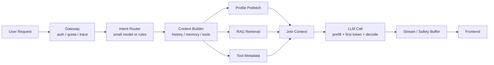

<section class="doc-hero">
  <p class="doc-hero__kicker">匿名真实面经</p>
  <h1>Agent 首 Token 与 P95 延迟面试深挖：别把 8 秒答成“模型有点慢”</h1>
  <p class="doc-hero__lead">面试官问“首 token 8 秒花在哪”，真正想听的是你会不会拆关键路径、看分位数、按收益排序优化。</p>
  <div class="doc-hero__meta" aria-label="本文信息">
    <span>适合阶段：Agent 工程师 / 后端架构面</span>
    <span>核心能力：TTFT · critical path · P95 · prompt cache · prefetch</span>
    <span>脱敏原则：只保留性能方法，不保留真实业务或内部数量</span>
  </div>
</section>

> 首 token 慢，不一定是模型慢；P95 慢，也不一定是平均链路慢。Agent 性能优化的第一步，是把一次请求拆成能被证据解释的 spans。

> **本文边界**：[限流与降级](./rate-limiting) 讲 429、熔断、重试、provider fallback；[成本优化](./cost-optimization) 讲账单、模型路由、Batch 和 token 成本；[并行工具调用](../tools/parallel) 讲 tool_calls 协议；[上下文缓存](../context/caching) 讲 prompt cache 细节。本文只回答面试里最容易被追的性能题：**首 token、总耗时、P95 尾延迟到底怎么拆、怎么优化、怎么证明**。

> **脱敏说明**：本文来自多场 Agent 工程岗位里反复出现的性能追问。所有案例都抽象成通用业务 Agent，不出现可识别组织、具体案例、真实数量、内部称呼或私有数据。

## 面试官想考什么

这些题表面是性能优化，实际考的是你有没有生产系统的定位习惯。

<div class="interview-grid">
  <div>
    <strong>一个 Agent 首 token P95 8 秒，你怎么定位瓶颈？</strong>
    <span>考 trace 分段、关键路径和分位数，而不是笼统说“模型慢”。</span>
  </div>
  <div>
    <strong>TTFT、总耗时、输出速度、工具耗时分别看什么？</strong>
    <span>考你是否能区分用户感知延迟和后台执行延迟。</span>
  </div>
  <div>
    <strong>平均 4 秒、P95 8 秒，优化策略和平均 8 秒一样吗？</strong>
    <span>考尾延迟治理：长尾工具、缓存 miss、队列等待和偶发重试。</span>
  </div>
  <div>
    <strong>为什么 prompt cache / prefix cache 会影响首 token？</strong>
    <span>考 prefill、KV cache、稳定前缀和压缩副作用。</span>
  </div>
  <div>
    <strong>哪些步骤能并行，哪些不能？怎么证明并行真的省时？</strong>
    <span>考 critical path，而不是“把所有 await 都 gather”。</span>
  </div>
  <div>
    <strong>流式输出是不是一定能降低延迟？</strong>
    <span>考 perceived latency 与真实端到端耗时的区别，以及安全 buffer 的代价。</span>
  </div>
  <div>
    <strong>什么时候应该用小模型、语义缓存、模板，而不是继续优化大模型？</strong>
    <span>考“不要默认用 LLM”的工程判断。</span>
  </div>
  <div>
    <strong>性能优化上线后，你看哪些指标防止质量回退？</strong>
    <span>考性能、质量、安全和成本的联动治理。</span>
  </div>
</div>

## 为什么“模型有点慢”会失分

面试里常见的一句话是：

```text
我们平均 4 秒，P95 8 秒，主要是模型生成慢。后面可以加缓存和流式输出优化。
```

这句话不是错，而是不够工程化。面试官会继续追：

```text
8 秒里，模型 prefill 几秒？工具几秒？RAG 几秒？队列等了几秒？
P95 是所有请求都慢，还是某类 intent 慢？
首 token 慢和总耗时慢是同一个问题吗？
你说加缓存，是 response cache、semantic cache，还是 prompt cache？
```

如果没有 trace，答案很快会变成猜测。成熟回答要先把一次请求拆开：

| 阶段 | 影响 TTFT | 影响总耗时 | 常见瓶颈 |
|---|---:|---:|---|
| Gateway / 鉴权 / 限流 | 是 | 是 | 排队、冷启动、跨区调用 |
| 意图识别 / 路由 | 是 | 是 | 多一次 LLM 调用、分类器慢 |
| 上下文组装 | 是 | 是 | 历史太长、RAG 太多、序列化慢 |
| 工具 / RAG | 是 | 是 | 串行 IO、长尾工具、检索 miss 后重试 |
| LLM prefill | 是 | 是 | 输入 token 长、prefix cache miss |
| LLM decode | 首 token 后才明显 | 是 | 输出 token 多、模型大 |
| 输出 guardrail / 后处理 | 可能是 | 是 | 安全审查、格式校验、重写 |

Anthropic 的延迟文档把 TTFT 定义为从发送 prompt 到第一个 token 生成的时间，尤其适合衡量 streaming 的响应感（[Claude Reducing latency](https://platform.claude.com/docs/en/test-and-evaluate/strengthen-guardrails/reduce-latency)）。OpenAI 的 latency guide 则把优化原则拆成七类：更快处理 token、更少生成 token、更少输入 token、更少请求、并行化、让用户少等、不要默认用 LLM（[OpenAI Latency optimization](https://developers.openai.com/api/docs/guides/latency-optimization)）。这两个官方文档合起来，就是面试回答的骨架：**先度量，再按链路位置选择手段**。

## 一张图拆 Agent 延迟关键路径



这张图的关键是 `P1/P2/P3` 能并行，`Gateway -> Intent -> Context -> LLM` 大多不能随便并行。优化时不要问“哪里能加 async”，要问：

```text
哪条路径在 critical path 上？
哪一步是 P95 长尾的主要来源？
这一步能被删除、并行、缓存、预取、降级，还是只能换更快模型？
```

性能优化不是把所有步骤都写成并发。并发只对独立 IO 有效；如果下一步依赖上一步结果，硬并发只会制造竞态和浪费。

## 可运行代码：用 critical path 看优化是否真的有效

下面这段代码模拟一个 Agent 请求的 spans。它不依赖真实模型，而是演示怎么从 trace 角度判断“串行工具改并行”“prefix cache 命中”“减少输出 token”分别影响 TTFT 还是总耗时。

```python
from __future__ import annotations

from dataclasses import dataclass
from statistics import mean


@dataclass(frozen=True)
class Step:
    name: str
    ms: int
    deps: tuple[str, ...] = ()
    affects_first_token: bool = True


def critical_path(steps: list[Step]) -> tuple[int, list[str]]:
    by_name = {step.name: step for step in steps}
    memo: dict[str, tuple[int, list[str]]] = {}

    def finish_time(name: str) -> tuple[int, list[str]]:
        if name in memo:
            return memo[name]
        step = by_name[name]
        if not step.deps:
            memo[name] = (step.ms, [name])
            return memo[name]

        dep_paths = [finish_time(dep) for dep in step.deps]
        dep_ms, dep_path = max(dep_paths, key=lambda item: item[0])
        memo[name] = (dep_ms + step.ms, dep_path + [name])
        return memo[name]

    return max((finish_time(step.name) for step in steps), key=lambda item: item[0])


def estimate(steps: list[Step]) -> dict[str, object]:
    ttft_steps = [step for step in steps if step.affects_first_token]
    ttft_ms, ttft_path = critical_path(ttft_steps)
    total_ms, total_path = critical_path(steps)
    return {
        "ttft_ms": ttft_ms,
        "ttft_path": " -> ".join(ttft_path),
        "total_ms": total_ms,
        "total_path": " -> ".join(total_path),
    }


baseline = [
    Step("gateway", 80),
    Step("intent_llm", 850, ("gateway",)),
    Step("history_load", 180, ("intent_llm",)),
    Step("rag", 900, ("history_load",)),
    Step("profile_api", 700, ("rag",)),
    Step("tool_schema_build", 120, ("profile_api",)),
    Step("llm_prefill", 1300, ("tool_schema_build",)),
    Step("first_decode", 250, ("llm_prefill",)),
    Step("output_decode", 1600, ("first_decode",), affects_first_token=False),
    Step("final_guardrail", 220, ("output_decode",), affects_first_token=False),
]

optimized = [
    Step("gateway", 80),
    Step("intent_rules", 80, ("gateway",)),
    Step("history_load", 180, ("intent_rules",)),
    Step("rag", 900, ("intent_rules",)),
    Step("profile_api", 700, ("intent_rules",)),
    Step("tool_schema_build", 120, ("history_load", "rag", "profile_api")),
    Step("llm_prefill_cache_hit", 350, ("tool_schema_build",)),
    Step("first_decode", 250, ("llm_prefill_cache_hit",)),
    Step("output_decode_shorter", 800, ("first_decode",), affects_first_token=False),
    Step("chunk_guardrail", 120, ("first_decode",), affects_first_token=False),
]

for label, plan in [("baseline", baseline), ("optimized", optimized)]:
    result = estimate(plan)
    print(label, result)

print("avg_step_ms_baseline", round(mean(step.ms for step in baseline), 1))
```

这段代码会暴露一个重要事实：如果 `rag` 和 `profile_api` 原来是串行，改成并行后，关键路径从两者相加变成取最大值；如果 `llm_prefill` 被 prompt cache 命中，TTFT 会明显下降；如果只是缩短 `output_decode`，总耗时下降，但第一个 token 不一定更快。

面试时你可以把这段思想翻译成一句话：

```text
我不会先改代码。我会先把 trace 按阶段聚合，看 TTFT 的 critical path 是工具、RAG、prefill 还是排队，再决定是并行、缓存、模型路由还是减少输出。
```

## 七个优化杠杆，按收益排序讲

### 1. 先删掉不该走 LLM 的步骤

OpenAI latency guide 的最后一条很锋利：不要默认用 LLM。动作确认、固定拒答、标准澄清、枚举型分类、日期计算、简单格式化，都可能不需要模型。

常见反模式：

```text
用户点“保存成功” -> 调 LLM 生成“已为你保存”
```

更稳的做法：

```text
写操作成功 -> 代码返回固定确认文案 -> 后台异步让模型生成解释或建议
```

这不是“低级优化”，而是最大收益：删除一次 LLM 调用，通常比把一次 LLM 调用优化 20% 更有价值。

### 2. 把独立 IO 从串行改成并行

Agent 里最常见的性能浪费，不是模型本身，而是工具调用被串成一条线：

```text
查用户配置 -> 查知识库 -> 查业务工具 -> 再进模型
```

如果这些步骤互不依赖，就应该并行。注意边界：并行的是**工具执行**，不是让模型乱并发做推理。具体 tool_calls 协议和部分失败处理放在 [并行工具调用](../tools/parallel)，本文只强调性能判断：

```text
串行耗时 = A + B + C
并行耗时 = max(A, B, C) + join
```

如果 A/B/C 都在 critical path 上，收益很大；如果它们本来就在后台，收益有限。

### 3. 预取高频上下文，不要等用户问完再查

很多 Agent 每轮都需要用户配置、权限、常用工具说明、当前会话摘要。这些内容可以在用户进入页面、打开会话、上一次请求结束后预取或刷新。

| 内容 | 适合预取吗 | 失效策略 |
|---|---|---|
| 用户权限 / 配置 | 适合 | 短 TTL + 权限变更事件失效 |
| 工具 schema | 很适合 | 版本号变更失效 |
| 会话摘要 | 适合 | 每 N 轮或空闲时后台更新 |
| 实时行情 / 库存 | 谨慎 | 只能缓存快照并标注时间 |
| 高风险判断 | 不适合完全复用 | 每次请求重新判定 |

预取的核心不是“藏延迟”，而是把不依赖当前 query 的工作移出用户等待路径。

### 4. 稳定前缀，吃到 prompt cache

TTFT 慢经常来自 prefill：模型要先处理完整输入，才能开始生成第一个 token。OpenAI prompt caching 文档明确说，缓存命中只能发生在**精确前缀匹配**上；静态 instructions 和 examples 应放在 prompt 前面，用户变量放后面（[OpenAI Prompt Caching](https://developers.openai.com/api/docs/guides/prompt-caching)）。OpenAI 还说明，1024 tokens 以上会自动启用 prompt caching，并且 cache hit 会降低延迟与成本。

Anthropic 的 prompt caching 文档也强调，它会复用最近请求的 prompt prefix，默认 cache lifetime 是 5 分钟，命中后能减少处理时间和成本；还支持 pre-warming，让真实用户交互前先把 system prompt 或 tool definitions 放入缓存，降低 TTFT（[Claude Prompt Caching](https://platform.claude.com/docs/en/build-with-claude/prompt-caching)）。

面试里最容易被追的是这句：

```text
压缩上下文会减少 token，所以一定更快。
```

不一定。压缩如果改写了靠前历史，可能让后面的稳定前缀全部 cache miss。更稳的 layout 是：

```text
稳定前缀：system / policy / tool definitions / few-shot
半稳定内容：session summary / reusable RAG context
动态尾部：recent messages / current user query
```

压缩放在半稳定区域，尽量别频繁改最前面的静态内容。

### 5. 控制输出长度，别让 decode 拖垮总耗时

OpenAI latency guide 里有个很实用的经验：生成 token 几乎总是高延迟步骤，输出 token 减半，延迟常常也接近减半。Anthropic 的 latency 文档也建议同时优化 prompt 和 output length，并用 `max_tokens` 防止过长输出。

对 Agent 来说，输出长度可以从三层控制：

| 层 | 做法 | 适合场景 |
|---|---|---|
| Prompt | 要求“用 3 句话”“只输出结论 + 依据” | 自然语言回答 |
| Schema | 字段化输出，只生成必要字段 | 工具结果解释、卡片数据 |
| Product | 展示摘要，详情展开再生成 | 长报告、分析类产品 |

不要用 `max_tokens` 粗暴截断长答案作为主要策略。它会在中间断句，可能损害体验。更好的方式是任务结构上减少输出，再用 `max_tokens` 做保险丝。

### 6. 模型路由：简单问题别上慢模型

小模型通常更快、更便宜。Anthropic latency 文档把“选择合适模型”放在第一条；OpenAI latency guide 也把模型大小作为影响 token 处理速度的主要因素之一。

成熟路由不是“所有简单请求用小模型”，而是：

```text
简单分类 / 模板解释 -> 小模型或规则
普通问答 / 单工具解释 -> 中等模型
复杂规划 / 多文档综合 / 高风险判断 -> 强模型 + 更严格 guardrail
```

路由要配 eval。否则把复杂请求错送小模型，省下的延迟会被重试、人工兜底和投诉吃掉。具体模型选择和持续重评见 [模型选型与持续重评面试深挖](../llm/model-selection-interview)。

### 7. 流式输出和进度事件，降低用户体感等待

Streaming 不一定减少总计算时间，但能降低用户“空等”的时间。OpenAI latency guide 把 streaming 称为最有效的“让用户少等”的方式之一；同时建议在工具多步骤场景里展示真实进度。Anthropic 文档也说明 streaming 能让用户实时看到输出，提升响应感。

但 streaming 不是万能。结合 [Agent 流式输出安全面试深挖](./streaming-guardrail-interview)，高风险输出可能需要 buffer 审查甚至完整生成后审查。此时更合理的指标不是原始 TTFT，而是：

```text
time_to_first_safe_token
```

也就是第一段已经通过安全策略、可以展示给用户的内容多久出现。

## P95 慢时，先找长尾而不是改平均

平均 4 秒、P95 8 秒，说明大多数请求还可以，但有一小撮请求明显慢。优化思路和“平均也 8 秒”完全不同。

| 长尾来源 | 观测信号 | 优化手段 |
|---|---|---|
| 某个工具偶发慢 | tool span P95 高，平均正常 | timeout、缓存、备用服务、异步队列 |
| RAG top-k 过大 | 检索/重排耗时随文档数上升 | 限制 top-k、分层检索、提前过滤 |
| prefix cache miss | cached_tokens 比例低，TTFT 波动 | 稳定前缀、cache key、预热 |
| 队列等待 | queue_wait span 高 | worker 池、优先级、限流 |
| 偶发重试 | retry_count 和 P95 同涨 | 熔断、退避、减少串行重试 |
| 输出过长 | output_tokens P95 高 | schema、摘要、分段生成 |

这里的核心动作是按 intent、model、tool、cache_hit、retry_count 分组看 P95。不要只看全局延迟。全局 P95 只能告诉你“有尾巴”，不能告诉你尾巴在哪。

## 性能优化不能破坏质量

面试官很容易继续追：

```text
你把模型换小了、输出变短了、RAG top-k 降了，质量怎么办？
```

回答要把性能优化放回质量闭环：

| 优化 | 可能副作用 | 必须一起看的质量指标 |
|---|---|---|
| 小模型路由 | 复杂请求答错 | 分 intent pass rate、人工抽检、judge agreement |
| 缩短输出 | 漏关键信息 | 完整性评分、用户追问率 |
| 降低 top-k | 证据召回不足 | recall@k、引用命中、事实一致性 |
| prompt cache 稳定前缀 | 动态规则更新不及时 | policy version、配置发布时间 |
| 工具并行 | 依赖顺序被破坏 | tool error rate、部分失败率 |
| 模板化回答 | 体验僵硬 | 解决率、重复咨询率 |

性能优化上线前后应该跑同一套 eval，至少覆盖任务完成、工具正确、事实一致性和安全边界。只看延迟下降，会把系统优化成一个“又快又错”的产品。

## 常见陷阱

### 陷阱 1：只看平均值

**现象**：看板显示平均延迟还行，但用户投诉“经常卡住”。

**根因**：平均值掩盖尾延迟。少数极慢请求足以毁掉体验。

**修法**：至少看 P50 / P90 / P95 / P99，并按 intent、tool、model、cache hit 分组。

### 陷阱 2：把 streaming 当成性能优化的全部

**现象**：首 token 变快了，但用户读完整答案仍然很久，甚至中途被安全 buffer 卡住。

**根因**：streaming 降低体感等待，不一定减少总计算。

**修法**：同时看 TTFT、time-to-first-safe-token、total latency、output tokens。高风险输出要把安全 buffer 算进指标。

### 陷阱 3：压缩上下文后 TTFT 反而变差

**现象**：输入 token 少了，但下一轮首 token 更慢。

**根因**：压缩改写了前缀，击穿 prompt cache。前缀缓存按 exact prefix 匹配，不是语义相似匹配。

**修法**：静态内容放最前且少改；滚动摘要放固定位置；最近消息放尾部；监控 cached input tokens 比例。

### 陷阱 4：把所有工具都并行

**现象**：速度偶尔变快，但出现“先写后读”“先创建后使用”的顺序错误。

**根因**：没有区分独立 IO 和有依赖的状态变更。

**修法**：只并行无依赖读操作；写操作、状态变更和需要前置结果的工具保留顺序；用 DAG 表达依赖。

### 陷阱 5：用小模型省延迟，但没有回退机制

**现象**：简单问题变快，复杂问题质量下降，用户重复追问增多。

**根因**：路由器只考虑快，没有考虑错分代价。

**修法**：路由结果记录 trace；低置信度升级模型；复杂 intent 保守走强模型；上线前跑分层 eval。

### 陷阱 6：优化后没有复测 P95

**现象**：单次 demo 变快，但线上峰值仍然慢。

**根因**：本地样本没有覆盖并发、队列、cache miss 和长尾工具。

**修法**：用生产分布的 replay 或压测集验证，单独看 cache miss、provider fallback、tool timeout 情况。

## 与相邻文章的区别

| 文章 | 解决的问题 | 本文的边界 |
|---|---|---|
| [限流与降级](./rate-limiting) | 429、token bucket、熔断、provider fallback | 本文只讲请求已经进入系统后的延迟关键路径 |
| [成本优化](./cost-optimization) | input/output 账单、模型路由、Batch、语义缓存 | 本文从性能角度解释这些手段如何影响 TTFT/P95 |
| [并行工具调用](../tools/parallel) | OpenAI / Anthropic / Gemini 的并行 tool 协议 | 本文只关心并行是否缩短 critical path |
| [上下文缓存](../context/caching) | prompt cache、prefix layout、TTL、命中率 | 本文只讲 cache 对 TTFT 的影响和面试表达 |
| [Agent 线上质量治理](./agent-quality-interview) | eval、badcase、trace、回归集 | 本文把性能优化纳入质量回归 |

## 面试题深度解析

### Q1：一个 Agent 首 token P95 8 秒，你怎么定位？

**30 秒版本**：先看 trace，把 gateway、intent、context、RAG、tool、LLM prefill、first decode、guardrail 分成 spans；再按 intent/tool/model/cache_hit 分组看 P95，找到 critical path，而不是先猜模型慢。

**追问 1：如果平均 4 秒、P95 8 秒呢？**  
这是尾延迟问题。重点查长尾工具、RAG top-k、cache miss、队列等待和重试，不是只优化平均链路。

**追问 2：怎么证明优化有效？**  
优化前后用同一批 replay case，看 TTFT P95、total P95、cache hit、tool P95、quality pass rate。只看单次 demo 不算证明。

### Q2：TTFT 和总耗时有什么区别？

**30 秒版本**：TTFT 是第一个 token 出来的时间，主要受前置路由、上下文、工具、prefill 影响；总耗时还包括完整 decode、后处理和安全审查。

**追问 1：输出 token 变少会影响 TTFT 吗？**  
不一定。减少输出主要降低总耗时；TTFT 更受输入长度、prefill、工具链和队列影响。

**追问 2：streaming 解决的是哪个指标？**  
主要解决用户体感等待，让用户更早看到内容。它不一定降低总耗时；如果有安全 buffer，要看 time-to-first-safe-token。

### Q3：prompt cache 为什么影响首 token？

**30 秒版本**：模型生成前要先处理输入，也就是 prefill。prompt cache / prefix cache 命中后，可以复用稳定前缀的计算结果，减少 prefill，TTFT 就会下降。

**追问 1：为什么改了前面一点点，缓存会失效？**  
因为 cache hit 依赖 exact prefix。靠前内容变化后，从变化点之后的前缀都不能复用。

**追问 2：上下文压缩一定加速吗？**  
不一定。压缩减少 token，但如果改写稳定前缀，会击穿 cache。要把静态 system/tools/few-shot 放前面，动态历史和当前问题放后面。

### Q4：并行工具调用怎么判断收益？

**30 秒版本**：看依赖图。如果三个工具互不依赖，串行是耗时相加，并行是取最大值；如果有依赖，硬并行会错。

**追问 1：部分失败怎么办？**  
按任务类型处理。只读查询可以部分返回并说明缺失；写操作或强一致任务不能部分成功后继续编答案。

**追问 2：并行会不会增加上游压力？**  
会，所以要配合 per-tool timeout、并发上限、熔断和限流。并行优化延迟，不代表无限放大并发。

### Q5：性能优化后怎么防质量回退？

**30 秒版本**：每个优化都要绑定质量指标。小模型看 pass rate，少 RAG 看 recall@k，短输出看完整性，工具并行看 error rate，缓存看 policy version 和命中率。

**追问 1：如果质量和延迟冲突怎么办？**  
按风险等级决策。低风险可以更快，中高风险宁可慢一点也要准确和可审计。

**追问 2：线上发现 P95 突然上升怎么排？**  
先看是否集中在某个 intent、model、tool、region、cache miss 或 retry；再看是否和发布、provider 状态、流量峰值、配置变更相关。

## 延伸阅读

- [OpenAI Latency optimization](https://developers.openai.com/api/docs/guides/latency-optimization)  
  为什么读：官方把延迟优化拆成七条原则，特别适合面试时组织答案。
- [Claude Reducing latency](https://platform.claude.com/docs/en/test-and-evaluate/strengthen-guardrails/reduce-latency)  
  为什么读：定义 TTFT，并给出模型选择、prompt/output 长度和 streaming 的基本取舍。
- [OpenAI Prompt Caching](https://developers.openai.com/api/docs/guides/prompt-caching)  
  为什么读：理解 exact prefix match、1024 token 自动缓存、稳定前缀布局和 cache routing。
- [Claude Prompt Caching](https://platform.claude.com/docs/en/build-with-claude/prompt-caching)  
  为什么读：看 automatic caching、explicit breakpoints、5 分钟 TTL 和 cache pre-warming。
- [OpenAI Priority processing](https://developers.openai.com/api/docs/guides/priority-processing)  
  为什么读：理解高价值用户交互为什么可以用更稳定的付费延迟通道，而不是所有任务都走同一 tier。
- [OpenAI Predicted Outputs](https://developers.openai.com/api/docs/guides/predicted-outputs)  
  为什么读：代码编辑和局部改写任务里，很多输出已知时可以显著降低生成延迟。

配套阅读：

- [并行工具调用](../tools/parallel)：把独立工具从串行改成并行。
- [上下文缓存](../context/caching)：深入 prompt cache / prefix cache 的布局和监控。
- [Agent 流式输出安全面试深挖](./streaming-guardrail-interview)：把 TTFT 改成 time-to-first-safe-token。
- [限流与降级](./rate-limiting)：避免并行和重试把上游打爆。
- [Agent 线上质量治理面试深挖](./agent-quality-interview)：性能优化后用 eval 防质量回退。
