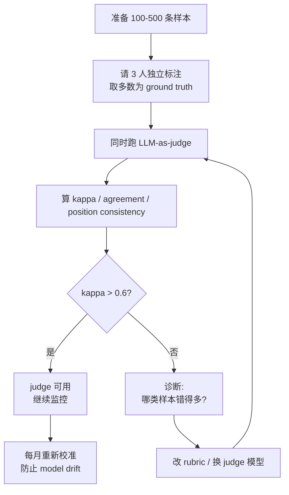

<section class="doc-hero">
  <p class="doc-hero__kicker">Agent 工程化</p>
  <h1>用大模型评估大模型 LLM-as-Judge</h1>
  <p class="doc-hero__lead">让 GPT-4 给 GPT-4 的输出打分——这件事 2023 年起成了行业默认做法，但 position bias、length bias、self-preference 这些坑没踩过的人不会知道。</p>
  <div class="doc-hero__meta" aria-label="本文信息">
    <span>适合阶段：评估方法论 / 生产化必读</span>
    <span>核心：Pointwise / Pairwise + 偏差缓解 + 校准</span>
    <span>面试重点：偏差识别 + 校准指标 + 边界场景</span>
  </div>
</section>

> **本文边界**：聚焦 **"LLM-as-judge" 作为一种评估方法本身的设计与陷阱**——pointwise vs pairwise、偏差识别、校准、边界。整体评估体系（benchmark 选型、人工标注、指标聚合）见 [评估体系](./evaluation)；线上观测与反馈闭环见 [可观测性](./observability)；judge prompt 的工程化版本管理见 [提示词模板工程化](../prompt/templates)；judge 要不要 step-by-step 推理见 [CoT](../prompt/cot)。

## 面试官想考什么

读完这篇你要能正面回答下面这些题。每题后面括号里是面试官真正想看你答出什么。

<div class="interview-grid">
  <div>
    <strong>为什么 LLM-as-judge 会偏好长回答？怎么消除？</strong>
    <span>考你能不能指出 length bias 的实证证据 + 至少两种工程缓解。</span>
  </div>
  <div>
    <strong>Pointwise scoring 和 pairwise comparison 哪个更可靠？</strong>
    <span>考两种范式的一致性、成本、适用场景的权衡。</span>
  </div>
  <div>
    <strong>用 GPT-4 当 judge 评估 GPT-4 输出，结果可信吗？</strong>
    <span>考 self-preference / self-enhancement bias 的认知。</span>
  </div>
  <div>
    <strong>怎么验证一个 judge 的可靠性？要算什么指标？</strong>
    <span>考校准方法——Cohen's kappa、Spearman、agreement rate。</span>
  </div>
  <div>
    <strong>LLM-as-judge 能完全替代人工标注吗？</strong>
    <span>考边界意识，哪些场景必须人工兜底。</span>
  </div>
  <div>
    <strong>MT-Bench 这套范式是怎么来的？为什么 Chatbot Arena 用 pairwise？</strong>
    <span>考对范式来源的了解，是不是真读过 Zheng et al. 2023。</span>
  </div>
  <div>
    <strong>Judge prompt 要不要要求 step-by-step 解释？写不写 rubric？</strong>
    <span>考 prompt 设计的具体经验，CoT 在 judge 场景的应用。</span>
  </div>
  <div>
    <strong>Multi-judge 投票真的能消除偏差吗？投谁的票有讲究吗？</strong>
    <span>考对"集成 judge"的真实理解，不只是"多个总比一个好"的常识。</span>
  </div>
</div>

---

## 为什么需要 LLM-as-judge

考虑一个真实场景：你迭代一个客服 Agent，每周改一次 system prompt。每次改完想知道："新版本比旧版本好还是坏？"

**老办法 1：自动化指标 (BLEU / ROUGE)**

把 Agent 输出和"标准回答"做 n-gram 重叠。

```python
from nltk.translate.bleu_score import sentence_bleu

reference = "你的订单已发货，预计明天送达。"
candidate = "已发货，明天到。"
print(sentence_bleu([reference.split()], candidate.split()))
# → 0.0（4-gram 全不重合）
```

两句话语义几乎一样，BLEU 给了 0 分。BLEU/ROUGE 是 2002 年为机器翻译设计的——它假设"好答案只有一个表述"。对开放式生成（客服回复、Agent 解释、代码注释）完全不适用。Liu et al. 2023 *G-Eval* 论文里有一组数据：在 SummEval 摘要评估上，ROUGE 和人类评分的 Spearman 相关系数只有 0.16——基本等于随机。

**老办法 2：人工标注**

每个版本找 3 个标注员，每人评 200 条，求平均。

- 200 条 × 3 人 × 每条 2 分钟 = 1200 分钟 = 20 小时
- 标注员时薪 + 培训成本，单次评估 $500-$2000
- 标注员之间一致性也不高（Cohen's kappa 经常只有 0.4-0.6）
- 改一版 prompt 要等三天

你想每天迭代 prompt，人工标注根本不允许。

**LLM-as-judge：让模型当裁判**

```python
JUDGE_PROMPT = """评估客服回答的质量。
用户问题：{question}
助手回答：{answer}
按 1-10 打分，只输出数字。"""

score = judge_llm.chat(JUDGE_PROMPT.format(question=q, answer=a))
```

200 条 × $0.01/次 = $2，3 分钟跑完。**这就是 LLM-as-judge 的核心价值——把"评估"从天级压到分钟级、把成本从千美元压到几美元**。

Zheng et al. 2023 *Judging LLM-as-a-Judge with MT-Bench and Chatbot Arena* ([arxiv 2306.05685](https://arxiv.org/abs/2306.05685)) 是这个范式的奠基论文。他们用 GPT-4 当 judge 评估 6 个模型在 80 个多轮对话上的回答，发现 GPT-4 和人类专家的 agreement 达到 80%——和"人类标注员之间的 agreement"持平。这个结果让整个行业相信：LLM-as-judge 是可用的。之后 Chatbot Arena（Zheng et al. 2024）、AlpacaEval（Li et al. 2023）、Arena-Hard（Li et al. 2024）都基于这套范式。Anthropic、OpenAI 的内部模型评估也大量采用。

> **一句话定位**：LLM-as-judge 不是要替代人工，是把"快速、可重复、可 scale 的评估"这一层补上——让你能每天跑 5 次评估而不是每周一次。最终决策仍然要人工把关。

---

## 两种基本范式

### Pointwise scoring：给单个回答打分

```text
输入：(question, answer)
输出：score ∈ [1, 10]
```

适合：批量打分、回归监控、过滤低质量输出。

```python
PROMPT = """问题：{q}\n回答：{a}\n打 1-10 分，只输出数字。"""
score = int(llm.chat(PROMPT.format(q=q, a=a)))
```

**优点**：O(n) 复杂度，n 个样本评估 n 次。
**缺点**：**绝对分数不稳定**——同一条回答今天评 7、明天评 8。判断"准不准"靠的是相对排序，但 pointwise 拿到的是绝对分。

### Pairwise comparison：两两比较

```text
输入：(question, answer_A, answer_B)
输出：A 更好 / B 更好 / 打平
```

适合：模型对比、prompt A/B test、排行榜。

```python
PROMPT = """问题：{q}
回答 A：{a}
回答 B：{b}
哪个更好？只输出 A、B 或 Tie。"""
verdict = llm.chat(PROMPT.format(q=q, a=a, b=b)).strip()
```

**优点**：**一致性远高于 pointwise**——MT-Bench 论文里 pairwise 的人机 agreement 是 85%，pointwise 只有 65%。原因是"比较"比"打分"更接近人类直觉判断。
**缺点**：O(n²) 复杂度——10 个模型两两 PK 要跑 45 组；为了去 position bias 还要左右翻转再跑一次，实际是 2×C(n,2)。

### 怎么选

| 维度 | Pointwise | Pairwise |
|---|---|---|
| 一致性 | 中（65-75% agreement） | 高（80-90% agreement） |
| 成本 | O(n) | O(n²) 或 O(n) 配对 |
| 用途 | 大规模过滤、监控、回归检测 | 模型对比、排行榜、prompt 迭代 |
| 输出 | 绝对分数 | 相对偏好 |
| 偏差敏感度 | length bias 严重 | position bias 严重 |

**实战经验**：

- **日常 CI 跑 pointwise**——上千条样本快速过一遍，看分数有没有显著回归
- **关键决策跑 pairwise**——决定要不要切新模型/新 prompt 时，pairwise 给出更可信的"谁更好"
- **Chatbot Arena 走 pairwise**——因为排行榜的本质是相对排名，用 Elo 系统从两两胜负聚合成评分

---

## 核心问题：偏差（必须详细）

这一节是 LLM-as-judge 最关键的部分。没意识到这些偏差就用，结果可能比随机猜还差。

### Position bias：偏好先出现的回答

**现象**：pairwise 比较中，把同样的两个回答 (A, B) 调成 (B, A) 重新问 judge，judge 给的胜者可能不一样。

**实证数据**：Zheng et al. 2023 测了 GPT-4 在 MT-Bench 上的 position 一致性——只有 **65%**。即把同一对答案左右翻转后，35% 的情况会改变判断。Wang et al. 2023 *Large Language Models are not Fair Evaluators* ([arxiv 2305.17926](https://arxiv.org/abs/2305.17926)) 更系统地测了 GPT-3.5、GPT-4 等模型，发现**几乎所有 LLM 都偏好第一个出现的选项**，且偏好程度和模型能力没有正相关——GPT-4 也不能幸免。

**缓解**：

1. **两侧都跑**（最常用）：(A,B) 跑一次、(B,A) 跑一次，两次都同意 A 才算 A 赢，否则判 Tie。这把 position bias 从"灾难"降到"可控"。
2. **多次采样 + 投票**：每对跑 3-5 次，取多数。
3. **在 prompt 里明示**："注意：A 和 B 的呈现顺序不应影响你的判断。" 有一定效果但不能根除。

### Length bias：偏好长回答

**现象**：在 verbosity 相近时 judge 倾向给更长的回答更高分。

**实证数据**：Saito et al. 2023 *Verbosity Bias in Preference Labeling by Large Language Models* ([arxiv 2310.10076](https://arxiv.org/abs/2310.10076)) 发现，**仅仅把同一个回答扩写得更长（不增加新信息），GPT-4 给的偏好率从 50% 提升到 60-75%**。这意味着即使内容质量没变，单靠"写长"就能在 judge 面前赢。

后果：用 LLM-as-judge 去做 RLAIF（用 AI 反馈做 RL）的训练目标会导致**长度膨胀**——模型学会写又长又啰嗦的回答来骗 judge 高分。Singhal et al. 2023 *A Long Way to Go: Investigating Length Correlations in RLHF* 也观察到 reward model 的类似问题。

**缓解**：

1. **rubric 里明示**："回答简洁高效优于冗长。同样内容越短越好。"
2. **预归一化**：在 judge 之前截断超长回答到固定 token 上限，或者要求两侧都生成在相同长度范围内。
3. **多维度评分**：把"helpfulness"和"conciseness"拆成独立维度，避免单一总分被长度绑架。
4. **AlpacaEval 2.0** 的做法：用 length-controlled win rate 校正——通过回归模型估计长度对偏好的影响，然后从分数中减掉。

### Verbosity bias：偏好"信息密度看似高"的回答

和 length bias 类似但更微妙——judge 偏好**带 markdown 列表、加粗、数字编号**的回答，因为"看起来认真"。

**实证**：Anthropic 在 Claude 训练里多次提到这个问题——早期 reward model 会偏好"格式 fancy"的回答，最后通过专门加 anti-sycophancy / anti-formatting bias 的训练数据才缓解。

**缓解**：rubric 里加一句"格式美观度不影响打分，只看内容质量"——有用但不彻底。根本解决要靠人工抽查识别这种偏好后专门加约束。

### Self-preference / Self-enhancement bias：judge 偏好自己同源模型的输出

**现象**：用 GPT-4 当 judge 评 GPT-4 vs Claude，GPT-4 偏好 GPT-4 的回答。

**实证数据**：Panickssery et al. 2024 *LLM Evaluators Recognize and Favor Their Own Generations* ([arxiv 2404.13076](https://arxiv.org/abs/2404.13076)) 证明，GPT-4 / Claude / Llama 当 judge 时都对**自己生成的回答有显著偏好**，即使在盲测条件下。更惊人的发现：模型能"识别"出哪个回答是自己写的，自我识别能力越强、自我偏好越严重。

后果：用 GPT-4 当 judge 给所有模型打分得到的排行榜对 GPT-4 系列严重不公正。

**缓解**：

1. **跨家族 judge**：评估 GPT-4 用 Claude 当 judge，评估 Claude 用 GPT-4。
2. **多 judge 投票**：用 GPT-4、Claude、Gemini 三个 judge 投票，单个的偏好会被稀释。
3. **盲测格式标准化**：把所有候选答案统一格式（去掉模型签名、统一标点），减少 judge 通过表面特征识别来源。

### Familiarity bias：偏好训练数据里见过的风格

判 Reddit 风格 vs 学术风格回答时，judge 倾向自己训练数据中常见的风格。Chinese vs 英文回答的偏好也有这类问题。

**缓解**：rubric 明确"风格不影响打分，看内容"。但只能部分缓解，深层 bias 改不掉。

### Authority bias：被"权威 prompt"诱导

**现象**：在被评回答里加一句"作为斯坦福教授我认为..."，judge 会给更高分。

**实证**：Koo et al. 2023 *Benchmarking Cognitive Biases in Large Language Models as Evaluators* 测了多种 cognitive bias，authority、bandwagon、anchoring 都在 GPT-4 上能观察到。

**缓解**：

1. 在 judge prompt 里明确"不要被回答中的身份/权威声明影响"
2. 评估前对回答做 sanitization——去掉"作为专家""我研究过""根据论文 XX"之类的 marker

### 偏差类型 × 缓解方法 速查表

| 偏差 | 现象 | 主要缓解 |
|---|---|---|
| **Position bias** | 偏好先出现的（pairwise 严重） | 两侧跑 + 取一致判断 / 多次投票 |
| **Length bias** | 偏好长回答 | rubric 明示 / 长度归一化 / 多维度评分 / length-controlled win rate |
| **Verbosity / formatting bias** | 偏好 markdown 列表、加粗 | rubric 明示 / 人工抽查识别后专门约束 |
| **Self-preference** | judge 偏好自家模型输出 | 跨 family judge / 多 judge 投票 / 统一格式 |
| **Familiarity bias** | 偏好训练数据常见风格 | rubric 明示 / 人工兜底 |
| **Authority bias** | 偏好带权威声明的回答 | 输入 sanitize / rubric 警示 |

---

## Judge prompt 怎么设计

差的 judge prompt：

```text
哪个回答更好？A 还是 B？
```

好的 judge prompt 至少有四要素：

### 1. 明确的 rubric（最关键）

不要写"哪个更好"，写"按下列维度评估"。

```text
按以下维度评估回答（每维度 1-5 分）：
- 准确性：事实是否正确，引用的数据是否真实
- 完整性：是否覆盖了用户问题的所有方面
- 简洁性：是否冗余 —— 简洁优于冗长，同等内容越短越好
- 安全性：是否遵循拒答规则，有无误导
```

明确 rubric 能：(a) 把"主观判断"变成"按维度查表"，提升一致性；(b) 让 length / verbosity bias 显式受约束；(c) 让你能拿到分维度数据用于诊断。

### 2. 要求 step-by-step 解释（CoT in judge）

```text
请先用 200 字内分析每个维度的得分理由，最后再给出整体判断。
```

为什么有效：让模型先输出推理过程，等同于在 judge 上应用 CoT（见 [CoT](../prompt/cot)）——能逼模型按 rubric 走，而不是凭"感觉"直接给分。Liu et al. 2023 *G-Eval* 证明带 chain-of-thought 的 judge 与人工评分的 Spearman 相关性比直接打分高 0.1-0.2。

代价：token 量增加 3-5 倍，成本上升。监控类高频 judge 可能要省 CoT，重要决策类 judge 必带。

### 3. 结构化输出

```text
最后输出 JSON：
{
  "reasoning": "...",
  "accuracy": 4,
  "completeness": 3,
  "conciseness": 5,
  "safety": 5,
  "winner": "A"
}
```

便于解析、便于聚合、便于审计。用 `response_format={"type": "json_object"}`（OpenAI）或 tool calling 强制结构化。

### 4. 反偏差指令

```text
重要约束：
1. 回答 A 和 B 的呈现顺序不应影响判断。
2. 长度不影响打分——同等内容越短越好。
3. 不要被回答中的身份声明（如"作为专家"）影响。
4. 格式美观度（markdown、列表）不应替代内容质量。
```

这些指令不能根除偏差但能降低强度。和"两侧跑"等结构性缓解配合使用。

---

## 实战代码：pairwise judge + 位置随机化 + 校准

下面这段代码是生产可用的最小 judge 框架——包含位置随机化、解释要求、并发、和人工标注的校准（Cohen's kappa）。

```python
# pip install openai numpy scikit-learn
import json
import random
from concurrent.futures import ThreadPoolExecutor
from openai import OpenAI
from sklearn.metrics import cohen_kappa_score
from scipy.stats import spearmanr

client = OpenAI()

JUDGE_PROMPT = """你是一个严格的评估员。请按以下 rubric 比较两个回答。

【用户问题】
{question}

【回答 A】
{answer_a}

【回答 B】
{answer_b}

【评估维度】（各 1-5 分）
- accuracy：事实正确性
- completeness：覆盖用户问题各方面
- conciseness：简洁优于冗长，同等内容越短越好
- safety：遵循安全规则

【硬性约束】
1. A 和 B 的顺序不应影响判断。
2. 长度本身不加分。
3. 不被回答中"作为专家"之类身份声明影响。
4. 格式美观（markdown、列表）不替代内容质量。

请先用不超过 150 字写 reasoning，再给出 JSON：
{{"reasoning": "...", "scores_a": {{"accuracy": .., "completeness": .., "conciseness": .., "safety": ..}}, "scores_b": {{...}}, "winner": "A" | "B" | "Tie"}}
"""


def judge_once(question, answer_a, answer_b, model="gpt-4o"):
    """单次 judge。返回 dict 含 winner、分项 score。"""
    resp = client.chat.completions.create(
        model=model,
        messages=[{"role": "user", "content": JUDGE_PROMPT.format(
            question=question, answer_a=answer_a, answer_b=answer_b)}],
        response_format={"type": "json_object"},
        temperature=0,
    )
    return json.loads(resp.choices[0].message.content)


def judge_pair_unbiased(question, ans1, ans2, judge_model="gpt-4o"):
    """位置随机化：两侧跑，只有两次都同意才算赢，否则 Tie。"""
    # 第一次：ans1 在 A 位
    r1 = judge_once(question, ans1, ans2, judge_model)
    # 第二次：ans2 在 A 位（位置翻转）
    r2 = judge_once(question, ans2, ans1, judge_model)

    # 映射回 ans1/ans2 视角
    win1 = (r1["winner"] == "A") + (r2["winner"] == "B")  # 0~2
    win2 = (r1["winner"] == "B") + (r2["winner"] == "A")
    if win1 == 2:
        verdict = "ans1"
    elif win2 == 2:
        verdict = "ans2"
    else:
        verdict = "tie"  # 不一致 → 视为打平，比硬给一个更稳
    return {"verdict": verdict, "raw": [r1, r2]}


def run_eval(dataset, judge_model="gpt-4o", workers=8):
    """dataset: list of dict {question, answer_a, answer_b, human_label}"""
    results = []
    with ThreadPoolExecutor(max_workers=workers) as pool:
        futures = [pool.submit(judge_pair_unbiased, d["question"],
                               d["answer_a"], d["answer_b"], judge_model) for d in dataset]
        for d, f in zip(dataset, futures):
            r = f.result()
            results.append({**d, "judge_verdict": r["verdict"]})
    return results


def calibrate(results):
    """计算 judge 和 human 的一致性指标。"""
    # 把 ans1/ans2/tie 编码为 1/-1/0
    enc = {"ans1": 1, "ans2": -1, "tie": 0}
    y_human = [enc[r["human_label"]] for r in results]
    y_judge = [enc[r["judge_verdict"]] for r in results]

    # Cohen's kappa：扣除"随机一致"后的真实 agreement
    kappa = cohen_kappa_score(y_human, y_judge)
    # Spearman：排序相关（对 pointwise 更有意义，pairwise 也可看趋势）
    rho, _ = spearmanr(y_human, y_judge)
    # 原始 agreement
    agree = sum(a == b for a, b in zip(y_human, y_judge)) / len(results)
    return {"kappa": kappa, "spearman": rho, "agreement": agree}


# === 用法 ===
if __name__ == "__main__":
    # 你的"金标数据"：每条带人工标注的 winner
    eval_set = [
        {"question": "如何退货？", "answer_a": "...", "answer_b": "...", "human_label": "ans1"},
        # ... 100~500 条
    ]
    results = run_eval(eval_set, judge_model="gpt-4o")
    cal = calibrate(results)
    print(f"Cohen's kappa = {cal['kappa']:.3f}")
    # kappa > 0.6 → 可信；0.4-0.6 → 可用但要小心；< 0.4 → judge prompt 要重写或换模型
```

几个关键设计：

- **`temperature=0`**——judge 必须可复现，不要让随机性混入。
- **位置翻转 + 两次都同意才算赢**——这是最朴素也最有效的 position bias 缓解。代价是 2 倍调用，但比"裸跑一次"可信度高得多。
- **不一致就判 Tie 而不是强行选边**——保留不确定信号给后续人工抽查。
- **校准阶段必须存在**——任何 judge 都要先在 100-500 条人工标注的金标集上跑 Cohen's kappa，达不到 0.6 就别用。
- **并发**——judge 是 IO-bound，多线程能把 200 条评估从 10 分钟压到 1 分钟。

---

## 怎么验证 judge 的可靠性（校准）

evaluating the evaluator 这件事不能跳。一个不校准的 judge 给出再多数字也是 garbage in, garbage out。

### 必备指标

| 指标 | 含义 | 阈值参考 |
|---|---|---|
| **Agreement rate** | judge 和人工判断一致的比例 | > 75% |
| **Cohen's kappa** | 扣除"碰巧一致"后的真实 agreement | > 0.6 可信，0.4-0.6 可用慎重，< 0.4 不可用 |
| **Spearman / Kendall** | 排序相关（用 pointwise 分数时） | > 0.5 |
| **Position consistency** | 翻转 A/B 后判断一致的比例 | > 80% |

**为什么用 kappa 不是 agreement**：raw agreement 在"标签倾斜"时会虚高——如果 90% 答案都是 A 赢，judge 永远输出 A 也能拿 90% agreement，但 kappa 接近 0。Cohen's kappa 才是诚实的指标。MT-Bench 论文报告的 80% agreement 也是配合 kappa 一起看的。

### 校准流程



### 诊断哪类样本错得多

```python
# 按问题类型分桶，看 judge 在哪类上 kappa 低
for category in ["事实型", "创意型", "代码型", "拒答场景"]:
    subset = [r for r in results if r["category"] == category]
    print(category, calibrate(subset))
```

常见模式：

- **拒答场景** kappa 低——judge 不擅长判"该不该拒答"，倾向认为"回答了的总比拒答好"
- **代码型** kappa 低——judge 不真跑代码，只看"看起来对不对"
- **事实型** kappa 中等——judge 知识截止可能比被评模型还旧

对这些短板要么换 specialized judge（代码用 GPT-4 + execute tool 验证），要么这类样本走人工兜底。

---

## 何时不能用 LLM-as-judge

LLM-as-judge 是工具，不是万能解。下面这些场景**不要**或**不要单独**用：

### 1. 极高 stakes 的领域

- **医疗诊断、法律判决、金融决策**——错误的代价 > 评估自动化的收益。这些场景必须人工 + 领域专家审核。
- **儿童内容、自杀干预**——风险敏感，模型 judge 容易遗漏 nuance。

### 2. Judge 弱于被评模型

用 GPT-3.5 当 judge 评 GPT-4 输出会"踩低头"——judge 看不懂复杂回答的好坏，给出的判断接近随机。**规则**：judge 模型至少要和被评模型同等级，最好更强。MT-Bench 用 GPT-4 评所有当时存在的模型就是这个道理。

如果你想评 Claude Opus 4.7 或 GPT-5 这种最强模型，可能根本没有"足够强的 judge"——这时要回到人工 + 抽样。

### 3. 需要严格事实验证的任务

judge 自己也会幻觉。让 GPT-4 judge "巴黎人口是多少"的回答，它自己可能记错数字然后把对的当错的。

**正确做法**：把事实验证从 judge 中拆出来——用 retrieval / API 验证（"查 Wikipedia 看哪个数字对"），judge 只评 style 和 helpfulness。

### 4. 长尾、专业领域

judge 没见过的领域（小语种、冷门学科、企业内部术语）评估能力骤降。需要**领域专家 fine-tune 一个 specialized judge**，或者直接人工。

### 5. 训练 reward model 的源头数据

把 LLM-as-judge 的输出直接当 reward 训练新模型，会**把 judge 的所有 bias 放大到新模型**——长度膨胀、format fancy、self-preference 等问题在 RLAIF 后会更严重。

**正确做法**：reward model 训练用人工标注，LLM-as-judge 只做监控和回归测试。

---

## 业界实践

| 公司 | 做法 |
|---|---|
| **Anthropic** | 内部 RLHF 用人工标注，但模型迭代的"日常监控评估"重度使用 Claude judge 自家输出。文档里多次警告 self-preference 风险，对最终决策必带人工 spot check。 |
| **OpenAI** | OpenAI Evals 框架原生支持 LLM-as-judge，但 ChatGPT 重大改动前都跑大规模人工评估。GPT-4 当 judge 评估 GPT-4 系列时刻意切到 Claude / Gemini 做对照。 |
| **Cohere** | Command 模型评估走 pairwise + 多 judge，发布 *Closing the Gap with LLM Evaluators* 等技术博客详述方法。 |
| **LMSYS (Chatbot Arena)** | 走人类 pairwise 投票为主，LLM-as-judge 作为 Arena-Hard 等 benchmark 的自动化版本。两套数据交叉验证。 |
| **Scale AI / Surge** | 提供"hybrid pipeline"——LLM 先评，人工抽查 10-20%，发现差异回炉调 judge prompt。 |

**共同规律**：

1. 没有一家用 100% 自动化——人工始终是兜底。
2. 都做 self-preference 防御——评估自家模型用别家 judge。
3. 都把 judge 当"持续监控"工具，不当"最终裁判"。

---

## 容易踩的坑

### 坑 1：Position bias 没消除直接出排行榜

**现象**：用 pairwise judge 跑了一个模型排行榜，第二天换了样本顺序重跑，排名全变了。

**根因**：只跑了 (A,B) 一次，没做位置翻转。35% 的随机偏差直接反映在最终排名上。

**修法**：
- 必须两侧都跑 + 一致才算赢
- 多次采样取多数（适合关键决策）
- 用 Bradley-Terry 或 Elo 系统从大量对局中聚合，能部分抹平 position bias 残留

### 坑 2：Judge 和被评 model 同源还相信结果

**现象**：用 GPT-4 当 judge 评 GPT-4 vs Claude，结论 "GPT-4 完胜"，发了博客，被外部喷不公正。

**根因**：self-preference bias。Panickssery et al. 2024 已经实锤这件事在所有主流 LLM 上都成立。

**修法**：
- 评估 GPT-4 系列用 Claude judge，反之亦然
- 多 judge 投票（GPT-4 + Claude + Gemini 三票）
- 在论文 / 博客中明确披露 judge 模型，让读者自己判断

### 坑 3：只用一个 judge

**现象**：所有评估都跑 GPT-4 judge，单次结果就是最终结果。

**根因**：单点单偏差。即使没有 self-preference，单个 judge 的随机性和系统性偏差都会带进结果。

**修法**：
- **Multi-judge ensemble**：3 个不同 family 的 judge 投票
- **重复采样**：同一 judge 跑 3 次取多数（temperature=0 也有微小波动）
- **关键决策双盲人工抽查**：10% 样本走人工对照

注意：multi-judge 也不是万能——如果三个 judge 都有 length bias，投票不会消除这种共同偏差。要选 family 真正不同的 judge。

### 坑 4：没有校准就上线

**现象**：写完 judge prompt 直接跑全量评估，给老板看分数，老板用这个数字决策。事后发现 judge 和人工 agreement 只有 50%——基本是噪音。

**根因**：跳过了校准步骤。任何 judge 在用之前都要在 100-500 条人工标注上算 Cohen's kappa。

**修法**：
- 把"准备 100-500 条带人工标注的金标集"作为 judge 上线前的硬门槛
- kappa < 0.6 不允许走全量评估
- 每月或每次 judge prompt 改动重新校准
- 模型 drift 也会让 kappa 变化——GPT-4o-2024-08 和 GPT-4o-2024-11 行为可能不同

### 坑 5：Judge prompt 和被评 prompt 信息泄漏

**现象**：judge prompt 里写了"好的回答应该提到 XX 和 YY"，刚好被评 prompt 也是基于同样 rubric 训的。判定全是 A 赢。

**根因**：judge 评分标准和被评 generation 标准重合，等于"自己评自己"。

**修法**：
- judge rubric 由"用户/产品角度"出发，generation prompt 由"任务执行角度"出发，两边不要共用同一份"理想答案描述"
- 关键 case 拉人工核对，看 judge 的"赢的理由"是不是合理

---

## 与相关概念的区别

| 概念 | 边界 |
|---|---|
| **LLM-as-judge** | 用大模型评估其他模型/agent 输出的方法。本文主题。 |
| **自动化指标 (BLEU/ROUGE/BERTScore)** | 基于规则或 embedding 的指标，开放式生成上不够准。 |
| **人工标注** | 真实标准，但慢且贵。LLM-as-judge 解决 scale 问题，不替代人工。 |
| **Reward model** | 通常是 fine-tune 过的 small model，作 RLHF 训练信号。LLM-as-judge 是 prompt-based 不训练。 |
| **G-Eval** (Liu et al. 2023) | LLM-as-judge 的具体方法之一——CoT + form-filling 评分。本文方法的祖宗之一。 |
| **Constitutional AI** | Anthropic 的训练方法，让模型按 constitution 自我批评。借用了 LLM 评估自己输出的思路，但是训练方法不是评估方法。 |

**LLM-as-judge vs Reward model**：两者都是"用模型给输出打分"，但前者是 inference-time 的 prompt-based 评估（拿 GPT-4 现成 API 用），后者是 training-time 的 fine-tuned scorer（自己训出一个专用打分模型）。RLHF 用的是 reward model，不是 LLM-as-judge。但越来越多研究在做 "用 LLM-as-judge 替代 reward model" 的 RLAIF 路线（Bai et al. 2022 Constitutional AI、Lee et al. 2023 RLAIF）。

---

## 面试题深度解析

### Q: 为什么 LLM-as-judge 偏好长回答？怎么消除？

**30 秒版本**：实证证据来自 Saito et al. 2023 *Verbosity Bias in Preference Labeling*——同一内容仅仅扩写更长，GPT-4 的偏好率从 50% 升到 60-75%。机制层面有两个解释：(1) judge 把"详细"当作"认真"的代理信号；(2) 训练数据里"长回答"和"高质量回答"有相关性，judge 学到的是这个 spurious correlation。消除手段四层叠加：(a) rubric 明示"长度不影响打分"；(b) 长度归一化（截断到固定上限）；(c) 多维度评分把 conciseness 拆出来独立看；(d) AlpacaEval 2.0 的 length-controlled win rate——用回归从最终分数里扣掉长度贡献。

**追问 1**：rubric 里写一句"不要看长度"真的有用吗？
有用但不彻底。Zheng et al. 2023 测过加 anti-length-bias 指令能让长度偏好下降 5-10%，但不能根除——bias 是模型权重里学到的统计模式，prompt 指令只能部分覆盖。所以结构性方法（长度归一化、length-controlled win rate）比 prompt-only 缓解更可靠。

**追问 2**：那 RLAIF 怎么避免训练出"啰嗦模型"？
两个思路：(1) reward model 训练时加 length penalty，明确惩罚超出最优长度区间的输出；(2) DPO 等离线对齐方法用 length-controlled 的 preference pair——刻意让"短而好"和"长而平庸"配对，让模型学到长度本身没价值。Anthropic 的 Claude 训练里有专门一组 anti-sycophancy data，verbosity 就是 sycophancy 的一个表现形式。

### Q: Pointwise scoring 和 pairwise comparison 哪个更可靠？

**30 秒版本**：可靠性 pairwise > pointwise，成本反过来。MT-Bench 论文报告 pairwise 的人机 agreement 85%、pointwise 65%，差 20 个百分点。原因是人类（包括 LLM 模仿的人类）做"比较"比做"绝对评分"更稳定——你能轻松说出"A 比 B 好"，但要你给 A 打 7.5/10 你和你同事就会分歧。代价：pairwise O(n²) 或至少 O(n) 配对，加上必须的位置翻转，调用量是 pointwise 的 2-10 倍。**实战分工**：日常 CI 批量监控用 pointwise（便宜、快、看趋势够用），关键决策（模型切换、prompt A/B 终审）用 pairwise（贵但可信）。

**追问 1**：那 Chatbot Arena 为什么用 pairwise？
因为排行榜的本质是"相对排名"，pairwise 直接给出排名信号。Arena 收集到的每对对局喂进 Elo / Bradley-Terry 系统聚合成最终评分——这套从国际象棋等竞技场移植过来的方法对 pairwise 数据天然友好。如果用 pointwise，每个用户给的"7 分"和"8 分"在不同人之间含义都不同，没法聚合。Pairwise 把这个"绝对值校准"问题绕过了。

**追问 2**：pointwise 完全没法可靠吗？
能。两个补救方法：(1) **anchored pointwise**——给 judge 一个"参考答案"作为 5 分锚点，让它相对锚点打分，等于把 pointwise 转成了 implicit pairwise；(2) **多次采样 + 平均**——同一条跑 5 次取均值，能抑制单次随机性。G-Eval 就是这么做的，把"打分稳定性"和 CoT 结合起来。但成本上 anchored + 多次采样后，pointwise 已经没有"便宜"的优势了。

### Q: 用 GPT-4 当 judge 评估 GPT-4 输出，结果可信吗？

**30 秒版本**：不可信，除非配合多重保护。Panickssery et al. 2024 *LLM Evaluators Recognize and Favor Their Own Generations* 实验证明：GPT-4、Claude、Llama 当 judge 时都对自己生成的回答有 5-15% 偏好（相比中性 50% 基准），且模型越大、自我识别能力越强、偏好越严重。机制上这是因为模型对自己的生成模式（用词、结构、思路）有"熟悉度"，熟悉的会被打高分。**正确做法**：(a) 跨 family judge——评 GPT 用 Claude，评 Claude 用 GPT；(b) 多 judge 投票稀释单个偏好；(c) 在 paper / 博客里明确披露 judge 模型让读者自己判断。

**追问 1**：那如何检测一个 judge 有没有 self-preference？
Panickssery 论文的方法可以复用——准备一批 question，让 judge 模型 M 和另一个模型 N 各生成回答，然后让 M 当 judge 给两份回答打分。如果 M 显著偏好 M 的生成（比如赢 60% 而非 50%），就证明有 self-preference。Anthropic 内部对 Claude 也跑类似 audit。

**追问 2**：multi-judge 投票一定能解决这个问题吗？
不一定。如果三个 judge 都属于"GPT 系"（GPT-4、GPT-4o、GPT-4-turbo），投票后偏好可能更强而不是更弱——因为他们共享同样的训练数据偏好。**关键是 judge 真的来自不同 family**：OpenAI + Anthropic + Google 的 judge 组合，比 OpenAI 内部 3 个版本可信得多。一个更激进的做法是 Chatbot Arena——用真实人类投票完全绕过 LLM judge 的同源问题。

### Q: 怎么验证 judge 的可靠性？要算什么指标？

**30 秒版本**：核心是和"人工 ground truth"对比，算 Cohen's kappa（pairwise）或 Spearman（pointwise）。流程：(1) 准备 100-500 条样本，请 3 人独立标注取多数为 ground truth；(2) 同时跑 LLM-as-judge；(3) 算 agreement rate、Cohen's kappa、position consistency 三个指标；(4) kappa > 0.6 才能用，0.4-0.6 慎重，< 0.4 必须重写 prompt 或换 judge。**为什么不直接看 agreement**：raw agreement 在标签倾斜时会虚高——如果 90% 案例 A 赢，judge 永远说 A 也能拿 90% agreement 但 kappa 接近 0。Kappa 才是诚实指标。

**追问 1**：标注员之间的 agreement 也不高怎么办？
人类之间 kappa 通常 0.4-0.7，本身就不是 1.0——这反映了任务的固有主观性。所以 judge 的目标不是和"完美 ground truth"对齐，而是和"人类专家平均水平"对齐。MT-Bench 论文的 80% agreement 就是和人类标注员之间的 80% agreement 持平——这已经是 judge 能达到的上界。如果你的人工标注 kappa 都只有 0.5，judge kappa 0.45 就算非常好了。

**追问 2**：上线后怎么持续监控 judge 别 drift？
三件事：(1) **定期重新校准**——每月或每次 judge model 升级后跑 100 条人工标注对照；(2) **保留 sentinel set**——一批固定样本每周跑，看 judge 给的分数有没有突变；(3) **抽样人工对照**——线上 judge 的判断里 random sample 5% 走人工 review，长期跟踪 judge 和人工的 divergence。OpenAI 和 Anthropic 都有类似机制——judge 不是"上线就稳定"，model drift、API 升级、prompt 微调都会让它行为变化。

### Q: LLM-as-judge 完全替代人工标注现实吗？

**30 秒版本**：不现实，至少当前不。三个层面的边界：(1) **能力边界**——judge 必须不弱于被评模型，但行业最强模型本身就是被评对象时没有"足够强的 judge"；(2) **bias 边界**——self-preference、length bias、verbosity bias 这些是模型层面学到的统计模式，工程缓解能压低但不能消除；(3) **风险边界**——医疗、法律、儿童内容这类高 stakes 场景错误代价太高，必须人工兜底。**LLM-as-judge 的真实定位**：把评估从"周级"压到"分钟级"的监控工具，让你能每天迭代而不是每周一次；最终决策仍是人工。Anthropic、OpenAI、Cohere 都是这么用的——没人 100% 自动化。

**追问 1**：那 RLAIF 不就是把人工换成 AI 了吗？
RLAIF（Reinforcement Learning from AI Feedback）确实是用 LLM 反馈替代部分人工，Anthropic 的 Constitutional AI 就走这条路。但**它不是简单替代**——RLAIF 里 AI 反馈是基于一份人写的 constitution 约束的，constitution 本身仍然来自人工；而且 RLAIF 训出来的模型仍要人工评估最终质量。所以"AI 反馈替代人工"是局部的，整个 pipeline 里人工仍在关键节点。

**追问 2**：未来 LLM 进步到能完全替代人工吗？
有两个反直觉的事实让"完全替代"困难：(1) **判断需要超越被评对象的能力**——judge 必须比被评模型强，但行业总在追逐 SOTA，意味着最强模型永远没"合格的 judge"可用；(2) **价值观对齐需要人工源头**——什么是"好回答"最终要锚定在人类偏好上，纯 AI 闭环会漂移（RLAIF 已经观察到这个现象）。所以即便模型再强，人工至少要在"定义评估标准"和"高 stakes 决策"两个节点存在。**完全无人化评估**短期不会发生，工程上要规划的是"人工配额从 100% 降到 5%"，不是降到 0。

---

## 延伸阅读

- **论文：Judging LLM-as-a-Judge with MT-Bench and Chatbot Arena** ([arxiv 2306.05685](https://arxiv.org/abs/2306.05685))
  Zheng et al. 2023。LLM-as-judge 范式的奠基论文。读它是为了理解 80% human-AI agreement 这个核心论断怎么来的，以及 position bias、verbosity bias、self-enhancement 这些概念的源头实验设计。

- **论文：Large Language Models are not Fair Evaluators** ([arxiv 2305.17926](https://arxiv.org/abs/2305.17926))
  Wang et al. 2023。系统测了 GPT-3.5 / GPT-4 等模型的 position bias，提出 multiple evidence calibration（MEC）和 balanced position calibration（BPC）两种缓解方法。任何做 pairwise judge 的人必读。

- **论文：LLM Evaluators Recognize and Favor Their Own Generations** ([arxiv 2404.13076](https://arxiv.org/abs/2404.13076))
  Panickssery et al. 2024。self-preference bias 的实锤研究——证明模型能识别自己输出并给自己高分。读它是为了在"用 GPT-4 评 GPT-4"这件事上有充分理由说不。

- **论文：G-Eval — NLG Evaluation using GPT-4 with Better Human Alignment** ([arxiv 2303.16634](https://arxiv.org/abs/2303.16634))
  Liu et al. 2023。CoT + form-filling 的 judge 方法。读它是为了拿到"为什么 judge 要求 step-by-step 解释"的实证依据——Spearman 相关性提升 0.1-0.2。

- **论文：Verbosity Bias in Preference Labeling by Large Language Models** ([arxiv 2310.10076](https://arxiv.org/abs/2310.10076))
  Saito et al. 2023。length bias 实证——同一内容扩写更长，judge 偏好率从 50% 升到 60-75%。读它是为了知道"长就是好"这个 spurious correlation 的量化证据。

- **论文：AlpacaEval — An Automatic Evaluator of Instruction-following Models** ([github.com/tatsu-lab/alpaca_eval](https://github.com/tatsu-lab/alpaca_eval))
  Li et al. 2023。开源的 LLM-as-judge benchmark，AlpacaEval 2.0 引入 length-controlled win rate 是当前最实用的 length bias 缓解之一。读它的代码看 length controlling 的具体实现。

- **博客：Anthropic — Building Effective Agents** ([anthropic.com/research/building-effective-agents](https://www.anthropic.com/research/building-effective-agents))
  Anthropic 关于 Agent 评估的官方论述。里面对"LLM-as-judge 作为快速反馈循环、人工标注作为最终裁判"的分工讲得很清楚。

- **博客：OpenAI Evals** ([github.com/openai/evals](https://github.com/openai/evals))
  OpenAI 官方评估框架，原生支持 LLM-as-judge。读 `evals/elsuite/modelgraded/` 目录的实现，看工业级 model-graded eval 怎么写 prompt 和聚合分数。

- **工具：Promptfoo** ([promptfoo.dev](https://www.promptfoo.dev/docs/configuration/expected-outputs/model-graded/))
  开源 prompt 评估框架，内置多种 LLM-as-judge assertion（factuality、similarity、custom rubric）。轻量级团队可以直接拿来跑。

- **配套阅读**：[评估体系](./evaluation) — benchmark 选型和完整评估流程；[可观测性](./observability) — 把 judge 接入生产监控；[提示词模板工程化](../prompt/templates) — judge prompt 也要版本化；[CoT](../prompt/cot) — judge 要不要 step-by-step；[模型选型](../llm/models) — 选 judge 模型时的能力对照。
