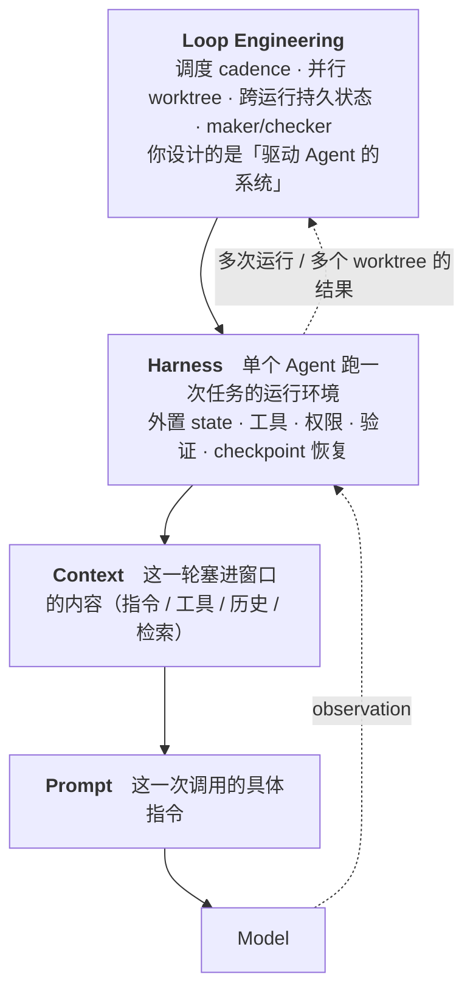

<section class="doc-hero">
  <p class="doc-hero__kicker">Agent 工程化</p>
  <h1>Loop Engineering：从写 prompt 到设计驱动 Agent 的系统</h1>
  <p class="doc-hero__lead">你的角色从「不停给 Agent 发指令的人」变成「设计那套发指令系统的人」。</p>
  <div class="doc-hero__meta" aria-label="本文信息">
    <span>适合阶段：生产 / 自动化 Agent</span>
    <span>核心机制：调度 · 并行 worktree · 持久状态 · maker/checker</span>
    <span>面试重点：Loop vs Prompt / Context / Harness</span>
  </div>
</section>

> Prompt 是你说的一句话，loop 是替你不停说话的那套系统。

> **本文边界**：本文讲的是「驱动 Agent 的外层系统」这一层。单次循环内部的状态机见 [Agent 运行循环](../agent/agent-loop)，单个 Agent 的运行环境见 [Agent Harness 设计](./harness)，多角色协作的通用模式见 [多 Agent 架构模式](../multi-agent/patterns)。Loop engineering 站在 harness 的「上一层」：harness 管一个 Agent 跑一次任务，loop 管「什么时候、并行几个、跨多次运行怎么接力」。

## 面试官想考什么

读完这篇你要能正面回答下面这些题。每题后面括号里是面试官真正想看你答出什么。

<div class="interview-grid">
  <div>
    <strong>Prompt、context、harness、loop engineering 这几层分别解决什么？为什么会演化出 loop 这一层？</strong>
    <span>考分层认知，能不能讲清楚「人退到哪一层」。</span>
  </div>
  <div>
    <strong>一个能跑一晚上的 loop 至少要具备哪几个要素？</strong>
    <span>考可测终止条件、工具、上下文管理、失败出口、错误自适应。</span>
  </div>
  <div>
    <strong>Ralph Wiggum 式的裸 while-true loop 什么时候够用、什么时候翻车？</strong>
    <span>考可程序化验证的边界，以及 fresh context 的取舍。</span>
  </div>
  <div>
    <strong>Loop engineering 和 multi-agent / orchestrator-worker 是一回事吗？</strong>
    <span>考辨析：sub-agent 的 maker/checker 拆分 vs 通用多 Agent 协作。</span>
  </div>
  <div>
    <strong>为什么并行跑多个 Agent 要用 git worktree，而不是直接开几个进程？</strong>
    <span>考隔离、文件冲突、可回滚。</span>
  </div>
  <div>
    <strong>验证（verification）为什么必须由代码或人拥有，不能交给 loop 自己？</strong>
    <span>考 comprehension debt、cognitive surrender、maker≠checker。</span>
  </div>
  <div>
    <strong>怎么估算和控制一个 loop 的成本？跑飞了怎么兜底？</strong>
    <span>考 cadence、token 预算、重试上限、failure exit。</span>
  </div>
  <div>
    <strong>怎么判断一个任务适不适合做成 loop？</strong>
    <span>考「终止条件可测 + 进度可程序化验证」这条筛选线。</span>
  </div>
</div>

---

## 为什么需要 loop engineering

你给 Claude Code 一个任务，它干了三分钟，停下来问「要继续吗？」，你说继续；又干两分钟，又停下来。你盯着终端，像看着一个需要不停喂指令的机器人。一个任务还行。但当你面前是 30 个依赖要升级、40 个 PR 要 review、一屏 lint 报错要清，你就成了瓶颈——你本人就是那个「the human in the loop」，而且是循环里最慢的一环。

最朴素的解法 2025 年 5 月就出现了，叫 **Ralph Wiggum loop**（Geoffrey Huntley 起的名，致敬辛普森一家里那个屡败屡战的角色）：

```bash
while :; do cat PROMPT.md | claude -p ; done
```

一个 bash 死循环，反复把同一个 prompt 喂给 Agent，直到任务做完。粗暴，但在某些场景里出奇地有效。它点破了一件事：**很多时候决定产出质量的不是模型，而是循环本身的设计**。同样的 Claude，套在一个会验证、会重试、会换思路的 loop 里，和裸调用一次，产出天差地别。

到 2026 年中，这件事被系统化成一个名词。Addy Osmani 在 [Loop Engineering](https://addyosmani.com/blog/loop-engineering/) 里给的定义很干脆——loop engineering 就是「把你自己从那个给 Agent 发 prompt 的人的位置上替换掉，转而去设计那套替你发 prompt 的系统」。Cobus Greyling 把这套理念追溯到 Addy Osmani 和 Claude Code 负责人 Boris Cherny，并做成了一套脚手架工具。它和前几年大家熟悉的几层是这样接力的：

- **Prompt engineering**：调一次调用的措辞。
- **Context engineering**：管这一轮往窗口里塞什么（指令、工具、历史、检索）。
- **Harness engineering**：管一个 Agent 跑一次任务的运行环境（状态、工具、权限、验证、恢复）。
- **Loop engineering**：管「什么时候触发、并行开几个、跨多次运行怎么接力状态」——人退到了设计系统这一层。

每往外退一层，人手动做的事就少一点，系统替你做的就多一点。

## loop engineering 是怎么工作的

它实际做的事，是在 harness 外面再包一圈：把「触发—并行—持久化—验证—接力」这套编排写成代码，让 Agent 的多次运行能在无人值守时自己推进。



读这张图的关键：每一层都包住里面那层。Harness 已经能让一个 Agent 把一次任务做完、做稳、能恢复；loop 不重复造这些，它解决的是 harness 管不到的事——**这个 harness 该在凌晨三点被触发吗？该同时开五个吗？上一次跑到一半的结论，下一次怎么接着用？** 这三个问题，就是 loop engineering 的全部战场。

## 核心原理 / 关键设计

先记住一句话标准：一个「能跑一晚上」的 loop，至少要有五件东西——一个带**可测终止条件**的明确目标、一套**有用的工具**、**不会撑爆 token 的上下文管理**、**防死循环的失败出口**、以及**能产生真实调整的错误处理**（出自 firecrawl/mindstudio 等多篇 2026 综述的共识）。下面拆开讲 loop 在 harness 之上多出来的几件事。

### 1. 终止条件必须可程序化验证

裸的 `while true` 不是 loop engineering，带可测停止条件的才是。

```python
# 坏：靠 Agent 自己说「我觉得做完了」
done = ask_agent("are you done?")

# 好：终止条件是一段能跑出 0/1 的代码
done = run("pytest -q").returncode == 0 and run("ruff check .").returncode == 0
```

**为什么这样设计**：loop 跑在无人值守时，没人替它判断「真完成」还是「自我感觉良好」。能写成 `pytest`、`tsc`、`lint`、`diff 行数`、`HTTP 200` 这种客观信号的任务，才适合做成 loop;反过来，「把首页做得更好看一点」这种没法程序化判定的，硬塞进 loop 只会烧钱。

### 2. 调度与节奏（cadence）是 loop 独有的输入

Harness 不关心「什么时候开始」，loop 关心。Cobus Greyling 的 [loop-engineering](https://github.com/cobusgreyling/loop-engineering) 仓库把常见节奏沉淀成七种生产 pattern：Daily Triage、PR Babysitter、CI Sweeper、Dependency Sweeper、Changelog Drafter、Post-Merge Cleanup、Issue Triage——每种有自己的触发频率和安全等级。

```bash
# 用它的脚手架起一个「每日 triage」loop，并预估这种节奏的 token 花费
npx @cobusgreyling/loop-init . --pattern daily-triage --tool grok
npx @cobusgreyling/loop-cost --pattern daily-triage --level L1
```

**为什么这样设计**：cadence 决定成本曲线。每小时跑一次和每天跑一次，月底账单差一个数量级。把节奏显式写出来（cron / 定时触发），而不是手动想起来跑，才谈得上「自动」。

### 3. 并行要靠 git worktree 隔离

想同时让五个 Agent 各修一个 bug，不能让它们在同一个工作目录里互相踩。`git worktree` 给每个 Agent 一个独立的工作树，共享同一个 `.git`，互不污染。

```bash
# 为每个任务开一个隔离工作树，Agent 在各自的 wt-* 里改代码
git worktree add ../wt-T-1 -b loop/T-1
git worktree add ../wt-T-2 -b loop/T-2
# 跑完各自验证通过后，再决定哪些分支合并、哪些丢弃
git worktree remove ../wt-T-1
```

**为什么这样设计**：并行的前提是隔离。worktree 让「五个 Agent 同时干」变成五个独立分支，任何一个跑偏，`worktree remove` 直接丢掉，不影响主干，也不影响其他四个。这是 loop 能安全并行的物理基础。

### 4. sub-agent 的 maker/checker 拆分

Loop 里的一个关键 pattern：让**写代码的 Agent** 和**验收的 Agent** 是不同的角色。写的那个（maker）容易对自己的产出过度自信，所以由另一个上下文干净的 checker 来核。

```text
explorer  → 读代码、定位要改哪里，产出计划
implementer → 在 worktree 里按计划改，产出 diff
verifier  → 干净上下文里跑测试 + review diff，给 pass/fail
```

**为什么这样设计**：同一个 Agent 既当运动员又当裁判，会把「我改完了」当成「我改对了」。分开之后，verifier 没有 implementer 的「沉没成本」，更容易发现「测试根本没跑过」「diff 改坏了别的地方」。这也是 loop engineering 和泛泛的 multi-agent 的区别——它不是为了「人多力量大」，而是为了**把 maker 和 checker 强制分离**。

### 5. 失败出口与预算闸

无人值守的循环，最大的风险是「跑飞」：一个改不动的任务，Agent 一遍遍重试，天亮时烧光了预算。所以 loop 必须有硬性出口。

```python
if attempts >= MAX_ATTEMPTS:        # 单任务重试上限
    task.status = "failed"
if tokens_used >= TOKEN_BUDGET:     # 全局 token 预算
    stop_everything()
if time.time() - start > WALL_CLOCK: # 墙钟超时
    stop_everything()
```

**为什么这样设计**：终止条件管「做完了就停」，失败出口管「做不完也得停」。两者缺一不可。`loop-audit` 这类工具做的就是扫描你的 loop 配置，检查有没有这些出口、有没有预算、给一个 readiness 评分：

```bash
npx @cobusgreyling/loop-audit . --suggest
```

## 怎么用：一个最小的 loop runner

先看 loop engineering 最朴素的形态——一个带失败出口的 Ralph Wiggum loop。它演示了「验证由 loop 外壳拥有，不靠 Agent 自觉」这条核心原则：

```bash
#!/usr/bin/env bash
# 反复把同一个 prompt 喂给 agent，直到测试通过或达到上限
MAX_ITERS=50
for i in $(seq 1 "$MAX_ITERS"); do
  echo "=== iteration $i ==="
  claude -p "$(cat PROMPT.md)"          # Claude Code 的非交互模式

  # 终止条件写在 loop 外壳里，不问 agent「你做完了吗」
  if npm test --silent; then
    echo "done after $i iterations"
    exit 0
  fi
done
echo "hit max iterations without passing tests" >&2
exit 1                                    # 失败出口：到顶了就退出，不无限跑
```

生产里的 loop runner 会再加上调度、并行 worktree、maker/checker 和持久 backlog。下面这段用桩函数代替真实 Agent 调用（和站内 [Agent Harness](./harness)、[Agent Loop](../agent/agent-loop) 的示例一致），方便你看清 loop **外壳**本身做了什么：

```python
from dataclasses import dataclass, field


@dataclass
class Task:
    id: str
    goal: str
    done_check: str            # 可程序化验证的终止条件，如 "npm test"
    status: str = "todo"       # todo / running / verified / failed
    attempts: int = 0


@dataclass
class LoopState:
    backlog: list[Task]        # 外部持久状态：跨多次运行接力的「脊柱」
    max_attempts: int = 3
    token_budget: int = 200_000
    tokens_used: int = 0


# —— 下面两个函数在生产里是真正的 agent 调用与验证，这里用桩代替 ——

def run_agent_in_worktree(task: Task) -> dict:
    """maker：在隔离 worktree 里让 agent 改代码，返回它声称的结果。"""
    # 真实实现：git worktree add ../wt-<id>; claude -p <goal>; 统计 token
    return {"claims_done": True, "diff": f"patch for {task.id}", "tokens": 40_000}


def verify(task: Task, result: dict) -> bool:
    """checker：用独立证据判断是否真完成，绝不问 maker 自己。"""
    # 真实实现：在 worktree 里跑 task.done_check（pytest / tsc / lint）
    return task.id != "T-2"    # 模拟 T-2 怎么改都过不了测试


def loop(state: LoopState) -> LoopState:
    for task in state.backlog:
        while task.status not in ("verified", "failed"):
            # 失败出口：预算和重试上限，跑飞之前先停
            if state.tokens_used >= state.token_budget:
                task.status = "failed"
                break
            if task.attempts >= state.max_attempts:
                task.status = "failed"
                break

            task.status = "running"
            task.attempts += 1
            result = run_agent_in_worktree(task)
            state.tokens_used += result["tokens"]

            # 验证由 loop（代码 + 独立 checker）拥有，不是 agent 说了算
            if result["claims_done"] and verify(task, result):
                task.status = "verified"
            # 否则带着失败证据，下一轮用 fresh context 重跑
    return state


state = LoopState(backlog=[
    Task("T-1", "升级 lodash 到 v5", "npm test"),
    Task("T-2", "迁移 enzyme 到 testing-library", "npm test"),
    Task("T-3", "删除未使用的 feature flag", "npm run lint"),
])
final = loop(state)
for t in final.backlog:
    print(t.id, t.status, f"attempts={t.attempts}")
print("tokens_used =", final.tokens_used)
```

输出会是：

```text
T-1 verified attempts=1
T-2 failed attempts=3
T-3 verified attempts=1
tokens_used = 200000
```

这段代码里没有一行是「LLM 的聪明」，全是 loop 外壳的工程：backlog 作为跨运行的持久状态、每个任务独立的终止与重试、maker/checker 分离、token 预算兜底。把 `run_agent_in_worktree` 换成真正的 `claude -p` + worktree，把 `verify` 换成真正跑测试，这个骨架不变——**面试时这就是你要讲的「loop 比 harness 多出来的那一层」**。

## 容易踩的坑

### 坑 1：comprehension debt（理解债）

- **现象**：loop 一晚上合并了 12 个 PR，早上你看着绿色的 CI，却说不清其中三个改了什么、为什么那么改。
- **根因**：产出速度超过了你理解它的速度。Addy Osmani 把这叫 comprehension debt——和技术债一样会滚利息，等到出 bug 时你已经没有上下文去 debug。
- **修法**：loop 的产出必须可审查。每个合并附带 diff 摘要、改动原因、验证证据;高风险改动留人工确认门，而不是全自动合并。

### 坑 2：cognitive surrender（认知投降）

- **现象**：loop 跑了几周后，你开始无脑点「接受」，不再读它的产出。
- **根因**：当系统大部分时候是对的，人会停止批判性思考。这比单次错误更危险——你把判断权也外包了。
- **修法**：记住 Addy 那句话：「你的工作是交付你确认过能跑的代码。」验证责任永远归人所有。定期抽查、保留人工 review 的 PR 比例，别让验证形同虚设。

### 坑 3：没有失败出口，loop 烧光预算

- **现象**：一个改不动的任务，Agent 重试到天亮，账单三位数美元。
- **根因**：只写了「成功就停」，没写「失败也得停」。`while true` 没有重试上限、没有 token 预算、没有墙钟超时。
- **修法**：每个 loop 三道闸——单任务重试上限、全局 token / 成本预算、墙钟超时。用 `loop-cost` 先估算 cadence 的花费，用 `loop-audit` 检查出口是否齐全。

### 坑 4：maker 自己当 checker

- **现象**：Agent 报告「测试通过，任务完成」，实际它根本没运行测试，或者改了断言让测试「通过」。
- **根因**：让写代码的同一个上下文去验收自己的产出，它有动机把「声称完成」当「真完成」。
- **修法**：验证用独立路径——代码跑真实测试，或换一个干净上下文的 verifier sub-agent。终止条件的判定权在 loop 外壳，不在 maker。

### 坑 5：并行不隔离，互相踩踏

- **现象**：同时开三个 Agent 修 bug，结果它们改同一批文件，diff 互相覆盖，合并冲突一团乱。
- **根因**：并行 Agent 共用一个工作目录。
- **修法**：每个并行任务一个 `git worktree`（独立工作树 + 独立分支），跑完各自验证再决定合并谁、丢弃谁。隔离是安全并行的前提。

## 与相似概念的区别

| 层 / 概念 | 解决的问题 | 人手动做的事 | 不负责什么 |
|---|---|---|---|
| Prompt engineering | 这一次调用怎么说 | 写措辞 | 不管多轮和状态 |
| Context engineering | 这一轮窗口塞什么 | 选上下文 | 不管触发和并行 |
| Harness engineering | 一个 Agent 跑一次任务的环境 | 设计 state/工具/验证/恢复 | 不管调度和跨运行接力 |
| **Loop engineering** | **何时触发 / 并行几个 / 跨运行接力** | **设计调度、并行、持久状态** | **不替代单次任务的 harness** |
| Multi-agent（通用） | 多角色分工协作 | 设计角色与通信协议 | 不一定有调度和持久 backlog |
| Workflow（DAG） | 固定流程编排 | 画死流程图 | 不适合开放探索 |

两条容易混的辨析：

- **Loop vs Multi-agent**：loop 里确实常用 sub-agent，但目的窄而明确——maker/checker 分离 + 并行隔离;通用 multi-agent 讨论的是更广的协作与通信（见 [多 Agent 架构模式](../multi-agent/patterns)）。Loop 是「为什么要多个、怎么调度它们」，multi-agent 是「多个之间怎么说话」。
- **Ralph Wiggum loop vs 工程化的 loop**：前者是裸 `while`，靠每轮 fresh context「忘掉上一次的坏思路」，适合可程序化验证、改坏了也不致命的活（依赖迁移、大规模重构）;后者加上调度、并行、持久状态和预算闸，能托管真实生产任务。Geoffrey Huntley 本人也提醒：Ralph 是个需要监督的技术，不是一个撒手不管的产品。

## 面试题深度解析

### Q1：Prompt、context、harness、loop engineering 这几层分别解决什么？为什么会演化出 loop？

- **30 秒版本**：prompt 调一次调用的措辞，context 管这一轮塞进窗口的内容，harness 管一个 Agent 跑一次任务的环境（状态/工具/验证/恢复），loop 管「何时触发、并行几个、跨多次运行怎么接力」。每往外退一层，人手动做的越少。演化出 loop 是因为模型够强之后，瓶颈从「单次能不能做对」变成「我能不能不当那个不停喂指令的人」。
- **追问 1：loop 是不是就是把 harness 放进 cron？** 不止。cron 只解决「何时触发」;loop 还要解决并行隔离（worktree）、跨运行的持久状态（backlog/记忆）、maker/checker 分离、预算与失败出口。光定时跑一个会丢状态的 harness，跑几次就乱。
- **追问 2：为什么说「决定质量的是 loop 而不是模型」？** 同一个模型，裸调一次 vs 套在会验证、会重试、会换思路的 loop 里，产出差距很大。loop 把「一次猜对」变成「允许错、能验证、能纠正」的迭代系统，这正是 Ralph Wiggum loop 用最粗暴的方式证明过的事。

### Q2：一个能跑一晚上的 loop 至少要有哪几个要素？

- **30 秒版本**：可程序化验证的终止条件、一套有用的工具、不撑爆 token 的上下文管理、防死循环的失败出口、能产生真实调整的错误处理。少了终止条件它不知道何时停，少了失败出口它会烧光预算。
- **追问 1：终止条件和失败出口有什么区别？** 终止条件管「做完了就停」（测试绿了），失败出口管「做不完也得停」（重试到上限/超预算/超时）。无人值守时两者缺一不可，只有前者会无限重试。
- **追问 2：上下文管理在 loop 里有什么特别？** 除了单轮的窗口控制，loop 还要决定跨运行怎么接力——哪些结论写进外部持久状态（markdown/看板/记忆）下次复用，哪些每轮丢弃用 fresh context 重来。Ralph Wiggum 这类故意每轮清空上下文，靠的就是「忘掉上次的坏思路」。

### Q3：验证为什么必须由代码或人拥有，不能交给 loop 自己？

- **30 秒版本**：因为 maker 有动机把「声称完成」当「真完成」。loop 无人值守，没人替它纠偏，所以终止条件必须是能跑出 0/1 的客观证据（测试/类型检查/lint），或者由一个独立的 checker sub-agent 来核。
- **追问 1：全自动合并不行吗？** 高风险改动不行。否则会累积 comprehension debt——产出速度超过你理解它的速度，出 bug 时你没有上下文 debug。保留人工确认门和一定比例的人工 review。
- **追问 2：什么是 cognitive surrender，怎么防？** loop 大多数时候是对的，人会逐渐停止批判、无脑点接受，把判断权也外包出去。防法是制度化抽查、固定人工 review 比例，并记住「你的工作是交付你确认过能跑的代码」——验证责任永远归人。

### Q4：怎么判断一个任务适不适合做成 loop？

- **30 秒版本**：看两条线——终止条件能不能写成一段跑出 0/1 的代码，进度能不能程序化验证。能（依赖升级、大规模重构、CI 清扫、PR 看护）就适合;不能（「把首页做好看点」这种主观目标）就别硬塞，会烧钱且永远「没做完」。
- **追问 1：那需要审美/判断的任务就完全不能用 loop？** 可以用 loop 做可验证的子任务（生成多个变体、跑通构建、截图），但最终的主观取舍留给人，loop 负责把候选喂到你面前，而不是替你拍板。
- **追问 2：怎么从一个手动流程过渡到 loop？** 先把你重复手敲的 prompt 固化成一个带验证的脚本（Ralph Wiggum 级别），跑稳了再加调度、并行 worktree、持久 backlog;用 `loop-audit` 检查失败出口齐不齐、`loop-cost` 估清 cadence 的成本，再放手让它无人值守。

## 延伸阅读

- 博客：Addy Osmani [Loop Engineering](https://addyosmani.com/blog/loop-engineering/) — loop engineering 的奠基文，重点看 comprehension debt 和 cognitive surrender 这两个失败模式，以及「你的工作是交付你确认过能跑的代码」这条底线。
- 仓库：[cobusgreyling/loop-engineering](https://github.com/cobusgreyling/loop-engineering) — 看 `loop-init` / `loop-audit` / `loop-cost` 三个 CLI 怎么把 loop 工程化，以及七种生产 pattern 的 cadence 和安全等级怎么定。
- 技术与播客：[Inventing the Ralph Wiggum Loop](https://devinterrupted.substack.com/p/inventing-the-ralph-wiggum-loop-creator)（Geoffrey Huntley）— loop engineering 最朴素形态的来历，重点听他为什么强调「这是需要监督的技术，不是撒手产品」。
- 文档：Anthropic [Effective context engineering for AI agents](https://www.anthropic.com/engineering/effective-context-engineering-for-ai-agents) — 理解 loop 下面那层 context engineering，loop 的每一轮都建立在它之上。
- 本站：[Agent Harness 设计](./harness) — loop 的下一层，搞清楚单个 Agent 一次任务怎么跑稳，才谈得上把它放进 loop 反复跑。
- 本站：[Agent 运行循环](../agent/agent-loop) — 别和 loop engineering 混淆：那篇讲单次循环内部的状态机，本篇讲驱动多次运行的外层系统。
