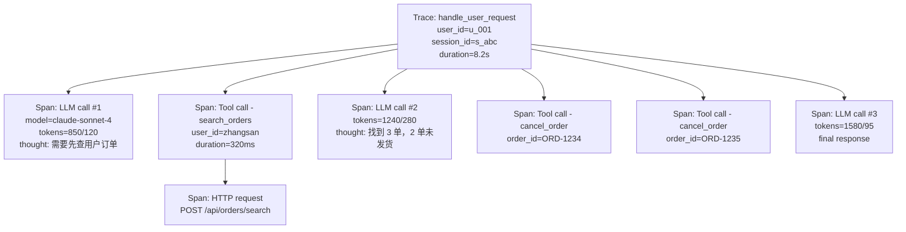
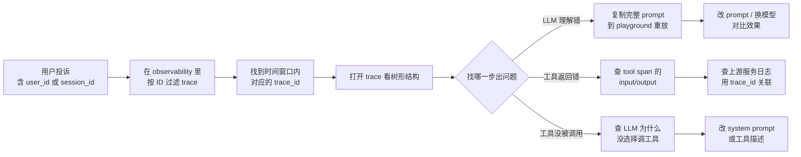

<section class="doc-hero">
  <p class="doc-hero__kicker">工程化</p>
  <h1>Agent 可观测性</h1>
  <p class="doc-hero__lead">Agent 是 N 步 LLM 调用 + M 次工具调用串起来的非确定性黑盒——出了问题没有 trace 就只能凭运气复现。这篇讲怎么用 trace/span 模型把执行过程结构化记下来、用哪家工具记、记什么不记什么、出问题怎么从日志反查到根因。</p>
  <div class="doc-hero__meta" aria-label="本文信息">
    <span>适合阶段：生产 Agent 必备</span>
    <span>核心：trace/span + 工具选型 + debug 工作流</span>
    <span>面试重点：和传统 APM 的差异 + PII 处理</span>
  </div>
</section>

> **本文边界**：聚焦**在线运行时**的 observability——trace 怎么打、metrics 怎么定、告警怎么配、用户投诉怎么反查。**离线评估**（SWE-bench / GAIA / 回归测试集）见 [评估体系](./evaluation)；**成本本身的优化策略**（缓存、模型切换、batch）见 [成本优化](./cost-optimization)；observability 在本文里是"采集成本数据的手段"，怎么用这些数据降本是另一篇的事。

## 面试官想考什么

读完这篇你要能正面回答下面这些题。每题后面括号里是面试官真正想看你答出什么。

<div class="interview-grid">
  <div>
    <strong>Agent observability 和传统服务可观测性差别在哪？</strong>
    <span>考能不能讲出非确定性输出、多步上下文、token 计费、prompt/response 全文留存这四类特殊性。</span>
  </div>
  <div>
    <strong>trace 和 span 模型怎么映射到 Agent 的执行过程？</strong>
    <span>考能不能把"一次用户请求 = 1 trace，每次 LLM/tool/retrieval 调用 = 1 span"这套层级讲清楚。</span>
  </div>
  <div>
    <strong>LangSmith / Langfuse / Phoenix / Helicone 怎么选？</strong>
    <span>考工具辨析能力——SaaS vs self-host、proxy vs SDK、生态绑定，能给出有理由的推荐。</span>
  </div>
  <div>
    <strong>用户投诉 Agent 答错了，从 observability 数据怎么定位？</strong>
    <span>考实战 debug 流程：从 user_id → session_id → trace → 重放 prompt 复现的完整链路。</span>
  </div>
  <div>
    <strong>PII（手机号、身份证、银行卡）出现在 prompt 里，trace 怎么处理？</strong>
    <span>考合规意识——脱敏在哪一层做、能不能丢、留多久。</span>
  </div>
  <div>
    <strong>observability 应该记什么？什么不能记？</strong>
    <span>考工程取舍——既不能 log 太少（debug 不了）也不能 log 太多（成本爆炸 + 合规风险）。</span>
  </div>
  <div>
    <strong>怎么把 observability 数据反哺到评估？</strong>
    <span>考闭环思维——生产 trace 怎么变成回归集、bad case 怎么进 dataset。</span>
  </div>
  <div>
    <strong>OpenTelemetry GenAI semantic conventions 解决什么问题？</strong>
    <span>考是否关注业界标准化——为什么需要跨工具的 schema，不绑死单家厂商。</span>
  </div>
</div>

---

## 为什么 Agent observability 不能照搬传统 APM

先看一个真实场景，理解为什么传统监控失灵。

某客服 Agent 上线第二天，用户投诉："我问订单状态，它说订单已退款，但我没退过款，账户里也没收到钱。"

按传统服务的 debug 思路：

1. 查这个用户的请求 → API gateway 日志显示 `200 OK`，latency 1.4s
2. 查后端服务日志 → 订单服务正常返回了订单数据，没有任何"退款"字样
3. 查数据库 → 订单状态确实是"未退款"

每一层都"正常"，但用户拿到了错的答案。**问题出在 LLM 把工具返回的 JSON 理解错了——但传统监控完全看不到这一层**。LLM 是个不可观测的黑盒，prompt 进去、response 出来，中间发生了什么没有任何日志。

更糟的是，LLM 是**非确定性**的——同样的 prompt 再跑一次，可能就答对了。你没办法靠"重放请求"复现 bug，必须把**当时那一次的完整 prompt、response、温度参数、模型版本**全部存下来，事后才能精确复盘。

这就是 Agent observability 要解决的根本问题。它和传统 APM（Datadog / New Relic / Skywalking 那一类）在四个维度上根本不同：

| 维度 | 传统 APM | Agent Observability |
|---|---|---|
| **输出确定性** | 同输入同输出，可重放 | 非确定性，必须保留当时全貌才能复盘 |
| **调用层级** | HTTP / RPC / DB，单次请求几层 | LLM call + tool call + retrieval，单次请求几十步 |
| **关键指标** | QPS / latency / 错误率 | + token 消耗 / 模型版本 / prompt 改动 / 工具失败率 |
| **数据留存** | 错误日志 + 采样链路 | prompt / response **全文** 留存（采样也要保留完整 content） |
| **成本** | 按请求计费 | 按 token 计费——成本由"读什么 prompt 写什么 response"决定 |

最反直觉的一点：传统 APM 链路只记 metadata（什么时间、什么服务、什么状态码），不记 payload；Agent observability 必须**记 payload 全文**——因为 prompt 和 response 本身就是问题根因。"latency 1.4s、status 200" 这种信息对调试 LLM 回答错误毫无帮助。

这件事的成本和合规含义都很重——后面专门讲怎么处理 PII 和数据量。

---

## 核心模型：trace 和 span

业界（不光是 Agent，整个分布式追踪）共识的两个抽象：

- **Trace**：一次完整请求/任务的全部活动。一个 trace 通常对应"用户的一次提问"或"Agent 跑完一个 task"。
- **Span**：trace 内的子单元。一次 LLM 调用是一个 span，一次工具调用是一个 span，一次向量检索也是一个 span。

span 之间有父子关系，构成一棵树（不是平铺的列表）。看一个 ReAct Agent 处理"帮我查张三的订单并取消未发货的"这个请求会产生的 trace 结构：



这个结构有几个关键点：

1. **trace 唯一 ID**：贯穿全程，所有 span 都挂在同一个 trace_id 下。用户投诉 → 找 user_id → 找 trace_id → 看完整执行图，是 debug 入口。
2. **span 的父子关系不是"调用栈"是"逻辑包含"**：LLM call #2 不是"在 search_orders 内部触发的"，它和 search_orders 都是 trace 的直接子 span。父子关系反映的是"谁包含谁"的语义边界。
3. **每个 span 都带 attributes**：metadata（model、duration、tokens）+ payload（input prompt、output content、tool args、tool result）。

trace 和 span 不是 Agent 领域发明的——OpenTelemetry 早就标准化了。但 Agent 领域有几个自己的 **span 类型**约定：

- `generation` / `llm` span：一次 LLM 调用。必带字段 model、input、output、usage（input/output tokens）、temperature、top_p
- `tool` span：一次工具调用。必带字段 tool_name、input args、output、是否成功
- `retrieval` span：一次向量库查询。必带字段 query、documents（含 score）
- `span`（generic）：其他业务逻辑，如"路由到 sub-agent"、"组装 prompt"

LangSmith、Langfuse、Phoenix 都支持这套类型——名字略有差异（Langfuse 叫 `generation`，Phoenix 叫 `LLM`），但模型本质一样。

---

## 该记什么 / 不该记什么

这是 Agent observability 最容易翻车的地方——log 太少 debug 不动，log 太多炸成本+踩合规雷。

### 必须记（无脱敏不可放弃）

每个 LLM span：

- **完整 prompt**——所有 system / user / assistant / tool message 的 content，不能截断
- **完整 response**——包括 tool_calls 字段和 content 字段
- **input/output token 数分开计**——按 token 算钱必须分开（output 通常贵 3-5 倍）
- **model 版本**——`claude-3-5-sonnet-20241022` 这种精确到日期的标签，不是 `claude-3.5-sonnet`
- **温度、top_p、max_tokens** 等 sampling 参数
- **latency 分解**——time-to-first-token + total duration

每个 tool span：

- **tool 名称 + 输入参数 JSON**
- **完整输出**（截断要明确标注 `...truncated`）
- **是否成功**（status: ok / error）+ **错误信息**（见 [工具错误处理](../tools/error-handling)）
- **duration**

trace 级别：

- **trace_id**（必备，UUID）
- **user_id**（脱敏的 ID 不是真名）
- **session_id**（同一对话的多个 trace 串起来）
- **conversation_id**（如果 session 内有多个独立对话）
- **环境**（prod / staging / dev）+ **app version** + **prompt template version**
- **business outcome**（如果有：用户最终是否点赞 / 反馈正确）

### 不能记 / 必须脱敏

- **PII 原文**——手机号、身份证、银行卡、家庭住址。**写入 trace 前先 mask**，不是事后清洗
- **密码 / token / API key**——任何认证凭据
- **超大二进制**——图片 base64、PDF 全文。把它们存对象存储，trace 里只记引用
- **过期数据**——GDPR / 《个人信息保护法》要求"目的限制 + 期限留存"，trace 默认 30-90 天就该归档/删除

### 脱敏在哪一层做

```python
# 反例：在 trace 写入后清洗
def cleanup_traces_later():
    """每天凌晨跑——清洗昨天的 trace 把手机号 mask 掉"""
    # 问题：从用户输入到清洗之间，原文已经在数据库里待了几小时
    # 期间任何泄露都是事故
    ...

# 正例：在写入 observability 系统之前 mask
def mask_pii(text: str) -> str:
    text = re.sub(r"1[3-9]\d{9}", "<PHONE>", text)
    text = re.sub(r"\d{17}[\dX]", "<ID_CARD>", text)
    text = re.sub(r"\b\d{16,19}\b", "<CARD_NO>", text)
    return text

# 写入 trace 时
langfuse.update_current_observation(
    input=mask_pii(user_message),
    output=mask_pii(model_response),
)
```

脱敏必须**前置到写入点**，不能事后处理。这条铁律不接受讨论——监管处罚都是按"原文有没有被存储"判的，不是按"最终是否清洗"判的。

### 边界 case

- "用户问'查我手机号尾号 1234 绑定的账户'，这个 1234 算 PII 吗？" → 不算，已经是用户自己 mask 过的版本。但要小心模型 response 可能补全成完整号码——response 也要过 mask。
- "tool result 返回的订单数据里有收货地址" → 必须 mask 或哈希。可以保留省/市级别，不能保留门牌号。
- "system prompt 里有公司内部的 prompt 模板，算商业机密吗？" → 公司内部 observability 系统记 OK，但选 SaaS 工具时要确认数据驻留和保密协议。

---

## 主流工具对比

四家最常见的工具，定位差别很大。**选错主要不是技术问题，是部署形态和成本结构错配**。

| 工具 | 部署形态 | 接入方式 | 开源 | 数据驻留 | 强项 |
|---|---|---|---|---|---|
| **LangSmith** | SaaS（自托管要 Enterprise） | LangChain 原生 + SDK | 否 | LangChain 服务器 | LangChain/LangGraph 深度集成、UI 最完善 |
| **Langfuse** | SaaS / Self-host 都支持 | SDK + decorator + OpenAI wrapper | 是（MIT） | 自己可控 | self-host 友好、用户最广、生态中立 |
| **Arize Phoenix** | 本地 / Self-host 为主 | OpenInference SDK + OpenTelemetry | 是（Elastic License） | 本地 | OTel 兼容、本地优先调试、和 Arize AX 互补 |
| **Helicone** | SaaS / Self-host | Proxy（改 base_url）或 async SDK | 是（Apache） | proxy 模式经过其服务器 | 零代码改动接入、按请求计费、和 OpenAI/Anthropic 兼容性最好 |
| W&B Weave | SaaS | SDK | 部分 | W&B 服务器 | 和 W&B 训练实验联动 |

实战推荐路径：

- **快速 POC、原型阶段** → LangSmith（如果已经用 LangChain）或 Helicone（如果直接调 OpenAI SDK，改一行 base_url 就接入）
- **生产 + 在意数据驻留 / 合规** → Langfuse self-host，Docker Compose 起一套，数据在自己服务器
- **重度调试、要看每一帧 attention 级别细节** → Phoenix 本地起，OpenTelemetry 兼容性最好
- **多模型多供应商 + 想做 prompt 管理** → Langfuse（prompt management 是它的强项）

**Helicone 的特殊性**：它是 proxy 模式，把 `api.openai.com` 换成 `oai.hconeai.com` 就行，零代码改动。代价是请求多走一跳网络（虽然他们做了边缘节点优化），且对 streaming / function calling 这种非常规请求形态偶尔会有兼容问题。**适合不想动业务代码的接入**。

**LangSmith vs Langfuse** 的核心差别：LangSmith 和 LangChain 生态绑死，trace 里能看到 LangChain runnable 的每一步——但你用的不是 LangChain 就没那么自然。Langfuse 是中立的 SDK 方案，OpenAI / Anthropic / LangChain / LlamaIndex 都能接，但 LangChain 内部细节看不到 LangSmith 那么深。**两家都用过的团队普遍反馈：LangChain 全家桶就 LangSmith，混合栈就 Langfuse**。

### OpenTelemetry GenAI semantic conventions

业界正在推一个跨工具的标准——[OpenTelemetry GenAI semantic conventions](https://opentelemetry.io/docs/specs/semconv/gen-ai/)。核心是规定 LLM span 的标准属性命名：

```
gen_ai.system           = "openai" / "anthropic" / "bedrock"
gen_ai.request.model    = "gpt-4o-mini"
gen_ai.request.temperature
gen_ai.usage.input_tokens
gen_ai.usage.output_tokens
gen_ai.response.id
gen_ai.response.finish_reasons
```

意义：**让你不绑死单家厂商**。如果所有工具都遵守这套 schema，今天用 Langfuse 明天换 Phoenix，trace 数据可以直接迁移。**Phoenix 是这套标准做得最彻底的**——它本身就是 OpenInference（OTel 的 GenAI 扩展）发起方。

短期看 GenAI 工具市场还很乱，标准化是个进行中的过程。**长期投入应该看 OTel 兼容性**，不要让自己的代码深度绑定单家 SDK。

---

## 实战：用 Langfuse decorator 接入一个 ReAct Agent

下面这段 50 行能跑的代码，演示怎么把一个简化版 ReAct Agent 的完整执行过程接入 Langfuse。

```python
import os
from langfuse import observe, get_client
from langfuse.openai import openai  # 自动追踪 OpenAI 调用的 wrapper
import json
import re

os.environ["LANGFUSE_PUBLIC_KEY"] = "pk-lf-..."
os.environ["LANGFUSE_SECRET_KEY"] = "sk-lf-..."
os.environ["LANGFUSE_HOST"] = "https://cloud.langfuse.com"  # self-host 改这里

langfuse = get_client()


def mask_pii(text: str) -> str:
    """写入 trace 前的脱敏——脱敏必须前置"""
    text = re.sub(r"1[3-9]\d{9}", "<PHONE>", text)
    text = re.sub(r"\d{17}[\dX]", "<ID>", text)
    return text


@observe(as_type="tool")  # tool span
def search_orders(user_id: str) -> dict:
    langfuse.update_current_observation(
        input={"user_id": mask_pii(user_id)},
        metadata={"backend": "order_service_v2"},
    )
    # 模拟工具调用
    result = {"orders": [
        {"id": "ORD-1234", "status": "shipped"},
        {"id": "ORD-1235", "status": "pending"},
    ]}
    langfuse.update_current_observation(output=result)
    return result


@observe()  # 普通 span
def react_step(messages: list) -> dict:
    # 直接用 langfuse.openai 包装的客户端——LLM call 会自动成为 generation span
    # 自动记录 model / input / output / usage / latency
    resp = openai.chat.completions.create(
        model="gpt-4o-mini",
        messages=messages,
        tools=[{
            "type": "function",
            "function": {
                "name": "search_orders",
                "parameters": {"type": "object",
                               "properties": {"user_id": {"type": "string"}}},
            },
        }],
    )
    return resp


@observe()  # 顶层 trace
def handle_request(user_id: str, query: str):
    # 给 trace 打上业务标识——debug 时按 user_id / session_id 反查
    langfuse.update_current_trace(
        user_id=user_id,
        session_id=f"session-{user_id}",
        tags=["customer_service", "prod"],
        input=mask_pii(query),
    )

    messages = [{"role": "user", "content": query}]
    for _ in range(5):  # 防死循环
        resp = react_step(messages)
        msg = resp.choices[0].message
        if not msg.tool_calls:
            langfuse.update_current_trace(output=mask_pii(msg.content))
            return msg.content
        # 执行 tool call
        for call in msg.tool_calls:
            args = json.loads(call.function.arguments)
            result = search_orders(**args)
            messages.append(msg.model_dump())
            messages.append({"role": "tool", "tool_call_id": call.id,
                             "content": json.dumps(result)})


if __name__ == "__main__":
    handle_request(user_id="u_001", query="帮我看一下我的订单")
    langfuse.flush()  # 进程退出前 flush，防止 trace 丢失
```

跑完这段代码，去 Langfuse UI 能看到完整的树形 trace：一个顶层 `handle_request`，下面挂着多个 `react_step`（每个里面是一次 OpenAI 调用 + 完整 messages + token 数 + 成本），以及 `search_orders` tool span。点开任意 span 能看到那一刻的完整 input/output。

代码里有几个关键模式值得记：

- **`@observe(as_type="tool")`** 显式标记 span 类型，让 UI 知道按 tool 渲染（不是当 LLM 处理）
- **`langfuse.openai`** 这个 wrapper 自动捕获 OpenAI 调用，不需要手动写 `update_current_observation`——这是接入成本最低的方式
- **`update_current_trace`** 在顶层加 user_id/session_id——debug 反查的入口都是这两个 ID
- **`langfuse.flush()`** 必须在进程退出前调用，否则异步上报的 trace 会丢

Phoenix 的接入更简洁（用 OpenInference auto-instrumentation 一行 `OpenAIInstrumentor().instrument()` 就完事），但需要本地起 Phoenix server；LangSmith 则是 LangChain 用户的默认选择，环境变量配上 `LANGCHAIN_TRACING_V2=true` 自动追踪。

---

## 监控指标体系

trace 是给 debug 用的，但生产还要看**聚合指标**。常见的 Agent 监控 dashboard 至少包含这几块。

### 业务指标

- **成功率**——多少 trace 走到最终回答没崩。崩的定义：异常、强制终止、用户在中途放弃
- **平均回合数**——单次任务的平均步数。突然涨说明 Agent 在绕弯（可能 prompt 退化或工具失败率上升）
- **用户反馈率**（点赞/点踩）——绑定到 trace_id 的二元反馈，最直接的质量信号

### 性能指标

- **端到端 latency P50/P95/P99**——重点看 P95，平均值会被偶发慢请求拉走
- **time-to-first-token (TTFT)**——streaming 场景比 total 更影响体感
- **每步 LLM latency 分布**——看模型供应商是不是在抖

### 成本指标

- **每天 / 每小时总 token 消耗**（input / output 分开）
- **per-session cost**——把同 session_id 的 trace 成本加起来，看长会话成本曲线
- **per-user cost top N**——找出"重度用户"是不是异常或薅羊毛

### 工具调用指标

- **工具失败率**——按工具名分组。某个工具失败率突然涨说明上游服务出问题
- **平均工具调用次数 per trace**
- **死循环检测计数**——前面 [工具错误处理](../tools/error-handling) 讲过的 `repeated_call_blocked` 触发次数

### 质量指标（需要离线评估配合）

- **抽样 trace 跑 LLM-as-Judge 评分**——每天抽 1% trace 跑 [LLM-as-Judge](./llm-judge) 打分
- **回归测试通过率**——固定测试集每次 prompt/model 变更后跑一遍

**核心原则**：质量指标和性能指标要**分开看**。延迟好但答案错没意义，准确率高但每次 30 秒也不能上线。Agent 的健康需要两个维度都达标。

---

## 告警设计

不是所有指标都该告警——告警太多 = 没告警。建议的告警三层：

**P0（立刻 page）**：
- 总错误率 5 分钟窗口 > 5%
- 总流量 5 分钟跌 80%（用户进不来或者上游挂了）
- 单 session token 消耗 > 历史 P99 的 5 倍（防止 prompt 失控烧钱）

**P1（小时级 oncall）**：
- 工具失败率（按工具）> 30%，持续 15 分钟
- P95 latency > 历史基线 2 倍，持续 30 分钟
- 用户负反馈率（点踩 / 总反馈）24 小时窗口 > 历史均值 + 2σ

**P2（早晚报）**：
- 日 token 消耗超预算
- 单用户日成本 top N 列表
- LLM-as-Judge 抽样得分滑动平均下滑

**阈值设定的两个坑**：

1. **冷启动期不要急着设静态阈值**——上线第一周观察数据再定。直接用脑补阈值会要么疯狂告警要么完全不响
2. **告警要带"建议动作"**——不是 `Tool failure rate high` 就完了，要 `Tool failure rate high (search_papers, 40% in last 15min). Likely upstream issue. Check order-service status page.`

---

## Debug 工作流：从投诉到根因

最有价值的 observability 不是 dashboard，是**反查的链路**。把用户投诉变成精确定位的过程：



具体步骤拆开看：

**Step 1：拿到投诉的最少信息**——user_id 或 session_id 或 timestamp。要让客服在工单系统里能一键复制（前提是你的前端把这些 ID 暴露出来或者放进客服后台）。

**Step 2：在 observability 平台过滤 trace**——按 user_id + 时间窗口拉 trace 列表。Langfuse / LangSmith 的 UI 都支持这种过滤。

**Step 3：打开可疑 trace**——看树形执行图。一眼能看出"这次跑了几步"、"哪一步最慢"、"哪个工具失败了"。

**Step 4：定位出错的 span**——

- 如果是 LLM 理解错：复制完整 messages（含 system / tools schema）到 Anthropic Console 或 OpenAI playground 重放。用同样的 model / temperature，能复现说明是 prompt 设计问题；不能复现说明是 LLM 的偶发抖动。
- 如果是 tool 返回错：tool span 的 output 里能看到原始返回。继续上钻——`tool span` 里通常有 backend 服务的 trace_id（如果你打了），用它去 Datadog / Skywalking 看后端日志。
- 如果是 LLM 该调工具但没调：看那次 LLM call 的 prompt——tool schema 是不是描述模糊、system prompt 是不是没强调"必须用工具"、temperature 是不是太高。

**Step 5：可重复复现 → bad case 入库**——把这个 trace 的输入加进回归测试集（[evaluation.md](./evaluation) 里的 dataset）。修复后用这个 case 验证不再出错。这是把 observability 反哺评估的关键动作。

**真实案例**（Langfuse 自己的 blog 提过类似流程）：某团队的 RAG Agent 偶尔答非所问。从投诉 trace 看到，retrieval span 召回的 top-3 文档相关度都很低（score 0.4-0.5），但 LLM 仍然硬答了。根因是 retrieval 阈值没设——任何相关度都进 prompt。修复后召回 score < 0.6 直接告诉用户"没找到相关资料"，准确率从 78% 涨到 91%。**没有 retrieval span 的 score 字段记录，这个根因可能要查一周**。

---

## 把 observability 反哺到评估

这是个常被忽略但巨大的杠杆。生产 trace 是**最真实的测试集来源**——它代表真实用户输入分布，比合成数据靠谱得多。

闭环长这样：

```
生产 trace → 抽样标注（人工或 LLM-as-Judge）
            ↓
        bad case 入 dataset
            ↓
        prompt / model 改动后跑 dataset
            ↓
        看回归测试指标
            ↓
        通过 → 灰度上线
            ↓
        新 trace 继续抽样 → ...
```

LangSmith / Langfuse 都有内置功能支持这个闭环：

- **Langfuse Datasets**：从 trace 直接"加入 dataset"按钮，把 input/output 存进可复用的测试集
- **LangSmith Datasets + Annotation Queues**：把待标注 trace 推送给标注员，标注完直接入 dataset
- **Phoenix Datasets**：本地保存的 dataset，可以和实验框架联动跑评估

**为什么 trace → dataset 是关键**：合成 dataset 永远跟不上真实分布。用户会问的奇葩问题（错别字、缩写、跨语种混用、长尾意图）只有生产能采到。**Agent 的 long tail 失败几乎全在生产数据里**，离线 dataset 是补不齐的。

---

## 常见陷阱

### 陷阱 1：log 太多，trace 数据膨胀失控

**现象**：上线一周后，observability 存储成本超过 LLM API 成本。每个 trace 几十 MB（因为把 retrieval 返回的全部文档原文都存进去了）。

**根因**：不加节制地把所有 tool result 全文塞进 span。RAG 召回的 10 个 chunk 每个 2KB 就是 20KB；如果 trace 里有 5 次 retrieval，单 trace 100KB 起步。

**修法**：
- 大文本（retrieval 文档、tool 返回的长 JSON）存对象存储（S3），span 里只存引用 + 摘要
- 设 span attribute 单字段最大长度（如 64KB），超长截断并标记 `truncated: true`
- 采样：错误 trace 100% 留，成功 trace 按比例采（如 10%）。Phoenix 和 LangSmith 都支持采样配置

### 陷阱 2：log 太少，关键信息缺失

**现象**：用户投诉 Agent 回答错，去查 trace 发现只记了"调用 LLM、返回 response"，没记 prompt 全文——debug 不动。

**根因**：用了 observability 但只接入了"骨架"——记了 metadata 没记 payload。常见于把传统 APM 思路套到 Agent 上，习惯性认为"prompt/response 是 PII 风险不该记"。

**修法**：
- prompt 和 response 全文必须记——这是 Agent observability 的根本。PII 风险用脱敏解决（前面专门讲过），不是不记
- model 版本必须精确到日期标签（`claude-3-5-sonnet-20241022` 不是 `claude-3.5-sonnet`）——模型在小版本间会有质量波动
- temperature / top_p 必须记——不可重复实验的关键

### 陷阱 3：没脱敏，PII 直接进 SaaS

**现象**：合规 audit 时被查到——LangSmith / Langfuse Cloud 的服务器上存了用户的真实手机号、银行卡号原文。

**根因**：开发时为了图省事，直接 `langfuse.update_observation(input=user_message)`，没经过脱敏层。

**修法**：
- 写入 trace 前**强制经过 mask 层**——做成中间件，业务代码不允许绕过
- SaaS 工具要确认数据驻留区域（欧盟用户的数据是不是落在欧盟）和 DPA（数据处理协议）
- 合规要求严格的场景（金融 / 医疗 / 政务）必须 self-host——LangSmith Enterprise / Langfuse self-host / Phoenix local

### 陷阱 4：trace 断开，串不起来

**现象**：用户的一次对话发了 5 条消息，但在 observability 平台上是 5 个互不关联的 trace——没法看到对话连续性。

**根因**：没有传递 `session_id`，每次请求都是独立 trace。

**修法**：
- 每个用户对话有一个 `session_id`（前端生成或后端首次响应时分配），后续所有请求带上
- LangSmith 用 `session_id` 字段、Langfuse 用 `update_current_trace(session_id=...)`、Phoenix 用 OTel 的 trace baggage
- 跨服务调用时通过 HTTP header 传递（标准是 `traceparent`）

### 陷阱 5：trace 是异步上报，进程退出时丢

**现象**：在 lambda / serverless 里用了 observability SDK，本地测试一切正常，生产上发现一半 trace 丢失。

**根因**：observability SDK 通常是异步 batch 上报——攒一批一起发，省网络开销。lambda 处理完请求就死了，没等 batch flush，trace 就丢了。

**修法**：
- lambda / serverless 必须在 handler 返回前 `flush()`：`langfuse.flush()` / `phoenix.flush()`
- 长进程退出前要捕获信号 flush（SIGTERM / SIGINT）
- 不确定时降低 batch 间隔（如从 5 秒改 1 秒），代价是更多网络调用

### 陷阱 6：把 observability 数据当真相，没意识到采样

**现象**：基于 dashboard 报告"工具失败率 2%"，实际数据库查出来是 15%——决策完全错。

**根因**：observability 平台为了控成本默认采样（如 10%）。低频错误在采样数据里被严重低估。

**修法**：
- 关键 metrics（成功率、错误率）通过**独立的 metrics 通路**（Prometheus / Datadog）记录，不依赖 observability 平台的采样数据
- 错误 trace 100% 留存（即使整体采样 10%）
- 定期 cross-check：从业务数据库查的真实统计 vs observability 平台的数据，差异 > 5% 就要查为什么

---

## 与相邻概念的关系

| 概念 | 关注点 | 时机 |
|---|---|---|
| **Observability（本文）** | 运行时全过程记录 + 反查 | 在线，事中 + 事后 |
| **[评估 Evaluation](./evaluation)** | 离线测试集 + 指标 | 离线，迭代时 |
| **[成本优化](./cost-optimization)** | 减少 token / 缓存 / 模型切换 | 离线决策，在线生效 |
| **[安全 Security](./security)** | 攻击防御 / 注入检测 | 全程 |
| **[工具错误处理](../tools/error-handling)** | 错误怎么传给模型 | 事中 |
| **[Reflexion](../agent/reflexion)** | 失败后反思学习 | 事后 |

关键辨析：

- **Observability ≠ Evaluation**：前者是"看到了什么"，后者是"判断好不好"。Observability 提供原始数据，Evaluation 提供判断标准。两者经常一起用——抽样 trace 跑 LLM-as-Judge 评分。
- **Observability vs APM**：Observability 是 APM 的超集——APM 关注服务级 metrics，Observability 关注完整执行图。Agent 场景 APM 不够用。
- **Observability vs Logging**：日志是非结构化的文本流，trace 是结构化的层级数据。Agent 必须用 trace 不能只用 log——多步 LLM 调用的因果关系日志根本表达不出来。

---

## 面试题深度解析

### Q: Agent observability 和传统服务可观测性差别在哪？

**30 秒版本**：四个根本差别。**(1) 输出不确定**——LLM 同输入不同输出，必须留存当时的完整 prompt/response/sampling 参数才能复盘，不能靠重放请求。**(2) 调用层级深且非传统**——单次请求里几十个 LLM call + tool call + retrieval 串成树，传统 APM 的 service-level 视图根本不够。**(3) 关键指标多了 token 维度**——按 token 计费，必须分别统计 input/output token、精确到模型版本，传统的"QPS+latency+错误率"完全不够。**(4) 必须记 payload 全文**——prompt 和 response 本身就是问题根因，"200 OK, 1.4s" 这种 metadata 没用。这四点决定了不能照搬 Datadog 那套，必须有 LLM 原生的工具。

**追问**：那 OpenTelemetry 完全没用了？
不是没用，是要扩展。OTel 的 trace/span 模型是合适的（树形层级、跨服务串联都是它的强项），但 GenAI 的 span 类型和属性需要额外约定——所以才有 [OpenTelemetry GenAI semantic conventions](https://opentelemetry.io/docs/specs/semconv/gen-ai/) 这套规范。Phoenix 的 OpenInference 就是 OTel + GenAI 扩展的实现。**业界共识是 OTel 做底座，GenAI 做专属语义**——不是另起炉灶。

**追问**：那像 Datadog 这种传统 APM 厂商在做什么应对？
Datadog 在 2024 年推了 LLM Observability 功能，本质就是在自己的 APM 上加 GenAI semantic conventions 支持。同期 New Relic、Dynatrace 也跟进了。**结论**：未来 Agent observability 不会和传统 APM 完全分家——会演变成"APM 全家桶 + GenAI 专属插件"的形态。但短期内 Langfuse / LangSmith 这类专门工具的 UI 和 LLM 调试体验仍然领先 1-2 个身位。

### Q: 用户投诉 Agent 答错了，从 observability 数据怎么定位？

**30 秒版本**：四步反查。**(1) 拿到 user_id 或 session_id 或 timestamp**——客服工单系统应该把这些 ID 暴露给用户支持团队。**(2) 在 observability 平台过滤 trace**——按 ID + 时间窗口查到具体那一次 trace。**(3) 打开 trace 看执行树**——快速判断是 LLM 理解错、tool 返回错、还是 tool 该调没调。**(4) 重放复现**：LLM 错就把完整 prompt 复制到 playground 重跑；tool 错就用 tool span 里的 backend trace_id 上钻到后端服务日志查根因；该调没调就看 system prompt 和 tool description 是不是模糊。修复后这个 trace 进回归测试集——把单次投诉变成长期资产，这是闭环。

**追问**：如果是 LLM 抖动（同 prompt 两次结果不一样）怎么办？
两个动作。**一是降低不确定性**——把 temperature 调低（关键决策 step 设 0 或 0.1）、top_p 收紧、用 deterministic sampling 工具（Anthropic 现在有 token 级别的 fingerprint）。**二是设容错**——关键回答经过 self-consistency 多采样投票，或者用更稳的小模型先做意图判断、大模型只负责文本生成。但要承认：**LLM 完全消除抖动是不可能的**，目标是把抖动率压到业务可接受范围（比如 < 0.5%）。

**追问**：投诉过来 2 周了，trace 已经被归档怎么办？
这就是为什么留存策略要规划好。建议分层：**热数据 7 天**（最频繁查询，按 metadata 全索引）→ **温数据 30 天**（按 user_id / session_id 仍可查）→ **冷数据 90 天**（归档到对象存储，按需还原）。超过 90 天通常合规要求删除。所以**用户投诉的响应窗口期要短**——SLA 设定时考虑 trace 留存期，超期投诉只能定性分析（依赖业务数据库本身的订单/对话表）。

### Q: PII 在 trace 里怎么处理？

**30 秒版本**：**脱敏必须前置到写入点**，不能事后处理。具体做成中间件：业务代码调 `observability.update(input=...)` 之前，强制经过 PII 检测层（正则 + NER），手机号 / 身份证 / 银行卡 / 邮箱替换成占位符（`<PHONE>` / `<ID>` / `<CARD>`）。LLM 的 response 也要 mask——模型可能根据上下文补全完整号码。**不能依赖事后清洗**——监管处罚按"原文有没有被存储过"判，不是按"最终是否清洗"。合规要求严的场景（金融 / 医疗 / 政务）必须 self-host（Langfuse self-host / LangSmith Enterprise / Phoenix local），不能用任何 SaaS。留存期按 GDPR / 《个保法》设上限（30-90 天），超期归档或删除。

**追问**：正则 mask 不够覆盖所有 PII 怎么办？比如人名、地址。
分层。**第一层正则**——已知格式（手机号、身份证、卡号、邮箱）覆盖 70-80%。**第二层 NER 模型**——跑一个轻量 NER（如 spaCy 或 Microsoft Presidio）识别人名、地址、组织名等结构化弱的 PII。**第三层 LLM 兜底**——可疑场景用便宜 LLM（gpt-4o-mini）跑分类，但成本要算清楚（每条都跑会让 observability 成本翻倍）。生产里通常一二层即可，加业务规则白名单（比如客服场景知道哪些字段必然是地址）。

**追问**：脱敏后 debug 时怎么知道原文？
这是设计取舍。两种方案。**方案 A：完全脱敏，原文不存**——最安全但 debug 受限，遇到"为什么这个手机号被识别成那个用户"的问题就查不动。**方案 B：脱敏存 trace + 加密存原文映射**——trace 里存 `<PHONE_001>`，单独有个加密 KV 表存 `PHONE_001 → 13800138000`。只有授权人员（带审计的）能解。生产推荐方案 B，但实现复杂度高、要走法务流程。**多数团队的现实选择是方案 A + 业务数据库做交叉验证**——trace 知道"哪个用户"（用 user_id），具体 PII 去业务数据库查。

### Q: 怎么把 observability 数据反哺到评估？

**30 秒版本**：**抽样标注 → bad case 入 dataset → 回归测试**。具体闭环：(1) 每天从生产 trace 按比例抽样（比如 1%）；(2) 抽样数据跑 [LLM-as-Judge](./llm-judge) 或人工标注，识别 bad case；(3) bad case 的 input 加进 [evaluation](./evaluation) 的回归 dataset；(4) prompt / model 任何改动前用这个 dataset 跑一遍，看通过率有没有退步；(5) 上线后新 trace 继续抽样。LangSmith 和 Langfuse 都内置了 "trace → dataset" 的一键操作。**核心价值**：生产 trace 代表**真实用户分布**，远比合成 dataset 靠谱。Agent 的 long tail 失败几乎全在生产里——错别字、缩写、跨语种混用、奇葩意图，离线 dataset 补不齐的。

**追问**：抽样 1% 够吗？怎么定？
看绝对量。**日 trace 量 10K 以下**——错误 trace 100% 留 + 成功 trace 全留（成本可控）。**10K-1M**——错误 100% + 成功按业务关键度分层采样（核心场景 10%，长尾 1%）。**1M+**——错误 100% + 成功 0.1-1% + 头部高价值用户（VIP / 高 ARPU）专属留全。**重点：错误绝不采样**——错误 trace 的价值是绝对正向的，它最稀缺。

**追问**：标注成本太高怎么办？
三层降本。**(1) LLM-as-Judge 兜底大部分**——用 GPT-4o 或 Claude Sonnet 判 trace 答案是不是合理，比人工便宜 100 倍。准确率约 75-85%，对粗筛够用。**(2) 人工只标 Judge 分歧 case**——LLM Judge 输出低置信度（如分数 4-6 分中间段）的才进人工队列，节省 80% 人力。**(3) 用户反馈直接当标签**——点赞 = positive、点踩 = negative，零成本但稀疏。生产实战里三层叠加，标注成本能控制在合理范围。

---

## 延伸阅读

- **Langfuse Documentation** ([langfuse.com/docs](https://langfuse.com/docs))
  开源 LLM observability 标杆。重点读 SDK 的 `@observe` decorator 部分和 prompt management 部分——这两块设计影响了行业其他工具。self-host 版本可以本地 docker compose 起一套体验完整功能。

- **LangSmith Documentation** ([docs.smith.langchain.com](https://docs.smith.langchain.com))
  LangChain 生态默认选择。重点读 "Tracing Concepts" 和 "Datasets and Evaluation"——LangSmith 把 trace 和 evaluation 串成闭环这件事做得最早，工程模式可以照搬。

- **Arize Phoenix Documentation** ([docs.arize.com/phoenix](https://docs.arize.com/phoenix))
  本地优先 + OpenTelemetry 原生。读 OpenInference 那一节——为什么要把 GenAI 接入 OTel 标准、跨工具数据迁移的实际收益。

- **OpenTelemetry GenAI Semantic Conventions** ([opentelemetry.io/docs/specs/semconv/gen-ai](https://opentelemetry.io/docs/specs/semconv/gen-ai/))
  业界标准化的尝试。读这个是为了理解未来方向——你今天写的 instrumentation 代码如果对齐这套 schema，三年后换工具不用重写。

- **Helicone Documentation** ([docs.helicone.ai](https://docs.helicone.ai))
  Proxy 模式 observability 的代表。读它的 "Proxy vs Async" 对比——理解 proxy 接入的零代码改动优势和潜在的性能/兼容风险。

- **博客：How Anthropic uses Claude Code** ([anthropic.com/news/how-anthropic-teams-use-claude-code](https://www.anthropic.com/news/how-anthropic-teams-use-claude-code))
  Anthropic 内部团队的 dogfooding 文章。重点看他们怎么把 Claude Code 的执行 trace 做成可调试的——长 session Agent 的 observability 实战。

- **博客：Building Effective Agents** ([anthropic.com/engineering/building-effective-agents](https://www.anthropic.com/engineering/building-effective-agents))
  Anthropic 工程团队的 Agent 设计指南。observability 不是单独章节，但贯穿全文——任何 Agent 模式都讨论了"怎么观察它在做什么"。

- **配套阅读**：
  - [评估体系](./evaluation) — 离线评估和 observability 的闭环，生产 bad case 怎么变成 dataset
  - [成本优化](./cost-optimization) — observability 数据是降本决策的基础
  - [安全 Security](./security) — observability 既是安全工具（攻击检测）也是安全风险（PII 留存）
  - [工具错误处理](../tools/error-handling) — error 是 observability 数据的重要部分
  - [Agent Loop](../agent/agent-loop) — agent loop 的每一步都对应 trace 里的一个 span
  - [Prompt 模板](../prompt/templates) — prompt 版本管理是 observability 的关键维度
