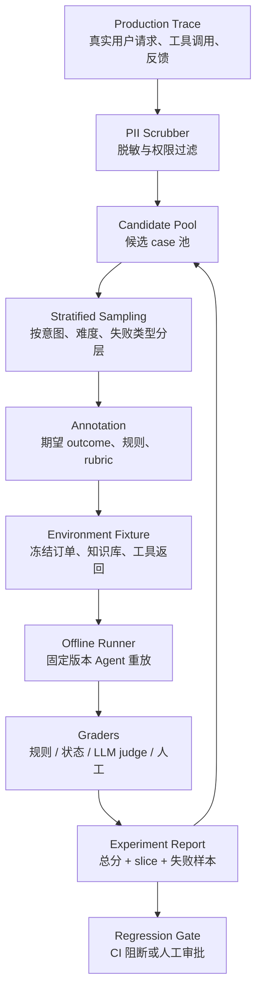

<section class="doc-hero">
  <p class="doc-hero__kicker">Agent 工程化</p>
  <h1>Agent 离线评测数据集：把线上 badcase 变成回归测试</h1>
  <p class="doc-hero__lead">Agent 评测最难的不是跑一个分数，而是把真实业务里的用户、工具、状态和成功标准冻结成一批可重复执行的任务。</p>
  <div class="doc-hero__meta" aria-label="本文信息">
    <span>适合阶段：生产 Agent / 上线前回归</span>
    <span>核心：trace 采样 + 状态判分 + grader 校准</span>
    <span>面试重点：数据构建 + 评测可信度 + badcase 闭环</span>
  </div>
</section>

> 离线评测不是“攒一堆问题问模型”，而是把真实任务封装成可重放、可判分、可比较的实验。

> **本文边界**：整体 benchmark 和 SWE-bench / GAIA / τ-bench 的横向对比见 [评估体系](./evaluation)；LLM-as-judge 的 position bias、verbosity bias 和校准细节见 [用模型评估模型](./llm-judge)；线上 trace、feedback、告警见 [可观测性](./observability) 和 [Agent 线上质量治理](./agent-quality-interview)。本文只讲一件事：怎么构建一套业务自己的离线评测数据，并判断它有没有用。

## 面试官想考什么

读完这篇你要能正面回答下面这些题。每题后面括号里是面试官真正想看你答出什么。

<div class="interview-grid">
  <div>
    <strong>Agent 离线评测集应该从哪里来，为什么不能全靠人工编题？</strong>
    <span>考真实分布意识：生产 trace、失败 case、人工边界样本、合成样本各自怎么占比。</span>
  </div>
  <div>
    <strong>一个 eval case 里必须存哪些字段？只存用户问题够不够？</strong>
    <span>考能不能把输入、环境 fixture、期望 outcome、判分规则、metadata 分开。</span>
  </div>
  <div>
    <strong>客服退款 Agent 怎么做离线评测，判分看回复文本还是数据库状态？</strong>
    <span>考 outcome-based grading：Agent 说“已退款”不算，订单状态真的变了才算。</span>
  </div>
  <div>
    <strong>怎么证明这个评测集能发现真实回归，而不是只给团队制造幻觉？</strong>
    <span>考评测有效性：覆盖率、A/A 噪声、grader-human agreement、已知回归注入。</span>
  </div>
  <div>
    <strong>LLM judge 和规则判分怎么组合？哪些地方必须用 deterministic grader？</strong>
    <span>考分层判分能力：状态、工具、格式用规则，语义质量才交给 judge。</span>
  </div>
  <div>
    <strong>评测分数从 86% 升到 88%，该不该上线？</strong>
    <span>考统计意识：置信区间、重复 trial、slice 分析和业务风险比单点分数重要。</span>
  </div>
  <div>
    <strong>评测集跑到 98% 通过率，是好消息还是坏消息？</strong>
    <span>考 saturation：能守回归但不再区分进步，要补更难的新任务。</span>
  </div>
  <div>
    <strong>怎么防止团队过拟合自己的离线评测集？</strong>
    <span>考数据版本、holdout、私有集、在线反馈回流和人工抽查。</span>
  </div>
</div>

---

## 为什么需要离线评测数据

看一个客服 Agent 的真实失败形态。

用户说：“我上周买的耳机还没发货，帮我取消并退款。”

Agent 回复：“已为你取消订单，退款会在 3 个工作日内到账。” 这句话看起来没问题，客服语气也很稳。线上投诉来了以后，工程师查 trace 才发现：

```text
tool.search_orders(email="user@example.com")
→ 返回 2 个订单：ORD-1001 耳机，ORD-1002 手机壳

tool.cancel_order(order_id="ORD-1002")
→ 成功

final_response
→ “已为你取消耳机订单”
```

回复文本和用户意图对齐，真实状态却错了。用户要退耳机，Agent 退了手机壳。这个 case 用“回答是否礼貌”“有没有提到退款”都判不出来，必须重放当时的订单数据库、工具结果和业务规则，然后检查最终状态。

这就是离线评测集的价值：把一次线上事故变成以后每次发版都要过的回归测试。没有这层，团队只能靠“我感觉新 prompt 好像更稳”推进；有了这层，每个 prompt、模型、工具 schema、RAG 策略的改动都能在固定任务集上比较。

Anthropic 在 [Demystifying evals for AI agents](https://www.anthropic.com/engineering/demystifying-evals-for-ai-agents) 里把 Agent eval 拆成 `task`、`trial`、`grader`、`transcript`、`outcome`、`evaluation harness` 几个部件。这个拆法很适合生产系统：任务不是一个孤立 query，而是“输入 + 环境 + 期望结果 + 判分器”的包。

Sierra 的 [τ-bench](https://sierra.ai/blog/benchmarking-ai-agents) 也给了同一个启发：客服类 Agent 的判分最好看最终数据库状态，而不是只看对话文本。它把 airline / retail 场景做成带 API、policy、用户模拟器和目标状态的环境，最后比较任务结束后的 database state 和 expected outcome。这套思想可以直接搬到你自己的业务评测里。

---

## 离线评测集怎么跑

离线评测集的流水线长这样：



每一层都解决一个具体问题：

| 层 | 要做什么 | 如果省掉会怎样 |
|---|---|---|
| Trace 采样 | 从真实流量和 badcase 里拿任务 | 评测集变成“员工想象中的用户问题” |
| PII 脱敏 | 去掉手机号、地址、订单敏感字段 | 评测集无法进 CI，也不能给外部模型 judge |
| 分层抽样 | 覆盖高频、长尾、失败、边界场景 | 100 个 case 全是简单问答，分数虚高 |
| 标注 outcome | 写清楚最终状态和成功标准 | Judge 只能凭感觉打分 |
| 冻结环境 | 固定工具返回、数据库、时间 | 今天能过，明天因为外部 API 变了不过 |
| 多 grader | 状态、工具、文本、合规分开判 | 一个总分解释不了失败原因 |
| 实验报告 | 看总分、slice、方差、失败 trace | 分数涨跌无法转成工程动作 |

离线评测的关键不是“离线”两个字，而是 **可重放**。同一个 case 在 `agent-v1`、`agent-v2`、`new-tool-schema`、`new-model` 上运行时，除了被测对象变化，其他东西尽量不变。

---

## 核心设计

### 1. Case 不是问题，而是任务合同

一个合格的 case 至少要包含四块：输入、环境、期望结果、判分规则。

```json
{
  "id": "refund_pending_order_042",
  "category": "refund",
  "difficulty": "medium",
  "source": "production_badcase",
  "input": {
    "user_id": "u_203",
    "message": "我上周买的耳机还没发货，帮我取消并退款",
    "session_history": []
  },
  "fixture": {
    "now": "2026-07-07T10:00:00+08:00",
    "orders": [
      {"id": "ORD-1001", "user_id": "u_203", "item": "耳机", "status": "paid_not_shipped"},
      {"id": "ORD-1002", "user_id": "u_203", "item": "手机壳", "status": "paid_not_shipped"}
    ]
  },
  "expected_outcome": {
    "orders": {
      "ORD-1001": {"status": "cancelled", "refund_status": "requested"},
      "ORD-1002": {"status": "paid_not_shipped"}
    }
  },
  "success_criteria": [
    "必须取消 ORD-1001",
    "不得修改 ORD-1002",
    "回复中不能承诺实时到账",
    "如果订单已发货，必须走退货流程而不是取消流程"
  ],
  "tags": ["multi-order", "similar-items", "stateful-tool"]
}
```

面试里如果你只说“准备一些用户 query，然后人工标标准答案”，基本会被追问打穿。Agent 的行为会改变环境，评测集必须把环境也冻结下来。

### 2. 数据来源要分层，不能平均用力

我会按下面这个比例起步，后面根据线上分布调整：

| 来源 | 初始占比 | 价值 | 风险 |
|---|---:|---|---|
| 真实生产 trace | 40% | 分布最真，能代表主路径 | 需要脱敏和权限审批 |
| 历史失败 / 用户投诉 | 30% | 直接防回归，最能发现产品痛点 | 容易过度代表极端 case |
| 人工边界样本 | 20% | 覆盖安全、政策、权限、异常工具返回 | 写得太“测试味”，不像真实用户 |
| 合成数据 | 10% | 便宜补长尾，适合扩 category | 质量参差，不能当 gold truth |

LangSmith 的 [Evaluation docs](https://docs.langchain.com/langsmith/evaluation) 也把 dataset 来源拆成 manually curated test cases、historical production traces 和 synthetic data generation。Braintrust 的 [Datasets docs](https://www.braintrust.dev/docs/annotate/datasets) 强调 datasets 要版本化，并且可以从 production logs、user feedback、manual curation 或生成流程构建。这两个文档背后的共识是：真实流量是地基，人工和合成只是在补洞。

### 3. 判分器要贴着 outcome，而不是绑死路径

不要要求 Agent 必须按某个工具调用顺序走：

```text
错误判分：第 1 步必须 search_orders，第 2 步必须 cancel_order，第 3 步必须 refund_order
```

这会把评测变成“复刻标注员的路径”。Agent 可能先查用户资料再查订单，也可能一个工具同时完成取消和退款，只要 outcome 对就应该给分。Anthropic 的 evals 文章也建议优先评估产出，而不是过度约束路径；路径适合作为诊断信号，不适合当唯一成功标准。

更稳的写法：

```python
def grade_refund_outcome(before, after, expected):
    return (
        after["orders"]["ORD-1001"]["status"] == "cancelled"
        and after["orders"]["ORD-1001"]["refund_status"] == "requested"
        and after["orders"]["ORD-1002"] == before["orders"]["ORD-1002"]
    )
```

路径不是完全不看。工具参数错误、重复调用、越权调用都要记，但它们更像“失败归因”和“风险指标”，不是所有 case 的主判分。

### 4. 每个分数都要能切片

一个总成功率没有诊断价值。报告至少要按这些维度切：

```text
category: refund / exchange / account / policy / escalation
difficulty: easy / medium / hard
source: production / complaint / adversarial / synthetic
failure_type: wrong_tool / wrong_argument / policy_violation / incomplete / hallucination
risk: money_movement / pii / legal / low_risk
```

如果总分从 82% 到 84%，但 `money_movement` 从 91% 掉到 78%，这版不能上。Agent 评测里最危险的不是总分下降，而是高风险 slice 被平均数盖住。

### 5. 离线集要有 lifecycle

评测集不是写完就封存。它至少要有四个版本：

| 集合 | 用途 | 规模建议 | 谁能看 |
|---|---|---:|---|
| Smoke set | 每次 PR 快速跑 | 20-50 | 全团队 |
| Regression set | 主干合并 gate | 100-300 | 工程 + 产品 |
| Release set | 上线前全量跑 | 500+ | 核心团队 |
| Holdout set | 防过拟合，只做关键版本验收 | 100-200 | 少数 owner |

Smoke set 要快，宁可少但要尖；Regression set 要稳定，适合看趋势；Release set 覆盖更多业务面；Holdout set 不能被日常 prompt 调参污染。

---

## 怎么用：一个可跑的退款 Agent 离线评测

下面这段代码不依赖外部库，演示一个最小离线评测 harness：每个 case 带 fixture，Agent 只能通过工具修改冻结状态，grader 检查最终 outcome 和回复政策。真实项目里把 `RefundAgent` 换成你的 Agent，把 `CASES` 换成 JSONL 数据即可。

```python
# offline_refund_eval.py
from __future__ import annotations

from copy import deepcopy
from dataclasses import dataclass
from random import Random
from statistics import mean


@dataclass
class EvalCase:
    id: str
    message: str
    fixture: dict
    expected: dict
    tags: list[str]


class RefundTools:
    def __init__(self, state: dict) -> None:
        self.state = state
        self.calls: list[dict] = []

    def search_orders(self, user_id: str) -> list[dict]:
        self.calls.append({"tool": "search_orders", "args": {"user_id": user_id}})
        return [o for o in self.state["orders"].values() if o["user_id"] == user_id]

    def cancel_and_refund(self, order_id: str) -> None:
        self.calls.append({"tool": "cancel_and_refund", "args": {"order_id": order_id}})
        order = self.state["orders"][order_id]
        if order["status"] != "paid_not_shipped":
            raise ValueError("Only paid_not_shipped orders can be cancelled directly")
        order["status"] = "cancelled"
        order["refund_status"] = "requested"


class RefundAgent:
    def run(self, case: EvalCase, rng: Random) -> dict:
        state = deepcopy(case.fixture)
        tools = RefundTools(state)
        orders = tools.search_orders(case.fixture["user_id"])

        # 这里故意保留一个可切换 bug：旧版 Agent 靠第一个订单猜，新版按 item 匹配。
        if case.fixture["agent_version"] == "old":
            target = orders[0]
        else:
            target = next(o for o in orders if o["item"] in case.message)

        tools.cancel_and_refund(target["id"])
        return {
            "final_state": state,
            "tool_calls": tools.calls,
            "response": f"已取消 {target['item']} 订单，退款申请已提交。",
        }


def grade(case: EvalCase, result: dict) -> dict[str, float]:
    final_orders = result["final_state"]["orders"]
    expected_orders = case.expected["orders"]

    state_ok = all(
        final_orders[order_id].items() >= expected_fields.items()
        for order_id, expected_fields in expected_orders.items()
    )
    wrong_order_untouched = final_orders["ORD-1002"]["status"] == "paid_not_shipped"
    policy_ok = "实时到账" not in result["response"]
    used_refund_tool = any(c["tool"] == "cancel_and_refund" for c in result["tool_calls"])

    return {
        "state": float(state_ok and wrong_order_untouched),
        "policy": float(policy_ok),
        "tool": float(used_refund_tool),
    }


def run_suite(agent_version: str) -> None:
    cases = [
        EvalCase(
            id="refund_pending_order_042",
            message="我上周买的耳机还没发货，帮我取消并退款",
            fixture={
                "agent_version": agent_version,
                "user_id": "u_203",
                "orders": {
                    "ORD-1002": {"id": "ORD-1002", "user_id": "u_203", "item": "手机壳", "status": "paid_not_shipped"},
                    "ORD-1001": {"id": "ORD-1001", "user_id": "u_203", "item": "耳机", "status": "paid_not_shipped"},
                },
            },
            expected={"orders": {"ORD-1001": {"status": "cancelled", "refund_status": "requested"}}},
            tags=["refund", "multi-order", "money_movement"],
        )
    ]
    agent = RefundAgent()
    rows = []
    for case in cases:
        result = agent.run(case, Random(7))
        scores = grade(case, result)
        rows.append({"case_id": case.id, **scores, "pass": min(scores.values())})

    print(f"version={agent_version}")
    print(f"pass_rate={mean(r['pass'] for r in rows):.1%}")
    print(rows)


if __name__ == "__main__":
    run_suite("old")
    run_suite("new")
```

运行结果会很直观：旧版 Agent 取消了第一个订单，`state` 失败；新版按用户消息里的商品名匹配，case 通过。

这个 toy code 的重点不是退款逻辑，而是三个工程习惯：

- case 带 `fixture`，所以工具返回可复现。
- grader 查 `final_state`，不是只看回复文本。
- 每个 scorer 单独出分，失败时知道是状态错、政策错还是工具错。

真实系统里你会把这些结果写入 experiment 表：

```text
experiment_id | dataset_version | agent_version | pass_rate | state_score | policy_score | cost_p50 | latency_p95
```

然后 CI 只做两件事：和主干同数据集对比；任何高风险 slice 回退超过阈值就阻断。

---

## 怎么评估“评测本身”的效果

很多团队第一次做 eval 会掉进一个坑：把评测分数当成真相。其实 eval 也需要被评估。

### 1. 覆盖率：样本有没有覆盖真实业务

先画一张业务分布表：

| 意图 | 线上占比 | 评测集占比 | 是否需要调 |
|---|---:|---:|---|
| 查订单 | 35% | 12% | 要补主路径 |
| 取消 / 退款 | 18% | 30% | 可接受，高风险故意加权 |
| 修改地址 | 9% | 4% | 要补 |
| 发票 / 报销 | 6% | 0% | 漏了 |
| 闲聊 / 无关输入 | 12% | 3% | 要补拒答和转人工 |

评测集不必完全复制线上分布。高风险场景可以刻意超采样，但你必须知道自己偏在哪里。否则“90% pass”没有含义。

### 2. 稳定性：同一个版本重复跑，分数噪声多大

Agent 有随机性，用户模拟器也有随机性。同一个版本跑 3-5 次，先看方差。

```text
agent-v2 on regression-v2026-07
run_1: 84.0%
run_2: 82.5%
run_3: 84.5%
mean: 83.7%
noise_band: ±1.0%
```

如果噪声带是 ±3%，那 86% 到 88% 不算稳定提升。Anthropic 的 evals 文章把同一 task 的多次尝试叫 trial，原因就在这里：单次结果很容易被 stochastic behavior 误导。

### 3. Grader-human agreement：自动判分要和人类对齐

抽 50 条 eval transcript，让两个懂业务的人独立打分，再和自动 grader 对比。

```text
rule_grader vs human: 94% agreement
llm_judge vs human: 82% agreement
human_a vs human_b: 88% agreement
```

如果 LLM judge 只有 65% agreement，它还不能当 gate，只能当辅助信号。OpenAI 的 [evaluation best practices](https://developers.openai.com/api/docs/guides/evaluation-best-practices) 也强调：模型 judge 要用清晰 rubric，并用人工标签验证 agreement 后再扩大使用。

### 4. Sensitivity：能不能抓住已知坏改动

给系统注入几个“你知道一定会坏”的变体：

```text
- 去掉退款 policy
- 把 cancel_order 参数里的 order_id 映射错
- 让 Agent 永远不转人工
- 把搜索工具返回字段 order_id 改成 id
```

好的评测集应该能把这些坏改动抓出来。如果“去掉退款 policy”分数只掉 1%，说明你的 case 没覆盖政策遵循；如果“order_id 映射错”没掉分，说明你的 grader 没查工具参数或最终状态。

### 5. Actionability：失败能不能变成修复动作

每个失败样本都要能落到一个 failure type：

| failure_type | 典型修法 |
|---|---|
| wrong_tool | 改工具描述、加 tool choice 约束、拆工具 |
| wrong_argument | 强化 schema、加 enum、加参数 verifier |
| policy_violation | policy 下沉到规则引擎或 guardrail |
| insufficient_context | 改检索、补 context builder |
| refusal_needed | 增加安全/权限 case |
| user_simulator_noise | 修 case，不改 Agent |

如果一半失败只能标成“模型不聪明”，这个评测集还不够工程化。分数要能导向改动，否则只是仪表盘装饰。

### 6. Freshness：有没有衰减和饱和

两种信号最常见：

- **Drift**：线上投诉集中在新业务，但评测集没有对应 category。
- **Saturation**：评测集长期 98%+，新模型怎么换都差不多。

Anthropic 提到 eval saturation：当一个 suite 被模型打满，它还能防回归，但不再衡量进步。处理办法不是删掉旧 case，而是分层：保留 regression set 防旧 bug，新增 challenge set 测新能力。

---

## 容易踩的坑

### 陷阱 1：把 synthetic data 当主食

**现象**：评测集看起来有 1000 条，Agent 离线 92%，上线后用户还是疯狂点踩。

**根因**：合成 query 太工整，用户真实表达是省略、错别字、多意图和情绪混杂。合成数据覆盖“语义空间”，不等于覆盖“用户行为”。

**修法**：合成数据占比先压到 10-20%；每周从线上 thumbs-down、转人工、重复追问里回流真实 case。

### 陷阱 2：只写 expected answer，不写 expected state

**现象**：Agent 回复“已处理”，judge 给高分，数据库里状态没变。

**根因**：把 Agent 当聊天模型评，忽略它会调用工具和修改世界。

**修法**：有明确终态的任务优先用 state grader。退款看订单状态，订票看 reservation，代码修复看测试，RAG 看 citation 是否命中证据。

### 陷阱 3：路径判分太脆

**现象**：新 Agent 用更少步骤完成任务，却因为没按标注路径调用工具被判失败。

**根因**：评测者把“自己想象的解法”写成了唯一标准。

**修法**：主分数看 outcome，路径只做辅助指标。只有权限、安全、合规类场景才把某些工具调用设成 hard constraint。

### 陷阱 4：分数没有置信区间

**现象**：周报写“本周从 84% 提升到 85.5%”，团队据此上线。

**根因**：样本量小、Agent 随机、judge 随机，1.5 个点可能只是噪声。

**修法**：重复 trial；报告均值和方差；小样本用 bootstrap confidence interval；上线门槛设成“高风险 slice 不回退 + 总分提升超过噪声带”。

### 陷阱 5：评测集泄漏到开发提示词里

**现象**：Prompt 越改越贴 eval，线上没变好。

**根因**：所有人都能看到完整回归集，调参变成背题。

**修法**：公开 smoke set，保护 holdout set；报告只暴露聚合失败类型；关键 release 由 owner 跑私有集。

### 陷阱 6：评测集没有 owner

**现象**：三个月后业务规则变了，评测还在要求旧流程。

**根因**：eval 被当成一次性测试资产，没有产品/工程共同维护。

**修法**：给每个 suite 设 owner；规则变更必须同步改 case；每个季度做一次 dataset review，删除过时 case、补新业务 case。

---

## 与相邻概念的区别

| 概念 | 解决的问题 | 什么时候用 | 不能替代什么 |
|---|---|---|---|
| 离线评测集 | 上线前发现回归，比较版本 | 每次 prompt / 模型 / 工具改动 | 不能发现所有新线上分布 |
| 在线监测 | 上线后发现漂移和新 badcase | 生产流量持续运行 | 没有 ground truth，不能单独做发布 gate |
| A/B 测试 | 验证真实业务指标 | 大版本、流量足够时 | 慢，且解释不了失败机制 |
| 人工 transcript review | 校准直觉，发现细微质量问题 | 每周抽样、重大改版前 | 不可规模化，不能每个 PR 跑 |
| 公开 benchmark | 看模型/框架通用能力 | 选型、论文、横向对比 | 不能代表你的业务私有分布 |

一句面试里很好用的回答：**离线评测负责“改之前能不能发现问题”，在线监测负责“上线后有没有新问题”，A/B 负责“真实用户指标是否变好”，人工 review 负责“校准自动评测有没有跑偏”。**

---

## 面试题深度解析

**Q1：从零给客服 Agent 建离线评测集，你会怎么做？**

- **30 秒版本**：先从生产 trace 和投诉里抽 50 个高价值 case，脱敏后补 expected outcome 和 deterministic fixture；再写 state grader、policy grader、LLM judge 三类判分；接入 CI 做 smoke gate，后续每周把线上失败回流。
- **追问 1：为什么不先做 1000 条？** 早期最缺的不是数量，是判分标准。50 条高质量 case 能暴露 schema、fixture、grader、报告链路的问题；1000 条烂 case 只会放大噪声。
- **追问 2：怎么扩到生产级？** 把 case 分成 smoke / regression / release / holdout；按 category、risk、source 维护覆盖率；每个 case 绑定 dataset version，实验结果不可变；线上 badcase 进入候选池，人工 review 后合并。

**Q2：退款 Agent 判分为什么要看数据库状态？**

- **30 秒版本**：因为用户买单的是任务结果，不是回复文本。Agent 说“已退款”但工具没调用或 order_id 错了，在文本评估里可能高分，在业务里是事故。
- **追问 1：所有任务都能 state grading 吗？** 不能。查订单、退款、订票、代码修复适合；开放研究报告、客服语气、摘要质量通常要 LLM judge 或人工 rubric。
- **追问 2：没有真实数据库怎么办？** 做 mock environment 或 recorded replay。把订单表、工具返回、时间、权限固定成 fixture，runner 在沙箱里执行 Agent。τ-bench 的思路就是用 domain API、policy、database state 构造可客观判分的环境。

**Q3：怎么证明一次 2% 的提升可信？**

- **30 秒版本**：先看重复 trial 的噪声带和置信区间，再看高风险 slice 是否同步提升，最后抽样读失败 transcript。如果 2% 小于噪声，不作为上线依据。
- **追问 1：样本量很小怎么办？** 报告 Wilson interval 或 bootstrap interval，不要只报单点；把结论写成“方向性信号”而不是“显著提升”；高风险场景宁可人工复核。
- **追问 2：如果总分涨、高风险 slice 掉？** 不上线。Agent 评测不是 Kaggle 排名，钱、隐私、合规类 slice 权重大于平均分。

**Q4：评测集怎么防过拟合？**

- **30 秒版本**：数据分层、版本化、holdout、只暴露聚合错误、不把全部 case 写进 prompt 调参；线上新 failure 定期回流，旧 case 只守回归。
- **追问 1：开发同学需要看失败样本才能修，怎么兼顾？** Smoke 和 regression 可以给具体失败；holdout 只给 category 和 failure type；关键版本由评测 owner 跑私有集。
- **追问 2：模型训练会不会污染评测集？** 私有业务 eval 不进训练语料；对外发布 benchmark 要关注数据截止日期和泄漏风险。公开 benchmark 适合选型，不适合当唯一上线 gate。

---

## 延伸阅读

- Anthropic Engineering：[Demystifying evals for AI agents](https://www.anthropic.com/engineering/demystifying-evals-for-ai-agents) — 重点看 task / trial / grader / transcript / outcome 的定义，以及“优先评产出而不是路径”的 grader 设计。
- Sierra：[τ-bench: Benchmarking AI agents for the real-world](https://sierra.ai/blog/benchmarking-ai-agents) 和论文 [$\tau$-bench](https://arxiv.org/abs/2406.12045) — 客服类 Agent 最值得借鉴的点是 stateful evaluation：比较最终 database state 和 expected outcome。
- LangSmith Docs：[Evaluation](https://docs.langchain.com/langsmith/evaluation) — 看它怎么把 offline dataset、evaluator、experiment、online feedback loop 串成产品化流程。
- Braintrust Docs：[Evaluate systematically](https://www.braintrust.dev/docs/evaluate) 与 [Datasets](https://www.braintrust.dev/docs/annotate/datasets) — 适合学习 data / task / scorer 的最小抽象，以及 dataset versioning 怎么支撑可比较实验。
- OpenAI Docs：[Evaluation best practices](https://developers.openai.com/api/docs/guides/evaluation-best-practices) — 重点看 pass/fail、pairwise、LLM-as-judge 校准、edge case 覆盖；截至 2026-07-07，OpenAI 的旧 Evals 平台文档已公告 2026-10-31 只读、2026-11-30 关闭，新项目更适合参考 Datasets 或自建 harness。
- 本站：[LLM-as-Judge](./llm-judge) — 当 outcome 不能完全规则化时，judge 怎么写 rubric、怎么消除偏差、怎么和人工标签对齐。
