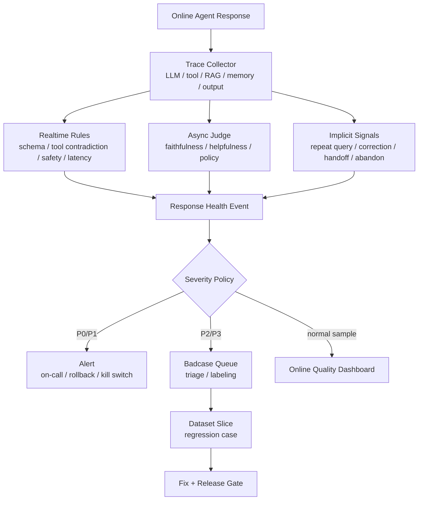

<section class="doc-hero">
  <p class="doc-hero__kicker">匿名真实面经</p>
  <h1>Agent 线上回复监测面试深挖：接口成功，不代表回答正常</h1>
  <p class="doc-hero__lead">面试官问“Agent 上线后怎么确保回复正常”，真正想听的是你有没有把非确定性输出变成可监测、可告警、可回放的生产信号。</p>
  <div class="doc-hero__meta" aria-label="本文信息">
    <span>适合阶段：Agent 工程师 / 平台架构面</span>
    <span>核心能力：response health · online eval · implicit feedback · semantic SLO</span>
    <span>脱敏原则：只保留工程方法，不保留真实业务细节</span>
  </div>
</section>

> HTTP 200 只能说明接口返回了。Agent 的线上健康要继续追问：有没有答对、有没有按工具结果答、有没有越界、有没有让用户继续追问、有没有把失败伪装成成功。

> **本文边界**：[Agent 可观测性](./observability) 讲 trace/span 怎么采集和排查；[Agent 线上质量治理](./agent-quality-interview) 讲 badcase、eval 和回归闭环；[LLM-as-Judge](./llm-judge) 讲裁判模型偏差与校准；[Agent 流式输出安全](./streaming-guardrail-interview) 讲流式输出安全 gate。本文只回答一个更线上化的问题：**服务已经上线，怎么持续监测每一类回复是否“正常”并触发告警**。

> **脱敏说明**：本文来自多场 Agent 工程岗位里反复出现的上线追问。所有案例都改写成通用业务 Agent，不出现可识别组织、具体案例、真实数量、业务口径数字、内部称呼或私有数据。

## 面试官想考什么

这组题能区分“会接模型 API”和“能守线上系统”的候选人。

<div class="interview-grid">
  <div>
    <strong>Agent 接口返回 200，但回答是错的，线上监控怎么发现？</strong>
    <span>考你是否知道 semantic failure，不只看 HTTP status。</span>
  </div>
  <div>
    <strong>传统接口有成功/失败，Agent 回复状态不固定，怎么定义正常？</strong>
    <span>考 response health schema、任务完成度和质量维度拆分。</span>
  </div>
  <div>
    <strong>哪些信号适合全量监测，哪些只能采样或异步评估？</strong>
    <span>考规则、任务裁判、LLM judge、人工抽检的成本与延迟边界。</span>
  </div>
  <div>
    <strong>用户没点踩，你怎么发现 Agent 回复有问题？</strong>
    <span>考重复追问、纠错、转人工、fallback、工具矛盾、低置信度等隐式信号。</span>
  </div>
  <div>
    <strong>线上告警怎么设？什么情况 P0，什么情况只进 badcase 队列？</strong>
    <span>考安全、任务失败率、语义异常率、judge 漂移和告警疲劳。</span>
  </div>
  <div>
    <strong>怎么监测“模型今天变差了”或 prompt 发布后质量退化？</strong>
    <span>考 canary、shadow、slice-level metrics、case-level diff 和版本化 trace。</span>
  </div>
  <div>
    <strong>线上每条都跑 LLM judge 会不会成本和延迟爆炸？</strong>
    <span>考主链路规则、异步裁判、风险分级采样和夜间批处理。</span>
  </div>
  <div>
    <strong>怎么把线上监测结果变成修复和回归？</strong>
    <span>考从 alert 到 trace，到归因，到 dataset slice，再到发布门禁。</span>
  </div>
</div>

## 为什么 200 OK 会骗你

传统接口的成功大多有确定性语义：

```text
POST /orders/cancel -> 200 OK
body: {"success": true}
```

你可以监控 HTTP status、错误码、延迟、QPS。虽然业务也会复杂，但“调用是否成功”通常能被结构化字段表达。

Agent 回复不一样：

```text
用户：帮我查订单状态。

tool result:
{"order_id": "O-123", "status": "shipping", "refund": false}

LLM response:
你的订单已经退款完成，请注意查收。

HTTP status: 200
latency: 1.2s
```

所有传统指标都正常，用户却拿到了错误结论。这个错误不是 500，不是 timeout，不是 JSON 解析失败，而是 **semantic failure**：回复和工具事实矛盾。

再看另一类：

```text
tool result:
{"success": false, "error_type": "permission_denied"}

LLM response:
已为你完成操作。
```

这叫 **false success**：工具失败了，但最终回复说成功。线上如果只看接口成功率，这类问题会安静地伤用户。

所以 Agent 线上监测要从“服务是否返回”升级为“回复是否可信、可用、可解释”。

## Agent 回复健康的五层定义

不要试图用一个分数代表所有质量。线上监测至少拆五层。

| 层 | 问的问题 | 可监测信号 | 适合全量吗 |
|---|---|---|---|
| 系统层 | 请求有没有正常完成 | 5xx、timeout、TTFT、total latency、429、retry | 适合 |
| 执行层 | Agent 的工具/RAG/记忆链路有没有正常跑 | tool success、tool args、RAG top-k、loop rounds、fallback | 适合 |
| 语义层 | 最终回复是否和证据一致 | tool-output consistency、citation support、required fields | 部分适合 |
| 安全层 | 有没有越权、泄漏、危险建议 | guardrail label、PII leak、risk intent、unsafe output | 高风险适合全量 |
| 用户层 | 用户是否真的被解决 | dislike、重复追问、纠错、转人工、退出、二次咨询 | 适合采集，解释要谨慎 |

这张表就是面试里的核心答案：**Agent 监控不是一个 dashboard，而是一套分层信号**。

OpenTelemetry 的 GenAI semantic conventions 正在把模型系统的通用字段标准化，例如 `gen_ai.request.model`、`gen_ai.usage.input_tokens`、`gen_ai.usage.output_tokens`、`gen_ai.response.finish_reasons`（[OpenTelemetry GenAI conventions](https://opentelemetry.io/docs/specs/semconv/gen-ai/)）。这解决的是“系统层和执行层怎么标准化采集”。但语义层、安全层、用户层，还需要业务自己定义。

## 一张线上监测链路图



关键点有三个：

- **规则在主链路或近实时跑**：便宜、稳定、可解释。
- **LLM Judge 异步跑**：不要把所有语义评估塞进用户等待路径。
- **告警和 badcase 分开**：不是每个坏回答都叫醒人，但高风险漏拦、工具失败伪装成功、质量突降要告警。

## 什么应该全量监控，什么应该采样

全量监控不等于全量 LLM judge。线上可观测要按成本分层。

| 信号 | 全量/采样 | 原因 |
|---|---|---|
| HTTP status、latency、TTFT、429、retry | 全量 | 传统 SLI，成本低 |
| tool success、error_type、args schema、permission | 全量 | 结构化信号，便宜且高价值 |
| RAG retrieved doc count、top score、citation count | 全量 | metadata 便宜，能发现召回异常 |
| output required fields、JSON/schema、空回复 | 全量 | 规则可判 |
| PII leak、明显安全关键词、risk intent | 全量或高风险全量 | 安全类宁可多算 |
| tool-result consistency | 尽量全量 | 规则可判的矛盾很致命 |
| faithfulness / helpfulness LLM judge | 采样 + 高风险必评 | 贵、慢、会漂 |
| 人工 review | 抽样 + 强信号必看 | 成本最高 |

面试回答可以很直接：

```text
规则类和结构化类信号全量；语义裁判异步采样；高风险、安全、强负反馈和 fallback 必评；普通成功流量低比例抽样。
```

LangSmith 的 evaluation 文档把 evaluator 分成人工、代码规则和 LLM-as-judge；Langfuse 的 score 模型允许给 trace、observation、session、dataset run 打分。这些工具的共同思路是：**每个 trace 可以有多个 score，而不是一个总分**。

## 最重要的线上异常类型

### 1. False Success：失败被说成成功

这是最该全量拦的异常。

```text
tool_result.success = false
response = "已为你完成"
```

监测方式：

- 工具失败后，最终回复不能包含“已完成”“已保存”“已取消”等成功语义。
- 如果必须安抚用户，应该说“未能完成，原因是...，你可以...”
- 规则先判，复杂表达再用 judge 抽检。

告警策略：核心写操作 false success 可以 P1；普通查询 false success 进 badcase 队列。

### 2. Tool Contradiction：回复和工具事实矛盾

```text
tool_result.status = "pending"
response = "状态已完成"
```

监测方式：

- 对关键字段做 response extraction，再和 tool_result 比对。
- 或在生成前把可展示字段结构化，最终答案只允许引用这些字段。

这类问题不要全靠 LLM Judge。字段一致性用代码更稳。

### 3. Grounding Failure：RAG 回答没有证据支撑

```text
retrieved docs 没提到退款窗口
response 却给了一个具体天数
```

监测方式：

- citation coverage：关键 claim 是否有引用。
- context support judge：答案是否被上下文支持。
- no-answer case：检索低置信时是否拒答或澄清。

这和 [RAG 评估](../rag/evaluation) 里的 faithfulness 一致，但线上要更轻量：高风险问题必评，普通流量抽样。

### 4. Safety Drift：安全边界变松

安全问题不能放到平均分里。

监测方式：

- risk intent 全量标记。
- output guardrail 结果写入 trace。
- 高风险类别的漏拦率单独看，一票否决。
- 流式场景看 `retract_rate` 和 `time_to_first_safe_token`。

告警策略：高风险漏拦 P0/P1；误拦过高 P2，影响体验但通常不叫醒人。

### 5. Loop / No Progress：Agent 看似在工作，其实没进展

```text
planner rounds > 5
tool calls 重复
retrieval query 反复改写但没有新证据
final answer 始终未生成
```

监测方式：

- step_count / replan_count / duplicate_tool_call_count。
- no-new-state rounds。
- max_steps forced stop rate。

这和 [Agent 工程异常处理](./agent-failure-modes-interview) 里的规划死循环是一组问题。线上要把 loop abort rate 做成指标。

### 6. Silent Degradation：某个版本发布后质量慢慢变差

不是所有问题都能单 trace 告警。有些是趋势异常：

- 某个 intent 的 fallback rate 上升。
- 某个模型版本的 judge pass rate 下降。
- 某个 RAG index version 的 citation support 下降。
- 用户重复追问率上升。

监测方式：按 `prompt_version / model / intent / tool / index_version / tenant` 分 slice 看指标。不要只看全局均值。

## 可运行代码：一个 Response Health Monitor

下面代码模拟线上 trace 的质量事件生成。它不用外部依赖，展示如何从 HTTP 正常的 Agent trace 里识别 false success、工具矛盾、RAG 缺证、循环和安全风险，并输出 severity。

```python
from __future__ import annotations

from dataclasses import dataclass, field
from enum import Enum
from typing import Any
import re


class Severity(str, Enum):
    OK = "ok"
    P3 = "p3_badcase"
    P2 = "p2_degraded"
    P1 = "p1_alert"
    P0 = "p0_incident"


@dataclass
class ToolSpan:
    name: str
    success: bool
    result: dict[str, Any]
    error_type: str | None = None


@dataclass
class RagSpan:
    top_score: float
    doc_count: int
    cited_doc_ids: list[str] = field(default_factory=list)


@dataclass
class AgentTrace:
    trace_id: str
    intent: str
    response: str
    http_status: int
    latency_ms: int
    tools: list[ToolSpan]
    rag: RagSpan | None = None
    risk_labels: list[str] = field(default_factory=list)
    step_count: int = 1
    duplicate_tool_calls: int = 0


@dataclass
class HealthEvent:
    trace_id: str
    severity: Severity
    category: str
    reason: str


SUCCESS_WORDS = re.compile(r"已(完成|保存|取消|提交|处理)|成功|done|completed", re.I)


class ResponseHealthMonitor:
    def inspect(self, trace: AgentTrace) -> list[HealthEvent]:
        events: list[HealthEvent] = []

        if trace.http_status >= 500:
            events.append(self._event(trace, Severity.P1, "system_error", "接口层失败"))

        if trace.latency_ms > 8_000:
            events.append(self._event(trace, Severity.P2, "latency", "端到端延迟超过阈值"))

        for tool in trace.tools:
            if not tool.success and SUCCESS_WORDS.search(trace.response):
                events.append(
                    self._event(
                        trace,
                        Severity.P1,
                        "false_success",
                        f"工具 {tool.name} 失败但最终回复表达成功",
                    )
                )

            status = tool.result.get("status")
            if status and status not in trace.response:
                events.append(
                    self._event(
                        trace,
                        Severity.P3,
                        "tool_response_mismatch",
                        f"关键状态 {status!r} 没有出现在最终回复中",
                    )
                )

        if trace.rag:
            if trace.rag.doc_count == 0 and self._looks_specific(trace.response):
                events.append(self._event(trace, Severity.P2, "no_evidence", "无检索证据但回答给出具体结论"))
            if trace.rag.top_score < 0.35 and self._looks_specific(trace.response):
                events.append(self._event(trace, Severity.P3, "low_grounding", "低相关检索结果支撑具体回答"))
            if trace.rag.doc_count > 0 and not trace.rag.cited_doc_ids and self._looks_specific(trace.response):
                events.append(self._event(trace, Severity.P3, "missing_citation", "具体回答缺少引用"))

        if trace.risk_labels and "safe_boundary" not in trace.response:
            events.append(self._event(trace, Severity.P1, "safety_drift", "高风险意图未输出边界提示"))

        if trace.step_count > 8 or trace.duplicate_tool_calls > 1:
            events.append(self._event(trace, Severity.P2, "no_progress_loop", "Agent 多步执行疑似无进展"))

        return events or [self._event(trace, Severity.OK, "healthy", "未命中线上监测规则")]

    @staticmethod
    def _looks_specific(text: str) -> bool:
        has_number = bool(re.search(r"\d", text))
        has_commitment = bool(re.search(r"必须|应该|确定|已|为|超过|低于", text))
        return has_number or has_commitment

    @staticmethod
    def _event(trace: AgentTrace, severity: Severity, category: str, reason: str) -> HealthEvent:
        return HealthEvent(trace.trace_id, severity, category, reason)


if __name__ == "__main__":
    traces = [
        AgentTrace(
            trace_id="t_false_success",
            intent="cancel_order",
            response="已为你成功取消订单。",
            http_status=200,
            latency_ms=1200,
            tools=[ToolSpan("cancel_order", False, {"status": "permission_denied"}, "permission_denied")],
        ),
        AgentTrace(
            trace_id="t_no_evidence",
            intent="policy_qa",
            response="超过 50 万必须审批。",
            http_status=200,
            latency_ms=2100,
            tools=[],
            rag=RagSpan(top_score=0.12, doc_count=0),
        ),
        AgentTrace(
            trace_id="t_loop",
            intent="research",
            response="我还在规划下一步。",
            http_status=200,
            latency_ms=9200,
            tools=[],
            step_count=12,
            duplicate_tool_calls=2,
        ),
    ]

    monitor = ResponseHealthMonitor()
    for trace in traces:
        print(trace.trace_id)
        for event in monitor.inspect(trace):
            print(" ", event)
```

这段代码的重点不是规则多复杂，而是架构位置：监测逻辑消费的是 trace，不是用户投诉。它能把“接口成功但回复异常”变成结构化 `HealthEvent`，后面才能接告警、badcase 队列和回归集。

## 告警怎么设，避免全是噪音

线上监测最容易走向两个极端：不告警，问题全靠用户发现；或者什么都告警，值班很快麻木。

一个实用的分级：

| 等级 | 触发条件 | 处理 |
|---|---|---|
| P0 | 高风险安全漏拦、越权成功、敏感信息泄露、批量 false success | 立即告警、回滚或 kill switch |
| P1 | 核心任务 false success、工具结果大面积矛盾、某版本质量突降 | 告警值班、暂停灰度、定位版本 |
| P2 | fallback rate、loop abort rate、低 grounding rate 明显上升 | 进入当日排查，必要时降级 |
| P3 | 单条普通 badcase、低置信回答、缺 citation | 进 badcase 队列，异步 triage |

告警条件要按时间窗口看：

```text
P1: false_success_rate(intent=write_action, 10min) > 1%
P2: fallback_rate(model=v_next, 30min) > baseline + 3σ
P2: loop_abort_rate(agent=research, 30min) > 5%
P1: safety_miss_count(risk=high, 5min) >= 1
```

不要只设绝对阈值。Agent 质量有明显 slice：某个 intent、某个模型、某个 prompt version 可能坏，全局均值还看不出来。

## 版本发布后怎么监测退化

Agent 退化常发生在发布后：

- prompt 改了，某类 intent 漏段。
- 模型换了，工具调用格式变差。
- RAG index 重建了，旧文档被召回。
- 安全 prompt 放松了，边界提示变少。

发布监测至少有四步：

1. **版本打标**：每个 trace 带 `prompt_version`、`model_version`、`tool_schema_version`、`index_version`、`guardrail_version`。
2. **canary**：新版本只接一小部分流量，同时旧版本继续接主流量。
3. **slice 对比**：按 intent、risk、tool、RAG、用户层级看 pass rate / fallback / latency / cost。
4. **自动回滚条件**：核心 slice 的 pass rate 下降、false success 上升、安全漏拦，直接停灰度。

面试答法：

```text
我不会只看新版本总体评分。每个 trace 都带版本号，灰度期间按 intent / tool / risk / RAG slice 对比旧版本。高风险 slice 回归一票否决，普通 slice 看收益和回归代价。
```

这和传统发布很像，但 Agent 多了 prompt、模型、索引、guardrail 这些版本轴。

## 用户层隐式信号怎么用

用户行为信号很有价值，但不能过度解释。

| 信号 | 可以说明什么 | 不能直接说明什么 |
|---|---|---|
| 重复追问 | 可能没解决、没理解、答得不完整 | 一定答错 |
| 用户纠正 | 高概率答偏或实体错 | 修法一定在 prompt |
| 转人工 | 自动链路失败或用户需要人工背书 | 模型能力一定不行 |
| 退出页面 | 体验差、等待久、需求已满足都有可能 | 答案质量一定差 |
| 点赞 | 用户当下满意 | 事实一定正确 |
| 点踩 | 用户不满意 | 哪一层错了 |

隐式信号最适合作为 badcase 候选入口，而不是最终判决。

```text
重复追问 + 工具失败 + 低 grounding = 高优先 badcase
重复追问但工具成功、grounding 高 = 可能是表达或产品预期问题
```

这个组合判断比单个信号可靠。

## 常见陷阱

### 陷阱 1：只看服务指标

**现象**：QPS、延迟、错误率都正常，用户仍然投诉答错。

**根因**：Agent 的主要失败不一定发生在接口层，而是发生在语义层、工具解释层和证据层。

**修法**：服务 SLI 之外加 response health：false success、tool contradiction、grounding、safety、loop rate。

### 陷阱 2：每条都同步跑 LLM Judge

**现象**：质量监测本身拖慢主链路，成本飙升。

**根因**：把离线/异步语义评估塞进在线同步路径。

**修法**：规则和结构化检查全量，judge 异步采样；高风险和强负反馈必评。

### 陷阱 3：把用户点赞当正确答案

**现象**：用户点赞率高，但抽检发现事实错误。

**根因**：用户满意不等于事实正确，尤其是专业知识和工具状态。

**修法**：点赞是用户层信号，不能替代 grounding、tool consistency 和人工校准。

### 陷阱 4：没有版本维度

**现象**：质量突然下降，但不知道是模型、prompt、工具 schema 还是索引导致。

**根因**：trace 没有带版本号，无法做 slice diff。

**修法**：所有 trace 必须带 `model_version`、`prompt_version`、`tool_schema_version`、`index_version`、`guardrail_version`。

### 陷阱 5：只监测最终文本，不看中间过程

**现象**：最终回复看起来正常，但中间工具失败、RAG 缺证、Planner 重试很多轮。

**根因**：没有 trace/span，只保存最终 answer。

**修法**：一次用户请求一个 trace，LLM/tool/RAG/memory/guardrail 都是 span。最终文本只是 trace 的最后一个节点。

### 陷阱 6：告警没有分级

**现象**：所有 badcase 都发群，最后没人看。

**根因**：P0/P1/P2/P3 没分清，安全事故和普通表达问题混在一起。

**修法**：安全漏拦、false success、核心任务质量突降告警；普通低分样本进 badcase 队列。

## 与相邻文章的区别

| 文章 | 解决的问题 | 本文的边界 |
|---|---|---|
| [Agent 可观测性](./observability) | trace/span 怎么采集、工具怎么选、投诉怎么反查 | 本文讲采集后如何定义线上回复健康和告警 |
| [Agent 线上质量治理](./agent-quality-interview) | badcase、裁判、回归集和质量治理闭环 | 本文更偏在线监测、实时信号、采样和告警 |
| [LLM-as-Judge](./llm-judge) | 裁判模型偏差、校准和 pairwise/pointwise | 本文只把 judge 当一类异步监测信号 |
| [Agent 工程异常处理](./agent-failure-modes-interview) | RAG 冲突、记忆冲突、规划死循环等异常处理 | 本文讲这些异常上线后怎么被发现 |
| [Agent 流式输出安全](./streaming-guardrail-interview) | 流式输出前后的安全审查 | 本文把安全结果纳入线上 health event |

## 面试题深度解析

### Q1：Agent 接口返回 200，但回答错了，线上怎么发现？

**30 秒版本**：不能只看接口状态。要从 trace 里提取 tool success、RAG grounding、最终回复、用户反馈和隐式行为，用规则、任务裁判和异步 judge 生成 response health event。

**追问 1：什么问题可以规则发现？**  
工具失败却说成功、关键字段和工具结果矛盾、JSON/schema 缺字段、没有引用却给具体结论、重复工具调用、超时和 fallback，这些都可以规则或轻量逻辑发现。

**追问 2：什么问题需要 judge 或人工？**  
开放文本是否有帮助、是否完整、是否忠于长文证据、语气是否合规，这类需要 LLM judge 或人工抽检。高风险样本要人工校准。

### Q2：Agent 的“正常回复”怎么定义？

**30 秒版本**：按五层定义：系统正常、执行链路正常、语义和证据一致、安全不过界、用户层没有强负反馈。不同层用不同指标，不能压成一个总分。

**追问 1：任务型 Agent 和问答型 Agent 一样吗？**  
不一样。任务型看工具状态和业务状态，问答型看 evidence support 和 answer correctness。任务型更容易全量规则裁判。

**追问 2：用户点赞算不算正常？**  
只能算用户层满意信号。它不能证明事实正确，也不能替代工具一致性和 grounding。

### Q3：线上每条都评估会不会太贵？

**30 秒版本**：规则全量，judge 采样。强负反馈、高风险、fallback、tool error、低置信度必评；普通成功流量低比例异步抽样。

**追问 1：judge 放同步链路可以吗？**  
通常不放。会增加延迟和成本。只有高风险输出前置审核可以同步，大部分质量评估异步做。

**追问 2：采样会不会漏问题？**  
会，所以强信号必评，普通流量抽样。监测不是 100% 自动审计，而是用成本可控的方式尽早发现趋势和高风险异常。

### Q4：告警怎么设？

**30 秒版本**：按严重级别。安全漏拦、敏感泄露、核心写操作 false success 是 P0/P1；fallback、loop、grounding 下降是 P2；普通单条 badcase 进队列。

**追问 1：怎么避免告警疲劳？**  
按 slice 和窗口告警，不是每条坏样本都告警。普通样本进 badcase 队列，趋势异常或高风险才叫醒人。

**追问 2：怎么知道是哪个版本导致？**  
trace 必须带模型、prompt、工具 schema、RAG index、guardrail 版本。告警也要按版本切片。

### Q5：监测结果怎么反哺修复？

**30 秒版本**：每个 health event 都能追到 trace。triage 后标注根因，进入 badcase dataset；修复后跑 case-level regression，看 fail→pass 和 pass→fail。

**追问 1：只改 prompt 行不行？**  
不一定。根因可能在工具 schema、RAG index、memory、权限、guardrail 或产品口径。监测的价值就是先归因再修复。

**追问 2：怎么衡量监测系统本身有没有用？**  
看 badcase discovery rate、high-risk miss rate、false alert rate、time-to-detect、time-to-triage、regression catch rate。

## 延伸阅读

- [OpenTelemetry GenAI semantic conventions](https://opentelemetry.io/docs/specs/semconv/gen-ai/)  
  为什么读：理解 LLM/Agent 线上 trace 的标准字段，避免监测数据被单一工具锁死。
- [LangSmith Evaluators](https://docs.smith.langchain.com/evaluation/concepts#evaluators)  
  为什么读：官方把 evaluator 拆成人工、代码和 LLM-as-judge，适合支撑“规则全量 + judge 采样”的回答。
- [LangSmith Online Evaluation](https://docs.smith.langchain.com/observability/how_to_guides/online_evaluations)  
  为什么读：看生产 trace 如何挂 evaluator 和 feedback，把线上请求变成质量信号。
- [Langfuse Scores](https://langfuse.com/docs/scores/overview)  
  为什么读：Langfuse 的 score 可以挂 trace、observation、session、dataset run，正好对应多层 response health。
- [Langfuse Evaluation Methods](https://langfuse.com/docs/scores/evaluation-methods)  
  为什么读：理解用户反馈、人工标注、LLM-as-judge、custom evaluator 如何组合。
- [Arize Phoenix Evaluations](https://arize.com/docs/phoenix/evaluation/llm-evals)  
  为什么读：看开源可观测工具如何做 LLM eval，适合本地或自托管场景。

配套阅读：

- [Agent 可观测性](./observability)：先把 trace/span 采集打好。
- [Agent 线上质量治理面试深挖](./agent-quality-interview)：把线上监测信号沉淀成 badcase 和回归集。
- [LLM-as-Judge](./llm-judge)：理解 judge 的偏差、校准和使用边界。
- [Agent 工程异常处理面试深挖](./agent-failure-modes-interview)：看 RAG 冲突、规划死循环等异常如何处理。
- [Agent 流式输出安全面试深挖](./streaming-guardrail-interview)：把流式安全事件纳入线上监测。
