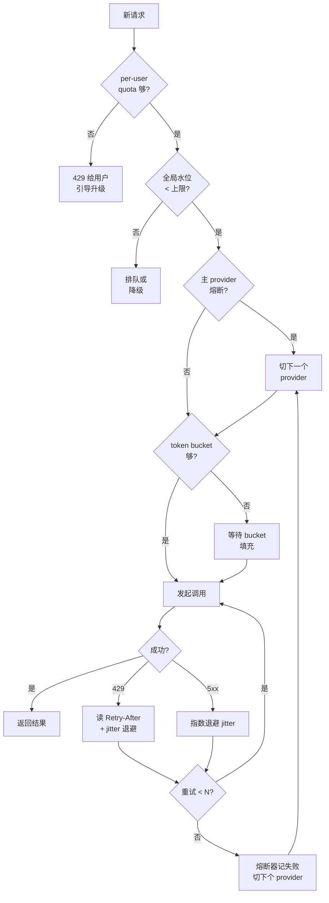

<section class="doc-hero">
  <p class="doc-hero__kicker">工程化</p>
  <h1>LLM Agent 的限流、降级与熔断</h1>
  <p class="doc-hero__lead">OpenAI Tier 1 账号 RPM 500、TPM 30K，并发处理 1000 个用户分分钟雪崩——限流不只是 429 退避这么简单，它是 Agent 能不能从 demo 走到生产的分水岭。</p>
  <div class="doc-hero__meta" aria-label="本文信息">
    <span>适合阶段：生产 / 容量规划</span>
    <span>核心：token bucket + backoff + breaker + fallback</span>
    <span>面试重点：tier 模型 + 雪崩防护 + 多账号策略</span>
  </div>
</section>

## 面试官想考什么

读完这篇你要能正面回答下面这些题。每题后面括号里是面试官真正想看你答出什么。

<div class="interview-grid">
  <div>
    <strong>OpenAI / Anthropic 的 tier 系统到底限的是什么？RPM、TPM、ITPM、OTPM 分别是什么意思？</strong>
    <span>考对厂商真实限额结构的理解——不是泛泛说"有限流"，而是知道哪个维度先打爆。</span>
  </div>
  <div>
    <strong>为什么固定间隔重试在 LLM 应用里会引发雷暴？jitter 的数学逻辑是什么？</strong>
    <span>考分布式系统直觉——多个客户端同步重试的灾难性后果。</span>
  </div>
  <div>
    <strong>遇到 429 你怎么处理？为什么不能直接看 Retry-After 等?</strong>
    <span>考对 token 级限流的理解——Retry-After 只是建议，本地令牌桶才是根本。</span>
  </div>
  <div>
    <strong>Circuit breaker 在 LLM 调用里的阈值怎么定？和传统微服务有什么不一样？</strong>
    <span>考量化思维——单次调用贵 + 延迟高，熔断要比传统服务更激进。</span>
  </div>
  <div>
    <strong>主模型挂了切备用模型，怎么保证体验一致？哪些是必须同步切换的？</strong>
    <span>考 fallback chain 的实战细节——不是换个 endpoint 就完事。</span>
  </div>
  <div>
    <strong>一个用户 abuse 把整个公司的 OpenAI 配额烧光，你怎么防?</strong>
    <span>考多租户限流的设计——per-user quota + 全局水位双层保护。</span>
  </div>
  <div>
    <strong>多 API key 之间怎么负载均衡？key 之间也要做熔断吗？</strong>
    <span>考真实生产架构——大公司都有 key pool，但 key 级故障隔离常被忽略。</span>
  </div>
  <div>
    <strong>限流和降级的关系？什么场景该降级、降到哪？</strong>
    <span>考产品 + 工程结合——三层降级（模型 / 功能 / 体验）的边界。</span>
  </div>
</div>

---

## 为什么 LLM 应用的限流比传统 Web 服务难十倍

先看一段每个团队都写过、然后被生产打脸的代码：

```python
import openai

def chat(messages):
    return openai.chat.completions.create(
        model="gpt-4o",
        messages=messages,
    )

# 一个 worker pool 同时跑 100 个用户的请求
with ThreadPoolExecutor(max_workers=100) as pool:
    results = list(pool.map(chat, all_user_messages))
```

看起来人畜无害。实际跑起来：

```
RateLimitError: 429 Too Many Requests
RateLimitError: 429 Too Many Requests
RateLimitError: 429 Too Many Requests
... (95 / 100 失败)
APITimeoutError: Request timed out
RateLimitError: tokens per minute (TPM) exceeded
```

为什么？OpenAI Tier 1 账号的 gpt-4o 限额是 **RPM 500 + TPM 30K**。100 并发每个请求平均 5K input + 1K output = 600K token/分钟——超 TPM 限额 20 倍。但即便量不大、平均 RPS 不到限额，**突发并发**也会瞬间打爆 RPM。

跟传统 Web 服务比，LLM 应用的限流有四个独特难点：

**1. 限额维度多且非线性**。Web 服务通常一个 RPS 维度。LLM 至少四个：RPM（请求数）、TPM（token 数）、ITPM（输入 token 数）、OTPM（输出 token 数）。Anthropic 还额外算 prompt cache token。**任何一个先打爆都会触发 429**。

**2. 单次调用代价巨大**。一次失败 = 几秒延迟 + 几千 token + 用户等不及走人。传统服务 500 重试一次几乎无感，LLM 重试一次用户已经在刷新页面了。

**3. 厂商限额是硬墙不是软墙**。AWS / GCP 的限额通常可以现充值现提升，OpenAI/Anthropic 的 tier 升级要看你的**累计消费历史**——Tier 1 升 Tier 2 要 $50 + 7 天，再升要月级。临时业务高峰你升不上去。

**4. 失败模式互相关联**。429 退避不当 → 后续请求堆积 → 超时 → 重试雪崩 → 整个 worker pool 卡死 → 用户全部超时 → 客服爆炸。这是一个典型的级联失败。

> Anthropic 的 [API rate limits](https://docs.anthropic.com/en/api/rate-limits) 文档明确说：429 响应不是"稍后重试就好了"，而是"你触发了硬限额，下次成功的前提是你的总流量降下来"。如果客户端一窝蜂重试，Anthropic 的 token bucket 永远填不满。

---

## 主流厂商的限额结构：一张表看清谁在限什么

每家厂商的限额模型不一样。**面试时被问"你怎么处理 OpenAI 的限流"，先要能说清楚 OpenAI 限的是什么**。

| 厂商 | tier 体系 | 核心限额维度 | 升 tier 条件 | 特殊点 |
|---|---|---|---|---|
| **OpenAI** | Tier 1-5 | RPM / TPM / RPD / TPD（按模型分别算） | 累计支付 $5 / $50 / $100 / $250 / $1000 + 时长 | Batch API 有独立 enqueued token 限额 |
| **Anthropic** | Tier 1-4 + Enterprise | RPM / ITPM / OTPM | 累计支付 $5 / $40 / $200 / $400 | prompt cache read/write 单独计入 ITPM |
| **Google Gemini** | Free / Paid | RPM / TPM / RPD | 开通付费即升级 | 免费 tier 限额极严，仅供测试 |
| **DeepSeek** | 无 tier | 并发数（典型 100）+ 无明确 RPM | 充值即用 | 限额相对宽松，但波动大 |
| **国内厂商**（通义 / 智谱 / 月之暗面） | 通常并发数 + QPS | 不限 token | 工单申请提额 | 限额结构透明度低 |

**OpenAI 的细节**（gpt-4o 为例，2025 年价格）：

- Tier 1：RPM 500 / TPM 30K / TPD 90K
- Tier 2：RPM 5000 / TPM 450K
- Tier 5：RPM 30000 / TPM 30M

意思是 Tier 1 上你一分钟最多发 500 个请求，且所有请求的 token 加起来不超过 30K。**两个限额是 AND 关系——任一打爆都触发 429**。

**Anthropic 的细节**（Sonnet 为例）：

- Tier 1：RPM 50 / ITPM 30K / OTPM 8K
- Tier 4：RPM 4000 / ITPM 400K / OTPM 80K

ITPM 和 OTPM 分别算，这点和 OpenAI 不一样。Output token 单独限是因为 output 资源消耗更高（要顺序生成、占 GPU 时间长）。**prompt cache 的 read/write 都计入 ITPM**——这是很多团队踩的坑：以为开了 cache 就不算 input 了，实际还是要算。

**国内厂商**通常按"并发数"限——同时只能有 N 个请求在跑。这种模型简单，但容易撞——突发 200 个用户瞬时进来直接拒 100 个。

[官方文档：OpenAI rate limits](https://platform.openai.com/docs/guides/rate-limits) 和 [Anthropic rate limits](https://docs.anthropic.com/en/api/rate-limits) 是必读。**面试前至少把自己常用模型的 tier 表背下来**。

---

## 应对策略总览：六件套

| 策略 | 解决什么 | 复杂度 | 必要性 |
|---|---|---|---|
| **1. Token Bucket 本地限流** | 主动控制 QPS 不撞墙 | 低 | 必备 |
| **2. Exponential Backoff + Jitter** | 撞墙后的退避重试 | 低 | 必备 |
| **3. Circuit Breaker** | 上游持续故障时快速失败 | 中 | 必备 |
| **4. Fallback Chain** | 主模型挂了切备用 | 中 | 高优先 |
| **5. Request Queue + Worker Pool** | 控制并发上限 | 中 | 必备 |
| **6. Cost-aware Throttling** | 防单用户 abuse | 中 | 多租户必备 |

下面每节展开。

---

## 1. Token Bucket：主动限流不撞墙

被动重试 429 永远是次优解。**最佳策略是本地维护一个 token bucket，请求出去之前先扣 token，bucket 空了就排队等**。这样客户端的实际 QPS 永远不超过厂商限额，根本不会触发 429。

```python
import time
import threading

class TokenBucket:
    """经典 token bucket：rate token/秒补充，capacity 上限"""
    def __init__(self, rate: float, capacity: float):
        self.rate = rate           # 补充速率 (token/s)
        self.capacity = capacity   # bucket 容量上限
        self.tokens = capacity
        self.last_refill = time.monotonic()
        self.lock = threading.Lock()

    def acquire(self, n: float = 1.0, timeout: float = 30.0) -> bool:
        """尝试扣 n 个 token；不够就阻塞等，超时返回 False"""
        deadline = time.monotonic() + timeout
        while True:
            with self.lock:
                now = time.monotonic()
                # 按经过时间补充 token
                elapsed = now - self.last_refill
                self.tokens = min(self.capacity, self.tokens + elapsed * self.rate)
                self.last_refill = now
                if self.tokens >= n:
                    self.tokens -= n
                    return True
                # 计算还差多少 token，估算等待时间
                deficit = n - self.tokens
                wait = deficit / self.rate
            if time.monotonic() + wait > deadline:
                return False
            time.sleep(min(wait, 0.1))
```

**LLM 场景的关键设计**：要维护**两个**bucket——RPM 一个、TPM 一个：

```python
class LLMRateLimiter:
    def __init__(self, rpm: int, tpm: int):
        # Tier 1 gpt-4o: RPM 500 / TPM 30K
        # 留 10% buffer，避免边界打爆
        self.rpm_bucket = TokenBucket(rate=rpm * 0.9 / 60, capacity=rpm * 0.9)
        self.tpm_bucket = TokenBucket(rate=tpm * 0.9 / 60, capacity=tpm * 0.9)

    def acquire(self, estimated_tokens: int):
        self.rpm_bucket.acquire(1)
        self.tpm_bucket.acquire(estimated_tokens)
```

**关键细节**：

- **预估 token 量必须保守**。请求出去前你不知道 output 多长。生产里通常用 `input_tokens + max_tokens` 作为预估值，宁可多扣也不要少扣。
- **留 10%-20% 的 buffer**。厂商的限额计算是滑动窗口，不是固定窗口——你的本地计数和它的可能差一点，buffer 兜底。
- **分布式部署要用 Redis 实现共享 bucket**。多个 worker 各自维护本地 bucket 会累加超限。Redis 的 `INCR` + `EXPIRE` 或 lua 脚本实现分布式 token bucket。

详细的 token bucket 算法以及和 leaky bucket / fixed window 的对比，是分布式系统经典话题，不重复——重点是**为什么 LLM 必须用这个**：被动应对 429 = 浪费几秒延迟 + 退避期间用户在等。主动限流让限流变成"队列等待几百毫秒"，体验完全不同。

---

## 2. Exponential Backoff with Jitter：退避的正确姿势

即便有 token bucket，仍然会偶尔撞 429——预估不准、多账号共享配额、厂商侧波动。撞了之后**怎么退避决定了你是不是会引发雷暴**。

### 为什么固定退避会雷暴

假设 100 个 worker 同时撞 429，都用"等 5 秒再试"的策略：

```
T=0s:  100 个 worker 同时 429
T=5s:  100 个 worker 同时重试 → 又全部 429
T=10s: 100 个 worker 同时重试 → 又全部 429
... 永远撞不开
```

这就是同步重试浪潮。即使限额回血，瞬时高峰仍然超限。

### Exponential backoff + Full jitter（推荐写法）

```python
import random

def exponential_backoff_with_jitter(attempt: int, base: float = 1.0, cap: float = 60.0) -> float:
    """AWS 推荐的 full jitter 写法"""
    raw = min(cap, base * (2 ** attempt))
    return random.uniform(0, raw)

# attempt=0 → 0~1s
# attempt=1 → 0~2s
# attempt=2 → 0~4s
# attempt=3 → 0~8s
# attempt=4 → 0~16s
```

**Full jitter 比 equal jitter 好**。这是 [AWS Marc Brooker 那篇经典博客](https://aws.amazon.com/blogs/architecture/exponential-backoff-and-jitter/) 用数学证明的——full jitter 把所有重试在区间内均匀打散，集群恢复时间最短。等概率分布是关键。

### 别忘了 Retry-After 头

厂商返回 429 时通常带 `Retry-After` 头（秒）。这个值是厂商告诉你的"建议等待时间"，**应该作为最小等待时间**：

```python
def smart_backoff(attempt: int, response) -> float:
    server_hint = float(response.headers.get("Retry-After", 0))
    client_backoff = exponential_backoff_with_jitter(attempt)
    return max(server_hint, client_backoff)
```

注意 `Retry-After` 可能是 60 秒以上——按客户端 backoff 等 2 秒重试只会再次撞 429。**永远尊重 server 的建议**。

### 重试次数上限

```
max_attempts = 3-5 是合理区间
```

太少（1-2）：偶发抖动也失败。太多（10+）：累计延迟 10 秒以上，用户已经走了。**永远配合超时——总等待时间不能超过用户可容忍的 SLA**。

---

## 3. Circuit Breaker：上游挂了别再撞

LLM API 偶尔会区域性挂掉——OpenAI 2024 年至少 3 次大规模 outage。这种时候继续重试不只没用，还会让事情更糟：

- 你的 worker pool 全部卡在等待上游响应
- 用户请求堆积在队列里
- 健康检查失败、容器被 k8s 杀掉
- 服务雪崩

**Circuit breaker 的核心思想：上游连续失败时，本地直接拒绝请求，给用户快速失败的反馈，而不是傻等**。

```python
import time
from enum import Enum

class BreakerState(Enum):
    CLOSED = "closed"      # 正常
    OPEN = "open"          # 熔断中，直接拒绝
    HALF_OPEN = "half_open"  # 试探恢复

class CircuitBreaker:
    def __init__(self, failure_threshold: int = 5, cooldown: float = 30.0):
        self.failure_threshold = failure_threshold
        self.cooldown = cooldown
        self.failures = 0
        self.opened_at = None
        self.state = BreakerState.CLOSED

    def call(self, fn, *args, **kwargs):
        # 半开：冷却时间到了，放一个请求试探
        if self.state == BreakerState.OPEN:
            if time.time() - self.opened_at > self.cooldown:
                self.state = BreakerState.HALF_OPEN
            else:
                raise BreakerOpenError(
                    f"Circuit open, cooldown {self.cooldown}s, last_failure={self.opened_at}"
                )

        try:
            result = fn(*args, **kwargs)
            # 成功：恢复正常
            self.failures = 0
            self.state = BreakerState.CLOSED
            return result
        except Exception as e:
            self.failures += 1
            if self.failures >= self.failure_threshold:
                self.state = BreakerState.OPEN
                self.opened_at = time.time()
            raise

class BreakerOpenError(Exception): pass
```

### LLM 场景的阈值设计

| 维度 | 传统微服务 | LLM API |
|---|---|---|
| 失败阈值 | 10-50 次 | **3-5 次** |
| 冷却时间 | 5-15s | **30-60s** |
| 半开探测 | 1 个请求 | 1 个请求 |

LLM 比传统微服务**更激进**的原因：

- 每次失败 = 几秒延迟 + 几千 token 浪费
- 用户对 LLM 慢响应忍耐度低（已经知道 LLM 慢了，再等就走了）
- 厂商恢复时间通常以分钟计，30 秒冷却合理

### 多级熔断

不同维度的熔断要分开：

```python
breakers = {
    "openai_global": CircuitBreaker(),       # OpenAI 整体
    "openai_gpt-4o": CircuitBreaker(),       # 特定模型
    "openai_key_abc": CircuitBreaker(),      # 特定 API key
    "anthropic_global": CircuitBreaker(),    # 备用厂商
}
```

`gpt-4o` 单独挂掉时不影响 `gpt-4o-mini`，单个 API key 故障不影响其他 key。**粒度越细，故障爆炸半径越小**。

---

## 4. Fallback Chain：主厂商挂了切备用

熔断后总要给用户一个回答，不能干瞪眼。Fallback chain 是行业标准：

```
主链路：OpenAI gpt-4o
   ↓ 失败/熔断
备用 1：Anthropic Claude Sonnet
   ↓ 失败/熔断
备用 2：自部署开源模型（Qwen / Llama）
   ↓ 失败/熔断
最终 fallback：返回固定模板 "服务繁忙，请稍后重试"
```

实现要点：

```python
class LLMClient:
    def __init__(self):
        self.providers = [
            {"name": "openai", "model": "gpt-4o", "client": openai_client,
             "breaker": CircuitBreaker()},
            {"name": "anthropic", "model": "claude-sonnet-4-5", "client": anthropic_client,
             "breaker": CircuitBreaker()},
            {"name": "qwen", "model": "qwen-72b", "client": qwen_client,
             "breaker": CircuitBreaker()},
        ]

    def chat(self, messages: list) -> dict:
        last_err = None
        for provider in self.providers:
            try:
                return provider["breaker"].call(
                    self._call_provider, provider, messages
                )
            except (BreakerOpenError, ProviderError) as e:
                last_err = e
                continue
        # 全部失败：返回降级模板
        return {"content": "服务暂时不可用，请稍后重试", "fallback": True}
```

### Fallback 的隐藏陷阱

**陷阱 1：Prompt 不兼容**。OpenAI 和 Anthropic 的 system message 格式不同、function calling schema 也不同。fallback 时如果直接复用主链路 prompt，备用厂商可能根本理解不了。生产做法：**抽象一层 message normalizer**，每个 provider 有自己的 adapter。

**陷阱 2：结构化输出差异**。OpenAI 的 `response_format` 和 Anthropic 的 tool use 强制 JSON 的方式不同。fallback 后输出 schema 可能不一致，下游解析会崩。**fallback 必须配套输出验证**。

**陷阱 3：成本差异巨大**。从 gpt-4o-mini fallback 到 Claude Opus 单次成本可能涨 50 倍——大规模 fallback 时账单失控。生产里 fallback 链上的模型要**价格相近**或者明确接受成本飙升。

**陷阱 4：上下文长度不一致**。主链路用 128K 上下文，备用模型只支持 32K——长上下文请求 fallback 时会被截断，质量直接崩。**fallback chain 上的模型上下文窗口要互相兼容**。

---

## 5. Request Queue + Worker Pool：控制并发上限

光有 token bucket 还不够——瞬时 1000 个请求涌进来，全部排队等 bucket 也会撑爆内存。**必须有一个明确的并发上限和队列长度**。

```python
import asyncio
from asyncio import Queue, Semaphore

class LLMWorkerPool:
    def __init__(self, max_concurrent: int = 20, queue_size: int = 200):
        self.semaphore = Semaphore(max_concurrent)
        self.queue = Queue(maxsize=queue_size)
        self.limiter = LLMRateLimiter(rpm=500, tpm=30_000)

    async def submit(self, messages: list, estimated_tokens: int = 2000) -> dict:
        # 队列满直接拒绝，不要等
        if self.queue.full():
            raise QueueFullError("请求队列已满，请稍后重试")
        async with self.semaphore:
            self.limiter.acquire(estimated_tokens)
            return await self._call_llm(messages)
```

**为什么要队列满直接拒绝**？这是经典的 [Little's Law](https://en.wikipedia.org/wiki/Little%27s_law) 应用——队列长度太大时，等待时间无限增长，用户体验比快速失败差得多。**队列只是吸收瞬时峰值，不是缓冲长期超载**。

### 并发数怎么定

公式：`max_concurrent = TPM 限额 / (平均 token × 60 / 平均延迟秒)`

举例：TPM 30K，平均请求 1.5K token，平均延迟 6 秒：
```
max_concurrent ≈ 30000 / (1500 × 10) = 2
```

只有 2 并发！这是 Tier 1 的真实情况。Tier 4 上 TPM 400K：
```
max_concurrent ≈ 400000 / (1500 × 10) ≈ 26
```

**很多团队设 max_concurrent=100 然后疑惑为什么一直 429**——超过 TPM 能承载的并发就是无效并发。

---

## 6. Cost-aware Throttling：防单用户烧光配额

多租户场景的经典攻击：一个恶意（或者 buggy）用户疯狂调你的 Agent，把整个公司的 API 配额耗光，其他用户全部失败。

```python
class TenantQuotaManager:
    """per-user 配额 + 全局水位双层保护"""
    def __init__(self, per_user_rpm: int = 10, per_user_tpd: int = 100_000,
                 global_rpm: int = 500):
        self.per_user_rpm = per_user_rpm
        self.per_user_tpd = per_user_tpd
        self.user_buckets: dict[str, TokenBucket] = {}
        self.user_daily_tokens: dict[str, int] = {}
        self.global_bucket = TokenBucket(rate=global_rpm/60, capacity=global_rpm)

    def check(self, user_id: str, estimated_tokens: int):
        # 全局水位（保护底层 API 配额）
        if not self.global_bucket.acquire(1, timeout=0):
            raise GlobalRateLimitError("系统繁忙，请稍后重试")
        # per-user RPM
        bucket = self.user_buckets.setdefault(
            user_id, TokenBucket(rate=self.per_user_rpm/60, capacity=self.per_user_rpm)
        )
        if not bucket.acquire(1, timeout=0):
            raise UserRateLimitError(f"用户 {user_id} 调用频率超限")
        # per-user 日 token 上限
        used = self.user_daily_tokens.get(user_id, 0)
        if used + estimated_tokens > self.per_user_tpd:
            raise UserQuotaExceededError(f"用户 {user_id} 今日 token 用量已耗尽")
        self.user_daily_tokens[user_id] = used + estimated_tokens
```

### 分级配额：免费用户 vs 付费用户

```python
TIER_QUOTAS = {
    "free":    {"rpm": 5,  "tpd": 50_000},
    "pro":     {"rpm": 30, "tpd": 1_000_000},
    "team":    {"rpm": 100, "tpd": 10_000_000},
}
```

这套要和**计费系统打通**——免费 tier 触达后弹升级引导，付费 tier 触达后短信告警让用户加 quota。**这不只是工程问题，是产品策略问题**。

详细的多租户成本治理见 [成本优化](./cost-optimization) 里的"per-user cost"那一节。

---

## 降级策略：三个层级，按场景选

限流是事前保护，降级是事中应对——服务降级、产品降级、体验降级，三个层级递进。

### 层级 1：模型降级

```
gpt-4o → gpt-4o-mini → gpt-3.5-turbo
claude-opus-4 → claude-sonnet-4 → claude-haiku
```

主模型限流时切到便宜小模型。**典型质量损失 5%-15%**，但能维持服务在线。这是最常用的降级——和 [model routing](./cost-optimization) 的核心机制一样，只不过这里是被动触发。

### 层级 2：功能降级

```
完整 Agent（多轮 + 工具调用 + RAG）
   ↓ 限流时降级
精简 Agent（单轮 + 直接回答）
   ↓ 进一步降级
RAG-only（不调 LLM，直接返回检索结果）
   ↓ 极端情况
模板回复（"我们正在处理您的请求"）
```

每降一级，能服务的 QPS 量级上升。例如完整 Agent 5 次 LLM 调用 / 请求，精简 Agent 1 次 / 请求，QPS 容量提升 5 倍。

### 层级 3：体验降级

```
实时流式回复（SSE）
   ↓ 负载高时
异步等待 + email 通知
   ↓ 极端情况
排队 + 预计等待时间
```

ChatGPT 在高峰期会显示"现在很忙，预计等待 X 分钟"——这就是体验降级。**用户感知到拥堵但能继续使用，比直接错误页好得多**。

### 降级触发条件

不要靠运维手动切——要在限流指标超阈值时**自动触发**：

```python
DEGRADATION_TRIGGERS = {
    "429_rate > 10%":  "切到 gpt-4o-mini",
    "p95_latency > 10s": "关闭工具调用，直接回答",
    "queue_depth > 100": "新请求走异步队列",
    "all_providers_circuit_open": "返回模板回复",
}
```

---

## 实战：一个生产级 LLM client wrapper

把前面所有部分串起来——token bucket + backoff + circuit breaker + fallback：

```python
import asyncio
import random
import time
from dataclasses import dataclass, field
from enum import Enum
from typing import Optional


class BreakerState(Enum):
    CLOSED = "closed"
    OPEN = "open"
    HALF_OPEN = "half_open"


@dataclass
class CircuitBreaker:
    failure_threshold: int = 5
    cooldown: float = 30.0
    failures: int = 0
    opened_at: Optional[float] = None

    def is_open(self) -> bool:
        if self.opened_at is None:
            return False
        if time.time() - self.opened_at > self.cooldown:
            self.failures = 0
            self.opened_at = None
            return False
        return True

    def record_success(self):
        self.failures = 0
        self.opened_at = None

    def record_failure(self):
        self.failures += 1
        if self.failures >= self.failure_threshold:
            self.opened_at = time.time()


@dataclass
class TokenBucket:
    rate: float
    capacity: float
    tokens: float = field(init=False)
    last_refill: float = field(default_factory=time.monotonic)

    def __post_init__(self):
        self.tokens = self.capacity

    async def acquire(self, n: float = 1.0, timeout: float = 30.0) -> bool:
        deadline = time.monotonic() + timeout
        while True:
            now = time.monotonic()
            elapsed = now - self.last_refill
            self.tokens = min(self.capacity, self.tokens + elapsed * self.rate)
            self.last_refill = now
            if self.tokens >= n:
                self.tokens -= n
                return True
            wait = (n - self.tokens) / self.rate
            if time.monotonic() + wait > deadline:
                return False
            await asyncio.sleep(min(wait, 0.1))


@dataclass
class Provider:
    name: str
    call: callable                     # async fn(messages, **kwargs) -> dict
    rpm: int
    tpm: int
    breaker: CircuitBreaker = field(default_factory=CircuitBreaker)
    rpm_bucket: TokenBucket = field(init=False)
    tpm_bucket: TokenBucket = field(init=False)

    def __post_init__(self):
        # 留 10% buffer
        self.rpm_bucket = TokenBucket(rate=self.rpm*0.9/60, capacity=self.rpm*0.9)
        self.tpm_bucket = TokenBucket(rate=self.tpm*0.9/60, capacity=self.tpm*0.9)


class LLMClient:
    """生产级 LLM client：限流 + 退避 + 熔断 + fallback 全套"""

    def __init__(self, providers: list[Provider], max_retries: int = 3):
        self.providers = providers
        self.max_retries = max_retries

    async def chat(self, messages: list, estimated_tokens: int = 2000) -> dict:
        last_err = None
        for provider in self.providers:
            # 熔断检查
            if provider.breaker.is_open():
                last_err = f"{provider.name}: circuit open"
                continue
            # 限流等待
            if not await provider.rpm_bucket.acquire(1, timeout=5):
                last_err = f"{provider.name}: rpm bucket timeout"
                continue
            if not await provider.tpm_bucket.acquire(estimated_tokens, timeout=5):
                last_err = f"{provider.name}: tpm bucket timeout"
                continue
            # 带退避的重试
            for attempt in range(self.max_retries):
                try:
                    result = await provider.call(messages)
                    provider.breaker.record_success()
                    return {"content": result, "provider": provider.name,
                            "fallback": provider != self.providers[0]}
                except RateLimitError as e:
                    # 429: 看 Retry-After，配合 jitter
                    server_hint = getattr(e, "retry_after", 0)
                    client_backoff = random.uniform(0, min(60, 2**attempt))
                    await asyncio.sleep(max(server_hint, client_backoff))
                except (TimeoutError, ConnectionError) as e:
                    # 5xx / 网络:指数退避
                    await asyncio.sleep(random.uniform(0, min(30, 2**attempt)))
                except Exception as e:
                    # 不可重试错误：立刻 fallback
                    last_err = f"{provider.name}: {type(e).__name__}: {e}"
                    break
            else:
                # 重试用完：记录失败，切下一家
                provider.breaker.record_failure()
                last_err = f"{provider.name}: max retries exceeded"
                continue
            provider.breaker.record_failure()
        # 所有 provider 都失败：返回模板降级
        return {"content": "服务暂时不可用，请稍后重试", "fallback": True,
                "error": last_err}


class RateLimitError(Exception):
    def __init__(self, msg, retry_after: float = 0):
        super().__init__(msg)
        self.retry_after = retry_after


# 使用示例
client = LLMClient(providers=[
    Provider("openai-gpt4o", openai_call, rpm=500, tpm=30_000),
    Provider("anthropic-sonnet", anthropic_call, rpm=50, tpm=40_000),
    Provider("qwen-72b", qwen_call, rpm=1000, tpm=200_000),
])

result = await client.chat([{"role": "user", "content": "hi"}])
```

这个 wrapper 的关键设计：

- **三道防线**：限流（事前）→ 退避（事中）→ 熔断 + fallback（事后）
- **优雅降级**：每一层失败都有下一层兜底，最终降到模板回复，永不返回 500
- **可观测**：每次调用都记录 provider、是否 fallback、错误原因——下游可以用这些做监控
- **粒度合适**：limiter 每 provider 独立，breaker 每 provider 独立——故障隔离

---

## 多 API key 负载均衡

大公司账户有多个 API key（不同 tier、不同 quota 池）。负载均衡可以**叠加**多个 key 的限额：

```python
class MultiKeyProvider:
    def __init__(self, keys: list[str], rpm_per_key: int, tpm_per_key: int):
        self.keys = [
            {"key": k, "breaker": CircuitBreaker(),
             "rpm_bucket": TokenBucket(rpm_per_key*0.9/60, rpm_per_key*0.9),
             "tpm_bucket": TokenBucket(tpm_per_key*0.9/60, tpm_per_key*0.9),
             "weight": 1}
            for k in keys
        ]

    def pick_key(self) -> dict:
        """加权随机 + 跳过熔断 key"""
        available = [k for k in self.keys if not k["breaker"].is_open()]
        if not available:
            raise NoKeyAvailableError("所有 key 都被熔断")
        # 按 token bucket 剩余水位加权
        weights = [k["tpm_bucket"].tokens for k in available]
        return random.choices(available, weights=weights, k=1)[0]
```

**关键细节**：

- **每个 key 独立熔断**。一个 key 被封不影响其他 key——这是 multi-key 的核心价值。
- **权重按剩余 quota 而不是均匀**。bucket 越满的 key 优先用，让所有 key 平均消耗。
- **不要跨 key 共享 token bucket**。每个 key 在 OpenAI 那边是独立配额，本地也要独立维护。

[OpenAI 官方对此的态度](https://platform.openai.com/docs/guides/rate-limits)：单个 organization 下的多个 key 共享 quota，多个 organization 各算各的。**真要叠加配额需要开多个 org 账户**，这是合规问题，要慎重。

---

## 监控指标：限流可观测性

任何限流降级方案都必须配监控，否则上线后退化没人发现。核心指标：

| 指标 | 计算 | 告警阈值 |
|---|---|---|
| **429 rate** | 429 响应数 / 总请求数 | > 1% 告警，> 5% 紧急 |
| **Retry rate** | 重试次数 / 总请求数 | > 10% 调查根因 |
| **Circuit open rate** | 熔断时长 / 总时长 | 任何非零都关注 |
| **Fallback rate** | 走 fallback 的请求 / 总请求 | > 5% 主链路有问题 |
| **Queue depth** | 当前队列长度 | 队列容量的 50% 告警 |
| **P99 latency** | 端到端 P99 延迟 | 超 SLA 立刻告警 |
| **Per-tenant quota usage** | 每用户配额消耗率 | 单用户 > 50% 关注 |

把这些推到 [可观测性](./observability) 系统的 dashboard。**429 rate 突增 → 看是不是某个用户 abuse；fallback rate 突增 → 看主厂商是不是出问题；queue depth 增长 → 看是不是需要扩容**。

---

## 决策流程图



按这个流走，能 cover 90%+ 的限流场景。

---

## 容易踩的坑

### 陷阱 1：固定间隔重试引发雷暴

**现象**：负载稍高时所有 worker 同时 429，等 5s 一起重试，又一起 429，永远过不去。
**根因**：没有 jitter，重试请求同步——同步重试 = 同步撞墙。
**修法**：用 full jitter `random.uniform(0, 2**attempt)`，所有重试在区间内均匀打散。这是 AWS 的标准做法，照抄不会错。

### 陷阱 2：retry 次数太多 + 退避指数太大

**现象**：429 后等了 60 秒还没成功，用户早走了。
**根因**：max_attempts=10、cap=300——加起来累计延迟超过用户耐心。
**修法**：max_attempts 3-5，cap 30-60 秒。**累计退避时间不能超过 SLA**——5 秒 SLA 的产品，2 次 1+2 秒退避就到顶了。

### 陷阱 3：熔断器阈值太宽松

**现象**：上游已经挂了 5 分钟，熔断器还没触发，请求一直堆积。
**根因**：failure_threshold=50 太高，按传统微服务设计——LLM 失败 50 次至少 5 分钟过去了。
**修法**：LLM 场景 failure_threshold 5-10 即可。配合短窗口（滑动窗口 60 秒内 5 次失败），不要算从启动以来的累计。

### 陷阱 4：不区分错误类型一律重试

**现象**：401（API key 无效）也重试 3 次，浪费时间最后还是失败。
**根因**：把所有异常当成可重试。401/403/400 都是确定性错误，重试无意义。
**修法**：参考 [tools/error-handling](../tools/error-handling)，按错误类型分类。只重试 429/5xx/超时，4xx (除 429) 立刻 fallback 或报错。

### 陷阱 5：token bucket 没留 buffer 直接打满

**现象**：本地 bucket 显示还有 50 tokens，但 OpenAI 返回 429。
**根因**：本地计数和 OpenAI 服务端有滑动窗口对齐误差，边界场景会差几十 token。
**修法**：bucket 容量设为厂商限额的 90%（不是 100%）。剩 10% 给波动和误差。

### 陷阱 6：fallback 链上模型差异太大

**现象**：主链路用 gpt-4o 输出 JSON 完美，fallback 到自部署 Qwen，JSON 解析失败下游崩。
**根因**：备用模型 instruction following 能力差，prompt 没适配。
**修法**：fallback 链上每个模型都要单独做 prompt 适配 + 输出验证。不要假设一套 prompt 通吃所有模型。

### 陷阱 7：多 worker 各自维护本地限流

**现象**：单 worker 本地限流没问题，3 个 worker 并发就 429。
**根因**：每个 worker 独立维护本地 token bucket，累加超限。
**修法**：分布式部署用 Redis 共享 bucket——`INCR` + `EXPIRE` 实现，或者用 [Anthropic SDK 的 in-process 限流器](https://github.com/anthropics/anthropic-sdk-python) 单点限流再分发。

---

## 与相邻概念的辨析

| 概念 | 关注点 | 范围 |
|---|---|---|
| **Rate Limiting**（本文） | 流量控制 + 熔断降级 | 调用频次维度 |
| **[Cost Optimization](./cost-optimization)** | 单次调用成本下降 | 单次维度 |
| **[Error Handling](../tools/error-handling)** | 工具调用失败的结构化处理 | 错误响应维度 |
| **[Observability](./observability)** | 监控告警 + 指标可视化 | 数据维度 |
| **[Security](./security)** | abuse 检测 + 滥用防护 | 安全维度 |
| **[Open vs Closed](../llm/open-vs-closed)** | 自部署解决限额 | 架构选型维度 |

辨析要点：

- **限流是事前保护**，错误处理是**事中应对**——撞墙之后才有错误处理
- **限流防"打爆"**，成本优化防"算贵"——可以同时做但目标不同
- **限流不是 abuse 检测**——限流挡正常用户的流量峰值，abuse 检测识别恶意行为（详见 [security](./security)）
- 限额无法满足业务时，**走自部署**是终极解——见 [开源 vs 闭源](../llm/open-vs-closed)

---

## 面试题深度解析

### Q: 为什么固定退避会引发雷暴？jitter 的数学逻辑是什么？

**30 秒版本**：固定退避（比如全部等 5 秒）会让所有撞墙的客户端**同步重试**——T=5 时大家一起冲，再次撞墙；T=10 又一起冲。这本质是负反馈机制失效——本来限流是想分散负载，固定退避反而强化了同步性。Jitter 加随机扰动打破同步——AWS 推荐的 full jitter 写法 `random.uniform(0, 2^attempt)` 把重试时间在 `[0, cap]` 区间均匀分布，让 N 个客户端的重试时间统计上独立。数学上：固定退避下集群恢复时间是 `O(attempts × cap)`，full jitter 下是 `O(cap)`——压缩到单次冷却时间。

**追问 1**：Full jitter vs equal jitter 哪个好？
Equal jitter 是 `base × 2^attempt + random.uniform(0, base × 2^attempt)`，保留一半固定 + 一半随机。理论上 equal 看起来更"稳定"，但 [AWS 那篇文章](https://aws.amazon.com/blogs/architecture/exponential-backoff-and-jitter/) 用仿真证明 full jitter 在重负载下集群恢复时间更短。原因：equal jitter 仍然保留了部分同步性（最小等待时间是固定的）。生产里直接抄 full jitter，更简单也更稳。

**追问 2**：那为什么不直接用纯随机 `random.uniform(0, 60)`，不要 exponential？
Exponential 提供了"失败次数越多越温和"的自适应——前几次失败可能是抖动，快速重试；多次失败说明上游真的有问题，退得越远越好。纯随机退避不能区分这两种情况。Exponential + jitter 的组合是"失败越多越温和 + 多个客户端不同步"的最优解。

### Q: Circuit breaker 在 LLM API 里和传统微服务有什么不一样？

**30 秒版本**：原理一样（Closed / Open / Half-Open 三态），但**参数显著更激进**。传统微服务可能 failure_threshold=50 + cooldown=5s，LLM 场景要 failure_threshold=3-5 + cooldown=30-60s。原因有三：(1) **每次失败代价大**——几秒延迟 + 几千 token 浪费，不能像微服务那样"小损失试探"；(2) **用户对 LLM 慢响应忍耐度低**——已经慢了，再多等就走了；(3) **上游恢复时间长**——OpenAI 区域性 outage 通常分钟级，30 秒冷却才合理。另外 LLM 熔断要**配合 fallback chain**——熔断不是终态，是切到下一个 provider 的信号。

**追问 1**：熔断器粒度怎么定？是按 provider 还是按模型还是按 key？
都要。建议**多级熔断**：global breaker（保护整体）→ provider breaker（保护单个厂商）→ model breaker（保护特定模型）→ key breaker（保护单个 API key）。粒度越细爆炸半径越小，但实现复杂度越高。生产里最少要做 provider 级 + key 级——某个 key 被风控不影响其他 key，某个 provider 出问题不影响其他 provider。

**追问 2**：熔断后切到 fallback，怎么避免 fallback 本身也被打爆？
两点。一是**fallback chain 上的每个 provider 都要有独立的 breaker + bucket**——切过去不是无限制流量，而是受同样限流保护的。二是**fallback 链上各模型要有"分压能力评估"**——主厂商挂掉时，备用厂商可能承接所有流量，要预估这个负载是不是它能承受。生产经验：fallback 至少要能承受主链路 30% 的流量，否则就是变相 DOS 自己。

### Q: 一个用户 abuse 把整个公司的 OpenAI 配额烧光，怎么防？

**30 秒版本**：双层配额——**per-user quota 防单用户烧光，global quota 防总流量打爆**。per-user 维度通常包括 RPM、daily token 上限、月度 cost 上限。global 维度对应 OpenAI 实际限额留 80% 给正常业务，20% 给突发。两层 AND 关系——任一打爆都拦截。还要配合 [security](./security) 章节的 abuse 检测：监控异常调用模式（高频短 query、token 用量突增、特定 IP 集中流量），触发后自动封禁。生产实战中 0.1% 的用户可能贡献 30%+ 的成本，**不做 per-user 限流上线一周必有事故**。

**追问 1**：免费用户和付费用户的限额比例怎么定？
经典做法是按 **可承受的获客成本** 反推。比如 LLM 单次成本 $0.005，可承受获客成本 $0.5——免费用户日 quota 限 100 次调用左右。付费 Pro tier 通常 10x 免费 quota（约 $1/月成本上限），Team tier 100x。还要考虑 **abuse 风险衰减**：付费用户更不可能 abuse（信用卡可追溯），所以 quota 可以放宽。Anthropic、OpenAI 自家的 ChatGPT/Claude.ai 都是这套逻辑——免费 tier 严格、付费 tier 宽松。

**追问 2**：用户触达 quota 后体验怎么处理？
不要直接报 429 让用户懵——要给清晰的下一步动作。免费用户触达 → 弹"升级到 Pro 即刻解锁"；付费用户触达 → 显示"今日 quota 已用 95%，剩余 X 次"提前预警；team 用户触达 → 提示管理员"团队 quota 不足，前往后台扩容"。这一层属于产品设计，不只是工程问题。**好的限流体验和坏的限流体验，区别就在用户能不能 self-serve 解决问题**。

### Q: 主厂商挂了切备用厂商，需要注意什么？

**30 秒版本**：四个隐藏陷阱必须解决。**(1) Prompt 不兼容**——OpenAI 和 Anthropic 的 system message 格式、function calling schema 都不同，需要 message normalizer。**(2) 结构化输出差异**——response_format vs tool use 强制 JSON 的方式不同，输出 schema 不一致下游解析会崩。**(3) 成本差异**——从 mini 切到 Sonnet/Opus 单次成本可能涨 50 倍，账单失控。**(4) 上下文窗口差异**——主链路 128K 备用 32K，长上下文请求 fallback 时被截断。**fallback 不是换个 endpoint 就完事，是一整套适配工程**。

**追问 1**：fallback 切到自部署开源模型有什么特殊问题？
三点。一是**质量落差大**——开源 7B/13B 模型和闭源旗舰差距明显，简单任务 OK，复杂推理可能直接崩。二是**容量评估难**——自部署 GPU 容量固定，主厂商 flow 全切过来可能直接打爆。三是**延迟不一样**——开源模型推理速度通常更慢，用户感知体验下降。生产建议：fallback 到开源模型只作为"保证服务在线"而不是"保证质量等同"，配合体验降级（"由于服务繁忙，本次回答可能简化"）。

**追问 2**：怎么测试 fallback chain 真的能工作？
**chaos engineering**——定期主动让主链路返回 429 或 503，看 fallback 是不是真的能接住流量。Netflix 的 [Chaos Monkey](https://github.com/Netflix/chaosmonkey) 就是这个思路。生产里至少要做月度演练：把主厂商 mock 成全部失败，观察 fallback 链下的 P99 延迟、错误率、成本变化。**没演练过的 fallback chain = 没有 fallback chain**——真出事的时候 90% 会发现某个环节没适配好。

---

## 延伸阅读

- **官方文档：OpenAI Rate Limits** ([platform.openai.com/docs/guides/rate-limits](https://platform.openai.com/docs/guides/rate-limits))
  OpenAI 限额机制权威文档。讲清五个 tier 的限额、RPM/TPM/RPD/TPD 各维度、Batch API 独立配额、429 响应头格式。面试 OpenAI 相关问题前必读。

- **官方文档：Anthropic Rate Limits** ([docs.anthropic.com/en/api/rate-limits](https://docs.anthropic.com/en/api/rate-limits))
  Anthropic 限额体系。重点看 ITPM / OTPM 分别计算、prompt cache token 计入 ITPM 的细节。和 OpenAI 对比着读能感受到设计差异。

- **AWS Architecture Blog — Exponential Backoff and Jitter** ([aws.amazon.com/blogs/architecture/exponential-backoff-and-jitter](https://aws.amazon.com/blogs/architecture/exponential-backoff-and-jitter/))
  Marc Brooker 用仿真讲清楚 full jitter / equal jitter / no jitter 的对比。这篇是所有 retry 策略实现的理论基础，必读。

- **Martin Fowler — CircuitBreaker** ([martinfowler.com/bliki/CircuitBreaker.html](https://martinfowler.com/bliki/CircuitBreaker.html))
  Fowler 关于熔断器模式的经典文章。讲三态机的设计动机和实现细节。读它建立"不要重新发明分布式系统轮子"的直觉。

- **GitHub: Netflix Hystrix Wiki** ([github.com/Netflix/Hystrix/wiki](https://github.com/Netflix/Hystrix/wiki))
  Netflix 开源的熔断器框架，虽然停止维护但设计思想经典。看它的"How it works"理解熔断 + 隔仓 + 降级三者怎么配合。

- **博客: Stripe — Idempotency Keys** ([stripe.com/blog/idempotency](https://stripe.com/blog/idempotency))
  Stripe 关于幂等性键的工程实践。LLM API 调用很多非幂等场景（创建订单、扣费），fallback 重试时必须做幂等保护。读它了解工业标准做法。

- **GitHub: tenacity** ([github.com/jd/tenacity](https://github.com/jd/tenacity))
  Python 最流行的 retry 库。源码很短，读它的 `retry_if_exception_type` 和 `wait_random_exponential` 实现，理解工业级 retry 库的设计。生产里可以直接用，但要懂原理才能合理配置。

- **GitHub: Anthropic SDK Python** ([github.com/anthropics/anthropic-sdk-python](https://github.com/anthropics/anthropic-sdk-python))
  Anthropic 官方 SDK 内置了 retry + 429 处理。读 `_base_client.py` 看它怎么处理 Retry-After 头、怎么分类错误类型。这是"官方推荐的客户端实现模板"。

- **博客: Cloudflare — Building a Rate Limiter** ([blog.cloudflare.com/counting-things-a-lot-of-different-things](https://blog.cloudflare.com/counting-things-a-lot-of-different-things/))
  Cloudflare 讲他们怎么实现分布式限流。重点看"sliding window log"和"sliding window counter"的对比——LLM 多 worker 共享 bucket 时的设计参考。

- **配套阅读**：[Tools 错误处理](../tools/error-handling)——错误分类和结构化反馈，本文限流是它的"事前防护"对应；[成本优化](./cost-optimization)——限流和成本治理强相关；[可观测性](./observability)——限流指标的采集和告警；[Security](./security)——abuse 检测和滥用防护，限流之上的更深层防御；[开源 vs 闭源](../llm/open-vs-closed)——限额约束下自部署的决策。
