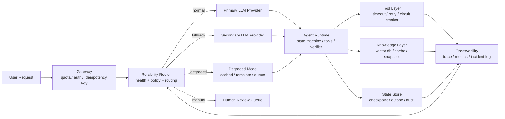

<section class="doc-hero">
  <p class="doc-hero__kicker">匿名真实面经</p>
  <h1>Agent 高可用与容灾面试深挖：别把“没做双活”答成短板</h1>
  <p class="doc-hero__lead">面试官问“上游挂了怎么办”，真正想听的是你有没有按业务等级设计恢复目标，而不是有没有盲目堆一套昂贵双活。</p>
  <div class="doc-hero__meta" aria-label="本文信息">
    <span>适合阶段：Agent 工程师 / 技术负责人面</span>
    <span>核心能力：RTO/RPO · 依赖分级 · 降级模式 · 演练复盘</span>
    <span>脱敏原则：只保留容灾方法，不保留真实业务细节</span>
  </div>
</section>

> 容灾不是“所有东西都做双活”，而是先定义哪些用户流程不能断、最多能断多久、最多能丢多少状态，再用成本匹配恢复目标。

> **本文边界**：单次 LLM 调用的 token bucket、熔断、重试和 provider fallback 见 [限流与降级](./rate-limiting)；trace、告警和投诉定位见 [可观测性](./observability)；线上质量和 badcase 闭环见 [Agent 线上质量治理](./agent-quality-interview)；运行时状态机、权限和恢复点见 [Agent Runtime 面试深挖](./agent-runtime-interview)。本文专讲面试里最容易卡住的 **系统级高可用与容灾决策**。

> **脱敏说明**：本文来自多场 Agent 工程岗位里反复出现的容灾追问。所有案例都抽象成通用业务 Agent，不出现可识别组织、真实项目、规模数字、收入、系统称呼或私有数据。

## 面试官想考什么

这组题看似在问运维，实际在考你是不是能把 AI 应用当成生产系统，而不是一个“能跑就行”的模型调用链。

<div class="interview-grid">
  <div>
    <strong>如果主模型供应商大面积 5xx 或延迟飙升，你的 Agent 怎么办？</strong>
    <span>考 provider 级容灾、模型兼容、降级口径和用户体验。</span>
  </div>
  <div>
    <strong>为什么没有直接做跨云双活？怎么判断值不值得？</strong>
    <span>考 RTO/RPO、成本、复杂度和业务等级，而不是“有钱就双活”。</span>
  </div>
  <div>
    <strong>Agent 的 RTO 和 RPO 怎么定义？是不是全系统一个值？</strong>
    <span>考你能不能按用户流程分级，而不是套传统系统模板。</span>
  </div>
  <div>
    <strong>备用模型切上去后，工具调用 schema 不兼容怎么办？</strong>
    <span>考 fallback 不是换 endpoint，而是完整适配工程。</span>
  </div>
  <div>
    <strong>向量库、工具 API、LLM、数据库分别挂了，降级策略一样吗？</strong>
    <span>考依赖分级和故障矩阵，能不能避免“一刀切不可用”。</span>
  </div>
  <div>
    <strong>容灾方案怎么验证？你怎么证明备用链路真的能接流量？</strong>
    <span>考演练、混沌测试、runbook 和故障注入。</span>
  </div>
  <div>
    <strong>出现部分失败时，是返回错误、排队、转人工，还是给简版结果？</strong>
    <span>考产品体验和工程风险边界。</span>
  </div>
  <div>
    <strong>上线后应该看哪些可靠性指标？只看可用率够不够？</strong>
    <span>考 degraded rate、failover time、stale answer、队列积压和人工接管。</span>
  </div>
</div>

## 为什么“想做双活但成本高”会失分

面试里很常见的一句回答是：

```text
我们考虑过双活，但成本太高，所以当时没做。
```

这句话本身可能是真的，但它没有表达决策能力。面试官会继续追：

```text
那你们的 RTO 是多少？
哪些链路可以降级，哪些链路必须停？
没做双活，有没有同区域多可用区、备用供应商、队列缓冲或手动切换？
你怎么知道这些方案真能恢复？
```

成熟的回答不是把“没做”包装成“以后会做”，而是把取舍讲清楚：

```text
我会先按用户流程分级。低风险查询允许返回缓存或简版结果，RTO 可以是分钟级；涉及写操作或高风险决策的流程，宁愿暂停或转人工，也不能用不可靠备用链路硬答。
当时如果业务等级还没到跨云双活，我会选择同区域多可用区、模型 provider fallback、工具超时降级、异步队列和定期演练。等 RTO/RPO 或收入损失证明值得，再升级到 warm standby 或 active-active。
```

这里有两个关键信号：

- 你不是为了省成本放弃可靠性，而是用恢复目标指导架构。
- 你知道 Agent 的“可用”不等于 HTTP 200，还包括回答质量、工具正确性、数据一致性和安全边界。

## 先定义恢复目标，而不是先画双活架构

传统系统里常说 RTO 和 RPO：

| 指标 | 问的是什么 | Agent 场景里的例子 |
|---|---|---|
| RTO | 故障后多久恢复可服务 | 主模型挂了，多久切到备用模型或简版模式 |
| RPO | 故障时最多能丢多少数据 | 对话状态、工具写入、任务进度最多回退到多久前 |
| SLO | 平时承诺什么服务水平 | 99.9% 请求在 5 秒内得到可用响应 |
| Error budget | 允许消耗多少失败额度 | 一周内 degraded answer 不能超过 1% |

Agent 的难点是：**不能给全系统一个统一 RTO/RPO**。同一个 Agent 里，不同流程的恢复目标可能完全不同。

| 流程类型 | 推荐策略 | RTO | RPO | 原因 |
|---|---|---:|---:|---|
| 普通知识问答 | 缓存 / RAG 简版 / 备用模型 | 秒级到分钟级 | 可无状态 | 用户能接受简化回答 |
| 数据查询 | 缓存 + 标注时间 / 排队重试 | 分钟级 | 最近一次成功快照 | 过期数据必须显式说明 |
| 写操作 | 幂等队列 / 暂停 / 人工确认 | 分钟到小时 | 0 或接近 0 | 不能重复写，也不能乱写 |
| 高风险建议 | 暂停 / 转人工 / 模板化提示 | 立即降级 | 0 | 错答比不答更危险 |
| 后台离线任务 | 队列积压后补跑 | 小时级 | 任务 checkpoint | 用户不在线等待 |

微软 Azure Well-Architected Reliability 文档反复强调：恢复目标要从业务关键流程推导，并且要能通过监控和测试验证。AWS 的灾备文档也把 backup/restore、pilot light、warm standby、multi-site 放在一条成本和恢复速度的谱系上，而不是默认 active-active。

面试里可以这样收束：

```text
我不会先承诺“全链路五个九”。我会按用户流程定义 RTO/RPO，再反推哪些依赖要双活、哪些可以降级、哪些必须直接停止。
```

## Agent 的故障矩阵

Agent 的故障面比传统 Web 服务宽，因为它把模型、工具、知识库、状态和安全策略串在了一起。

| 故障点 | 表面现象 | 不能直接做什么 | 更稳的策略 |
|---|---|---|---|
| 主模型 5xx / 429 | 请求失败或长时间无响应 | 无限重试 | 熔断、备用模型、简版回复 |
| 主模型质量退化 | HTTP 200 但回答变差 | 只看状态码 | 线上 judge、采样、模型回滚 |
| 工具 API 超时 | Agent 卡在某一步 | 让模型继续猜 | 工具级 timeout、缓存、排队、澄清 |
| 向量库不可用 | RAG 找不到资料 | 让模型凭记忆答 | 禁止无依据回答，切缓存或提示稍后 |
| 数据库主库故障 | 写操作失败 | fallback 到不一致副本写 | 写队列、只读模式、人工确认 |
| 观测系统故障 | 业务还能跑但不可追踪 | 当作没事 | 降低风险操作，至少本地审计 |
| 安全服务故障 | guardrail / PII 检测不可用 | 跳过安全检查 | 高风险流程暂停，低风险模板化 |
| 区域故障 | 多依赖同时异常 | 单点手动救火 | DNS / 流量切换 + runbook |

关键判断是：**不是所有故障都应该被备用模型兜住**。

如果 RAG 挂了，让模型“凭常识回答”可能会制造事实幻觉；如果安全服务挂了，跳过 guardrail 可能比停服更糟；如果数据库写失败，把写操作交给备用系统却没有幂等和一致性，后面补偿会更痛。

## 四种容灾策略怎么落到 Agent

AWS 常见的四档灾备策略，可以直接映射到 Agent 系统：

| 策略 | 成本 | 恢复速度 | Agent 落地方式 | 适合场景 |
|---|---:|---:|---|---|
| Backup & Restore | 低 | 慢 | prompt、配置、评估集、向量索引可重建 | 内部工具、低频后台任务 |
| Pilot Light | 中低 | 中 | 核心数据和配置同步，备用环境需扩容后接流量 | 业务重要但可短暂停服 |
| Warm Standby | 中高 | 快 | 备用模型、向量库、运行时常驻小容量 | 用户在线交互，允许简版服务 |
| Multi-site Active/Active | 高 | 很快 | 多区域/多 provider 同时承载流量 | 高收入、高 SLA、故障损失极大 |

AWS 文档里对 pilot light 和 warm standby 的区分很实用：pilot light 需要先“点亮”和扩容，warm standby 已经是缩小版可运行环境，只需要扩到完整容量。面试官问“为什么不双活”，你可以把答案放回这张表：

```text
如果 RTO 是小时级，backup/restore 或 pilot light 就够；如果 RTO 是分钟级，warm standby 更合适；只有当秒级恢复和极低数据丢失真的值这个成本时，才做 active-active。
```

这比“成本太高”更像工程决策。

## 一张可解释的 Agent 高可用架构



这张图的重点不是“画得复杂”，而是 **Reliability Router** 有权决定四件事：

- 正常走主模型。
- 主模型不可用但任务低风险，切备用模型。
- 依赖不完整时进入 degraded mode，返回缓存、简版结果或排队。
- 高风险写操作或安全判断不可用时，转人工或暂停。

Agent Runtime 不应该自己“随机尝试一切办法”。可靠性策略要写成可审计的 policy，不应该藏在 prompt 里。

## 可运行代码：用 policy 决定降级模式

下面这段代码不是 provider fallback 的完整实现，provider 熔断已经在 [限流与降级](./rate-limiting) 里讲过。这里演示的是系统级可靠性决策：同样的故障，低风险查询可以用缓存，高风险写操作必须暂停。

```python
from __future__ import annotations

from dataclasses import dataclass
from enum import Enum


class Criticality(str, Enum):
    LOW = "low"
    MEDIUM = "medium"
    HIGH = "high"


class Dependency(str, Enum):
    PRIMARY_LLM = "primary_llm"
    BACKUP_LLM = "backup_llm"
    VECTOR_DB = "vector_db"
    TOOL_API = "tool_api"
    STATE_STORE = "state_store"
    GUARDRAIL = "guardrail"


class Health(str, Enum):
    OK = "ok"
    DEGRADED = "degraded"
    DOWN = "down"


class Mode(str, Enum):
    NORMAL = "normal"
    BACKUP_MODEL = "backup_model"
    CACHED_READ = "cached_read"
    QUEUED_WRITE = "queued_write"
    TEMPLATE_ONLY = "template_only"
    MANUAL_REVIEW = "manual_review"
    FAIL_CLOSED = "fail_closed"


@dataclass(frozen=True)
class FlowPolicy:
    name: str
    criticality: Criticality
    requires_fresh_data: bool
    writes_state: bool
    requires_guardrail: bool
    max_staleness_seconds: int
    rto_seconds: int
    rpo_seconds: int


@dataclass(frozen=True)
class Decision:
    mode: Mode
    user_message: str
    operator_action: str
    reasons: list[str]


def decide_mode(policy: FlowPolicy, health: dict[Dependency, Health]) -> Decision:
    reasons: list[str] = []

    def bad(dep: Dependency) -> bool:
        return health.get(dep, Health.DOWN) != Health.OK

    if policy.requires_guardrail and bad(Dependency.GUARDRAIL):
        return Decision(
            mode=Mode.FAIL_CLOSED,
            user_message="当前能力暂不可用，请稍后再试。",
            operator_action="恢复 guardrail 后再开放高风险流程",
            reasons=["guardrail unavailable; fail closed"],
        )

    if policy.writes_state and bad(Dependency.STATE_STORE):
        return Decision(
            mode=Mode.QUEUED_WRITE,
            user_message="请求已进入待处理队列，完成后会更新结果。",
            operator_action="检查 outbox 积压和幂等键，恢复状态库后补偿",
            reasons=["state store unavailable; queue write instead of losing data"],
        )

    if bad(Dependency.PRIMARY_LLM):
        reasons.append("primary llm unavailable")
        if health.get(Dependency.BACKUP_LLM) == Health.OK and policy.criticality != Criticality.HIGH:
            return Decision(
                mode=Mode.BACKUP_MODEL,
                user_message="已切换到备用服务，回答可能更简略。",
                operator_action="观察 backup success rate、latency 和成本水位",
                reasons=reasons + ["backup llm is healthy"],
            )

        if policy.criticality == Criticality.LOW:
            return Decision(
                mode=Mode.TEMPLATE_ONLY,
                user_message="当前只能提供基础说明，复杂处理请稍后重试。",
                operator_action="等待主模型恢复，低风险流程保持模板服务",
                reasons=reasons + ["low criticality; template response allowed"],
            )

        return Decision(
            mode=Mode.MANUAL_REVIEW,
            user_message="当前请求需要人工确认后处理。",
            operator_action="把请求送入人工队列，避免高风险错误回复",
            reasons=reasons + ["no safe model path"],
        )

    if policy.requires_fresh_data and bad(Dependency.TOOL_API):
        return Decision(
            mode=Mode.MANUAL_REVIEW if policy.criticality == Criticality.HIGH else Mode.CACHED_READ,
            user_message="实时数据暂不可用，先返回最近一次可确认的信息。",
            operator_action="检查工具 API 超时率，恢复后回补缓存",
            reasons=["fresh tool data unavailable"],
        )

    if bad(Dependency.VECTOR_DB):
        return Decision(
            mode=Mode.CACHED_READ,
            user_message="检索服务暂时降级，回答仅基于已缓存资料。",
            operator_action="检查向量库和索引快照，禁止无引用生成",
            reasons=["vector db unavailable; use cache with explicit staleness"],
        )

    return Decision(
        mode=Mode.NORMAL,
        user_message="",
        operator_action="continue normal serving",
        reasons=["all required dependencies healthy"],
    )


if __name__ == "__main__":
    read_flow = FlowPolicy(
        name="knowledge_lookup",
        criticality=Criticality.LOW,
        requires_fresh_data=False,
        writes_state=False,
        requires_guardrail=False,
        max_staleness_seconds=3600,
        rto_seconds=60,
        rpo_seconds=0,
    )
    write_flow = FlowPolicy(
        name="state_changing_action",
        criticality=Criticality.HIGH,
        requires_fresh_data=True,
        writes_state=True,
        requires_guardrail=True,
        max_staleness_seconds=0,
        rto_seconds=300,
        rpo_seconds=0,
    )
    outage = {
        Dependency.PRIMARY_LLM: Health.DOWN,
        Dependency.BACKUP_LLM: Health.OK,
        Dependency.VECTOR_DB: Health.OK,
        Dependency.TOOL_API: Health.OK,
        Dependency.STATE_STORE: Health.OK,
        Dependency.GUARDRAIL: Health.OK,
    }
    for flow in (read_flow, write_flow):
        decision = decide_mode(flow, outage)
        print(flow.name, decision.mode.value, "|", "; ".join(decision.reasons))
```

运行结果：

```text
knowledge_lookup backup_model | primary llm unavailable; backup llm is healthy
state_changing_action manual_review | primary llm unavailable; no safe model path
```

这就是面试里最关键的点：同样是主模型挂了，低风险查询可以切备用，高风险写操作不一定能切。**可用性不是让系统永远回答，而是让系统在故障时仍然做正确的事**。

## 备用模型不是换 endpoint

[限流与降级](./rate-limiting) 已经讲过 provider fallback 的四个坑：prompt 不兼容、结构化输出差异、成本差异、上下文窗口差异。容灾面试里还要再补三层：

| 层 | 要同步验证什么 | 不做会怎样 |
|---|---|---|
| Prompt adapter | system message、tool schema、JSON 约束 | 备用模型看不懂主模型 prompt |
| Eval compatibility | 同一批 high-risk case 跑主备模型 | 切换后质量不可控 |
| State compatibility | tool call id、checkpoint、trace schema | 故障中断后无法恢复现场 |

面试里可以给一个清晰口径：

```text
备用模型要进同一套评估和回归，不是只配一个 API key。上线前我会跑主备模型 case-level diff，尤其看工具参数、拒答边界、JSON schema 和高风险样本。备用链路的质量目标可以低于主链路，但不能低于安全门槛。
```

OpenAI 和 Anthropic 的 status page 都长期公开历史事件。只要依赖外部模型供应商，就要默认“某天会出现高错误率、延迟升高或特定模型不可用”。这不是哪家供应商好不好的问题，而是生产系统的基本假设。

## 数据一致性：Agent 容灾里最容易被忽略的一层

很多人把 Agent 容灾理解成“主模型挂了切备用模型”。真正麻烦的往往是状态和写操作。

一个业务 Agent 可能会做这些事：

- 读取资料后生成建议。
- 调工具创建任务。
- 修改某个业务状态。
- 把多步执行结果写入 memory。
- 在失败后重试。

如果没有幂等和 outbox，故障时很容易出现两类事故：

```text
用户点击一次，主链路超时，备用链路又执行一次 -> 重复写。
LLM 已经告诉用户“处理成功”，但状态库写失败 -> 用户看到的结果和系统事实不一致。
```

容灾设计里至少要有四个工程约束：

| 约束 | 做法 | 面试表达 |
|---|---|---|
| 幂等键 | 每个写操作带 request_id / idempotency_key | 重试和切换不会重复写 |
| Outbox | 先记录意图，再异步执行外部副作用 | 故障后能补偿，不靠上下文猜 |
| Checkpoint | 每个 Agent step 持久化状态 | 故障后从确定步骤恢复 |
| 审计日志 | 记录谁在何时触发了什么动作 | 事故复盘能还原事实 |

这和 [Agent Runtime](./agent-runtime) 的状态机是同一件事的可靠性版本：模型可以决定“想做什么”，但写操作的提交、幂等、补偿和回滚必须由确定性系统管理。

## 容灾演练：没演练过的备用链路等于没有

Google SRE 书里有一句非常适合放进面试的观点：平时不用的降级路径，往往在真故障时也不能用。Azure 的可靠性测试文档也强调，要用故障场景验证系统能否在目标时间内恢复。

Agent 的演练可以按月做小规模，不一定上来就全站 chaos：

| 演练场景 | 注入方式 | 观察指标 |
|---|---|---|
| 主模型 5xx | mock provider 返回 503 | failover time、fallback success、成本 |
| 主模型高延迟 | 人为 sleep 到超时 | timeout 是否生效、队列是否积压 |
| 备用模型 schema 差异 | 让备用模型返回非法 JSON | verifier 是否挡住 |
| 向量库不可用 | 禁用 retrieval client | 是否禁止无依据回答 |
| 工具 API 超时 | mock tool timeout | 是否排队、缓存或转人工 |
| 状态库不可写 | 拒绝写入 checkpoint | 是否停止高风险流程 |
| 观测系统故障 | trace sink 丢包 | 本地审计是否兜底 |

每次演练至少产出三样东西：

- **恢复时间**：从故障注入到系统进入目标模式用了多久。
- **用户影响**：有多少请求失败、降级、排队、转人工。
- **修复项**：runbook 哪一步不清楚，哪个 adapter 没测，哪个告警太晚。

这部分在面试里很加分，因为它把“我会设计”升级成“我知道怎么证明设计有效”。

## 线上可靠性指标怎么设

只看接口可用率不够。Agent 可能 HTTP 200，但回答来自过期缓存；可能成功 fallback，但备用模型把结构化输出搞坏；也可能没有报错，但用户等了 20 秒。

| 指标 | 说明 | 告警含义 |
|---|---|---|
| Availability by flow | 按用户流程看可用性 | 不同流程 SLA 不同 |
| Degraded rate | 进入简版、缓存、备用模型的比例 | 主链路或依赖有问题 |
| Failover time | 故障到切换完成的时间 | RTO 是否达标 |
| Fallback success rate | 备用链路成功率 | 备用链路是否真能用 |
| Stale answer rate | 返回缓存或旧快照的比例 | 数据新鲜度风险 |
| Queue depth | 待补偿任务数量 | 写操作是否积压 |
| Manual review rate | 转人工比例 | 自动化能力或安全服务异常 |
| Unsafe fail-open count | 安全依赖失败但继续执行次数 | 应该强告警，最好为 0 |

面试答法：

```text
我会把可靠性看板拆成 flow 级别，而不是只看全站 99.9%。普通查询可以看 degraded rate 和 stale rate，写操作要看 outbox 积压和补偿成功率，高风险流程要看 fail-closed 是否生效。
```

## 常见陷阱

### 陷阱 1：把双活当成成熟度证明

**现象**：一被问容灾就说跨区域、跨云、active-active。

**根因**：没有先定义 RTO/RPO，直接上最贵方案。active-active 会引入数据一致性、流量调度、版本同步、成本翻倍和演练复杂度。

**修法**：按流程分级。先用 backup/restore、pilot light、warm standby 建立可验证恢复能力，只有当业务损失和恢复目标证明值得时再做 active-active。

### 陷阱 2：备用链路没有跑过真实评估集

**现象**：主模型挂了切备用，接口成功了，但工具参数、JSON、拒答边界全部退化。

**根因**：只测试了连通性，没有测试语义兼容性。

**修法**：备用模型进同一套 eval。至少跑工具调用、高风险拒答、结构化输出、长上下文截断和历史 badcase。

### 陷阱 3：降级路径太复杂，真故障时没人敢开

**现象**：文档里有十几种降级模式，事故时大家不知道该切哪一个。

**根因**：降级策略没有产品分级，也没有演练。复杂降级本身会制造新故障。

**修法**：把降级模式压成少数几档：正常、备用模型、缓存简版、排队、转人工、fail closed。每档写清触发条件和用户文案。

### 陷阱 4：把安全依赖当成普通依赖

**现象**：guardrail 或敏感信息检测挂了，系统为了可用继续回答。

**根因**：把安全当成附加功能，而不是高风险流程的硬门槛。

**修法**：高风险流程 fail closed；低风险流程可以模板化。安全服务故障要进入独立告警，不要被普通可用率掩盖。

### 陷阱 5：只看 status page，不看自己的成功率

**现象**：供应商 status page 显示正常，但你的请求延迟和错误率已经异常。

**根因**：外部状态页是聚合视角，不等于你的模型、区域、账号、套餐、功能组合都正常。

**修法**：自己做 synthetic probe 和真实流量监控。按 provider、model、region、endpoint、error_type 切分，不要只看一个全局错误率。

### 陷阱 6：写操作没有幂等，重试和切换会放大事故

**现象**：故障恢复后出现重复任务、重复通知或状态不一致。

**根因**：Agent 把“我要执行”的自然语言意图直接变成副作用，没有 idempotency key、outbox 和 checkpoint。

**修法**：所有副作用走确定性 command layer。模型只能产生命令草案，执行层负责幂等、权限、提交、补偿和审计。

## 与相邻文章的区别

| 文章 | 重点 | 本文不重复什么 |
|---|---|---|
| [限流与降级](./rate-limiting) | 单次调用的限额、重试、熔断、fallback chain | 不展开 token bucket 代码 |
| [可观测性](./observability) | trace/span、日志、告警、调试工作流 | 不讲平台选型 |
| [线上质量治理](./agent-quality-interview) | 质量评估、badcase、回归集 | 不讲 judge 细节 |
| [Agent Runtime](./agent-runtime) | 状态机、工具、权限、运行时平面 | 不重复 runtime 架构总览 |
| [成本优化](./cost-optimization) | 缓存、路由、batch、降本 | 不把容灾简化成省钱 |

这篇文章更像面试中的“硬工程追问”：你如何在有限成本下承诺可靠性，并且能证明承诺有效。

## 面试题深度解析

### Q1：为什么没有直接做跨云双活？怎么讲才不显得是短板？

**30 秒版本**：我不会把双活当成默认答案，而是先看流程级 RTO/RPO。如果目标是分钟级恢复，warm standby 或 provider fallback 可能比跨云 active-active 更合理；如果目标是秒级恢复且故障损失能覆盖成本，再上双活。

**追问 1：面试官问“那你做了什么替代？”**

答同区域多可用区、备用模型、关键配置备份、向量索引快照、写操作 outbox、工具超时降级和定期演练。重点是“可验证恢复能力”，不是“什么都没做”。

**追问 2：怎么判断以后要升级？**

看三个信号：故障造成的业务损失超过备用成本，RTO/RPO 从分钟级收紧到秒级，单 provider 或单区域风险已经成为主要风险。升级是业务等级变化，不是架构洁癖。

### Q2：主模型挂了，直接切备用模型可以吗？

**30 秒版本**：低风险流程可以，高风险流程不一定。备用模型必须经过 prompt adapter、schema 验证、eval 兼容和安全门槛；如果这些不满足，宁愿返回简版、排队或转人工。

**追问 1：备用模型质量差怎么办？**

把 fallback 目标定义成“安全可用”，不是“质量等同”。例如只允许回答确定性查询、缓存资料和模板化说明，不让它执行复杂写操作。

**追问 2：怎么测试备用链路？**

定期故障注入：主模型返回 503、备用模型返回非法 JSON、工具超时、向量库不可用。看 failover time、fallback success、degraded rate、成本和用户文案是否符合预期。

### Q3：Agent 的 RTO/RPO 怎么定义？

**30 秒版本**：不要按系统定义，要按用户流程定义。普通查询可以分钟级 RTO 和可标注缓存；写操作 RPO 要接近 0；高风险流程在关键依赖不可用时 fail closed。

**追问 1：RPO 在 Agent 里看什么？**

看对话状态、任务 checkpoint、工具写入、memory 更新和审计日志最多能回退到哪里。无状态问答 RPO 压力小，多步写操作 RPO 压力大。

**追问 2：如果恢复后上下文丢了怎么办？**

不能让模型猜。用 checkpoint 恢复到确定步骤，把未完成动作放进 outbox，必要时让用户确认。恢复逻辑要由 runtime 管，不应该靠 prompt 让模型“回忆一下”。

### Q4：容灾方案怎么证明有效？

**30 秒版本**：靠演练，不靠文档。每月或每个大版本做故障注入，验证主模型、备用模型、工具 API、向量库、状态库、观测系统分别故障时的恢复时间和用户影响。

**追问 1：演练会影响线上用户怎么办？**

先从 staging 和小流量 shadow 开始，再做可控生产演练。故障注入要有 kill switch、观察窗口和回滚负责人。

**追问 2：演练后产出什么？**

产出 failover time、失败请求数、降级比例、积压任务、告警延迟、runbook 缺口和修复 owner。演练不是表演，是发现备用链路哪里没适配。

### Q5：只看 availability 是否足够？

**30 秒版本**：不够。Agent 的 HTTP 200 可能是过期缓存、低质量备用模型或未过安全检查的结果。要看 flow availability、degraded rate、stale answer rate、fallback success、manual review rate 和 unsafe fail-open。

**追问 1：degraded rate 高说明什么？**

可能主链路不稳定，也可能降级阈值太敏感。要和 provider error、latency、tool timeout、queue depth 一起看。

**追问 2：哪些指标必须强告警？**

高风险流程 fail-open、状态写入失败、outbox 积压持续增长、fallback success 下降、guardrail 不可用但请求继续执行。这些不是普通体验问题，而是事故前兆。

## 延伸阅读

- [AWS Disaster Recovery Options in the Cloud](https://docs.aws.amazon.com/whitepapers/latest/disaster-recovery-workloads-on-aws/disaster-recovery-options-in-the-cloud.html)  
  为什么读：backup/restore、pilot light、warm standby、multi-site 的经典分层，适合把“为什么不双活”讲成架构取舍。

- [Azure Well-Architected Reliability: Define reliability targets](https://learn.microsoft.com/en-us/azure/well-architected/reliability/metrics)  
  为什么读：RTO/RPO/SLO 要从关键用户流程推导，而不是架构师拍脑袋承诺。

- [Azure Well-Architected Reliability: Disaster recovery strategies](https://learn.microsoft.com/en-us/azure/well-architected/reliability/disaster-recovery)  
  为什么读：强调 DR plan 必须结构化、可测试，并覆盖组件和系统整体。

- [Azure Well-Architected Reliability Testing](https://learn.microsoft.com/en-us/azure/well-architected/reliability/reliability-test)  
  为什么读：把“容灾演练”从口头方案落到可验证的 fault scenario 和 recovery target。

- [Google SRE Book: Cascading Failures](https://sre.google/sre-book/addressing-cascading-failures/)  
  为什么读：里面对 graceful degradation 的提醒很适合 Agent：平时不用的降级路径，真故障时往往也不会工作。

- [Google SRE Book: Handling Overload](https://sre.google/sre-book/handling-overload/)  
  为什么读：解释 degraded response、load shedding 和过载保护，能补足 LLM 限流之外的系统可靠性直觉。

- [OpenAI Status History](https://status.openai.com/history)  
  为什么读：外部模型供应商也会出现错误率、延迟和功能级事件。读它不是为了挑毛病，而是建立“依赖会故障”的生产假设。

- [Claude Status](https://status.claude.com/)  
  为什么读：Anthropic 按组件展示 uptime 和历史事件，适合理解“整体 operational”不等于你的具体模型和功能永远可用。

- 配套阅读：[限流与降级](./rate-limiting)、[可观测性](./observability)、[Agent Runtime](./agent-runtime)、[Agent 线上质量治理](./agent-quality-interview)。  
  为什么读：本文讲系统级可靠性，真正上线时必须把熔断、trace、runtime 状态和质量闭环接在一起。
