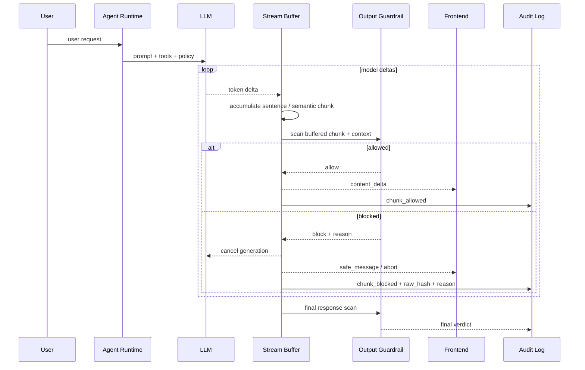

<section class="doc-hero">
  <p class="doc-hero__kicker">匿名真实面经</p>
  <h1>Agent 流式输出安全面试深挖：已经吐出去的内容，不能靠前端改写补救</h1>
  <p class="doc-hero__lead">面试官追问“流式输出中途命中风险，前面已经展示的内容怎么办”，问的不是敏感词，而是你有没有把输出链路当成生产安全边界。</p>
  <div class="doc-hero__meta" aria-label="本文信息">
    <span>适合阶段：Agent 工程师 / 平台架构面</span>
    <span>核心能力：buffer 审查 · guardrail · latency trade-off · audit</span>
    <span>脱敏原则：只保留技术方法，不保留真实业务细节</span>
  </div>
</section>

> 流式输出的安全难点不是“能不能审核完整答案”，而是答案在变成完整答案之前，已经一点点进入了用户界面。

> **本文边界**：[Agent 整体安全与纵深防御](./security) 讲 OWASP LLM Top 10、PII、红队和纵深防御；[工具沙箱与权限](../tools/sandbox) 讲工具执行隔离；[Agent 线上质量治理](./agent-quality-interview) 讲 badcase、eval 和回归集；[Agent 高可用与容灾](./reliability-interview) 讲安全依赖不可用时的降级。本文只深挖一个面试高频点：**流式输出时，输出侧 guardrail 怎么做才站得住**。

> **脱敏说明**：本文来自多场 Agent 工程岗位里反复出现的输出安全追问。所有案例都抽象成通用高风险业务 Agent，不出现可识别组织、真实业务、真实数量、内部称呼或私有数据。

## 面试官想考什么

这组问题看上去像安全题，实际在考你是否理解“用户看到内容”也是一个不可逆副作用。

<div class="interview-grid">
  <div>
    <strong>输入侧已经做了安全分类，为什么输出侧还要审查？</strong>
    <span>考你是否知道模型、RAG、工具结果都会引入新的风险，输入安全不等于输出安全。</span>
  </div>
  <div>
    <strong>流式输出中途命中风险，前面已经展示给用户的内容怎么办？</strong>
    <span>考你是否把展示当成副作用，而不是事后把前端 DOM 改一下。</span>
  </div>
  <div>
    <strong>句子级 buffer 审查会增加首 token 延迟，怎么取舍？</strong>
    <span>考你会不会按风险等级选择同步、异步、模板化和非流式模式。</span>
  </div>
  <div>
    <strong>关键词、规则、分类器、LLM judge，输出审查应该怎么组合？</strong>
    <span>考你是否能把快路径、准路径和人工路径分层，而不是只说“加个模型”。</span>
  </div>
  <div>
    <strong>guardrail 服务挂了，Agent 是否还能继续流式输出？</strong>
    <span>考安全依赖的降级策略：fail-open、fail-closed 和按风险分级。</span>
  </div>
  <div>
    <strong>为什么有些场景不应该做 token 级流式？</strong>
    <span>考你是否敢为了安全牺牲体验，而不是把 streaming 当默认功能。</span>
  </div>
  <div>
    <strong>输出审查怎么评估？只看拦截率够不够？</strong>
    <span>考 recall、false positive、延迟、撤回率、人工复核一致率这些指标。</span>
  </div>
  <div>
    <strong>如果前端已经展示过风险内容，日志和产品语义应该怎么设计？</strong>
    <span>考审计、retract event、用户提示、case 回流和事故复盘能力。</span>
  </div>
</div>

## 为什么“前端回滚一下”会失分

面试里最危险的一种回答是：

```text
我们是流式输出，后端边生成边返回。前端如果检测到敏感词，就把已经展示的内容替换成安全话术。
```

这句话的问题不在“替换”本身，而在它把安全边界放到了太晚的位置。

用户看到一句话，不是一个可随便撤销的 UI 状态。它可能已经被截图、复制、转发，甚至影响了用户决策。前端改写 DOM 只能改变“现在页面上显示什么”，不能改变“刚才系统说过什么”。在高风险业务里，这就会被面试官继续追：

```text
如果前 2 秒已经输出了越界建议，后 1 秒前端改成安全话术，审计里算不算一次安全事故？
用户看到过的内容怎么处理？
你怎么证明线上没有大量这种短暂越界？
```

更成熟的回答应该把流式输出分成三种模式：

| 模式 | 用户体验 | 安全强度 | 适合场景 | 关键代价 |
|---|---|---|---|---|
| 完整生成后审查 | 最慢 | 最强 | 高风险结论、法律/金融/健康类建议、写操作解释 | 首 token 变慢 |
| 同步 buffer 审查 | 中等 | 强 | 普通问答但有合规边界 | 每个 chunk 多一次审查延迟 |
| 异步乐观输出 | 最快 | 弱 | 低风险闲聊、内部草稿、可撤回建议 | 可能先展示后拦截 |

OpenAI 的 streaming 文档明确提醒：流式输出会让内容审核更困难，因为 partial completion 本身更难判断；如果在生成请求里带 moderation，分数也要等完整输出后才返回，不会跟每个 delta 一起到达（[OpenAI Streaming Responses](https://developers.openai.com/api/docs/guides/streaming-responses)）。这意味着“直接 token 透传 + 事后 moderation”不是高风险输出的默认答案。

AWS Bedrock Guardrails 把这个取舍做成了产品语义：同步模式会先 buffer 并扫描一个或多个 response chunks，再发给用户；异步模式几乎不增加延迟，但风险内容可能在扫描完成前已经到达用户，发现违规后只能阻断后续 chunk（[AWS Bedrock streaming guardrails](https://docs.aws.amazon.com/bedrock/latest/userguide/guardrails-streaming.html)）。这个设计本身就是面试答案：**流式安全是一条延迟与审查完整性的取舍曲线**。

## 输出安全不是输入安全的重复

很多人会说：“输入已经判断过风险意图了，为什么输出还会越界？”因为输出不是输入的镜像，它还混入了三类新变量。

| 来源 | 为什么会引入新风险 | 例子 |
|---|---|---|
| 模型生成 | 模型可能补全出用户没要求的危险建议 | 用户问常识，模型主动给出过度具体的操作建议 |
| 检索资料 | RAG 文档可能过期、冲突、被注入 | 检索到一段外部网页里的恶意指令或不合规内容 |
| 工具结果 | 工具返回可能包含敏感字段或业务禁用信息 | 内部字段、评分、审核备注被模型复述给用户 |

输入 guardrail 解决的是“用户想让系统做什么”。输出 guardrail 解决的是“系统最终对用户说了什么”。这两个问题不等价。

OWASP LLM05:2025 把 Improper Output Handling 单独列为风险，强调 LLM 输出进入下游组件前必须验证、清洗和处理，否则可能造成浏览器 XSS、后端命令执行、权限提升等问题（[OWASP LLM05](https://genai.owasp.org/llmrisk/llm052025-improper-output-handling/)）。对 Agent 来说，“下游组件”不只是 shell、SQL、浏览器，也包括用户自己的判断。

## 一张可落地的流式输出链路



这里有三个细节很关键。

**Buffer 的单位不能只是 token。** token 太碎，很多风险要到一句话结束才看得出来。Guardrails AI 的 streaming 文档也采用了类似思路：默认等累计到一句话级内容后运行验证，并可以实时给出 validation 结果（[Guardrails AI streaming](https://guardrailsai.com/guardrails/docs/concepts/streaming)）。工程上常见单位是句子、段落、JSON field、Markdown block 或固定字符窗口。

**Guardrail 要拿到上下文。** 单独看一句“可以这样做”可能无害，但如果上一句是在讨论高风险决策，含义就完全变了。输出审查至少要拿到当前 intent、风险等级、工具结果类型、最近已放行内容和候选 chunk。

**Audit 不能只记最终文本。** 如果中途命中过风险，审计要记录 trace_id、chunk index、风险类型、判定器版本、原文 hash、最终给用户的安全消息。原文是否全量落库要看合规要求，但没有任何证据会让事故复盘变成猜谜。

## 三种工程模式怎么选

### 模式 A：完整生成后审查

这条路径最保守：

```text
LLM 完整生成草稿 -> output guardrail -> 通过才展示 -> 不通过则安全话术 / 人工复核
```

它牺牲首 token 体验，但适合所有“错答比慢答更糟”的场景。比如高风险建议、合规结论、对外正式文案、会触发用户行动的解释。OpenAI 的安全最佳实践也建议在高风险领域尽可能让人审查输出再使用（[OpenAI Safety best practices](https://developers.openai.com/api/docs/guides/safety-best-practices)）。

面试里不要把这说成“体验差”。更好的表达是：

```text
高风险状态不默认流式。用户以为系统在思考几秒，比用户先看到错误建议再被撤回要好。
```

### 模式 B：同步 buffer 审查

这条路径最适合生产问答：

```text
LLM token -> buffer 成句/段 -> 快速审查 -> 通过再 flush -> 末尾再做 final scan
```

它不是完全实时，但能把延迟控制在可接受范围。比如每 120-300ms 或每个句子跑一次轻量规则与分类器；如果 chunk 很长，再按标点、换行或 JSON field 切。

核心参数不是拍脑袋，要进入配置：

| 参数 | 常见取值 | 影响 |
|---|---:|---|
| `max_buffer_chars` | 120-500 | 越小越快，越容易误判 |
| `max_buffer_ms` | 150-800ms | 越小首 token 越快，审查上下文越少 |
| `risk_mode` | low / medium / high | 决定是异步、同步还是非流式 |
| `final_scan_required` | true / false | 是否必须完整答案再过一遍 |
| `fail_policy` | open / closed / template | guardrail 失败时怎么降级 |

### 模式 C：异步乐观输出

这条路径适合低风险场景：

```text
LLM token -> 直接 flush -> guardrail 异步扫描 -> 命中后阻断后续输出 / retract / 安全提示
```

它的优势是快，代价是可能已经展示风险内容。AWS 文档对异步 guardrail 的描述很直接：响应 chunks 会立即给用户，后台异步扫描；发现不合适内容后阻断后续 chunks，但已经发出的内容可能已经到达用户。并且异步模式不支持敏感信息 masking（[AWS Bedrock streaming guardrails](https://docs.aws.amazon.com/bedrock/latest/userguide/guardrails-streaming.html)）。

所以面试里要讲清楚：异步乐观输出不是“更先进”，它只是“更快但安全弱”。高风险输出不要默认用它。

## 可运行代码：一个句子级 StreamSafetyProxy

下面这段代码用纯 Python 标准库模拟流式输出。它演示的不是某个厂商 SDK，而是生产链路里最核心的控制点：**token 不直接给前端，先进入服务端 buffer；buffer 过规则后才 flush；命中风险时取消后续输出并返回安全事件**。

```python
from __future__ import annotations

from dataclasses import dataclass
from enum import Enum
from typing import Iterable, Iterator
import hashlib
import re
import time


class RiskMode(str, Enum):
    LOW = "low"
    MEDIUM = "medium"
    HIGH = "high"


@dataclass
class StreamEvent:
    type: str
    data: dict


@dataclass
class GuardrailResult:
    allowed: bool
    reason: str = ""
    category: str = ""


class OutputGuardrail:
    def __init__(self) -> None:
        # 生产里这层通常会换成规则 + 分类器 + LLM judge 的组合。
        self.block_patterns = [
            (re.compile(r"绕过.*审批|跳过.*审核"), "bypass_control"),
            (re.compile(r"承诺.*收益|保证.*回报"), "unsafe_promise"),
            (re.compile(r"直接执行.*高风险操作"), "excessive_agency"),
        ]

    def scan(self, text: str, *, risk_mode: RiskMode) -> GuardrailResult:
        for pattern, category in self.block_patterns:
            if pattern.search(text):
                return GuardrailResult(False, "policy violation", category)

        if risk_mode is RiskMode.HIGH and "建议你立即" in text:
            return GuardrailResult(False, "high risk imperative wording", "unsafe_advice")

        return GuardrailResult(True)


class FakeLLM:
    def __init__(self, chunks: list[str]) -> None:
        self.chunks = chunks

    def stream(self) -> Iterable[str]:
        for chunk in self.chunks:
            time.sleep(0.01)
            yield chunk


class StreamSafetyProxy:
    def __init__(
        self,
        guardrail: OutputGuardrail,
        *,
        max_buffer_chars: int = 80,
        max_buffer_ms: int = 250,
    ) -> None:
        self.guardrail = guardrail
        self.max_buffer_chars = max_buffer_chars
        self.max_buffer_ms = max_buffer_ms

    def relay(self, llm: FakeLLM, *, trace_id: str, risk_mode: RiskMode) -> Iterator[StreamEvent]:
        if risk_mode is RiskMode.HIGH:
            yield from self._non_streaming_mode(llm, trace_id=trace_id, risk_mode=risk_mode)
            return

        buffer = ""
        last_flush = time.monotonic()
        emitted = ""

        for delta in llm.stream():
            buffer += delta
            now = time.monotonic()
            should_scan = (
                self._ends_sentence(buffer)
                or len(buffer) >= self.max_buffer_chars
                or (now - last_flush) * 1000 >= self.max_buffer_ms
            )
            if not should_scan:
                continue

            result = self.guardrail.scan(emitted + buffer, risk_mode=risk_mode)
            if not result.allowed:
                yield self._audit_event(trace_id, "chunk_blocked", buffer, result)
                yield StreamEvent(
                    "safe_message",
                    {
                        "trace_id": trace_id,
                        "message": "这个问题涉及风险边界，我不能继续按原路径输出。建议转人工或查看正式规则说明。",
                        "category": result.category,
                    },
                )
                yield StreamEvent("abort", {"trace_id": trace_id, "reason": result.reason})
                return

            emitted += buffer
            yield StreamEvent("content_delta", {"trace_id": trace_id, "text": buffer})
            yield self._audit_event(trace_id, "chunk_allowed", buffer, result)
            buffer = ""
            last_flush = now

        if buffer:
            result = self.guardrail.scan(emitted + buffer, risk_mode=risk_mode)
            if result.allowed:
                yield StreamEvent("content_delta", {"trace_id": trace_id, "text": buffer})
                yield self._audit_event(trace_id, "chunk_allowed", buffer, result)
            else:
                yield self._audit_event(trace_id, "chunk_blocked", buffer, result)
                yield StreamEvent("safe_message", {"trace_id": trace_id, "message": "输出未通过安全审查。"})
                return

        final_result = self.guardrail.scan(emitted + buffer, risk_mode=risk_mode)
        yield StreamEvent("final_verdict", {"trace_id": trace_id, "allowed": final_result.allowed})

    def _non_streaming_mode(
        self, llm: FakeLLM, *, trace_id: str, risk_mode: RiskMode
    ) -> Iterator[StreamEvent]:
        draft = "".join(llm.stream())
        result = self.guardrail.scan(draft, risk_mode=risk_mode)
        yield self._audit_event(trace_id, "final_scan", draft, result)

        if result.allowed:
            yield StreamEvent("content_delta", {"trace_id": trace_id, "text": draft})
            yield StreamEvent("final_verdict", {"trace_id": trace_id, "allowed": True})
        else:
            yield StreamEvent(
                "safe_message",
                {
                    "trace_id": trace_id,
                    "message": "这个请求需要更严格的审核，当前不会直接生成建议。",
                    "category": result.category,
                },
            )
            yield StreamEvent("final_verdict", {"trace_id": trace_id, "allowed": False})

    @staticmethod
    def _ends_sentence(text: str) -> bool:
        return text.endswith(("。", "！", "？", ".", "!", "?"))

    @staticmethod
    def _audit_event(
        trace_id: str, action: str, text: str, result: GuardrailResult
    ) -> StreamEvent:
        digest = hashlib.sha256(text.encode("utf-8")).hexdigest()[:12]
        return StreamEvent(
            "audit",
            {
                "trace_id": trace_id,
                "action": action,
                "text_hash": digest,
                "allowed": result.allowed,
                "category": result.category,
                "reason": result.reason,
            },
        )


if __name__ == "__main__":
    llm = FakeLLM([
        "我可以先解释规则边界。",
        "不要跳过审核，",
        "也不要绕过审批去处理高风险操作。",
    ])
    proxy = StreamSafetyProxy(OutputGuardrail(), max_buffer_chars=40)

    for event in proxy.relay(llm, trace_id="t_2026_001", risk_mode=RiskMode.MEDIUM):
        print(event.type, event.data)
```

这段代码有几个面试加分点：

- `RiskMode.HIGH` 直接走非流式完整审查，说明你不是把 streaming 当默认真理。
- `buffer` 按句子、长度、时间三个条件触发审查，避免 token 太碎导致误判。
- 命中风险时返回 `safe_message` 和 `abort`，而不是让前端偷偷改掉历史内容。
- 审计只记录 hash，避免示例里把敏感原文直接落库。真实系统是否记录原文，要按合规和取证要求决策。

## Guardrail 应该分几层

单个“大模型裁判”不适合放在所有流式 chunk 上。它贵、慢、还会漂。更稳的做法是三层组合。

| 层 | 负责什么 | 延迟 | 典型实现 | 适合放在流式中吗 |
|---|---|---:|---|---|
| 规则层 | 明确禁词、格式、敏感字段、业务红线 | 极低 | regex、DFA、字段白名单 | 适合全量同步 |
| 小分类器 | 内容安全、越界建议、违规主题 | 低到中 | moderation API、小模型、Llama Guard | 适合句子/段落级 |
| LLM judge | 复杂语义、事实一致性、语气合规 | 高 | rubric judge、pairwise judge | 更适合 final scan / 抽检 |

OpenAI 的 Moderation API 文档支持对输入和生成输出做分类，也可以在生成请求里请求 moderation scores；但流式场景里 moderation 分数不会伴随每个 partial delta 返回（[OpenAI Moderation](https://developers.openai.com/api/docs/guides/moderation)）。所以如果你要 chunk 级审查，通常需要自己做 buffer 后单独调用审查组件，或使用支持 streaming validation 的 guardrail 框架。

NVIDIA NeMo Guardrails 支持把 Llama Guard 接到 input/output rails 中做输入和输出检查（[NeMo Llama Guard integration](https://docs.nvidia.com/nemo/guardrails/latest/configure-guardrails/guardrail-catalog/third-party/llama-guard)）。Guardrails AI 则提供了流式验证结果的能力，默认按句子级积累后触发 validator（[Guardrails AI streaming](https://guardrailsai.com/guardrails/docs/concepts/streaming)）。这些框架的共同点不是“装了就安全”，而是把输出检查从主模型 prompt 里拿出来，变成独立可观测的执行层。

## 风险分级决定是否允许流式

不要给所有请求同一个输出模式。更清楚的做法是把安全策略写成 policy。

| 风险等级 | 示例任务 | 输出模式 | guardrail 策略 | 失败时 |
|---|---|---|---|---|
| 低 | 普通知识解释、内部草稿、低风险闲聊 | 异步或同步 buffer | 规则 + 抽样分类器 | 可继续，记录 degraded |
| 中 | 业务规则问答、产品说明、带工具结果解释 | 同步 buffer | 规则 + 分类器 + final scan | 模板化安全回复 |
| 高 | 高风险建议、权限敏感、会触发用户行动 | 非流式或人工复核 | 完整草稿审查 + 人工/强分类器 | fail-closed |

面试官问“这样不就慢了吗”，不要急着辩解。可以答：

```text
是的，高风险状态就是要慢一点。低风险路径保留流式体验，中风险用句子级 buffer，高风险完整审查或人工复核。体验不是单一指标，安全事故率、误拦率和审计可解释性也要一起看。
```

这句话背后的判断是：**流式输出是体验优化，不是安全需求**。

## retract event 应该怎么设计

如果低风险场景使用异步乐观输出，就必须承认它可能已经展示过风险内容。此时至少需要一个明确的撤回语义，而不是“前端把内容删掉”。

一个更好的 SSE / WebSocket 事件协议可以长这样：

```json
{"type": "content_delta", "seq": 17, "text": "这一段已通过低风险路径输出"}
{"type": "guardrail_warning", "seq": 18, "category": "policy_uncertain"}
{"type": "retract", "from_seq": 17, "to_seq": 18, "reason": "post_scan_failed"}
{"type": "safe_message", "text": "刚才的内容未通过安全审查，请以当前提示为准。"}
{"type": "audit_ref", "trace_id": "t_2026_001", "case_id": "g_789"}
```

这里 `retract` 不是为了假装用户没看见，而是为了让产品、审计和回放都有一致语义：

- 前端知道哪些 token 不再可信。
- 日志知道发生过一次撤回，而不是最终文本“看起来正常”。
- 质量系统可以统计撤回率，回流到 guardrail 和 prompt 改进。
- 客服或人工复核能看到真实发生过什么。

高风险场景不应该频繁依赖 retract。retract 是低风险乐观输出的补救，不是高风险合规的防线。

## guardrail 服务挂了怎么办

这题很容易暴露工程成熟度。不要答“重试一下”。guardrail 是安全依赖，它失败时的策略要按风险分级。

| 场景 | guardrail 故障策略 | 为什么 |
|---|---|---|
| 低风险闲聊 | fail-open + 标记 degraded + 抽样补审 | 可用性更重要，风险可控 |
| 中风险业务问答 | 切模板化回答 / 非流式 final scan / 降级模型 | 不能裸奔，但也不必全站停 |
| 高风险建议或写操作 | fail-closed / 转人工 / 暂停输出 | 错答或越权比不答更糟 |
| 审计系统同时异常 | 降低能力或暂停高风险功能 | 没 trace 就无法复盘责任链 |

这和 [Agent 高可用与容灾](./reliability-interview) 里的思路一致：安全依赖不可用时，不是所有链路都应该继续服务。一个高风险 Agent 在 guardrail 挂掉时继续自由流式输出，本质上是把安全设计退回 prompt。

## 怎么评估流式输出安全

只看“拦了多少条”没有意义。高拦截率可能只是误杀很多正常请求，低拦截率也可能是漏放严重风险。

| 指标 | 看什么 | 为什么重要 |
|---|---|---|
| 高风险 recall | 该拦的是否拦住 | 安全系统第一优先级 |
| false positive rate | 正常回答被误拦多少 | 误杀会伤体验和业务转化 |
| time-to-first-safe-token | 第一个已审查 token 多久到用户 | 比普通首 token 更符合安全语义 |
| chunk scan latency P95 | 审查本身的尾延迟 | 决定 buffer 参数和模型选型 |
| retract rate | 已展示后又撤回的比例 | 过高说明异步策略越界 |
| judge-human agreement | 自动审查和人工一致性 | 防止 guardrail 自己漂 |
| category distribution | 哪类风险最多 | 指导 prompt、工具、RAG 和规则修复 |

评估集也要分层：

- 正常样本：验证误杀率。
- 明确违规样本：验证硬规则召回。
- 边界样本：验证分类器是否过度保守。
- 流式样本：把同一答案切成 token、短句、长句，检查 chunk 级审查是否能在足够早的位置拦住。
- 回归样本：线上每一次 `chunk_blocked`、`retract`、人工复核 disagreement 都要进回归池。

这里可以和 [用模型评估模型](./llm-judge) 串起来：开放语义审查可以用 LLM judge，但 judge 要用人工标注校准，不能把它当成绝对真理。

## 常见陷阱

### 陷阱 1：把敏感词当成输出安全

**现象**：系统能拦住几个关键词，但换一种说法就漏放；同时大量正常回答被误杀。

**根因**：关键词只能处理显式字符串，处理不了语义、上下文和组合风险。

**修法**：关键词只做第一层快筛。中风险以上要加分类器或规则引擎，并用人工标注集测 recall 和误杀率。

### 陷阱 2：token 级审查

**现象**：每个 token 都过一遍 guardrail，成本高、延迟高、误判多。

**根因**：很多风险在短 token 片段上没有语义，分类器拿不到足够上下文。

**修法**：按句子、段落、JSON field 或固定时间窗口做 buffer。Guardrails AI 默认按句子级累计再验证，这个思路更接近生产可用。

### 陷阱 3：只审最终答案，不管中间 chunk

**现象**：最终日志里是安全话术，但用户曾经看到过越界内容。

**根因**：完整答案审查发生在展示之后，安全边界晚于副作用。

**修法**：高风险非流式，中风险同步 buffer，低风险才允许异步乐观输出。日志里记录每个放行、阻断、撤回事件。

### 陷阱 4：guardrail 和主模型共用同一个 prompt

**现象**：主模型被诱导后，所谓“自我检查”也跟着失效。

**根因**：安全判断仍在同一个概率系统里，没有独立边界。

**修法**：独立 guardrail 服务、独立规则、独立分类器或不同模型。模型可以 propose，代码和 guardrail 负责 dispose。

### 陷阱 5：风险命中后继续让模型解释

**现象**：系统拦住了风险内容，但又让模型生成“为什么不能回答”，结果解释里泄漏了更多危险信息。

**根因**：安全状态没有切断原生成路径，只是在原路径后面补了一段提示。

**修法**：命中后取消 generation，走固定安全模板或人工队列。解释模板只描述边界，不复述风险细节。

### 陷阱 6：没有撤回语义

**现象**：前端删除了内容，后端日志只保存最终安全回复，复盘时看不到用户曾经看到什么。

**根因**：把 UI 状态当成事实记录，没有事件溯源。

**修法**：定义 `content_delta`、`guardrail_warning`、`retract`、`safe_message`、`audit_ref` 事件。撤回是事实事件，不是单纯 DOM 操作。

## 与相邻文章的区别

| 文章 | 解决的问题 | 本文不重复的边界 |
|---|---|---|
| [Agent 整体安全与纵深防御](./security) | 威胁模型、OWASP、PII、红队、安全架构 | 本文只讲流式输出链路 |
| [Agent 线上质量治理](./agent-quality-interview) | trace、eval、badcase、回归集 | 本文只讲输出侧安全 gate 如何产生可评估事件 |
| [Agent 高可用与容灾](./reliability-interview) | 依赖故障、RTO/RPO、降级模式 | 本文只讲 guardrail 失败时的安全降级 |
| [Agent Harness 设计](./harness) | 状态、工具、权限、验证和恢复 | 本文是 harness 里 response plane 的一个深挖 |
| [提示词注入攻防](../prompt/injection) | 输入和检索内容如何操纵模型 | 本文关注模型已经生成后怎么出门 |

## 面试题深度解析

### Q1：输入侧已经做了安全分类，为什么输出侧还要审查？

**30 秒版本**：输入分类只判断用户请求，输出里还会混入模型补全、RAG 文档和工具结果。输出侧审查判断的是系统最终说了什么，它和输入侧不是重复关系。

**追问 1：那输出侧是不是只要 moderation API？**  
不够。moderation 适合通用有害内容分类，但业务红线、合规口径、敏感字段、工具结果泄漏需要规则、schema 和业务 policy。生产里一般是规则 + 分类器 + final scan + 人工抽检。

**追问 2：怎么证明这层有效？**  
拿人工标注的安全集测 recall 和 false positive；线上把 `blocked`、`retract`、人工复核 disagreement 回流成回归集；guardrail 版本也要和 prompt、模型版本一样进入变更记录。

### Q2：流式输出已经吐出去了怎么办？

**30 秒版本**：高风险路径不能等吐出去再补救，要么完整生成后审查，要么同步 buffer 审查后再 flush。低风险乐观输出可以设计 retract event，但 retract 是补救，不是主防线。

**追问 1：前端替换成安全话术算不算可以？**  
只能算 UI 补救，不能算安全闭环。用户可能已经看见，审计也必须记录曾经展示和撤回。更稳的是服务端在 flush 前做 chunk 审查。

**追问 2：会不会影响首 token？**  
会，所以指标要改成 `time-to-first-safe-token`。对高风险业务，第一块“已审查内容”多久出现，比原始首 token 更有意义。

### Q3：同步 buffer 审查的 buffer 应该多大？

**30 秒版本**：不要固定一个数字。按语义边界优先：句子、段落、JSON field、Markdown block；再用最大字符数和最大等待时间兜底。

**追问 1：buffer 太小会怎样？**  
上下文不够，分类器误判多，很多风险要到一句话结束才成立。token 级审查通常成本高且效果差。

**追问 2：buffer 太大会怎样？**  
首 token 变慢，用户感觉不像流式。可以按风险等级动态调参：低风险 100-200ms，中风险 300-800ms，高风险直接非流式。

### Q4：guardrail 服务挂了怎么办？

**30 秒版本**：按风险 fail-open 或 fail-closed。低风险可以降级放行并补审，高风险必须暂停、模板化或转人工。

**追问 1：为什么不是统一 fail-open？**  
因为 guardrail 对高风险链路是安全依赖，不是普通增强功能。它不可用时继续自由输出，相当于绕过安全边界。

**追问 2：为什么不是统一 fail-closed？**  
低风险功能全停会造成不必要的可用性损失。成熟设计是把风险等级写进 policy，而不是一个全局开关。

### Q5：输出审查和 LLM-as-Judge 有什么关系？

**30 秒版本**：LLM-as-Judge 可以做复杂语义审查和离线抽检，但不适合替代所有实时 guardrail。实时路径优先规则和小分类器，judge 更适合 final scan、抽检和回归评估。

**追问 1：judge 会不会自己误判？**  
会。judge 要用人工标注集校准，看一致率、误杀率和类别分布。高风险样本不能只靠 judge 单点决定。

**追问 2：judge 放流式中会不会太慢？**  
通常会。可以只在中风险长 chunk 或最终答案上跑 judge；低延迟路径用规则和小分类器，夜间批处理再用 judge 复核。

## 延伸阅读

- [OpenAI Streaming Responses](https://developers.openai.com/api/docs/guides/streaming-responses)  
  为什么读：官方明确说明 streaming 会让 moderation 更困难，moderation scores 不随 partial deltas 返回。
- [OpenAI Moderation](https://developers.openai.com/api/docs/guides/moderation)  
  为什么读：理解生成请求里的 moderation scores、standalone moderation endpoint 以及输出展示前的策略决策。
- [OpenAI Safety Best Practices](https://developers.openai.com/api/docs/guides/safety-best-practices)  
  为什么读：里面把 moderation、red teaming、human-in-the-loop 放在同一套上线安全建议里。
- [AWS Bedrock Guardrails - streaming response behavior](https://docs.aws.amazon.com/bedrock/latest/userguide/guardrails-streaming.html)  
  为什么读：同步/异步两种模式把“延迟 vs 审查完整性”的取舍讲得很清楚。
- [Guardrails AI Streaming](https://guardrailsai.com/guardrails/docs/concepts/streaming)  
  为什么读：看 sentence-level streaming validation 的工程形态，适合理解 buffer 审查。
- [OWASP LLM05:2025 Improper Output Handling](https://genai.owasp.org/llmrisk/llm052025-improper-output-handling/)  
  为什么读：把 LLM 输出当不可信数据处理，是输出 guardrail 的安全理论基础。
- [NeMo Guardrails Llama Guard Integration](https://docs.nvidia.com/nemo/guardrails/latest/configure-guardrails/guardrail-catalog/third-party/llama-guard)  
  为什么读：看 input/output rails 如何接入独立安全分类模型，而不是依赖主模型自检。

配套阅读：

- [Agent 整体安全与纵深防御](./security)：把本文放回完整安全架构里。
- [Agent 线上质量治理面试深挖](./agent-quality-interview)：把 blocked / retract / disagreement 回流到 eval 与回归集。
- [用模型评估模型 LLM-as-Judge](./llm-judge)：理解复杂语义审查为什么需要校准。
- [Agent 高可用与容灾面试深挖](./reliability-interview)：设计 guardrail 故障时的降级策略。
- [工具沙箱与权限](../tools/sandbox)：输出安全之外，工具执行也必须有独立边界。
