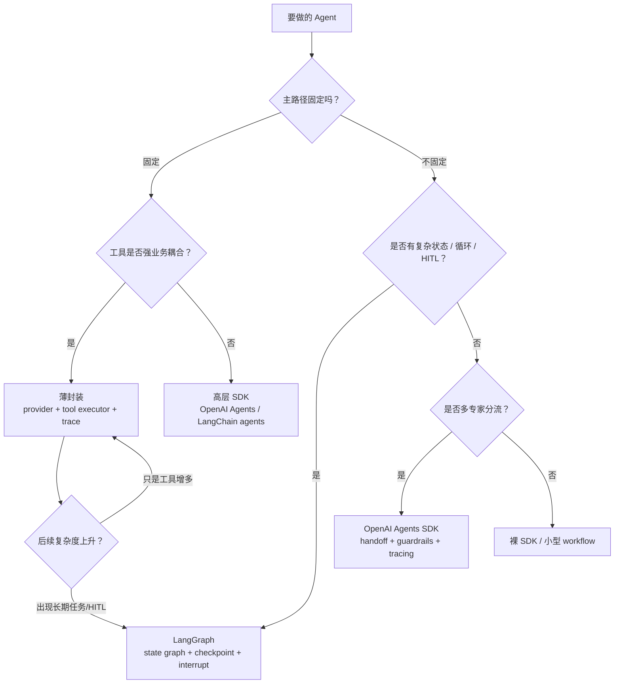

<section class="doc-hero">
  <p class="doc-hero__kicker">匿名真实面经</p>
  <h1>Agent 框架选型面试深挖：自研薄封装不是重新造 LangChain</h1>
  <p class="doc-hero__lead">面试官问“为什么不用框架”，不是在考你会不会报框架名，而是在考你的工程边界感。</p>
  <div class="doc-hero__meta" aria-label="本文信息">
    <span>适合阶段：Agent 工程师 / 架构面</span>
    <span>核心能力：边界成本 · 控制权 · 迁移路径 · 框架锁定</span>
    <span>脱敏原则：只保留选型方法，不保留真实业务细节</span>
  </div>
</section>

> 框架选型的核心不是“谁功能更多”，而是“这个框架的默认抽象和你的业务控制边界是不是同向”。

> **本文边界**：主流框架横向功能对比见 [框架选型决策树](./comparison)，LangChain / LangGraph 的架构细节见 [LangChain / LangGraph 深度剖析](./langchain)，OpenAI Agents SDK 见 [OpenAI Agents SDK / Swarm](./openai-agents-sdk)，运行时控制见 [Agent Harness](../engineering/harness) 和 [Agent Runtime](../engineering/agent-runtime)。本文专讲真实面试里“为什么自研 / 为什么不用某框架 / 以后怎么迁移”的追问链。

> **脱敏说明**：本文来自多场 Agent 工程岗位里反复出现的框架选型追问。例子统一改写成通用业务 Agent，不包含可识别组织、真实系统、私有数据或业务规模。

## 面试官想考什么

这组题最容易把“会用框架”和“能做架构取舍”区分开。

<div class="interview-grid">
  <div>
    <strong>你为什么没有直接用 LangChain / LangGraph？</strong>
    <span>考你是否能说明框架的边界成本，而不是只说“功能简单”。</span>
  </div>
  <div>
    <strong>自研是不是重新造轮子？你到底造了哪些层？</strong>
    <span>考你能不能把“薄封装”和“造平台”分清。</span>
  </div>
  <div>
    <strong>什么场景下你会从自研切到 LangGraph？</strong>
    <span>考复杂状态机、checkpoint、human-in-the-loop 和长期任务判断。</span>
  </div>
  <div>
    <strong>OpenAI Agents SDK 和 LangGraph 怎么选？</strong>
    <span>考 handoff 线性分流和 graph 状态编排的边界。</span>
  </div>
  <div>
    <strong>框架帮你省了哪些代码，又强加了哪些约束？</strong>
    <span>考 framework fit，不是功能清单。</span>
  </div>
  <div>
    <strong>如果后面需求复杂了，自研封装迁移成本怎么控制？</strong>
    <span>考抽象隔离、接口稳定和渐进迁移。</span>
  </div>
  <div>
    <strong>怎么证明你的自研封装质量不比框架差？</strong>
    <span>考测试边界、trace、eval、故障回放和团队可维护性。</span>
  </div>
  <div>
    <strong>低代码 Agent 平台、SDK 框架、裸 SDK 三者怎么选？</strong>
    <span>考团队协作、上线速度、可控性和供应商锁定。</span>
  </div>
</div>

## 为什么“我们功能简单，所以自研”不够

面试里一个危险回答是：

```text
我们业务没有那么复杂，所以没有用 LangChain，自己写了一套。
```

这句话会让面试官警觉。因为“自己写一套”可能意味着三种完全不同的事：

- 只是封装了 LLM provider 和 tool executor，两三百行，边界清楚。
- 写了半个框架，但没有 checkpoint、trace、测试和迁移路径。
- 团队凭个人经验堆代码，后面没人敢改。

更稳的说法要把取舍讲成工程判断：

```text
我当时做的是薄封装，不是重写框架。核心只封两层：provider adapter 和 tool execution layer。
原因是这类业务 Agent 的主路径很固定，工具执行高度依赖业务权限、参数准备、幂等和错误语义；框架能省的 loop 代码很少，但会引入它自己的抽象、依赖和默认 agent 行为。对这个阶段来说，薄封装的可控性更高。
```

这里的关键词是 **薄封装**。你不是“讨厌框架”，也不是“没学过框架”，而是知道自己没有必要把一个严格受控的 workflow 装进一个更自由的 agent 框架里。

## 选型轴：框架收益 vs 边界成本

框架选型可以用一条公式表达：

```text
Use Framework if:
  saved_plumbing + ecosystem + lifecycle_features
  >
  abstraction_cost + control_friction + dependency_risk + migration_cost
```

拆开看：

| 维度 | 框架带来的收益 | 框架带来的成本 |
|---|---|---|
| 编排 | 节点、边、handoff、状态流转少写很多 | 默认 loop 可能和业务主路径冲突 |
| 工具 | tool schema、tool call、tool result 有约定 | 工具执行层仍要自己写权限、幂等、补偿 |
| 状态 | checkpoint、memory、resume 可复用 | 状态模型可能不贴合原有业务状态 |
| 观测 | tracing、eval、dashboard 省集成 | trace schema 可能和内部链路割裂 |
| 生态 | RAG、vector store、provider adapter 丰富 | 依赖重、升级频繁、抽象泄漏 |
| 团队 | 新人容易按文档上手 | 框架知识变成额外认知负担 |

这张表比“LangChain 抽象太厚”更有说服力。你不是泛泛吐槽，而是在说明：**框架省掉的是通用胶水，业务里最危险的部分仍然要自己控制**。

## 一张决策图



面试里可以直接按这条线讲：

```text
主路径固定、工具强耦合、控制要求高，我会薄封装；
复杂状态机、长任务、暂停恢复、人审，我会上 LangGraph；
多专家线性分流、产品内快速落地，我会考虑 OpenAI Agents SDK；
只有一次 LLM 调用或简单 RAG，我不会上 Agent 框架。
```

## 薄封装到底应该封什么

薄封装不是把所有框架能力自己写一遍。它只封业务 Agent 最稳定的边界。

| 层 | 该不该封 | 原因 |
|---|---|---|
| Provider adapter | 该封 | 模型供应商会换，业务代码不该绑 API 细节 |
| Tool registry | 该封 | 工具名、schema、权限、执行器需要统一 |
| Tool executor | 该封 | 参数准备、幂等、重试、审计是业务核心 |
| Trace emitter | 该封 | 没有 trace，后面质量治理做不起来 |
| Prompt renderer | 轻量封 | 版本、变量、灰度要可控 |
| Graph runtime | 先别封 | 复杂状态没出现前不要提前造 |
| Memory system | 慎重封 | 记忆治理复杂，先用业务库或现成组件 |
| Multi-agent protocol | 慎重封 | 没有明确协作模式前，容易过度设计 |

一个合理的薄封装长这样：

```text
业务服务
  -> AgentWorkflow        # 固定主路径
  -> LLMProvider          # 模型适配
  -> ToolRegistry         # 工具 schema + 权限元数据
  -> ToolExecutor         # prepare / verify / execute / handle_error
  -> TraceEmitter         # 每步可观测
```

它不应该长这样：

```text
自研 AgentPlatform
  -> 自研 Graph
  -> 自研 Memory
  -> 自研 MultiAgent
  -> 自研 Eval
  -> 自研 UI Builder
```

后者才是面试官担心的“重新造轮子”。

## 可运行代码：一个“刚好够用”的薄封装

下面代码演示一个业务 Agent 的最小薄封装。它没有 graph、没有 memory、没有多 agent，只保留四个关键点：

- provider 可替换；
- tool schema 和 executor 分离；
- 工具执行前做参数和权限校验；
- 每一步输出 trace 事件。

```python
from __future__ import annotations

from dataclasses import dataclass
from typing import Any, Protocol


class LLMProvider(Protocol):
    def choose_tool(self, prompt: str, tools: list[dict[str, Any]]) -> dict[str, Any]:
        ...


class FakeProvider:
    def choose_tool(self, prompt: str, tools: list[dict[str, Any]]) -> dict[str, Any]:
        # 实际生产里这里调用 OpenAI / Anthropic / Qwen 等 provider。
        return {"tool": "lookup_profile", "args": {"user_id": "u_123"}}


@dataclass(frozen=True)
class ToolContext:
    current_user_id: str
    allowed_user_ids: set[str]
    trace_id: str


@dataclass(frozen=True)
class ToolSpec:
    name: str
    description: str
    schema: dict[str, Any]
    executor: "ToolExecutor"


class ToolExecutor(Protocol):
    def prepare(self, args: dict[str, Any], ctx: ToolContext) -> dict[str, Any]:
        ...

    def verify(self, args: dict[str, Any], ctx: ToolContext) -> None:
        ...

    def execute(self, args: dict[str, Any], ctx: ToolContext) -> dict[str, Any]:
        ...


class LookupProfileTool:
    def prepare(self, args: dict[str, Any], ctx: ToolContext) -> dict[str, Any]:
        return {"user_id": args.get("user_id") or ctx.current_user_id}

    def verify(self, args: dict[str, Any], ctx: ToolContext) -> None:
        if args["user_id"] not in ctx.allowed_user_ids:
            raise PermissionError("user_id is outside current permission scope")

    def execute(self, args: dict[str, Any], ctx: ToolContext) -> dict[str, Any]:
        return {"user_id": args["user_id"], "tier": "standard", "status": "active"}


class TraceEmitter:
    def emit(self, trace_id: str, event: str, payload: dict[str, Any]) -> None:
        print({"trace_id": trace_id, "event": event, **payload})


class ThinAgentRuntime:
    def __init__(self, provider: LLMProvider, tools: list[ToolSpec], tracer: TraceEmitter):
        self.provider = provider
        self.tools = {tool.name: tool for tool in tools}
        self.tracer = tracer

    def run(self, user_input: str, ctx: ToolContext) -> dict[str, Any]:
        tool_schemas = [
            {"name": tool.name, "description": tool.description, "schema": tool.schema}
            for tool in self.tools.values()
        ]
        decision = self.provider.choose_tool(user_input, tool_schemas)
        self.tracer.emit(ctx.trace_id, "tool_selected", decision)

        tool = self.tools[decision["tool"]]
        args = tool.executor.prepare(decision["args"], ctx)
        tool.executor.verify(args, ctx)
        result = tool.executor.execute(args, ctx)
        self.tracer.emit(ctx.trace_id, "tool_executed", {"tool": tool.name, "result": result})
        return result


if __name__ == "__main__":
    runtime = ThinAgentRuntime(
        provider=FakeProvider(),
        tools=[
            ToolSpec(
                name="lookup_profile",
                description="Look up a profile only when the user is inside the caller's permission scope.",
                schema={"type": "object", "required": ["user_id"]},
                executor=LookupProfileTool(),
            )
        ],
        tracer=TraceEmitter(),
    )
    output = runtime.run(
        "帮我查一下当前用户状态",
        ToolContext(current_user_id="u_123", allowed_user_ids={"u_123"}, trace_id="t_001"),
    )
    print(output)
```

这段代码的面试价值在于它很克制：它只封装业务必须控制的东西。后续如果要迁移到 LangGraph，可以把 `ThinAgentRuntime.run()` 变成一个 graph node，把 `ToolSpec` 继续复用；如果要迁移 OpenAI Agents SDK，可以把 tool schema 和 executor 转成 function tool。**迁移成本低，是因为边界一开始就没有绑死**。

## 什么时候该上 LangGraph

LangGraph 官方文档把它定位成 orchestration runtime，重点是 durable execution、streaming、human-in-the-loop 和 persistence。它的 persistence 文档明确区分 checkpointer 和 store：checkpointer 保存单个 thread 的 graph state，适合对话连续性、human-in-the-loop、time travel 和 fault tolerance；store 保存跨 thread 的长期数据。

这说明 LangGraph 真正适合的是下面这类场景：

| 信号 | 为什么 LangGraph 合适 |
|---|---|
| 任务跨多轮、多天、多步骤 | checkpointer 能恢复 thread state |
| 中途要人审或审批 | interrupt 可以暂停并持久化状态 |
| 既有 deterministic workflow 又有 agentic step | graph 可以混合节点和条件边 |
| 失败后要从中间恢复 | checkpoint 比内存 while loop 稳 |
| 多个节点并发更新状态 | reducer / state 模型更清晰 |

面试里可以说：

```text
如果只是固定三段 workflow，我不会为了看起来先进去上 LangGraph。
但一旦出现长流程、暂停恢复、人审、复杂条件边、失败重放，我会切到 LangGraph，因为这些能力自己造很贵，而且很容易造错。
```

这比“LangGraph 更强”具体得多。

## 什么时候 OpenAI Agents SDK 更合适

OpenAI 的 Agents SDK 文档把 handoffs、guardrails、human review、results/state、observability 放在同一条路径里。Handoff 文档里也说得很直白：handoffs 适合不同 agent 各自负责特定任务，例如订单状态、退款、FAQ 这类客服分流。

所以它适合：

| 场景 | 为什么 |
|---|---|
| 多专家线性分流 | handoff 抽象轻，代码少 |
| 产品内快速试点 | SDK 上手快，tracing/guardrails 有现成能力 |
| 团队主要用 OpenAI | 模型、工具、追踪在一个生态 |
| 每个专家 Agent 边界清楚 | handoff 描述就是路由依据 |

但它不是万能的。OpenAI Agents SDK 的 guardrails 文档也提醒：tool guardrails 只应用于 function tools，handoff 走自己的 pipeline。这个细节很适合面试里讲边界：

```text
如果我只是做多专家分流，OpenAI Agents SDK 很轻；
如果我要复杂状态、长任务恢复、跨天审批和精细状态合并，LangGraph 更合适。
```

## 为什么“低代码平台”不是默认答案

低代码 Agent 平台适合原型、运营可配置流程、内部知识助手，但不一定适合深度嵌入业务系统。

| 选择 | 适合 | 风险 |
|---|---|---|
| 裸 SDK | 单模型调用、极简 workflow、研究验证 | 胶水代码多，生命周期能力要自己补 |
| 自研薄封装 | 主路径固定、强业务权限、工具耦合深 | 需要团队有工程纪律 |
| OpenAI Agents SDK | 多专家分流、OpenAI 生态、快速上线 | 复杂 graph 和跨 provider 控制较弱 |
| LangGraph | 长任务、状态机、HITL、可恢复流程 | 学习成本和代码结构更重 |
| 低代码平台 | 运营配置、流程试点、非工程团队维护 | 深度定制、测试、版本治理可能受限 |

面试官如果问“为什么不用某某平台”，不要回答“我们不喜欢低代码”。更稳的说法是：

```text
如果需求是运营可配置问答或简单流程，我会考虑低代码平台。但如果工具执行要深度进入业务权限、状态写入、幂等、审计和灰度，平台的黑盒会变成风险。这个阶段我更愿意用代码控制关键路径。
```

## 迁移路径：自研不是死路

薄封装最大的价值，是以后能换。

| 今天 | 未来迁移到 LangGraph | 未来迁移到 OpenAI Agents SDK |
|---|---|---|
| `ProviderAdapter` | graph node 内调用模型 | Agents model/provider 配置 |
| `ToolSpec` | LangGraph tool node / custom node | function tool |
| `ToolExecutor` | node 中继续复用 | function tool handler |
| `TraceEmitter` | 接 LangSmith / OpenTelemetry | 接 SDK tracing |
| `Workflow` | 变成 StateGraph | 变成 handoff tree |

面试里可以主动讲这个：

```text
我不会把业务代码直接写死在某个 provider 或某个框架 callback 里。provider、tool spec、executor、trace 都是稳定接口。以后要上 LangGraph，是把 workflow 编排层替换掉，不是把所有工具和业务逻辑重写。
```

这句话能化解“自研会不会锁死”的担心。

## 怎么证明自研封装质量足够

不能只说“我们代码少，所以可控”。要给证据：

| 证明点 | 怎么做 |
|---|---|
| 单元测试 | tool prepare / verify / execute 分别测 |
| 集成测试 | 固定 eval case 跑完整 agent workflow |
| Trace | 每次 tool selection、args、result、error 可回放 |
| 错误处理 | 统一 tool_result，不让模型猜异常 |
| 权限边界 | 权限校验在 executor 前，不能靠 prompt |
| 版本管理 | prompt、tool schema、provider config 有版本 |
| 回归集 | badcase 修完进入 case-level regression |

一个很稳的回答：

```text
我不和 LangGraph 比全功能。我只保证我的子集更稳：固定 workflow、有限工具、明确权限、全链路 trace、eval 回归。场景不需要的能力，我不提前造；场景需要后，再把编排层迁到成熟框架。
```

这就是工程克制。

## 常见陷阱

### 陷阱 1：把“没用框架”说成“框架不好”

**现象**：回答变成吐槽 LangChain 抽象厚、依赖重。

**根因**：没有把场景约束讲出来，容易显得主观。

**修法**：先承认框架价值，再讲自己的场景里框架收益小于边界成本。

### 陷阱 2：自研范围不断膨胀

**现象**：一开始只封 tool，后来自己写 graph、memory、eval、UI。

**根因**：没有提前定义“哪些不造”。

**修法**：把自研限制在 provider、tool executor、trace、prompt renderer。复杂编排和长期状态优先接成熟框架。

### 陷阱 3：工具逻辑绑死在框架 callback 里

**现象**：迁移框架时所有工具都要重写。

**根因**：业务逻辑没有和框架适配层隔离。

**修法**：工具执行器保持框架无关。框架只是调用 adapter。

### 陷阱 4：只看开发速度，不看运行期治理

**现象**：demo 很快，线上缺 trace、版本、回归、权限。

**根因**：选型只看 “how fast to build”，没看 “how safe to operate”。

**修法**：选型表必须加入 observability、eval、permission、rollback、schema version。

### 陷阱 5：框架版本升级没有隔离

**现象**：框架 minor upgrade 后 agent 行为变了，线上无法快速回滚。

**根因**：业务代码直接依赖框架内部对象，没有 adapter 层。

**修法**：框架放在 infrastructure adapter 里，业务层只依赖稳定接口；升级先跑 eval 和小流量灰度。

### 陷阱 6：为了“未来复杂”提前上重框架

**现象**：简单 workflow 被拆成一堆 graph node，调试成本变高。

**根因**：把未来可能性当成当前需求。

**修法**：保留迁移接口，不提前引入复杂运行时。简单阶段把关键路径写清楚，比摆出复杂架构更重要。

## 与相邻文章的区别

| 文章 | 重点 | 本文不重复什么 |
|---|---|---|
| [框架选型决策树](./comparison) | 多框架横向对比 | 不逐个介绍框架功能 |
| [LangChain / LangGraph](./langchain) | LCEL、StateGraph、checkpoint 原理 | 不展开框架内部机制 |
| [OpenAI Agents SDK](./openai-agents-sdk) | Agent、handoff、guardrails | 不写 SDK 教程 |
| [Agent Harness](../engineering/harness) | 长任务运行环境 | 不讲完整 harness 架构 |
| [Agent Runtime](../engineering/agent-runtime) | 生产级运行时平面 | 不讲平台化拆分 |

本文只解决一个面试问题：**为什么你的框架选型是工程判断，而不是没调研、不会用或盲目自研**。

## 面试题深度解析

### Q1：你为什么没有直接用 LangChain / LangGraph？

**30 秒版本**：因为当时核心不是复杂编排，而是固定主路径下的工具权限、参数准备、幂等、错误语义和 trace。框架能省的 loop 代码很少，但会引入默认抽象和依赖。我们做的是 provider + tool executor 的薄封装，不是重写框架。

**追问 1：那是不是 LangChain 不好？**

不是。LangChain / LangGraph 在复杂 agent loop、状态持久化、HITL、生态集成上很有价值。只是这个阶段的收益小于边界成本。选型要看场景，不是站队。

**追问 2：以后复杂了怎么办？**

保留 provider、tool spec、executor、trace 这些稳定接口。未来如果要长任务、人审、checkpoint，可以把 workflow 层迁到 LangGraph，工具执行层继续复用。

### Q2：自研是不是重新造轮子？

**30 秒版本**：看造的范围。封 provider adapter、tool executor、trace emitter 是业务适配；自己造 graph runtime、memory、eval platform 才可能是重复造轮子。我的原则是只造业务强相关且框架帮不上忙的薄层。

**追问 1：怎么控制自研边界？**

写清楚 “not building list”：不自研通用 graph、不自研向量库、不自研 observability platform、不自研多 agent protocol。需要时接成熟组件。

**追问 2：怎么保证可维护？**

接口少、测试全、trace 全、badcase 有回归。薄封装的质量不是靠功能多，而是靠子集稳定。

### Q3：什么场景会直接上 LangGraph？

**30 秒版本**：出现复杂状态、长流程、暂停恢复、人审、失败后从中间恢复、跨多轮 checkpoint，我会直接上 LangGraph。因为这些是运行时能力，自己造成本高，而且错了会变线上事故。

**追问 1：固定 workflow 能不能用 LangGraph？**

能，但不一定值得。固定两三步流程直接代码更清晰。LangGraph 的价值在状态复杂度上，不在“看起来更 agentic”。

**追问 2：LangGraph 和普通状态机有什么差别？**

LangGraph 把 LLM/tool 节点、state、checkpoint、interrupt 和 streaming 结合起来。普通状态机也能写，但你要自己补持久化、恢复、人审和 trace。

### Q4：OpenAI Agents SDK 和 LangGraph 怎么选？

**30 秒版本**：多专家线性分流、OpenAI 生态内快速落地，用 OpenAI Agents SDK 很轻；复杂状态机、长期任务、跨天审批、精细恢复，用 LangGraph 更稳。

**追问 1：Handoff 的限制是什么？**

handoff 很适合“把问题交给另一个专家”。但如果流程需要反复回环、全局状态合并、暂停恢复，它不是 graph runtime。

**追问 2：Guardrails 够不够？**

guardrails 是重要能力，但要看它覆盖哪类调用。比如 handoff pipeline 和 function tool guardrail 的边界不同，不能默认所有风险都被同一层拦住。

### Q5：怎么向面试官证明你做过调研？

**30 秒版本**：不要说“没对比”。要说你按约束做过判断：任务形态、工具耦合、控制要求、团队维护、运行期治理、迁移路径。即使没有正式 POC，也要讲清为什么当前方案满足约束，以及什么时候会换。

**追问 1：没有 POC 是不是硬伤？**

看风险。如果框架会深度影响架构，应该 POC；如果只是简单 provider/tool 薄封装，读文档、做小样例和保留迁移接口可能足够。关键是说明判断依据。

**追问 2：怎么补一句更成熟？**

可以说：当时没有做完整横评，这是可以改进的；如果重新做，我会拿同一批真实 case 对比裸 SDK、薄封装、LangGraph，指标看开发复杂度、工具成功率、trace 完整度、故障恢复和迁移成本。

## 延伸阅读

- [LangGraph Overview](https://docs.langchain.com/oss/python/langgraph/overview)  
  为什么读：官方把 LangChain、LangGraph、LangSmith 的边界讲清楚，适合回答“什么时候用哪个”。

- [LangGraph Persistence](https://docs.langchain.com/oss/python/langgraph/persistence)  
  为什么读：checkpointer 和 store 的区别，是判断是否需要 LangGraph 的核心依据。

- [LangGraph Interrupts](https://docs.langchain.com/oss/python/langgraph/interrupts)  
  为什么读：human-in-the-loop 不是循环里 `input()`，而是持久化后可恢复的动态中断。

- [LangChain / LangGraph 1.0 发布说明](https://www.langchain.com/blog/langchain-langgraph-1dot0)  
  为什么读：官方承认早期抽象过重，并说明 1.0 后 LangChain 与 LangGraph 的职责分工。

- [OpenAI Agents SDK: Handoffs](https://openai.github.io/openai-agents-python/handoffs/)  
  为什么读：handoff 是多专家分流的轻量抽象，适合和 LangGraph 的 graph runtime 做对比。

- [OpenAI Agents SDK: Guardrails](https://openai.github.io/openai-agents-python/guardrails/)  
  为什么读：理解 guardrail 的覆盖边界，避免以为 SDK 自动解决所有风险。

- [OpenAI Agents Guide](https://developers.openai.com/api/docs/guides/agents)  
  为什么读：官方说明 SDK 适合 server 自己掌控 orchestration、tool execution、state 和 approvals 的场景。

- 配套阅读：[框架选型决策树](./comparison)、[Agent Harness](../engineering/harness)、[Agent Runtime](../engineering/agent-runtime)、[Agent 确定性控制](../engineering/deterministic-control-interview)。  
  为什么读：这篇讲面试选型，配套文章讲框架能力和运行时控制。
