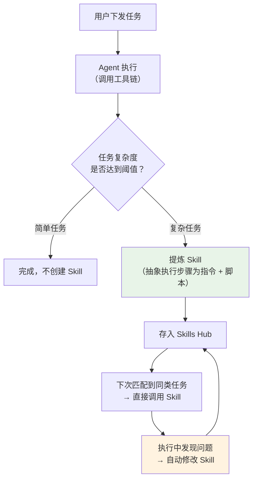

<section class="doc-hero">
  <p class="doc-hero__kicker">主流 Agent 框架</p>
  <h1>Hermes Agent 深度剖析</h1>
  <p class="doc-hero__lead">大多数 Agent 框架的定位是"帮你调 LLM API"——Hermes Agent 的定位是"一个会自己变强的自主 Agent"。它由开源模型公司 Nous Research 开发，核心卖点不是工具多、渠道广，而是闭环学习：Agent 从经验中提炼 Skill，Skill 在使用中自我改进，记忆系统跨 Session 积累。GitHub 17.6 万 star。</p>
  <div class="doc-hero__meta" aria-label="本文信息">
    <span>适合阶段：进阶 / 生产</span>
    <span>核心链路：Task → Learn → Skill → Improve → Memory</span>
    <span>面试重点：闭环学习 + 三层记忆 + 部署弹性</span>
  </div>
</section>

> **本文边界**：聚焦 Hermes Agent 的学习机制、记忆架构和部署弹性。通用的 Agent 记忆设计见 [Agent 记忆](../context/memory)；Skill 和 MCP 的关系见 [MCP 详解](../tools/mcp)；同为本地 Agent 的 OpenClaw 见 [OpenClaw](./openclaw)。

## 面试官想考什么

读完这篇你要能正面回答下面这些题。每题后面括号里是面试官真正想看你答出什么。

<div class="interview-grid">
  <div>
    <strong>Hermes 说自己会"自我进化"，这和 Reflexion 论文里的 self-reflection 是一回事吗？</strong>
    <span>考对学习机制的精确理解——Reflexion 是单任务内的反思循环，Hermes 是跨任务的 Skill 固化 + 改进，维度不同。</span>
  </div>
  <div>
    <strong>Hermes 的三层记忆（persistent memory / user profile / session search）各自解决什么问题？</strong>
    <span>考记忆系统的分层设计——不是"都叫记忆就一样"，而是长期知识 vs 用户画像 vs 检索回忆，三种不同的读写模式。</span>
  </div>
  <div>
    <strong>Hermes 支持 200+ 模型"零代码切换"，背后怎么做到的？换模型后 Skill 和记忆还能用吗？</strong>
    <span>考模型抽象层的设计——统一接口封装 + Skill/记忆存的是自然语言而非模型特有格式。</span>
  </div>
  <div>
    <strong>六种终端后端（local/Docker/SSH/Singularity/Modal/Daytona）怎么选？什么场景用哪个？</strong>
    <span>考部署架构的工程判断——个人笔记本 vs 团队共享 vs 成本优化 vs GPU 集群，不同场景不同答案。</span>
  </div>
  <div>
    <strong>Hermes 的 Skill 用 agentskills.io 开放标准，这和 MCP 是什么关系？</strong>
    <span>考工具生态的分层认知——agentskills.io 是 Skill 级（含指令 + 工具 + 状态），MCP 是工具协议级。</span>
  </div>
  <div>
    <strong>Hermes 和 OpenClaw 都是"本地 AI 助手"，核心差异在哪？</strong>
    <span>考产品定位的辨析——OpenClaw 偏网关/渠道整合（TypeScript），Hermes 偏自主学习/研究平台（Python）。</span>
  </div>
  <div>
    <strong>"Serverless persistence"是什么意思？Daytona/Modal 后端的 Agent 不跑的时候真的不花钱吗？</strong>
    <span>考云架构直觉——环境休眠 vs 冷启动延迟的 trade-off，以及"不花钱"的前提条件。</span>
  </div>
</div>

---

## 为什么需要 Hermes Agent

先看一个你用任何 AI 助手都会遇到的场景：

```
第 1 天：你让 Agent 把项目的测试覆盖率报告生成 PDF，发到 Slack。
         Agent 花了 15 分钟：装 pytest-cov、跑测试、用 weasyprint 转 PDF、调 Slack API。

第 7 天：你说"再跑一次上周的覆盖率报告"。
         Agent：什么覆盖率报告？（新 Session，上下文已清空）
         你：就是 pytest-cov 那个……算了我把步骤再说一遍。

第 30 天：你说"这个月的覆盖率报告"。
         Agent 又从头推理一遍——尽管它已经成功做过 4 次了。
```

问题出在哪？**传统 Agent 没有跨 Session 的学习能力**。每次对话结束，经验就消失了。它不会把"我成功完成过这个任务"转化成"下次直接这样做"。

Hermes Agent 的闭环学习正是解决这个问题：

```
第 1 天：Agent 完成覆盖率报告任务
         → 自动创建 Skill「coverage-report」
         → 包含：安装依赖、跑测试、转 PDF、发 Slack 的完整流程

第 7 天：你说"跑覆盖率报告"
         → Agent 匹配到 Skill「coverage-report」
         → 直接执行，不再从头推理
         → 发现 weasyprint 版本升级导致排版变了
         → 自动修复 Skill 里的参数

第 30 天：Skill 已经被用了 4 次，每次都微调过
         → 执行时间从 15 分钟降到 2 分钟
         → 边界情况（空测试、网络超时）都已处理
```

这就是 Hermes 说的"self-improving"——不是单次任务内的反思（那是 Reflexion），而是 **跨任务、跨 Session 的能力积累**。

---

## 闭环学习架构：从经验到能力

Hermes 的学习循环可以拆成四步：



**Step 1: 执行任务**——和普通 Agent 一样，调用工具链完成用户请求。

**Step 2: 判断是否需要创建 Skill**——不是所有任务都值得固化。"今天天气怎么样"不需要 Skill，"把三个数据源的数据合并清洗后入库"需要。判断标准主要是：工具调用次数超过阈值、执行步骤包含条件分支、涉及多个外部系统。

**Step 3: 提炼 Skill**——Agent 把刚才的执行轨迹（trajectory）抽象成一个 Skill 文件。关键是"抽象"而非"录制"——它不是把每一步的具体参数硬编码，而是提取出模式：

```python
# Agent 自动生成的 Skill 示例（简化）
# skills/coverage-report/skill.py

"""
Trigger: 用户提到"覆盖率报告"或"test coverage"
"""

async def run(agent, params):
    project_dir = params.get("project_dir", ".")
    
    # 1. 确保依赖存在
    await agent.bash(f"cd {project_dir} && pip install pytest-cov weasyprint")
    
    # 2. 跑测试 + 生成覆盖率
    result = await agent.bash(
        f"cd {project_dir} && pytest --cov=src --cov-report=html"
    )
    
    # 3. 转 PDF
    pdf_path = await agent.bash(
        "weasyprint htmlcov/index.html coverage.pdf"
    )
    
    # 4. 发到 Slack（渠道从用户配置读取）
    await agent.send_file("coverage.pdf", channel="slack")
```

**Step 4: 使用中改进**——下次执行这个 Skill 时，如果某步失败了，Agent 不会直接报错，而是：
1. 尝试用通用工具修复（比如升级依赖版本）
2. 修复成功后，把修复方案写回 Skill 文件
3. 如果修复失败，降级为手动模式（从头推理），并在事后更新 Skill

这种"使用中改进"机制让 Skill 不是一次性快照，而是持续演化的活文档。

---

## 三层记忆系统

Hermes 的记忆不是一个笼统的"memory"，而是三个不同用途的子系统：

### 第一层：Persistent Memory（长期知识）

存储 Agent 在长期运行中积累的事实性知识——用户的偏好、项目的配置、反复出现的 pattern。

```
记忆条目示例：
- "用户的 Python 项目都用 uv 而不是 pip"
- "Slack workspace 的 #dev 频道禁止发大文件"
- "用户偏好用 Notion 而非 Google Docs"
```

写入时机：Agent 完成任务后主动"反思"，提取值得长期记住的事实。这不是每条消息都存——而是定期触发的"记忆整理"（periodic nudge），类似人类睡前回忆今天学到了什么。

### 第二层：User Profile（用户画像）

基于 [Honcho](https://github.com/plastic-labs/honcho) 的辩证用户建模——不是简单的 key-value 标签，而是通过多轮对话逐步构建的深层画像：

```
传统方式：
  user_profile = {"language": "zh", "role": "developer", "experience": "senior"}

Honcho 辩证建模：
  - 这个用户倾向于先看代码再读解释（观察自多次交互）
  - 给建议时他更关心 trade-off 而非最佳实践（推断自他的追问模式）
  - 他对性能的敏感度高于可读性（推断自他的代码审查反馈）
```

"辩证"的含义是：画像不是静态标签，而是通过"假设 → 验证 → 修正"的循环不断加深。Agent 会主动测试自己对用户的理解是否准确。

### 第三层：Session Search（检索回忆）

基于 FTS5（SQLite 全文搜索）的跨 Session 检索，加上 LLM 摘要。当 Agent 需要回忆以前做过什么时：

```
用户："上个月那个部署脚本帮我改一下"

Agent 内部流程：
1. FTS5 搜索所有历史 Session → 匹配到 3 个月前的一段对话
2. LLM 对匹配到的 Session 做摘要："用户要求写了一个 deploy.sh，
   内容是 SSH 到 prod 服务器、pull 最新代码、重启 PM2"
3. 基于摘要 + 当前请求，决定具体改什么
```

三层记忆的读写模式完全不同：

| 记忆层 | 写入频率 | 读取方式 | 存储后端 |
|---|---|---|---|
| Persistent Memory | 低（定期整理） | 每次对话开始注入 system prompt | 文件系统 |
| User Profile | 中（对话中持续更新） | 生成回复时参考 | Honcho 服务 |
| Session Search | 高（每条消息自动索引） | 按需检索（FTS5 query） | SQLite |

---

## 200+ 模型零代码切换

Hermes 的模型层抽象是另一个值得拆解的设计。通过 `hermes model` 命令切换模型，不需要改任何代码或配置：

```bash
hermes model              # 交互式选择
hermes model gpt-4o       # 直接指定
hermes model nous-hermes  # 用 Nous 自己的模型
```

支持的模型来源：Nous Portal、OpenRouter（200+ 模型的聚合器）、NovitaAI、NVIDIA NIM、Hugging Face、OpenAI、以及任何兼容 OpenAI API 格式的本地端点。

这背后的关键设计决策是：**Skill 和记忆存的是自然语言，不是模型特有的格式**。

```
// 反模式：Skill 里硬编码了模型的 tool_call 格式
{
  "type": "function",
  "function": {"name": "bash", "arguments": "{\"cmd\": \"ls\"}"}
}
// → 换模型后 tool_call 格式可能不兼容

// Hermes 的做法：Skill 里存的是自然语言指令
"""
Step 1: 列出当前目录的文件
Step 2: 找到 .py 文件，检查是否有 syntax error
"""
// → 任何模型都能理解这段指令
```

这意味着你可以在开发时用 GPT-4o（快、便宜），切到 Claude Opus（准确、贵）做关键任务，甚至切到本地的 Nous Hermes 3 模型做离线场景——Skill 和记忆全程通用。

但有 trade-off：自然语言指令的精度不如结构化格式。简单的 Skill（跑个脚本、发条消息）没问题，复杂的 Skill（多步条件分支、错误处理）在弱模型上的成功率会明显下降。

---

## 六种终端后端

Hermes 的工具执行不限于本地机器——它支持六种后端，每种适合不同场景：

| 后端 | 启动延迟 | 成本 | 隔离性 | 适用场景 |
|---|---|---|---|---|
| **Local** | 0 | 仅电费 | 无（宿主机直接执行） | 个人开发机 |
| **Docker** | 秒级 | 仅电费 | 容器级 | 多用户共享、安全敏感 |
| **SSH** | 秒级 | 远程机器费用 | 机器级 | 需要 GPU 或特殊环境 |
| **Singularity** | 秒级 | 集群资源 | 容器级（HPC 友好） | 学术/研究集群 |
| **Modal** | 冷启动 ~10s | 按秒计费，空闲 ≈ $0 | 函数级 | Serverless 生产部署 |
| **Daytona** | 冷启动 ~15s | 按使用计费 | 环境级（带持久化） | 需要有状态的 serverless |

"Serverless persistence"是 Daytona 和 Modal 后端的关键特性——Agent 的执行环境在空闲时自动休眠（hibernate），下次需要时唤醒。环境里的文件系统状态被保留，不像传统 serverless（Lambda/Cloud Functions）每次都是全新容器。

```
传统 Serverless：
  请求 → 冷启动新容器 → 执行 → 容器销毁（状态丢失）

Hermes + Daytona：
  请求 → 唤醒休眠环境 → 执行（文件/依赖都在）→ 空闲 → 休眠（状态保留）
```

这对 Agent 特别重要——Agent 经常需要安装依赖、下载数据、构建索引，这些操作的成本在传统 serverless 里每次冷启动都要重复。有状态休眠把"首次设置"的成本摊到一次。

但"不花钱"是有条件的：休眠环境占用存储（Daytona 按 GB 月计费），冷启动有延迟（用户发消息后 10-15 秒才开始响应）。对实时聊天场景这个延迟可能不可接受，但对后台任务（cron job、批量处理）完全没问题。

---

## 容易踩的坑

**坑 1：Skill 自动改进可能引入回归**

- **现象**：一个运行正常的 Skill 在某次"自动改进"后开始出错
- **根因**：Agent 修复了 A 场景的 bug，但改动意外影响了 B 场景。没有测试覆盖，Agent 无法检测回归
- **修法**：对关键 Skill 开启版本控制——Hermes 支持 Skill 的版本历史，出问题时回滚到上一个正常版本。长期方案是给重要 Skill 手写几个测试用例

**坑 2：记忆膨胀导致 context window 溢出**

- **现象**：Agent 运行几个月后，Persistent Memory 条目达到上千条，每次对话的 system prompt 膨胀到几万 token
- **根因**："periodic nudge"的默认策略偏保守，很少删除旧记忆
- **修法**：手动触发记忆清理：`hermes memory prune`，或调整配置让 Agent 更激进地合并/删除过时记忆

**坑 3：OpenRouter 模型切换后 tool calling 格式不兼容**

- **现象**：用 GPT-4o 跑得好好的，切到某个开源模型后工具调用全部失败
- **根因**：部分开源模型的 tool calling 实现不完整或格式和 OpenAI API 有微妙差异（如参数不支持嵌套对象）
- **修法**：用 Nous Portal 而非 OpenRouter 直接对接——Nous Portal 对自家模型的 tool calling 做了专门优化。或者退回到成熟的模型（GPT-4o、Claude Sonnet）做需要复杂工具调用的任务

**坑 4：Daytona/Modal 冷启动导致聊天响应慢**

- **现象**：用户发消息后 10-15 秒才收到第一个字
- **根因**：环境从休眠中唤醒需要时间（加载文件系统快照、恢复进程状态）
- **修法**：对实时聊天渠道（WhatsApp/Telegram）用 Local 或 Docker 后端，Serverless 后端只用于 cron job 和批量任务。或者设置 keep-alive 心跳防止环境休眠（但这会产生费用）

---

## 与 OpenClaw 的核心差异

两者经常被拿来比较，因为都是"本地 AI 助手"。但定位差异很大：

| 维度 | OpenClaw | Hermes Agent |
|---|---|---|
| 开发语言 | TypeScript (Node.js) | Python |
| 核心定位 | 全平台消息网关 | 自我进化的自主 Agent |
| 学习能力 | Skill 自生成（一次性） | Skill 自生成 + 自改进（持续循环） |
| 记忆系统 | 基础（Workspace 文件） | 三层（Persistent + Profile + Search） |
| 模型支持 | Claude / GPT / 本地 | 200+（通过 OpenRouter） |
| 部署弹性 | 主要本地 + Docker | 六种后端含 Serverless |
| 研究属性 | 无 | 强（Nous Research 用它生成训练数据） |
| 渠道整合 | 更成熟（20+ 平台、文档更完善） | 同等量级但文档较弱 |

一句话：**OpenClaw 是更好的"私人助手产品"，Hermes 是更好的"自主 Agent 平台"**。如果你要给自己搭一个 WhatsApp 助手，OpenClaw 的文档和社区更友好；如果你在研究 Agent 的自主学习能力、或者需要 Serverless 部署，Hermes 更合适。

---

## 面试题深度解析

**Q1: Hermes 的"自我进化"和 Reflexion 论文里的 self-reflection 是一回事吗？**

- **30 秒版本**：不是一回事。Reflexion（Shinn et al., 2023）是**单任务内**的反思——Agent 尝试、失败、反思失败原因、再试。循环发生在一次任务执行中，反思结果不跨 Session 保留。Hermes 的自我进化是**跨任务**的——一次成功的执行被提炼成 Skill，Skill 在后续多次使用中持续改进。维度不同。
- **追问：能不能把两者结合？** 可以，也应该。Hermes 在 Skill 执行失败时的"修复 → 更新 Skill"流程，本质就包含了一层 Reflexion——它反思失败原因并修改策略。区别是修改结果被持久化了（写入 Skill 文件），而不是只在当前 context window 里。
- **追问：这种持久化的反思有什么风险？** 最大的风险是"错误修复被固化"。如果 Agent 的反思判断本身是错的（把偶发的网络超时误判为代码 bug，改了不该改的地方），错误会被写入 Skill，后续每次执行都带着这个错误。这就是前面说的"Skill 自动改进可能引入回归"——没有测试覆盖的自我改进是把双刃剑。

**Q2: 三层记忆各自解决什么问题？为什么不用一个统一的 vector store？**

- **30 秒版本**：三层记忆的读写模式完全不同——Persistent Memory 低频写、高频读（注入 prompt）；User Profile 中频写、中频读（生成时参考）；Session Search 高频写、低频读（按需检索）。用统一的 vector store 会导致所有查询都走 embedding 检索，而 Persistent Memory 其实更适合直接注入、User Profile 更适合结构化查询。
- **追问：Session Search 为什么用 FTS5 而不是 vector search？** FTS5 是 SQLite 内置的全文搜索，不需要额外的向量数据库基础设施。对于"上个月那个部署脚本"这类检索，关键词匹配（FTS5）比语义匹配（vector）更精准——用户记得具体的词（"部署"、"deploy.sh"），不需要语义模糊匹配。而且 FTS5 的检索结果再交给 LLM 做摘要，等于是"关键词精确召回 + LLM 语义理解"的两阶段管线，效果不比纯 vector 差。
- **追问：Persistent Memory 条目多了怎么办？不会把 context window 撑爆？** 会。这是已知问题——运行几个月后记忆膨胀是真实存在的坑。Hermes 的缓解方式是定期整理（合并重复条目、删除过时信息），但默认策略偏保守。生产环境需要手动调参或定期 prune。

**Q3: 六种终端后端怎么选？**

- **30 秒版本**：个人用选 Local；团队共享或安全敏感选 Docker；需要 GPU 选 SSH 连 GPU 机器；学术集群选 Singularity（HPC 标准容器格式）；想省钱的后台任务选 Modal（按秒计费）；需要有状态 serverless 选 Daytona。
- **追问：为什么不直接用 Kubernetes？** 因为 Hermes 的目标用户不是 DevOps 团队——一条 `hermes terminal docker` 就能切到 Docker 后端，不需要写 Deployment YAML、配 Service、搞 Ingress。Hermes 把部署复杂度藏在了命令行抽象后面。K8s 适合大规模编排，但对"一个人跑一个 Agent"来说是 overkill。
- **追问：Modal 和 Daytona 的核心区别？** Modal 是函数级 serverless——每个工具调用是一次函数执行，执行完容器销毁。Daytona 是环境级 serverless——整个开发环境休眠/唤醒，文件系统持久化。如果 Agent 需要在多次调用间保留文件（比如构建了一个索引），用 Daytona；如果每次调用都是独立的无状态操作（比如跑个脚本返回结果），用 Modal 更便宜。

---

## 延伸阅读

- **官方文档** [hermes-agent.nousresearch.com/docs](https://hermes-agent.nousresearch.com/docs) — 重点看 Memory 和 Skills 两章。文档更新频率高，版本间变化大，建议对照你实际安装的版本看
- **agentskills.io** [agentskills.io](https://agentskills.io) — Skill 的开放标准和社区市场。理解 Skill 的结构定义比读源码更高效
- **Nous Research** [nousresearch.com](https://nousresearch.com) — Hermes 背后的公司。他们同时在做开源模型（Nous Hermes 系列）和 Agent 框架，理解两者的联动关系（Agent 生成训练数据 → 训练更好的模型 → 更强的 Agent）对面试加分
- **Honcho 用户建模** [github.com/plastic-labs/honcho](https://github.com/plastic-labs/honcho) — Hermes 用户画像的底层引擎。"辩证用户建模"不是 Hermes 发明的，是 Honcho 的核心概念
- **Reflexion 论文** *Reflexion: Language Agents with Verbal Reinforcement Learning*（Shinn et al., 2023）— 理解 Hermes 的"自我进化"和学术界"self-reflection"的区别，面试常考
- **GitHub 仓库** [github.com/NousResearch/hermes-agent](https://github.com/NousResearch/hermes-agent) — Python 源码。入口看 `hermes/core/` 目录下的 skill 和 memory 模块
