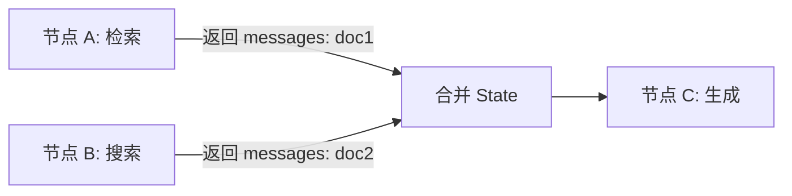

<section class="doc-hero">
  <p class="doc-hero__kicker">主流 Agent 框架</p>
  <h1>LangChain / LangGraph 深度剖析</h1>
  <p class="doc-hero__lead">LangChain 是 LLM 应用框架里最被"恨爱交织"的——抽象层太厚被骂，但生态大到没有替代品。2024 年它把 Agent 能力单独拆成 LangGraph，从"链式编排"转向"状态机编排"，这是 Agent 工程化的重要转折。本文讲清两者的边界，以及什么场景该选哪个。</p>
  <div class="doc-hero__meta" aria-label="本文信息">
    <span>适合阶段：入门 / 进阶 / 生产</span>
    <span>核心链路：Runnable → Chain → Agent / Graph</span>
    <span>面试重点：LCEL + Graph 状态机 + checkpointer</span>
  </div>
</section>

> **本文边界**：聚焦 LangChain 和 LangGraph 的架构演进与核心抽象。RAG 实战见 [RAG 章节](../rag/)；工具调用规范见 [Function Calling](../tools/function-calling)；多 Agent 编排见 [LangGraph 多 Agent](../multi-agent/patterns)。

## 面试官想考什么

读完这篇你要能正面回答下面这些题。每题后面括号里是面试官真正想看你答出什么。

<div class="interview-grid">
  <div>
    <strong>LangChain 和 LangGraph 是什么关系？什么时候用哪个？</strong>
    <span>考对生态演进的理解——LangChain 做基础抽象（LLM/Prompt/Tool），LangGraph 做 Agent 编排，两者互补不替代。</span>
  </div>
  <div>
    <strong>LCEL 解决了什么问题？它和普通 Python 函数调用比有什么优势？</strong>
    <span>考对声明式编程的认知——pipe 操作符、自动并行、流式、batch、async 全免费拿到。</span>
  </div>
  <div>
    <strong>LangChain 的 AgentExecutor 为什么被 LangGraph 取代？</strong>
    <span>考架构理解——AgentExecutor 是黑盒 while 循环，状态不可见、不可回放、不可干预；Graph 把每步拆成节点，全程可控。</span>
  </div>
  <div>
    <strong>LangGraph 的 State 和 Reducer 是什么概念？为什么这样设计？</strong>
    <span>考状态管理的核心——多节点并发更新同一份 State 时如何合并，Reducer 决定合并策略。</span>
  </div>
  <div>
    <strong>Checkpointer 是怎么实现 Agent 的"暂停 / 恢复 / 时间旅行"的？</strong>
    <span>考持久化机制——每个超级步骤后保存 State 快照到数据库，重启时从最近 checkpoint 恢复。</span>
  </div>
  <div>
    <strong>Human-in-the-loop 在 LangGraph 里怎么做？和直接在循环里加 input() 有什么不同？</strong>
    <span>考异步中断模型——interrupt() 把节点执行挂起、持久化状态，可以隔天回来继续。</span>
  </div>
  <div>
    <strong>LangChain 经常被骂"抽象太厚"，你怎么看？什么场景下应该弃用？</strong>
    <span>考工程取舍判断——简单 RAG/Chat 直接用 SDK 更轻；复杂多 Agent 场景 LangGraph 仍然是最稳的选择。</span>
  </div>
</div>

---

## 为什么需要 LangChain

2022 年底 ChatGPT 火了之后，每个想接 LLM 的开发者都遇到同样的事：

```python
# 原始的 LLM 调用：每个 provider 一套 API
import openai
response = openai.chat.completions.create(model="gpt-4o", messages=[...])

import anthropic
response = anthropic.messages.create(model="claude-3-5-sonnet", messages=[...])

# 想做个 RAG？要自己实现：
# - 文档切分（怎么切？按段落？按 token？滑动窗口？）
# - embedding（哪家？OpenAI/Cohere/BGE？维度多少？）
# - 向量库（Pinecone/Chroma/Weaviate/FAISS？）
# - 检索（top-k？相似度阈值？混合检索？）
# - prompt 拼接（怎么塞 context？格式？）
# - 输出解析（JSON?Markdown?要不要 retry？）
```

每个步骤都有十几种选择，每种选择又有几个 provider。一个 RAG 应用要写 500 行胶水代码。**LangChain 的价值是把这些步骤抽象成标准化的组件**——你换 vector store 不用改业务逻辑，换 LLM provider 不用重写 prompt 管线。

但 LangChain 早期（2023 上半年）的抽象方向有问题——它发明了太多自己的概念（Chain、Tool、AgentExecutor、CallbackHandler），开发者要学一套全新的"LangChain DSL"才能调通最简单的功能。2023 年下半年 LangChain 做了一次重大重构，引入 **LCEL**（LangChain Expression Language），用 `|` 操作符替代了大部分嵌套类调用。

```python
# 重构前（被骂的 LangChain）
chain = LLMChain(
    llm=OpenAI(),
    prompt=PromptTemplate(template="..."),
    output_parser=PydanticOutputParser(...),
    memory=ConversationBufferMemory(),
    callbacks=[StreamingStdOutCallbackHandler()]
)
result = chain.run(input_text="hello")

# 重构后（LCEL）
chain = prompt | model | output_parser
result = chain.invoke({"input_text": "hello"})
```

LCEL 看起来只是语法糖，但它带来了真正的工程价值——任何 Runnable 自动获得 `invoke / batch / stream / ainvoke / abatch / astream` 六种调用方式，pipe 上下游自动并行执行，整条 chain 可以通过 LangSmith 追踪每一步。

---

## LCEL 的核心：Runnable 协议

LCEL 的底层是 `Runnable` 协议——所有可以"运行"的东西（LLM、Prompt、Parser、Retriever、自定义函数）都实现这个接口：

```python
class Runnable:
    def invoke(self, input): ...           # 单次同步调用
    def batch(self, inputs): ...           # 批量并行
    def stream(self, input): ...           # 流式输出
    async def ainvoke(self, input): ...    # 异步版本
    async def abatch(self, inputs): ...
    async def astream(self, input): ...
```

实现了 Runnable 协议就能用 `|` 串联。但 LCEL 不只是串联——它还提供了几个组合原语：

```python
from langchain_core.runnables import RunnableParallel, RunnablePassthrough

# 并行执行两条分支
parallel = RunnableParallel({
    "context": retriever,
    "question": RunnablePassthrough(),
})

# 完整的 RAG chain
rag_chain = (
    parallel              # 同时跑：检索 + 透传问题
    | prompt              # 拼接 prompt
    | llm                 # 调用 LLM
    | StrOutputParser()   # 解析输出
)

# 一句话获得：
# - invoke：单次 RAG 查询
# - batch：批量 RAG（100 个问题并发）
# - stream：流式输出 token
# - 全程 LangSmith 追踪
result = rag_chain.invoke("LangChain 是什么？")
```

这是声明式 vs 命令式的差距——你描述"数据流是什么样"，框架决定"怎么执行最快"。`batch` 模式会自动把 100 个独立查询并发执行，`stream` 模式会让最后一个 LLM 节点直接流式 yield token——你不需要关心这些细节。

---

## 从 AgentExecutor 到 LangGraph：为什么必须重写

2023 年的 LangChain 有个组件叫 `AgentExecutor`，封装了 ReAct 风格的 Agent 循环：

```python
# 老的 AgentExecutor（已弃用）
agent = create_react_agent(llm, tools, prompt)
executor = AgentExecutor(agent=agent, tools=tools)
result = executor.invoke({"input": "查一下今天的天气"})
```

看起来很简洁，但生产环境用起来全是坑：

```
问题 1：Agent 调用工具失败时，AgentExecutor 自己重试，
        重试 5 次都失败才报错，你想中途介入改 prompt 做不到。

问题 2：Agent 想做一件需要 30 步的复杂任务，
        在第 15 步崩了。重启后从第 1 步开始——
        因为 AgentExecutor 没有持久化中间状态。

问题 3：你想加 human-in-the-loop，
        让用户审批某些操作再继续。AgentExecutor 是黑盒 while 循环，
        你只能让它一口气跑完。

问题 4：你想让两个 Agent 协作（一个写代码、一个 review），
        发现 AgentExecutor 是为单 Agent 设计的，
        多 Agent 要自己实现消息传递。
```

本质问题：**AgentExecutor 把 Agent 状态机藏在了一个 while 循环里**，外部无法观测、无法中断、无法持久化。这种黑盒在 demo 阶段没问题，到生产就是地狱。

LangChain 团队 2024 年初推出 **LangGraph** 来解决这些问题。核心思路：**把 Agent 的执行流程显式建模为状态机（图）**，每个节点是一次 LLM 调用或工具执行，边描述状态转移。

```python
from langgraph.graph import StateGraph, END
from typing import TypedDict, Annotated
from operator import add

# 1. 定义 State——Agent 的所有状态
class AgentState(TypedDict):
    messages: Annotated[list, add]  # Reducer：新消息追加到列表
    iteration: int

# 2. 定义节点——每个节点是一次状态转移
def call_model(state: AgentState) -> AgentState:
    response = llm.invoke(state["messages"])
    return {"messages": [response], "iteration": state["iteration"] + 1}

def call_tool(state: AgentState) -> AgentState:
    last_message = state["messages"][-1]
    tool_result = execute_tool(last_message.tool_calls[0])
    return {"messages": [tool_result]}

# 3. 定义路由——根据 state 决定下一步
def should_continue(state: AgentState) -> str:
    if state["messages"][-1].tool_calls:
        return "tool"
    return END

# 4. 组装图
graph = StateGraph(AgentState)
graph.add_node("model", call_model)
graph.add_node("tool", call_tool)
graph.set_entry_point("model")
graph.add_conditional_edges("model", should_continue, {"tool": "tool", END: END})
graph.add_edge("tool", "model")

app = graph.compile()
result = app.invoke({"messages": [HumanMessage("查询天气")], "iteration": 0})
```

代码量比 AgentExecutor 多，但每一步都是显式可见的。这种"啰嗦"换来了：

- **可观测**：每个节点的输入输出都能记录、回放
- **可中断**：在任意节点暂停，等待外部输入再继续
- **可持久化**：State 是普通 Python 对象，序列化保存到数据库
- **可组合**：图可以嵌套——一个节点本身也可以是一个子图（多 Agent 协作的基础）

---

## State 和 Reducer：并发更新的核心

LangGraph 的 State 设计是面试常考点。State 不是简单的 dict——它的每个字段都关联一个 **Reducer**，决定多次更新如何合并：

```python
from typing import TypedDict, Annotated
from operator import add

class State(TypedDict):
    # add reducer：列表追加（不是覆盖）
    messages: Annotated[list, add]
    
    # 默认（无 reducer）：直接覆盖
    current_step: str
    
    # 自定义 reducer：取最大值
    max_score: Annotated[float, max]
```

为什么需要 Reducer？因为 LangGraph 支持节点并发执行：



A 和 B 并发返回更新，如果没有 Reducer，框架不知道是 doc1 覆盖 doc2 还是合并。`Annotated[list, add]` 明确说"把所有更新追加到列表"。

这种设计借鉴了 Erlang/Akka 的 actor 模型——节点是纯函数，输入 State 输出 State 变更，框架负责合并。**纯函数 + 显式合并策略 = 可并行 + 可重放**。

---

## Checkpointer：暂停、恢复、时间旅行

LangGraph 最强大的特性是 **Checkpointer**——每个"超级步骤"（一轮所有并发节点执行完）结束时，自动把 State 快照保存到数据库：

```python
from langgraph.checkpoint.postgres import PostgresSaver

# 用 Postgres 做 checkpoint 存储
checkpointer = PostgresSaver.from_conn_string("postgresql://...")
app = graph.compile(checkpointer=checkpointer)

# thread_id 区分不同会话
config = {"configurable": {"thread_id": "user-123"}}

# 第一次调用——Agent 跑到一半被中断
try:
    result = app.invoke({"messages": [...]}, config=config)
except KeyboardInterrupt:
    pass

# 一个月后，从中断点继续
result = app.invoke(None, config=config)  # input=None 表示从 checkpoint 恢复
```

Checkpointer 解锁了三个能力：

**1. 暂停 / 恢复**

Agent 在执行长任务时崩溃或被中断，重启后从最近 checkpoint 继续，不需要从头开始。这对长任务（数据迁移、批量处理）是必备能力。

**2. 时间旅行（Time Travel）**

可以列出某个 thread 的所有历史 checkpoint，跳回任意一个继续：

```python
# 列出所有历史 checkpoint
history = list(app.get_state_history(config))

# 跳回 3 步前，从那个状态分叉新的执行路径
old_state = history[3]
new_config = {"configurable": {"thread_id": "user-123-branch"}, "checkpoint_id": old_state.config["configurable"]["checkpoint_id"]}
app.invoke(None, config=new_config)
```

这相当于给 Agent 加了"撤销"和"分支"能力——非常适合调试和 A/B 测试不同策略。

**3. Human-in-the-loop**

某些节点需要人工审批才能继续，传统做法是阻塞等待 `input()`。LangGraph 的做法是用 `interrupt()` 把节点挂起，持久化状态，立刻返回：

```python
from langgraph.types import interrupt, Command

def approval_node(state: State):
    # 挂起执行，等待人工输入
    user_decision = interrupt({"question": "确认执行此操作？", "preview": state["plan"]})
    
    if user_decision == "approve":
        return {"approved": True}
    return {"approved": False}

# 第一次调用——会在 approval_node 挂起
result = app.invoke({...}, config=config)
print(result["__interrupt__"])  # 显示需要用户决策的内容

# ……过了几小时，用户审批后……
result = app.invoke(Command(resume="approve"), config=config)
```

注意：`interrupt()` 不是 `time.sleep()`——它把整个 Agent 状态持久化到 checkpoint，进程可以完全退出，用户隔天上线后用同样的 `thread_id` 调用，从挂起点继续。这是真正的"异步审批"。

---

## 实战：一个带 human-in-the-loop 的代码审查 Agent

```python
from langgraph.graph import StateGraph, END
from langgraph.checkpoint.sqlite import SqliteSaver
from langgraph.types import interrupt, Command
from langchain_anthropic import ChatAnthropic
from typing import TypedDict, Annotated
from operator import add

class ReviewState(TypedDict):
    code: str
    messages: Annotated[list, add]
    issues: list
    approved_fixes: list

llm = ChatAnthropic(model="claude-sonnet-4-6")

# 节点 1：分析代码找问题
def analyze(state: ReviewState):
    response = llm.invoke(f"找出代码中的 bug：\n{state['code']}")
    issues = parse_issues(response.content)
    return {"messages": [response], "issues": issues}

# 节点 2：等待人工审批
def request_approval(state: ReviewState):
    # 挂起，让用户挑选要修哪些 issue
    selected = interrupt({
        "issues": state["issues"],
        "prompt": "选择要修复的问题（逗号分隔索引）"
    })
    approved = [state["issues"][int(i)] for i in selected.split(",")]
    return {"approved_fixes": approved}

# 节点 3：生成修复
def fix(state: ReviewState):
    response = llm.invoke(f"修复以下问题：\n{state['approved_fixes']}\n原代码：{state['code']}")
    return {"messages": [response]}

# 组装
graph = StateGraph(ReviewState)
graph.add_node("analyze", analyze)
graph.add_node("approval", request_approval)
graph.add_node("fix", fix)
graph.set_entry_point("analyze")
graph.add_edge("analyze", "approval")
graph.add_edge("approval", "fix")
graph.add_edge("fix", END)

checkpointer = SqliteSaver.from_conn_string("checkpoints.db")
app = graph.compile(checkpointer=checkpointer)

config = {"configurable": {"thread_id": "review-pr-123"}}

# 第一次调用：跑到 approval 节点挂起
result = app.invoke({"code": open("buggy.py").read()}, config=config)
print(result["__interrupt__"][0].value)  # 显示问题列表，等用户输入

# 用户输入后继续
result = app.invoke(Command(resume="0,2"), config=config)
print(result["messages"][-1].content)  # 修复后的代码
```

整个流程跨进程、跨时间——Agent 在 `approval` 节点挂起后，Python 进程可以退出。用户半天后审批，从挂起点继续，前面的所有上下文（代码、找到的 issue）都从 checkpoint 自动恢复。

---

## 容易踩的坑

**坑 1：State 字段忘了加 Reducer 导致并发更新丢失**

- **现象**：两个并发节点都返回 `{"results": [...]}`，最终 State 里只剩一个节点的结果
- **根因**：没加 reducer 时默认是"覆盖"语义，后写的覆盖先写的
- **修法**：列表类字段用 `Annotated[list, add]`，dict 类字段用 `Annotated[dict, merge_dict]`，自定义合并逻辑就写个函数

**坑 2：LCEL 链很长时调试地狱**

- **现象**：`chain = a | b | c | d | e | f` 中间某步出错，traceback 看不出哪里
- **根因**：LCEL 是声明式，错误堆栈在框架内部
- **修法**：必须用 LangSmith 做追踪。或者手动拆分 chain：`step1 = a | b; step2 = c | d; ...`，分段调用看哪步出问题

**坑 3：Checkpointer 用 InMemory 上生产，重启数据全丢**

- **现象**：开发时用 `MemorySaver()` 一切正常，部署后重启就丢 checkpoint
- **根因**：InMemory checkpointer 只存在内存里，进程结束就消失
- **修法**：生产必须用 SqliteSaver / PostgresSaver / RedisSaver。注意 Postgres 的连接池配置，高并发时容易耗尽连接

**坑 4：把 LangChain 当唯一选择，简单场景过度工程化**

- **现象**：写一个"问 LLM 一个问题"的接口都要 `PromptTemplate | LLM | StrOutputParser`
- **根因**：LangChain 不是万金油——它的价值在抽象切换和复杂编排，简单场景反而是负担
- **修法**：单次 LLM 调用直接用 Anthropic/OpenAI SDK；只有当你需要"多 provider 切换 / 多步骤编排 / 工具调用循环 / RAG 管线"时才上 LangChain

---

## LangChain vs LangGraph：边界划分

很多人混淆两者，其实分工很清楚：

| 维度 | LangChain | LangGraph |
|---|---|---|
| 抽象层次 | 组件层（LLM、Prompt、Tool、Retriever） | 编排层（Agent 状态机） |
| 核心范式 | 声明式 pipeline（LCEL） | 命令式状态机（Graph） |
| 适用场景 | RAG、单次查询、简单链式逻辑 | 多 Agent、长任务、需要持久化和 HITL |
| 学习曲线 | 中（LCEL 语法 + 大量组件） | 较陡（要理解 State/Reducer/Checkpointer） |
| 何时不用 | 单次 LLM 调用、超简单脚本 | 没有复杂分支和状态的简单 chain |

实际项目里两者常一起用——LangGraph 的节点内部用 LCEL 写具体逻辑：

```python
# LangGraph 节点内部用 LangChain 的 LCEL
def rag_node(state):
    chain = retriever | prompt | llm | StrOutputParser()
    answer = chain.invoke(state["question"])
    return {"answer": answer}
```

---

## 面试题深度解析

**Q1: LCEL 解决了什么问题？**

- **30 秒版本**：LCEL 用 pipe 操作符替代了嵌套类调用，把"链式调用"从命令式变成声明式。任何 Runnable 自动获得 6 种调用方式（invoke/batch/stream + async 版本），LangSmith 自动追踪每一步，并行节点自动并发执行。
- **追问：声明式比命令式真的更好吗？** 不一定——简单场景命令式更直观。但当你需要把同一个 chain 跑 batch、跑 stream、跑 async 时，命令式要写 3 套代码，LCEL 写一套就行。这就是声明式的杠杆。
- **追问：LCEL 的性能开销大吗？** 对单次调用，`|` 操作符的开销可以忽略（就是函数组合）。但 LCEL 的元数据追踪（每步的输入输出 ID、callback hooks）会有 5-10% 开销，高 QPS 场景需要关掉 callbacks。

**Q2: 为什么 LangGraph 用图而不用 DAG 或纯 FSM？**

- **30 秒版本**：DAG（有向无环图）不支持循环，但 Agent 本质就是循环（思考-行动-观察的 ReAct loop）。纯 FSM（有限状态机）状态空间爆炸——Agent 可能有无数中间状态。LangGraph 选了"有环有向图 + 显式 State"——节点是状态转移函数，边是控制流，State 是可变数据。
- **追问：LangGraph 的图能表达所有 Agent 模式吗？** 大部分能。ReAct、Plan-and-Execute、Reflexion、多 Agent 协作都能映射成图。但极端动态的场景（运行时生成新节点）做不到——图编译后结构固定。这种场景要用 LangChain Tools + 自定义循环。
- **追问：LangGraph 和 Airflow/Prefect 这类 workflow engine 有什么区别？** 维度差异——Airflow 是 batch DAG（一次性跑完）、Prefect 类似。LangGraph 是 stateful、长期运行（可以挂起几天）、面向 LLM 任务（每个节点是一次 LLM 调用）。共同点都是"显式工作流"。

**Q3: Checkpointer 怎么实现的？性能瓶颈在哪？**

- **30 秒版本**：每个"超级步骤"（一轮并发节点全部完成）后，框架把整个 State 对象序列化（pickle/JSON）写入存储后端（SQLite/Postgres/Redis）。读取时反序列化重建 State。性能瓶颈主要在 State 大小——如果你把整个 RAG 文档塞进 State，每步都序列化几 MB，会拖慢整体执行。
- **追问：如何优化大 State？** 三种思路：(1) State 里只存索引/引用，实际大对象（文档、图片）存对象存储（S3/Redis），State 里存 URL。(2) 用增量 checkpoint，只写 diff。(3) 减少节点数——把多个轻量操作合并成一个节点，减少 checkpoint 频率。
- **追问：高并发下 Postgres 会成为瓶颈吗？** 会。每个 thread 的每个 checkpoint 都是一次写。高并发时（比如 1000 个用户同时跑 Agent），Postgres 的写并发会成瓶颈。生产方案：(1) 用 RedisSaver 做热点 checkpoint，定期批量同步到 Postgres。(2) 按 thread_id 分库分表。(3) 接受 checkpoint 延迟（异步写）。

---

## 延伸阅读

- **官方文档** [python.langchain.com](https://python.langchain.com) 和 [langchain-ai.github.io/langgraph](https://langchain-ai.github.io/langgraph) — LangGraph 文档质量明显高于 LangChain，必读 Concepts 章节
- **LangChain 源码** [github.com/langchain-ai/langchain](https://github.com/langchain-ai/langchain) — `libs/core/langchain_core/runnables/` 是 LCEL 实现的核心，理解 Runnable 协议必看
- **LangGraph 源码** [github.com/langchain-ai/langgraph](https://github.com/langchain-ai/langgraph) — `langgraph/graph/` 和 `langgraph/checkpoint/` 是两个关键模块，前者是图执行引擎、后者是持久化
- **LangSmith** [smith.langchain.com](https://smith.langchain.com) — 配套的可观测平台。在生产用 LangChain/LangGraph 但不用 LangSmith 等于盲飞
- **Pregel 论文** *Pregel: A System for Large-Scale Graph Processing*（Google, 2010）— LangGraph 的 superstep 概念源自 Pregel，理解原始设计能更好地理解 LangGraph 的并发模型
