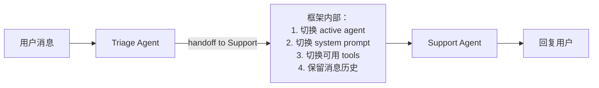
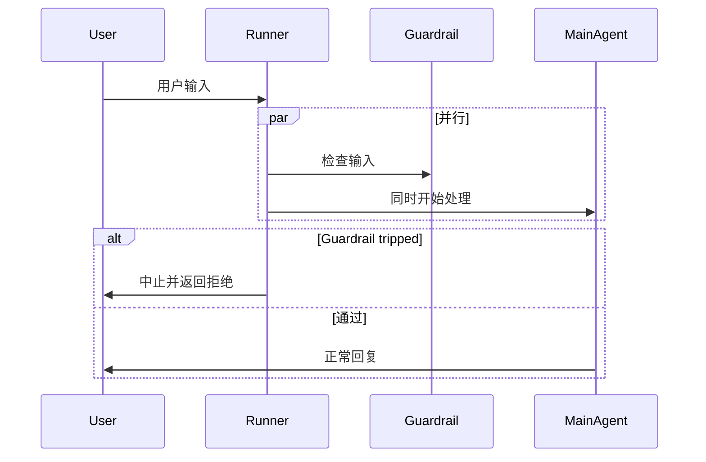

<section class="doc-hero">
  <p class="doc-hero__kicker">主流 Agent 框架</p>
  <h1>OpenAI Agents SDK / Swarm 深度剖析</h1>
  <p class="doc-hero__lead">2024 年 10 月 OpenAI 发布 Swarm（实验性多 Agent 框架），2025 年 3 月升级为正式产品 Agents SDK。核心理念是"最小原语，最大灵活"——只用 Agent、Handoff、Guardrail 三个抽象，就能搭出复杂的多 Agent 系统。这是 OpenAI 对"什么是 Agent 框架"的官方答卷。</p>
  <div class="doc-hero__meta" aria-label="本文信息">
    <span>适合阶段：进阶 / 生产</span>
    <span>核心链路：Agent → Handoff → Guardrail → Tracing</span>
    <span>面试重点：Handoff vs Tool + Guardrails + Computer Use</span>
  </div>
</section>

> **本文边界**：聚焦 OpenAI Agents SDK 的核心抽象和与 Swarm 的演进关系。OpenAI Function Calling 协议见 [函数调用规范](../tools/function-calling)；和 Claude Agent SDK 的对比见 [Claude Agent SDK](./claude-agent-sdk)；多 Agent 模式见 [多 Agent 编排](../multi-agent/patterns)。

## 面试官想考什么

读完这篇你要能正面回答下面这些题。每题后面括号里是面试官真正想看你答出什么。

<div class="interview-grid">
  <div>
    <strong>Swarm 和 Agents SDK 是什么关系？为什么 OpenAI 要做两次？</strong>
    <span>考产品演进——Swarm 是实验性 reference impl（教学用），Agents SDK 是 production-ready 升级版（带 tracing、guardrails、computer use）。</span>
  </div>
  <div>
    <strong>Handoff 和普通的 Tool Call 有什么区别？为什么要单独设计一个原语？</strong>
    <span>考多 Agent 设计——Tool 是"调用一个函数"，Handoff 是"把控制权转给另一个 Agent"，语义和上下文传递机制都不同。</span>
  </div>
  <div>
    <strong>Guardrail 和 Hook 是一回事吗？什么时候触发？</strong>
    <span>考守护机制——Input Guardrail 在 Agent 处理输入前跑，Output Guardrail 在 Agent 输出后跑，用并发模型不阻塞主链路。</span>
  </div>
  <div>
    <strong>Agents SDK 的 Tracing 自动追踪是怎么实现的？性能开销大吗？</strong>
    <span>考可观测设计——内置 OpenTelemetry 风格的 trace，记录每次 LLM 调用、tool call、handoff，可以导到第三方平台。</span>
  </div>
  <div>
    <strong>Computer Use 工具是什么？它和普通的浏览器自动化（Playwright）有什么不同？</strong>
    <span>考新一代 Agent 工具——LLM 直接看截图操作鼠标键盘，不依赖 DOM 解析或 selector，对动态页面更鲁棒。</span>
  </div>
  <div>
    <strong>Agents SDK 和 LangGraph 比，最大的差距是什么？</strong>
    <span>考框架定位——Agents SDK 走"轻量原语"路线（Agent/Handoff 几个核心概念），LangGraph 走"显式状态机"路线（节点+边+state+reducer）。</span>
  </div>
  <div>
    <strong>OpenAI Assistants API（β 阶段那个）和 Agents SDK 是什么关系？</strong>
    <span>考 API 历史——Assistants API 是服务端 Agent（OpenAI 帮你管状态），Agents SDK 是客户端框架（你的代码里跑循环）。</span>
  </div>
</div>

---

## 为什么需要 Agents SDK

2023-2024 年 OpenAI 在 Agent 方向上有过几次尝试：

```
2023.11 - Assistants API（β）
  → 服务端管理 Agent 状态（threads、messages、runs）
  → 优点：状态不丢、自动重试
  → 缺点：黑盒、debug 困难、定制性差

2024.10 - Swarm（实验性）
  → 客户端轻量框架，只有 Agent + Handoff 两个原语
  → 优点：极简、可读性高
  → 缺点：缺 tracing、缺 guardrail、缺 production 工具

2025.03 - Agents SDK（正式）
  → 在 Swarm 基础上加上 Tracing + Guardrails + Computer Use + Voice
  → 目标：production-ready 的多 Agent 框架
```

为什么 OpenAI 一定要做这个？因为他们观察到客户在做多 Agent 时一直在"重新发明轮子"——每家都自己实现 Agent 间路由、上下文传递、错误隔离。这些工程问题在每个项目里都长得差不多，OpenAI 决定把答案标准化。

Agents SDK 的核心信仰是 **"少即是多"**——和 LangChain/LangGraph 引入十几个抽象不同，整个 SDK 只有 4 个核心概念：

```
1. Agent       —— 一个带 instruction + tools 的角色
2. Handoff     —— 把控制权转给另一个 Agent
3. Guardrail   —— 在输入/输出上跑检查
4. Tracing     —— 自动记录执行轨迹
```

这种极简风格类似 Pi 的"最小内核"哲学——给你原语，让你自己组装。

---

## Agent：所有原语的起点

```python
from agents import Agent

triage_agent = Agent(
    name="Triage",
    instructions="""You are the first responder.
    Classify user intent: support, sales, or technical.
    Hand off to the appropriate specialist.""",
    handoffs=[support_agent, sales_agent, tech_agent],
)
```

Agent 本身很简单——就是一个有 instruction、tools、handoff 列表的对象。但它和 LangChain 的 Agent 有本质区别：**没有内置 loop**。

LangChain 的 AgentExecutor 是"给你 Agent 你给我循环"——框架自动跑 think-act-observe。Agents SDK 把循环放在 Runner 里：

```python
from agents import Runner

result = await Runner.run(
    triage_agent,
    "我的订单还没到货"
)
print(result.final_output)
```

`Runner.run()` 是这个 SDK 唯一的入口。它做的事：
1. 把消息发给 starting agent
2. Agent 决定：用工具？handoff 给另一个 Agent？还是回复？
3. 如果是工具或 handoff，执行后继续循环
4. 如果是回复，把 final_output 返回

这种"Agent 是数据，Runner 是行为"的设计让 Agent 可以被序列化、版本化、A/B 测试——和把 loop 焊死在 Agent 里的框架不同。

---

## Handoff：多 Agent 编排的核心原语

Handoff 是 Agents SDK 区别于其他框架的关键。它**不是 tool call**——尽管底层用 function calling 实现：

```python
support_agent = Agent(
    name="Support",
    instructions="You handle order/shipping issues...",
    tools=[lookup_order, refund_order],
)

tech_agent = Agent(
    name="Technical",
    instructions="You handle technical bugs...",
    tools=[search_kb, file_ticket],
)

triage_agent = Agent(
    name="Triage",
    instructions="Classify and route...",
    handoffs=[support_agent, tech_agent],   # 不是 tools
)
```

Tool 和 Handoff 的语义差异：

| 维度 | Tool Call | Handoff |
|---|---|---|
| 调用者 | Agent 调用工具，仍是 Agent 在主导 | Agent 放弃控制，新 Agent 接管 |
| 返回值 | 工具返回结果，Agent 继续推理 | 没有"返回"，新 Agent 直接面对用户 |
| 上下文 | 工具看不到对话历史 | 新 Agent 看得到整个对话历史 |
| 工具集 | 仍是原 Agent 的 tools | 切换到新 Agent 的 tools |
| Instructions | 不变 | 切换到新 Agent 的 instructions |

具体看 handoff 发生时框架做什么：



**为什么不能用 tool call 模拟 handoff？**

理论上可以——你让 Triage 调用一个 `route_to_support` 工具，工具内部递归调用 Support Agent。但这样：

- 上下文是单向的（Support 看不到 Triage 的完整对话）
- 调用栈嵌套了（Support 完了要返回给 Triage 再返回给用户）
- 工具描述膨胀（每个可能的 handoff 都是一个 tool）

Handoff 是**控制流的转移**，不是函数调用。这就是为什么需要单独的原语。

---

## Guardrail：守护机制的并发设计

Guardrail 解决一个真实问题——Agent 可能被诱导（prompt injection）输出不该输出的内容，或者用户输入了明显有害的请求。直接在主链路加检查会拖慢响应。

Agents SDK 的设计是**并行运行 Guardrail**：

```python
from agents import Agent, GuardrailFunctionOutput, input_guardrail

@input_guardrail
async def check_jailbreak(ctx, agent, input_data):
    # 用一个小模型快速判断是否是越狱尝试
    response = await small_model.classify(input_data)
    return GuardrailFunctionOutput(
        output_info={"category": response.label},
        tripwire_triggered=(response.label == "jailbreak"),
    )

main_agent = Agent(
    name="Assistant",
    instructions="...",
    input_guardrails=[check_jailbreak],
)
```

关键设计——**Guardrail 和主 Agent 同时启动**：



这种"先跑、跑出问题再止损"的乐观策略，对延迟敏感场景关键——不让 guardrail 成为串行瓶颈。代价是如果 Guardrail 触发，主 Agent 已经做了一些工作（可能浪费 token）。

Guardrail 分两类：

- **Input Guardrail**：检查用户输入。常用：jailbreak 检测、内容分类、PII 过滤
- **Output Guardrail**：检查 Agent 输出。常用：事实性检查、合规审查、敏感信息泄漏

Output Guardrail 不能像 Input 那样并行——必须等 Agent 输出完再检查。所以延迟开销更明显。

---

## Tracing：内置的可观测

Agents SDK 内置 OpenTelemetry 风格的 tracing，**默认开启**：

```python
result = await Runner.run(triage_agent, "我要退款")

# 自动生成的 trace 结构：
# - Run started: triage_agent
#   - LLM call (model=gpt-4o, tokens=...)
#   - Handoff: triage_agent → support_agent
#   - LLM call (model=gpt-4o, tokens=...)
#     - Tool call: lookup_order(order_id="...")
#     - Tool call: refund_order(...)
#   - Final output: ...
```

trace 自动上传到 OpenAI 的 dashboard（platform.openai.com/traces），也可以导到第三方：

```python
from agents.tracing import add_trace_processor

# 接入 Langfuse、Honeycomb 等
add_trace_processor(MyCustomProcessor())
```

这是 OpenAI 把云服务能力打包进 SDK 的一个例子——其他框架（如 LangChain）需要单独配 LangSmith，Agents SDK 默认就有。

**性能开销**：trace 上传是异步、批量的，主链路不阻塞。但每次 LLM 调用要记录 input/output（可能是几 KB 数据），对超高 QPS 场景需要采样。

---

## Computer Use：LLM 直接操作电脑

Agents SDK 集成了 OpenAI 2025 年初推出的 Computer Use 模型——让 Agent 直接看截图、控制鼠标键盘。这和传统浏览器自动化（Playwright/Selenium）的差距是范式级的：

| 维度 | Playwright | Computer Use |
|---|---|---|
| 输入 | DOM 树 + CSS selector | 屏幕截图 |
| 操作 | element.click() / element.fill() | mouse_move / mouse_click / keyboard_type |
| 适应变化 | selector 变了就挂 | 视觉理解，UI 改版仍能识别 |
| 适用范围 | 仅浏览器 | 浏览器 / 桌面应用 / 终端 |
| 成本 | 极低 | 每步一次视觉模型推理（贵） |

```python
from agents import Agent, ComputerTool

agent = Agent(
    name="Browser Agent",
    instructions="Use the browser to complete the user's task.",
    tools=[ComputerTool(display_width=1024, display_height=768)],
)

await Runner.run(agent, "去 Hacker News 找出今天前 5 条新闻并保存到 hn_top5.txt")
```

内部流程：

```
1. Agent 收到任务
2. ComputerTool 截屏，把图片发给 Computer Use 模型
3. 模型返回动作（如 mouse_click [x=120, y=345]）
4. SDK 执行动作（在底层用 xdotool / AppleScript / pyautogui）
5. 再截屏 → 再让模型决策
6. 直到任务完成
```

Computer Use 不是 selenium 的替代品——它是为"DOM 不可解析"或"非浏览器应用"设计的。普通网页爬虫还是用 Playwright 更快更便宜。

---

## 实战：客服分流系统

```python
from agents import Agent, Runner, function_tool, input_guardrail, GuardrailFunctionOutput
from pydantic import BaseModel
import asyncio

# 工具
@function_tool
def lookup_order(order_id: str) -> str:
    """根据订单号查询订单状态"""
    return f"Order {order_id}: Shipped on 2025-09-20, expected delivery 2025-09-25"

@function_tool
def search_product_kb(query: str) -> str:
    """搜索产品知识库"""
    return f"KB results for '{query}': ..."

# Input Guardrail：检测无关问题
class IntentCheck(BaseModel):
    is_business_related: bool
    reason: str

intent_checker = Agent(
    name="Intent Checker",
    instructions="Determine if the user's query is business-related.",
    output_type=IntentCheck,
)

@input_guardrail
async def business_check(ctx, agent, input_data):
    result = await Runner.run(intent_checker, input_data)
    return GuardrailFunctionOutput(
        output_info=result.final_output,
        tripwire_triggered=not result.final_output.is_business_related,
    )

# 专业 Agent
order_agent = Agent(
    name="Order Specialist",
    instructions="Handle order/shipping queries. Use lookup_order to check status.",
    tools=[lookup_order],
)

product_agent = Agent(
    name="Product Specialist",
    instructions="Answer product questions using the knowledge base.",
    tools=[search_product_kb],
)

# 分流 Agent
triage = Agent(
    name="Triage",
    instructions="""Route the user to the right specialist:
    - Order/shipping → Order Specialist
    - Product features → Product Specialist""",
    handoffs=[order_agent, product_agent],
    input_guardrails=[business_check],
)

# 运行
async def main():
    result = await Runner.run(triage, "我的订单 ORD-12345 什么时候到？")
    print(result.final_output)

asyncio.run(main())
```

整个流程：用户问题 → 业务相关性检查（并行）→ Triage 分类 → handoff 到 Order Specialist → 调用 lookup_order 工具 → 回复用户。代码量比 LangGraph 实现同等功能少 60%——这就是"轻量原语"的杠杆。

---

## 容易踩的坑

**坑 1：Handoff 和 Tool 混用导致 Agent 混乱**

- **现象**：Agent 该 handoff 时调用了 tool，该 tool 时调用了 handoff
- **根因**：Handoff 在 system prompt 里被描述成 "transfer to ..."，和 tool 的描述容易混淆
- **修法**：handoff 目标 Agent 的 description 写清楚——"Use this for X scenarios"。如果一个 Agent 既有 handoff 又有 tool，确保两者语义边界清晰

**坑 2：Guardrail 用了大模型导致延迟翻倍**

- **现象**：加了 Input Guardrail 后整体响应慢 2-3 秒
- **根因**：Guardrail 用了 gpt-4o 做分类，相当于跑了两次 LLM
- **修法**：Guardrail 一定要用小模型（gpt-4o-mini、moderation API）。复杂判断也优先用低成本模型——Guardrail 是"门卫"不是"专家"

**坑 3：Tracing 上传超额导致 trace 不全**

- **现象**：OpenAI dashboard 上看不到完整 trace，部分 LLM call 缺失
- **根因**：高 QPS 场景下 trace 上传被限流
- **修法**：用采样（sampling）只上传 10% trace，或者把 trace 导到自己的存储（接 add_trace_processor）

**坑 4：用 Computer Use 跑常规网页爬虫**

- **现象**：每次操作要 2-3 秒，成本飙升
- **根因**：Computer Use 每步都过视觉模型，比直接 DOM 操作慢 100 倍
- **修法**：只在"页面结构难解析"或"防爬严格"场景用 Computer Use。常规爬虫用 Playwright + LLM 提取数据更高效

---

## 与 Claude Agent SDK 的核心差异

两者都是模型厂商的官方 Agent SDK，常被对比：

| 维度 | OpenAI Agents SDK | Claude Agent SDK |
|---|---|---|
| 设计哲学 | 轻量原语（Agent/Handoff/Guardrail） | 工程最佳实践打包（内置工具、Hooks、Permission） |
| 多 Agent | Handoff 是一等公民 | Subagent（Task tool） |
| 内置工具 | 中（WebSearch、FileSearch、ComputerUse） | 多（Bash/Read/Edit/Glob/Grep/...） |
| Permission | 弱（靠 Guardrail 拦截） | 强（4 种 mode） |
| Tracing | 内置 | 无（要自己埋点） |
| 模型支持 | 仅 OpenAI | 仅 Claude |
| 适合场景 | 多 Agent 客服、工作流分流 | 编程 Agent、CLI 工具 |

**选 OpenAI Agents SDK**：你的核心模型是 GPT；做多 Agent 客服/分流系统；需要 Voice、Computer Use 等 OpenAI 独家能力。

**选 Claude Agent SDK**：你做编程类 Agent；需要 Hooks 介入 Agent 行为；需要细粒度 permission control。

---

## 面试题深度解析

**Q1: Handoff 和 Tool Call 有什么本质区别？**

- **30 秒版本**：Tool Call 是"Agent 调用一个函数"——Agent 仍主导，工具执行完返回继续推理。Handoff 是"控制权转移"——原 Agent 退出，新 Agent 接管对话历史和后续交互。语义上 Tool 是子任务，Handoff 是角色切换。
- **追问：底层不都是用 function calling 实现吗？** 是的——OpenAI 没有专门的"handoff message type"，handoff 是被实现成一个特殊的 function call。但 SDK 在收到这个 function call 时做的事完全不同：不执行函数返回结果，而是切换 active agent、切换 system prompt、切换 tools。所以从 LLM API 看是 function call，从 SDK 看是控制流转移。
- **追问：Handoff 后能 handoff 回来吗？** 能。Support Agent 的 handoffs 列表里可以包含 Triage Agent。但 SDK 不强制——很多场景下 Agent 应该走到底（解决问题或人工接管），而不是踢皮球。

**Q2: Guardrail 为什么用并行模型而不是串行？**

- **30 秒版本**：串行 guardrail（先检查再处理）会把 P99 延迟翻倍——主 Agent 的耗时 + Guardrail 耗时。并行 guardrail 让两者同时跑，guardrail 完成快（小模型）的情况下，主 Agent 还没出第一个 token 就已经判定通过。即使 guardrail 触发，浪费的也只是部分主 Agent 的 token——绝对值可控。
- **追问：guardrail 触发后主 Agent 已经跑了一半，怎么办？** SDK 会取消主 Agent 的请求（cancel stream），但已经消耗的 token 是付费的。所以 guardrail 设计要快，让"提前止损"的窗口尽量短。
- **追问：Output guardrail 也能并行吗？** 不能。Output guardrail 必须等 Agent 输出完才能检查，所以延迟开销直接叠加。这就是为什么 Output guardrail 用得比 Input 少——通常用 system prompt 约束输出格式（提前防御），少用 Output guardrail（事后审查）。

**Q3: Agents SDK 和 LangGraph，最大的差距是什么？**

- **30 秒版本**：编排能力。LangGraph 的显式图状态机能表达任意复杂的多 Agent 流程（环、分支、并行、HITL、时间旅行）。Agents SDK 的 Handoff 模型本质是"线性链"——A → B → C，不擅长复杂的循环和分支。简单分流场景 Agents SDK 更轻，复杂工作流 LangGraph 更强。
- **追问：Agents SDK 能做循环吗？** 能。Agent 的 instruction 可以包含"如果不满足条件就 handoff 回上一个 Agent"。但这是用 prompt 层硬撑——没有显式的 loop 结构，状态管理靠 Agent 自己理解对话历史。LangGraph 的 add_edge 是显式的循环结构，可靠性高得多。
- **追问：为什么 OpenAI 不直接做一个更强的编排引擎？** 因为这违背他们的"轻量原语"哲学。OpenAI 的赌注是：大部分多 Agent 场景不需要复杂图，4 个原语够用了。复杂场景用户自己拼 LangGraph 或者 Temporal。这种"做少不做多"的策略，跟他们做 Assistants API（β）失败的教训有关——抽象过重反而难用。

---

## 延伸阅读

- **官方文档** [openai.github.io/openai-agents-python](https://openai.github.io/openai-agents-python/) — Quickstart、Multi-agent、Guardrails 三章是核心。文档简洁但密度大
- **源码** [github.com/openai/openai-agents-python](https://github.com/openai/openai-agents-python) — Python 版本，TS 版本在 [openai-agents-js](https://github.com/openai/openai-agents-js)。看 `agents/runner.py` 理解执行循环
- **Swarm 项目（已归档）** [github.com/openai/swarm](https://github.com/openai/swarm) — Swarm 仍可读，理解 Agents SDK 的演进路径必看。代码极简，是优秀的教学材料
- **Computer Use 模型** [openai.com/index/computer-use](https://openai.com/index/computer-use) — OpenAI 关于 Computer Use 的发布说明。理解模型能力边界对设计 Agent 任务很有帮助
- **Anthropic Building Effective Agents** [anthropic.com/research/building-effective-agents](https://www.anthropic.com/research/building-effective-agents) — 不是 OpenAI 的，但对比阅读能理解两家公司对 Agent 框架的不同哲学（OpenAI 重原语、Anthropic 重最佳实践）
