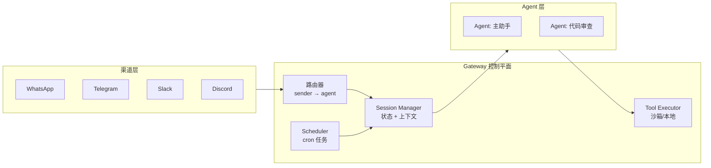

<section class="doc-hero">
  <p class="doc-hero__kicker">主流 Agent 框架</p>
  <h1>OpenClaw 深度剖析</h1>
  <p class="doc-hero__lead">OpenClaw 不是又一个"调 API 的 wrapper"——它是一个跑在你自己机器上的 AI 助手网关，把 WhatsApp、Telegram、Slack、iMessage 等 20+ 渠道统一接入同一个 Agent，所有数据留在本地。GitHub 37 万 star，2025 年个人 AI 助手赛道的事实标准。</p>
  <div class="doc-hero__meta" aria-label="本文信息">
    <span>适合阶段：进阶 / 生产</span>
    <span>核心链路：Channel → Gateway → Agent → Tool/Skill</span>
    <span>面试重点：Gateway 架构 + Session 隔离 + Skill 自生成</span>
  </div>
</section>

> **本文边界**：聚焦 OpenClaw 的架构设计与工程决策——Gateway 模型、Session 隔离、Skill 系统、安全沙箱。通用的 Agent 模式见 [ReAct](../agent/react-pattern)；多 Agent 协作见 [多 Agent 编排](../multi-agent/patterns)；MCP 协议见 [MCP 详解](../tools/mcp)。

## 面试官想考什么

读完这篇你要能正面回答下面这些题。每题后面括号里是面试官真正想看你答出什么。

<div class="interview-grid">
  <div>
    <strong>OpenClaw 的 Gateway 和传统 API Gateway（如 Kong/Nginx）有什么本质区别？</strong>
    <span>考架构理解——能不能讲清 Gateway 不只是流量转发，而是 Session 状态机 + 渠道路由 + 工具调度的控制平面。</span>
  </div>
  <div>
    <strong>OpenClaw 怎么做到一个 Agent 同时服务 WhatsApp、Telegram、Slack？消息格式不一样怎么办？</strong>
    <span>考多渠道抽象设计——Channel Adapter 层把平台差异抹平成统一的 Message 模型。</span>
  </div>
  <div>
    <strong>多个用户同时给 Agent 发消息，Session 隔离怎么做的？会不会串上下文？</strong>
    <span>考并发安全意识——per-sender session isolation，每个 sender 独立的对话状态。</span>
  </div>
  <div>
    <strong>OpenClaw 的 Skill 和 MCP Server 有什么关系？能互相替代吗？</strong>
    <span>考工具体系的分层认知——Skill 是更高层的"能力包"（含 prompt + tool + 文件），MCP 是底层的工具协议。</span>
  </div>
  <div>
    <strong>Agent 自己写 Skill 给自己用，怎么防止它写出恶意代码？</strong>
    <span>考安全边界设计——沙箱隔离（Docker/SSH/OpenShell）+ 非 main session 默认受限 + DM pairing code。</span>
  </div>
  <div>
    <strong>"本地优先"在工程上意味着什么？和 SaaS 产品比有哪些 trade-off？</strong>
    <span>考架构决策的工程直觉——隐私 vs 可用性、自运维 vs 托管、离线能力 vs 同步复杂度。</span>
  </div>
  <div>
    <strong>OpenClaw 拿到 37 万 star 的核心原因是什么？技术壁垒在哪？</strong>
    <span>考产品 + 技术结合的判断力——不是模型能力（它用的是 Claude/GPT），而是渠道整合 + 本地数据主权 + Skill 生态的网络效应。</span>
  </div>
</div>

---

## 为什么需要 OpenClaw

你大概率已经在用某种 AI 助手——ChatGPT、Claude、Gemini。但你遇到过这些问题：

```
场景 1：你在 Slack 里问 Claude 一个问题，它不知道你昨天在 ChatGPT 里聊的上下文。
场景 2：你想让 AI 帮你管邮件，但 ChatGPT 读不了你的 Gmail。
场景 3：你想让 AI 定时检查某个网页，但所有 SaaS AI 都不支持 cron job。
场景 4：你在手机上和 AI 聊了一半，换到电脑上——上下文丢了。
```

这些问题的根源是同一个：**主流 AI 助手是"平台锁定 + 云端数据 + 单渠道"模型**。你的对话被锁在某一家的服务器上，工具能力受限于平台提供的插件，跨设备跨应用的上下文完全断裂。

OpenClaw 的回答很直接：**把 AI 助手跑在你自己的机器上，让它成为你所有聊天渠道的统一后端**。

```
┌─────────────┐  ┌───────────┐  ┌─────────┐  ┌──────────┐
│  WhatsApp   │  │ Telegram  │  │  Slack  │  │ iMessage │ ...
└──────┬──────┘  └─────┬─────┘  └────┬────┘  └────┬─────┘
       │               │             │             │
       └───────────────┴──────┬──────┴─────────────┘
                              │
                     ┌────────▼─────────┐
                     │  OpenClaw Gateway │  ← 跑在你的 MacBook / VPS 上
                     │  (Node.js 进程)   │
                     └────────┬─────────┘
                              │
                 ┌────────────┼────────────┐
                 │            │            │
           ┌─────▼────┐ ┌────▼────┐ ┌─────▼─────┐
           │ Session A │ │Session B│ │ Session C │
           │ (你自己)  │ │ (同事)  │ │ (cron任务)│
           └─────┬────┘ └────┬────┘ └─────┬─────┘
                 │           │             │
           ┌─────▼───────────▼─────────────▼─────┐
           │         LLM (Claude / GPT / 本地)    │
           └─────────────────────────────────────┘
```

你在 WhatsApp 上说"帮我查下明天的航班"，和你在 Slack 上说"刚才那个航班几点到"——OpenClaw 知道这是同一个人、同一段对话。

---

## Gateway 架构：不只是代理转发

OpenClaw 的核心是一个叫 Gateway 的 Node.js 长驻进程。但它不是 Nginx 那种无状态的反向代理。

### Gateway 做了什么



Gateway 是整个系统的 **single source of truth**，负责四件事：

**1. 渠道路由（Channel Routing）**

每个渠道通过 Channel Adapter 接入。适配器的职责是把平台特有的消息格式（WhatsApp 的 protobuf、Telegram 的 Bot API JSON、Slack 的 Events API）转换成 OpenClaw 内部的统一 Message 模型。

```typescript
// 简化的 Channel Adapter 接口
interface ChannelAdapter {
  // 平台消息 → 内部统一格式
  normalize(rawMessage: PlatformMessage): UnifiedMessage
  // 内部格式 → 平台消息（发回给用户）
  denormalize(message: UnifiedMessage): PlatformMessage
  // 处理平台特有的鉴权流程
  authenticate(config: ChannelConfig): Promise<void>
}
```

配置层面，`~/.openclaw/openclaw.json` 里可以设置哪些渠道的消息路由到哪个 Agent：

```json
{
  "channels": {
    "whatsapp": {
      "allowFrom": ["+8613800138000"],
      "agent": "main"
    },
    "slack": {
      "workspace": "my-team",
      "agent": "code-reviewer",
      "requireMention": true
    }
  }
}
```

这里的关键设计决策：**一个 Gateway 可以跑多个 Agent，不同渠道/发送者可以路由到不同 Agent**。做代码审查的 Slack bot 和做日常助手的 WhatsApp bot 共享同一个进程，但 Session 和 Workspace 完全隔离。

**2. Session 隔离**

每个 sender（以渠道 + 用户 ID 唯一标识）拥有独立的 Session。Session 里存着：
- 对话历史（context window 管理）
- 当前 Agent 配置（用哪个模型、什么 system prompt）
- 工具执行状态（正在跑的命令、pending 的审批）

这意味着两个人同时给你的 OpenClaw 发消息，不会看到彼此的对话内容，也不会因为一个人的长任务阻塞另一个人的交互。

**3. 工具调度与沙箱**

Gateway 调度工具执行时，区分两种 Session：

| Session 类型 | 工具权限 | 执行环境 |
|---|---|---|
| **main**（你自己） | 完全访问：bash、文件读写、浏览器、网络 | 直接在宿主机执行 |
| **非 main**（其他人/cron） | 受限：bash + 文件读写，禁止浏览器和网络 | Docker / SSH / OpenShell 沙箱 |

这个设计很聪明——你自己用时不会被沙箱束手束脚，但别人通过你的 WhatsApp 号跟你的 Agent 对话时，Agent 的操作范围被严格限制。

**4. 定时任务（Cron Scheduler）**

内置 cron 调度器，Agent 可以自己创建定时任务：

```
你：每天早上 8 点给我汇总 Hacker News 头条
Agent：好的，我创建了一个 cron job——
       每天 08:00 触发，执行 browse → summarize → 通过 Telegram 发给你
```

这在 ChatGPT/Claude 这类 SaaS 产品里做不到——它们没有"在你不主动发消息时也能跑起来"的能力。

---

## Skill 系统：Agent 自己给自己写插件

Skill 是 OpenClaw 里比 Tool 更高一层的抽象。一个 Skill 不只是"调用一个函数"，而是一个完整的**能力包**：

```
~/.openclaw/workspace/skills/flight-checkin/
├── SKILL.md          # 指令：什么时候触发、怎么执行
├── checkin.py        # 实际执行脚本
└── airlines.json     # 配置数据
```

和 MCP Server 对比：

| 维度 | MCP Server | OpenClaw Skill |
|---|---|---|
| 粒度 | 单个工具函数（search、read_file） | 一组文件 + 指令 + 工具的集合 |
| 谁写的 | 开发者预先写好 | 开发者写，**或 Agent 运行时自动生成** |
| 分发 | 独立进程，JSON-RPC 通信 | Workspace 里的文件夹，热加载 |
| 状态 | 无状态（每次调用独立） | 有状态（可以存配置文件、缓存） |

最有意思的是 **Agent 自动生成 Skill** 这个能力。当你让 OpenClaw 做一件它之前没做过的复杂任务（比如"帮我把 Notion 里的周报同步到飞书"），它会：

1. 用现有工具（浏览器 + bash）先手动完成一次
2. 把执行过程抽象成一个 Skill——生成 SKILL.md 和脚本文件
3. 下次你说"同步周报"时，直接调用这个 Skill，不再需要从头推理

这本质上是一种 **procedural memory**——Agent 把一次性的经验固化成可复用的程序。ClawHub（clawhub.ai）是社区共享 Skill 的市场，目前已有 50+ 预置集成（Spotify、Hue、Obsidian、Twitter、GitHub、Gmail 等）。

---

## Workspace 与 Prompt 注入

OpenClaw 的 Agent 人格和行为通过 Workspace 里的 Markdown 文件定义：

```
~/.openclaw/workspace/
├── AGENTS.md     # Agent 的核心指令——角色、边界、行为规则
├── SOUL.md       # 人格层——语气、风格、价值观
├── TOOLS.md      # 工具使用指南——什么时候用什么工具
└── skills/       # 技能目录
```

这些文件会在每次对话开始时被注入到 system prompt 中。这种"配置即 Markdown"的设计有两个好处：

- **版本可控**：整个 Workspace 可以 git 管理，团队共享
- **热更新**：改完文件下次对话立刻生效，不需要重启 Gateway

但也有安全隐患——如果 Agent 有写文件权限（main session 默认有），理论上它可以修改自己的 AGENTS.md。OpenClaw 的防护是：main session 的 AGENTS.md 修改需要用户确认，非 main session 无权写 Workspace 根目录。

---

## 安全模型：从 DM Pairing 到容器沙箱

把 AI Agent 暴露到公网聊天渠道上，安全问题比 API 服务复杂得多——任何人都可以给你的 WhatsApp 号发消息，而 Agent 默认有执行 bash 命令的能力。

OpenClaw 的安全分三层：

**第一层：DM Pairing（接入控制）**

```
陌生人给你的 WhatsApp 号发消息
→ Agent 不会直接回复
→ 而是返回一个 6 位 pairing code
→ 只有你在本地确认后，该 sender 才被加入 allowlist
```

这类似于蓝牙配对——设备不会自动信任未知连接。

**第二层：Session 权限分级**

如前文所述，main session 和非 main session 的权限天差地别。关键配置：

```json
{
  "sandbox": {
    "defaultPolicy": {
      "allow": ["bash", "process", "read", "write", "edit", "session"],
      "deny": ["browser", "canvas", "network"]
    }
  }
}
```

**第三层：执行环境隔离**

非 main session 的工具执行跑在 Docker 容器、SSH 远程机器或 OpenShell 沙箱里。即使 Agent 被 prompt injection 攻击诱导执行了 `rm -rf /`，炸的也只是沙箱容器。

---

## 容易踩的坑

**坑 1：Node 版本不对导致 Gateway 启动崩溃**

- **现象**：`openclaw onboard` 后启动报 `SyntaxError: Unexpected token`
- **根因**：OpenClaw 要求 Node 24（推荐）或 Node 22.19+，用了 Node 18/20 会因为缺少语法特性挂掉
- **修法**：用 `nvm install 24` 或让安装脚本自动管理——`curl -fsSL https://openclaw.ai/install.sh | bash` 会自动安装正确版本

**坑 2：WhatsApp 渠道断连后 Session 丢失**

- **现象**：WhatsApp Web 掉线重连后，之前的对话上下文没了
- **根因**：WhatsApp 的 Web 端每次重连会生成新的 session token，OpenClaw 可能把它识别为新 sender
- **修法**：在配置里用手机号而非 session ID 做 sender 标识：`allowFrom: ["+86..."]`

**坑 3：Skill 自动生成的代码质量参差不齐**

- **现象**：Agent 自动创建的 Skill 在简单场景能跑，复杂场景频繁出错
- **根因**：自动生成本质是 LLM 写代码，没有测试覆盖。边界情况（网络超时、API 变更、认证过期）基本不处理
- **修法**：对关键 Skill 手动审查和加固。把自动生成的 Skill 当作"初稿"而非"生产代码"

**坑 4：多 Agent 路由配置错误导致消息发到错误的 Agent**

- **现象**：在 Slack 里的问题被发给了日常助手 Agent 而不是代码审查 Agent
- **根因**：路由规则优先级不清晰——多个规则匹配同一个 sender 时，第一个匹配的生效
- **修法**：用 `requireMention: true` 收紧匹配范围，或明确设置路由优先级

---

## 与同类框架的对比

| 维度 | OpenClaw | Claude Desktop | ChatGPT | Hermes Agent |
|---|---|---|---|---|
| 数据位置 | 完全本地 | Anthropic 服务器 | OpenAI 服务器 | 完全本地 |
| 渠道支持 | 20+ 平台 | 仅桌面 App | Web + App | 20+ 平台 |
| 定时任务 | 内置 cron | 不支持 | 不支持 | 内置 cron |
| Skill 自生成 | 支持 | 不支持 | GPT Store（云端） | 支持（自我进化） |
| 模型锁定 | 无（Claude/GPT/本地） | Claude only | GPT only | 无（200+ 模型） |
| 安全隔离 | Docker/SSH 沙箱 | 有限 | 平台托管 | Docker/SSH/Singularity |
| 开发语言 | TypeScript (Node.js) | 闭源 | 闭源 | Python |

选 OpenClaw 的核心场景：**你需要一个 7×24 在线的私人助手，跨多个聊天平台使用，数据必须留在自己手里**。如果你只是想在浏览器里聊天，ChatGPT/Claude 已经够用。

---

## 面试题深度解析

**Q1: OpenClaw 的 Gateway 和传统 API Gateway 有什么本质区别？**

- **30 秒版本**：传统 API Gateway（Kong/Nginx）是无状态的 HTTP 代理——请求进来、转发、响应出去。OpenClaw 的 Gateway 是有状态的控制平面，管理 Session 生命周期、渠道路由映射、工具执行调度和 cron 定时器。它更像一个轻量级的应用服务器而非网络代理。
- **追问：为什么不用微服务架构，把 Session Manager、Router、Tool Executor 拆成独立服务？** 因为 OpenClaw 的目标用户是个人/小团队，跑在一台机器上。微服务带来的运维复杂度（服务发现、分布式事务、网络分区）远超收益。单进程架构让 `npm i -g openclaw && openclaw onboard` 就能用，这是它能拿到 37 万 star 的关键——**低部署门槛**。
- **追问：单进程会不会成为性能瓶颈？** Node.js 的事件循环本身就适合 I/O 密集场景（等 LLM 响应、等渠道 webhook）。CPU 密集的工具执行被分发到子进程或容器里。单个 Gateway 支撑十几个并发 Session 绰绰有余——对个人助手来说，你不会同时开 100 个对话。

**Q2: 多渠道消息格式不一样，怎么统一？**

- **30 秒版本**：Channel Adapter 模式。每个平台一个适配器，负责 normalize（平台消息 → 内部格式）和 denormalize（内部格式 → 平台消息）。Gateway 内部只和统一的 Message 模型交互。
- **追问：富媒体消息（图片、语音、文件）怎么处理？** 各平台的附件格式差异大（WhatsApp 用 CDN URL、Telegram 用 file_id、Slack 用 files.upload）。OpenClaw 在 normalize 阶段统一下载到本地，转成本地文件路径引用。发送时 denormalize 再上传到对应平台。这意味着 Agent 内部看到的永远是本地文件路径，不用关心平台差异。
- **追问：消息顺序保证呢？** 不同平台的消息送达顺序不保证（WhatsApp 的端到端加密引入额外延迟）。OpenClaw 在 Session 层用消息时间戳排序，但不做跨渠道的因果序——你在 Telegram 发的消息和你在 WhatsApp 发的消息之间没有 happens-before 关系，因为 Gateway 视为同一 sender 的两个独立会话。

**Q3: Agent 自己写 Skill 给自己用，怎么防止恶意代码？**

- **30 秒版本**：三层防护——DM pairing 防未知用户接入、Session 权限分级防越权、Docker/SSH 沙箱防宿主机被攻击。自动生成的 Skill 在非 main session 里只能在沙箱内执行。
- **追问：main session 里 Agent 写的 Skill 呢？不是在宿主机执行吗？** 对——main session 的安全模型本质上是"你信任你自己的 Agent"。这和你在终端里跑 `npm install` 一样，如果你不信任代码来源，就不该跑。OpenClaw 的立场是：main session 是 owner 自己在用，不做额外限制。安全边界划在"别人通过你的渠道和你的 Agent 交互"那一层。
- **追问：prompt injection 呢？别人给 Agent 发一段精心构造的消息，诱导它在 main session 里执行危险操作？** 这是真实风险。OpenClaw 的缓解措施是：(1) 非白名单 sender 默认走 pairing code，不会直接触发工具执行；(2) 高危操作（删除文件、网络请求）可以配置为需要用户确认；(3) 但如果攻击者已经在 allowlist 里（比如你的同事），防线就弱了。这是所有本地 Agent 的共性问题，不是 OpenClaw 特有的。

---

## 延伸阅读

- **官方文档** [docs.openclaw.ai](https://docs.openclaw.ai) — 从安装到高级配置的完整指南。重点看 Sessions 和 Skills 两章，这是理解 OpenClaw 区别于其他框架的关键
- **ClawHub 技能市场** [clawhub.ai](https://clawhub.ai) — 浏览社区贡献的 Skill，看看"Agent 自动生成的 Skill 长什么样"比读文档更直观
- **GitHub 仓库** [github.com/openclaw/openclaw](https://github.com/openclaw/openclaw) — TypeScript 源码。入口看 `packages/gateway/` 目录，特别是路由和 Session 管理模块
- **MCP 协议对比** [MCP 详解](../tools/mcp) — 理解 OpenClaw Skill 和 MCP Server 的分层关系，面试常考
