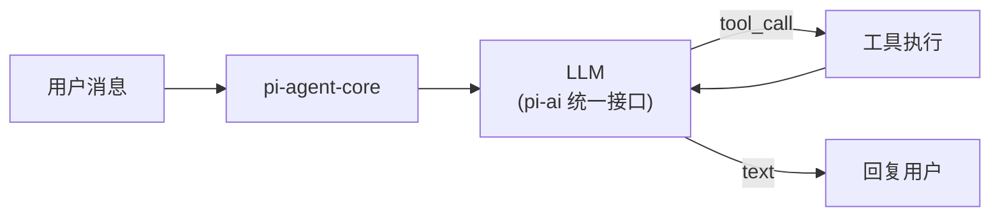

<section class="doc-hero">
  <p class="doc-hero__kicker">主流 Agent 框架</p>
  <h1>Pi 深度剖析</h1>
  <p class="doc-hero__lead">Claude Code 内置了 Plan Mode、子 Agent、权限弹窗、MCP、后台 Bash——Pi 的做法正好相反：内核什么都不内置，全部通过 Extension 实现。它把自己定义为"最小终端编程 harness"，5.9 万 star，225+ releases，核心理念是"primitive 优先于 feature"。</p>
  <div class="doc-hero__meta" aria-label="本文信息">
    <span>适合阶段：进阶 / 生产</span>
    <span>核心链路：Minimal Core → Extension → Skill → Prompt Template</span>
    <span>面试重点：极简内核哲学 + Extension 架构 + Session 树</span>
  </div>
</section>

> **本文边界**：聚焦 Pi 的架构哲学和扩展机制。编程 Agent 的通用模式见 [编程 Agent](../vertical/coding)；Claude Code 的源码解析见 [Claude Code 源码](../source/claude-code)；终端工具的选型见 [框架选型决策树](./comparison)。

## 面试官想考什么

读完这篇你要能正面回答下面这些题。每题后面括号里是面试官真正想看你答出什么。

<div class="interview-grid">
  <div>
    <strong>Pi 说自己是"最小内核"，它的内核到底包含什么、不包含什么？</strong>
    <span>考架构取舍的理解——内核只有 LLM 对话循环 + 工具调用 + 状态管理，MCP/子 Agent/权限/Plan Mode 全部外置。</span>
  </div>
  <div>
    <strong>Pi 的 Extension 和 MCP Server 有什么区别？为什么 Pi 不内置 MCP？</strong>
    <span>考工具协议分层——Extension 是进程内的 TypeScript 模块，能访问 TUI、键盘快捷键、事件系统；MCP 是进程间协议。两者解决的问题不同。</span>
  </div>
  <div>
    <strong>Pi 的四种运行模式（Interactive/Print/RPC/SDK）分别适合什么场景？</strong>
    <span>考对 Agent 消费方式的理解——不是所有场景都需要 TUI，脚本化、管道化、嵌入式各有需求。</span>
  </div>
  <div>
    <strong>Pi 的 Session 是"树状"结构，和线性对话历史有什么不同？有什么好处？</strong>
    <span>考状态管理设计——树结构允许分支探索、回溯、并行实验，线性历史做不到。</span>
  </div>
  <div>
    <strong>Pi 的供应链安全措施（exact pinning、shrinkwrap、2-day 发布延迟）为什么重要？</strong>
    <span>考安全意识——编程 Agent 能执行任意代码，它自身的依赖链被污染等于 RCE（远程代码执行）。</span>
  </div>
  <div>
    <strong>Pi 和 Claude Code 的核心架构差异在哪？</strong>
    <span>考两种设计哲学的对比——Claude Code 是"全功能内置，开箱即用"；Pi 是"最小内核，自己组装"。不同用户群、不同 trade-off。</span>
  </div>
  <div>
    <strong>"用户在 Agent 工作时可以发送消息打断它"——这在工程上怎么实现？</strong>
    <span>考并发模型的理解——中断当前工具执行 vs 排队等待，两种策略的 trade-off。</span>
  </div>
</div>

---

## 为什么需要 Pi

你大概率用过 Claude Code 或 Cursor——它们的体验是"开箱即用"：装好就能跑，内置了一堆功能。但你有没有遇到过这些不爽：

```
场景 1：Claude Code 的权限弹窗太烦了，每次读个文件都要点 Allow。
         你想关掉，但它内置了这个行为，你改不了。

场景 2：你想让编程 Agent 的输出直接 pipe 到另一个命令。
         但 Claude Code 的 TUI 模式没有 stdout 输出，只能看终端界面。

场景 3：你想把编程 Agent 嵌入到自己的 CI/CD 管线里。
         Claude Code 有 --print 模式，但你想要更细粒度的控制——
         比如只调用 Agent 的"分析代码"能力，不要"执行修改"。

场景 4：你想给 Agent 加一个自定义的 Git 操作工具。
         Claude Code 要写 MCP Server（独立进程、JSON-RPC），
         你只想写 20 行 TypeScript 就搞定。
```

Pi 的设计哲学就是针对这类用户：**不要帮我决定应该有什么功能——给我 primitive，我自己组装**。

这不是说 Pi 功能少。通过 Extension，你可以给它加上 MCP 支持、子 Agent、权限系统、Plan Mode——但这些都是**你选择安装的**，不是**强制内置的**。区别在于：

```
Claude Code 的模型：
  所有功能 → 内核内置 → 不喜欢？忍着或改配置

Pi 的模型：
  最小内核 → 需要什么装什么 → 不喜欢？卸掉或换一个 Extension
```

UNIX 哲学的人会立刻认出来——这就是"do one thing well"的 Agent 版本。

---

## 最小内核：只有三件事

Pi 的内核（`pi-agent-core` 包）只做三件事：

**1. LLM 对话循环**

标准的 agent loop：接收用户消息 → 发给 LLM → LLM 决定调工具或直接回复 → 循环。



**2. 工具调用与状态管理**

Agent 的状态（对话历史、工具执行结果、当前工作目录）由 core 管理。工具的注册和调用也由 core 负责——但**工具本身不在 core 里定义**，而是通过 Extension 注册进来。

**3. 自动压缩（Auto-Compaction）**

当对话接近 context window 上限时，core 自动把早期消息压缩成摘要。这是内核里为数不多的"自带功能"之一——因为不处理这个，Agent 根本没法长时间工作。

```
内核包含：对话循环、工具调度、状态管理、自动压缩
内核不包含：MCP、子 Agent、权限弹窗、Plan Mode、后台 Bash、TODO 管理
```

"不包含"的这些能力怎么加？全部通过 Extension。

---

## Extension 系统：进程内的全能扩展

Extension 是 Pi 最核心的扩展机制。它不是 MCP Server 那种独立进程——而是跑在 Pi 进程内的 TypeScript 模块，拥有对 Pi 内部的完整访问权：

```typescript
// 一个 Extension 的结构（简化）
import { defineExtension } from "@anthropic/pi-agent-core"

export default defineExtension({
  name: "git-tools",
  
  // 注册工具——Agent 可以调用
  tools: [
    {
      name: "git_diff",
      description: "Show staged changes",
      parameters: { path: { type: "string", optional: true } },
      async execute({ path }) {
        const result = await exec(`git diff --staged ${path || ""}`)
        return result.stdout
      }
    }
  ],
  
  // 注册键盘快捷键
  keybindings: [
    { key: "ctrl+g", action: "git_status" }
  ],
  
  // 监听事件
  events: {
    onToolCall(call) {
      // 可以拦截、修改、或拒绝工具调用——这就是权限系统的实现方式
      if (call.name === "bash" && call.args.includes("rm -rf")) {
        return { blocked: true, reason: "Dangerous command" }
      }
    }
  }
})
```

Extension 和 MCP Server 的关键区别：

| 维度 | Pi Extension | MCP Server |
|---|---|---|
| 运行方式 | 进程内（TypeScript 模块） | 独立进程（JSON-RPC 通信） |
| 访问范围 | TUI、快捷键、事件系统、对话历史 | 仅工具函数 |
| 安装方式 | `pi install npm:@foo/pi-tools` | 配置文件声明 + 启动独立进程 |
| 性能 | 函数调用，零开销 | 进程间通信，有序列化/反序列化开销 |
| 隔离性 | 低（共享进程空间） | 高（独立进程，可以不同语言） |

Pi 把 MCP 也做成了 Extension——如果你需要 MCP，装对应的 Extension 就行。但 Pi 的立场是：**对于 TypeScript 生态内的工具，Extension 比 MCP 更高效、更灵活**。MCP 的价值在于跨语言、跨进程的互操作，但如果你的工具就是 TypeScript 写的，没必要绕一圈 JSON-RPC。

Extension 之上还有两层更轻量的扩展：

- **Skill**：比 Extension 轻。一个 Skill 就是一组指令 + 工具的集合，用 Markdown 声明，按需加载
- **Prompt Template**：最轻。一个 Markdown 文件，通过 `/name` 命令激活，注入到对话上下文中

```
扩展重量排列：
  Extension（TypeScript 代码，功能最强）
  > Skill（指令 + 工具包，按需加载）
  > Prompt Template（纯 Markdown，最轻）
```

---

## 四种运行模式

Pi 不只是一个 TUI——它支持四种完全不同的消费方式：

### Interactive（默认）

全功能终端界面，差分渲染（`pi-tui` 包），支持多行编辑、流式输出、快捷键、语法高亮：

```bash
pi                    # 启动交互式 TUI
```

这是大多数人直接使用的模式——和 Claude Code 的体验类似。

### Print / JSON

命令行查询模式，输出到 stdout，可以 pipe 到其他命令：

```bash
# 单次查询，输出纯文本
pi -p "这段代码有什么 bug？" < buggy.py

# JSON 事件流，适合程序解析
pi --json "分析这个仓库的架构" | jq '.type'
```

这是 Claude Code 的 `--print` 模式的增强版——Pi 的 `--json` 模式输出结构化事件流，每个工具调用、每段思考、每段输出都是独立的 JSON 对象。这让下游程序可以精确解析 Agent 的每一步行为。

### RPC

JSON 协议走 stdin/stdout，用于非 Node.js 集成：

```bash
# Python 程序通过 subprocess 与 Pi 通信
echo '{"method":"chat","params":{"message":"分析这个文件"}}' | pi --rpc
```

这意味着你可以用任何语言（Python、Go、Rust）把 Pi 当作一个子进程来调用——不需要安装 Node.js SDK，只要能读写 stdin/stdout 就行。

### SDK

直接在 Node.js 代码中嵌入：

```typescript
import { createAgent } from "@anthropic/pi-agent-core"

const agent = createAgent({
  model: "claude-sonnet-4-6",
  tools: [/* 自定义工具 */],
})

const result = await agent.chat("重构这个函数")
console.log(result.text)
```

四种模式覆盖了 Agent 的所有消费场景：

| 模式 | 用户 | 场景 |
|---|---|---|
| Interactive | 开发者本人 | 日常编程 |
| Print/JSON | 脚本/CI | 自动化管线、代码审查 |
| RPC | 非 Node.js 程序 | 跨语言集成 |
| SDK | Node.js 应用 | 嵌入到产品中 |

---

## 树状 Session：不只是聊天记录

大多数 Agent 的对话历史是线性的——消息 1、消息 2、消息 3，一条链。Pi 的 Session 是**树状**的：

```
消息 1: "帮我重构这个函数"
├── 消息 2a: Agent 用方案 A 重构 → 消息 3a: 结果不好
│   └── 消息 4a: "换个方案试试"
└── 消息 2b: [分支] Agent 用方案 B 重构 → 消息 3b: 更好
    └── 消息 4b: "就用这个方案"
```

你可以在对话的**任何节点**创建分支——回到消息 1 的状态，让 Agent 走不同的路径。这在编程场景特别有用：

- **方案对比**：同一个重构需求，让 Agent 分别用策略模式和状态机实现，比较哪个更好
- **错误恢复**：Agent 改了一堆文件然后搞砸了，你不需要手动 `git checkout` 所有文件——回到分支点重来
- **实验探索**：先让 Agent 做一次探索性实现，不满意就丢掉这个分支，从上一个稳定节点继续

Session 存储在本地文件系统，支持 `/export`（导出 HTML）和 `/share`（发布为 GitHub Gist）。

---

## 中断与并发：Agent 工作时你不用等

Pi 的另一个独特设计：**用户在 Agent 工作时可以发送消息**。

```
你: "帮我把所有 .js 文件改成 .ts"
Agent: [开始执行，正在处理第 5 个文件...]
你: [按 Enter] "先跳过 test/ 目录下的文件"    ← 发送 steering message
Agent: [收到中断，停止当前工具，重新规划] 好的，跳过 test/ 目录...
```

- **Enter**：发送 steering message，中断当前工具执行，Agent 立即处理你的新指令
- **Alt+Enter**：排队发送 follow-up，不中断当前工作，Agent 完成当前步骤后再处理

这解决了一个真实的痛点——你让 Agent 做一件大事，做到一半发现方向错了，在大多数工具里你只能等它做完再纠正。Pi 让你随时"转向"。

工程实现上，这依赖 `pi-agent-core` 的中断机制：每个工具调用在独立的 async context 里执行，core 维护一个 cancellation token，steering message 触发时设置 token，工具检查 token 并提前退出。

---

## 供应链安全：编程 Agent 的特殊考量

Pi 在供应链安全上下了其他 Agent 框架不常见的功夫，原因很直接：**编程 Agent 能执行任意代码，它的依赖链被投毒等于 RCE**。

```
攻击路径：
1. 攻击者往某个 npm 包发了一个恶意版本
2. Pi 的某个依赖恰好依赖这个包，版本范围用了 ^
3. 用户 npm install 时自动拉了恶意版本
4. 恶意代码在 Pi 进程里执行——拥有用户的全部权限
5. Agent 被劫持，开始往用户的代码里注入后门
```

Pi 的防护措施：

**1. Exact Version Pinning**

所有直接依赖都锁死精确版本，不用 `^` 或 `~`：

```json
{
  "dependencies": {
    "some-lib": "2.3.1"    // 不是 "^2.3.1"
  }
}
```

**2. Shrinkwrap 锁定传递依赖**

`npm-shrinkwrap.json` 锁定整棵依赖树的每个版本，包括间接依赖。这比 `package-lock.json` 更强——shrinkwrap 会随包一起发布，确保所有用户安装到完全相同的依赖树。

**3. 2-day 发布延迟**

新的 npm 包版本发布后，Pi 要求至少等 2 天才能纳入依赖。这个窗口期让社区有时间发现恶意包——大多数 npm 供应链攻击在 24-48 小时内被发现和撤回。

**4. Lifecycle Script 白名单**

npm 包可以在 `install` 时执行任意脚本（`postinstall`），这是已知的攻击向量。Pi 只允许白名单内的包执行 lifecycle script，其余全部跳过。

这些措施在普通 Web 应用里可能显得偏执，但对编程 Agent 来说是必要的——Agent 的权限级别（读写文件、执行命令、访问网络）意味着供应链攻击的影响不只是"网页显示异常"，而是"你的整个开发环境被接管"。

---

## OSS Session Sharing：用真实工作改进 Agent

Pi 有一个其他框架没有的社区机制：**鼓励用户把真实的编程 Session 公开发布到 Hugging Face**。

```bash
pi-share-hf            # 把当前 Session 发布到 Hugging Face
```

背后的逻辑：

```
当前 Agent 的训练数据：
  - 合成 benchmark（HumanEval、SWE-bench）
  - 人工标注的对话
  - → 和真实工作差距大

Pi 的数据飞轮：
  - 用户用 Pi 完成真实编程任务
  - 选择性公开 Session（含工具调用、失败、修复的完整轨迹）
  - → 真实的 tool-use trajectory 数据
  - → 用来训练更好的编程模型
  - → 模型变好 → 用户更愿意用 Pi → 更多数据
```

项目方的说法是："Toy benchmarks have diminishing returns. Real-world tasks, tool use, failures, and fixes move the needle."

这本质上是在用开源社区的力量构建一个 **真实编程 Agent 行为数据集**——和 Nous Research 用 Hermes Agent 生成训练数据的思路类似，但 Pi 的数据来自社区用户的真实工作，多样性更高。

---

## 容易踩的坑

**坑 1：Extension 进程内共享意味着一个坏 Extension 能搞崩整个 Pi**

- **现象**：安装了某个社区 Extension 后 Pi 频繁卡死或崩溃
- **根因**：Extension 运行在 Pi 的主进程内，没有沙箱隔离。一个 Extension 抛出未捕获异常或内存泄漏，整个 Pi 进程都受影响
- **修法**：只安装信任的 Extension（官方推荐或高 star）。出问题时用 `pi --no-extensions` 启动排查。对不信任的工具，用 MCP Server（独立进程）而非 Extension

**坑 2：最小内核意味着开箱体验不如 Claude Code**

- **现象**：第一次启动 Pi，发现没有权限控制、没有 Plan Mode、子 Agent 要用 tmux 手动管理
- **根因**：这些都不在内核里，需要自己安装 Extension 或手动配置。Pi 的目标用户是"知道自己要什么"的高级用户
- **修法**：先读 [pi.dev](https://pi.dev) 的 Getting Started，按推荐安装基础 Extension 集。或者承认 Pi 不适合你——如果你想开箱即用，Claude Code 是更好的选择

**坑 3：树状 Session 的分支管理容易混乱**

- **现象**：创建了很多分支后，搞不清当前在哪个分支上、哪些文件变更属于哪个分支
- **根因**：Session 分支管理的是对话状态，不是 Git 分支。Agent 对文件的修改是实际写入磁盘的，切换 Session 分支不会自动回滚文件
- **修法**：重要的分支实验前先 `git stash` 或创建 Git 分支。Session 分支用来探索对话策略，文件变更的版本管理交给 Git

**坑 4：RPC 模式的文档不够完善**

- **现象**：想用 Python 通过 RPC 调用 Pi，但不清楚支持哪些 method、返回格式是什么
- **根因**：RPC 模式相对新，文档覆盖不全。stdin/stdout 协议的 schema 需要看源码
- **修法**：看 `pi-agent-core` 包的 TypeScript 类型定义——RPC 的 method 名和参数类型就定义在那里。或者先用 `--json` 模式观察输出格式，RPC 的返回格式基本一致

---

## 与 Claude Code 的核心差异

这是面试最常问的对比——两者都是终端编程 Agent，但设计哲学相反：

| 维度 | Pi | Claude Code |
|---|---|---|
| 设计哲学 | 最小内核 + 自选扩展 | 全功能内置 |
| 目标用户 | 高级用户、框架开发者 | 所有开发者 |
| MCP 支持 | Extension 实现（可选） | 内置 |
| 子 Agent | tmux / Extension（可选） | 内置 Agent tool |
| 权限系统 | Extension 实现（可选） | 内置弹窗 |
| Plan Mode | Extension 实现（可选） | 内置 |
| 运行模式 | 4 种（Interactive/Print/RPC/SDK） | 2 种（Interactive/Print） |
| 模型支持 | 15+ provider（Anthropic/OpenAI/Google/...） | Claude only |
| 开源 | MIT，完全开源 | 部分开源 |
| Session | 树状（可分支） | 线性 |
| 供应链安全 | Exact pinning + shrinkwrap + 2-day delay | 标准 npm |

选 Pi 的场景：你是高级用户，想精确控制 Agent 的行为；你需要把 Agent 嵌入到自己的工具链（CI/CD、脚本、其他应用）；你想用非 Claude 的模型；你需要 Session 分支做实验。

选 Claude Code 的场景：你想开箱即用；你是 Anthropic 生态的用户（已有 Claude API key）；你不想折腾 Extension 配置；你更看重稳定性和官方支持。

---

## 面试题深度解析

**Q1: Pi 的内核到底包含什么、不包含什么？为什么这么设计？**

- **30 秒版本**：内核只有三件事——LLM 对话循环、工具调用/状态管理、自动压缩。MCP、子 Agent、权限、Plan Mode、后台 Bash 都不在内核里，通过 Extension 实现。这么设计是因为不同用户对"Agent 应该有什么功能"的需求差异巨大——一个 CI 管线里嵌入的 Agent 不需要权限弹窗，一个本地使用的 Agent 不需要容器沙箱。内核固定功能会强加不需要的复杂度。
- **追问：这不就是 "框架 vs 库" 的经典争论吗？** 对，Pi 选了"库"那一边——你调用它，而不是它调用你。Claude Code 选了"框架"那一边——它定义了 Agent 的全部行为，你在框架内做配置。两种选择没有绝对好坏，取决于用户群。Pi 的目标用户是会自己拼装工具链的人。
- **追问：最小内核会不会导致 Extension 生态碎片化？** 会。不同用户装的 Extension 集不同，排查问题时"在我这能跑"是常态。这是最小内核设计的固有代价——换来的是灵活性和可定制性。Claude Code 不存在这个问题，因为所有用户跑的是同一套代码。

**Q2: Extension 和 MCP Server 的区别？为什么 Pi 不直接用 MCP？**

- **30 秒版本**：Extension 是进程内的 TypeScript 模块，能访问 Pi 的全部内部 API（TUI 渲染、键盘快捷键、事件拦截、对话历史修改）。MCP Server 是独立进程，通过 JSON-RPC 通信，只能暴露工具函数。Extension 更强大但更紧耦合；MCP 更解耦但功能受限于协议。
- **追问：那 Pi 能用 MCP Server 吗？** 能——通过 MCP Extension。Pi 把 MCP 客户端实现成了一个 Extension，装上后就能连接任何 MCP Server。这种"MCP 本身也是可选的"设计和 Claude Code 的"MCP 内置"形成对比。
- **追问：什么时候该写 Extension、什么时候该写 MCP Server？** 如果工具需要访问 Pi 的内部状态（比如修改 TUI 显示、拦截工具调用做权限检查），只能写 Extension。如果工具是独立的、不需要和 Pi 的 UI 交互（比如一个数据库查询工具），写 MCP Server 更好——它可以给任何支持 MCP 的 Agent 用，不限于 Pi。

**Q3: 供应链安全为什么对编程 Agent 特别重要？**

- **30 秒版本**：编程 Agent 有执行任意代码的权限——它能 `rm -rf`、能读写任何文件、能发网络请求。普通 Web 应用被供应链攻击了，最坏是泄露用户数据。编程 Agent 被攻击了，攻击者等于拿到了开发者的 shell 权限——可以往代码里注入后门、窃取 SSH key、修改 CI 管线。Pi 的 exact pinning + shrinkwrap + 2-day delay 把攻击窗口从"随时"缩小到"人工审核通过后"。
- **追问：2-day delay 够吗？** 对已知的大多数 npm 供应链攻击案例（如 event-stream、ua-parser-js、colors），恶意版本在 24-48 小时内被社区发现并撤回。2 天覆盖了大多数情况。但对定向攻击（APT 级别、恶意代码被刻意隐藏）可能不够——这时候还需要依赖审计工具（`npm audit`、Socket.dev）做补充。
- **追问：其他编程 Agent（Claude Code、Cursor）为什么不做这些？** 因为它们是闭源发行版——用户安装的是打包好的二进制文件，依赖树已经在构建时固定了。Pi 是开源的、用户从源码安装，依赖树在 `npm install` 时才确定，所以需要更强的供应链保护。

---

## 延伸阅读

- **官方文档** [pi.dev](https://pi.dev) — Getting Started 和 Extensions 两章是理解 Pi 架构的关键。文档写得很简洁，和 Pi 本身的极简风格一致
- **GitHub 仓库** [github.com/earendil-works/pi](https://github.com/earendil-works/pi) — TypeScript 源码。入口看 `packages/pi-agent-core/` 目录下的 agent loop 和 tool dispatch。`packages/pi-ai/` 是统一的多 provider LLM 接口
- **Session Sharing 数据集** Hugging Face 上的公开 Session 集。如果你想了解"真实的编程 Agent 工作轨迹长什么样"，这比读任何文档都直观
- **Claude Code 源码解析** [Claude Code 源码](../source/claude-code) — 和 Pi 做对比阅读，理解"全功能内置"和"最小内核"两种哲学的工程实现差异
- **npm 供应链安全** Socket.dev 的博客 — 理解为什么 Pi 在安全上做得这么重，需要了解 npm 生态的攻击面。event-stream 事件（2018）和 ua-parser-js 事件（2021）是两个必读案例
