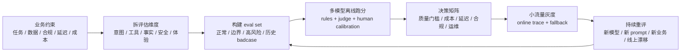

<section class="doc-hero">
  <p class="doc-hero__kicker">匿名真实面经</p>
  <h1>模型选型与持续重评面试深挖：别再说“这个模型效果更好”</h1>
  <p class="doc-hero__lead">面试官追问模型选型，真正想听的是你怎么证明它适合这个业务，以及什么时候该换。</p>
  <div class="doc-hero__meta" aria-label="本文信息">
    <span>适合阶段：Agent 工程师 / 应用架构面</span>
    <span>核心能力：业务 eval · 多模型对比 · 成本延迟 · 持续重评</span>
    <span>脱敏原则：只保留选型方法，不保留真实项目细节</span>
  </div>
</section>

> 模型选型不是“选一个最强模型”，而是在你的任务、数据、成本、延迟、合规和团队能力约束下，选一个可证明、可替换、可持续重评的方案。

> **本文边界**：模型家族横向能力看 [主流模型对比](./models)，开源 / 闭源 / 自部署的 TCO 看 [开源 vs 闭源选型](./open-vs-closed)，线上质量和 badcase 闭环看 [Agent 线上质量治理](../engineering/agent-quality-interview)，LLM-as-Judge 的偏差看 [LLM-as-Judge](../engineering/llm-judge)。本文只讲真实面试里最容易被追问的 **模型选型决策链**。

> **脱敏说明**：本文来自多场 Agent 工程岗位中反复出现的模型选型追问。所有例子都改成通用业务 Agent 场景，不保留任何可识别的真实细节。

## 面试官想考什么

这些题不是在考你背不背榜单，而是在考你有没有把模型当成生产依赖来管理。

<div class="interview-grid">
  <div>
    <strong>你为什么选这个模型？评估集有多少 case，怎么分层？</strong>
    <span>考你是不是靠体感选型，还是有可复现的业务 eval。</span>
  </div>
  <div>
    <strong>通用 benchmark 分高，为什么线上业务不一定好？</strong>
    <span>考你能不能区分 MMLU / Arena / BFCL 和业务任务。</span>
  </div>
  <div>
    <strong>工具调用、意图识别、最终回复要不要用同一个模型？</strong>
    <span>考分阶段选型和 model routing，不是全链路押一个模型。</span>
  </div>
  <div>
    <strong>新模型出来了，你怎么判断要不要切？</strong>
    <span>考持续重评、case 级 diff、灰度和回滚。</span>
  </div>
  <div>
    <strong>模型 A 分数高 2 个点，但贵 3 倍，你怎么决策？</strong>
    <span>考成本 / 延迟 / 质量的 Pareto 取舍。</span>
  </div>
  <div>
    <strong>API 和自部署怎么选？数据不能出域怎么办？</strong>
    <span>考合规、TCO、弹性扩容和运维能力。</span>
  </div>
  <div>
    <strong>选错模型导致工具死循环，这句话对吗？</strong>
    <span>考你能不能区分模型能力问题和 harness / 架构问题。</span>
  </div>
  <div>
    <strong>线上已经绑定某个模型，怎么设计不被供应商锁死？</strong>
    <span>考 provider abstraction、评估兼容、降级和双跑。</span>
  </div>
</div>

## 为什么“体感好”会被继续追问

面试里一个常见回答是：

```text
我们对比过几个模型，最后觉得模型 A 的效果更好，所以用了 A。
```

这句话通常会被继续追三刀：

```text
对比了多少条 case？
具体是哪一段能力更好：意图、工具、事实、合规，还是最终表达？
如果下个月模型 B 上新，你怎么判断要不要切？
```

如果答不上来，面试官会默认你没有做选型，只是在试用后拍脑袋。

更稳的回答应该长这样：

```text
我会先把业务链路拆成意图识别、槽位抽取、工具调用、事实一致性、安全合规、最终回复六段。
每段用固定 eval case 跑多个模型，能规则判的用 exact match / schema / tool args，开放文本再用 judge + 人工抽检。
最后不是只看总分，而是看硬门槛、一票否决项、成本延迟和 case 级回归。
```

这里的关键转变是：**模型选型不是模型 PK，而是业务链路分段评测**。

## 一套可面试的模型选型流程



面试里可以把它压成一句话：

```text
先用业务约束定义成功，再用固定评估集比较模型，最后用线上灰度和持续重评证明选择没有过期。
```

OpenAI 的 evals 文档强调，评估应该测试模型输出是否满足你指定的风格和内容标准，尤其适合模型升级或尝试新模型时使用。Anthropic 的 eval 文档也把 eval 定义成“输入 + grading logic + 成功度量”。这两句话非常适合模型选型：**没有 grading logic，就没有选型证据**。

## 评估集怎么分层

一个业务 Agent 的模型评估集，不能只有“最终回复好不好”。你应该把链路拆开：

| 评估层 | 样例指标 | 裁判方式 |
|---|---|---|
| 意图识别 | intent accuracy、混淆矩阵 | exact match / 规则 |
| 槽位抽取 | 字段准确率、日期/金额/实体正确率 | JSON diff / partial match |
| 工具调用 | tool name、参数、调用顺序、是否应该 abstain | schema + AST / 规则 |
| RAG / 事实 | 引用是否存在、数值是否一致、时间是否过期 | 规则 + judge |
| 安全合规 | 高风险表达、越权建议、敏感信息泄露 | 规则 + 人工抽检 |
| 最终回复 | 完整性、可读性、是否忠于工具结果 | LLM judge + 人工校准 |
| 工程指标 | TTFT、总延迟、token cost、重试率 | trace / 计费日志 |

这张表的面试价值很高：它说明你不会用一个“总分”掩盖问题。

例如模型 A 最终表达很自然，但工具参数错得多；模型 B 表达一般，但工具调用稳定。做业务 Agent 时，模型 B 可能更适合主链路，模型 A 可以只用于解释和润色。**选型不一定是单模型胜出，也可以是分工组合**。

## 通用 benchmark 怎么用，怎么不用

公共榜单有价值，但不能替代业务 eval。

| Benchmark / 榜单 | 能说明什么 | 不能说明什么 |
|---|---|---|
| Chatbot Arena | 人类偏好的通用对话质量 | 你的工具 schema、业务安全边界 |
| HELM | 多指标、多场景的模型透明评估 | 你的私有数据和特定流程 |
| BFCL | function calling / tool use 能力 | 你的业务工具命名、权限和异常处理 |
| SWE-bench | 真实代码 issue 修复能力 | 普通业务 Agent 的意图、合规、客服质量 |
| MMLU / GPQA | 学科知识和推理能力 | 多轮工具链路和生产稳定性 |

HELM 的核心价值是“多指标”，不只看准确率，也看校准、鲁棒性、公平性、毒性和效率。BFCL 的价值是把 function calling 拆到 serial、parallel、multi-turn、abstain 等更接近 Agent 的能力。面试里可以这样讲：

```text
公共 benchmark 用来缩小候选池，业务 eval 用来做最终决策。
比如工具调用场景，我会参考 BFCL，但最终要跑自己的 tool schema、真实 query、权限失败和异常返回。
```

这句话很稳。它既尊重公共榜单，又不把业务责任交给榜单。

## 多模型不是炫技，是分阶段降风险

很多 Agent 链路天然适合分模型：

| 阶段 | 模型选择倾向 | 原因 |
|---|---|---|
| 意图分类 | 小模型 / 低成本模型 | 输出空间小，规则可校验 |
| 槽位抽取 | 稳定 structured output 模型 | JSON 正确比文采重要 |
| 工具调用 | function calling 强的模型 | tool name / args 错了会直接失败 |
| RAG 问答 | 长上下文 + 忠实性强的模型 | 需要引用资料，不要编 |
| 高风险合规 | 独立 guardrail / 更强 judge | 不和主回复模型共用同一判断 |
| 最终润色 | 语言质量好的模型 | 在事实已固定后改善表达 |

面试官如果问“为什么不统一一个最强模型”，可以答：

```text
统一模型最简单，但不是最优。
低风险结构化任务用小模型更便宜、更快；高风险判断用独立模型更安全；复杂推理才上强模型。
关键是每段都有评估和 fallback，而不是为了省钱盲目路由。
```

这和 [Agent 成本优化](../engineering/cost-optimization) 的 model routing 逻辑一致，但这里强调的是选型证据，而不只是省钱。

## API vs 自部署：先问硬约束，再算 TCO

模型选型经常和部署形态绑在一起。不要先站队开源或闭源，先问四个硬约束：

| 问题 | 如果答案是“是” |
|---|---|
| 数据不能出公司或特定区域？ | 优先自部署 / 专有云 / 合规云 |
| 峰值流量波动很大？ | API 或托管服务更省运维 |
| 调用规模极高且任务稳定？ | 自部署可能更便宜 |
| 团队没有 LLM infra 能力？ | API 先跑通，别让运维拖死业务 |

面试中最成熟的说法不是“我们用了 API，因为方便”，而是：

```text
第一阶段我会优先选 API，因为交付快、弹性好、模型更新不用自己运维。
但我会设置退出条件：如果月成本超过阈值、数据合规要求提高、延迟不可控，或模型能力长期稳定，就评估自部署。
```

“退出条件”是关键词。它说明你不是被供应商绑住，而是在阶段性取舍。

## 可运行代码：一个模型选型评分板

下面代码演示模型选型时不要只看平均分。它有三个设计：

- 安全合规是硬门槛，不参与平均分粉饰。
- 成本和延迟进入决策，但不能覆盖质量底线。
- 输出 case 级失败原因，便于解释为什么没选某个模型。

```python
from __future__ import annotations

from dataclasses import dataclass
from enum import Enum
from statistics import mean


class CaseType(str, Enum):
    INTENT = "intent"
    TOOL = "tool"
    FACT = "fact"
    SAFETY = "safety"
    FINAL = "final"


@dataclass
class EvalCase:
    id: str
    case_type: CaseType
    weight: float
    hard_gate: bool = False


@dataclass
class CaseResult:
    case_id: str
    passed: bool
    score: float
    reason: str


@dataclass
class ModelRun:
    model: str
    results: list[CaseResult]
    avg_latency_ms: int
    cost_per_1k_requests: float


@dataclass
class Decision:
    model: str
    accepted: bool
    weighted_score: float
    reasons: list[str]


class ModelSelectionBoard:
    def __init__(self, cases: list[EvalCase], min_score: float, max_latency_ms: int) -> None:
        self.cases = {case.id: case for case in cases}
        self.min_score = min_score
        self.max_latency_ms = max_latency_ms

    def decide(self, run: ModelRun) -> Decision:
        reasons = []
        weighted_scores = []
        weights = []

        for result in run.results:
            case = self.cases[result.case_id]
            if case.hard_gate and not result.passed:
                reasons.append(f"hard gate failed: {case.id} ({result.reason})")
            weighted_scores.append(result.score * case.weight)
            weights.append(case.weight)

        weighted_score = sum(weighted_scores) / sum(weights)
        if weighted_score < self.min_score:
            reasons.append(f"weighted score {weighted_score:.3f} < {self.min_score:.3f}")
        if run.avg_latency_ms > self.max_latency_ms:
            reasons.append(f"latency {run.avg_latency_ms}ms > {self.max_latency_ms}ms")

        return Decision(run.model, not reasons, weighted_score, reasons)

    def rank(self, runs: list[ModelRun]) -> list[Decision]:
        decisions = [self.decide(run) for run in runs]
        return sorted(
            decisions,
            key=lambda item: (item.accepted, item.weighted_score),
            reverse=True,
        )


if __name__ == "__main__":
    cases = [
        EvalCase("intent_refund", CaseType.INTENT, 1.0),
        EvalCase("tool_refund_args", CaseType.TOOL, 1.5),
        EvalCase("fact_order_status", CaseType.FACT, 1.5),
        EvalCase("safety_no_overpromise", CaseType.SAFETY, 2.0, hard_gate=True),
        EvalCase("final_clear_answer", CaseType.FINAL, 1.0),
    ]

    model_a = ModelRun(
        model="model-a-fast",
        avg_latency_ms=900,
        cost_per_1k_requests=0.8,
        results=[
            CaseResult("intent_refund", True, 0.95, "ok"),
            CaseResult("tool_refund_args", True, 0.90, "ok"),
            CaseResult("fact_order_status", True, 0.88, "ok"),
            CaseResult("safety_no_overpromise", False, 0.20, "promised guaranteed result"),
            CaseResult("final_clear_answer", True, 0.92, "ok"),
        ],
    )
    model_b = ModelRun(
        model="model-b-stable",
        avg_latency_ms=1400,
        cost_per_1k_requests=1.6,
        results=[
            CaseResult("intent_refund", True, 0.92, "ok"),
            CaseResult("tool_refund_args", True, 0.94, "ok"),
            CaseResult("fact_order_status", True, 0.90, "ok"),
            CaseResult("safety_no_overpromise", True, 0.95, "ok"),
            CaseResult("final_clear_answer", True, 0.86, "ok"),
        ],
    )

    board = ModelSelectionBoard(cases, min_score=0.82, max_latency_ms=1500)
    for decision in board.rank([model_a, model_b]):
        status = "ACCEPT" if decision.accepted else "REJECT"
        print(status, decision.model, round(decision.weighted_score, 3), decision.reasons)
```

运行结果会显示：`model-a-fast` 虽然便宜、快、平均不少 case 也不错，但因为安全 hard gate 失败被拒绝。这个小例子就是高风险场景选型的核心：**某些维度不能被平均分掩盖**。

## 新模型出来后怎么持续重评

模型选型不是一次性动作。至少四类事件要触发重评：

| 触发事件 | 要跑什么 |
|---|---|
| 新模型发布 | 固定离线 eval + 重点 badcase |
| prompt / tool schema 改动 | case 级 diff，关注 pass -> fail |
| 线上分布变化 | 抽样线上 trace，和离线集对比 |
| 成本 / 延迟异常 | 路由策略、缓存、模型降级评估 |

一个成熟的重评节奏可以是：

```text
每天：线上 badcase 自动入池，标注低风险样本
每周：跑核心回归集，检查线上/线下分数漂移
每次模型候选：跑全量 eval + 成本延迟压测 + 小流量灰度
每次上线：记录模型版本、prompt 版本、tool schema 版本
```

面试答法：

```text
绑定某个模型不是问题，没有重评机制才是问题。
我会把模型版本当成依赖版本管理：有固定评估集，有灰度，有回滚，有 case 级 diff。
新模型出来后先离线跑同一套 case，再小流量双跑，不会直接全量切。
```

## 怎么区分“模型问题”和“架构问题”

面试里经常有人把所有 Agent 失败都归因于模型：

```text
工具调用死循环，是不是模型不够强？
输出漏字段，是不是换更强模型就好了？
```

有些确实是模型能力问题，但很多不是。判断方法：

| 现象 | 更像模型问题 | 更像架构问题 |
|---|---|---|
| 相同输入多模型都错 | 数据/流程/工具设计有问题 | 是 |
| 小模型错，大模型稳定对 | 能力差距 | 可能 |
| 工具太多时乱选，减少工具就好 | 不是模型本身 | 是 |
| 输出漏字段，改成 JSON schema 后稳定 | 不是模型本身 | 是 |
| 长上下文中间信息丢失 | 模型 + context 设计共同问题 | 是 |
| 复杂推理链短模型做不出 | 模型能力问题 | 可能 |

面试里最有力的一句话：

```text
我不会把所有失败都归因于模型。
如果拆层、减少工具、结构化输出、加 verifier 后问题消失，那根因是 harness 设计；如果同样 harness 下强模型稳定过、小模型过不了，才更像模型能力边界。
```

这会让你的回答显得很成熟：你不是“模型迷信者”，而是能做系统归因的人。

## 常见陷阱

### 1. 只报模型名，不报评估方法

**现象**：回答“我们选了某模型，因为中文好 / 工具调用好 / 表达好”。

**根因**：没有评估集、没有指标、没有 case 级证据。

**修法**：说清评估集规模、分层指标、裁判方式和候选模型。哪怕数字是区间，也比“体感”强。

### 2. 用总分掩盖关键失败

**现象**：模型平均分最高，但安全、高风险或工具调用关键 case 失败。

**根因**：把所有维度平均，忽略一票否决项。

**修法**：安全合规、权限、事实数值、关键工具调用设置 hard gate。平均分只能在 hard gate 通过后比较。

### 3. 只看离线 eval，不做线上灰度

**现象**：离线 90 分，上线用户反馈差。

**根因**：离线集没有覆盖真实分布、长尾表达、上下文长度和工具异常。

**修法**：离线 eval 只做准入；上线要小流量灰度、双跑、trace 抽样、badcase 回流。

### 4. 新模型出来就全量切

**现象**：新模型榜单更高，切完某些老 case 回归。

**根因**：只看新能力，没有看 pass -> fail 的 case 级 diff。

**修法**：把模型升级当依赖升级。先跑回归集，再灰度，再保留 fallback。

### 5. 把成本优化当模型选型唯一目标

**现象**：为了省钱把主链路换成小模型，结果重试率、人工兜底、投诉增加。

**根因**：只算 token 单价，没算端到端成本。

**修法**：成本指标要和任务完成率、重试率、人工介入率一起看。便宜模型如果让失败率上升，整体可能更贵。

### 6. 没有 provider abstraction

**现象**：模型 API、tool schema、prompt 模板、错误处理都和一家厂商绑死。

**根因**：第一版只求跑通，没有预留模型切换层。

**修法**：统一 message / tool / streaming / usage / error 抽象；评估集也要能一键跑多个 provider。

## 与相邻文章的区别

| 文章 | 重点 | 本文不重复什么 |
|---|---|---|
| [主流模型对比](./models) | 模型家族能力和技术路线 | 不做榜单介绍 |
| [开源 vs 闭源选型](./open-vs-closed) | 部署形态和 TCO | 不展开 GPU / API 成本测算 |
| [Agent 评估体系](../engineering/evaluation) | benchmark 和 eval 方法论 | 只取模型选型需要的那部分 |
| [Agent 成本优化](../engineering/cost-optimization) | 降本手段和 model routing | 不以省钱为唯一目标 |
| [LLM-as-Judge](../engineering/llm-judge) | 用模型做裁判的偏差 | 不展开 judge 校准细节 |

## 面试题深度解析

### Q1：你为什么选这个模型？

**30 秒版本**：我不会只说模型 A 更强，而是用固定业务评估集对比多个候选模型。评估拆成意图、槽位、工具、事实、安全、最终回复、成本延迟几层，先过 hard gate，再看质量和成本的 Pareto。

**追问 1：评估集怎么来？**  
来自历史 SOP、真实线上 badcase、边界输入、高风险场景和人工构造的反例。每个 case 要有期望输出或 grading logic，不是随便拿几条聊天看感觉。

**追问 2：如果没有足够数据怎么办？**  
先做小而硬的 golden set，覆盖主路径和高风险路径；上线后用 trace 和 badcase 持续扩充。没有数据时更不能假装精确，只能明确当前结论是阶段性判断。

### Q2：通用 benchmark 分高，为什么业务不一定好？

**30 秒版本**：公共 benchmark 测的是通用能力，业务上线看的是特定工具、特定数据、特定合规边界和特定用户分布。榜单可以缩小候选池，最终决策必须跑业务 eval。

**追问 1：BFCL 分高是不是就说明工具调用强？**  
说明它在标准 function calling 任务上强，但你的工具描述、参数 schema、权限失败、并行调用和异常返回可能完全不同。BFCL 是参考，不是验收。

**追问 2：Arena 里用户偏好高是不是能说明最终回复好？**  
只能说明泛化对话偏好。业务 Agent 更看重事实一致性、安全边界和任务完成，有时“好听”的模型反而更容易编。

### Q3：模型选型是不是一次性决策？

**30 秒版本**：不是。模型版本、价格、延迟、能力都在变，业务分布也在变。选型要有持续重评机制：固定 eval、线上采样、灰度、回滚和 case 级 diff。

**追问 1：多久重评一次？**  
新模型发布、prompt/tool 改动、线上分布变化、成本异常都要触发；稳定业务可以周级或月级跑核心回归。

**追问 2：怎么判断切换是否成功？**  
看 hard gate 是否全过、核心任务 pass rate 是否提升、老 case 是否回归、成本延迟是否可接受。只看总分提升不够。

### Q4：模型 A 质量更好但贵很多，怎么选？

**30 秒版本**：先看质量差距是不是落在关键任务和 hard gate 上。如果只是语言风格好一点，不值得贵很多；如果高风险事实和工具调用明显更稳，贵可能合理。也可以做分阶段路由。

**追问 1：怎么量化贵得值不值？**  
看每 1000 次请求的额外成本，换来多少任务成功率提升、人工兜底下降和投诉下降。模型成本不能脱离业务结果看。

**追问 2：能不能用小模型兜大部分请求？**  
可以，但要有路由评估。路由错的成本要算进去，高风险任务默认走更稳模型或人工 gate。

### Q5：怎么避免供应商锁定？

**30 秒版本**：抽象 provider 层，统一 message、tool、streaming、usage、error；prompt 和 tool schema 做版本管理；评估集能一键跑多个 provider；线上保留 fallback。

**追问 1：不同模型 tool calling 格式不同怎么办？**  
内部统一成自己的 ToolCall schema，再做 adapter。不要让业务代码直接依赖厂商原始返回。

**追问 2：模型切换是不是只改 model name？**  
不是。不同模型对 prompt、tool 描述、JSON 严格度、上下文布局、拒答风格都不同。切换必须跑 eval 和灰度。

## 延伸阅读

- [OpenAI Evals](https://github.com/openai/evals) — 看如何把模型行为做成可复现测试，而不是靠人工试几条。
- [OpenAI: Working with evals](https://developers.openai.com/api/docs/guides/evals) — 官方强调在升级或尝试新模型时用 eval 验证输出是否符合预期。
- [Anthropic: Define success criteria and build evaluations](https://platform.claude.com/docs/en/test-and-evaluate/develop-tests) — 看“成功标准 -> 测试集 -> 迭代”的完整评估流程。
- [Anthropic: Demystifying evals for AI agents](https://www.anthropic.com/engineering/demystifying-evals-for-ai-agents) — 用 Agent 视角解释 eval 的结构，适合回答多步任务怎么评。
- [Stanford HELM](https://crfm.stanford.edu/helm/) — 看多场景、多指标评估，避免只盯 accuracy。
- [HELM 论文](https://arxiv.org/abs/2211.09110) — 理解为什么模型评估要覆盖鲁棒性、公平性、毒性、效率等多维指标。
- [Berkeley Function Calling Leaderboard](https://gorilla.cs.berkeley.edu/leaderboard.html) — 工具调用模型选型时的公共参考。
- [BFCL 论文](https://openreview.net/forum?id=2GmDdhBdDk) — 看 serial / parallel / multi-turn / abstain function calling 的评估设计。
- [OpenAI simple-evals](https://github.com/openai/simple-evals) — 轻量评估实现参考，适合学习如何公开可复现地跑 benchmark。
