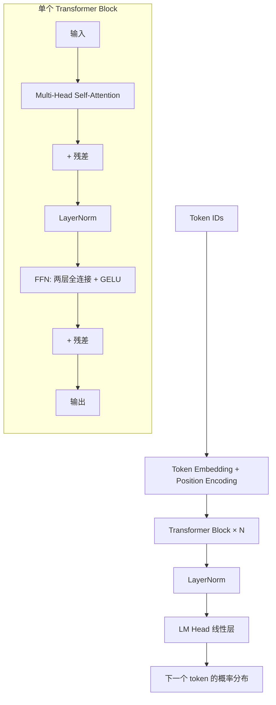

<section class="doc-hero">
  <p class="doc-hero__kicker">大模型基础</p>
  <h1>Transformer 架构</h1>
  <p class="doc-hero__lead">用 attention 取代递归与卷积的序列建模架构，是当下所有主流 LLM 的共同底座。</p>
  <div class="doc-hero__meta" aria-label="本文信息">
    <span>适合阶段：LLM 入门必读</span>
    <span>核心链路：Attention / Multi-Head / 位置编码 / Decoder-only</span>
    <span>面试重点：原理细节 + 架构演化判断</span>
  </div>
</section>

## 面试官想考什么

读完这篇你要能正面回答下面这些题。每题后面括号里是面试官真正想看你答出什么。

<div class="interview-grid">
  <div>
    <strong>Transformer 取代 RNN/LSTM 凭的是什么？只是因为效果好吗？</strong>
    <span>考你对训练并行性的理解——这是 RNN 真正死亡的原因，不是效果。</span>
  </div>
  <div>
    <strong>self-attention 的 Q/K/V 各自是什么角色？为什么必须分成三个矩阵？</strong>
    <span>考底层机制，能不能讲清楚"查询-键-值"的语义。</span>
  </div>
  <div>
    <strong>attention 公式里为什么要除以 √d_k？不除会怎样？</strong>
    <span>考数值稳定性细节，没读过论文的人答不上来。</span>
  </div>
  <div>
    <strong>multi-head attention 为什么比 single-head 好？为什么不直接用一个大 head？</strong>
    <span>考表征学习的直觉。</span>
  </div>
  <div>
    <strong>位置编码为什么必要？sin/cos、可学习编码、RoPE 三种各自的动机？</strong>
    <span>RoPE 是当前 LLM 标配，不懂会暴露知识更新滞后。</span>
  </div>
  <div>
    <strong>GPT 用 decoder-only，T5 用 encoder-decoder，为什么最后是 decoder-only 赢了？</strong>
    <span>考架构演化判断力。</span>
  </div>
  <div>
    <strong>KV Cache 是什么？为什么 decoder 推理时能用、训练时不能用？</strong>
    <span>考推理工程，连接到推理优化章节。</span>
  </div>
  <div>
    <strong>attention 的 O(n²) 复杂度问题，业界有哪些缓解方案？</strong>
    <span>考前沿了解，FlashAttention / 稀疏 attention / 线性 attention。</span>
  </div>
</div>

---

## 为什么需要 Transformer

2017 年之前，序列建模的统治者是 RNN/LSTM。它们有两个致命问题：

**问题 1：训练无法并行。** RNN 的隐状态 `h_t = f(h_{t-1}, x_t)`——必须等上一步算完才能算下一步。一个 1000 token 的序列要串行算 1000 次。GPU 有 10000+ 个核心，但 RNN 一次只能用上 1 个。这在小数据时代不致命，大数据时代就要命。

**问题 2：长距离依赖丢失。** 信息要从第 1 个 token 传到第 1000 个 token，要经过 999 次"信号衰减"。LSTM 的 gate 缓解了这个问题但没根治。一段话开头说"小明拿着伞"，末尾问"他拿的是什么"，模型可能就忘了。

Vaswani 等人 2017 年的论文 *Attention Is All You Need* ([arxiv 1706.03762](https://arxiv.org/abs/1706.03762)) 给的解法很激进：**把 RNN 完全扔掉，只用 attention**。

这样做的两个好处：
- **训练完全并行**：序列里每个 token 同时计算，GPU 利用率拉满
- **任意两个 token 的距离都是 1**：第 1 个和第 1000 个 token 直接做 attention，没有衰减

代价是 attention 本身是 O(n²) 的——序列翻倍，计算量四倍。但 2017 年 GPU 算力增长比序列长度增长快得多，这个 trade-off 划得来。

---

## Transformer 是怎么工作的

原始论文是 encoder-decoder 结构（机器翻译任务），但今天主流 LLM 都简化成了 decoder-only。两者核心组件一致：



每个 block 做两件事：
1. **Self-Attention**：让每个 token 看到其他所有 token，决定从谁那里"借"信息
2. **FFN**：对每个位置独立做非线性变换，加深表征

外加两个工程必需品：**残差连接**（让梯度能传到底层）+ **LayerNorm**（稳定训练）。这两个不是 Transformer 独有的，但缺了就训不起来。

---

## 核心原理

### Self-Attention：Q/K/V 的本质

每个 token 同时扮演三个角色：

| 角色 | 含义 | 类比 |
|---|---|---|
| **Query (Q)** | 我想找什么样的信息？ | "我是动词，想知道我的主语是谁" |
| **Key (K)** | 我能提供什么信息？ | "我是名词，可以当主语" |
| **Value (V)** | 我实际传递的内容 | 真正被传过去的语义向量 |

匹配机制：每个 Q 和所有 K 计算相似度（点积），归一化成权重，再去加权求和所有的 V。

公式：

```
Attention(Q, K, V) = softmax(Q K^T / √d_k) V
```

实现：

```python
import torch
import torch.nn.functional as F

def self_attention(x, W_q, W_k, W_v):
    """
    x: (batch, seq_len, d_model)
    返回 (batch, seq_len, d_model)
    """
    Q = x @ W_q              # 每个 token 产生一个 query
    K = x @ W_k              # 每个 token 产生一个 key
    V = x @ W_v              # 每个 token 产生一个 value

    d_k = Q.size(-1)
    scores = Q @ K.transpose(-2, -1) / (d_k ** 0.5)   # 缩放点积
    weights = F.softmax(scores, dim=-1)               # 注意力权重
    return weights @ V
```

**关键设计 1：为什么 Q、K、V 要分三个矩阵？**

如果用同一个向量同时当 Q 和 K，那 token 自己和自己的相似度永远最高，模型只会关注自己。分开之后，Q 和 K 在不同的子空间里——一个 token 可以"作为查询"想找别人，"作为键"被别人找到，这两件事互不影响。

**关键设计 2：为什么除以 √d_k？**

当 d_k 很大时（比如 64），Q·K 的点积值方差也变大（量级是 d_k）。直接送进 softmax，softmax 会饱和——最大值被推到接近 1，其他都接近 0，梯度消失。除以 √d_k 把方差归一化到 1，让 softmax 输出温和的分布，梯度才能正常回传。这是 *Attention Is All You Need* 论文 3.2.1 节明确指出的细节。

### Multi-Head Attention

把 Q/K/V 切成 h 个小头，每个头独立做 attention，最后拼起来：

```python
def multi_head_attention(x, W_q, W_k, W_v, W_o, num_heads=8):
    batch, seq_len, d_model = x.shape
    d_head = d_model // num_heads

    # 一次性算完所有 head 的 Q/K/V，再 reshape 成多头
    Q = (x @ W_q).view(batch, seq_len, num_heads, d_head).transpose(1, 2)
    K = (x @ W_k).view(batch, seq_len, num_heads, d_head).transpose(1, 2)
    V = (x @ W_v).view(batch, seq_len, num_heads, d_head).transpose(1, 2)

    scores = Q @ K.transpose(-2, -1) / (d_head ** 0.5)
    weights = F.softmax(scores, dim=-1)
    out = weights @ V                                    # (batch, heads, seq, d_head)
    out = out.transpose(1, 2).reshape(batch, seq_len, d_model)
    return out @ W_o
```

**为什么 multi-head 比 single-head 好？**

单个 head 的 attention 输出是 V 的加权平均——本质上是"线性混合"。不同的 head 可以学到不同的关注模式：一个 head 学语法依赖、一个 head 学指代关系、一个 head 学位置邻近。**多头不是为了增加参数量，是为了让模型在不同表征子空间里同时关注不同信息。** 总参数量和 single-head 大致一样（每个头维度变小了）。

### 位置编码：让 attention "看见"顺序

self-attention 本身是位置无关的——打乱 token 顺序输出不变。必须额外给每个位置一个"位置信号"。

三代演进：

**1. Sinusoidal（原论文）**：用不同频率的 sin/cos 函数生成位置编码，直接加到 embedding 上。
```
PE(pos, 2i)   = sin(pos / 10000^(2i/d))
PE(pos, 2i+1) = cos(pos / 10000^(2i/d))
```
优点：能外推到训练时没见过的更长序列。缺点：表达能力有限。

**2. Learned Positional Embedding（BERT/GPT-2）**：直接学一个 `[max_len, d_model]` 的查找表。
优点：表达灵活。缺点：超过 max_len 完全不能用。

**3. RoPE（Rotary Position Embedding，Su et al. 2021）**：当前 LLM 标配（Llama、Qwen、DeepSeek 都用）。
核心 idea：不加位置向量，而是**把 Q 和 K 在复平面上按位置旋转一个角度**。两个 token 做点积时，相对位置自然以"旋转角度差"的形式编码进去。
优点：相对位置感知 + 外推性好 + 不破坏 attention 计算。

RoPE 数学推导有点绕，但工程结论很简洁——在 attention 计算之前给 Q 和 K 做一次"旋转"操作即可。Llama 的实现只有几十行代码。

### Decoder-only：今天 LLM 的标配

原论文用 encoder-decoder（编码源句子，解码目标句子），适合翻译。但 GPT 系列证明了：

**对于"下一个 token 预测"这一个目标，decoder-only 就够了。** 把训练数据全当成"无条件生成"——比如文档前半段当成 prompt，后半段当成目标，让模型一路预测下去。这种"自回归"训练范式简单、可无限扩展，是 scaling law 起作用的前提。

Decoder-only 的关键约束：**causal mask**——计算 attention 时屏蔽掉"未来位置"，让第 t 个 token 只能看到 1..t 的信息。这样每个位置的预测都只用左侧上下文，符合自回归的因果性。

```python
# Causal mask 实现
seq_len = 1024
mask = torch.triu(torch.ones(seq_len, seq_len), diagonal=1).bool()
scores = scores.masked_fill(mask, float('-inf'))   # 上三角填 -inf
weights = F.softmax(scores, dim=-1)                # softmax 后上三角变 0
```

---

## 常见陷阱

### 陷阱 1：以为参数量越大效果越好

Transformer 的 scaling law（Kaplan et al. 2020, Hoffmann et al. 2022 Chinchilla）告诉我们：**模型大小、数据量、计算量三者要按比例 scale**。Chinchilla 论文里实测：一个 70B 模型用 1.4T token 训练，比一个 280B 模型用 300B token 训练效果好。早期 GPT-3（175B）是严重欠训练的。

### 陷阱 2：以为 attention 是 O(n²) 就一定慢

朴素实现确实 O(n²) 时间 + O(n²) 显存。**但实际瓶颈是显存带宽，不是计算量**。FlashAttention (Dao 2022) 通过 tile + 重算技巧把显存读写减少 10 倍，速度反而比传统实现快 2-4 倍。详见 [推理优化](./inference-optimization)。

### 陷阱 3：误以为 LayerNorm 位置不重要

原论文是 Post-LN（attention/FFN 之后做 norm），训练时需要 warmup 否则不收敛。后来 GPT-2 改成 Pre-LN（attention/FFN 之前做 norm），训练稳定多了。今天所有大模型都用 Pre-LN。这个细节论文里只占半句话，但训不起来的人 90% 死在这。

### 陷阱 4：以为 KV Cache 是"加速技巧"

KV Cache 不是优化，是**正确性的必然结果**。decoder 推理时第 t 步算 attention 需要前 t-1 步的 K 和 V，这些值在前面已经算过且不会变——缓存它们只是避免重复计算。不用 KV Cache 的话，生成 1000 token 要做 1000² 次 attention 计算，慢到不能用。但 KV Cache 也是显存大户，长上下文场景 KV Cache 比模型权重还占地方。

---

## Decoder-only vs Encoder-Decoder vs Encoder-only

| 架构 | 代表模型 | 适用任务 | 现状 |
|---|---|---|---|
| **Encoder-only** | BERT、RoBERTa | 理解类（分类、NER、句子相似度） | 仍是 embedding/小模型主力 |
| **Encoder-Decoder** | T5、BART、原始 Transformer | 翻译、摘要等输入-输出任务 | 被 decoder-only 蚕食，渐少 |
| **Decoder-only** | GPT、Claude、Llama、Qwen 全家桶 | 生成、对话、指令跟随 | 当前 LLM 绝对主流 |

**为什么 decoder-only 赢了？**

1. **训练目标统一**：所有任务都是"next token prediction"，不需要为不同任务设计不同 head
2. **数据利用率高**：encoder-decoder 要求成对的 (input, output) 数据，decoder-only 可以用任何文本
3. **In-context learning 涌现**：decoder-only + 大规模数据训练时，自然涌现 few-shot learning 能力
4. **推理简单**：只有一个 stack，KV Cache 实现直接

Encoder-only 没完全消亡——它在"理解为主、不需生成"的场景（如 embedding 模型 BGE、E5）仍是首选，因为双向 attention 让每个 token 都能看到全部上下文。

---

## 面试题深度解析

### Q: Transformer 取代 RNN 凭的是什么？

**30 秒版本**：核心不是效果，是**训练并行性**。RNN 的串行依赖让 GPU 利用率长期个位数，attention 让所有 token 并行计算，GPU 利用率直接拉满。在 2017 年算力大幅提升的背景下，这一个优势就足以决定胜负——并行训练 100 倍快，意味着同样时间内可以训更大的模型、用更多的数据。效果优势是结果，不是原因。

**追问 1**：那 RNN 是不是彻底没用了？
不是。在 token 数极少、需要严格因果建模的场景（比如语音流式识别、低延迟时序预测），RNN 仍有用武之地。另外 Mamba (Gu & Dao 2023) 等状态空间模型本质上是"用现代手段重新设计的 RNN"，2024 年后有抬头趋势，未来可能在长序列场景挑战 Transformer。

**追问 2**：attention 一定比 RNN 强吗？
不一定。attention 的 O(n²) 复杂度在超长序列时是硬伤。支持百万级上下文的模型，本质上都在做"如何让 attention 变线性"的工程妥协。RNN 的 O(n) 复杂度在这个赛道是天然优势——这也是 Mamba 重新流行的原因。

### Q: 为什么除以 √d_k？不除会怎样？

**30 秒版本**：当 d_k 大时（如 64），Q·K 的点积值方差也大（量级 d_k）。softmax 对输入幅度极敏感——大值进入会让输出退化成 one-hot（最大值接近 1、其他接近 0），梯度几乎全是 0，反向传播传不回来。除以 √d_k 把方差归一化到 1，softmax 输出温和分布，梯度才正常。

**追问**：那如果我用 BatchNorm 或者其他方式归一化，可不可以？
理论上可以但实操上不行。BatchNorm 依赖 batch 统计量，在序列长度不一时不稳定；LayerNorm 已经在 block 入口用过了，再在 attention 内部用一次反而破坏 attention 计算的语义。"除以 √d_k" 是一个无参数、零成本、对每个位置独立的归一化——工程上最优雅。

### Q: 为什么 decoder-only 赢了？

**30 秒版本**：四个原因：(1) 训练目标统一（只做 next token prediction，不需要为不同任务设计 head）；(2) 数据利用率高（不需要成对数据）；(3) 在大规模训练下涌现 in-context learning 能力；(4) 推理简单，KV Cache 容易实现。本质上是"简单架构 + 海量数据 + scaling law"的胜利。

**追问 1**：那为什么 BERT 当年也是这条路，没赢？
BERT 是 encoder-only + masked language model，训练目标是"还原被 mask 的词"，不是"预测下一个词"。这个目标不能自然延伸到生成任务，所以 BERT 永远做不了对话/创作。GPT 选 next token prediction 是关键的远见——这个目标同时覆盖理解和生成。

**追问 2**：T5 把所有任务统一成 text-to-text 也很优雅，为什么也输了？
T5 在 NLP 学术圈很受欢迎，但在工业落地时输给了 GPT 路线，原因是 T5 的 encoder-decoder 推理时要跑两遍模型（先编码 prompt 再解码生成），延迟和成本都高于 decoder-only。在大规模商业应用里，工程简洁性的权重远高于学术优雅性。

### Q: KV Cache 训练时为什么不能用？

**30 秒版本**：训练时每个 batch 的输入 token 序列是已知且固定的——一次 forward 就把所有位置的 K/V 算完了，没有"缓存"的概念。推理时不一样：每生成一个新 token，序列就长 1，新 token 的 K/V 需要算，但前面所有 token 的 K/V 已经在上一步算过且不会变。所以缓存它们能避免重复计算 n² 次 attention。

**追问**：KV Cache 的显存占用怎么算？
公式：`2 (K+V) × num_layers × num_heads × head_dim × seq_len × batch_size × dtype_bytes`。以 Llama-7B 为例（32 层、32 头、128 dim、fp16）：每个 token 在 KV Cache 里占 `2 × 32 × 32 × 128 × 2 = 524 KB`。1000 token 的序列就是 512 MB，比模型权重（13 GB）小但也不可忽视。长上下文（百万 token）的 KV Cache 能膨胀到几百 GB，这就是为什么需要 PagedAttention、KV Cache 量化等优化。

---

## 延伸阅读

- **论文：Attention Is All You Need** ([arxiv 1706.03762](https://arxiv.org/abs/1706.03762))
  Vaswani et al. 2017，原始论文。读它是为了看清"为什么这样设计"——很多被后人当成常识的细节（√d_k、multi-head、残差），论文里都给了简短但关键的动机说明。

- **博客：The Illustrated Transformer** ([jalammar.github.io/illustrated-transformer](https://jalammar.github.io/illustrated-transformer/))
  Jay Alammar 的可视化解释，至今仍是入门最佳读物。读它是为了对 Q/K/V 的矩阵流动有图形化的直觉。

- **代码：minGPT** ([github.com/karpathy/minGPT](https://github.com/karpathy/minGPT))
  Karpathy 的极简 GPT 实现，300 行 PyTorch。读它是为了把论文公式映射到真实代码。配合他的 YouTube 视频 *Let's build GPT from scratch* 食用最佳。

- **论文：RoFormer (RoPE)** ([arxiv 2104.09864](https://arxiv.org/abs/2104.09864))
  Su et al. 2021。读它是为了理解为什么现代 LLM 都用 RoPE——它的"用旋转编码相对位置"的 idea 是过去几年位置编码最重要的进展。

- **论文：FlashAttention** ([arxiv 2205.14135](https://arxiv.org/abs/2205.14135))
  Dao et al. 2022。读它是为了理解"attention 慢的真正原因是显存带宽，不是计算量"——这个 insight 改变了所有人对 attention 优化的认知。
