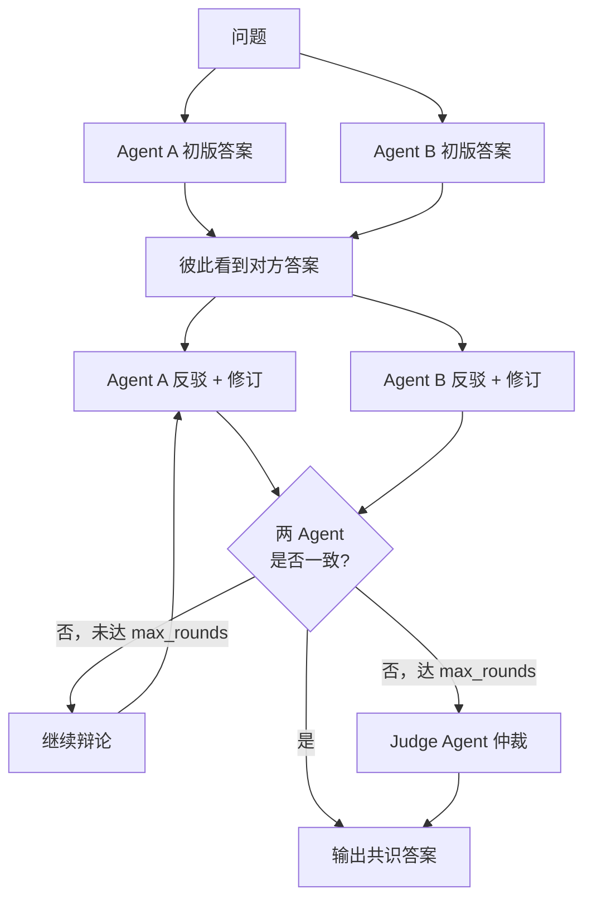
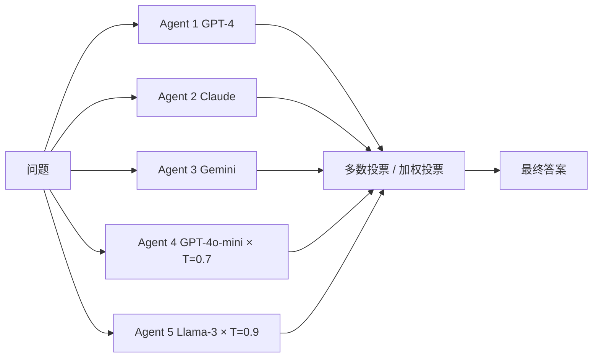
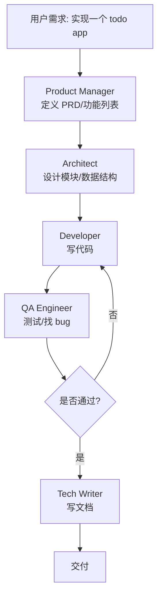
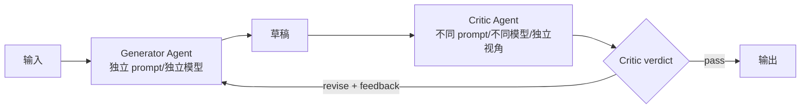

<section class="doc-hero">
  <p class="doc-hero__kicker">多 Agent 协作</p>
  <h1>Agent 协作策略 Debate / Voting / Role-Play / Reviewer</h1>
  <p class="doc-hero__lead">单 Agent 容易钻牛角尖、自信且错误。四种协作模式让多个 Agent 互相质疑、投票、分工、审查——比单 Agent 的 self-refine 更客观，比 self-consistency 多了"分歧建模"的能力。</p>
  <div class="doc-hero__meta" aria-label="本文信息">
    <span>适合阶段：多 Agent 进阶 / 生产架构选型</span>
    <span>核心：四种正交协作模式 + 成本与收敛性权衡</span>
    <span>面试重点：场景匹配 + 不收敛兜底 + 与单 Agent 反思的区别</span>
  </div>
</section>

> **本文边界**：聚焦 **"多个 Agent 之间怎么协作"这一层方法论**——debate / voting / role-play / reviewer 四种正交模式。整体架构分类（中心化 / 去中心化 / hierarchical）见 [Agent 协作模式总览](./patterns)；中心化的 Orchestrator-Worker 架构见 [Orchestrator 与 Worker 模式](./orchestrator-worker)；具体框架实现（MetaGPT、ChatDev）见 [MetaGPT 与 ChatDev](./metagpt-chatdev)；单 Agent 自我反思见 [Reflexion](../agent/reflexion) 和 [Self-Consistency 与 Self-Refine](../prompt/self-consistency)；judge 角色的方法论见 [LLM-as-Judge](../engineering/llm-judge)。

## 面试官想考什么

读完这篇你要能正面回答下面这些题。每题后面括号里是面试官真正想看你答出什么。

<div class="interview-grid">
  <div>
    <strong>Debate / Voting / Role-Play / Reviewer 四种模式各适合什么场景？</strong>
    <span>考你能不能按"任务类型 × 答案空间 × 成本预算"做匹配，而不是堆术语。</span>
  </div>
  <div>
    <strong>多 Agent debate 一直不收敛（两个 Agent 互相杠）怎么办？</strong>
    <span>考你知不知道 max_rounds、judge 兜底、温度退火这些工程兜底策略。</span>
  </div>
  <div>
    <strong>Reviewer 模式和 Self-Refine 的区别在哪？为什么前者更客观？</strong>
    <span>考能不能讲清"独立 Agent 视角"和"同一模型自审"的本质差别。</span>
  </div>
  <div>
    <strong>投票时 N 个 Agent 该用同模型还是不同模型？</strong>
    <span>考对 ensemble diversity 的理解——同模型只是降方差，跨模型才能降偏差。</span>
  </div>
  <div>
    <strong>Role-Play 的角色边界怎么定义？怎么防止角色"穿帮"互相干涉？</strong>
    <span>考 prompt 设计、消息隔离、责任边界的工程经验。</span>
  </div>
  <div>
    <strong>多 Agent debate 真的能比 self-consistency 更好吗？提升来自哪？</strong>
    <span>考你读没读过 Du et al. 2023，能不能讲清"分歧暴露错误"这个机制。</span>
  </div>
  <div>
    <strong>协作 N 个 Agent，成本是单 Agent 的 N 倍——怎么控制？</strong>
    <span>考成本意识：早停、分层、cache、便宜模型当陪练等。</span>
  </div>
  <div>
    <strong>RLAIF / Constitutional AI pipeline 里 reviewer 角色起到什么作用？</strong>
    <span>考对"协作不仅是 inference 时的事，也是训练 pipeline 的事"的理解。</span>
  </div>
</div>

---

## 为什么需要协作策略

考虑一个真实场景：你做一个 Agent 帮用户算复杂数学题。用 GPT-4 + CoT，在 GSM8K 上能跑到 92% 左右。剩下的 8% 是怎么回事？

随便看几个错例：

```text
Q: 一袋苹果 30 元，3 袋打 8 折。买 5 袋多少钱？

Agent (单次 CoT): 5 袋打 8 折 = 30 × 5 × 0.8 = 120 元。
```

——错。题目说"3 袋打 8 折"，不是"5 袋打 8 折"。Agent 看错了条件、自信地给了错答案。让它 review 自己？它会说"我推理正确"——因为它没意识到误读。

这就是单 Agent 的两个根本短板：

1. **回声室效应**：模型自审时倾向认同自己。Huang et al. 2023 *Large Language Models Cannot Self-Correct Reasoning Yet* ([arxiv 2310.01798](https://arxiv.org/abs/2310.01798)) 系统实测——在 GSM8K 上 Self-Refine 不仅没提升，反而把原本对的题改错，准确率净降 1-3 个百分点。
2. **过度自信**：模型不知道自己不知道。Kadavath et al. 2022 *Language Models (Mostly) Know What They Know* 发现，模型给出错答案时的 confidence 经常高于给出正确答案时——这意味着它的 self-evaluation 不只是不准，方向都是反的。

### Self-Consistency 解决了一半

Wang et al. 2022 *Self-Consistency* ([arxiv 2203.11171](https://arxiv.org/abs/2203.11171)) 用"多次采样 + 投票"把 GSM8K 从 56.9% 提到 74.4%——见 [Self-Consistency 与 Self-Refine](../prompt/self-consistency)。但 Self-Consistency 只是把同一个模型用同一个 prompt 多次采样，**它解决的是"单次推理方差"，没解决"系统性偏差"**。如果模型对某类题有共同盲区，10 次采样会 10 次都错。

### 多 Agent debate 把"分歧"做成信号

Du et al. 2023 *Improving Factuality and Reasoning in Language Models through Multiagent Debate* ([arxiv 2305.14325](https://arxiv.org/abs/2305.14325)) 这篇论文做了一件关键的事：让多个 Agent 看到彼此的答案，然后强制它们解释为什么自己对、对方错。结果——同一个 GPT-3.5，在 GSM8K 上从 77% 提到 85%；在 MMLU 上从 63.9% 提到 71.1%。差距来自哪？看错误分析：单 Agent 错的题里有相当一部分，另一个 Agent 第一轮答对了。debate 让"少数派意见"有机会被采纳——而这恰恰是 Self-Consistency 投票会丢掉的信号。

> **一句话定位**：协作策略不是"多花 N 倍钱跑 N 个 Agent"，而是用 Agent 之间的**分歧、分工、互审**作为新的信号源——这些信号是单 Agent 自己拿不到的。

---

## 四种正交协作模式

这四种模式不是互斥的，可以叠加（debate 内部用 voting 收敛、role-play 团队里加 reviewer 等）。但概念上它们解决不同的问题：

| 模式 | 核心机制 | 解决什么 | 答案空间 |
|---|---|---|---|
| **Debate** | 多 Agent 持立场反复辩论 → judge 或共识收敛 | 系统性偏差、过度自信 | 收敛的（数学/事实/逻辑） |
| **Voting** | N 个独立 Agent 各答 → 多数投票 | 单次方差、孤立错误 | 离散且小（分类/是非） |
| **Role-Play** | 不同角色分工协作（PM/Dev/QA） | 复杂任务需多视角 | 开放（代码/文档/方案） |
| **Reviewer** | Generator + 独立 Critic 配对 | 缺乏自我评估能力 | 任何（写作/代码/回答） |

---

## 模式 1：Debate（辩论）

### 它实际做了什么



第一轮：每个 Agent 独立给答案。第二轮起：每个 Agent **看到所有其他 Agent 的答案**，被要求"分析其他人的推理，如果你坚持原答案请说理由，如果你认为对方对请说明"。重复 N 轮直到所有 Agent 给出相同答案（共识收敛），或者达到 max_rounds 后由一个 judge Agent 仲裁。

### 关键设计：信息流和 prompt

第二轮起的 prompt 模板（Du et al. 2023 原始论文里的写法）：

```text
Below are answers from other agents:
Agent 1: <answer_1>
Agent 2: <answer_2>

Using these as additional information, can you provide an updated
answer to the original question? Examine your reasoning and the
others' reasoning carefully.
```

关键之处：

- **不告诉 Agent "这是辩论"**——让它把其他 Agent 当作"参考意见"来看，不会陷入"我必须赢"的对抗心态
- **要求 Agent 显式分析他人推理**——而不是简单的"是/否同意"
- **保持原问题完整重述**——不要假设 Agent 还记得题面

### 实证数据

Du et al. 2023 原论文核心结果（GPT-3.5，3 个 agent，2 轮辩论）：

| 任务 | 单 Agent CoT | Self-Consistency (5 次) | Multi-Agent Debate (3 agent × 2 轮) |
|---|---:|---:|---:|
| GSM8K | 77.0% | 81.5% | **85.0%** |
| MMLU | 63.9% | 67.3% | **71.1%** |
| Chess Valid Move | 29.3% | — | **45.2%** |
| Biographies (factuality) | 66.0% | 68.3% | **73.8%** |

注意 Self-Consistency 5 次和 debate 3 agent × 2 轮的成本是接近的（15 次 vs ~12 次调用），但 debate 在所有任务上额外多出 3-6 个点。这就是"分歧暴露错误"这个机制带来的额外信号。

### 适合场景

✅ **强适合**：

- **数学推理**（GSM8K、MATH）—— 一个 Agent 算错某步，另一个 Agent 算对了，对照后能定位错误
- **事实校验**（biographies、open-domain QA）—— 不同 Agent 召回不同知识，互相补足
- **逻辑题、棋类**—— Du 论文里的 Chess Valid Move 提升 15+ 个点
- **代码 bug 定位**—— 一个 Agent 漏掉的 edge case 另一个能指出

❌ **不适合**：

- **创意写作**—— 没有"对错"标准，debate 退化成"互相挑刺"
- **延迟敏感**（用户实时对话）—— 2-3 轮辩论意味着 5-15 秒延迟
- **答案空间无限**（开放式设计、艺术评论）

### 实战代码：完整 debate 流程

下面这段代码用纯 OpenAI SDK 实现一个最小化的 debate framework，包含 generator agents、judge fallback、收敛检测、和 token cost 跟踪。可以直接复制运行。

```python
# pip install openai
from openai import OpenAI
from dataclasses import dataclass, field
from typing import Callable
import re

client = OpenAI()

# === 第一轮：每个 Agent 独立作答 ===
INITIAL_PROMPT = """You are participating in solving a problem. Provide your
best answer with step-by-step reasoning.

Problem: {question}

End with a single line: "Final answer: <your answer>"
"""

# === 后续轮：看到其他 Agent 的答案后修订 ===
DEBATE_PROMPT = """You previously answered the following problem. Below are
answers from other agents on the same problem.

Problem: {question}

Your previous answer:
{my_prev_answer}

Other agents' answers:
{others_answers}

Carefully examine their reasoning. If you find errors in others' reasoning,
explain them. If you find errors in your own reasoning, correct them.
Provide an updated answer.

End with a single line: "Final answer: <your answer>"
"""

# === Judge 仲裁（max_rounds 后未收敛时） ===
JUDGE_PROMPT = """Multiple agents debated this problem but did not converge.
Read all final answers and decide which is correct.

Problem: {question}

Final answers from each agent:
{all_answers}

Pick the most likely correct answer and briefly explain why.
End with: "Verdict: <answer>"
"""


@dataclass
class DebateResult:
    final_answer: str
    rounds_used: int
    converged: bool
    total_tokens: int
    history: list = field(default_factory=list)


def extract_answer(text: str) -> str:
    """从 LLM 输出抽取 'Final answer: X' 中的 X。"""
    m = re.search(r"Final answer[:：]\s*(.+?)(?:\n|$)", text)
    return m.group(1).strip() if m else text.strip()[-100:]


def call(prompt: str, model: str = "gpt-4o-mini", temperature: float = 0.7):
    resp = client.chat.completions.create(
        model=model,
        messages=[{"role": "user", "content": prompt}],
        temperature=temperature,
    )
    return resp.choices[0].message.content, resp.usage.total_tokens


def debate(question: str, n_agents: int = 3, max_rounds: int = 3,
           model: str = "gpt-4o-mini") -> DebateResult:
    answers = [None] * n_agents  # 每个 Agent 当前轮的完整回答
    total_tokens = 0
    history = []

    # 第一轮：独立作答
    for i in range(n_agents):
        text, tk = call(INITIAL_PROMPT.format(question=question), model)
        answers[i] = text
        total_tokens += tk
    history.append([extract_answer(a) for a in answers])

    # 后续轮：辩论 + 收敛检测
    for round_idx in range(1, max_rounds):
        extracted = [extract_answer(a) for a in answers]
        # 共识检测：所有 Agent 抽取出的 final answer 完全一致
        if len(set(extracted)) == 1:
            return DebateResult(extracted[0], round_idx, True,
                                total_tokens, history)

        # 每个 Agent 看到"其他 Agent"的完整回答，修订自己
        new_answers = [None] * n_agents
        for i in range(n_agents):
            others = "\n\n".join(f"Agent {j+1}: {answers[j]}"
                                 for j in range(n_agents) if j != i)
            prompt = DEBATE_PROMPT.format(
                question=question,
                my_prev_answer=answers[i],
                others_answers=others,
            )
            text, tk = call(prompt, model)
            new_answers[i] = text
            total_tokens += tk
        answers = new_answers
        history.append([extract_answer(a) for a in answers])

    # 达到 max_rounds 仍未收敛 → Judge 仲裁
    extracted = [extract_answer(a) for a in answers]
    if len(set(extracted)) == 1:
        return DebateResult(extracted[0], max_rounds, True,
                            total_tokens, history)

    all_text = "\n\n".join(f"Agent {i+1}: {a}" for i, a in enumerate(answers))
    judge_text, tk = call(JUDGE_PROMPT.format(
        question=question, all_answers=all_text), model="gpt-4o", temperature=0)
    total_tokens += tk
    verdict_m = re.search(r"Verdict[:：]\s*(.+?)(?:\n|$)", judge_text)
    verdict = verdict_m.group(1).strip() if verdict_m else extracted[0]

    return DebateResult(verdict, max_rounds, False, total_tokens, history)


# === 用法 ===
if __name__ == "__main__":
    q = "一袋苹果 30 元，3 袋打 8 折。如果买 5 袋，总共多少钱？"
    result = debate(q, n_agents=3, max_rounds=3)
    print(f"答案: {result.final_answer}")
    print(f"轮次: {result.rounds_used}, 收敛: {result.converged}")
    print(f"token 消耗: {result.total_tokens}")
    print(f"历史: {result.history}")
```

设计要点：

- **`gpt-4o-mini` 当辩手 + `gpt-4o` 当 judge**：辩手成本低、judge 要求更强能力，分层调度
- **收敛检测放在每轮之前**：一旦达成共识立即停止，省成本
- **抽取 final answer 用正则**：避免直接字符串比较被 reasoning 文字差异搞乱
- **temperature=0 给 judge**：判决必须可复现，辩手要 0.7 保证多样性

---

## 模式 2：Voting（投票）

### 它和 Self-Consistency 的关系

**单模型多采样投票**就是 Self-Consistency——见 [Self-Consistency 与 Self-Refine](../prompt/self-consistency)。本节讲的"多 Agent voting"是它的扩展：N 个 Agent **可以用不同模型、不同 prompt**，让 ensemble diversity 不只来自采样随机性。



### 关键设计：diversity 决定上限

ensemble 学习的经典结论（Dietterich 2000 *Ensemble Methods in Machine Learning*）：**ensemble 准确率上限由成员 diversity 决定**。如果所有成员错的地方都一样，投票对错误率没改善。

放到多 Agent 投票上：

| 投票配置 | 主要降低 | 上限 |
|---|---|---|
| 同模型 + 同 prompt + 不同 temp | 单次推理方差 | 等同 Self-Consistency |
| 同模型 + **不同 prompt** | 提示词敏感性方差 | 中 |
| **不同模型** + 同 prompt | 模型偏差（含训练数据偏差） | 高 |
| **不同模型 + 不同 prompt** | 综合 | 最高，但成本最贵 |

实战经验：先用同模型多采样（便宜，能拿到 60% 收益），效果不够再上跨模型投票。**纯靠多采样就把准确率刷上去的场景，大概率单模型本身就够好，没必要上多 Agent**。

### 实战 prompt（带置信度）

```python
from collections import Counter

VOTE_PROMPT = """{question}

Provide your answer and your confidence on a 1-5 scale (5 = highly confident).
Format strictly as:
Answer: <answer>
Confidence: <1-5>
"""

def weighted_vote(question, agents, parser):
    """agents: list of (model_name, callable) - each callable takes prompt returns text."""
    votes = []
    for model_name, agent_call in agents:
        text = agent_call(VOTE_PROMPT.format(question=question))
        ans, conf = parser(text)
        votes.append((ans, conf))

    # 加权投票：每个答案累加置信度
    weighted = Counter()
    for ans, conf in votes:
        weighted[ans] += conf
    return weighted.most_common(1)[0][0], dict(weighted)
```

### 投票收敛失败：平票怎么办

3 个 Agent 给 3 个不同答案（A、B、C 各 1 票）—— 常见兜底：

1. **再抽样**：每个 Agent 再答一次，6 票里看多数
2. **升级 judge**：把 3 个答案喂给 GPT-4 judge 让它选
3. **退化策略**：选 confidence 最高的那个
4. **拒答**：返回 "uncertain"，让上层流程决定

最差的做法：默认选第一个 / 选字符序最小的——这等于**在不确定时引入了系统偏差**。

### 适合场景

✅ **强适合**：

- **分类任务**（情感分析、意图识别、内容审核 yes/no）
- **是非题、选择题**（答案空间小）
- **需要降低 hallucination 的事实问答**（投票里能屏蔽离群答案）

❌ **不适合**：

- 开放式生成（无法直接投票）
- 答案空间太大（每人答案都不一样，永远没多数）—— 这种场景该用 debate 或 reviewer

---

## 模式 3：Role-Play（角色扮演）

### 不同 Agent 担任不同角色



每个角色有独立的：

- **System prompt**（"你是一个有 10 年经验的产品经理..."）
- **职责边界**（PM 不写代码、Dev 不改需求）
- **输入/输出格式**（PM 产出 markdown PRD、Dev 产出 Python 文件）

### 真实案例

#### CAMEL（Li et al. 2023）

*CAMEL: Communicative Agents for "Mind" Exploration of Large Scale Language Model Society* ([arxiv 2303.17760](https://arxiv.org/abs/2303.17760))。两个 Agent 分别扮演 "task specifier"（提需求者）和 "AI assistant"（执行者），通过自然语言对话推进任务。核心 prompt 模式叫 **role-playing inception prompting**——一开始就把角色和约束固化，避免角色漂移。代码开源在 [github.com/camel-ai/camel](https://github.com/camel-ai/camel)，CAMEL 也是后来 OpenBMB 的多 Agent benchmark 的源头。

#### MetaGPT（Hong et al. 2023）

*MetaGPT: Meta Programming for A Multi-Agent Collaborative Framework* ([arxiv 2308.00352](https://arxiv.org/abs/2308.00352))。把软件公司的 SOP（Standard Operating Procedure）编码进多 Agent 协作——PM → Architect → Engineer → QA → DevOps。每个角色按预定义 SOP 输出固定格式（SRS、API 设计、代码、测试报告）。HumanEval 上单 Agent baseline 80% → MetaGPT 85.9%，但更重要的是它能完成单 Agent 完全 hold 不住的任务（从需求到可运行系统）。详见 [MetaGPT 与 ChatDev](./metagpt-chatdev)。

#### ChatDev（Qian et al. 2023）

*ChatDev: Communicative Agents for Software Development* ([arxiv 2307.07924](https://arxiv.org/abs/2307.07924))。把 waterfall 软件流程（design → coding → testing → documenting）拆成各阶段的 role-play 对话。和 MetaGPT 思路接近但更强调"对话式协作"——每阶段两个 Agent 角色互相提问澄清。

### 关键设计：角色边界

**角色边界不清**是 role-play 最常见的失败。表现：

- Architect 越权写代码
- Developer 越权改需求
- QA 给出实现建议而不是测试

防御手段：

1. **System prompt 显式约束**：
   ```text
   You are the Product Manager. You only produce PRDs in markdown.
   You MUST NOT write code or technical implementation details.
   If the user asks for code, refuse and explain that's the Developer's job.
   ```
2. **结构化输出格式**：每角色产物用固定 schema（PRD 必须有 user story、acceptance criteria；代码必须是 Python 文件）—— 用 tool calling / JSON mode 强制
3. **消息隔离**：PM 写给 Architect 的消息只包含 PRD，不包含 PM 的内部思考；防止下游 Agent 被上游"思考垃圾"带偏
4. **责任链**：每个 Agent 只对上一棒负责，不直接和"两棒之前"的角色交流——避免环路

### 适合场景

✅ **强适合**：

- **需要多视角的复杂任务**（产品开发、研究报告、调研分析）
- **流程清晰、阶段分明**（瀑布式工作）
- **每阶段产物可独立验收**

❌ **不适合**：

- **快速决策、单一答案**（用 voting 或 debate 更直接）
- **角色之间没有自然分工**（强行拆角色反而增加沟通成本）
- **低成本场景**（多角色意味着多次调用 + 长对话历史）

---

## 模式 4：Reviewer（评审者）

### Generator + 独立 Critic 配对



和 Self-Refine 表面相似，但有本质差别。

### Reviewer vs Self-Refine（必考辨析）

| 维度 | Self-Refine（单 Agent） | Reviewer（多 Agent） |
|---|---|---|
| 反馈来源 | Generator 自己评 | 独立的 Critic Agent |
| 模型/Prompt | 通常同模型 + 同 prompt 切换角色 | **可以不同模型 + 完全不同 prompt** |
| 知识/偏差 | Generator 的盲区 = Critic 的盲区 | 独立训练 / 不同偏差，盲区可能不重合 |
| 客观性 | 受自我确认偏差影响 | 视角真正独立 |
| 实测效果 | 数学推理 +0% 甚至 -1~3%（Huang 2023） | 数学推理 +5~8% |
| 成本 | 1 个模型多次调用 | 2 个模型，可不对称（critic 用更便宜模型）|

核心 insight：**self-refine 的 critic 和 generator 共享同一组参数 → 同样的错误模式 → 自审同样会错**。换一个独立的 Critic Agent（不同模型、不同 prompt、不同温度），它的错误分布和 Generator 不重合，**有相当一部分 Generator 看不出的错，Critic 能指出**。

### 实战 prompt 设计

Generator prompt：
```text
You are a senior {role}. Produce {artifact} for the following task.

Task: {task}

Be concise. Avoid placeholder text.
```

Critic prompt（**关键：和 Generator 完全不同的视角**）：
```text
You are a strict code reviewer. Your job is to find bugs, security issues,
and unclear logic. You are NOT to be helpful or polite—be adversarial.

Given the following code, list every issue you can find. For each:
- Line number
- Severity (critical / major / minor)
- Concrete fix

If you find no issues, respond with exactly: "LGTM".

Code:
{code}
```

注意 Critic prompt 里的几个关键点：

1. **角色对立**："adversarial" 强调对抗心态——抑制 LLM 默认的礼貌倾向
2. **要求严格输出格式**：line number / severity / concrete fix，避免空洞批评
3. **明确 pass 信号**：`LGTM` 是字符串信号，用于程序判断是否需要继续 revise

### 业界实践：RLAIF 和 Constitutional AI

Reviewer 模式不只是 inference-time 技巧——它是当代 RLAIF（Reinforcement Learning from AI Feedback）pipeline 的核心组件。

- **Anthropic Constitutional AI** (Bai et al. 2022 [arxiv 2212.08073](https://arxiv.org/abs/2212.08073))：训练时用一个 critic model 按 constitution 给 generator 输出打分，generator 据此自我修正，再用修正后的对作为 RLHF 训练数据。本质就是 generator + reviewer 的训练版本。
- **OpenAI RLHF**：奖励模型本质上是一个 specialized critic—— evaluation 时它是 reviewer，训练时它的 reward 信号驱动 generator 优化。
- **Anthropic 内部评估**：Anthropic *Building Effective Agents* 博客提到，他们 Agent pipeline 里大量用 "evaluator-optimizer" 模式（即 reviewer）做迭代——见 [anthropic.com/research/building-effective-agents](https://www.anthropic.com/research/building-effective-agents)。

也就是说，今天主流大模型背后的"对齐"，本质上就是一个超大规模的多 Agent reviewer 协作 pipeline。

### 适合场景

✅ **强适合**：

- **代码生成**（generator 写 + critic 审 + 单元测试验证）
- **文档/写作**（generator 起草 + critic 编辑）
- **安全敏感输出**（generator 答 + safety reviewer 过滤）

❌ **不适合**：

- **延迟敏感场景**（每次输出都要两个 Agent 串行）
- **Critic 不比 Generator 强的领域**（critic 弱于 generator 时反馈是噪音）

---

## 四种模式对比速查表

| 维度 | Debate | Voting | Role-Play | Reviewer |
|---|---|---|---|---|
| **核心机制** | 互相质疑 → 收敛 | 独立作答 → 多数 | 分工 → 串联 | 生成 + 审查 |
| **去/中心化** | 去中心化 | 去中心化 | 弱中心化（流程驱动） | 去中心化（generator/critic 对等） |
| **答案空间** | 收敛的（有正确答案） | 离散且小 | 开放 | 任何 |
| **调用次数** | n_agents × rounds | n_agents | 角色数（每角色多轮） | 2 × iterations |
| **延迟** | 高（多轮串行） | 低（并行） | 高（角色串行） | 中（两 Agent 串行） |
| **收敛性** | 可能不收敛 → 需 judge 兜底 | 可能平票 | 流程到底必收敛 | 可能 critic 始终不通过 |
| **典型提升** | GSM8K +8%, MMLU +7% | 分类 +5~10% | 复杂任务从 0 到 1 | 代码 quality 显著提升 |
| **代表论文/系统** | Du et al. 2023 | Self-Consistency 扩展 | CAMEL / MetaGPT / ChatDev | Constitutional AI / RLAIF |
| **生产落地难度** | 中（需收敛策略） | 低 | 高（多角色协调） | 低 |

### 选型决策树

```text
任务有客观对错？
├─ 是
│   ├─ 答案离散且小（分类/选择题）→ Voting
│   ├─ 答案收敛但需推理（数学/逻辑）→ Debate
│   └─ 答案开放（代码/写作）→ Reviewer
└─ 否
    ├─ 流程清晰、阶段分明 → Role-Play
    └─ 单 Agent 输出质量不够 → Reviewer（独立 critic）
```

---

## 与 Reflexion / Self-Refine 的边界

这是面试高频对比区——同类辨析能拉开候选人差距。

| 方法 | Agent 数 | 反馈来源 | 适合 | 短板 |
|---|---|---|---|---|
| **Self-Consistency** | 1（多次采样） | 多采样投票 | 答案收敛的推理 | 同模型同 prompt = 同偏差 |
| **Self-Refine** | 1（角色切换） | Generator 自评 | quality 类（写作） | 推理任务可能越改越差 |
| **Reflexion** | 1 + 外部环境 | 环境信号（测试/编译） | 有 ground truth 的任务 | 必须有可靠外部信号 |
| **本文：Debate** | N（对等） | 其他 Agent 反驳 | 数学/事实/逻辑 | 可能不收敛 |
| **本文：Reviewer** | 2（生成/审查） | 独立 Critic | 任何 quality 类 | Critic 需要不弱于 Generator |

**一句话区分**：

- Self-Consistency 处理**单次推理方差** —— 多采样
- Self-Refine 处理**单次输出 quality** —— 自审
- Reflexion 处理**Agent 失败学习** —— 外部信号 + 自反思
- Debate / Voting 处理**系统性偏差** —— 多 Agent 分歧
- Reviewer 处理**自评不可靠** —— 独立视角

它们不是互斥的：debate 内部每个 Agent 可以用 Self-Consistency 自采样后再发言；reviewer 的 critic 可以用 Reflexion 累积失败经验。

---

## 容易踩的坑

### 坑 1：Debate 不收敛——两个 Agent 一直对立

**现象**：跑了 5 轮，两个 Agent 还在 "I disagree, here's why..." 来回拉扯。token 翻倍了答案没出来。

**根因**：

1. Prompt 里有"defend your answer"之类的"必须捍卫"暗示
2. 温度过低（0），模型不再调整自己的思路
3. 两个答案确实都接近正确，差别在细枝末节

**修法**：

- 设硬 `max_rounds=3` 上限，达到后必须出结果
- 上 judge 兜底：max_rounds 后由一个更强的 judge Agent 仲裁
- Prompt 改为 "examine carefully" 而非 "defend"
- 温度后期退火：第一轮 0.7、第二轮 0.4、第三轮 0.1，逼模型收敛
- 不一致就标记 "low confidence"，让上层流程兜底

### 坑 2：Voting 全员同模型 → 投出系统性错误

**现象**：5 个 GPT-4 投票分类，结果在某类问题上 5 票全错——投得越多错得越自信。

**根因**：同模型同 prompt 的 5 个 Agent 共享同样的训练数据偏差。投票只能降方差不能降偏差——见 ensemble learning 的 bias-variance decomposition。

**修法**：

- 至少跨模型 family（OpenAI + Anthropic + Google）
- 跨 prompt 风格（formal / informal / step-by-step / direct）
- 关键场景人工 spot-check 5% 的 vote 输出，看有没有系统性错向

### 坑 3：Role-Play 角色穿帮

**现象**：明明定义了 PM、Architect、Dev 三个角色，跑着跑着 PM 开始写代码、Dev 开始改需求。

**根因**：

1. System prompt 太软（"You are a PM"），没有 hard constraints
2. 上游消息夹带"内部思考"流到下游，下游被带跑
3. 框架（如 AutoGen GroupChat）的 turn-taking 没强约束

**修法**：

- System prompt 加 "You MUST NOT do X" 的硬性约束
- 用结构化产物（PM 必须输出 PRD JSON、Dev 必须输出代码文件）
- 角色间消息只传"最终产物"，不传"思考过程"
- AutoGen 用 `allowed_speaker_transitions` 显式定义谁能发言

### 坑 4：Reviewer 太"客气" → 永远 LGTM

**现象**：用 GPT-4 当 Critic，无论 Generator 写得多烂都说"looks good, maybe consider X"。改不出来。

**根因**：LLM 默认偏向"helpful and harmless"——做 critic 时倾向温和。Anthropic 在 Claude 训练里也观察到这种 sycophancy。

**修法**：

- Prompt 里强调 "adversarial" / "find every issue" / "be strict"
- 要求结构化输出（line number、severity、concrete fix）——没具体问题点的反馈不算
- 给 critic 一个 "must find N issues" 配额（强制找问题）
- 用不同模型当 critic（Claude generator + GPT-4o critic 互不"袒护"）
- 加 ground truth 校准：偶尔注入已知有 bug 的 sample，验证 critic 能否抓出来

### 坑 5：成本爆炸——4 个 Agent × 5 轮 = 20 倍单 Agent 成本

**现象**：MVP 跑 debate 效果不错，上线后账单翻 20 倍。

**根因**：每多一个 Agent 一倍成本、每多一轮再加倍。没做早停、没分层模型、没 cache。

**修法**：

- **早停**：每轮检查共识，达成立即返回
- **分层模型**：辩手用 cheap model（gpt-4o-mini）、judge 用强 model（gpt-4o）；critic 用便宜模型先过、严重问题升级到强模型复核
- **Prompt caching**：长 system prompt + 共享上下文走 cache（Anthropic prompt cache、OpenAI cache 自动生效）
- **难度路由**：先用一个 cheap classifier 判断任务难度，简单任务直接单 Agent，难任务才上 debate
- **离线 vs 在线区分**：debate / role-play 这些重模式只用在异步、高价值任务（生成报告、代码 PR）；实时对话坚持单 Agent

---

## 框架支持

| 框架 | Debate | Voting | Role-Play | Reviewer |
|---|---|---|---|---|
| **AutoGen** | `GroupChat` 内置 | 自实现 | `AssistantAgent` 多实例 + GroupChat | `Generator + Critic` 双 Agent |
| **LangGraph** | 自定义 state machine | `Send` API 并行 → reducer 聚合 | 多节点流程图 | Generator/Critic 节点循环 |
| **CrewAI** | 弱（流程偏顺序） | 弱 | 强（`Crew` + `Task` + 角色） | 中 |
| **MetaGPT** | 弱 | 弱 | 强（SOP-based 角色定义） | 中 |
| **CAMEL** | 中 | 弱 | 强（双 Agent role-play 起家） | 弱 |

- **AutoGen GroupChat** ([microsoft.github.io/autogen](https://microsoft.github.io/autogen/))：把多 Agent 放进一个 chat，由 GroupChatManager 调度发言顺序——天然适合 debate 和 role-play
- **LangGraph multi-agent**：用 graph 显式表达 Agent 间状态流转，对 reviewer / 流程化 role-play 友好
- **CrewAI**：偏 role-play 的高层抽象，预设了 process（sequential / hierarchical）
- 详细对比和实现见 [Agent 协作模式总览](./patterns) 和 [Orchestrator 与 Worker 模式](./orchestrator-worker)

---

## 面试题深度解析

### Q: 多 Agent debate 真的能比 Self-Consistency 更好吗？提升来自哪？

**30 秒版本**：能，原因不在"调用次数多"，在"看到他人答案后能修正"这个机制。Du et al. 2023 在 GSM8K 上对比：Self-Consistency 5 次 vs 3 Agent × 2 轮 debate，调用次数接近（15 vs ~12），但 debate 多出 3-4 个点。机制上：Self-Consistency 是 N 次独立采样取众数——如果 60% 的采样错向同一个方向，投票会强化错误；debate 让 Agent 看到分歧后被迫**显式分析他人推理**，少数派的正确答案有机会"翻盘"。本质上 debate 利用了"识别错误比生成正确答案容易"这个不对称——一个 Agent 没能算出正确答案，但能看出另一个 Agent 哪步算错了。

**追问 1**：那为什么不直接把 N 次采样的 reasoning 喂回去做一次自我审查？
做过这个实验，效果不如 debate。原因：(1) 同模型多次采样的 reasoning 彼此**高度相关**，把它们拼回去做自审，模型倾向认同自己——回声室效应；(2) debate 里每个 Agent 都有"我现在的答案是什么"作为锚点，被迫具体反驳/接受他人观点，而 self-refine 模式下"修订"动作更模糊。Du 论文 4.4 节有相关消融实验。

**追问 2**：那 debate 在哪类任务上反而不如 Self-Consistency？
两类：(1) 任务足够简单，单 Agent 90%+ 准确率——这时 debate 引入的轮次反而增加了"原本对的被改错"的概率，得不偿失；(2) 答案空间过大或无标准（创意写作、艺术评论）——多 Agent 互相挑刺会收敛到"最保守、最平庸"的答案，因为有争议的部分都被磨平了。所以选 debate 之前先估一下单 Agent baseline，太高（>92%）或太低（<40%）都不划算。

### Q: Reviewer 模式和 Self-Refine 的区别在哪？为什么前者更客观？

**30 秒版本**：Self-Refine 的 critic 和 generator 是**同一个模型**——共享参数、共享训练数据、共享盲区。它对自己生成的错误同样视而不见。Reviewer 模式的 critic 是**独立 Agent**，可以用不同模型（GPT generator + Claude critic）、不同 prompt（强调 adversarial）、不同温度——它的错误分布和 generator 不重合，**generator 看不出的错误，critic 大概率能指出**。Huang et al. 2023 *LLMs Cannot Self-Correct Reasoning Yet* 实测 Self-Refine 在 GSM8K 上**净降准确率 1-3 个点**——自审不仅没用还反作用。换成跨模型 Reviewer 在同类任务上能 +5~8%。本质差别：self-refine 同源 → 同偏差 → 自欺；reviewer 异源 → 偏差独立 → 客观。

**追问 1**：那"同模型 + 不同 prompt"算不算 Reviewer？
算弱版本。Critic prompt 强调 "adversarial / strict / find every issue" 后，模型的输出分布会偏向"挑刺"模式，已经能拿到部分独立性收益——Anthropic Constitutional AI 早期就是这么做的（同模型按 constitution 自批评）。但和"换模型"比上限更低——因为 prompt 改变行为，但训练数据偏差改不掉。生产里推荐组合：generator 用 GPT-4o，critic 用 Claude（或反之），再加 adversarial prompt，效果接近最强配置。

**追问 2**：Reviewer 模式下 critic 始终通不过怎么办？死循环。
两种死循环：(1) critic 总能挑出新问题（"完美主义"陷阱）；(2) generator 改完后又触发了 critic 关注的新问题。修法：(a) 设 `max_iterations=3` 硬上限；(b) critic 输出要带 severity，generator 只修 critical/major、ignore minor；(c) 比较前后两版的 diff，变化太小或抖动就停；(d) critic 输出 LGTM 之外加 "ship-it-with-caveats" 中间档，告诉上层"还不完美但可以发"。

### Q: Role-Play 的角色边界怎么定义？穿帮了怎么办？

**30 秒版本**：角色边界要从三层防御：(1) **prompt 硬约束**——`You MUST NOT write code` 这种否定式指令；(2) **产物结构化**——每角色输出固定 schema（PRD JSON / 代码文件 / 测试报告），格式不符不算完成，强制走回来；(3) **消息隔离**——下游 Agent 只收到上游的"最终产物"而非"思考过程"，防止上游的不确定性传染。穿帮的根因通常是 prompt 太软（"You are a PM" 没有 MUST NOT）、消息没隔离（夹带上游 chain-of-thought）、或框架本身没有 turn-taking 强约束（AutoGen GroupChat 默认让 manager 决定下一个发言者，可能选错角色）。MetaGPT 用 SOP 强制流程的做法相对最 robust，因为流程本身就是一个有限状态机。

**追问 1**：那 Agent 数太多怎么协调？需要 orchestrator 吗？
角色超过 3-4 个时，去中心化协作的 token 成本和复杂度都急剧上升——每个 Agent 都要看到所有人的消息。这时该上 orchestrator-worker 架构（见 [Orchestrator 与 Worker 模式](./orchestrator-worker)）：一个 orchestrator 负责调度（"现在该 Dev 工作"），worker Agents 只和 orchestrator 通信、不直接看到其他 worker。Anthropic Claude Code 的 Agent 设计就是这种 hub-spoke 结构。Role-Play 适合 2-4 角色的小团队，再多就该升级架构。

**追问 2**：每个角色用同模型还是不同模型？
**重要决定**。同模型：成本省、风格统一、但所有角色共享同模型偏差，可能集体出错。不同模型：成本高、风格有割裂感、但能引入"跨模型审查"效应。生产里常见组合：(a) 关键角色（QA、Reviewer）用更强模型，执行角色（Developer 实现 boilerplate）用便宜模型；(b) 安全敏感角色（safety reviewer）用专门模型（Anthropic safety classifier）；(c) 多语言场景下 cross-lingual 角色用对应语种最强模型。这是 Role-Play 比单 Agent 灵活的关键——能按角色分别优化。

### Q: 协作 N 个 Agent，成本和延迟是单 Agent 的 N 倍——怎么控制？

**30 秒版本**：四层成本控制叠加用：(1) **早停**——每轮检查收敛/通过条件，达成立即返回，不必跑满 max_rounds；(2) **分层模型**——便宜模型当陪练（辩手、初版 critic），贵模型当 judge 或终审，平均成本能压到 1.5-2x 单 Agent；(3) **难度路由**——预先用一个 cheap classifier 判断任务难度，只有 hard 样本才上多 Agent，easy 样本走单 Agent；(4) **prompt caching**——长 system prompt 和共享上下文走 cache（Anthropic 0.1x 价格、OpenAI 0.5x），大幅降低重复消耗。延迟控制：voting 天然可并行（N 个 Agent 同时跑）；debate / role-play 必须串行（每轮依赖上一轮），只能靠减少轮次和缩短 prompt。**实战经验**：多 Agent 协作只用在异步、高价值场景（生成报告、代码 PR、研究分析），实时对话坚持单 Agent + 偶尔 reviewer。

**追问 1**：那 cache 在 debate 场景能起多大作用？
显著。Debate 第 2 轮起每个 Agent 的 prompt 包含：[原问题 + 自己上轮答案 + 他人上轮答案]——其中"原问题"和"system prompt"完全重复。如果用 Anthropic prompt caching（5 分钟 TTL）或 OpenAI automatic cache，**重复部分按 0.1-0.5x 价格计算**。Du 论文里没用 cache，今天的工程实践应该把 cache 算进成本预算——3 Agent × 3 轮的实际成本可能只比单 Agent 高 4-5x 而非 9x。配合早停在简单任务上 1-2 轮就出结果，平均成本能压到 2-3x。

**追问 2**：能不能把多 Agent 协作训练进单个模型，省掉 inference 成本？
能，但代价是泛化性。这就是 **distillation from multi-agent 到 single-agent** 的思路：用 debate 数据训一个学生模型，让它学到"debate 后的最终答案"。Subramaniam et al. 2025 *MAD: Multi-Agent Distillation* 等工作在做这个方向。但实测：(a) 学生在 in-distribution 上能达到老师 90% 效果，(b) out-of-distribution 上明显不如直接跑多 Agent。所以生产里：**高频简单任务用蒸馏过的单 Agent，低频复杂任务保留多 Agent inference**——这是当下主流做法。

---

## 延伸阅读

- **论文：Improving Factuality and Reasoning in Language Models through Multiagent Debate** ([arxiv 2305.14325](https://arxiv.org/abs/2305.14325))
  Du et al. 2023, MIT。多 Agent debate 的奠基论文。读它是为了拿到 GSM8K +8%、MMLU +7% 这些数字的原始来源，以及完整的 ablation——debate 轮次、Agent 数、prompt 设计各自的影响。

- **论文：Encouraging Divergent Thinking in Large Language Models through Multi-Agent Debate** ([arxiv 2305.19118](https://arxiv.org/abs/2305.19118))
  Liang et al. 2023, Tencent AI Lab。和 Du et al. 几乎同期的另一篇 debate 工作，更强调 debate 能避免"degeneration-of-thought"。读它能看到多 Agent debate 在翻译、推理任务上的另一组实证。

- **论文：CAMEL: Communicative Agents for "Mind" Exploration** ([arxiv 2303.17760](https://arxiv.org/abs/2303.17760))
  Li et al. 2023, KAUST。Role-Play 范式的代表作，提出 inception prompting 解决角色漂移。读它的代码（[github.com/camel-ai/camel](https://github.com/camel-ai/camel)）能学到工业级 role-play prompt 怎么写。

- **论文：MetaGPT** ([arxiv 2308.00352](https://arxiv.org/abs/2308.00352))
  Hong et al. 2023。把软件公司 SOP 编码进多 Agent role-play 的代表系统。读它是为了理解"结构化产物 + 角色边界"如何在生产中落地。

- **论文：Constitutional AI** ([arxiv 2212.08073](https://arxiv.org/abs/2212.08073))
  Bai et al. 2022, Anthropic。RLAIF 的奠基论文，把 reviewer 模式做到训练 pipeline 里。读它能理解"为什么主流模型的对齐本质上就是一个超大规模的多 Agent reviewer"。

- **论文：Large Language Models Cannot Self-Correct Reasoning Yet** ([arxiv 2310.01798](https://arxiv.org/abs/2310.01798))
  Huang et al. 2023, Google DeepMind。论证 Self-Refine 在推理任务上的失效。读它是为了理解 reviewer 模式相对 self-refine 的根本优势——独立 critic 比同源自审更可靠。

- **博客：Anthropic — Building Effective Agents** ([anthropic.com/research/building-effective-agents](https://www.anthropic.com/research/building-effective-agents))
  Anthropic 官方 Agent 设计论述。把 evaluator-optimizer（即 reviewer 模式）、parallelization（voting 的工程化形式）作为基础 building blocks 讲清。读它能看到工业最佳实践如何使用本文这些模式。

- **代码：AutoGen GroupChat** ([microsoft.github.io/autogen/docs/topics/groupchat](https://microsoft.github.io/autogen/docs/topics/groupchat/customized_speaker_selection))
  微软 AutoGen 的 GroupChat 是 debate 和 multi-role 协作最常用的工业实现。读 GroupChatManager 的源码看 speaker selection 怎么写——这正是协作收敛的关键调度逻辑。

- **代码：LangGraph multi-agent examples** ([langchain-ai.github.io/langgraph/tutorials/multi_agent](https://langchain-ai.github.io/langgraph/tutorials/multi_agent/multi-agent-collaboration/))
  LangGraph 官方 multi-agent 教程，包含 debate、supervisor、collaborative 几种范式的可运行代码。优先看 supervisor + workers 这一节——它是 orchestrator-worker 和 role-play 的混合实现。

- **配套阅读**：[Agent 协作模式总览](./patterns) 看架构维度的分类；[Orchestrator 与 Worker 模式](./orchestrator-worker) 看中心化协调；[MetaGPT 与 ChatDev](./metagpt-chatdev) 看 role-play 工业落地；[Reflexion](../agent/reflexion) 和 [Self-Consistency 与 Self-Refine](../prompt/self-consistency) 对比单 Agent 自我改进；[LLM-as-Judge](../engineering/llm-judge) 看 debate / voting / reviewer 里 judge 角色的方法论。
