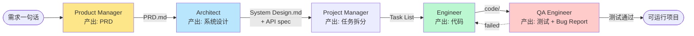
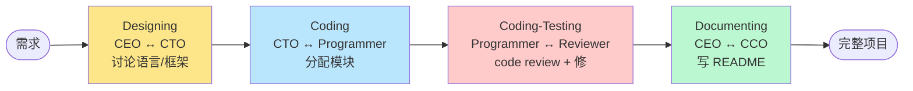

<section class="doc-hero">
  <p class="doc-hero__kicker">多 Agent 协作</p>
  <h1>MetaGPT 与 ChatDev 案例剖析</h1>
  <p class="doc-hero__lead">2023 年同时出现的两个"AI 软件公司"项目，一个走结构化 SOP 路线、一个走两两对话路线。本文不只是讲它们怎么用，而是剖析它们解决了什么、留下了什么思想、为什么后来 Cognition 那篇博客要专门反对——把这两个项目放在 Multi-Agent 整个发展脉络里看。</p>
  <div class="doc-hero__meta" aria-label="本文信息">
    <span>适合阶段：理解多 Agent 范式</span>
    <span>核心：SOP 结构化 vs Communicative 对话</span>
    <span>面试重点：辨析两种协作范式的取舍</span>
  </div>
</section>

> **本文边界**：本文是"案例深度剖析"。多 Agent 协作策略的综述请看 [Agent 协作策略](./collaboration)；架构模式（hierarchical / network / supervisor）请看 [多 Agent 架构模式](./patterns)；编程类 Agent 的横向综述请看 [编程 Agent](../vertical/coding-agent)。本文聚焦在 **MetaGPT 和 ChatDev 这两个特定项目的设计选择与历史地位**。

## 面试官想考什么

读完这篇你要能正面回答下面这些题。每题后面括号里是面试官真正想看你答出什么。

<div class="interview-grid">
  <div>
    <strong>MetaGPT 的 SOP 思想是什么？为什么它比纯自然语言对话稳定？</strong>
    <span>考你能不能讲清"结构化 artifact 减少幻觉"这个机制。</span>
  </div>
  <div>
    <strong>ChatDev 的 Communicative Dehallucination 是什么？两两对话为什么能减少幻觉？</strong>
    <span>考你对"两 Agent 互相 review"这种纠错机制的理解。</span>
  </div>
  <div>
    <strong>MetaGPT 和 ChatDev 哪个更适合生产？为什么？</strong>
    <span>考你能不能从可控性、成本、可维护性反推架构选择。</span>
  </div>
  <div>
    <strong>Cognition 2024 那篇 "Don't Build Multi-Agents" 的核心论点是什么？这两个项目怎么回应？</strong>
    <span>考你看过业界反思，能客观评价多 Agent 范式的边界。</span>
  </div>
  <div>
    <strong>为什么这两个开源项目影响了后来所有的多 Agent 框架？</strong>
    <span>考你对"SOP + 角色扮演"这套思想如何被 AutoGen、CrewAI、CAMEL 继承的理解。</span>
  </div>
  <div>
    <strong>MetaGPT 的 5 个角色为什么是这 5 个？少 1 个会怎样？多 1 个会怎样？</strong>
    <span>考你对"角色边界设计"的判断——不是越多越好。</span>
  </div>
  <div>
    <strong>ChatDev 的 Waterfall 流程在 LLM 场景下有什么独特价值？</strong>
    <span>考你能不能跳出"瀑布过时"的刻板印象，理解它在 Agent 场景的合理性。</span>
  </div>
  <div>
    <strong>如果让你自己做一个"AI 软件公司"，你会怎么改进 MetaGPT/ChatDev 的设计？</strong>
    <span>考开放性思维 + 对现有方案缺陷的洞察。</span>
  </div>
</div>

---

## 为什么这两个项目值得专门讲

2023 年下半年 GitHub 上同时火了两个"AI 软件公司"项目：**MetaGPT** 和 **ChatDev**。表面上看它们做的是同一件事——给一段自然语言需求，让多个 LLM 扮演的"员工"协作生成一个可运行的软件项目。

但它们的内部设计截然不同。这种"同一目标、两套范式"的对照恰好把多 Agent 协作的两条主路线展示得清清楚楚：

- **MetaGPT**：把人类公司的 **SOP（标准作业流程）** 编码进 Agent，每个角色输出结构化 artifact（PRD、系统设计文档、API 列表、代码），下一个角色读上一个的 artifact 接着做。
- **ChatDev**：把**软件工程的 Waterfall 流程** 模拟出来，每个阶段两个 Agent 两两对话（CEO ↔ CTO、Programmer ↔ Reviewer），通过对话往返收敛到结果。

这两个项目值得专门一篇的三个理由：

1. **它们是"AI 模拟人类组织"这个思想的最早完整实现**。AutoGPT 是单 Agent + 工具，BabyAGI 是任务循环，都没有"组织结构"概念。MetaGPT 和 ChatDev 第一次系统地把"角色扮演 + 流程协作"做出来。
2. **它们的核心抽象被后人广泛继承**。SOP 思想直接影响了 CrewAI 的设计（Crew = SOP）；Communicative Agent 思想被 CAMEL、AutoGen 的 GroupChat、AgentVerse 全部吸收。今天你看任何多 Agent 框架的角色定义、阶段划分，几乎都能追溯到这两篇 2023 年的论文。
3. **它们暴露的问题催生了反思**。Cognition AI 在 2024 年 6 月写了著名的 *Don't Build Multi-Agents* ([cognition.ai/blog/dont-build-multi-agents](https://cognition.ai/blog/dont-build-multi-agents))，矛头正是指向这类"全员协作"范式。理解它们的局限，才能理解 Devin、Claude Code 这类"单 Agent + 强工具"路线为什么后来居上。

理解多 Agent 不读这两篇相当于学操作系统不读 Unix——后面所有的设计都是它们的变体或反动。

---

## MetaGPT 深度剖析

### 论文与定位

Hong et al. 2023, *MetaGPT: Meta Programming for A Multi-Agent Collaborative Framework* ([arxiv 2308.00352](https://arxiv.org/abs/2308.00352))。论文标题里 "Meta Programming" 不是 metaclass 那种 meta——是 **"对 Agent 协作过程本身进行编程"** 的意思。

核心问题陈述：**纯自然语言对话的 Multi-Agent 系统幻觉严重**。论文里举了一个反例：让两个 GPT-3.5 Agent 协作写一个 2048 游戏，对话进行到第 5 轮时已经出现严重的"想象 API"（调用根本不存在的函数）、"忘记早期决定"（前面说用 React，后面突然用 Vue）。

MetaGPT 的诊断：问题不在模型不够强，而在 **协作协议太松散**。人类公司里两个工程师协作不会一直对话——会通过 PRD、设计文档、API spec 这些**结构化 artifact** 传递信息。MetaGPT 要做的就是把这种结构化协作编码进 Agent。

### SOP（Standardized Operating Procedure）

SOP 是 MetaGPT 的核心抽象。它把"软件公司怎么造软件"拆成 **5 个角色 + 4 个阶段交付物**：



每个角色不是"想说什么说什么"，而是**严格按模板输出某个 artifact**。比如 Product Manager 必须输出一份 PRD，PRD 必须包含：

- Original Requirements（原始需求）
- Project Goals
- User Stories
- Competitive Analysis（带 Mermaid quadrantChart）
- Requirement Pool
- UI Design draft

每一项都是结构化字段，不是自由发挥。Architect 接到 PRD 后，必须输出包含 Python class diagram（用 Mermaid classDiagram）、API 列表、文件结构、流程图的设计文档。

**这就是"把 SOP 编码进 Agent"的具体含义**——不是给 Agent 一句"你是 PM，去写 PRD"，而是给它一个**强约束的输出 schema**，让它的产出能被下一个角色机器化地读取。

### 关键创新：用 artifact 替代对话

把 MetaGPT 和"纯对话多 Agent"对比：

| 维度 | 纯对话 (如 AutoGPT 风格) | MetaGPT |
|---|---|---|
| 信息载体 | 自然语言消息 | 结构化 artifact（PRD / 设计文档 / 代码） |
| 上下文增长 | 线性累积，长对话必爆 context | 后续角色只读前面 artifact，context 可控 |
| 幻觉传播 | 一旦某轮幻觉，后续全错 | artifact 可校验（schema、引用一致性） |
| 可调试性 | 要追溯整段对话 | 直接看哪份 artifact 出问题 |
| 可恢复性 | 出错全部重跑 | 只需要重跑那个 artifact 的生成阶段 |

论文用一张图说明了 artifact 化为什么减少幻觉：**两个 Agent 通过结构化文档传递信息时，"我能引用的内容"是受限的——必须出现在前一个文档里**。这种"硬约束"逼模型在"做事的范围"内行动，而不是天马行空。

更具体地说，Architect 写系统设计时，会被要求 "Each module must reference a user story from the PRD"——这种 cross-document 一致性检查在纯对话里几乎不可能维持，在 artifact 化系统里却是必然的。

### SoftwareDev 实测

论文做了一个叫 SoftwareDev 的 benchmark，覆盖 70 个真实软件开发任务（贪吃蛇、2048、文件管理器等）。和 AutoGPT、LangChain Agent、AgentVerse 对比，MetaGPT 在四个指标上明显领先：

| 指标 | AutoGPT | AgentVerse | MetaGPT |
|---|---|---|---|
| Executability (代码能否跑起来) | 3.0 / 4 | 2.4 / 4 | **3.75 / 4** |
| Code Statistics (代码行数 / 文件数等合理性) | 中 | 低 | 高 |
| Productivity (token 利用率) | 中 | 低 | 高 |
| Human Revision Cost (人工修复成本) | 高 | 高 | **低** |

最大的差距在 **Executability**——AutoGPT 经常生成"看起来对但跑不起来"的代码，因为它 hallucinate import、调用不存在的函数；MetaGPT 因为 artifact 有 cross-reference 检查，最终代码的可执行率显著高。

### 实战代码：用 MetaGPT 跑一个项目

MetaGPT 0.8+ 的 SDK 调用比早期版本简洁得多：

```python
# pip install metagpt
import asyncio
from metagpt.software_company import generate_repo, ProjectRepo

async def main():
    # MetaGPT 的最小调用——一句话需求,自动跑完整 SOP
    repo: ProjectRepo = generate_repo(
        idea="写一个命令行版本的 2048 小游戏,用 Python,支持方向键操作",
        n_round=5,          # 每个阶段最多迭代轮数
        code_review=True,   # 是否启用代码 review 阶段
        run_tests=False,    # 不跑测试以节省 token (实测会持续消耗)
        investment=3.0,     # 预算上限 (美元,达到自动停止)
    )
    print(repo.workdir)     # 项目生成路径

asyncio.run(main())
```

跑这一段大概会消耗 $1-2 的 GPT-4 token（用 GPT-4o-mini 可降到 $0.1 左右），产出物包括：

```
workspace/cmdline_2048/
├── docs/
│   ├── prd.json              # PM 产出
│   ├── system_design.json    # Architect 产出
│   └── task.json             # Project Manager 产出
├── game.py                   # Engineer 产出
├── main.py
├── README.md
└── requirements.txt
```

注意三个细节：(1) artifact 是 JSON 不是自由 markdown——便于后续角色机器化解析；(2) 每个角色产出后会落盘，下一个角色启动时读盘——天然的 checkpoint；(3) `investment` 是硬性预算上限，避免无限循环消耗 token（这是 MetaGPT 给生产化做的关键工程化决定）。

### MetaGPT 的现状与影响

到 2025 年底，MetaGPT 的 GitHub star 超过 5 万，是最高的多 Agent 框架之一。社区演化出几个方向：

- **MetaGPT-X / MGX**：商业化版本，针对企业场景做了多模态和细分行业 SOP
- **MetaGPT-Drawer**：把 SOP 思想用到 UI 设计
- **DataInterpreter**：MetaGPT 团队后续推出的数据分析 Agent，本质是把"data scientist SOP"编码进去

但更重要的影响是**抽象层面的**：

- **CrewAI** 的设计几乎是 MetaGPT 的简化版——Crew = SOP，Task = artifact，Agent = role。CrewAI 创始人在多个访谈里承认受 MetaGPT 启发。
- **AutoGen 0.4** 的 GroupChat 模式里 `select_speaker` 机制被批评"调度太随机"，而 MetaGPT 的固定 SOP 路径成为对比基准。
- **LangGraph** 的"图驱动 Agent"思想也能看到 MetaGPT 的影子——把工作流写成可视化图，每个节点是一个角色 / 阶段。

---

## ChatDev 深度剖析

### 论文与定位

Qian et al. 2023, *Communicative Agents for Software Development* ([arxiv 2307.07924](https://arxiv.org/abs/2307.07924))，发表时间比 MetaGPT 还早 1 个月。这篇论文来自清华大学和 ModelBest 团队（OpenBMB 项目），后来也开源了完整代码 ([github.com/OpenBMB/ChatDev](https://github.com/OpenBMB/ChatDev))。

ChatDev 选了一条完全不同的路线：**不引入结构化 artifact，纯靠两两 Agent 对话推进**。这看起来正是 MetaGPT 论文里批评的"对话太松散"，但 ChatDev 通过两个机制让它工作了：

1. **Waterfall 阶段划分**：把开发流程严格分成 5 个阶段，每个阶段只做特定的事
2. **Communicative Dehallucination**：每个阶段安排两个角色互相对话 + 互相 review，通过对话本身收敛

### Waterfall 五阶段



每个阶段的对话主体：

| 阶段 | Agent A | Agent B | 任务 |
|---|---|---|---|
| Designing | CEO（业务视角） | CTO（技术视角） | 决定编程语言、框架、技术选型 |
| Coding | CTO | Programmer | CTO 描述模块设计，Programmer 写代码 |
| Coding-Testing | Programmer | Reviewer | Reviewer 提出 bug，Programmer 修复 |
| Coding-Testing（外） | Programmer | Tester | Tester 跑代码报错误，Programmer 修 |
| Documenting | CEO | CCO（首席内容官） | 写 README、user manual |

每个阶段都是**两两对话直到达成共识**——一方提出方案，另一方 review，反复几轮收敛。注意这里没有中心化的 supervisor / orchestrator——共识是从对话本身涌现的。

### 关键创新 1：Communicative Dehallucination

这是 ChatDev 论文最被引用的概念。机制简单到几乎反直觉：

**让两个 Agent 互相 review 对方的输出，比让一个 Agent 自我 review 显著减少幻觉。**

举例：Programmer 写了一段调用 `tkinter.messagebox.showinfo()` 的代码，但参数顺序错了。

- **自我 review**：Programmer 再读一遍自己的代码——往往看不出问题，因为它就是按这个错误理解生成的
- **互相 review**：Reviewer 从"独立读者"视角去检查——它读到 `showinfo("OK", "提示信息")` 时会触发"参数顺序好像反了"的警觉

论文做了一个对照实验：单 Agent 自循环 vs 双 Agent 互相 review，在同样的 token 预算下，后者的代码可执行率高 30%+。

**深层原理**：单 Agent 自 review 时，幻觉的"原因"和"检查"用的是同一个模型权重——它倾向于把生成结果合理化。双 Agent 之间每个角色都有自己的 system prompt，给了它们**不同的"视角偏置"**——Reviewer 的 prompt 强化"找问题"的倾向，自然能挑出 Programmer 看不到的问题。

> 这个机制和人类公司"为什么要 code review 而不是自查"是同一个道理——不是 reviewer 比 author 更聪明，而是**独立视角能避免确认偏误**。ChatDev 把这件事用 prompt engineering 复现了。

### 关键创新 2：Inception Prompting

ChatDev 的对话不是自由发挥的——它用 **"Inception Prompting"**（论文术语）给每个角色注入了详细的"任务设定 + 终止条件"。例子：

```
You are a Chief Technology Officer. We share a common interest in
collaborating to successfully complete a task. You must help me to
complete the task. The task is: {task}. Here is the modality: {modality}.

To complete the task, you must write a response that appropriately solves
the requested instruction based on your expertise. ... Once you and I have
reached a consensus, you must reply with a single word: <END>.
```

关键设计：

- **共同利益注入**："we share a common interest" 这种措辞让两个 Agent 倾向于合作而不是争论
- **终止信号**：约定一个特定 token `<END>` 作为对话结束信号——这是把 LLM 对话强制变成 RPC 调用的关键 trick
- **任务分解传递**：上一阶段的输出会通过 prompt 注入到下一阶段——形成 chain

这套 prompting 模式后来被很多框架借鉴——**用 prompt 强约束 Agent 之间的对话语义**，本质是把"自由对话"转化为"结构化协议"。

### ChatDev 实测：200 字需求生成几千行代码

ChatDev 的官方 demo 里有个典型例子：输入需求 "Develop a basic Gomoku game"（200 字以内），ChatDev 跑完整 5 阶段后生成了一个完整的五子棋游戏，包含 GUI、游戏逻辑、胜负判断、重新开始按钮，共约 500-1000 行 Python 代码。

整个过程的 token 消耗大约 $2-5（GPT-3.5）到 $20-50（GPT-4），耗时 10-30 分钟。这在 2023 年是相当震撼的——之前 AutoGPT 跑同样任务要么死循环要么生成不完整代码。

但论文也诚实地承认了局限：

- **复杂项目（>1000 行）质量明显下降**——多阶段对话的累积幻觉
- **只能"从零创业"**，不能在已有 codebase 上修改
- **没有真实需求理解**——你说"做一个 Twitter clone"，它会做出非常 toy 的版本

### 实战：自己实现一个 Communicative Agent 对话

ChatDev 的核心机制其实可以用 30 行 Python 复现，理解了下面这段就理解了 Communicative Agent 的本质：

```python
import os
from openai import OpenAI

oai = OpenAI()

def communicative_phase(
    role_a_prompt: str,
    role_b_prompt: str,
    initial_task: str,
    max_turns: int = 6,
    end_token: str = "<END>",
) -> list[dict]:
    """ChatDev 风格的两两对话: A 和 B 交替发言, 直到一方说 <END>."""
    # 双方各自的"内部对话历史"——注意 A 看到的和 B 看到的角色是反的
    conv_a = [{"role": "system", "content": role_a_prompt}]
    conv_b = [{"role": "system", "content": role_b_prompt}]

    # B 先开场, 把 task 抛给 A
    opening = f"Let's begin. The task is: {initial_task}. Please share your initial design."
    conv_a.append({"role": "user", "content": opening})

    transcript = [("B (kick-off)", opening)]
    speaker = "A"

    for turn in range(max_turns):
        if speaker == "A":
            resp = oai.chat.completions.create(
                model="gpt-4o-mini", messages=conv_a, temperature=0.7,
            ).choices[0].message.content
            transcript.append(("A", resp))
            conv_a.append({"role": "assistant", "content": resp})
            conv_b.append({"role": "user", "content": resp})
            speaker = "B"
        else:
            resp = oai.chat.completions.create(
                model="gpt-4o-mini", messages=conv_b, temperature=0.7,
            ).choices[0].message.content
            transcript.append(("B", resp))
            conv_b.append({"role": "assistant", "content": resp})
            conv_a.append({"role": "user", "content": resp})
            speaker = "A"

        # 终止条件: 任一方喊出约定的 end token
        if end_token in resp:
            break

    return transcript


# ============ 模拟 Designing 阶段 ============
CEO = """You are the CEO of a software company. You need to discuss the
technical choices with the CTO. Goal: agree on programming language and main
libraries for the task. When you fully agree with CTO's plan, reply with <END>
at the end of your message. Otherwise keep discussing."""

CTO = """You are the CTO of a software company. You discuss with CEO to decide
the tech stack. Be concrete: name the exact language, libraries, file structure.
When CEO agrees with you, you can end the round, otherwise keep refining."""

transcript = communicative_phase(
    role_a_prompt=CTO,
    role_b_prompt=CEO,
    initial_task="Build a CLI tool that converts CSV to JSON with type inference.",
    max_turns=6,
)

for who, what in transcript:
    print(f"[{who}]\n{what}\n{'='*60}")
```

跑这一段你会看到 CEO 和 CTO 来回 3-5 轮，最后达成共识"用 Python + Pydantic + Click"。这就是 Communicative Agent 的最小内核——**两个 prompt 不同的 LLM 实例 + 对话历史交叉传递 + 约定终止 token**。

ChatDev 项目本身就是这种基础结构的扩展：5 个阶段串起来，每个阶段 2 个角色，最后拼装出完整项目。

---

## MetaGPT vs ChatDev 全面对比

| 维度 | MetaGPT | ChatDev |
|---|---|---|
| **核心抽象** | SOP（流程模板 + 结构化 artifact） | Communicative Agent（两两对话 + 共识涌现） |
| **协作单元** | 角色之间通过 artifact 传递 | 角色之间直接对话 |
| **角色数量** | 5+（PM / Architect / PJM / Engineer / QA） | 6（CEO / CTO / Programmer / Reviewer / Tester / CCO） |
| **协作粒度** | 阶段交付 artifact | 多轮对话直到共识 |
| **信息载体** | 结构化 JSON / Markdown 文档 | 自然语言消息 |
| **幻觉控制** | artifact 的 cross-reference 一致性 | 双 Agent 互相 review |
| **Context 管理** | 后续角色只读相关 artifact，可控 | 阶段对话历史，可能膨胀 |
| **可恢复性** | 阶段级 checkpoint，可重跑某一段 | 阶段级别 checkpoint，对话内不可恢复 |
| **可观测性** | 高（每个 artifact 落盘） | 中（要看完整对话才知道发生了什么） |
| **Token 成本** | 中等（结构化输出更短） | 高（对话多轮反复） |
| **代码可执行率** | 论文 SoftwareDev: 3.75/4 | 论文实测中等-高 |
| **适合任务** | 需求明确、流程标准化的项目 | 探索性强、需要讨论的项目 |
| **不擅长** | 创意类项目（PRD 模板太死） | 大型项目（对话会失控） |
| **开源 star** | ~50k | ~25k |

**怎么选**：如果你的任务有明确的"输入需求 → 多阶段产出"流水线（典型如生成 CRUD 应用、数据分析报告），MetaGPT 的 SOP 更省 token、更可控。如果任务需要"探索性讨论"（架构选型、技术 trade-off），ChatDev 的对话风格更灵活但成本更高。

---

## 这两个项目的后续影响

理解 MetaGPT 和 ChatDev 真正的历史地位，不在于它们今天还有多少人用——很多生产团队都不会直接用它们——而在于它们催生的**思想被广泛吸收**。

### 1. SOP 思想 → CrewAI 的核心抽象

CrewAI ([crewai.com](https://www.crewai.com/)) 是 2024 年崛起最快的多 Agent 框架，它的核心三个概念几乎就是 MetaGPT 的简化版：

| MetaGPT | CrewAI |
|---|---|
| SOP（流程） | Crew + Process |
| Role（角色 + 模板） | Agent（role + goal + backstory） |
| Artifact（结构化产出） | Task（含 expected_output） |
| Action（角色内部操作） | Tool |

CrewAI 等于"把 MetaGPT 的 SOP 思想做成更通用的 Python SDK"。可结合 [框架选型对比](../frameworks/comparison) 看它在多 Agent 框架里的定位。

### 2. Communicative Agent 思想 → AutoGen / CAMEL / AgentVerse

- **CAMEL** ([camel-ai.org](https://www.camel-ai.org/)) 直接以 *Communicative Agents for Mind Exploration of Large Scale Language Models* 命名（早于 ChatDev 几个月，但 ChatDev 把它工程化落地）——它的 AI Society 框架就是两两对话。
- **AutoGen** 的 GroupChat 模式本质是 N 个 Agent 的对话池，加上 `select_speaker` 函数决定谁说话。如果只有 2 个 agent，就退化成 ChatDev 风格。可结合 [框架选型对比](../frameworks/comparison) 看它和其它框架的差异。
- **AgentVerse** 把多 Agent 对话扩展到了"专家组讨论 + 投票"的范式。

### 3. 角色扮演成为默认套路

今天打开任何一个 Multi-Agent 教程，几乎都会看到"假设你是 X 角色"的 prompt 设定——这是 MetaGPT/ChatDev 带火的。在它们之前，多 Agent 系统更倾向于"功能型 Agent"（搜索 Agent、计算 Agent、写作 Agent），它们之后"组织型 Agent"（PM、Engineer、Reviewer）成为主流。

### 4. 工程化最佳实践被沉淀

具体可见的影响：

- **Investment / Budget cap**：MetaGPT 引入的"美元预算硬上限"被广泛抄袭，今天 LangChain、CrewAI、AutoGen 都有类似机制
- **Artifact 落盘 checkpoint**：MetaGPT 的"每阶段 artifact 写文件"被 LangGraph 的 State 持久化继承
- **Inception Prompting**：ChatDev 的"角色 + 终止 token"模式成为 agent system prompt 的标准模板

---

## Cognition 的反对意见：Don't Build Multi-Agents

2024 年 6 月，Cognition AI（Devin 的开发团队）发表了一篇极具争议的博客 [*Don't Build Multi-Agents*](https://cognition.ai/blog/dont-build-multi-agents)，矛头直指 MetaGPT/ChatDev/AutoGen 这类全员协作范式。Cognition 的核心论点：

### 论点 1：决策分散导致不一致

"In long, multi-step tasks, even with many sub-agents giving you progress reports, the main agent loses track of which decisions were made by whom, and ends up making contradictory choices."

翻译：长任务里，主 Agent 即使收到所有 sub-agent 的进度汇报，也会**搞不清楚哪个决定是谁做的**，最终自相矛盾。

举的例子：Agent A 决定用 React + TypeScript，Agent B 不知情决定用 Vue + JavaScript，最后 Orchestrator 拼起来得到一个奇怪的混合项目。

### 论点 2：Context 共享成本是 O(N²)

"For N sub-agents to actually collaborate (not just parallelly do unrelated tasks), they all need to share context. Sharing context across N agents is O(N²)."

每个 sub-agent 都要知道其他 sub-agent 做了什么、决定了什么。N=2 还好，N=10 时上下文管理就是噩梦。

### 论点 3：单 Agent + 强工具更优

Cognition 主张的替代方案：**一个主 Agent 负责所有决策，用强大的工具（包括能 fork 出子任务的工具）扩展能力**。Devin 就是这种设计——没有 "Project Manager Agent" 和 "Engineer Agent"，而是一个 Devin agent 通过 shell / editor / browser 工具自己完成。

### MetaGPT / ChatDev 怎么"回应"？

虽然 Cognition 的博客比这两个项目晚一年多，但回过头看它们的设计已经隐含了部分回应：

**MetaGPT 的回应**：SOP 的结构化 artifact 正是为了解决"决策追溯"问题——每个决定都对应一份文档，文档之间有 cross-reference。论点 1 在 MetaGPT 里被部分缓解。

**但 Cognition 的论点 2 仍然成立**——MetaGPT 的 5 个角色之间确实有 O(5²) 的协调开销，artifact 之间的一致性维护是个真实问题。

**ChatDev 的回应**：通过两两对话 + Waterfall 流程，把 N=2 的协作做扎实——没有 N>2 的协调问题。但代价是流程死板。

**真实评价**：Cognition 的反对不是"多 Agent 错了"，是反对 **"为多 Agent 而多 Agent"**——把简单任务硬塞进多角色框架。MetaGPT/ChatDev 的真正价值在**研究和教学**层面证明了多 Agent 协作的可能性，**生产里直接用它们的人少**——更多是吸收了它们的思想，做窄场景的优化。

---

## 真正的生产价值

把这两个项目放在 2025 年的生产语境下看，**直接用它们做产品的团队很少**。原因清楚：

| 生产化痛点 | MetaGPT/ChatDev 现状 |
|---|---|
| 成本可控 | 单任务 $1-50，难以做高频用户场景 |
| 延迟 | 5-30 分钟生成一个项目，不适合实时交互 |
| 可维护代码 | 只能"从零创业"，不能在已有 codebase 上迭代 |
| 调试性 | 出错要追整段流程，比单 Agent 难 debug |
| 可控性 | LLM 自主程度高，关键决策难强制 |

但它们的**思想被吸收到更窄的场景里**，那些场景反而活得很好：

- **CrewAI 的客服自动化**：把 SOP 思想用在客服流程编排
- **Devin / Cursor 的代码生成**：吸收了"PM → Architect → Engineer" 的思路，但收敛到单 Agent
- **LangGraph 的工作流**：把多 Agent 协作显式建模为状态图
- **企业内部 Agent**：在严格定义的业务流程里用 MetaGPT 风格的 SOP

**所以这两个项目在多 Agent 史上的真正定位**：

- 它们是**研究项目**，证明了"AI 模拟人类组织"在原理上可行
- 它们是**教学工具**，今天任何讲多 Agent 的课都绕不开
- 它们是**思想发源地**，CrewAI、AutoGen、LangGraph 都受其启发
- 它们**不是生产首选**——生产里更多是它们思想的窄化、简化、深化版本

---

## 常见陷阱

### 陷阱 1：照搬 MetaGPT/ChatDev 到生产

**现象**：看了 demo 印象深刻，团队决定用 MetaGPT 做 SaaS 产品的核心，上线后发现单次请求成本 $2、延迟 20 分钟、出错率 30%。

**根因**：这两个项目是研究框架，没有针对"高并发、低延迟、严苛 SLA"做工程化。论文里的 benchmark 任务都是单次执行的 toy project。

**修法**：不要直接用整个框架，**吸收它的核心抽象，做窄场景的优化**。如果你只需要"从 PRD 生成代码"这一段，把 MetaGPT 的 PRD → Code 流程拆出来重写，去掉 QA / Doc 阶段；如果你只需要"两两 review"，用 30 行代码自己实现 ChatDev 风格的对话循环。

### 陷阱 2：成本失控

**现象**：跑了一晚上 MetaGPT 的 batch 任务，第二天发现 OpenAI 账单 $500——某些任务进入死循环，QA → Engineer → QA → Engineer 反复修 bug 没有终止。

**根因**：多 Agent 系统的失败模式之一就是**循环 review**——QA 找出 bug、Engineer 修、QA 又找出新 bug、Engineer 又修，永不收敛。LLM 本身没有"差不多就行了"的判断。

**修法**：
- **强制预算上限**：MetaGPT 的 `investment` 参数必用，ChatDev 也要自己加成本监控
- **轮数上限**：每个阶段最多 N 轮，达到就强制结束
- **变化检测**：如果连续 2 轮 review 找出的 bug 列表几乎相同，强制停止——表示在原地打转
- **降级策略**：跑到一半预算超了就 fallback 到更便宜模型继续，不要直接中断

### 陷阱 3：角色边界混乱

**现象**：自己仿照 MetaGPT 设计 8 个角色（PM / TPM / Architect / Tech Lead / Engineer / Senior Engineer / QA / Release Manager），结果它们互相扯皮——TPM 和 PM 谁负责需求？Tech Lead 和 Architect 谁拍板？

**根因**：角色拆得太细，**边界不清晰** → LLM 在每个角色里都试图"做更多"，导致重复工作甚至冲突决策。

**修法**：参考 MetaGPT 的 5 角色和 ChatDev 的 6 角色——这是**长期实验找到的甜点**。少于 4 角色协作价值不够，多于 6 角色边界开始模糊。如果业务真的需要 8 个角色，**强制每个角色的 system prompt 里写清"你不做什么"**，让边界外的事情有明确归属。

### 陷阱 4：以为能维护已有代码

**现象**：用 MetaGPT 试图给一个已有的 Django 项目"加个用户系统"。MetaGPT 不管现有代码，直接重新生成了一份完整 Django 项目覆盖原代码。

**根因**：MetaGPT/ChatDev 的设计假设是 **greenfield project（从零开始）**，PRD → 设计 → 编码 的流水线本质上是"创造"不是"修改"。它们没有"读现有代码 → 理解结构 → 局部修改"的能力。

**修法**：维护已有代码的需求**根本不该用这套范式**——用 Cursor / Aider / Claude Code 这类"单 Agent + 强代码工具"路线。MetaGPT 用于 PoC、原型、demo 是合适的；用于代码维护是范式错配。

### 陷阱 5：忽视 LLM 模型对协作质量的影响巨大

**现象**：用 GPT-3.5 跑 MetaGPT，生成的代码经常报错；换 GPT-4 立刻好很多；换 GPT-4o 又有变化。团队怀疑是框架 bug，深挖才发现是模型本身的差异。

**根因**：多 Agent 系统对模型能力的依赖**比单 Agent 系统更高**——因为它依赖角色之间的语义对齐。弱模型在某个角色上的"误解"会被下一个角色当成 ground truth 放大。

**修法**：
- 关键角色（Architect、Reviewer）用强模型，廉价角色（Documenter）可以用弱模型
- 评估框架时把模型作为变量同时测
- 不同角色用不同模型时要关注它们的 instruction-following 差异

---

## 与相邻概念的区别

| 概念 | 范围 | 本文位置 |
|---|---|---|
| **多 Agent 协作策略** | 综述：竞争 / 协作 / 辩论 / 投票 | [collaboration](./collaboration) |
| **多 Agent 架构模式** | 综述：hierarchical / network / supervisor | [patterns](./patterns) |
| **Orchestrator-Worker 模式** | 单层调度模型 | [orchestrator-worker](./orchestrator-worker) |
| **编程 Agent 综述** | 横向看 Devin / Cursor / Aider / Claude Code | [coding-agent](../vertical/coding-agent) |
| **CrewAI 框架** | 受 MetaGPT 启发的多 Agent SDK | [frameworks comparison](../frameworks/comparison) |
| **AutoGen 框架** | 微软的 GroupChat 多 Agent 框架 | [frameworks comparison](../frameworks/comparison) |
| **MetaGPT / ChatDev 案例** | 两个软件公司模拟器的深度剖析 | 本文 |

辨析要点：

- 本文是**案例深度剖析**——讲两个特定项目的设计选择、实测数据、历史地位
- collaboration / patterns 是**范式综述**——讲抽象的协作策略和架构模式
- vertical/coding-agent 讲**Devin、Cursor 这类编程 Agent**——和 MetaGPT/ChatDev 路线不同
- frameworks/crewai 讲**受这两个项目影响的下一代框架**——是它们思想的工程化继承

---

## 面试题深度解析

### Q: MetaGPT 的 SOP 思想是什么？为什么比纯对话稳定？

**30 秒版本**：SOP 是 Standardized Operating Procedure，把人类公司的协作流程（需求 → 设计 → 编码 → 测试）编码进 Agent，每个角色严格按模板输出**结构化 artifact**（PRD、系统设计、API 列表、代码），下一个角色读上一个的 artifact 接着做。它比纯对话稳定的核心原因是 **artifact 减少了幻觉传播**——纯对话里前一轮的幻觉会被当成上下文传到后一轮被放大；artifact 化系统里每份文档有 schema 约束 + cross-reference 检查（"Architect 设计必须引用 PRD 里的 User Story"），LLM 没法天马行空。论文 SoftwareDev benchmark 上 MetaGPT 的代码可执行率 3.75/4，AutoGPT 是 3.0/4——差距主要来自"hallucinate API"这类错误的减少。

**追问**：那 artifact 化是不是只是 prompt engineering？为什么算"架构创新"？
区别在于**它强制改变了 agent 之间的信息流形态**。Prompt engineering 是改单个 agent 的输入；artifact 化改的是**协作的物理结构**——不是消息总线了，而是文件系统。具体表现：(1) 每份 artifact 落盘，天然是 checkpoint，出错能从该阶段重跑；(2) artifact 可以被多个角色并行读取，不像对话有顺序依赖；(3) artifact 之间的引用是 explicit 的，不像对话里的引用是 implicit 的。这三个特性合起来就不再是"改 prompt"能达到的——是协作模式的根本变化。

**追问**：那 LangGraph 的 State 是不是同一个思想？
本质上是。LangGraph 的 State 就是"在节点之间传递的结构化数据"，和 MetaGPT 的 artifact 是同一抽象。区别在于：(1) MetaGPT 的 artifact 是文件，LangGraph 的 State 是内存对象；(2) MetaGPT 的 SOP 是硬编码流程，LangGraph 可以动态条件分支；(3) MetaGPT 角色用 LLM 调用直接产生 artifact，LangGraph 节点可以是任意函数。可以说 LangGraph 是 SOP 思想的更通用化、更灵活的实现——MetaGPT 是"垂直版本"。

### Q: ChatDev 的 Communicative Dehallucination 是什么？

**30 秒版本**：让两个 prompt 不同的 Agent 互相 review 对方的输出，比让一个 Agent 自我 review 显著减少幻觉。原理是**单 Agent 自 review 时，幻觉的"原因"和"检查"用的是同一个模型权重**——它倾向于把生成结果合理化（确认偏误）；**双 Agent 之间每个角色有不同的 system prompt**，给了它们不同的"视角偏置"——Reviewer 的 prompt 强化"找问题"倾向，自然能挑出 Programmer 看不到的问题。论文做了对照实验：同样 token 预算下，双 Agent 互相 review 的代码可执行率比单 Agent 自循环高 30%+。这个机制和人类公司 code review 是同一个道理——不是 reviewer 比 author 聪明，而是**独立视角避免确认偏误**。

**追问**：那为什么不让一个 Agent 用两个不同 prompt 自己 review？
理论上可以，但效果不如双 Agent 显著。原因：(1) **对话历史污染**——同一个 LLM 实例 review 时会看到自己之前的生成思路，思路本身就是 bias 来源；(2) **角色切换成本**——一个 LLM 切换"我是 Programmer / 我是 Reviewer"角色，在同一上下文里会有语义漂移；(3) **prompt 强度有限**——再强的 role prompt 也敌不过"我刚才说了什么"的 in-context 影响力。实测真实双 Agent 比"同一 Agent 双重身份"的 review 效果好 10-20%——这个量级差距足以决定要不要付双倍 token。

**追问**：双 Agent review 会不会出现"两个都错"的情况？
会。这是这套机制的本质局限——**两个 LLM 在共同分布上的盲区是重叠的**。例子：GPT-4 对某些罕见 API 用法都有同样错误的"记忆"——这时让两个 GPT-4 互相 review 也修不出来。修法：(1) **异构模型**——一个 Agent 用 GPT-4，另一个用 Claude，两者的"盲区"不同；(2) **引入工具验证**——Reviewer 不只靠"读"，能实际跑代码（编译、单测），用确定性信号补 LLM 不确定信号。后者是 Devin 路线的关键——单 Agent 但用工具验证替代多 Agent review。

### Q: Cognition "Don't Build Multi-Agents" 的核心论点是什么？这两个项目怎么回应？

**30 秒版本**：Cognition 2024 年 6 月博客的核心论点是 **"长任务里多 Agent 协作会导致决策不一致"**——主 Agent 即使收到所有 sub-agent 的进度报告，也搞不清哪个决定是谁做的，最终自相矛盾。深层原因是 **context 共享成本是 O(N²)**——N 个 Agent 要真协作就要互相知道对方在做什么。Cognition 主张的替代方案：**一个主 Agent + 强工具**（Devin 路线）。**MetaGPT 的部分回应**：SOP 的结构化 artifact 正是为了解决"决策追溯"——每个决定对应一份文档，文档间有 cross-reference，比纯对话好得多。但 O(N²) 问题仍然存在——5 个角色之间的 artifact 一致性维护本身就是个工程难题。**ChatDev 的回应**：通过限制 N=2（两两对话）+ Waterfall 流程把协调复杂度压到最小。**但代价是流程死板**——只能做"标准"软件项目，不能处理探索性需求。**真实评价**：Cognition 反对的不是"多 Agent 错了"，是反对"为多 Agent 而多 Agent"——把简单任务硬塞多角色框架。

**追问**：那 Anthropic 同时期也写过 "Building Effective Agents" 推崇 multi-agent，怎么看这两家的分歧？
表面分歧实际是**应用场景不同**。Cognition 做 Devin——长程编程任务（连续工作几小时），这种场景下 context 共享的累积成本最致命。Anthropic 写 "Effective Agents" 时举的例子（orchestrator + parallel research subagents）是**短任务并发**——每个 subagent 几分钟内完成，结果汇总给 orchestrator，根本不需要 subagent 互相知道。所以正确读法是：**短任务可并行的场景用 multi-agent；长任务连续协作的场景用 single-agent + 强工具**。MetaGPT/ChatDev 落在中间——任务不长（一次生成一个小项目）但角色协作较深——所以两边都能找到反对它们的论据。

**追问**：那未来多 Agent 范式还有意义吗？
有，但场景在收窄。三个仍然成立的场景：(1) **专家组讨论式协作**——比如医疗诊断需要多个专科会诊，多 Agent 的"异构视角"无可替代；(2) **大规模并行任务**——如 SWE-bench 这种成千上万个 issue 并行修，多 Agent 自然分工；(3) **模拟人类组织流程的教学/研究**——MetaGPT/ChatDev 在这块仍然是最佳工具。**收窄的是**：通用 personal assistant、单一编程任务、短交互场景——这些都被证明单 Agent 路线更优。所以多 Agent 不会消失，但不再是"默认答案"。

### Q: 为什么这两个开源项目影响了所有后来者？

**30 秒版本**：它们是**第一次系统化、可复现地实现了"AI 模拟人类组织协作"**——之前 AutoGPT 是单 Agent + 工具，BabyAGI 是任务循环，都没"组织结构"概念。MetaGPT 和 ChatDev 第一次把 PM / Engineer / Reviewer 这套语义引入多 Agent 设计，并且**开源了完整代码**——这两点合起来让后来者要么继承思想（CrewAI 的 Crew = SOP）、要么继承机制（AutoGen 的 GroupChat 借鉴 Communicative Agent）、要么继承 prompt 模式（"You are a senior X..." 的 Inception Prompting）。三类核心继承：(1) **SOP 思想 → CrewAI 的核心抽象**，CrewAI 的 Crew + Agent + Task 几乎是 MetaGPT 的简化版；(2) **Communicative Agent → AutoGen / CAMEL / AgentVerse**，两两或多人对话成为多 Agent 默认套路；(3) **角色扮演 prompt → 所有 Agent 框架的标配**——今天任何多 Agent 教程都从"假设你是 X 角色"开始，这是它们带火的。

**追问**：CrewAI 既然是简化版，为什么比 MetaGPT 更受欢迎？
两个核心原因。(1) **抽象通用**——MetaGPT 的 SOP 内嵌"软件公司"业务语义，强制 PM / Architect / Engineer 角色，业务限定死；CrewAI 的 Crew / Agent / Task 是通用抽象，任何业务流程都能套（客服、营销、数据分析），适用范围大 10 倍。(2) **学习曲线低**——MetaGPT 你要读它的 Role / Action / Memory 系统才能定制；CrewAI 你 30 分钟看完文档就能 hello world。**这个对比也是开源项目的常见规律**——首创者证明了概念可行，简化版抓住更大市场。MetaGPT 是论文先行的工程化，CrewAI 是产品先行的工程化。

**追问**：那这两个项目还值得现在学吗？
**值得，但定位是"理解多 Agent 设计哲学"，不是"生产首选"**。读 MetaGPT 论文能学到：SOP 思想、artifact 化协作、Inception Prompting；读 ChatDev 论文能学到：Communicative Dehallucination、Waterfall 阶段化、Role + End Token 模式。这些思想是**多 Agent 工程的基础词汇**——没有这套语义，你看 CrewAI 文档都看不懂为什么这么设计。具体的：面试时如果你能说"这个 CrewAI 设计本质来自 MetaGPT 的 SOP 思想"，面试官立刻能判断你不只是会用框架，是理解设计 lineage。

---

## 延伸阅读

- **MetaGPT 论文** ([arxiv 2308.00352](https://arxiv.org/abs/2308.00352))
  Hong et al. 2023。读它的第 3 章 "Methodology" 理解 SOP 怎么编码进 Agent，读第 4 章 SoftwareDev benchmark 看实测数据。Appendix 有所有角色的完整 system prompt 模板，是学习 Inception Prompting 的最佳一手材料。

- **ChatDev 论文** ([arxiv 2307.07924](https://arxiv.org/abs/2307.07924))
  Qian et al. 2023。读 Section 3 的 Communicative Dehallucination 机制描述——核心思想用 2 页纸讲清楚了。Section 5 的 case study 展示了完整的 5 阶段对话 transcript，能看出 Agent 之间真实的对话风格。

- **MetaGPT GitHub** ([github.com/geekan/MetaGPT](https://github.com/geekan/MetaGPT))
  读 `metagpt/roles/` 目录——每个 role 都是一个 Python class，看它怎么定义 actions、how to 接收 messages、怎么产出 artifact。这是学习"用代码实现角色"的最佳参考。

- **ChatDev GitHub** ([github.com/OpenBMB/ChatDev](https://github.com/OpenBMB/ChatDev))
  读 `chatdev/chat_chain.py`——5 阶段如何串成 chain。读 `CompanyConfig/Default/RoleConfig.json` 看每个角色的 system prompt 是怎么 inception prompting 的。

- **Cognition - Don't Build Multi-Agents** ([cognition.ai/blog/dont-build-multi-agents](https://cognition.ai/blog/dont-build-multi-agents))
  Walden Yan, 2024 年 6 月。这篇博客必读——它解释了为什么 Devin 选择单 Agent 路线，反驳了 MetaGPT/ChatDev 这类范式的核心假设。读完你会对"多 Agent 何时合理、何时是负担"有更清晰的判断。

- **Anthropic - Building Effective Agents** ([anthropic.com/research/building-effective-agents](https://www.anthropic.com/research/building-effective-agents))
  2024 年 12 月。Anthropic 工程团队的多 Agent 设计原则，可以和 Cognition 的反对意见对照读——你会发现两家分歧的根源是任务时长和场景差异。

- **CrewAI 文档** ([docs.crewai.com](https://docs.crewai.com/))
  读 "Core Concepts" 章节——你会发现 CrewAI 的 Crew / Agent / Task / Process 几乎是 MetaGPT SOP 思想的 1:1 工程化。理解了 MetaGPT 再读 CrewAI 文档会有"原来如此"的感觉。

- **CAMEL 论文** ([arxiv 2303.17760](https://arxiv.org/abs/2303.17760))
  Li et al. 2023。比 ChatDev 还早 3 个月的两 Agent 对话框架（AI Society）——读它能看到 Communicative Agent 这个概念的更早雏形。ChatDev 把 CAMEL 的对话机制和软件工程流程结合起来。

- **AutoGen 论文** ([arxiv 2308.08155](https://arxiv.org/abs/2308.08155))
  Wu et al. 2023。微软的多 Agent 框架，读它的 GroupChat 章节理解"N agent 自由对话 + select_speaker"如何泛化 ChatDev 的两两对话。

- **配套阅读**：
  - [多 Agent 协作策略](./collaboration) — 协作范式综述（竞争 / 协作 / 辩论 / 投票）
  - [多 Agent 架构模式](./patterns) — hierarchical / network / supervisor 模式
  - [Orchestrator-Worker 模式](./orchestrator-worker) — 单层调度的最简模型
  - [编程 Agent](../vertical/coding-agent) — Devin / Cursor / Aider / Claude Code 横向对比
  - [框架选型对比](../frameworks/comparison) — CrewAI / AutoGen 等多 Agent 框架的定位对比
