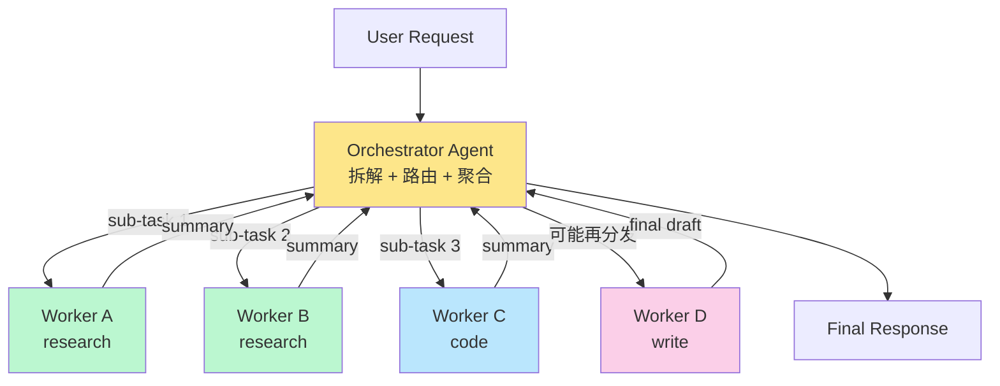
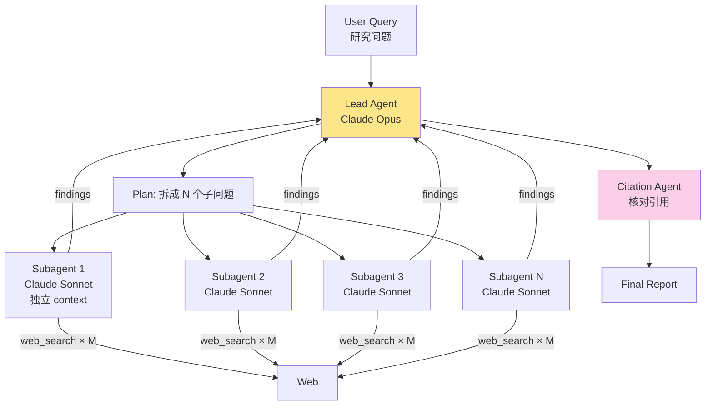

<section class="doc-hero">
  <p class="doc-hero__kicker">多 Agent 协作</p>
  <h1>调度者-工作者 Orchestrator-Worker</h1>
  <p class="doc-hero__lead">业界 80% 的多 Agent 生产系统是这个形态——一个 orchestrator 负责拆解、路由、聚合，N 个 worker 各自专精一件事。本文讲清楚为什么是它、它的核心架构怎么设计、Anthropic 多 Agent Research System 怎么搭、什么时候并行什么时候串行、失败怎么兜底。</p>
  <div class="doc-hero__meta" aria-label="本文信息">
    <span>适合阶段：多 Agent 生产化</span>
    <span>核心：orchestrator + workers + 聚合</span>
    <span>面试重点：架构权衡 + 真实案例</span>
  </div>
</section>

> **本文边界**：本文是 [multi-agent/patterns](./patterns) 综述里 supervisor / orchestrator 模式的深度展开。Plan-and-Execute 是 orchestrator-worker 的一个更窄子集——单 planner + 顺序 executor，见 [agent/plan-execute](../agent/plan-execute)。**平等 Agent 之间的协作**（debate、协商、角色对话）不在这里，见 [collaboration](./collaboration)。**跨 Agent 的通信协议**（A2A、ACP）见 [communication](./communication)。

## 面试官想考什么

读完这篇你要能正面回答下面这些题。每题后面括号里是面试官真正想看你答出什么。

<div class="interview-grid">
  <div>
    <strong>为什么 orchestrator-worker 是业界最常用的多 Agent 模式？</strong>
    <span>考能不能讲出"控制流清晰、可观测、可调试、调试成本低"——而不是空谈"灵活强大"。</span>
  </div>
  <div>
    <strong>Orchestrator-Worker 和 Plan-and-Execute 是什么关系？</strong>
    <span>考能不能讲清"P&E 是 O-W 的一个特例：单 planner + 顺序 worker"，以及更一般的 O-W 还包括动态决策、并行 worker、层级 supervisor。</span>
  </div>
  <div>
    <strong>Orchestrator 看不看到 worker 的中间过程？怎么权衡？</strong>
    <span>考 context 设计——只看 summary 还是看全文，省 token 和 debug 难度的取舍。</span>
  </div>
  <div>
    <strong>Worker 失败时 orchestrator 怎么决策？</strong>
    <span>考失败处理策略：重试、换 worker、降级、放弃，以及怎么把失败信息回传给 orchestrator 做下一轮决策。</span>
  </div>
  <div>
    <strong>Anthropic 多 Agent Research System 的架构是什么样的？</strong>
    <span>考是否读过 2024 年那篇真实生产案例的博客——lead agent + N 个 subagent 并行检索、token 消耗 4 倍换准确率提升 90%。</span>
  </div>
  <div>
    <strong>什么场景 worker 该并行 / 该串行？</strong>
    <span>考依赖关系和副作用分析——无依赖且 read-only 可并行，有依赖或有副作用必须串行。</span>
  </div>
  <div>
    <strong>Worker 之间能不能直接互通？为什么大多设计不允许？</strong>
    <span>考能不能讲出"星形结构维持简单性""worker 互通会爆炸成 N² 通信"以及什么场景例外。</span>
  </div>
  <div>
    <strong>Orchestrator 自己 hallucinate 错了路由怎么办？</strong>
    <span>考工程兜底——schema 约束输出、router 跑 evaluation、加 fallback worker、可观测性反查。</span>
  </div>
</div>

---

## 为什么 orchestrator-worker 几乎是默认选择

先看一个反例，理解"不用它"会怎样。

设想你要做一个"开源技术调研" Agent：给定一个技术方向（比如"开源向量数据库"），输出一份带候选列表、对比、引用的报告。把它做成单 Agent 会变成什么样？

```python
# 单 Agent + 一堆工具
agent = Agent(
    model="claude-opus-4-5",
    tools=[
        web_search, github_search, arxiv_search,
        read_url, summarize, compare_table,
        write_section, citation_check, ...
    ],
    system_prompt="你是一个调研 agent，把所有事都干了。"
)
```

跑起来你会观察到几类问题：

1. **context 越跑越长**——每次 web_search 返回 20 个结果，每个 chunk 几 KB，几轮下来 50K token 就过去了，准确率下降、成本暴涨
2. **工具选择疲劳**——10+ 工具放在一起，模型经常调错（该搜 arxiv 调了 web_search）
3. **任务漂移**——做着做着忘了原任务，开始一直查同一家产品的细节
4. **不可调试**——出错时你只看到"agent 跑了 30 步，最后回答错了"，但没法精确归因到"哪一步偏离了"

业界对这类长任务的应对很统一：**把它拆成 orchestrator + workers**。一个 orchestrator agent 负责"想清楚要做哪些子任务"，N 个 worker agent 各自做一件事（专门检索、专门对比、专门写作）。每个 worker 有自己的 context 窗口、自己的工具集、自己的 system prompt——干完一件事把摘要回报给 orchestrator。

Anthropic 在 [Building Effective Agents](https://www.anthropic.com/engineering/building-effective-agents)（2024-12）里把这个模式叫做 **orchestrator-workers**，并且明确说："This pattern works well for complex tasks where you can't predict the subtasks needed."——它不是"一种可选模式"，而是**长任务+不确定子结构**场景的事实默认。

为什么这个模式压倒性地占据了生产环境？四个原因：

| 维度 | 单 Agent | Orchestrator-Worker |
|---|---|---|
| **控制流** | 一个 loop 跑到尾，黑盒 | orchestrator 显式决策，每步可观察 |
| **context 隔离** | 所有信息塞同一个上下文，越跑越糟 | 每个 worker 独立 context，干完即弃 |
| **专业化** | 一个 prompt 处理所有事，万金油 | 每个 worker 单一职责，prompt 可深度优化 |
| **失败粒度** | 整条链路重跑 | 单个 worker 失败可单独重试/换/降级 |
| **可观测性** | 看到一长串 LLM call，难定位根因 | trace 自带"orchestrator → worker"层级结构 |

Cognition Labs（Devin 的公司）2025 年也在 [Don't Build Multi-Agents](https://cognition.ai/blog/dont-build-multi-agents) 里强调一个细节——它们反对的不是 orchestrator-worker 本身，而是"worker 之间互通的对等 multi-agent"。**有显式 orchestrator + worker 严格分层的多 Agent**反而是它们生产里在用的形态。

---

## 核心架构



三层抽象，每一层都有自己的设计取舍。

### Orchestrator：决策中枢

Orchestrator 是一个 agent（不是"调度器"那种规则脚本）——它本身就是 LLM 驱动的，能根据当前状态动态决定下一步。它的核心职责只有三件：

1. **拆解任务**：把用户的高层意图切成可独立完成的 sub-task
2. **路由 worker**：决定每个 sub-task 派给哪个 worker，传什么参数
3. **聚合结果**：收集 worker 返回，决定"继续派任务""重新规划""输出最终结果"

注意它**不亲自查资料、不亲自写代码**——它的工具就是"调度 worker"。这条原则违反了，orchestrator 就退化成单 Agent。

Orchestrator 的 system prompt 长这样：

```text
你是一个调度 agent。你不直接执行任务，你的职责是：
1. 把用户请求拆成可独立完成的子任务
2. 为每个子任务选择合适的 worker（research / code / write）
3. 等待 worker 返回 summary，决定下一步

可用的 workers:
- research: 用于网络/文献调研，返回带引用的事实摘要
- code: 用于编写或调试代码片段
- write: 用于生成长文本（报告、文档段落）

输出格式（JSON）:
{
  "thought": "...",
  "action": "dispatch" | "finish",
  "tasks": [{"worker": "research", "input": "..."}, ...],
  "final_answer": "..."  // 仅 action=finish 时
}
```

关键设计点：**orchestrator 的输出必须 schema 化**。不是"自由文本说调用谁"，而是结构化的 JSON——上游代码可以验证、上游 router 可以路由。这是 orchestrator hallucinate 时的兜底（详见后面"陷阱"章节）。

### Worker：专业化执行体

每个 worker 也是一个 agent——但**比 orchestrator 简单**。典型 worker 的特征：

- **单一职责**：research worker 只检索和摘要，不写报告；write worker 只写文本，不查资料
- **独立 context**：worker 的 context 只有自己的 system prompt + orchestrator 派给它的输入 + 它调用工具的中间结果，**看不到其他 worker 的内容**
- **小工具集**：每个 worker 配 2-5 个相关工具，避免选择疲劳
- **结构化输出**：返回 `{summary, evidence, status}` 这种固定 schema，方便 orchestrator 聚合

```text
research_worker 的 system prompt:
你是一个调研 worker。你的任务是给定 query，
用 web_search / arxiv_search / read_url 查到准确信息，
返回 JSON: {"summary": "...", "sources": [...], "confidence": 0-1}
不要超过 5 次工具调用。如果信息找不到，confidence < 0.5 并说明。
```

Worker 的 prompt 可以深度优化——因为职责窄，可以塞很多 few-shot 示例、很多 edge case 说明。**这是 orchestrator-worker 的核心质量来源**：把"什么都会一点"的万金油 prompt 拆成几个"一项做到极致"的窄 prompt。

### State：共享 vs 隔离

这是 orchestrator-worker 设计里最容易翻车的决策点——**全局 state 怎么管理**。三种常见方案：

| 方案 | State 怎么传 | 优点 | 缺点 |
|---|---|---|---|
| **完全隔离** | worker 只看到 orchestrator 给的输入，不知道其他 worker 存在 | context 小、worker 行为可预测 | orchestrator 要做所有协调，prompt 复杂 |
| **共享 blackboard** | 有一块全局 state，所有 worker 都能读 | worker 可以参考前序结果 | context 会膨胀，worker 之间隐式耦合 |
| **半隔离 / 选择性传递** | orchestrator 给 worker 的输入里精选包含前序 worker 的 summary | 灵活，可控 | orchestrator 要会"挑相关上下文"——这本身是 LLM 任务 |

业界主流是**半隔离**——orchestrator 决定每个 worker 看到什么。Anthropic 多 Agent Research System 就是这种：lead agent 给每个 subagent 派任务时，只给它"你这部分要查什么"，不给它"全局都查了什么"。这样 subagent 的 context 始终保持小（5-10K token），可以并行起 5-10 个不爆 rate limit。

---

## 真实生产案例：Anthropic 多 Agent Research System

2024 年 6 月 Anthropic 发布了 [How we built our multi-agent research system](https://www.anthropic.com/engineering/built-multi-agent-research-system)，公开了 Claude.ai 里 Research 功能的架构。这是 orchestrator-worker 最经典的真实生产范例。

**架构**：



几个关键工程决策值得记：

1. **Lead 用 Opus，Subagent 用 Sonnet**——orchestrator 的决策质量决定整体上限，用最强模型；worker 工作专一，用便宜模型够用。这是工程的钱思维：钱花在刀刃上。
2. **Subagent 并行**——Lead 把 query 拆成多个独立子问题后**同时启动**所有 subagent。论文里提到：相比串行执行，并行让端到端延迟从 20+ 分钟降到 5 分钟。
3. **Subagent 互不通信**——每个 subagent 只看到自己的子问题，**完全不知道其他 subagent 在干什么**。这是工程简化——星形拓扑（lead 是中心，subagent 是叶子），通信复杂度 O(N) 而不是 O(N²)。
4. **专门的 Citation Agent**——subagent 返回的事实和引用，再由一个 citation agent 核对。这是把"调度 → 执行 → 校验" 用三层 agent 分开，每层职责单一。
5. **Token 经济学**：博客直说——multi-agent 大约消耗 **4 倍 token**（相比单 agent 跑同一任务）。但**研究质量提升 90%+**（在他们内部 evals 上）。结论是：**对高价值任务，token 不是瓶颈**——人类能从最终报告里多省 1 小时，token 成本可以忽略。

> 这个 4 倍 token 的数字是 orchestrator-worker 工程选型最重要的数字之一。它告诉你：**不是所有任务都该用 multi-agent**。聊天问答、简单查询、轻量级 agent 不值得；复杂研究、代码 review、长报告这类"输出价值远高于 token 成本"的场景才值得。

---

## 主要变种

Orchestrator-worker 是一个模式族，不是单一架构。生产里至少有四个常见变种，按"orchestrator 的决策方式"和"层级"分。

### 变种 1：Static Workflow（预定义流程）

Orchestrator 不是 LLM 决策，而是**写死的流程**——比如 "永远按 research → analyze → write 顺序跑三个 worker"。这其实是 [LangGraph](../workflow/langgraph) 文档里说的 "workflow" 模式。

```python
# 极简版 static workflow
def static_orchestrator(query):
    research_result = research_worker(query)
    analysis_result = analyze_worker(research_result)
    report = write_worker(analysis_result)
    return report
```

**适用场景**：流程稳定、可预知、变化少。比如周报生成、新闻摘要、定期数据 ETL。**优点**是稳定、便宜、好调试；**缺点**是不灵活——遇到非常规输入就抓瞎。

### 变种 2：Dynamic Supervisor（每步重新决策）

Orchestrator 每步都用 LLM 决策下一步——看完上一个 worker 的结果，再决定派谁。这是真正"LLM-driven orchestration"。

```python
# 伪代码
state = {"history": [], "tasks_done": []}
while not state.get("finish"):
    decision = orchestrator_llm(query, state)
    if decision["action"] == "finish":
        return decision["final_answer"]
    for task in decision["tasks"]:
        result = run_worker(task["worker"], task["input"])
        state["history"].append({"worker": task["worker"], "result": result})
```

**适用场景**：子任务结构不确定、需要根据中间结果调整方向。Anthropic Research System 就是这种。**优点**灵活；**缺点**贵——每轮都要 orchestrator 跑一次 LLM。

### 变种 3：Plan-and-Execute（先 plan 后 execute）

Orchestrator 在最开始一次性生成完整 plan，后面 worker 按 plan 顺序执行，**通常不再调度**（除非 replan）。这是 orchestrator-worker 的一个**特例**——orchestrator 调用一次就退场。详见 [agent/plan-execute](../agent/plan-execute)。

**与 dynamic supervisor 的区别**：plan 一次决策 vs 每步决策。**适用场景**：任务结构能在开头预估的长任务（典型：调研报告、代码生成项目）。

### 变种 4：Hierarchical Supervisor（多层）

复杂场景下，orchestrator 自己就是另一个更高层 orchestrator 的 worker。例如：

```text
CEO Agent
├── Research Director Agent
│   ├── Web Research Worker
│   ├── Academic Research Worker
│   └── Internal Doc Worker
└── Writing Director Agent
    ├── Outline Worker
    ├── Draft Worker
    └── Editor Worker
```

[LangGraph Multi-Agent Supervisor](https://langchain-ai.github.io/langgraph/tutorials/multi_agent/hierarchical_agent_teams/) 教程展示了这种层级架构。**适用场景**：任务规模大到一个 orchestrator 拆不动、需要分模块独立决策。**风险**：每加一层，端到端延迟和 token 成本都翻倍。**实战经验**：尽量不超过 2 层——超过 3 层基本是过度工程。

### 四种变种对比

| 变种 | Orchestrator 决策频率 | 灵活度 | 成本 | 调试难度 | 适用场景 |
|---|---|---|---|---|---|
| Static Workflow | 0（写死） | 低 | 低 | 极易 | 稳定流程、周报、ETL |
| Plan-and-Execute | 1 次（开头） | 中 | 中 | 易 | 可预估的长任务 |
| Dynamic Supervisor | N 次（每步） | 高 | 高 | 中 | 子任务结构不确定 |
| Hierarchical | M × N 次 | 极高 | 极高 | 难 | 大型复杂任务 |

实战建议：**从右下角往左上角走**——先用 dynamic supervisor 跑通，再观察决策模式，能稳定下来的就降级成 Plan-and-Execute 或 static workflow，省钱省调试时间。

---

## 实战：用 LangGraph 实现 Orchestrator-Worker

下面是一个 ~100 行的完整可跑实现：1 个 orchestrator + 3 个 worker（research / code / write）+ 并行执行 + 结果聚合。

```python
import os
import operator
from typing import Annotated, Literal, TypedDict
from langgraph.graph import StateGraph, START, END
from langgraph.types import Send
from langchain_anthropic import ChatAnthropic
from pydantic import BaseModel, Field

os.environ["ANTHROPIC_API_KEY"] = "sk-ant-..."

orchestrator_llm = ChatAnthropic(model="claude-opus-4-5", max_tokens=2048)
worker_llm = ChatAnthropic(model="claude-sonnet-4-5", max_tokens=4096)

# ============ 1. State 定义 ============
class WorkerResult(TypedDict):
    worker: str
    task: str
    output: str

class GraphState(TypedDict):
    user_query: str
    plan: list[dict]              # orchestrator 拆出的任务列表
    # operator.add 让多个并行 worker 写入时自动 concat,不会互相覆盖
    worker_results: Annotated[list[WorkerResult], operator.add]
    final_answer: str

# ============ 2. Orchestrator: 拆任务 + 路由 ============
class Task(BaseModel):
    worker: Literal["research", "code", "write"] = Field(
        description="哪个 worker 处理这个 task")
    task: str = Field(description="对 worker 的清晰指令,自包含")

class Plan(BaseModel):
    thought: str
    tasks: list[Task]

def orchestrator(state: GraphState) -> dict:
    """拆解任务为可并行的 sub-task"""
    structured_llm = orchestrator_llm.with_structured_output(Plan)
    plan = structured_llm.invoke([
        {"role": "system", "content": (
            "你是调度 agent。把用户请求拆成可独立完成的 task,每个 task 派给最合适的 worker。"
            "可用 workers: research(查资料), code(写代码), write(写报告)。"
            "task 描述要自包含——worker 看不到其他 worker 在做什么。"
        )},
        {"role": "user", "content": state["user_query"]},
    ])
    return {"plan": [t.dict() for t in plan.tasks]}

# ============ 3. 路由: 把每个 task fan-out 给对应 worker ============
def dispatch(state: GraphState):
    """用 Send API 让多个 worker 并行执行——LangGraph 的标准并行原语"""
    return [
        Send(task["worker"], {"task": task["task"]})
        for task in state["plan"]
    ]

# ============ 4. 三个 worker(独立 context) ============
def research_worker(state: dict) -> dict:
    resp = worker_llm.invoke([
        {"role": "system", "content": "你是调研 worker。给定 query,用你的知识生成事实摘要 + 关键引用。"},
        {"role": "user", "content": state["task"]},
    ])
    return {"worker_results": [{"worker": "research",
                                "task": state["task"],
                                "output": resp.content}]}

def code_worker(state: dict) -> dict:
    resp = worker_llm.invoke([
        {"role": "system", "content": "你是代码 worker。给定需求,生成可运行的代码片段,带注释。"},
        {"role": "user", "content": state["task"]},
    ])
    return {"worker_results": [{"worker": "code",
                                "task": state["task"],
                                "output": resp.content}]}

def write_worker(state: dict) -> dict:
    resp = worker_llm.invoke([
        {"role": "system", "content": "你是写作 worker。把输入材料组织成清晰的报告段落。"},
        {"role": "user", "content": state["task"]},
    ])
    return {"worker_results": [{"worker": "write",
                                "task": state["task"],
                                "output": resp.content}]}

# ============ 5. 聚合: 把 worker 结果合并成最终答案 ============
def synthesize(state: GraphState) -> dict:
    parts = "\n\n".join(
        f"## [{r['worker']}] {r['task']}\n{r['output']}"
        for r in state["worker_results"]
    )
    resp = orchestrator_llm.invoke([
        {"role": "system", "content": (
            "你是聚合 agent。下面是多个 worker 的并行产出,把它们组织成回答用户问题的完整答案。"
            "保留引用,删除重复内容,补充必要过渡。"
        )},
        {"role": "user", "content": f"用户原问题: {state['user_query']}\n\n"
                                    f"Worker 产出:\n{parts}"},
    ])
    return {"final_answer": resp.content}

# ============ 6. 构图 ============
graph = StateGraph(GraphState)
graph.add_node("orchestrator", orchestrator)
graph.add_node("research", research_worker)
graph.add_node("code", code_worker)
graph.add_node("write", write_worker)
graph.add_node("synthesize", synthesize)

graph.add_edge(START, "orchestrator")
# 条件边: orchestrator → 多个 worker 并行
graph.add_conditional_edges("orchestrator", dispatch,
                            ["research", "code", "write"])
# 三个 worker 完成后都汇入 synthesize
graph.add_edge("research", "synthesize")
graph.add_edge("code", "synthesize")
graph.add_edge("write", "synthesize")
graph.add_edge("synthesize", END)

app = graph.compile()

if __name__ == "__main__":
    out = app.invoke({"user_query":
        "调研 LangGraph 和 CrewAI 两个 multi-agent 框架的差异,"
        "写一段 200 字对比,并给一段 LangGraph 的最小可跑代码示例。"})
    print(out["final_answer"])
```

这段代码每一行都有意义：

- **`Annotated[list, operator.add]`**——并行 worker 写同一个 state 字段时，LangGraph 用这个 reducer 自动 concat 而不是后写覆盖先写。这是并行编排的关键原语。
- **`Send` API**——LangGraph 显式的 fan-out 机制，让 orchestrator 同时启动多个 worker。它和普通 `add_edge` 的区别是：Send 可以**动态决定**派几个 worker、派给谁，普通 edge 是静态。
- **`with_structured_output(Plan)`**——强制 orchestrator 输出 Pydantic 校验过的结构化 JSON，避免 hallucinate worker 名（前面陷阱章节会展开）。
- **Worker 之间不共享 state**——每个 worker 函数的 `state` 参数只包含 `task`，看不到其他 worker 的输入或输出。这是星形拓扑的代码体现。

跑起来你会看到一次端到端 trace：orchestrator 决定拆 3 个任务 → research/code/write 三个 worker 并行跑（共享 wall-clock 时间，不是 3 倍）→ synthesize 聚合输出。

---

## 关键设计决策

写代码容易，难在选对决策。这一节专门讲生产里那些"用错就疼"的取舍。

### 决策 1：Orchestrator 看到 worker 的全文还是 summary？

Worker 返回时有两个粒度选择：

- **全文**：worker 把所有中间结果 + 工具调用结果都返给 orchestrator
- **Summary**：worker 自己总结成几段话返给 orchestrator

| 维度 | 全文 | Summary |
|---|---|---|
| Orchestrator context 大小 | 大（每个 worker N KB） | 小（每个 worker 几百字） |
| 信息损失 | 无 | 有——summary 可能漏掉关键细节 |
| 后续决策质量 | 高 | 中——orchestrator 看不到细节就难精准路由下一步 |
| Token 成本 | 高 | 低 |

实战推荐：**默认 summary**，关键 worker（决策依赖它的细节）允许 orchestrator "drill down" 拿全文。

Anthropic Research System 的做法是：subagent 返回 `findings`（结构化摘要 + 来源列表），lead agent 看的是 findings；如果 lead agent 觉得某条 finding 需要确认，可以重新 spawn 一个 subagent 去深挖那一点。**这等于把"看全文"做成了 on-demand**——平时省 token，需要时再细看。

### 决策 2：Worker 失败怎么办？

Worker 失败分四种，处理策略不同：

| 失败类型 | 例子 | 策略 |
|---|---|---|
| **临时性失败** | 工具超时、API rate limit | orchestrator 自动重试 1-3 次（指数退避） |
| **参数错误** | worker 收到 input 不够、不合 schema | orchestrator 把错误信息丢回去，**让自己**修正后重派 |
| **能力不匹配** | 派给 research worker 的任务其实需要 code | orchestrator 重新路由，换 worker |
| **彻底失败** | worker 尽力了但没结果（信息找不到） | orchestrator 决定**降级**——要么用部分结果继续，要么告诉用户"无法完成 X 部分" |

代码体现：worker 不抛异常，返回结构化 `{status: "ok" | "retry" | "fail", reason: "...", partial: ...}`。Orchestrator 在每一轮聚合时根据 status 决策。

**反模式**：worker 一失败就让整个 graph 崩。这是单 Agent 思维残留——多 Agent 的优势之一就是**部分失败可降级**。设计时 orchestrator 必须能处理"3 个 worker 里 1 个 failed"的情况。

### 决策 3：并行还是串行？

判据是**依赖关系 + 副作用**：

```text
✅ 可并行:
  - 查 A 公司、查 B 公司、查 C 公司（独立 + read-only）
  - 三段独立报告章节同时写（独立 + 输出隔离）

❌ 不可并行:
  - 先查 → 后基于查的结果分析（强依赖）
  - 多个 worker 都要写同一文件（副作用冲突）
  - worker 1 创建订单、worker 2 发送通知（worker 2 依赖 worker 1 完成）

⚠️ 可并行但要小心:
  - 多个 worker 调用同一限流 API（要算总 rate）
  - 多个 worker 写同一 vector store（要看是否支持并发写）
```

实战经验：**默认串行，明确可独立才并行**。并行带来的是 wall-clock 提速，但 debug 难度上升一个数量级——并行失败时你不知道 race condition 还是 dependency 漏了。

### 决策 4：Worker 之间能不能互通？

绝大多数生产系统**禁止 worker 互通**。原因：

1. **复杂度爆炸**：N 个 worker 互通是 O(N²) 通信，每加一个 worker 都要考虑它和其他所有 worker 的协议
2. **状态污染**：worker A 把信息塞给 worker B，B 又转给 C——orchestrator 失去对全局状态的掌控
3. **难调试**：trace 里看到的不再是清晰的"orchestrator → worker"层级，而是网状

例外是**显式建模的协作场景**——比如 [collaboration](./collaboration) 里讲的 debate / 评审场景，worker 之间互相批评是设计意图。这种场景下要用专门的协作模式，不是 orchestrator-worker。

Cognition Labs 的 [Don't Build Multi-Agents](https://cognition.ai/blog/dont-build-multi-agents) 反对的就是这种**对等 multi-agent**——多个平等 agent 互通互相影响导致结果不可控。他们推荐"显式 orchestrator + worker 严格分层"，反而是 orchestrator-worker 模式的强烈背书。

---

## Orchestrator-Worker 与相邻模式

| 模式 | 控制流 | 决策者 | 典型 worker 数 | 用什么场景 |
|---|---|---|---|---|
| **单 Agent + 工具** | 一个 loop | 单 LLM | 0（只有工具） | 短任务、轻量级 agent |
| **Orchestrator-Worker（本文）** | 中心化星形 | Orchestrator LLM | 2-10 | 长任务、不确定子结构 |
| **Plan-and-Execute** | 一次 plan 后顺序 execute | Planner LLM（一次） | 顺序的多步 | 可预估的长任务 |
| **Collaboration / Debate** | 平等多 agent 互相交流 | 协议规则 | 2-5 | 需要多视角对话、对抗性思辨 |
| **Hierarchical** | 多层 orchestrator | 多层 LLM | 5-20+ | 大型复杂任务 |
| **Workflow（写死）** | 写死的图 | 代码 | 固定 | 流程稳定、变化少 |

辨析三个最容易混的：

- **Orchestrator-Worker vs Plan-and-Execute**：P&E 是 O-W 的特例——orchestrator 在最开始决策一次就退场，后续 worker 按 plan 顺序跑。**O-W 更一般**，包括动态决策、并行、层级。面试时清晰区分两者：P&E = O-W 的"plan once"特例。
- **Orchestrator-Worker vs Collaboration**：O-W 是**层级**（orchestrator 高 worker 低），collaboration 是**平等**（agent 互相质疑、辩论）。两者解决不同问题，常常组合用——比如 orchestrator 把"需要多视角对话"的子任务派给一个 collaboration 子系统。
- **Orchestrator-Worker vs Workflow**：Workflow 控制流是代码写死的，O-W 是 LLM 决策的。但**静态 workflow 是 O-W 的极限退化**——当 LLM 决策完全可预测时，把 orchestrator 替换成代码就是 workflow。生产里这是常见的演化路径：先用 O-W 跑通，稳定后降级成 workflow 省钱。

---

## 真实案例速览

除了 Anthropic Research System，几个常被提的生产案例：

### Claude Code 的 Sub-agent

Claude Code 里你可以用 `Task` 工具 spawn 一个独立 agent 去做事——这就是 orchestrator-worker：主 agent 是 orchestrator，sub-agent 是 worker。典型用法是"启动一个 sub-agent 去搜索代码库的某个模式"——主 agent 的 context 不会被搜索结果污染。Anthropic 在 [How Anthropic teams use Claude Code](https://www.anthropic.com/news/how-anthropic-teams-use-claude-code) 里多次提到这种用法。

### Cursor 的 Composer 模式

Cursor 的 Composer 在 2024-2025 演化里加了 agentic 模式——一个 orchestrator 决定要改哪些文件、生成 plan，然后多个 file-editing worker 并行修改不同文件。这是 O-W 在 IDE 场景的具体形态。

### Devin 的 Workspace Worker

Cognition 的 Devin 用一个长 session 的 main agent 协调多个短生命周期的 sub-task agents——main agent 管全局状态和决策，sub-task agent 干具体活（运行 shell、查文档、写代码）。注意他们公开博客里强烈反对"worker 互通"——sub-task agent 之间不知道彼此，只通过 main agent 协调。

### ChatGPT Operator 的任务分解

OpenAI 的 Operator（浏览器 agent）虽然主体是单 agent + 视觉工具，但在长任务里也会把"先订机票、再订酒店、再发邮件"拆成多个子任务串行执行——是 P&E 形态的 O-W。

观察这些系统的共性：**层级严格、worker 不互通、orchestrator 用更强模型、worker 用便宜模型、并行有边界**。这五点是生产 O-W 的"工程默认值"。

---

## 常见陷阱

### 陷阱 1：Orchestrator 路由 hallucinate

**现象**：Orchestrator 决策时编造一个不存在的 worker 名（"我把这个派给 `analyze_worker`"），上游代码找不到这个 worker 就崩溃。

**根因**：Orchestrator 输出是自由文本，没有 schema 约束。

**修法**：
- 强制 orchestrator 用 structured output（`with_structured_output` / OpenAI strict mode）
- 把可用 worker 名定义成 `Literal["research", "code", "write"]`，违反 schema 就重试
- 加 fallback：unknown worker 名一律路由到 generic worker，并 log warning

### 陷阱 2：Orchestrator 看太多上下文

**现象**：跑十几轮后，orchestrator 的 context 涨到 50K+ token，决策开始漂移——它一会儿说"已经完成"，一会儿又重新派任务。

**根因**：Orchestrator 把每个 worker 的全文都纳入 context，越积越多。

**修法**：
- Worker 返回 summary 而不是全文（前面"决策 1"展开过）
- Orchestrator 的 history 设上限，超过就压缩（保留前 3 轮 + 最近 5 轮 + 中间用摘要替代）
- 关键事实存进 [memory 系统](../agent/memory-arch)（或者 vector store），orchestrator 用工具按需查

### 陷阱 3：聚合时 information loss

**现象**：5 个 worker 各自找到关键信息，但最终回答里少了 2 个 worker 的发现——信息在聚合 LLM 那一步丢了。

**根因**：synthesize 那一步把所有 worker output 拼成长字符串塞给 LLM，LLM 在长 context 中段开始信息丢失（"lost in the middle" 问题）。

**修法**：
- 聚合时给每段 worker output 加显式 marker（`<worker_1>...</worker_1>`），让 LLM 知道边界
- 关键事实在聚合前**先抽取**成结构化数据，确保不会丢
- 用 map-reduce 模式：先两两合并相近 worker 的输出，再合并到最终——避免一次性 dump 太多
- 聚合后做一轮"checklist 检查"——每个 worker 的核心 finding 是否都进了最终答案

### 陷阱 4：并行 dependency 漏掉

**现象**：以为两个 worker 独立，并行启动后发现 worker B 实际需要 worker A 的输出——B 拿不到 A 的结果只能瞎跑，最后输出垃圾。

**根因**：Orchestrator 拆任务时没识别出隐式依赖。"调研 X" 和 "对比 X 和 Y" 看起来是两个任务，实际后者依赖前者完成。

**修法**：
- 让 orchestrator 输出 plan 时显式标 `depends_on` 字段
- 上游代码做拓扑排序——同一层（无相互依赖）的 worker 才并行，跨层串行
- 评估集里专门加"看似独立实际依赖"的 case 测 orchestrator 的拆解能力

### 陷阱 5：Worker context 污染

**现象**：你以为 worker 是独立 context，但实际把 orchestrator 的 history、其他 worker 的 output 都拼进 worker 的 system prompt 了——worker 行为开始受不相关信息干扰。

**根因**：写代码时为了"让 worker 知道更多上下文"，把 state 整体塞给 worker。

**修法**：
- 严格规定 worker 函数的输入 schema——`{task: str, deps: dict[str, str]}` 就是这两个字段，**禁止**把整个 GraphState 传给 worker
- Worker 的 system prompt 里不引用全局信息（"我们在做 X 项目"——这种引导 worker 偏离单一职责）
- 用代码层面的契约（Pydantic / TypedDict）锁定 worker 接口

### 陷阱 6：过度工程——简单任务硬塞 O-W

**现象**：写了一个 5-worker 的复杂 O-W 系统，跑起来比单 agent 慢 3 倍、贵 4 倍，准确率反而下降。

**根因**：任务本来就不复杂，单 agent 一发 prompt 就能解决——硬拆出 orchestrator + workers 引入了额外的"协调成本"，每一层 LLM 都可能犯错。

**修法**：
- 上 O-W 之前先问：**这个任务单 Agent + 好的 prompt 解决不了吗**？解决得了就别上
- Anthropic 博客的判据：**任务长 + 子结构不确定 + 输出价值高** 才值得 O-W
- 4 倍 token 是常态，准备好预算再上；预算不够老老实实用单 agent

---

## 面试题深度解析

### Q1: Orchestrator-Worker 和 Plan-and-Execute 是什么关系？

**30 秒版本**：**P&E 是 O-W 的特例**——orchestrator 在最开始一次性生成完整 plan、后续 worker 按 plan 顺序执行、orchestrator 不再介入（除非 replan）。**更一般的 O-W** 允许 orchestrator 在每一步重新决策（dynamic supervisor）、允许多个 worker 并行（fan-out）、允许多层嵌套（hierarchical）。换句话说：P&E 是"plan once + sequential execute"的特化；O-W 是"plan anytime + parallel/sequential execute"的一般形态。面试时清晰说"P&E ⊂ O-W"——就这层关系。

**追问 1**：那 ReAct 和 O-W 什么关系？
ReAct 是**单 agent** 模式，O-W 是**多 agent** 模式。但 worker 内部可以是 ReAct——research worker 内部就是一个跑 ReAct 的 agent，它在自己的 context 里 "Thought → Action → Observation" 循环找答案。所以严格说："O-W 是组织多 agent 的模式，ReAct 是单 agent 内部的推理模式"——它们正交，可以组合。

**追问 2**：什么时候选 P&E 不选 dynamic supervisor？
**任务结构可预估**时选 P&E——比如调研报告（永远是"先查、再分析、再写"），plan 一次就行，省 orchestrator 的多次 LLM 调用。**结构不可预估**时选 dynamic supervisor——Anthropic Research System 就是这种，因为不同问题需要完全不同的拆解策略。判据：能不能在不看用户具体问题之前就画出 plan 模板。能 → P&E；不能 → dynamic。

### Q2: Orchestrator 看不看到 worker 的中间过程？怎么权衡？

**30 秒版本**：**默认看 summary，关键决策可以 drill down 看全文**。三层权衡：(1) **Context 大小**——orchestrator context 越大，本身决策质量越下降（"lost in the middle"），所以默认只看 summary；(2) **信息损失**——summary 必然漏细节，所以关键判断节点（要决定是否换 worker、是否结束）允许 orchestrator 调用"get_full_output(worker_id)"工具按需查全文；(3) **Token 经济学**——全部看全文成本 ≈ 单 Agent，等于白拆。Anthropic Research System 用的就是这种 on-demand drill down——lead agent 平时只看 subagent 的 findings 摘要，需要确认细节时再拿全文。

**追问 1**：summary 谁来生成？
两种方案。**方案 A：Worker 自己 summarize**——worker 跑完后在自己的 LLM call 里生成 summary 返回。优点是 worker 知道自己的全文最清楚；缺点是 worker 可能"自我美化"，把不确定的 finding 总结得太肯定。**方案 B：专门的 summarizer agent**——worker 的全文存对象存储或长 context state，由独立 summarizer 读后压缩。优点是中立；缺点是多一次 LLM call。生产里多数选方案 A + 在 worker prompt 里强调"诚实标注 confidence"。

**追问 2**：drill down 时怎么避免 orchestrator 自己 hallucinate worker_id？
和决策 1 一样——schema 约束。drill_down 工具的参数定义成 `worker_id: Literal["worker_1", "worker_2", "worker_3"]`，模型选错 schema 直接拒绝。配合 evaluation：评估集里专门测"orchestrator 是否能正确选要 drill 的 worker"。

### Q3: Worker 失败时 orchestrator 怎么决策？

**30 秒版本**：四类失败，四种策略。**临时性失败**（超时、rate limit）——自动重试 1-3 次指数退避；**参数错误**（worker 收到不合 schema 的 input）——把错误返回给 orchestrator，让 orchestrator 自己修正后重派；**能力不匹配**（task 派错 worker）——orchestrator 重新路由换 worker；**彻底失败**（信息找不到、任务无解）——orchestrator 降级，要么用部分结果继续要么告诉用户"无法完成 X 部分"。**关键是 worker 不抛异常，返回结构化 `{status, reason, partial}`**——orchestrator 看 status 决策，graph 不会因为某个 worker 失败整体崩。

**追问 1**：怎么避免无限重试 / 无限路由切换？
两层保护。**层 1：每个 worker 重试上限**（比如 3 次同 worker），超过就 escalate 给 orchestrator。**层 2：orchestrator 自己有总轮次预算**（比如最多 10 轮决策），超过就强制结束并返回当前最好结果。预算用完不能继续是必须的——LLM 决策的失败模式之一是"反复尝试同一种思路"，不卡死就会烧成本。LangGraph 的 `recursion_limit` 就是这个保护机制。

**追问 2**：彻底失败怎么"优雅降级"？
关键是**明确标注不完整性**。例如用户问"调研 A、B、C 三家",worker A 完全失败、B 和 C 成功。orchestrator 不应该假装"任务完成"，而要返回 `{完整调研: [B, C], 缺失: [A], 原因: "未找到 A 公司公开数据"}`。这样下游 UI 或人类可以决定"补查 A" 或"接受不完整结果"。**反模式**：把缺失静默掉只返回 B、C 的对比——用户不知道有 A 也参与了任务，更不知道为什么 A 没出现。这种静默失败是事故的温床。

### Q4: 什么场景 worker 该并行？什么场景必须串行？

**30 秒版本**：判据是**依赖关系 + 副作用**。**可并行**：worker 之间无依赖、都是 read-only（典型：同时查 A、B、C 公司的资料）。**必须串行**：(1) 强依赖——worker B 需要 worker A 的输出做输入；(2) 副作用冲突——多个 worker 写同一资源；(3) 共享限流 API——并行会撞到 rate limit。**可并行但要小心**：共享 vector store 的写入要看并发支持、多个 worker 调同一 LLM 要算总 rate。**实战默认串行**，确认独立 + 无副作用才并行——并行 wall-clock 加速明显，但 debug 难度上升一个量级（race condition 比 sequence bug 难复现）。

**追问 1**：并行能省钱吗？
**不能省 token，能省 wall-clock**。N 个 worker 并行还是要消耗 N × 单 worker 的 token 量（API 是按调用算钱不是按时钟），但用户体验从"等 5 分钟"变成"等 1 分钟"。所以并行的 ROI 不在 cost 上，在 latency 上——对实时性敏感的场景（用户对话中、Claude.ai Research 等用户）必须并行；后台批处理（每晚跑一次的报告）可以串行省 debug 成本。

**追问 2**：并行时怎么做 rate limit？
集中式限流——orchestrator 启动 worker 前先去 rate limiter（Redis token bucket / langchain 自带 limiter）申请额度。**反模式**：每个 worker 独立调 API、靠自己重试 429——这会导致一波 worker 同时撞限流然后一起退避一起重试。集中式好处是 orchestrator 可以"先派 3 个 worker 跑，剩下 2 个等额度"——把并发度动态调节到 API 限流范围内。Anthropic Research System 公开提到他们做了"Worker 之间共享 token budget"——这就是集中式限流的工程化。

### Q5: Anthropic 多 Agent Research System 的架构是什么样的？

**30 秒版本**：经典的 orchestrator-worker。**Lead agent 用 Claude Opus**——负责把用户的研究问题拆成 N 个子问题（典型 3-7 个），决定派给几个 subagent；**Subagent 用 Claude Sonnet**——每个独立 context，专做一个子问题的检索（web_search、read_url 等工具），完成后返回 findings 给 lead。**Subagent 并行执行**——把端到端延迟从 20+ 分钟压到 5 分钟。**Subagent 之间不通信**——星形拓扑、O(N) 通信复杂度。**专门的 Citation Agent**——subagent 给的事实和引用再由第三层 agent 核对正确性。**Token 消耗约单 agent 的 4 倍**，但研究质量提升 90%+（内部 evals）——这是 multi-agent 的核心 ROI 数字。

**追问 1**：为什么 lead 用 Opus、subagent 用 Sonnet？
Orchestrator 的决策质量决定**整体上限**——它选错子问题或者拆错了，下面再怎么努力都白搭，所以投资最强模型。Subagent 工作专一（"用这套工具查这一件事"），prompt 可以深度优化，便宜模型够用。这是工程的钱思维：**钱花在杠杆最大的节点**。如果反过来 lead 用 Sonnet、subagent 用 Opus，等于把决策瓶颈交给弱模型、执行端用过强模型——双输。

**追问 2**：4 倍 token 这个数字怎么解读？什么场景值得？
4 倍是因为：(1) lead 的多轮决策有 overhead；(2) 多个 subagent 各自 read 信息有重叠；(3) 聚合那一步要把多份 findings 都纳入 context。值得的标准：**单次输出的人类价值 >> token 成本**。研究报告：1 份高质量报告省人 1 小时 ≈ $50+，相比 4 倍 token 的几美元，ROI > 10×。简单问答：用户问"今天天气如何"，单 agent 一发就完事，搞 multi-agent 就是过度工程——价值不到 $0.01，多花 token 没意义。判据是任务的**输出价值密度**，不是任务的"复杂程度"——复杂但低价值任务也不该上 multi-agent。

---

## 延伸阅读

- **博客：Anthropic - Building Effective Agents** ([anthropic.com/engineering/building-effective-agents](https://www.anthropic.com/engineering/building-effective-agents))
  Anthropic 工程团队 2024-12 的 Agent 设计指南。orchestrator-workers 模式是其中明确推荐的一种，配有清晰的 mermaid 图和判据。**必读**——业界 multi-agent 设计的最权威纲领之一，本文很多决策原则直接源自这篇。

- **博客：Anthropic - How we built our multi-agent research system** ([anthropic.com/engineering/built-multi-agent-research-system](https://www.anthropic.com/engineering/built-multi-agent-research-system))
  2024-06 公开的 Claude.ai Research 功能架构。"4× token, 90% quality lift" 的数字、lead/subagent 模型选型、并行设计——是 orchestrator-worker 真实生产案例的标杆。**面试常考**——能背下里面具体数字加分。

- **博客：Cognition - Don't Build Multi-Agents** ([cognition.ai/blog/dont-build-multi-agents](https://cognition.ai/blog/dont-build-multi-agents))
  Devin 团队 2025 的反方向观点。读完会发现他们反对的是**对等 multi-agent**，而对 orchestrator-worker 严格分层的形态是支持的。看这篇能避免误以为"multi-agent 就一定好"——重点是 worker 之间不互通。

- **文档：LangGraph Multi-Agent - Supervisor** ([langchain-ai.github.io/langgraph/tutorials/multi_agent/agent_supervisor/](https://langchain-ai.github.io/langgraph/tutorials/multi_agent/agent_supervisor/))
  LangGraph 官方 supervisor pattern 教程，从 dynamic supervisor 到 hierarchical 都有可跑代码。读完再回看本文实战代码，能理解为什么 `Send` API 是关键原语。

- **文档：LangGraph Hierarchical Agent Teams** ([langchain-ai.github.io/langgraph/tutorials/multi_agent/hierarchical_agent_teams/](https://langchain-ai.github.io/langgraph/tutorials/multi_agent/hierarchical_agent_teams/))
  多层 orchestrator 的实战。看了再决定要不要走 hierarchical——多数场景 2 层已经够，超过 3 层一般是设计没收敛好。

- **博客：How Anthropic teams use Claude Code** ([anthropic.com/news/how-anthropic-teams-use-claude-code](https://www.anthropic.com/news/how-anthropic-teams-use-claude-code))
  Anthropic 内部 dogfooding 文章。多处提到 sub-agent 用法（spawn 独立 agent 做子任务），是 orchestrator-worker 在 IDE/coding 场景的具体形态。

- **配套阅读**：
  - [多 Agent 架构模式综述](./patterns) — 本文是其中 supervisor 的深度展开
  - [Plan-and-Execute](../agent/plan-execute) — orchestrator-worker 的"plan once + sequential"特例
  - [Agent 协作策略](./collaboration) — 平等 agent 间的 debate/协商（与本文层级架构互补）
  - [Agent 通信协议](./communication) — 跨进程跨厂商 agent 通信（A2A / ACP），本文是单进程内的架构
  - [ReAct 模式](../agent/react-pattern) — orchestrator 和 worker 内部都可以是 ReAct
  - [Agent 可观测性](../engineering/observability) — orchestrator-worker 的 trace 天然层级化，是 observability 的最佳搭档
  - [并行工具调用](../tools/parallel) — worker 并行的工具层基础
  - [LangGraph 编排](../workflow/langgraph) — 实现 orchestrator-worker 的事实标准框架
