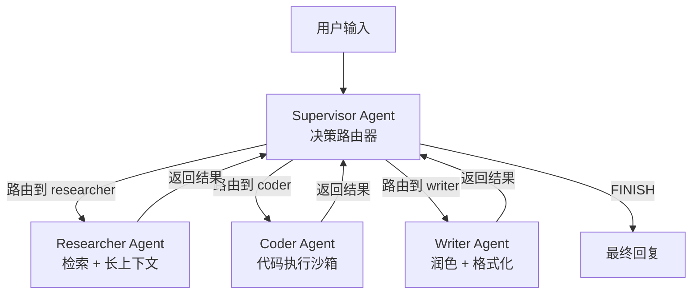
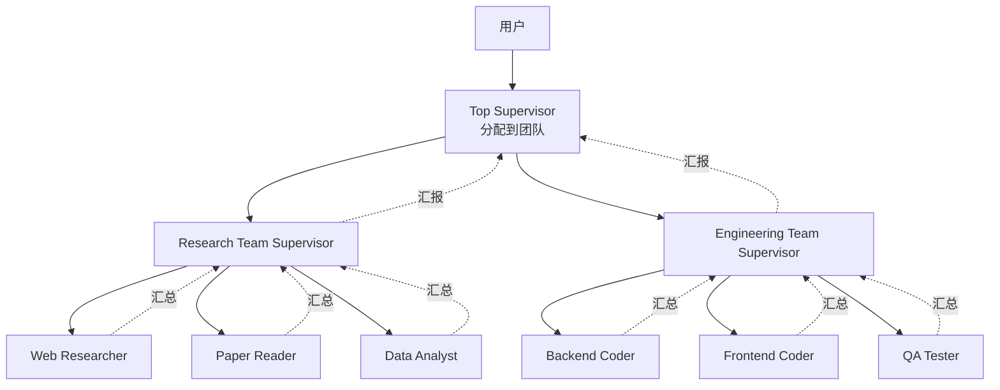
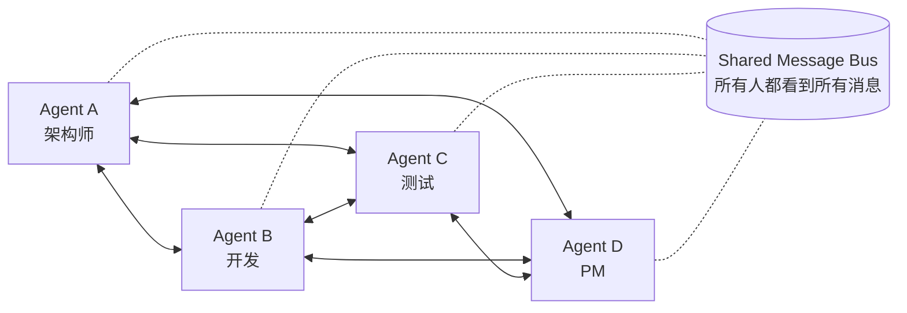
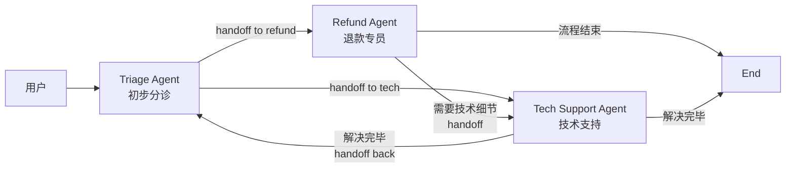

<section class="doc-hero">
  <p class="doc-hero__kicker">多 Agent 协作</p>
  <h1>多 Agent 架构模式</h1>
  <p class="doc-hero__lead">一个 Agent 塞 30 个工具开始失控、上下文越拼越乱、System prompt 互相打架——这时该不该拆成多 Agent？怎么拆？四种主流拓扑各自的边界在哪。</p>
  <div class="doc-hero__meta" aria-label="本文信息">
    <span>适合阶段：进阶 / 架构选型</span>
    <span>核心：Supervisor / Hierarchical / Network / Swarm</span>
    <span>面试重点：模式辨析 + Cognition 反方观点</span>
  </div>
</section>

> **本文边界**：聚焦四种拓扑模式的**辨析与选型**——什么时候选哪个、各自的状态怎么管。Supervisor 模式的深度展开（路由器细节、worker 设计）见 [Orchestrator-Worker 模式](./orchestrator-worker)；Agent 间的通信协议（A2A / ACP）见 [Agent 间通信](./communication)；辩论 / 投票 / 评审者等协作策略见 [协作模式](./collaboration)；具体框架案例（MetaGPT / ChatDev）见 [MetaGPT / ChatDev 案例](./metagpt-chatdev)。

## 面试官想考什么

读完这篇你要能正面回答下面这些题。每题后面括号里是面试官真正想看你答出什么。

<div class="interview-grid">
  <div>
    <strong>什么时候必须用多 Agent？什么时候单 Agent 反而更好？</strong>
    <span>考边界判断——能不能识别"伪多 Agent 需求"，避免无脑堆 Agent。</span>
  </div>
  <div>
    <strong>Supervisor、Hierarchical、Network、Swarm 各自的核心差异？</strong>
    <span>考四种拓扑的辨析能力，2025 面试高频。</span>
  </div>
  <div>
    <strong>多 Agent 之间的上下文怎么共享？shared state 还是 message passing？</strong>
    <span>考状态管理设计——直接决定系统能不能 debug。</span>
  </div>
  <div>
    <strong>Cognition 写过《Don't Build Multi-Agents》，他们的核心论点是什么？怎么反驳？</strong>
    <span>考对行业争议的认知——能不能讲清两派立场。</span>
  </div>
  <div>
    <strong>多 Agent 串行调用比单 Agent 慢得多，怎么优化延迟？</strong>
    <span>考工程实操——并行化、缓存、模型分级的综合应用。</span>
  </div>
  <div>
    <strong>上游 Agent 出错怎么传播到下游？怎么做错误隔离？</strong>
    <span>考分布式系统视角——多 Agent 本质是 RPC 链路。</span>
  </div>
  <div>
    <strong>Swarm 模式的 handoff 和 Supervisor 的路由有什么本质区别？</strong>
    <span>考细节辨析——很多候选人会混为一谈。</span>
  </div>
  <div>
    <strong>Anthropic 的 Multi-Agent Research System 为什么用 orchestrator + parallel subagent？</strong>
    <span>考对真实工业案例的阅读，能不能讲清"为什么这种场景适合多 Agent"。</span>
  </div>
</div>

---

## 为什么需要多 Agent：单 Agent 在哪些场景会崩

先看一个真实的崩溃过程。假设你做了一个"全能助理 Agent"：

```python
tools = [
    web_search, code_executor, calculator, calendar,
    email_sender, file_reader, pdf_parser, image_gen,
    db_query, slack_send, jira_create, github_pr,
    payment_api, crm_lookup, ...   # 一共 30+ 个工具
]
agent = create_agent(model="gpt-4o", tools=tools, system_prompt=...)
```

system prompt 里要解释每个工具用法、每种场景的 SOP、每个边界 case——结果一份 system prompt 写到 8K token，模型记不全。

跑起来三个典型失败：

1. **工具选错**——用户问"帮我把这段会议纪要发到 Slack"，Agent 调了 `email_sender`（名字相近）
2. **角色冲突**——同一个 prompt 里既要它"作为客服礼貌回复"又要"作为运维助手简短回答 SQL"，模型在两种 persona 之间摇摆
3. **上下文污染**——前 5 轮对话讨论代码 review，第 6 轮用户问"今天天气"，模型把代码 review 的思路带进来，回答"建议增加单元测试"

**这是单 Agent 在 30+ 工具、跨领域任务下的典型表现**。Anthropic 在 [Building Effective Agents](https://www.anthropic.com/research/building-effective-agents) 里直接给了经验：**一个 Agent 维护 5-10 个工具是上限**，超过就该考虑拆分。

多 Agent 解决的是这三类问题：

- **关注点分离**——每个 Agent 只看自己的工具集，prompt 短、决策准
- **专业化分工**——一个 research agent 用 long-context 模型 + 检索工具，一个 code agent 用 code-tuned 模型 + 执行沙箱，各自最优配置
- **可扩展性**——加新能力时只加 Agent，不污染现有 Agent 的 prompt

> 但**这不意味着所有 Agent 都该拆成多个**。下一节解释什么时候 NOT 用多 Agent。

---

## 什么时候 NOT 用多 Agent

2024 年 6 月 Cognition（Devin 的团队）发了篇 [Don't Build Multi-Agents](https://cognition.ai/blog/dont-build-multi-agents) 引爆讨论，核心观点是：**多数情况下多 Agent 反而让事情更糟**。他们的论据值得每个做 Agent 的人认真读一遍：

1. **上下文割裂**——subagent 看不到 parent agent 的完整思考过程，只能拿到 parent 转发的"任务描述"，决策质量必然下降
2. **决策冲突**——subagent A 写代码假设用 React、subagent B 写代码假设用 Vue，没人协调
3. **错误传播**——subagent 早期的错误一路放大，最后 orchestrator 收到的是已经被多层污染的结果
4. **调试地狱**——一次失败可能涉及 5 个 Agent 的 20 次 LLM 调用，trace 起来根本看不清

他们的结论：**优先把单 Agent 做强（更好的工具、更好的上下文、更好的 prompt），而不是急着拆**。

实践里**不要用多 Agent 的几种场景**：

| 场景 | 为什么不该拆 |
|---|---|
| 简单 CRUD / 单步问答 | 一个 ReAct Agent 就能解决，拆了徒增延迟和成本 |
| 实时低延迟（< 1s） | 多 Agent 串行 LLM 调用，每个 1-3s，总延迟难压下来 |
| 任务高度耦合 / 上下文不可分 | 强行拆只会让每个 subagent 都缺关键信息 |
| 团队还没有 trace / 评估能力 | 多 Agent 不可观测就等于黑盒，先把单 Agent 做扎实再说 |
| 预算紧张 | 多 Agent token 用量是单 Agent 的 3-15 倍（Anthropic 自己测的数字） |

**反过来，必须用多 Agent 的场景**：

- 任务天然可并行（"搜 10 个独立子主题"——并行 subagent 比串行快 10 倍）
- 角色差异大且工具集不重叠（产品经理 / 工程师 / 测试，互相用不上对方工具）
- 需要不同模型分级（便宜模型做分类、贵模型做生成）
- 需要清晰的 audit trail（每个 Agent 的输入输出独立可追溯，合规友好）

> Anthropic 在 [How we built our multi-agent research system](https://www.anthropic.com/engineering/built-multi-agent-research-system) 给了一个具体数字：他们的多 Agent research system **token 用量是单 Agent 的 ~15 倍**，但在复杂研究任务上表现显著超过单 Agent——这是用 15 倍成本换质量提升的权衡，不是免费午餐。

记住核心判断：**先用单 Agent 撑到不能再撑，再拆多 Agent**。

---

## 四种核心拓扑模式

下面是当前业界共识的四种主流多 Agent 拓扑。每种的核心差异在**控制流走向**和**状态共享方式**。

### 模式总览表

| 模式 | 控制流 | 状态共享 | 决策路径 | 容错性 | 适用场景 |
|---|---|---|---|---|---|
| **Supervisor** | 中心化（supervisor 调度 workers） | shared state 或 message passing | 可路由 + 结果汇总 | 单点（supervisor 挂全挂） | 任务可分类、明确路由 |
| **Hierarchical** | 多层嵌套（CEO → Manager → Worker） | 分层 state，按层级传递 | 多层路由 + 层级汇报 | 单点但分层隔离 | 复杂业务、子任务可再分解 |
| **Network** | 去中心化（Agent 间任意通信） | 全局共享 message bus | 自主决定下一跳 | 无单点但易死循环 | 开放式协作、圆桌讨论 |
| **Swarm** | 控制权转移（handoff） | 跟随控制流转移 | 每个 Agent 决定移交给谁 | 中等（依赖 handoff 正确性） | 工作流明确但分支多（如客服分诊） |

下面逐个展开。

---

## 模式 1：Supervisor（监督者）模式

**最常用**，LangGraph 官方教程的主推模式。结构：一个 supervisor agent 在中间做决策路由，下面 N 个 worker agent 各管一个领域。

### 拓扑图



### 它实际做了什么

每一轮，supervisor 接收当前 state（含用户消息和到目前为止所有 worker 的输出），输出一个决策：要么调度某个 worker、要么宣布 FINISH。worker 跑完把结果加回 state，控制权回到 supervisor，循环直到 FINISH。

伪代码骨架：

```python
def supervisor(state):
    # supervisor 是一个特殊的 LLM 调用，输出 routing decision
    decision = llm.invoke(
        system="你是调度员。根据当前进展，选择下一个 worker：researcher / coder / writer / FINISH",
        messages=state.messages,
    )
    return {"next": decision}  # 路由信号

def worker_researcher(state):
    result = llm_with_tools.invoke(state.messages, tools=[web_search])
    return {"messages": [result]}  # 结果回写
```

### 适用场景

- **任务可以清晰分类**：写代码、查资料、生成报告——能映射到固定的 worker 集合
- **每个 worker 有独立工具集**：worker 间工具不重叠，supervisor 的决策才有意义
- **需要中心化协调**：保证不同 worker 输出能拼起来

### 不适用场景

- supervisor 本身分不清该路由给谁（任务过于模糊）→ supervisor 变成瓶颈
- worker 间需要频繁互相调用 → 中心化 supervisor 反而成阻塞

**Supervisor 模式的深度展开（路由器实现、worker 设计、handoff back 细节）独立成篇在 [Orchestrator-Worker 模式](./orchestrator-worker)。本文只给骨架，下面"实战代码"小节会有完整 LangGraph 实现。**

---

## 模式 2：Hierarchical（层级）模式

把 Supervisor 模式递归嵌套——一个顶层 supervisor 下面挂多个中层 supervisor，每个中层 supervisor 又管自己的 worker 团队。CEO → Manager → IC 的组织架构类比。

### 拓扑图



### 适用场景

- **业务天然分层**：大型研究任务（金融、医学、法律），顶层先决定走哪条研究路线，再分配具体子任务
- **子任务还能再分解**：一个 worker 收到任务后发现自己也需要"调度团队"才能完成
- **不同层级用不同模型**：CEO 用贵但强的 Opus 做战略决策，IC 用便宜的 Haiku 做执行

### 工业案例

- **MetaGPT** ([github.com/geekan/MetaGPT](https://github.com/geekan/MetaGPT)) 的 SOP 架构本质就是 Hierarchical：Product Manager → Architect → Engineer → QA，每层 supervisor 把任务拆给下层
- **AutoGen** 的 GroupChatManager 嵌套也属于这一类
- **Anthropic 的 Multi-Agent Research System** 在复杂查询时会分 2-3 层：Lead Agent 拆任务给 Search Agent，Search Agent 再分配给 Subsearch Agent

### 难点

- **层级深 → 延迟爆炸**：3 层结构每次请求要 3-5 次 LLM 调用，端到端延迟轻松到 30s+
- **错误放大**：底层 worker 一个错，经过 2 次"汇总-汇报"被层层包装，顶层根本看不出来
- **上下文丢失**：CEO 给 Manager 的指令、Manager 给 IC 的指令、IC 返回 Manager、Manager 返回 CEO——每次转述都丢一点信息（Cognition 反对多 Agent 的核心论据正是这个）

**经验**：层级不要超过 3 层。超过就是在用工程复杂度对冲设计偷懒。

---

## 模式 3：Network（网络）模式

去中心化——所有 Agent 都看到同一个共享 message stream，每个 Agent 自主决定"现在该不该我发言""该把控制权给谁"。圆桌讨论的隐喻。

### 拓扑图



### 它实际做了什么

不存在中心调度——每个 Agent 看到 message bus 后，自己判断"这个问题是不是该我答""我答完之后该 @谁"。LangGraph 的 [Multi-Agent Network](https://langchain-ai.github.io/langgraph/concepts/multi_agent/) 实现里，每个 Agent 是一个节点，节点之间的边是"可能的下一跳"，由 LLM 自己用 tool call 形式决定。

### 适用场景

- **开放式协作**：辩论、头脑风暴、多视角评审——没有"正确路径"，需要碰撞
- **角色平等**：没有谁是"老大"，每个角色都可能发起话题
- **需要涌现行为**：MetaGPT、ChatDev 中"软件公司"的圆桌讨论环节

### 真实案例

- **ChatDev**（清华开源的虚拟软件公司，[github.com/OpenBMB/ChatDev](https://github.com/OpenBMB/ChatDev)）中各角色（CEO / CTO / Programmer / Tester / Designer）的协作环节
- **AutoGen 的 GroupChat** 默认就是 Network 模式（不指定 manager 时）
- **Generative Agents**（斯坦福小镇）里 NPC 之间的对话——每个 Agent 自主决定是否发起对话

### 致命问题

- **死循环**：A 把球踢给 B、B 踢回 A、A 又踢回 B...... 没有 supervisor 拍板就停不下来。常见解法是设全局轮数上限（max_rounds=20）
- **谁都不发言**：A、B、C 都觉得"这事不归我管"，message bus 卡死
- **token 爆炸**：每个 Agent 都看完整 message bus，N 个 Agent 跑 K 轮就是 N×K 倍单 Agent 成本
- **不可预测性**：同样输入跑两次结果可能完全不同——production 系统的噩梦

> Network 模式是**研究价值高、生产慎用**的典型。如果不能容忍不确定性，加一个轻量 supervisor 收敛到 Supervisor 模式。

---

## 模式 4：Swarm（蜂群）模式

OpenAI 2024 年 10 月发的 [Swarm](https://github.com/openai/swarm) 推广的范式——Agent 之间通过 **handoff** 把控制权显式转移给另一个 Agent，状态跟着控制流走。

### 拓扑图



### 核心机制：handoff

不像 Supervisor 用"中心调度"，也不像 Network 用"自由发言"——Swarm 里每个 Agent 把"handoff to X"做成一个工具：

```python
def transfer_to_refund_agent():
    """当用户问题涉及退款时，调用此函数移交对话"""
    return refund_agent
```

调用这个工具的语义不是"调用一个 worker"，而是"**我不管了，接下来你来管**"。当前 Agent 的 context（包括 messages、变量）一起转移给新 Agent，由新 Agent 继续接管对话。

### 适用场景

- **工作流明确但分支多**：客服分诊（先 Triage 判断是退款 / 技术 / 投诉，再 handoff 给对应专员）
- **状态需要跟随场景流动**：从售前转售后的对话，整个对话上下文都要带走
- **需要可解释的对话流转**：每个 handoff 都是显式的工具调用，trace 清晰

### 工业案例

- **OpenAI Swarm**（实验性框架，后被 [OpenAI Agents SDK](../frameworks/openai-agents-sdk) 取代为生产版本）
- **OpenAI Agents SDK** 的 handoffs 是 Swarm 思想的工业化封装
- 很多客服系统的"转接专员"流程本质就是 Swarm——一通电话从前台到技术支持到经理，每次转接都是 handoff

### 和 Supervisor 的本质区别

这是面试高频混淆点：

| 维度 | Supervisor | Swarm |
|---|---|---|
| 控制流 | 控制权始终在 supervisor，worker 是"被调用者" | 控制权在当前活跃的 Agent，handoff 后就转移了 |
| 谁决定下一步 | Supervisor（每轮回到 supervisor 决策） | 当前 Agent 自己（调用 handoff 工具决定） |
| state 流动 | shared state，所有人写同一个 | state 跟着控制流转移（Swarm 也可以全局 shared，但语义是"传递"） |
| 类比 | 项目经理调度多个 IC | 客服分机互相转接电话 |
| 决策权回退 | 自然回到 supervisor | 必须显式 handoff back（如 `transfer_back_to_triage`） |

**记忆口诀**：Supervisor 像中央调度的出租车公司，Swarm 像同事之间转交工单。

---

## 决策树：四种模式怎么选

把上面四种模式的选择逻辑画成一张图：

```mermaid
flowchart TD
    Start[需要多 Agent 吗?] --> Q1{任务能用<br/>单 Agent + 5-10 个工具<br/>完成吗?}
    Q1 -->|是| Single[用单 Agent<br/>不要拆]
    Q1 -->|否| Q2{任务可以<br/>清晰分成几类<br/>由专门 Agent 处理?}
    Q2 -->|否| Network[Network 模式<br/>慎用,只在研究/创意场景]
    Q2 -->|是| Q3{需要<br/>子任务再分解吗?<br/>层级 > 2?}
    Q3 -->|是| Hierarchical[Hierarchical 模式<br/>但层级不超 3]
    Q3 -->|否| Q4{控制权是<br/>"始终回到调度者"<br/>还是"显式转移"?}
    Q4 -->|始终回到调度者| Supervisor[Supervisor 模式<br/>最稳、最推荐]
    Q4 -->|显式转移| Swarm[Swarm 模式<br/>适合分诊/转接场景]
```

**实战经验**：

1. **90% 场景选 Supervisor**——可控、可调试、社区资料最多
2. **客服 / 分诊场景选 Swarm**——天然契合"转接专员"的语义
3. **复杂研究 / 大型项目选 Hierarchical**——但用 2 层就够，3 层是上限
4. **Network 优先用于探索性场景**——不要 production 直接上

---

## 实战：用 LangGraph 实现 Supervisor 模式

下面是一段可跑的代码，用 LangGraph 实现"研究助手 + 代码助手"的 Supervisor 模式。这是最常用的 60+ 行模板。

```python
# pip install langgraph langchain-openai langchain-community
from typing import Literal, TypedDict, Annotated
from langgraph.graph import StateGraph, START, END, MessagesState
from langchain_openai import ChatOpenAI
from langchain_core.messages import HumanMessage, SystemMessage
from langchain_core.tools import tool
from langgraph.prebuilt import create_react_agent

# 1. 工具定义：两个 worker 各自的工具集
@tool
def web_search(query: str) -> str:
    """模拟网页搜索。生产中接 Tavily / Brave / Bing。"""
    return f"[搜索结果] {query} 的最新研究表明 ..."

@tool
def execute_python(code: str) -> str:
    """模拟 Python 执行沙箱。生产中接 e2b / Riza。"""
    return f"[执行结果] 代码运行完毕，输出 42"

# 2. 两个 worker agent：各自只看到自己的工具
llm = ChatOpenAI(model="gpt-4o-mini", temperature=0)
researcher = create_react_agent(llm, tools=[web_search],
    state_modifier="你是研究员。只用搜索工具找资料，不要写代码。")
coder = create_react_agent(llm, tools=[execute_python],
    state_modifier="你是工程师。只用 Python 执行验证想法，不要再搜资料。")

# 3. supervisor:用 structured output 输出 routing decision
ROUTE_OPTIONS = ["researcher", "coder", "FINISH"]

class Router(TypedDict):
    next: Literal["researcher", "coder", "FINISH"]

SUPERVISOR_PROMPT = """你是调度员。根据对话进展，决定下一步:
- researcher: 用户需要查找资料、阅读文献、了解概念时
- coder: 需要写代码验证、跑数据、执行计算时
- FINISH: 已经有完整答案,可以回复用户时
不要重复调用刚刚跑过的 worker(除非它说明确表示需要补充信息)。"""

def supervisor_node(state: MessagesState):
    msgs = [SystemMessage(content=SUPERVISOR_PROMPT)] + state["messages"]
    decision = llm.with_structured_output(Router).invoke(msgs)
    return {"next": decision["next"]}

# 4. worker 节点:用 worker agent 跑一轮,把结果加回 state
def researcher_node(state: MessagesState):
    result = researcher.invoke(state)
    # 给消息打标签,supervisor 才知道这是 researcher 的输出
    last = result["messages"][-1]
    last.name = "researcher"
    return {"messages": [last]}

def coder_node(state: MessagesState):
    result = coder.invoke(state)
    last = result["messages"][-1]
    last.name = "coder"
    return {"messages": [last]}

# 5. 路由函数:从 supervisor 决策中读 next
def route_next(state) -> Literal["researcher", "coder", END]:
    return END if state["next"] == "FINISH" else state["next"]

# 6. 构图
class State(MessagesState):
    next: str

graph = StateGraph(State)
graph.add_node("supervisor", supervisor_node)
graph.add_node("researcher", researcher_node)
graph.add_node("coder", coder_node)

graph.add_edge(START, "supervisor")
graph.add_conditional_edges("supervisor", route_next,
    {"researcher": "researcher", "coder": "coder", END: END})
# worker 完成后回到 supervisor 再决策
graph.add_edge("researcher", "supervisor")
graph.add_edge("coder", "supervisor")

app = graph.compile()

# 7. 跑起来
result = app.invoke({
    "messages": [HumanMessage(content="查一下 LLaMA 4 的参数量,再写代码估算它的推理显存")],
})
for m in result["messages"]:
    print(f"[{getattr(m, 'name', m.type)}] {m.content[:200]}")
```

几个关键设计：

- **worker 用 `create_react_agent`**：每个 worker 是完整 ReAct Agent，可以多轮工具调用直到完成自己的子任务才回 supervisor
- **`name` 字段标识来源**：supervisor 看 message 时能区分"这是 researcher 说的还是 coder 说的"，避免错乱
- **structured output 输出路由决策**：用 `Router` TypedDict 强约束 supervisor 必须输出三个值之一，不会拿到模糊文本
- **worker → supervisor 回路**：每个 worker 完成后回 supervisor 再决策，不是直接 END——这是 Supervisor 模式区别于一次性 routing 的关键
- **state 共享**：所有 Agent 看到同一个 messages 列表（MessagesState 默认 append-only），shared scratchpad 的实现

---

## 状态管理：shared state vs message passing

多 Agent 系统里 state 怎么共享是核心架构决策。两种模式：

### Shared State（共享状态）

所有 Agent 操作同一个全局 state 对象。LangGraph 默认走这条路。

```python
class GlobalState(TypedDict):
    messages: list
    research_findings: dict
    code_results: list
    user_intent: str
```

- **优点**：所有 Agent 看到一致视图、信息不丢失、易于实现 reduce 逻辑
- **缺点**：并发写入需要 reducer 处理冲突（LangGraph 的 `add_messages` reducer 解决这个）；state 越大单次传递越贵

### Message Passing（消息传递）

每个 Agent 只接收前一个 Agent "发"给它的特定消息，没有全局视图。

- **优点**：天然解耦、每个 Agent 上下文最小化、容易做安全边界
- **缺点**：信息必须显式传递，遗漏了就丢；难做"回看历史"

### 工业选择

- **LangGraph / AutoGen**：shared state（messages 列表所有 Agent 都看到）
- **OpenAI Agents SDK**：handoff 模式下控制权和 state 一起转移
- **Anthropic Multi-Agent Research**：lead agent 持 state，subagent 只收到 task description（隔离上下文）

**经验**：Supervisor / Hierarchical 用 shared state；Swarm 用 state 跟随 handoff；Network 必须 shared 否则没法"圆桌讨论"。

---

## 错误传播与隔离

多 Agent 本质是一条 RPC 链路——上游错下游一起错。三种典型故障模式：

### 模式 1：错误信息被当作正常输入

上游 researcher 查不到资料返回 `"[Error] API timeout"`，下游 coder 拿到这个文本字符串当成"研究结论"，开始基于"错误信息"编代码。

**修法**：每个 worker 必须显式返回结构化结果（`{"status": "success/error", "result": ..., "error": ...}`），supervisor 根据 status 决定重试 / fallback / 终止。

### 模式 2：上游幻觉污染下游

researcher 编造了一个不存在的论文标题，coder 基于这个标题去找代码、当然找不到，重试 5 次还不放弃。

**修法**：在 Agent 之间加 **verifier**——把上游输出过一遍事实校验（搜索 API 验证论文是否存在、code linter 验证语法合法）才传给下游。详见 [协作模式](./collaboration) 中的"评审者"模式。

### 模式 3：错误在 supervisor 处放大

supervisor 看不到某个 worker 失败的根因，反复路由给同一个 worker 期望成功——形成死循环。

**修法**：
- 每个 worker 调用计数，超过 N 次自动终止
- worker 失败时返回 explanatory error 给 supervisor，让 supervisor 知道"换个思路"
- 设全局 max_iterations（LangGraph 默认 25）

### 容错设计原则

| 原则 | 怎么做 |
|---|---|
| **失败要显式** | worker 不要把 error 当成 text 返回 |
| **重试要有限** | 每个 worker 至多重试 2-3 次 |
| **状态要可回滚** | LangGraph 的 checkpoint 让你能从任意节点重启 |
| **隔离要彻底** | 一个 worker 的 sandbox 崩了不能拖垮其他 worker |

---

## Anthropic vs Cognition：两种声音

2024-2025 这两篇博客是多 Agent 领域必读的两个对立观点：

### Anthropic：[How we built our multi-agent research system](https://www.anthropic.com/engineering/built-multi-agent-research-system)

**核心观点**：在**复杂研究类任务**上，orchestrator + parallel subagent 显著优于单 Agent。

- 关键场景：研究类查询天然可分解为独立子主题（"分析 5 家公司的财报"——5 个 subagent 并行）
- 关键收益：并行化把延迟从 N 倍降到接近 1 倍，subagent 用独立上下文窗口避免污染
- 关键代价：token 用量是单 Agent 的 ~15 倍，需要严格的 prompt engineering 和 eval

### Cognition：[Don't Build Multi-Agents](https://cognition.ai/blog/dont-build-multi-agents)

**核心观点**：多数 Agent 应用，**多 Agent 反而让事情变差**。

- 关键论点：subagent 看不到 parent 的完整 reasoning trace，决策必然次优
- 实战教训：他们做 Devin 的过程中尝试过多 Agent，最终发现"让一个 Agent 看完整上下文 + 给它最好的工具"比拆分更好
- 推荐做法：先把单 Agent 的上下文管理和工具设计做到极致，再考虑拆

### 怎么调和

两边都有道理。判断准则：

- **任务能不能天然并行**？能 → Anthropic 路线（多 subagent 并行可以省时间）
- **subagent 是否需要看到 parent 的完整 reasoning** 才能做对决策？需要 → Cognition 路线（单 Agent 更好）
- **是否有清晰的角色边界**（researcher vs coder）？有 → 可以多 Agent；没有 → 别拆

> **统一判断**：多 Agent 不是默认选项，是"单 Agent 真的撑不住才用"。

---

## 容易踩的坑

### 坑 1：盲目堆 Agent

**现象**：把任何能拆的都拆——一个简单 RAG 拆成"retriever agent + reranker agent + generator agent"，比单 Agent 慢 3 倍、贵 5 倍、效果还差。

**根因**：把"模块"误当成"Agent"。Retriever / reranker 本质是确定性函数，没有"决策"和"工具选择"——根本不需要 LLM 驱动。

**修法**：Agent = "需要 LLM 做决策的执行单元"。确定性步骤用函数 / chain 实现，不要包装成 Agent。详见 [Workflow vs Agent](../workflow/workflow-vs-agent) 的辨析。

### 坑 2：shared state 没有 reducer，并发写入丢消息

**现象**：两个 worker 并行跑，supervisor 收到的 state 里只有一个 worker 的结果——另一个被覆盖了。

**根因**：LangGraph 默认 state 字段是 last-write-wins，并发写 `state["messages"] = [...]` 会互相覆盖。

**修法**：用 `Annotated[list, add_messages]` 或自定义 reducer，明确并发写入语义（append / merge / max）。LangGraph 的 [How to handle multiple updates](https://langchain-ai.github.io/langgraph/how-tos/state-reducers/) 文档讲得很清楚。

### 坑 3：错误悄悄传到下游

**现象**：上游返回 `"抱歉,我无法完成这个任务"`，下游 LLM 把这句话当成"任务描述"继续操作，产出灾难性输出。

**根因**：worker 之间没用结构化结果协议，错误信息和正常输出混在 text 里。

**修法**：所有 worker 返回 `{"status": "ok"/"error", "payload": ..., "error_msg": ...}`，supervisor 必须先检查 status 再用 payload。

### 坑 4：成本爆炸却没人发现

**现象**：上线后第一个月账单是预期的 5 倍，拆开一看 80% 成本花在 supervisor 反复 routing 上——supervisor 每轮都把完整 message history 喂一遍模型。

**根因**：没区分"supervisor 决策需要的最小上下文"和"worker 执行需要的完整上下文"。supervisor 其实只需要看每个 worker 的 summary 就够，不需要每轮看 50K token。

**修法**：
- supervisor 用便宜模型（GPT-4o-mini / Haiku），决策不需要旗舰
- supervisor 看 condensed view（每个 worker 输出的一行 summary），不看完整 message
- 配套 [成本优化](../engineering/cost-optimization) 的 prompt cache 把稳定的 system prompt 缓存

### 坑 5：Network 模式死循环

**现象**：Agent A 和 Agent B 互相 @ 对方，连续 30 轮 message 都是 "@A 你看这个对吗" / "@B 我觉得你说得对" 互相吹捧，task 一点没推进。

**根因**：Network 模式没有"终止判断"的中心，Agent 自己不知道该不该停。

**修法**：
- 设全局 `max_rounds`（如 20），超过强制结束
- 加 monitor agent 周期性检查"是否在重复" / "是否有实质进展"，没进展就 abort
- 或者退化成 Supervisor 模式——加一个 manager 拍板"够了，FINISH"

---

## 与相关概念的辨析

| 概念 | 边界 |
|---|---|
| **本文（多 Agent 拓扑）** | 多 Agent 之间的控制流和状态共享拓扑 |
| **[Orchestrator-Worker](./orchestrator-worker)** | Supervisor 模式的深度展开，是本文模式 1 的子集 |
| **[Agent 间通信](./communication)** | A2A / ACP 等通信协议——拓扑之上的"传输层" |
| **[协作模式](./collaboration)** | 辩论 / 投票 / 评审者等"协作策略"——拓扑之内的具体行为模式 |
| **[ReAct](../agent/react-pattern)** | 单 Agent 的内部决策循环——多 Agent 拓扑里每个 Agent 内部通常就是 ReAct |
| **[Plan-and-Execute](../agent/plan-execute)** | 单 Agent 的"先规划后执行"——和 Hierarchical 表面相似但拓扑不同（前者是单 Agent 内的两阶段） |
| **[Workflow](../workflow/langgraph)** | 静态图编排——多 Agent 是 workflow 的特殊形式（节点是 LLM Agent） |
| **[OpenAI Agents SDK](../frameworks/openai-agents-sdk)** | Swarm 模式的工业级实现，是本文模式 4 的具体框架 |

**关键辨析**：

- **多 Agent vs 多步 Workflow**：多 Agent 强调"每个节点都是有自主决策的 LLM"；workflow 节点可以是任何函数。区分见 [Workflow vs Agent](../workflow/workflow-vs-agent)
- **Plan-and-Execute vs Hierarchical**：前者是**单 Agent 内**先生成 plan 再执行；后者是**多 Agent 间**的层级调度。容易混淆是因为都有"上层规划 + 下层执行"的形态
- **Supervisor 路由 vs Swarm handoff**：路由是"借调"（worker 跑完回 supervisor），handoff 是"移交"（控制权转走）

---

## 面试题深度解析

### Q: 什么时候必须用多 Agent？什么时候单 Agent 反而更好？

**30 秒版本**：必须用多 Agent 的场景三个特征——(1) 任务**天然可并行**（如同时分析 10 个独立文档）；(2) 角色差异大且**工具集不重叠**（researcher 用搜索、coder 用沙箱，互相用不上）；(3) 需要**清晰的 audit trail**（合规场景每个 Agent 独立可追溯）。单 Agent 更好的场景反过来——任务高度耦合、需要看到完整 reasoning 才能决策、延迟敏感、预算紧。**默认应该是单 Agent**，单 Agent 撑不住才拆。Cognition 在《Don't Build Multi-Agents》里讲得很清楚：subagent 拿不到 parent 的完整 reasoning，决策质量必然次优——这是多 Agent 的根本性代价。

**追问 1**：那 Anthropic 为什么主推多 Agent？两家观点矛盾吗？
不矛盾，他们针对的场景不同。Anthropic 的 Research System 针对的是"复杂研究查询"——这类任务**天然可分解**（"分析 5 家公司的财报" = 5 个独立子任务），并行 subagent 能把端到端延迟从 5N 降到 N，质量也更高（每个 subagent 用独立 context window 避免污染）。Cognition 做的是 Devin 这种**编程 Agent**——子任务高度耦合（改一个文件可能影响整个项目），拆 subagent 反而丢失全局视野。**判断准则就一句话**：任务能不能拆成**独立**子任务？能 → 多 Agent；不能 → 单 Agent。

**追问 2**：怎么判断"独立"？
三个 lit test：(1) **数据独立**——子任务 A 的输出不依赖子任务 B 的输出？(2) **决策独立**——做子任务 A 时不需要知道子任务 B 的中间过程？(3) **上下文独立**——子任务 A 用的资料和子任务 B 用的资料几乎不重叠？三个都 yes → 适合并行 subagent；任一是 no → 单 Agent 更安全。比如"研究 5 家公司"yes，"重构一个 monorepo"no——前者公司间独立，后者文件间高度耦合。

### Q: Supervisor、Hierarchical、Network、Swarm 各自的核心差异？

**30 秒版本**：四个模式的差异在**控制流**和**状态语义**。**Supervisor**：中心化调度，supervisor 决定每轮调谁，worker 跑完回到 supervisor——最稳、最常用。**Hierarchical**：Supervisor 模式的多层嵌套，CEO → Manager → Worker，适合复杂业务但层级不要超 3。**Network**：去中心化，所有 Agent 看共享 message bus，自主决定发言——适合辩论 / 头脑风暴但容易死循环、不可预测。**Swarm**：通过 handoff 显式转移控制权，状态跟着控制流走——适合客服分诊 / 转接专员这种"工作流明确但分支多"的场景。**90% 生产场景应该选 Supervisor**，Swarm 用于客服类、Hierarchical 用于复杂研究、Network 优先用于探索。

**追问 1**：Supervisor 和 Swarm 看起来很像，本质区别是什么？
本质区别在**控制权归属**。Supervisor 模式下控制权**始终在 supervisor 手里**——worker 是"被调用的函数"，跑完结果回 supervisor 由它决定下一步。Swarm 模式下控制权**随 handoff 转移**——当前活跃的 Agent 自己决定是否 handoff、handoff 给谁，移交后**它就退出了**，不会自动收回控制权。类比：Supervisor 像出租车公司的中央调度（调度员始终在），Swarm 像同事间传工单（工单到谁手里就归谁管）。所以 Swarm 通常需要显式定义 `transfer_back_to_X`，Supervisor 不需要（自然回到 supervisor）。

**追问 2**：Hierarchical 和 Plan-and-Execute 有什么区别？两者都是"先规划后执行"。
关键区别在**单 Agent 内 vs 多 Agent 间**。Plan-and-Execute 是**单 Agent** 的两阶段——同一个 LLM 先用一次调用生成 plan，再循环执行每步，整个过程都是一个 Agent。Hierarchical 是**多 Agent** 的层级调度——CEO Agent 把任务分给 Manager Agent，Manager 再分给 Worker Agent，每层是独立 Agent 实例、独立 prompt、可能用不同模型。表面相似（都有"上层规划下层执行"），但工程实现完全不同：Plan-and-Execute 看 [Plan-and-Execute 模式](../agent/plan-execute)；Hierarchical 看本文。

### Q: Cognition 反对多 Agent 的核心观点是什么？怎么反驳？

**30 秒版本**：Cognition 在《Don't Build Multi-Agents》里提了四个核心论点：(1) **上下文割裂**——subagent 看不到 parent 的完整 reasoning trace，决策质量必然次优；(2) **决策冲突**——多个 subagent 各自决策可能互相矛盾（A 假设 React、B 假设 Vue）；(3) **错误放大**——subagent 的早期错误经过层层传递被放大；(4) **调试地狱**——一次失败涉及多个 Agent 的多次调用，trace 不清晰。他们的结论是**优先把单 Agent 做强**——更好的工具、更长的上下文、更精的 prompt——而不是急着拆。

**追问**：怎么反驳？
不是反驳，是**限定适用范围**。Cognition 的观点对**高度耦合的任务**（如改一个 monorepo 的代码）完全成立——这种场景拆 subagent 就是丢全局视野。但对**天然可分解的任务**（如 Anthropic 的 research、"分析 10 家公司"），并行 subagent 的收益远大于代价——延迟降 N 倍、每个 subagent 用独立 context window 避免污染。所以两派不矛盾，**Cognition 警告"不要乱拆"，Anthropic 演示"该拆的时候怎么拆好"**。判断准则前面讲了：子任务是否独立。生产实践应该是"默认单 Agent，明确证明能从拆分中获益才拆"——这是综合两边后的工程立场。

### Q: 多 Agent 比单 Agent 慢，怎么优化？

**30 秒版本**：四个手段按性价比排序。(1) **并行化 subagent**——独立子任务并行而非串行，Anthropic Research System 的关键设计，延迟从 N 倍降到 1 倍；(2) **模型分级**——supervisor 用 Haiku/mini（决策不需要旗舰），worker 按任务复杂度选模型，详见 [成本优化](../engineering/cost-optimization) 的 routing；(3) **prompt cache**——supervisor 的 system prompt 和工具列表是稳定的，开 cache 命中率 90%+；(4) **condensed state**——supervisor 不需要看每个 worker 的完整 token 输出，只看 summary，state 体积降 80%。这四个手段叠加通常能把多 Agent 延迟压到接近单 Agent 的 1.5-2 倍（而不是 5-10 倍）。

**追问**：并行化 subagent 具体怎么实现？需要注意什么？
LangGraph 用 `Send` API 触发并行节点，AutoGen 用 `asyncio.gather`，OpenAI Agents SDK 原生支持 parallel tool calls。关键注意三点：(1) **state reducer 必须正确**——并行写入要 append 或 merge，不能 last-write-wins，否则结果互相覆盖；(2) **错误隔离**——一个并行分支挂掉不能拖垮其他分支，用 try/except 或 asyncio 的 `return_exceptions=True`；(3) **超时控制**——并行的 subagent 必须设独立 timeout，否则最慢的拖累整体。Anthropic 的博客里特别强调：他们花了大量工程时间在 subagent 的并行错误处理上——这才是 multi-agent system 难做对的地方。

---

## 延伸阅读

- **博客：Anthropic — How we built our multi-agent research system** ([anthropic.com/engineering/built-multi-agent-research-system](https://www.anthropic.com/engineering/built-multi-agent-research-system))
  Anthropic 公开的 Claude Research 架构——orchestrator + parallel subagent 在复杂研究查询上的工业实践。重点学他们怎么处理 subagent 并行、token 15 倍开销的权衡、prompt engineering 的具体策略。多 Agent 主张派的代表作。

- **博客：Cognition — Don't Build Multi-Agents** ([cognition.ai/blog/dont-build-multi-agents](https://cognition.ai/blog/dont-build-multi-agents))
  Devin 团队 2024 年的反方观点。讲他们在做 Devin 过程中尝试多 Agent 然后放弃的真实经验。读它建立"多 Agent 不是默认选项"的直觉——和 Anthropic 那篇对照着读，理解争议本身。

- **官方文档：LangGraph Multi-Agent Systems** ([langchain-ai.github.io/langgraph/concepts/multi_agent](https://langchain-ai.github.io/langgraph/concepts/multi_agent/))
  LangGraph 官方对四种拓扑（Network / Supervisor / Hierarchical / Custom）的标准定义和代码示例。读它建立"拓扑"作为正式概念的术语共识——很多面试问的就是这套官方分类。

- **博客：Anthropic — Building Effective Agents** ([anthropic.com/research/building-effective-agents](https://www.anthropic.com/research/building-effective-agents))
  Anthropic 关于 Agent 设计的总纲，里面有"单 Agent vs 多 Agent"决策的简洁论述。"先单 Agent 撑到不能再撑再拆"的工程立场，多次被 Anthropic 工程师在演讲中重复。

- **官方仓库：OpenAI Swarm** ([github.com/openai/swarm](https://github.com/openai/swarm))
  OpenAI 2024 年发的实验性 Swarm 框架，handoff 范式的源头。虽然现在被 [OpenAI Agents SDK](../frameworks/openai-agents-sdk) 取代为生产版本，但读它的源码（不到 1000 行）能最快理解 handoff 的本质——`return another_agent` 这么简单。

- **官方文档：OpenAI Agents SDK — Handoffs** ([openai.github.io/openai-agents-python/handoffs](https://openai.github.io/openai-agents-python/handoffs/))
  Swarm 思想的工业化实现。读它理解 handoff 在生产中的细节——input filter、handoff back、shared context 怎么管理。

- **论文：AutoGen — Enabling Next-Gen LLM Applications via Multi-Agent Conversation** ([arxiv 2308.08155](https://arxiv.org/abs/2308.08155))
  Microsoft 2023 年。AutoGen 的论文里有 GroupChat（Network 模式）、Hierarchical 的实现细节。配合 [AutoGen 源码](https://github.com/microsoft/autogen) 看 `GroupChatManager` 实现，理解 Network 模式怎么避免死循环。

- **仓库：MetaGPT** ([github.com/geekan/MetaGPT](https://github.com/geekan/MetaGPT))
  Hierarchical 模式的典型工业案例——把"软件公司 SOP"（PM → Architect → Engineer → QA）翻译成多层 supervisor。读它 `metagpt/roles/` 下的实现，理解角色 + SOP 怎么协作。

- **仓库：ChatDev** ([github.com/OpenBMB/ChatDev](https://github.com/OpenBMB/ChatDev))
  清华开源的虚拟软件公司，Network 模式的研究案例。重点看不同角色之间的对话设计——是 Network 模式能 work 的少数生产场景之一。

- **配套阅读**：[Orchestrator-Worker 模式](./orchestrator-worker) — Supervisor 模式的深度展开；[Agent 间通信](./communication) — A2A / ACP 协议；[协作模式](./collaboration) — 辩论 / 投票 / 评审者；[MetaGPT / ChatDev 案例](./metagpt-chatdev) — 工业案例剖析；[ReAct 模式](../agent/react-pattern) — 多 Agent 内每个 Agent 的内部循环；[Plan-and-Execute](../agent/plan-execute) — 单 Agent 的"规划-执行"对比；[OpenAI Agents SDK](../frameworks/openai-agents-sdk) — Swarm 思想的工业实现；[LangGraph 编排](../workflow/langgraph) — 实现多 Agent 拓扑的主流框架；[成本优化](../engineering/cost-optimization) — 多 Agent token 15 倍开销的应对策略。
