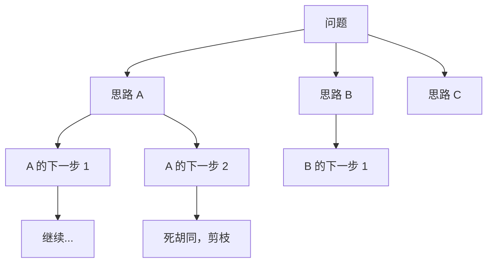

<section class="doc-hero">
  <p class="doc-hero__kicker">Prompt 工程</p>
  <h1>Chain of Thought 思维链</h1>
  <p class="doc-hero__lead">让模型先想后答——这一个简单的 prompt 技巧把 GPT 数学题准确率从 18% 提到 57%，进而催生了整个推理模型时代。</p>
  <div class="doc-hero__meta" aria-label="本文信息">
    <span>适合阶段：Prompt 进阶</span>
    <span>核心机制：把"推理"显式写出来</span>
    <span>面试重点：CoT / ToT / GoT 演进 + 推理模型关系</span>
  </div>
</section>

## 面试官想考什么

读完这篇你要能正面回答下面这些题。每题后面括号里是面试官真正想看你答出什么。

<div class="interview-grid">
  <div>
    <strong>CoT 凭什么有效？为什么"让模型多说话"能提升准确率？</strong>
    <span>考对推理时间 compute scaling 的理解。</span>
  </div>
  <div>
    <strong>"Let's think step by step" 和详细 few-shot CoT 区别在哪？</strong>
    <span>考 zero-shot CoT vs few-shot CoT。</span>
  </div>
  <div>
    <strong>CoT 在什么任务上失效？为什么？</strong>
    <span>考边界认知，CoT 不是万能。</span>
  </div>
  <div>
    <strong>ToT (Tree of Thoughts) 和 CoT 区别是什么？什么场景用 ToT？</strong>
    <span>考进阶推理结构。</span>
  </div>
  <div>
    <strong>GoT (Graph of Thoughts) 又是什么？比 ToT 强在哪？</strong>
    <span>考前沿了解。</span>
  </div>
  <div>
    <strong>推理模型（o1、R1）内置 CoT，普通模型的 CoT prompt 还有意义吗？</strong>
    <span>考新趋势认知。</span>
  </div>
  <div>
    <strong>CoT 的 hidden cost 是什么？为什么生产里要慎用？</strong>
    <span>考工程权衡，CoT 不免费。</span>
  </div>
</div>

---

## 为什么需要 CoT

考虑一道小学数学题：

```
Q: 小明有 5 个苹果，他给了小红 2 个，又买了 3 个，吃了 1 个，现在他有几个？

直接问 LLM（标准 prompt）：
A: 6 个   ← 错（正确答案 5）
```

GPT-3 (175B) 在 GSM8K 这种小学应用题上准确率只有 18%——一个 175B 参数的模型连小学题都做不对。

加一句 prompt：

```
Q: 小明有 5 个苹果...
A: 让我一步步想：
   1. 开始有 5 个
   2. 给了小红 2 个，剩 5-2=3 个
   3. 又买了 3 个，变成 3+3=6 个
   4. 吃了 1 个，剩 6-1=5 个
   所以答案是 5。
```

GSM8K 准确率 18% → 57%。同样的模型，仅仅在 prompt 里加了"step by step"——准确率三倍。这就是 Wei et al. 2022 *Chain-of-Thought Prompting Elicits Reasoning in Large Language Models* ([arxiv 2201.11903](https://arxiv.org/abs/2201.11903)) 的开创性发现。

---

## CoT 凭什么有效

理解 CoT 要从 LLM 的根本机制入手。

LLM 每次生成一个 token，**计算量是固定的**（一次 forward）。如果让它直接输出答案，复杂推理只能在"输出第一个 token 之前的一次 forward 里"完成——容量有限。

CoT 的本质：**让模型把推理过程"摊"到多个 token 上**。每个中间步骤都是一次 forward，相当于给模型更多"思考时间"。这就是 *inference-time compute scaling* 的雏形：

```
直接答：1 token 的计算 → 容易出错
CoT：100 token 的中间过程 + 1 token 答案 → 100 倍计算 → 准确率提升
```

**反直觉但重要**：模型的智能"在 token 之间流动"。让它输出更多中间 token，等于给它更多算力。

这个发现的直接演化：
1. CoT (2022)：靠 prompt 触发模型"多想"
2. Self-Consistency (2022)：多次采样 CoT 投票
3. ToT (2023)：把推理结构化成树
4. **o1 / R1 (2024-2025)：把 "多想" 训进模型权重，推理时自动展开**——这就是推理模型

CoT 是推理模型的"祖宗"。

---

## CoT 的两种触发方式

### Zero-shot CoT：一句话搞定

Kojima et al. 2022 *Large Language Models are Zero-Shot Reasoners* ([arxiv 2205.11916](https://arxiv.org/abs/2205.11916)) 发现：

```
"Q: {问题}
A: Let's think step by step."
```

仅仅加"Let's think step by step"这句话，模型就会自发生成推理过程，准确率显著提升。

中文等价：
- "让我一步步想"
- "请逐步推理后给出答案"
- "请详细列出推理过程"

**优点**：零示例成本、prompt 短。
**缺点**：推理质量不如 few-shot CoT 稳定。

### Few-shot CoT：教模型怎么推理

```
Q: 小明有 5 个苹果，给了 2 个，又买了 3 个，吃了 1 个，剩几个？
A: 让我一步步算：
   5 - 2 = 3（给完小红剩 3 个）
   3 + 3 = 6（买完后 6 个）
   6 - 1 = 5（吃完剩 5 个）
   答案：5

Q: 小红有 8 元，买了 2 支笔花了 6 元，又卖了 1 支笔得 2 元，现在有多少钱？
A: 让我一步步算：
   8 - 6 = 2（买完笔剩 2 元）
   2 + 2 = 4（卖笔得 2 元后 4 元）
   答案：4

Q: {新问题}
A:
```

通过示范"完整的推理过程"，让模型模仿这种风格生成。比 zero-shot CoT 稳定但 prompt 长。

**选择建议**：
- 简单任务：zero-shot CoT 够用
- 复杂多步推理：few-shot CoT（2-3 个示范即可）
- 推理模型：不需要 CoT prompt，它内部自动展开

---

## CoT 的进化：ToT、GoT

CoT 是线性推理——一条路走到黑。如果走错了，没法回头。

### ToT (Tree of Thoughts)

Yao et al. 2023 *Tree of Thoughts* ([arxiv 2305.10601](https://arxiv.org/abs/2305.10601)) 把推理建模成**树**：



每一步生成多个候选，用 LLM 评估每个候选的"潜力"，保留前 K 个继续展开。本质是把搜索算法（BFS / DFS / Beam Search）应用到推理过程。

**ToT 适合什么场景？**
- **状态空间大、需要回溯**的任务：解谜、规划、博弈
- **答案可验证**的任务（能给中间步骤打分）

ToT 论文里在 24 点游戏上把准确率从 4%（CoT）提到 74%——量级飞跃。

**代价**：计算量爆炸。一次推理变成几十次甚至上百次 LLM 调用。生产里很少直接用 ToT，多用其简化版（如 self-consistency）。

### GoT (Graph of Thoughts)

Besta et al. 2023 *Graph of Thoughts* ([arxiv 2308.09687](https://arxiv.org/abs/2308.09687)) 在 ToT 基础上进一步泛化——允许"合并不同路径的中间结果"，把推理结构变成**图**而非树。

```
ToT: 每条路径独立发展
GoT: 思路 A 的中间结果可以和思路 B 的中间结果合并、对照
```

适合需要"信息聚合"的任务：长文档总结、复杂代码重构。

**实际生产中**：CoT > Self-Consistency > ToT > GoT，复杂度和效果都是这个顺序。后两者多在研究/复杂规划场景使用。

---

## CoT 在什么任务上失效

CoT 不是万能。以下场景反而**有害**：

### 1. 简单事实问答

```
Q: 法国首都是哪里？
直接答: 巴黎          ← 正确
CoT: 让我想想... 法国是欧洲国家，首都通常是 ... 嗯，巴黎     ← 多余 + 偶尔出错
```

CoT 引入了不必要的中间步骤，反而增加出错概率。这种"模型一看就知道"的任务，直接答最好。

### 2. 创意写作 / 主观判断

```
Q: 写一首关于秋天的诗
CoT: 让我想想，秋天有什么特征... 落叶、丰收、凉爽...
（然后输出一首干瘪的诗）

直接生成: （灵动的诗）
```

创意任务模型靠"感觉"——CoT 把感觉压成"分析"，反而失去创意。

### 3. 推理模型上的 CoT prompt

OpenAI o1/o3、DeepSeek-R1、Claude Thinking 等已经内置 CoT。再加 "step by step" prompt 反而干扰它们的内部推理。

### 4. 输出格式严格的任务

```
"输出 JSON 即可" + CoT prompt → 模型可能在 JSON 外加一堆推理过程，破坏格式
```

要严格输出格式时，CoT 要么不用，要么用 "<thinking>...</thinking>" 标签包起来再 parse。

---

## 实战：CoT 的几种工程化用法

### 用法 1：标准 few-shot CoT

```python
PROMPT = """通过推理过程解答数学题。

题目: 一辆车以 60 km/h 的速度行驶 2 小时，然后以 80 km/h 的速度行驶 1.5 小时。总共行驶多少公里？
推理:
- 第一段：60 × 2 = 120 公里
- 第二段：80 × 1.5 = 120 公里
- 合计：120 + 120 = 240 公里
答案: 240 公里

题目: {question}
推理:"""
```

### 用法 2：CoT + 结构化输出（生产推荐）

```python
PROMPT = """解决问题。先用 <thinking> 标签写推理过程，再用 <answer> 标签给最终答案。

题目: {question}

<thinking>
（写下你的推理过程）
</thinking>
<answer>
（只给最终答案，简洁）
</answer>"""

# 后处理
import re
def parse_response(text):
    thinking = re.search(r"<thinking>(.*?)</thinking>", text, re.DOTALL)
    answer = re.search(r"<answer>(.*?)</answer>", text, re.DOTALL)
    return {
        "reasoning": thinking.group(1).strip() if thinking else None,
        "final": answer.group(1).strip() if answer else None
    }
```

这种结构化 CoT 既能享受推理收益，又不污染最终输出——是生产中的主流用法。

### 用法 3：隐藏 CoT（节省输出 token）

```python
# Prompt 让模型先在心里想，只输出答案
PROMPT = """先在内部推理（不输出），再只给出最终答案。

题目: {question}
答案:"""
```

实际上模型可能还是会输出一些推理片段，但通常比显式 CoT 短。**仅在成本敏感且任务相对简单时用**——会损失部分准确率。

### 用法 4：Self-Ask（CoT 的子问题化）

Press et al. 2022 *Measuring and Narrowing the Compositionality Gap in Language Models* ([arxiv 2210.03350](https://arxiv.org/abs/2210.03350)) 提出：

```
Q: 中国的最长河流的入海口在哪个省？
Self-Ask:
- 子问题 1: 中国最长的河流是什么？→ 长江
- 子问题 2: 长江的入海口在哪个省？→ 上海
答案: 上海
```

适合**多跳推理**任务（需要先回答子问题才能得出最终答案）。和 Agentic RAG 思路相通。

---

## 常见陷阱

### 陷阱 1：用 CoT 解决"模型本来就会"的任务

```
Q: 1 + 1 = ?
CoT: 让我想想，1 + 1 是基础加法... 答案是 2

直接答: 2
```

简单任务加 CoT 是浪费 token。先评估：模型直接答的准确率是多少？只有显著低于 100% 时才考虑 CoT。

### 陷阱 2：以为 CoT 总是真实的"思考过程"

研究发现 ([Turpin et al. 2023](https://arxiv.org/abs/2305.04388))：模型生成的 CoT **不一定反映真实推理**——可能是先有答案、再编理由（confabulation）。

含义：
- 不要盲信 CoT 的"解释性"——它可能合理化错误答案
- 不要用 CoT 文本去 audit 模型决策
- 推理质量评估要看最终答案对错，不是 CoT 看起来"多有逻辑"

### 陷阱 3：CoT 输出过长

CoT 经常输出几百到几千 token 的推理过程。**生产里这是真金白银的成本**——尤其在推理模型上，CoT 长度可能达到几千甚至几万 token。

应对：
- 用结构化 CoT（<thinking>...</thinking>）方便后处理截断
- 设 max_tokens 限制总长度
- 对成本敏感场景用 zero-shot CoT 而非 few-shot CoT

### 陷阱 4：在推理模型上加 CoT prompt

```
# o1 / R1 上的反例
"Let's think step by step. 求解：x² - 5x + 6 = 0"
```

推理模型内部已经做了大量思考，外部 CoT prompt 干扰它的推理路径。**OpenAI 官方明确建议 o 系列模型用简洁 prompt**。

### 陷阱 5：依赖 CoT 解决知识缺失问题

CoT 提升的是"推理能力"，不是"知识储备"。模型不知道的事实（如训练截止后的新闻），加 CoT 它只是更详细地编。这种场景该用 RAG，不是 CoT。

### 陷阱 6：用 CoT 时不验证答案

CoT 让推理过程长，错误也更容易隐藏在中间步骤。生产里建议：
- 加自一致性检查（多次采样取多数投票，详见 [自一致性](./self-consistency)）
- 或者让另一个 LLM 校验推理逻辑

---

## 面试题深度解析

### Q: CoT 凭什么有效？数学/直觉解释一下。

**30 秒版本**：LLM 每个 token 的计算量固定（一次 forward）。直接输出答案，所有推理压缩在 1 个 token 的 forward 里——容量不够；CoT 让模型把推理过程展开到几十甚至几百个 token，每个 token 都是一次 forward——总计算量放大几十倍，复杂推理能"摊开"完成。本质是 *inference-time compute scaling*——用更多推理时间换更好的答案。这也是为什么 o1/R1 这种"推理模型"的核心 idea 就是 CoT 的极致化。

**追问**：那为什么不让模型每次都输出超长 CoT？
两个原因：(1) **成本和延迟**——CoT 的 token 都要付费、都要等模型生成；(2) **过度思考有害**——简单任务被 CoT 拖累，复杂任务 CoT 太长可能"迷失"。最优做法是按任务难度动态决定 CoT 长度——这正是推理模型（o1/R1）做的事：它们学会了"简单题少想、难题多想"。

### Q: CoT 在哪些场景失效？

**30 秒版本**：四类场景 CoT 反而有害：(1) **简单事实问答**——模型直接知道，CoT 引入噪声；(2) **创意写作**——CoT 把感觉压成分析，损失灵动；(3) **推理模型上**——它们内置 CoT，外部 prompt 干扰内部推理；(4) **输出格式严格的任务**——CoT 文字会污染格式输出。判断 CoT 是否该用的简单 heuristic：直接 prompt 的准确率 < 80% 且任务有可推理结构 → 用 CoT；否则不用。

**追问**：那"输出格式 + 推理"如何兼得？
用**结构化 CoT**：让模型在 `<thinking>...</thinking>` 标签里推理，再在 `<answer>...</answer>` 标签里给结构化答案。后处理时只取 `<answer>` 内容。Anthropic Claude 系列对这种 XML 标签响应特别好，已是 Claude 工程社区的标准做法。

### Q: ToT 比 CoT 强在哪？什么场景必须用 ToT？

**30 秒版本**：CoT 是单条线性推理，走错就翻车；ToT 在每一步生成多个候选思路，用 LLM 评估每个候选的"潜力"，保留 top-K 继续展开——本质是把搜索算法应用到推理。适合**状态空间大、需要回溯、答案可验证**的任务，如 24 点游戏、解谜、复杂规划。ToT 论文在 24 点上把准确率从 4%（CoT）提到 74%。

**追问**：那 ToT 为什么生产里少见？
两个原因：(1) **计算成本**——一次 ToT 可能要几十次 LLM 调用，成本和延迟都打不住；(2) **工程复杂度高**——要设计 state、actions、value function、search strategy，远复杂于纯 prompt。生产里更常用的折中是 **self-consistency**——多次采样独立的 CoT 推理，对最终答案投票，复杂度低很多但能拿到 70% 的 ToT 收益。详见 [自一致性与自我反思](./self-consistency)。

### Q: 推理模型出现后，CoT prompt 还有价值吗？

**30 秒版本**：还有，但场景变了。在**普通对话模型**（Claude Sonnet、GPT-4o、Qwen 等）上 CoT 仍是主要的"推理增强"手段；在**推理模型**（o1、R1、Claude Thinking）上不应该再用 CoT prompt——它们已经内置 CoT。但是普通模型 + CoT 永远赶不上推理模型的内置 CoT——因为推理模型的 CoT 是用 RL 训练出来的（学会自我纠错），普通模型的 CoT 是 in-context 临时模仿（容易错且不会回溯）。所以的实际选择：成本敏感用普通模型 + CoT，推理质量优先用推理模型。

**追问**：那为什么 R1 论文能开源出"用 GRPO 训出 CoT 能力"？以后 CoT 是不是变成训练问题不是 prompt 问题了？
对，趋势就是这样。R1 论文证明了"纯 RL 训推理能力"完全可行（甚至 R1-Zero 无需 SFT）。开源社区很快会有更多基于 R1 思路的模型，普通模型会逐渐"长出"推理能力。CoT 作为 prompt 技巧的价值会下降，但作为"推理时间 compute scaling"的核心概念会永远有意义——它不只是 prompt 技巧，是 LLM 推理本质的体现。

---

## 延伸阅读

- **论文：Chain-of-Thought Prompting Elicits Reasoning** ([arxiv 2201.11903](https://arxiv.org/abs/2201.11903))
  Wei et al. 2022。CoT 的开山之作。读它是为了看那个"GSM8K 18% → 57%"的实证——一个简单 prompt 改变带来的量级提升。

- **论文：Large Language Models are Zero-Shot Reasoners** ([arxiv 2205.11916](https://arxiv.org/abs/2205.11916))
  Kojima et al. 2022。"Let's think step by step" 这句神奇咒语的出处。读它是为了理解 zero-shot CoT 为什么 work。

- **论文：Tree of Thoughts** ([arxiv 2305.10601](https://arxiv.org/abs/2305.10601))
  Yao et al. 2023。把搜索引入 LLM 推理的里程碑工作。读它是为了理解从"线性推理"到"结构化推理"的演化。

- **论文：Language Models Don't Always Say What They Think** ([arxiv 2305.04388](https://arxiv.org/abs/2305.04388))
  Turpin et al. 2023。读它是为了破除"CoT 是真实思考过程"的迷信——CoT 可能合理化错误答案。

- **论文：DeepSeek-R1** ([arxiv 2501.12948](https://arxiv.org/abs/2501.12948))
  开源推理模型的代表作。读它是为了理解从"CoT prompt"到"训出 CoT 能力"的范式转移——R1-Zero 实验尤其震撼。

- **OpenAI Cookbook: o1 reasoning best practices** ([cookbook.openai.com/examples/o-series/reasoning_for_data_validation](https://cookbook.openai.com/examples/o-series/reasoning_for_data_validation))
  OpenAI 官方对推理模型的使用指南。读它是为了知道"什么时候不要用 CoT prompt"。
