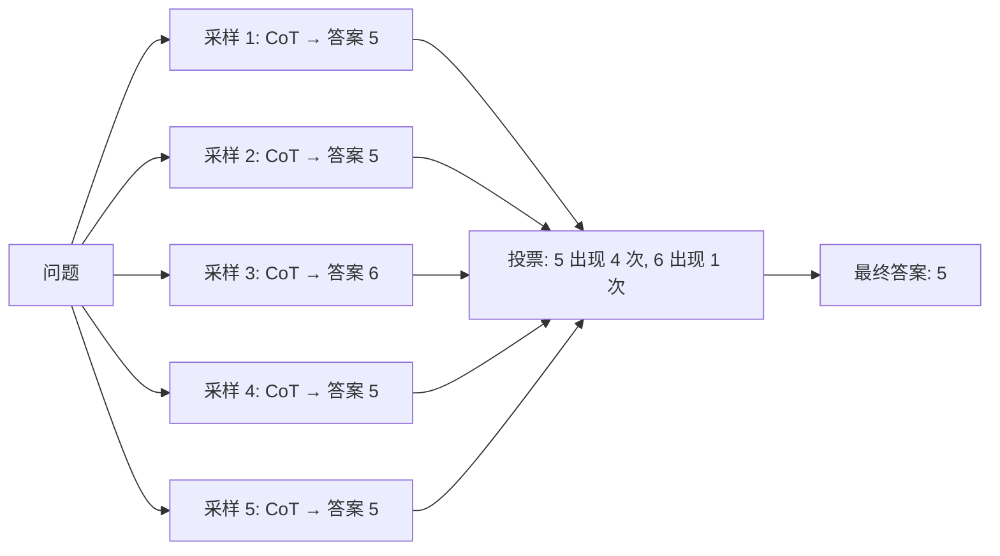
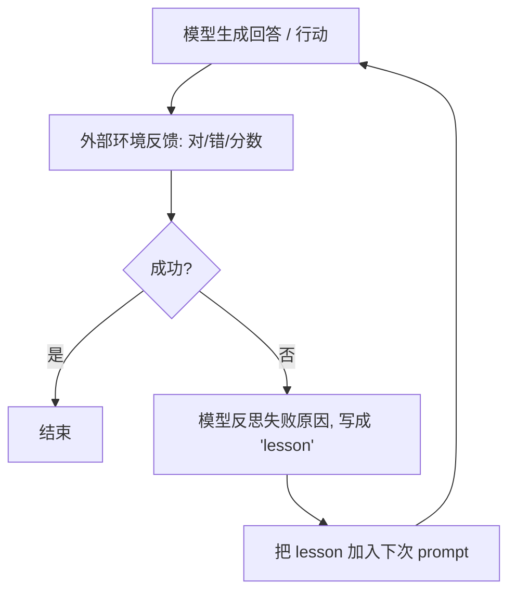

<section class="doc-hero">
  <p class="doc-hero__kicker">Prompt 工程</p>
  <h1>Self-Consistency 与 Self-Refine</h1>
  <p class="doc-hero__lead">Self-Consistency 用多次采样投票，Self-Refine 让模型自我打分修正——两个简单技巧，效果常常比换更强的模型还显著。</p>
  <div class="doc-hero__meta" aria-label="本文信息">
    <span>适合阶段：Prompt 进阶</span>
    <span>核心机制：多次采样 + 投票 / 自我审查</span>
    <span>面试重点：成本-收益权衡</span>
  </div>
</section>

## 面试官想考什么

读完这篇你要能正面回答下面这些题。每题后面括号里是面试官真正想看你答出什么。

<div class="interview-grid">
  <div>
    <strong>Self-Consistency 是怎么工作的？为什么"多次采样投票"能提准确率？</strong>
    <span>考对概率分布与众数的直觉。</span>
  </div>
  <div>
    <strong>Self-Consistency 必须配合 CoT 用吗？直接对答案投票行不行？</strong>
    <span>考你能不能讲清"推理多样性"为什么重要。</span>
  </div>
  <div>
    <strong>采样几次合适？10 次和 40 次效果差多少？</strong>
    <span>考工程权衡，没有标准答案。</span>
  </div>
  <div>
    <strong>Self-Refine 和 Self-Consistency 区别是什么？什么场景用哪个？</strong>
    <span>考概念辨析。</span>
  </div>
  <div>
    <strong>Self-Refine 在某些任务上反而越改越差，为什么？</strong>
    <span>考你知不知道 Huang et al. 2023 的反向发现。</span>
  </div>
  <div>
    <strong>Reflexion 是 Self-Refine 的进化吗？多了哪一步？</strong>
    <span>考对 Agent 自我反思的理解。</span>
  </div>
  <div>
    <strong>这些技巧的 hidden cost 是什么？为什么生产里要慎用？</strong>
    <span>考成本意识。</span>
  </div>
</div>

---

## 为什么需要这些技巧

CoT 解决了"让模型多想"，但还有两个剩余问题：

**问题 1：单次推理可能走错路。** CoT 是一条线性推理链，第一步选错方向，后面全错。

**问题 2：模型不知道自己错了。** 普通 prompt 下模型给出答案就结束了，没有"再看一遍"的机制。

Self-Consistency 和 Self-Refine 分别解决这两个问题：

- **Self-Consistency**：跑多条独立的推理链，投票选最一致的答案——降低单次走错的风险
- **Self-Refine**：让模型审查自己的答案，主动修正——给模型一个"second thought" 的机会

这两个技巧都不用 fine-tune、不用换模型，**纯靠 prompt 工程**就能在很多任务上把准确率再提 5-15 个百分点。

---

## Self-Consistency

### 核心 idea

Wang et al. 2022 *Self-Consistency Improves Chain of Thought Reasoning* ([arxiv 2203.11171](https://arxiv.org/abs/2203.11171)) 提出：

**对同一个问题，用不同的随机种子（提高 temperature）跑多次 CoT，每次得到一个答案，最终选出现次数最多的那个。**

流程：



### 为什么有效

**直觉**：错误的推理路径多种多样，但正确的推理路径往往**收敛到同一个答案**。如果 5 次采样有 4 次得到答案 X、1 次得到答案 Y，那 X 大概率是对的。

**数学**：假设单次推理准确率 60%，5 次独立采样投票后，按二项分布计算："多数为正确"的概率约 68%；10 次采样约 73%。准确率随采样次数提升但有边际效应。

**对比 CoT 单次 vs Self-Consistency**：

| 任务 | CoT 单次 | Self-Consistency (40 次) |
|---|---:|---:|
| GSM8K（小学数学） | 56.9% | 74.4% |
| MultiArith | 91.7% | 99.3% |
| ARC-Challenge | 73.4% | 78.0% |

GSM8K 提升 17 个百分点——纯 prompt 工程的提升，没换模型也没 fine-tune。

### 实战代码

```python
from collections import Counter
import re

def self_consistency(question, llm, n_samples=10):
    prompt = f"""一步步推理后给出最终答案。最后一行格式: "答案: <数字>"。

问题: {question}
推理:"""

    answers = []
    for _ in range(n_samples):
        # 关键：temperature > 0，让多次采样产生不同推理路径
        response = llm.chat(prompt, temperature=0.7, top_p=0.95)
        # 抽取最终答案
        match = re.search(r"答案[:：]\s*(-?\d+(?:\.\d+)?)", response)
        if match:
            answers.append(match.group(1))

    if not answers:
        return None

    # 多数投票
    most_common = Counter(answers).most_common(1)[0][0]
    return most_common

# 用法
answer = self_consistency("一袋苹果 30 元，3 袋打 8 折，买 5 袋多少钱？", llm)
```

### 关键设计：temperature 必须 > 0

如果 temperature=0，每次采样都给同样答案，投票毫无意义。Self-Consistency 的关键是**让多次采样走不同的推理路径**。典型配置：
- `temperature = 0.7`
- `top_p = 0.95`

### 采样次数怎么选

经验值：
- 5 次：成本可控，能拿到 60-70% 收益
- 10-15 次：性价比甜点
- 40 次：论文里的极致配置，提升边际明显放缓

实战建议：**先用 5 次跑评估集，效果不满意再加到 10-15**。除非任务极其重要（如医疗诊断、金融决策），否则很少超过 20 次——成本和延迟扛不住。

### Self-Consistency 适合什么任务

✅ **适合**：
- 答案空间小且可比较（数学题、是非题、单标签分类）
- 推理过程多样但答案收敛的任务

❌ **不适合**：
- 创意写作（每次输出本来就该不同，没法投票）
- 长文本生成（怎么比较两段文本"是否一致"？）
- 答案空间无限（开放问答）

变种：**Universal Self-Consistency** (Chen et al. 2023) — 用 LLM 当 judge 比较多个回答，而不是字符串相等。能扩展到自由文本，但成本更高。

---

## Self-Refine

### 核心 idea

Madaan et al. 2023 *Self-Refine: Iterative Refinement with Self-Feedback* ([arxiv 2303.17651](https://arxiv.org/abs/2303.17651)) 提出：

**让模型先给一个答案，然后让它自己评价这个答案哪里不好，再让它根据反馈改一版——直到满意为止。**

流程：

```
1. Generate: 让模型给初始答案
2. Feedback: 让模型对自己的答案打分 + 指出问题
3. Refine: 让模型根据 feedback 改进答案
4. Repeat: 重复 2-3 直到满意或达到最大轮次
```

### 实战 prompt

```python
def self_refine(question, llm, max_iters=3):
    # Step 1: 初始答案
    answer = llm.chat(f"回答以下问题：{question}")

    for i in range(max_iters):
        # Step 2: 自我反馈
        feedback = llm.chat(f"""
请评价以下回答的质量。指出具体问题（如不准确、不完整、不清晰）。
如果回答已经很好，回复"无需改进"。

问题: {question}
回答: {answer}

反馈:""")

        if "无需改进" in feedback:
            break

        # Step 3: 根据反馈改进
        answer = llm.chat(f"""
基于以下反馈改进回答。

问题: {question}
原回答: {answer}
反馈: {feedback}

改进后的回答:""")

    return answer
```

### Self-Refine 在什么任务上有效

论文测试了 7 个任务，提升幅度：
- 对话回复：+8.7%
- 代码可读性：+13.9%
- 数学应用题：+5%
- 情感反转（rewrite to opposite sentiment）：+25%（最显著）

**适合**：
- 输出有清晰评判标准的任务（代码 quality、写作 style）
- 错误模式典型且模型自己能识别（不流畅、不简洁、不准确）

**不适合**：
- 事实正确性问题（模型不知道事实就是不知道，再改也错）
- 推理深度问题（模型本来就推理不出，自审也看不出）

### 反直觉发现：Self-Refine 有时越改越差

Huang et al. 2023 *Large Language Models Cannot Self-Correct Reasoning Yet* ([arxiv 2310.01798](https://arxiv.org/abs/2310.01798)) 发现：

**在数学推理等任务上，Self-Refine 不仅没提升，反而让模型把原本正确的答案改错了。**

原因：
- 模型对"正确答案"和"错误答案"的判断同样不可靠
- 第一次答对的 case，让它"再审一次"它可能挑错的毛病
- "反馈"本身可能是幻觉

**关键启示**：Self-Refine 只在"模型能可靠判断对错"的任务上 work。如果连判断对错都需要外部信号（数学题需要计算器验证、代码需要运行验证），单纯 Self-Refine 帮不上忙——这时该用 Reflexion。

---

## Reflexion：带外部信号的自我反思

Shinn et al. 2023 *Reflexion: Language Agents with Verbal Reinforcement Learning* ([arxiv 2303.11366](https://arxiv.org/abs/2303.11366)) 改良 Self-Refine：

**反馈不再来自模型自己，而是来自外部（环境反馈、单元测试、人类标注）。**

流程：



### 关键区别：外部信号

| 方法 | 反馈来源 | 适合 |
|---|---|---|
| **Self-Refine** | 模型自己评 | 输出 quality 类（writing、code style） |
| **Reflexion** | 环境反馈（编译/测试/人工） | 有 ground truth 的任务（coding、game） |

Reflexion 在 HumanEval (Python 编程) 上把 GPT-4 准确率从 80% 提到 91%——前提是有单元测试作为外部信号。

详细展开见 [Agent - Reflexion](../agent/reflexion)。本文只点到它和 Self-Refine 的差异：**外部信号是关键**。

---

## 三种技巧对比

| 技巧 | 解决什么问题 | 成本 | 适合 | 主要风险 |
|---|---|---|---|---|
| **Self-Consistency** | 单次推理偶发错误 | n × 单次调用 | 答案空间小的推理题 | 创意场景不适用 |
| **Self-Refine** | 单次输出 quality 不够 | 2-4 × 单次调用 | 写作、代码风格 | 推理任务可能越改越差 |
| **Reflexion** | Agent 行动失败 | 多轮 + 外部信号成本 | 编程 / 工具调用 | 必须有可靠外部反馈 |

---

## 工程化模板

### 模板 1：Self-Consistency for 分类

```python
def sc_classify(text, labels, llm, n=5):
    from collections import Counter
    label_list = "/".join(labels)
    prompt = f"""分类下面的文本到 {label_list} 之一。先简短分析，最后一行严格输出：
类别: <{label_list}>

文本: {text}
分析:"""

    votes = []
    for _ in range(n):
        out = llm.chat(prompt, temperature=0.7)
        for label in labels:
            if f"类别: {label}" in out or f"类别：{label}" in out:
                votes.append(label)
                break
    return Counter(votes).most_common(1)[0][0]
```

### 模板 2：Self-Refine for 写作

```python
def sr_write(brief, llm, max_iters=2):
    draft = llm.chat(f"按下列要求写一段：{brief}")

    for i in range(max_iters):
        critique = llm.chat(f"""作为编辑评价这段文字。指出最严重的 1-2 个问题。如果质量已达标输出"OK"。

要求: {brief}
文字: {draft}

评价:""")

        if critique.strip().startswith("OK"):
            break

        draft = llm.chat(f"""根据评价改写。

要求: {brief}
原文: {draft}
评价: {critique}

改写后:""")

    return draft
```

---

## 常见陷阱

### 陷阱 1：在创意任务上用 Self-Consistency

```
"写一首关于秋天的诗" × 10 次 → 10 首不同的诗 → 投票个啥？
```

Self-Consistency 要求答案"可比较"。开放生成任务每次本来就该不同。

### 陷阱 2：忘了把 temperature 调高

```python
# 错误：temperature=0 时 10 次采样可能全一样
for _ in range(10):
    output = llm.chat(prompt, temperature=0)
```

Self-Consistency 的多样性靠采样温度——必须 > 0，建议 0.7-0.9。

### 陷阱 3：在事实问答上用 Self-Refine

```
Q: 法国首都？
A: 巴塞罗那
Critique: 不对，是巴黎
Refined: 巴黎
```

——这看起来 work，但只是运气。如果模型本来就不知道首都是哪，自审同样可能错。**事实问题该用 RAG，不是 Self-Refine**。

### 陷阱 4：Self-Refine 死循环

```
Iter 1: 初始答案
Iter 2: 改进版本
Iter 3: 又改回类似初始版本
Iter 4: 又改回 iter 2
...
```

模型在两个版本间反复横跳。应对：
- 设硬上限（max_iters=3-5）
- 比较前后两版相似度（embedding 距离），变化太小就停

### 陷阱 5：成本失控

10 次 Self-Consistency + 3 轮 Self-Refine = 30 次调用，比单次贵 30 倍。

**生产里这些技巧只用在关键场景**：
- 单次价值高（如重要决策、医疗诊断）
- 调用频次低
- 准确率提升能 cover 成本

高频调用场景下，先用更强模型 / fine-tune 更划算。

### 陷阱 6：用 Self-Refine 替代外部验证

```
代码生成任务：让模型自审"这段代码对不对"
```

不要替代真实运行 + 单元测试。Self-Refine 是 nice-to-have 的补充，不是替代品。代码必须真正运行验证（Reflexion 思路）。

---

## 面试题深度解析

### Q: Self-Consistency 凭什么提升准确率？

**30 秒版本**：核心 insight 是——**错误的推理路径多种多样，但正确的推理路径会收敛到同一个答案**。所以多次采样后，正确答案会以高频次出现，错误答案分散。数学上，假设单次准确率 60%，5 次独立采样后多数为正确的概率约 68%。本质是把"单次采样的方差"通过多次采样的众数估计降下来——和经典统计的 bootstrap aggregation 思想一样。

**追问**：那为什么 temperature 必须 > 0？
因为 Self-Consistency 的核心是"多条独立推理路径"。temperature=0 时模型给出最高概率的 token，每次采样输出几乎完全一致——10 次采样等同于 1 次，投票毫无意义。必须用 temperature 0.5-0.9 引入采样多样性，让不同次采样走不同的推理路径，才能形成有意义的投票。这也是为什么推理模型 o1 不能用 Self-Consistency——它们内部已经做了大量自我搜索，外部高 temp 采样会破坏内部推理。

### Q: Self-Refine 为什么在数学推理上反而越改越差？

**30 秒版本**：Huang et al. 2023 发现的关键问题：**模型对"答案对错"的判断能力 ≈ 它生成答案的能力**。如果它能可靠判断对错，那它第一次就该给出正确答案；如果它第一次给错了，它的自审同样可能错——可能把原本正确的部分挑出毛病改坏，或者放过真正的错误。Self-Refine 只在"判断对错比生成答案容易"的任务上 work——比如写作风格（人都能判断流畅度，模型也能）、代码风格（有客观标准）。事实和推理任务必须用 Reflexion 引入外部信号。

**追问**：那 Reflexion 的外部信号从哪来？所有任务都能用吗？
不是。Reflexion 要求**任务有可自动验证的反馈**：编程任务有单元测试；游戏有胜负；数学题有标准答案（但生产里通常没有）；创意写作就完全没有。所以 Reflexion 适用面比 Self-Refine 窄——它强但有前提。生产里常见模式：(1) 编程 Agent + 单元测试反馈 = Reflexion 路线；(2) 写作 Agent + 主观打分 = Self-Refine 路线；(3) 通用对话 = 一般不用这两个，成本太高。

### Q: 这些技巧的 hidden cost 怎么算？什么时候不该用？

**30 秒版本**：直接成本是"调用次数 × 单次成本 + 延迟 × n 倍"。Self-Consistency 10 次 = 10 倍成本 + 10 倍延迟（如果不并行）。Self-Refine 3 轮 = 3 倍成本 + 3 倍延迟（因为顺序依赖不能并行）。Reflexion 可能 10 轮 = 10 倍成本。生产里**不该用**的场景：(1) 高频调用（每月调用千万次）—— 用更强模型 / fine-tune 更经济；(2) 实时对话（用户等不了）；(3) 任务本来就简单（标准 prompt 准确率已 > 95%）。**该用**的场景：单次价值高的关键决策（医疗、金融、法律）、对错可验证的离线任务（数据标注、内容审核）。

**追问**：能不能把 Self-Consistency 并行？
能。Self-Consistency 的 N 次采样彼此独立，可以并行调用 N 个 API 请求——延迟降到约等于单次延迟，但成本不变。生产里都这么做。Self-Refine 不能并行（后一步依赖前一步反馈），所以延迟问题更突出。这就是为什么 Self-Consistency 在生产里更常见——它能横向 scale，Self-Refine 必须串行。

---

## 延伸阅读

- **论文：Self-Consistency Improves Chain of Thought** ([arxiv 2203.11171](https://arxiv.org/abs/2203.11171))
  Wang et al. 2022。读它是为了看完整的实验数据——什么任务上 SC 提升明显，什么任务上不明显。

- **论文：Self-Refine** ([arxiv 2303.17651](https://arxiv.org/abs/2303.17651))
  Madaan et al. 2023。读它是为了理解"模型自我反馈"的潜力和边界。

- **论文：LLMs Cannot Self-Correct Reasoning Yet** ([arxiv 2310.01798](https://arxiv.org/abs/2310.01798))
  Huang et al. 2023。读它会让你重新评估"自我反思"的真实价值——不是越改越好，反而可能越改越差。

- **论文：Reflexion** ([arxiv 2303.11366](https://arxiv.org/abs/2303.11366))
  Shinn et al. 2023。读它是为了理解"外部信号 + 自我反思"的组合，是 Agent 自我改进的关键范式。

- **博客：Lilian Weng — LLM Powered Autonomous Agents** ([lilianweng.github.io/posts/2023-06-23-agent/](https://lilianweng.github.io/posts/2023-06-23-agent/))
  把 Self-Refine、Reflexion 放在 Agent 自我改进的整体框架里讲，能看清这些技术的位置。
