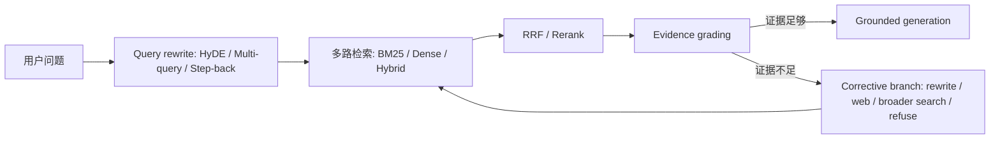

<section class="doc-hero">
  <p class="doc-hero__kicker">RAG 进阶</p>
  <h1>高级 RAG</h1>
  <p class="doc-hero__lead">当 Naive RAG 找不到、找错、或不知道自己找错时，用查询改写、自检和纠错分支补上。</p>
  <div class="doc-hero__meta" aria-label="本文信息">
    <span>适合阶段：RAG 优化进阶</span>
    <span>核心机制：Rewrite / Retrieve / Verify</span>
    <span>面试重点：何时加复杂度</span>
  </div>
</section>

> 高级 RAG 是给检索过程加“改写、判断、补救”。

## 面试官想考什么

读完这篇你要能正面回答下面这些题。每题后面括号里是面试官真正想看你答出什么。

<div class="interview-grid">
  <div>
    <strong>Naive RAG 已经有 chunking、embedding、reranking，为什么还需要高级 RAG？</strong>
    <span>考你能不能识别“召回失败”和“生成失败”的边界。</span>
  </div>
  <div>
    <strong>HyDE 为什么能提升 zero-shot dense retrieval？它最大的风险是什么？</strong>
    <span>考你是否理解“假想答案”是检索 query，不是事实来源。</span>
  </div>
  <div>
    <strong>Multi-query / RAG-Fusion 和普通 query rewrite 有什么区别？</strong>
    <span>考多路召回、RRF 和候选池扩展。</span>
  </div>
  <div>
    <strong>Step-back prompting 适合解决什么 RAG 问题？</strong>
    <span>考抽象问题和具体问题的互补。</span>
  </div>
  <div>
    <strong>Self-RAG 和 CRAG 都在“自检”，它们差别在哪里？</strong>
    <span>考论文机制，而不是把名字混成一团。</span>
  </div>
  <div>
    <strong>什么时候不该上高级 RAG？</strong>
    <span>考工程克制，避免把简单问题复杂化。</span>
  </div>
  <div>
    <strong>高级 RAG 的效果怎么评估？只看答案准确率够吗？</strong>
    <span>考分段评估：改写、召回、重排、生成、拒答。</span>
  </div>
</div>

---

## 为什么需要高级 RAG

前面几篇已经把 Naive RAG 的几个关键件补齐了：文档切分、embedding 模型、向量库、混合检索、重排序。做到这一步，RAG 已经能回答很多企业知识库问题。

但还有一类问题会继续失败：

```text
用户问：员工走了以后，已经拿到手的股票还能留多久？

知识库原文：
离职员工已归属期权的行权窗口为 90 天。未归属期权在离职日自动失效。
```

这句话里，用户说"走了以后"、"拿到手的股票"、"留多久"；文档说"离职员工"、"已归属期权"、"行权窗口"。如果 embedding 没把这些表达对齐，检索就漏了。就算检索到了，系统还要判断这段是否足够支持答案；如果不够，要不要改写 query 再搜？要不要换搜索源？要不要拒答？

高级 RAG 不是一堆炫技名词，它围绕三个动作展开：

```text
Rewrite：把用户问题改成更适合检索的问题
Retrieve：多路召回，扩大正确证据进入候选池的概率
Verify：判断证据是否足够，不够就补救或拒答
```

HyDE、Multi-query、RAG-Fusion、Step-back、Self-RAG、CRAG 都可以放进这条流程里。真正的工程判断是：**你的失败模式是哪一种，就加哪一个动作。**

## 高级 RAG 是怎么工作的

它实际是在 Naive RAG 外面加一个控制层：检索前改写 query，检索后给证据打分，分数低时触发补救分支，最后再生成。



这张图里最重要的是 `Evidence grading`。没有这一步，系统不知道自己检索错了，只会把错证据塞给 LLM。CRAG 论文 [Corrective Retrieval Augmented Generation](https://arxiv.org/abs/2401.15884) 的核心就在这里：给检索结果做质量评估，质量低时走 corrective actions，而不是直接生成。

## 核心原理 / 关键设计

### 1. HyDE：先生成“假想文档”，再用它检索

HyDE 来自 Gao et al. 的 [Precise Zero-Shot Dense Retrieval without Relevance Labels](https://arxiv.org/abs/2212.10496)。它的做法很反直觉：用户问问题时，先让 LLM 写一段像答案的假想文档，再用这段假想文档做 embedding 检索。

```text
query:
员工走了以后，已经拿到手的股票还能留多久？

HyDE hypothetical document:
离职员工已归属期权通常有一个行权窗口，员工必须在窗口期内完成行权...

retrieval:
用这段更像“公司制度原文”的文本去搜文档。
```

为什么有效？Dense retriever 更擅长比较"文档和文档"的相似度，而不是比较口语 query 和正式文档。HyDE 把 query 变成更接近文档语体的文本。

风险也很清楚：**假想文档可能胡编。** 但注意，HyDE 里的假想文档不是最终答案，只是检索 query。最终回答仍然必须基于真实召回文档。面试里一定要把这点讲清楚。

### 2. Multi-query / RAG-Fusion：一个问题生成多种问法

Rewrite-Retrieve-Read 论文 [Query Rewriting for Retrieval-Augmented Large Language Models](https://arxiv.org/abs/2305.14283) 把问题改写作为 RAG 的关键环节来研究。RAG-Fusion 则把多 query 和 RRF 放在一起：生成多个 query，每个 query 检索一批结果，再用 Reciprocal Rank Fusion 合并。

```python
queries = [
    "离职后期权还能保留多久？",
    "离职员工已归属期权行权窗口",
    "员工离职 已归属 股票期权 90 天",
]

ranked_lists = [retrieve(q, top_k=20) for q in queries]
fused = reciprocal_rank_fusion(ranked_lists)
```

这个方法解决的是 query 表达不稳定。用户问得口语，文档写得正式；用户用中文，文档里夹英文术语；用户问"股票"，制度里写"期权"。多 query 提高了至少一路命中的概率。

代价是成本和噪声。生成 5 个 query，每个 top-20，就可能得到 100 个候选。后面必须配 RRF、reranker 和去重，否则只是把噪声变多。

### 3. Step-back：先问抽象问题，再回到具体问题

Step-back prompting 来自 [Take a Step Back: Evoking Reasoning via Abstraction in Large Language Models](https://arxiv.org/abs/2310.06117)。它让模型先把具体问题抽象成更高层的问题，再结合抽象知识回答。

放到 RAG 里，它适合这种场景：

```text
具体问题：
XPay 退款接口 timeout 最大能设多少？

Step-back query：
XPay 退款接口有哪些超时和重试策略？
```

具体 query 可能只召回参数表，抽象 query 可能召回接口概览、限制说明、异常处理。两者合并后，LLM 更容易拿到完整上下文。

Step-back 不适合所有问题。用户问错误码、订单号、条款编号时，过度抽象会丢掉关键精确词。工程上通常把它作为可选改写分支，而不是默认替换原 query。

### 4. Self-RAG：模型自己决定检索、引用和批判

Self-RAG 论文 [Learning to Retrieve, Generate, and Critique through Self-Reflection](https://arxiv.org/abs/2310.11511) 的思路更激进：训练模型生成 reflection tokens，让它学会什么时候检索、生成是否有支持、输出是否有用。

把它翻译成工程语言，就是让系统多几个判定点：

```text
需要检索吗？
检索到的段落支持当前回答吗？
当前回答有没有被证据支撑？
答案是否真正解决了用户问题？
```

很多团队不会真的训练 Self-RAG 模型，而是用 prompt、规则或小模型模拟这些判定。这样也能先用到一部分思路：比如生成前先给证据打分，生成后检查每句话是否有引用来源。

### 5. CRAG：检索不可信时走纠错分支

CRAG 的重点是面对坏检索结果时不要硬答。论文把检索结果分成 correct / incorrect / ambiguous 之类的状态，然后做不同动作：保留、纠正、补充搜索。

```python
if evidence_score >= 0.75:
    answer(context)
elif evidence_score >= 0.4:
    rewrite_and_retrieve(query)
else:
    broaden_search_or_refuse(query)
```

这类设计对企业知识库很重要。比起"答错"，很多场景更能接受"当前文档没有足够证据"。高级 RAG 的成熟标志之一，是知道什么时候停手。

## 怎么用：标准库模拟 HyDE + RRF + CRAG

下面这段代码只用 Python 标准库，演示一个高级 RAG 控制流：对原 query 生成 HyDE 和 Step-back 改写，多路 BM25 检索，用 RRF 融合，再给证据打分。真实项目里把 `hyde_query()`、`step_back_query()` 换成 LLM 调用，把 `bm25()` 换成向量库 / 混合检索即可。

```python
import math
import re
from collections import Counter, defaultdict

DOCS = {
    "policy-1": "离职员工已归属期权的行权窗口为 90 天。未归属期权在离职日自动失效。",
    "policy-2": "离职流程包括账号注销、资产归还、离职面谈和工资结算。",
    "policy-3": "期权授予后按四年归属，首年 cliff 为 25%，之后按月归属。",
    "api-1": "XPay 退款接口 timeout 参数范围为 1-300 秒，超过 300 秒会被网关拒绝。",
    "api-2": "XPay 查询订单接口需要 order_id 和 merchant_id，默认 timeout 为 30 秒。",
}


def tokenize(text: str) -> list[str]:
    return re.findall(r"[a-zA-Z0-9_]+|[\u4e00-\u9fff]", text.lower())


def bm25(query: str, docs: dict[str, str], top_k: int = 3):
    tokenized = {doc_id: tokenize(text) for doc_id, text in docs.items()}
    avgdl = sum(len(t) for t in tokenized.values()) / len(tokenized)
    df = Counter(t for terms in tokenized.values() for t in set(terms))
    rows = []

    for doc_id, terms in tokenized.items():
        tf, score = Counter(terms), 0.0
        for term in tokenize(query):
            if term not in tf:
                continue
            idf = math.log(1 + (len(docs) - df[term] + 0.5) / (df[term] + 0.5))
            denom = tf[term] + 1.5 * (1 - 0.75 + 0.75 * len(terms) / avgdl)
            score += idf * tf[term] * 2.5 / denom
        rows.append((doc_id, score))

    return sorted(rows, key=lambda x: x[1], reverse=True)[:top_k]


def hyde_query(query: str) -> str:
    if "期权" in query or "股票" in query:
        return "离职员工 已归属期权 行权窗口 90 天 未归属期权 自动失效"
    if "timeout" in query:
        return "接口 timeout 参数 范围 最大 秒 网关限制"
    return query


def step_back_query(query: str) -> str:
    if "timeout" in query:
        return "接口超时参数和网关限制说明"
    if "离职" in query:
        return "员工离职后的期权归属和行权规则"
    return query


def rrf(rankings, k: int = 60):
    scores = defaultdict(float)
    why = defaultdict(list)
    for name, ranked in rankings:
        for rank, (doc_id, raw_score) in enumerate(ranked, start=1):
            scores[doc_id] += 1 / (k + rank)
            why[doc_id].append(f"{name}#{rank}={raw_score:.2f}")
    return sorted(scores.items(), key=lambda x: x[1], reverse=True), why


def grade_evidence(query: str, doc: str) -> float:
    q, d = set(tokenize(query)), set(tokenize(doc))
    overlap = len(q & d) / max(len(q), 1)
    has_number = bool(re.search(r"\d+\s*(天|秒|个月|年)", doc))
    asks_limit = any(x in query for x in ["多久", "最大", "多少", "范围"])
    return overlap + (0.7 if asks_limit and has_number else 0.0)


def advanced_retrieve(query: str):
    rewrites = {
        "original": query,
        "hyde": hyde_query(query),
        "step_back": step_back_query(query),
    }
    rankings = [(name, bm25(q, DOCS, top_k=3)) for name, q in rewrites.items()]
    fused, why = rrf(rankings)

    best_doc_id = fused[0][0]
    evidence_score = grade_evidence(query, DOCS[best_doc_id])

    if evidence_score < 0.4:
        return {"status": "insufficient", "query_rewrites": rewrites, "best": best_doc_id, "why": why[best_doc_id]}
    return {"status": "answerable", "query_rewrites": rewrites, "best": best_doc_id, "text": DOCS[best_doc_id], "why": why[best_doc_id]}


if __name__ == "__main__":
    result = advanced_retrieve("离职后股票还能保留多久？")
    print(result["status"], result["best"])
    print(result["why"])
    print(result.get("text", "证据不足，需要扩大检索或拒答"))
```

这段代码不是在假装有真实 LLM。它只是把高级 RAG 的控制流跑出来：多 query 召回、RRF 融合、证据打分、低分时不硬答。生产系统里，最容易出问题的也正是这些分支，而不是某个模型 API 的调用语法。

## 容易踩的坑

### 坑 1：HyDE 生成的假想文档被当成事实

**现象**：系统回答里出现了真实文档没有的数字、政策或结论。

**根因**：HyDE 生成的是检索用的 hypothetical document，不是证据。它可能包含幻觉。如果把它和真实检索结果一起塞给 LLM，模型会把假内容当来源。

**修法**：HyDE 文本只用于 embedding/search，不进入最终 context；最终答案只能引用真实文档。日志里也要把 HyDE query 和 evidence context 分开。

### 坑 2：Multi-query 只增加噪声

**现象**：生成多个 query 后，候选数变多，答案却更差。

**根因**：改写 query 偏离用户意图，RRF 把多路噪声融合进来；或者每路 top-K 太大，reranker 被低质量候选淹没。

**修法**：限制 query 数量；保留 original query 权重；用 RRF 后接 reranker；分别评测 original / multi-query / fusion 的 recall 和 answer accuracy。

### 坑 3：Step-back 把精确问题抽象坏了

**现象**：用户问 `ERR_AUTH_4017`，系统改写成"认证失败原因"，召回一堆泛泛文档，精确错误码不见了。

**根因**：Step-back 适合需要背景原则的问题，不适合强精确匹配。抽象会丢掉错误码、API 名、条款号。

**修法**：精确 token 存在时保留 original query，并把 Step-back 作为补充路。错误码 / 型号 / API 参数类 query 先走 BM25 或 hybrid。

### 坑 4：Self-check 变成另一个幻觉模型

**现象**：检索证据不足，checker 仍然判断"支持"，最终答案错得很自信。

**根因**：用同一个 LLM 同时生成和自检，且不给明确证据引用约束时，它会顺着自己的答案找理由。

**修法**：自检只看 evidence，不看草稿答案；要求输出引用的 chunk id；用规则或小模型先做硬过滤；高风险场景保留人工抽检。

### 坑 5：CRAG 分支没有可观测性

**现象**：线上偶尔拒答、偶尔补搜、偶尔硬答，没人知道为什么。

**根因**：高级 RAG 增加了分支，但没有记录 query rewrite、retrieval score、evidence grade、branch decision。

**修法**：每次请求记录完整 trace：原 query、改写 query、各路 top-K、融合结果、reranker 分数、evidence grade、最终分支。没有 trace，高级 RAG 很难调。

## 与相似概念的区别

| 方法 | 解决的问题 | 核心动作 | 主要风险 |
|---|---|---|---|
| Query rewrite | 用户问题不适合检索 | 改写成更贴近文档的 query | 改偏意图 |
| HyDE | 口语 query 和正式文档差距大 | 生成假想文档再检索 | 假想文档被当事实 |
| Multi-query / RAG-Fusion | 单一路 query 漏召回 | 多 query 检索 + RRF | 候选噪声变多 |
| Step-back | 具体问题缺背景上下文 | 抽象成原则性问题再检索 | 丢精确词 |
| Self-RAG | 不知道何时检索/引用/批判 | 生成 reflection / critique 信号 | 实现复杂，判定也会错 |
| CRAG | 检索结果不可靠 | 证据评分 + 纠错分支 | 分支不可观测时难 debug |

高级 RAG 不是越多越好。一个成熟答案通常会这样选：如果 query 和文档措辞差距大，用 HyDE 或 rewrite；如果表达多样，用 multi-query；如果问题需要背景原则，用 Step-back；如果经常拿到坏证据还硬答，用 CRAG / Self-check。

## 面试题深度解析

**Q1: HyDE 为什么能提升检索？**

- **30 秒版本**：HyDE 先让 LLM 生成一段像答案的假想文档，再用它做 dense retrieval。它把短 query 变成更接近文档分布的文本，降低 query-document mismatch。
- **追问 1**：它最大的风险是什么？假想文档会幻觉，所以只能用于检索，不能作为答案来源。
- **追问 2**：什么时候不适合？精确检索场景，如错误码、订单号、API 参数。HyDE 可能把精确词稀释掉，这时应该保留 original query 和 BM25。

**Q2: Self-RAG 和 CRAG 有什么区别？**

- **30 秒版本**：Self-RAG 更像训练/生成框架，让模型学会检索、生成和自我批判；CRAG 更像工程控制流，对检索结果打分，低质量时走纠错分支。
- **追问 1**：生产里一定要训练 Self-RAG 吗？不一定。很多团队用 prompt、规则、小模型模拟 evidence grading 和 citation checking，也能解决一部分问题。
- **追问 2**：两者共同点是什么？都承认 Naive RAG 的检索结果不总可信，生成前必须判断证据质量。

**Q3: 高级 RAG 怎么评估？**

- **30 秒版本**：分段评估。query rewrite 看是否提高 recall；rerank 看 MRR/nDCG；evidence grading 看支持证据命中率；生成看答案正确率和引用准确率。
- **追问 1**：只看最终答案不行吗？不行。最终答案错了，你不知道是改写偏了、检索漏了、rerank 错了，还是生成幻觉。
- **追问 2**：线上要记录什么？原 query、改写 query、各路 top-K、RRF 分数、reranker 分数、证据评分、是否触发纠错分支。

**Q4: 什么时候不该上高级 RAG？**

- **30 秒版本**：当失败主要来自文档解析、chunking、权限过滤、embedding 选型时，先修基础流程。高级 RAG 不能替代干净数据和正确索引。
- **追问 1**：怎么判断？抽样看失败 case。如果正确文档根本不在库里，或者 chunk 被切坏，HyDE/CRAG 都只是绕远路。
- **追问 2**：工程上怎么控复杂度？每次只加一个策略，用 A/B 测试验证收益；没有 trace 和 eval 不上线分支逻辑。

## 延伸阅读

- 论文：[Precise Zero-Shot Dense Retrieval without Relevance Labels](https://arxiv.org/abs/2212.10496) — HyDE 原论文，理解“假想文档用于检索”的动机。
- 论文：[Query Rewriting for Retrieval-Augmented Large Language Models](https://arxiv.org/abs/2305.14283) — Rewrite-Retrieve-Read，把 query rewrite 放到 RAG 检索过程中。
- 论文：[RAG-Fusion: a New Take on Retrieval-Augmented Generation](https://arxiv.org/abs/2402.03367) — 多 query + RRF 的代表性写法，适合理解候选融合。
- 论文：[Take a Step Back](https://arxiv.org/abs/2310.06117) — Step-back prompting 的原始论文，理解抽象问题为什么能补背景。
- 论文：[Self-RAG](https://arxiv.org/abs/2310.11511) — 检索、生成、自我批判一体化的代表工作。
- 论文：[Corrective Retrieval Augmented Generation](https://arxiv.org/abs/2401.15884) — CRAG 原论文，重点看 retrieval evaluator 和 corrective actions。
- 文档：[LlamaIndex Query Transformations](https://docs.llamaindex.ai/en/stable/optimizing/advanced_retrieval/query_transformations/) — 看 HyDE query transform 在框架里的工程形态。
- 文档：[LangChain MultiQueryRetriever](https://reference.langchain.com/v0.3/python/langchain/retrievers/langchain.retrievers.multi_query.MultiQueryRetriever.html) — 看多 query retriever 的框架实现。
