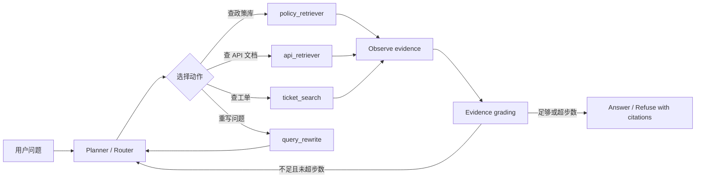

<section class="doc-hero">
  <p class="doc-hero__kicker">RAG 进阶</p>
  <h1>Agentic RAG</h1>
  <p class="doc-hero__lead">固定 RAG 流水线解决不了多源、多跳、需要判断下一步的问题时，把检索变成 Agent 可调用的工具。</p>
  <div class="doc-hero__meta" aria-label="本文信息">
    <span>适合阶段：复杂问答与多源检索</span>
    <span>核心机制：Plan / Tool / Observe / Stop</span>
    <span>面试重点：可控性与评估</span>
  </div>
</section>

> Agentic RAG 让模型决定何时查、查哪里、查几次。

## 面试官想考什么

读完这篇你要能正面回答下面这些题。每题后面括号里是面试官真正想看你答出什么。

<div class="interview-grid">
  <div>
    <strong>Agentic RAG 和普通 RAG 最大区别是什么？</strong>
    <span>考固定 pipeline 和动态 tool loop 的差异。</span>
  </div>
  <div>
    <strong>什么场景值得上 Agentic RAG？什么场景不该上？</strong>
    <span>考工程克制，不是所有问答都需要 Agent。</span>
  </div>
  <div>
    <strong>Agentic RAG 的典型循环怎么设计？如何避免无限检索？</strong>
    <span>考 max steps、stop condition、evidence grading。</span>
  </div>
  <div>
    <strong>检索工具应该怎么设计 schema？返回整段文本还是结构化证据？</strong>
    <span>考工具契约和可引用性。</span>
  </div>
  <div>
    <strong>Agent 什么时候应该重写 query、换检索源、或者拒答？</strong>
    <span>考分支控制，而不是无脑 tool calling。</span>
  </div>
  <div>
    <strong>Agentic RAG 怎么评估？为什么比普通 RAG 更难测？</strong>
    <span>考轨迹评估、工具调用准确率和端到端质量。</span>
  </div>
  <div>
    <strong>Agentic RAG 和 GraphRAG、Self-RAG、ReAct 是什么关系？</strong>
    <span>考概念辨析和架构分层。</span>
  </div>
</div>

---

## 为什么需要 Agentic RAG

普通 RAG 是固定流水线：

```text
query -> retrieve top-K -> rerank -> generate
```

这个流程适合单次检索能拿到证据的问题。比如"XPay 退款接口 timeout 最大多少秒？"，检索接口文档就够了。

但复杂问题经常不是一次检索能解决的：

```text
XPay 退款接口 timeout 最大多少？这个限制是谁维护的？最近有没有相关投诉？
```

这其实是三个问题：

- 参数范围在 API 文档里。
- 维护团队可能在服务目录或组织文档里。
- 投诉信息可能在工单库里。

固定 RAG 只能提前决定"查哪个库、查几次、怎么组合"。Agentic RAG 把这些动作变成工具，让模型或控制器根据中间结果决定下一步：先查 API 文档，发现实体是 XPay 退款接口，再查服务目录，最后查投诉工单；证据足够就回答，不够就继续或拒答。

LangChain 的 retrieval 文档把 Agentic RAG 描述成：LLM-powered agent decides when and how to retrieve during reasoning。LlamaIndex 的 agentic strategies 也强调，可以把已有 RAG query engine 作为工具交给 agent 做更复杂决策。重点不在更换检索算法，重点在把检索从固定组件变成可规划动作。

## Agentic RAG 是怎么工作的

它实际是一个有上限的工具循环。



这个结构和 ReAct 很像。ReAct 论文 [Synergizing Reasoning and Acting](https://arxiv.org/abs/2210.03629) 讲的是模型交替生成 reasoning trace 和 actions；Toolformer 论文 [Language Models Can Teach Themselves to Use Tools](https://arxiv.org/abs/2302.04761) 讨论模型何时调用 API、传什么参数、如何使用返回结果。Agentic RAG 可以看成这些工具使用思想在检索任务上的应用。

工程上不要让 agent 自由奔跑。一个生产级 Agentic RAG 至少要有：

- 可枚举工具列表和参数 schema
- 每步的最大候选数和最大 token 数
- evidence grading 和停止条件
- max steps / max cost / timeout
- 每步 trace、引用来源和权限过滤

## 核心原理 / 关键设计

### 1. 检索工具要小而清楚

不要给 agent 一个过宽的 `search_everything(query)`。工具边界越清楚，模型越容易选对。

```python
TOOLS = {
    "search_api_docs": "查 API 参数、错误码、接口限制",
    "search_policy": "查员工制度、合同、权限政策",
    "search_tickets": "查近期工单、投诉、故障记录",
}
```

工具返回也要结构化。只返回一段长文本，后面无法做引用、去重、权限审计。

```json
{
  "source": "api/xpay/refund.md",
  "section": "timeout",
  "text": "timeout 参数范围为 1-300 秒。",
  "score": 0.82,
  "updated_at": "2026-05-12"
}
```

这看起来像小事，但面试很容易问。Agentic RAG 的可靠性很大程度来自工具契约，而不是 prompt 写得多漂亮。

### 2. Planner 不应该直接生成最终答案

Agent 每一步会做两类事：选工具、读观察结果。最终答案最好由单独的 answer step 生成，并且只允许使用已收集证据。

```text
bad:
Planner 一边想一边答，工具结果和模型猜测混在一起。

better:
Planner 只产出 action；
Tool 返回 evidence；
Evaluator 判断够不够；
Answerer 基于 evidence 输出答案和引用。
```

这样做能降低幻觉，也方便评估每个环节。LangGraph 的 Agentic RAG 教程里也把 retrieval、grade documents、rewrite、generate 拆成不同节点，本质就是为了让控制流可观察。

### 3. Stop condition 比多查一次更重要

Agentic RAG 最常见的故障：查了一步又一步，仍不给停止理由。

```python
for step in range(max_steps):
    action = planner(state)
    observation = run_tool(action)
    state.add(observation)
    if evidence_is_enough(state):
        break
else:
    return refuse("检索次数达到上限，证据仍不足")
```

停止条件不能只靠"模型觉得够了"。至少要组合几类信号：是否命中必须字段、是否有来源引用、是否覆盖子问题、是否达到 max steps、是否超出成本预算。

### 4. Agentic RAG 更需要权限和版本控制

固定 RAG 通常只查一个库，权限过滤容易集中处理。Agentic RAG 会跨多个工具：政策库、工单库、CRM、代码库、网页搜索。只要一个工具忘了 tenant/user filter，就可能泄露数据。

```text
每个工具调用必须带：
tenant_id
user_id / role
allowed_sources
document_version_policy
```

工具层要强制权限，不要只靠 planner 自觉。Agent 选择"查工单"时，工单检索工具必须自己做 ACL；不能让上层 prompt 说一句"不要越权"就算完。

### 5. Agent 轨迹本身就是评估对象

普通 RAG 可以只看输入输出和引用。Agentic RAG 还要看中间步骤：

```text
用户问题 -> 选了哪些工具 -> 每个工具参数是什么 -> 返回哪些证据
-> 是否重写 query -> 是否覆盖子问题 -> 为什么停止
```

没有 trace，你只能看到最终错了，不知道是 planner 选错工具、query 写错、工具没返回、还是 evaluator 误判证据足够。

## 怎么用：标准库写一个可控 Agentic RAG loop

下面这段代码不用外部模型，演示 Agentic RAG 的控制流：工具路由、多步检索、证据检查、停止和引用。真实项目里，把 `plan_next_action()` 换成 LLM tool calling，把 `search_*` 换成真实 retriever。

```python
from dataclasses import dataclass, field

API_DOCS = {
    "api-1": "XPay 退款接口 timeout 参数范围为 1-300 秒，超过 300 秒会被网关拒绝。",
    "api-2": "XPay 查询订单接口默认 timeout 为 30 秒。",
}
SERVICE_DOCS = {
    "svc-1": "XPay 退款接口由支付网关团队维护，负责人轮值在服务目录中更新。",
}
TICKETS = {
    "ticket-1": "近 7 天支付网关团队收到 12 起退款接口 timeout 超限投诉。",
}


@dataclass
class Evidence:
    source: str
    text: str


@dataclass
class State:
    question: str
    actions: list[str] = field(default_factory=list)
    evidence: list[Evidence] = field(default_factory=list)


def keyword_search(query: str, corpus: dict[str, str]) -> list[Evidence]:
    terms = [t for t in query.lower().replace("？", " ").split() if len(t) > 1]
    rows = []
    for source, text in corpus.items():
        score = sum(1 for term in terms if term in text.lower())
        if score:
            rows.append((score, Evidence(source, text)))
    return [e for _, e in sorted(rows, key=lambda x: x[0], reverse=True)]


def search_api_docs(query: str) -> list[Evidence]:
    return keyword_search(query, API_DOCS)


def search_service_catalog(query: str) -> list[Evidence]:
    return keyword_search(query, SERVICE_DOCS)


def search_tickets(query: str) -> list[Evidence]:
    return keyword_search(query, TICKETS)


def plan_next_action(state: State) -> str:
    text = "\n".join(e.text for e in state.evidence)
    q = state.question.lower()

    if "api" not in state.actions and ("timeout" in q or "接口" in q):
        return "api"
    if "service" not in state.actions and ("维护" in state.question or "谁" in state.question or "团队" in state.question):
        return "service"
    if "tickets" not in state.actions and ("投诉" in state.question or "最近" in state.question):
        return "tickets"
    if "timeout 参数范围" in text and ("维护" not in state.question and "投诉" not in state.question):
        return "done"
    return "done"


def run_action(action: str, question: str) -> list[Evidence]:
    if action == "api":
        return search_api_docs(question)
    if action == "service":
        return search_service_catalog(question)
    if action == "tickets":
        return search_tickets(question)
    return []


def enough_evidence(state: State) -> bool:
    text = "\n".join(e.text for e in state.evidence)
    checks = []
    if "timeout" in state.question:
        checks.append("timeout 参数范围" in text)
    if "谁" in state.question or "维护" in state.question:
        checks.append("维护" in text and "团队" in text)
    if "投诉" in state.question or "最近" in state.question:
        checks.append("投诉" in text)
    return bool(checks) and all(checks)


def agentic_rag(question: str, max_steps: int = 4) -> State:
    state = State(question=question)
    for _ in range(max_steps):
        action = plan_next_action(state)
        if action == "done" or enough_evidence(state):
            break
        state.actions.append(action)
        state.evidence.extend(run_action(action, question))
    return state


if __name__ == "__main__":
    state = agentic_rag("XPay 退款接口 timeout 最大多少？谁维护？最近有投诉吗？")
    print("actions:", state.actions)
    for e in state.evidence:
        print(f"[{e.source}] {e.text}")
```

这个 demo 里，Agent 不会一次性查所有库，而是根据问题和已有证据选择下一步。生产系统要把 `actions`、工具参数、返回证据、停止原因全部写进 trace。

## 容易踩的坑

### 坑 1：把 Agentic RAG 用在简单 FAQ

**现象**：原来 300ms 的知识库问答，变成几秒，还多了不稳定工具调用。

**根因**：简单单跳问题不需要规划。Agent loop 增加了 LLM 调用、分支和状态。

**修法**：做 query classifier。单点事实问题走普通 RAG；多源、多跳、需要补查的问题才走 Agentic RAG。

### 坑 2：工具描述太像，模型乱选

**现象**：该查 API 文档时查了工单库，该查政策库时查了网页。

**根因**：工具边界不清，description 写成"搜索相关信息"这种泛话。模型无法根据语义区分工具。

**修法**：工具名和描述写具体：`search_api_docs`、`search_hr_policy`、`search_recent_tickets`；给参数 schema 和反例；用离线问题集测 tool selection accuracy。

### 坑 3：没有 max steps 和成本上限

**现象**：Agent 一直检索、重写、再检索，线上延迟和成本失控。

**根因**：没有硬停止条件，或者把停止完全交给模型判断。

**修法**：设置 max steps、timeout、max tokens、max tool calls；evidence grading 达标才生成；未达标就拒答或请求澄清。

### 坑 4：工具返回不可引用

**现象**：答案看起来对，但没法知道来自哪份文档；用户追问来源时系统说不清。

**根因**：工具只返回纯文本，丢了 source、section、page、version、score。

**修法**：工具返回结构化 evidence。最终回答必须引用 evidence id；没有来源的文本不能进入答案。

### 坑 5：跨工具权限不一致

**现象**：向量库做了租户过滤，工单工具却返回了别的团队数据。

**根因**：Agentic RAG 把多个数据源组合起来，权限模型分散在各工具里，容易漏。

**修法**：每个工具强制接收 auth context，并在工具内部做 ACL；trace 记录每次工具调用的 tenant/user/source filter。

## 与相似概念的区别

| 概念 | 决策权在哪里 | 适合什么问题 | 主要风险 |
|---|---|---|---|
| Naive RAG | 固定 pipeline | 单跳事实问答 | 漏召回、缺自检 |
| Advanced RAG | 控制流规则 + LLM 改写/评分 | 召回失败、自检、纠错 | 分支复杂 |
| GraphRAG | 图索引和查询路由 | 全局主题、多跳关系 | 构图成本高 |
| Agentic RAG | Agent 动态选择工具和步骤 | 多源、多步、需要规划 | 不稳定、难评估、成本高 |
| ReAct Agent | Thought/Action/Observation 循环 | 通用工具使用 | 容易循环和幻觉动作 |

Agentic RAG 可以包含 GraphRAG 工具，也可以包含 Advanced RAG 的 query rewrite 和 evidence grading。它更像控制层：决定用哪些检索算法、按什么顺序用、什么时候停止。

## 面试题深度解析

**Q1: Agentic RAG 和普通 RAG 最大区别是什么？**

- **30 秒版本**：普通 RAG 是固定检索生成流水线；Agentic RAG 把检索源包装成工具，由 Agent 根据问题和中间证据决定查哪里、查几次、是否重写或拒答。
- **追问 1**：这带来什么收益？能处理多源、多跳和不确定问题，比如先查 API 文档，再查服务目录，再查工单。
- **追问 2**：代价是什么？延迟、成本、可重复性和评估复杂度都上升，所以要有 max steps、trace 和工具权限控制。

**Q2: 什么场景值得上 Agentic RAG？**

- **30 秒版本**：问题需要多源数据、动态分解、补查、或工具选择时值得上。单库 FAQ 和简单政策问答不需要。
- **追问 1**：怎么判断？看历史失败 case：如果错误来自"查错库/少查一步/需要跟进问题"，Agentic RAG 有价值；如果错误来自 chunking 或 embedding，先修基础 RAG。
- **追问 2**：怎么灰度？先用 query classifier 只让复杂问题进入 Agentic RAG，对比普通 RAG 的答案准确率、延迟和成本。

**Q3: Agentic RAG 怎么避免无限检索？**

- **30 秒版本**：硬上限 + 证据评分 + 停止原因。max steps、timeout、max tool calls 必须写死，不能只靠模型说"我完成了"。
- **追问 1**：证据评分怎么做？检查子问题是否都有来源、是否命中必要字段、引用是否来自允许数据源。
- **追问 2**：证据不足怎么办？拒答、请求澄清、或走受控补救分支。不要继续无限重写 query。

**Q4: Agentic RAG 怎么评估？**

- **30 秒版本**：评估最终答案还不够，还要评估轨迹：工具选择是否正确、参数是否正确、证据是否支持答案、是否有多余调用。
- **追问 1**：指标有哪些？tool selection accuracy、evidence recall、answer accuracy、citation precision、average tool calls、p95 latency、cost per query。
- **追问 2**：怎么 debug？保存每步 trace，并把失败归因到 planner、retriever、evaluator、answerer。没有分段归因，Agentic RAG 会变得很难诊断。

## 延伸阅读

- 文档：[LangChain Retrieval: Agentic RAG](https://docs.langchain.com/oss/python/langchain/retrieval) — 官方对 semantic search、RAG、Agentic RAG 的对比很清楚。
- 文档：[LangGraph Agentic RAG](https://docs.langchain.com/oss/python/langgraph/agentic-rag) — 看 retrieval tool、grade documents、rewrite、generate 如何拆成图节点。
- 文档：[LlamaIndex Agentic Strategies](https://docs.llamaindex.ai/en/stable/optimizing/agentic_strategies/agentic_strategies/) — 看如何把 query engine 作为 agent tool。
- 文档：[LlamaIndex Agents](https://docs.llamaindex.ai/en/v0.10.17/use_cases/agents.html) — 理解 LlamaIndex 里 RAG pipeline 和 agent/tool 的关系。
- 论文：[ReAct](https://arxiv.org/abs/2210.03629) — Agentic RAG 的行动循环可以从 ReAct 理解。
- 论文：[Toolformer](https://arxiv.org/abs/2302.04761) — 理解模型何时调用工具、如何使用工具结果。
- 论文：[Self-RAG](https://arxiv.org/abs/2310.11511) — 检索、生成、自我批判的训练化路线，适合和 Agentic RAG 对比。
- 论文：[Reflexion](https://arxiv.org/abs/2303.11366) — 语言反思如何帮助 agent 从失败反馈中改进下一步。
