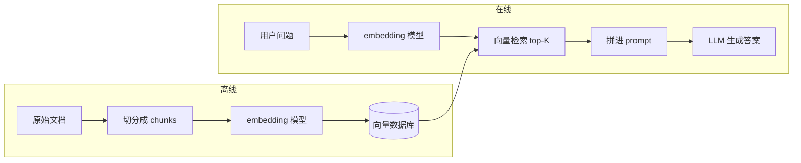

# Naive RAG 与瓶颈

> 把"先检索、再生成"这一句话拆开看到底——以及它为什么不够用。

## 面试官想考什么

读完这篇你要能正面回答下面这些题。每题后面括号里是面试官真正想看你答出什么。

- **Naive RAG 的三段式流程是什么？每一段的设计意图分别是什么？**
  （考基础认知，但区分点在"为什么这样切"，不是流程图复述）
- **同一个问题，用户换种说法就召回不到正确文档。这是为什么？**
  （考你对 semantic gap 的理解，能不能讲到向量空间和 query/doc 不对称）
- **chunk size 选 256 还是 1024？背后的 trade-off 是什么？**
  （考工程权衡，没有标准答案的题才是好题）
- **top-K 检索的 K 怎么选？K=3 和 K=20 各有什么坑？**
  （考真实经验，没踩过坑的人答不出"K 太大反而更差"）
- **召回了正确文档，但 LLM 还是答错了。怎么 debug？**
  （考端到端思维 + 对 Lost in the Middle 的认知）
- **GPT-4 上下文已经 128K，为什么还要 RAG？直接全塞进去不行吗？**
  （考辨析能力，2024 年后这题问的人特别多）
- **BM25 是 90 年代的算法，为什么现在生产 RAG 还要用它？**
  （考对检索本质的理解，纯向量党答不出）
- **怎么知道你的 RAG 系统是"召回不行"还是"生成不行"？**
  （考评估意识，分不开问题就没法迭代）

---

## 为什么需要 RAG

先看不用 RAG 会怎样。

直接问 GPT-4o："Anthropic 的 Claude Opus 4.7 是什么时候发布的？"

模型有三种反应：
1. **乱编**：编一个看起来合理的日期（幻觉）
2. **拒答**："我的训练数据截止 2024 年 10 月，不知道之后的事"
3. **答错时间但语气笃定**：说成 2024 年某个时间——这是最危险的

这反映了 LLM 的两个固有限制：

| 限制 | 表现 |
|---|---|
| **知识截止** | 训练完成那天之后的事一概不知 |
| **私有数据缺失** | 你公司内部文档、客户数据，模型从没见过 |

第二点比第一点重要得多。企业落地大模型 90% 的场景是"基于我们自己的数据回答"——产品手册、合同、工单历史、API 文档。这些数据不在公开互联网上，再怎么微调一个基座模型都不可能覆盖到位（微调成本高、数据更新滞后、还会破坏通用能力）。

RAG 的核心 insight 来自 Lewis 等人 2020 年的论文 *Retrieval-Augmented Generation for Knowledge-Intensive NLP Tasks*：**与其把所有知识"焊"在模型参数里，不如让模型在回答之前先去查资料**。

把模型类比成一个聪明但闭卷考试的学生——它的强项是"推理和表达"，弱项是"记不住所有细节"。RAG 就是给它开卷：你提问时，先去知识库里把相关页码找出来，让它对着资料回答。

---

## Naive RAG 是怎么工作的

整个流程分成两个阶段：**离线建索引**（一次性）+ **在线问答**（每次请求）。



关键点：**问题和文档用的是同一个 embedding 模型**——这样它们才能在同一个向量空间里比较相似度。这个"同一个模型"是Naive RAG 第一个隐藏假设，后面会看到它就是几个瓶颈的源头。

---

## 核心原理：三段式拆解

### 1. 索引（Indexing）

把文档变成可检索的向量。三步：

```python
# 伪代码
chunks = split_document(doc, chunk_size=512, overlap=50)
vectors = [embedding_model.encode(c) for c in chunks]
vector_db.upsert(vectors, metadata=chunks)
```

**关键设计：为什么要切 chunk，不直接嵌入整篇文档？**

两个原因：
1. embedding 模型的输入长度有限（BGE-base 是 512 token、OpenAI text-embedding-3 是 8192）
2. 一篇文档可能讲 10 个主题，整篇做一个向量会把所有主题"平均"掉，检索时哪个主题都不像

但 chunk 太小又有反作用——切碎之后单个 chunk 缺乏上下文（"这个 API 的参数是..."，但"这个 API"指的是哪个？切碎了就丢了）。这就是为什么后面会有专门的"文档切分策略"章节，Naive RAG 默认用固定长度切分（recursive character splitter），简单但粗暴。

### 2. 检索（Retrieval）

```python
q_vec = embedding_model.encode(user_query)
top_k_chunks = vector_db.search(q_vec, k=5)
```

底层就是计算 query 向量和所有文档向量的余弦相似度，取最高的 K 个。

**关键设计：为什么用 cosine 而不是欧氏距离？**

embedding 模型在训练时通常做了 L2 归一化（输出向量模长为 1），归一化之后欧氏距离和余弦距离单调等价，但余弦距离的取值范围是 [-1, 1] 更直观。另外余弦距离只看方向不看模长，对"长文档向量模长偏大"这种系统性偏差更鲁棒。

### 3. 生成（Generation）

把检索到的 chunks 拼进 prompt，让 LLM 基于这些上下文回答：

```python
prompt = f"""根据下面的文档回答问题。如果文档里没有相关信息，回答"我不知道"。

文档：
{chr(10).join(top_k_chunks)}

问题：{user_query}
"""
answer = llm.chat(prompt)
```

**关键设计：那句"如果文档里没有相关信息，回答'我不知道'"非常关键。** 不加这一句，模型会倾向于"基于一般常识 + 部分文档"混合作答，导致幻觉。这是Naive RAG 最容易被忽略的细节。

---

## 完整实现：一个能跑的Naive RAG

50 行以内，用 LangChain，能直接复制运行：

```python
from langchain_community.document_loaders import TextLoader
from langchain_text_splitters import RecursiveCharacterTextSplitter
from langchain_openai import OpenAIEmbeddings, ChatOpenAI
from langchain_community.vectorstores import FAISS
from langchain_core.prompts import ChatPromptTemplate

# 1. 加载文档
docs = TextLoader("./company_handbook.md").load()

# 2. 切分（默认按段落/句子递归切，是Naive RAG 的"标准切法"）
splitter = RecursiveCharacterTextSplitter(
    chunk_size=512,      # 单 chunk token 数上限
    chunk_overlap=50,    # 相邻 chunk 重叠，避免在关键句子上切断
)
chunks = splitter.split_documents(docs)

# 3. 建索引（FAISS 本地索引，演示用；生产换 Pinecone/Qdrant）
embeddings = OpenAIEmbeddings(model="text-embedding-3-small")
vectorstore = FAISS.from_documents(chunks, embeddings)

# 4. 检索
retriever = vectorstore.as_retriever(search_kwargs={"k": 5})

# 5. 生成
prompt = ChatPromptTemplate.from_template("""
基于下面的文档回答问题。如果文档没提到，明确说"文档里没有这个信息"，不要编。

文档：
{context}

问题：{question}
""")

llm = ChatOpenAI(model="gpt-4o-mini")

def ask(question: str) -> str:
    docs = retriever.invoke(question)
    context = "\n\n".join(d.page_content for d in docs)
    chain = prompt | llm
    return chain.invoke({"context": context, "question": question}).content

print(ask("公司年假怎么算？"))
```

跑通这段就有个 demo 级的 RAG 了。但**离生产能用还差十万八千里**——下面就是为什么。

---

## Naive RAG 的 5 大瓶颈

这是这篇文章真正的核心。每个瓶颈我都标了对应的高阶解决方案，后续文章会逐个展开。

### 瓶颈 1：语义鸿沟（Query-Document Mismatch）

**现象**：用户问"年假能不能跨年用？"，文档里写的是"未休假期不可结转至下一自然年度"。这两段意思一致，但用词完全不同，余弦相似度可能只有 0.3，被排到第 50 名之外。

**根因**：embedding 模型把"语义相似"压缩成"向量距离近"。这个压缩在训练数据见过的话术上有效，没见过的领域术语就抓瞎。**用户的口语化问题和文档的正式表述之间，存在永久性的语义鸿沟。**

**进阶解法**：
- **HyDE**（Hypothetical Document Embeddings）：让 LLM 先根据 query 生成一个"假想文档"，用这个假想文档去检索——因为它的话术更接近真实文档
- **多 query 重写**：把 query 改写成 5 种不同问法，每种都检索一次，结果合并
- **混合检索**：补一路 BM25（关键词匹配），抓住向量漏掉的精确匹配

### 瓶颈 2：chunk 切坏了

**现象 1（切得太小）**：用户问"X API 的 timeout 参数能设多少？"——文档里第 1 段说"X API 用于...", 第 5 段说"timeout: 范围 1-300 秒"。这两段被切成两个 chunk，检索时只召回了第 5 段，但 LLM 不知道这是哪个 API 的参数。

**现象 2（切得太大）**：一个 chunk 是 2000 字的长篇，里面只有一句话和 query 相关，但整段被一起塞进 prompt——浪费上下文、稀释信号。

**根因**：固定长度切分（Naive RAG 默认）完全不管文档的语义结构。它可能在一个表格的中间、一段代码的中间、一句话的中间切断。

**进阶解法**：见 [文档切分策略](./chunking) 章节——语义切分、递归切分、延迟切分（late chunking）。

### 瓶颈 3：top-K 的两难

K 怎么选都是错：

| K 太小（如 3） | K 太大（如 20） |
|---|---|
| 召回率低，漏掉相关文档 | 引入大量噪声 chunk |
| 一个边缘相关的 chunk 错了就翻车 | 触发 Lost in the Middle（见下） |
| 复杂问题需要多源信息时无解 | prompt 长度爆炸，成本飙升 |

**Lost in the Middle**（Liu et al., 2024, arxiv 2307.03172）：研究发现，把正确答案放在 prompt 中段时，模型准确率比放在开头或末尾低 20% 以上。所以 K 加大、上下文变长，**模型反而更容易忽略中间的关键信息**。

**进阶解法**：
- **重排序**（reranking）：先用 embedding 粗召回 top-50，再用 cross-encoder 精排取 top-5。粗召回保召回率，精排保精度
- **MMR**（Maximal Marginal Relevance）：在相关性高的前提下增加 chunk 之间的差异性，减少冗余

### 瓶颈 4：单跳检索撑不起多跳问题

**现象**：用户问"我们公司去年 Q4 营收增长最快的部门是哪个？它的负责人是谁？"

这个问题需要：
1. 先找去年 Q4 各部门营收数据
2. 算出增长最快的部门
3. 再去找这个部门的负责人

Naive RAG 一次性嵌入整个问题，检索到的文档可能包含营收数据、也可能包含部门负责人列表，但**很难一次召回所有需要的信息**。

**进阶解法**：
- **Agentic RAG**：把检索当成工具，让 Agent 自主决定查几次、查什么。每一跳基于上一跳结果重新决定 query
- **Multi-hop / Step-back prompting**：让 LLM 先把问题拆解成子问题，每个子问题单独检索

### 瓶颈 5：召回正确但生成翻车

**现象**：log 里看到 top-5 chunks 里确实有正确答案，但 LLM 给的回答完全没用上，甚至自己编了一个。

**可能根因**：
1. **正确 chunk 排在中间位置**（Lost in the Middle）
2. **prompt 里多个 chunk 信息矛盾**，模型选错了
3. **prompt 模板没有强调"严格基于文档回答"**，模型走捷径用了训练知识
4. **chunk 缺少元数据**（来自哪个文档、什么时间、什么版本），模型无法判断权威性

**Debug 方法**：
- 单独跑一遍 retrieval，肉眼看 top-K 内容对不对——分清是召回问题还是生成问题
- 把正确 chunk 强制放在 prompt 第一个位置，看模型答对没——验证 Lost in the Middle
- 在 prompt 里强制要求"引用文档原文 + 段落编号"，幻觉会大幅下降

---

## 与"长上下文直接塞"的对比

2024 年后，Gemini 1.5 Pro 推出 2M token 上下文、Claude 也到 200K、GPT-4o 128K。一个常见的疑问：**既然能塞这么多，为什么还要 RAG？**

短答案：**长上下文不能替代 RAG，但能简化 RAG。** 完整对比：

| 维度 | Naive RAG | 全文塞入长上下文 |
|---|---|---|
| **数据规模** | 支持 TB 级知识库 | 单次最多几百万 token（≈ 几十本书） |
| **单次成本** | 低（只算 top-K 几千 token） | 高（每次都付全文的 token 费） |
| **延迟** | 检索 + 短 prompt 推理，秒级 | 长 prompt 推理，慢 5-20 倍 |
| **准确性** | 受检索质量制约 | Lost in the Middle 严重 |
| **知识更新** | 重建索引即可 | 每次请求都重传，无法增量 |
| **可解释性** | 能指出"答案来自第 X 段" | 黑盒 |

实际生产里两者经常**结合用**：用 RAG 做粗筛（从 100 万文档里选 50 个相关的），然后把这 50 个全部塞进长上下文让 LLM 综合分析。Anthropic 2024 年发的 *Contextual Retrieval* 就是这个思路。

---

## 面试题深度解析

挑 4 题展开。其他题答案已经散落在前文，回去搜关键词即可。

### Q: GPT-4 已经 128K 上下文了，为什么还要 RAG？

**30 秒版本**：长上下文解决"能不能塞下"，RAG 解决"成本、延迟、准确性、规模"。生产场景的知识库通常是 GB-TB 级，长上下文物理上塞不下；即使塞得下，每次请求付几十万 token 的费用经济上也跑不通；最致命的是 Lost in the Middle 让长上下文的实际准确率显著低于 RAG 的"少而精"。

**追问 1**：那什么场景适合长上下文不用 RAG？
- 单次任务的输入就是固定一份长文档（比如分析一份 200 页合同），不存在"从大库里检索"的需求
- 文档之间关联性极强、切分会破坏理解（比如代码库分析）
- 对延迟和成本不敏感（内部分析工具 vs 用户面对的产品）

**追问 2**：那 Anthropic 的 Contextual Retrieval 是什么思路？
2024 年 9 月 Anthropic 提出的方法：在 chunk 入库前，先用 LLM 给每个 chunk 加一段"上下文说明"（这个 chunk 在原文档里讨论的是什么），把这段说明拼到 chunk 前面再做 embedding。这样解决了 chunk 切碎丢失上下文的问题。是"用长上下文增强 RAG"的典型例子，不是替代关系。

### Q: 同一个问题换种说法就召回不到，怎么解决？

**30 秒版本**：根因是 embedding 模型的 semantic gap——用户口语化的 query 和文档正式表述在向量空间里距离远。解法分三层：（1）改 query：HyDE 或多 query 重写；（2）改文档：在索引时给文档加 LLM 生成的摘要、关键词、可能的提问；（3）改检索：混合检索（向量 + BM25）兜底。

**追问 1**：HyDE 为什么有效？模型生成的"假文档"不就是幻觉吗？
HyDE 的精妙之处是它**只用假文档去检索，不直接拿假文档当答案**。即使内容是编的，只要"话术"和真实文档接近（都用专业术语、都是正式表达），它和真文档的向量距离就会很近。检索到真文档之后，最终答案还是基于真文档生成的。

**追问 2**：怎么验证你的 query 重写是否有效？
建一个评估集（query + ground truth 文档 id）。跑两组实验：直接检索 vs 重写后检索，比较 Recall@K 和 MRR。RAGAS、TruLens 这些评估框架都内置了这两个指标。

### Q: 召回了正确文档但 LLM 答错了，怎么 debug？

**30 秒版本**：分三步定位。先把 retrieval 单独跑一遍，肉眼确认 top-K 真的有答案。如果没有就是召回问题。如果有，把正确 chunk 强制放第一位再跑一次——答对了就是 Lost in the Middle 引起的，加重排序解决。还是错的话，问题在 prompt 模板或 LLM 本身，检查是否强制要求"严格基于文档"，必要时换更强的模型。

**追问**：怎么自动化做这个 debug？
搭一个 RAG 评估流水线：每条数据记录 (query, retrieved_chunks, generated_answer, ground_truth)。用 LLM-as-a-judge 自动打两个分：context_recall（召回是否覆盖答案）和 answer_faithfulness（生成是否忠于检索内容）。两个分都低就是召回问题，前者高后者低就是生成问题。这是 RAGAS 的核心评估范式，详见 [RAG 评估方法](./evaluation) 章节。

### Q: BM25 是 90 年代的算法，为什么生产 RAG 还在用？

**30 秒版本**：因为向量检索和 BM25 抓的是不同信号——向量擅长"语义相似"，BM25 擅长"精确关键词匹配"。用户问"openssl CVE-2024-3094"时，向量检索可能召回一堆讨论"SSL 漏洞"的通用文章，但 BM25 能精确锁定提到这个具体 CVE 编号的文档。两者用 RRF（Reciprocal Rank Fusion）融合后，召回率普遍能提升 10-20%。

**追问**：那为什么不能让 embedding 模型学到关键词匹配能力？
embedding 是 dense vector（连续浮点数），本质上是"语义压缩"——它会把"CVE-2024-3094"和"CVE-2023-4567"映射到很近的位置（都是 CVE 编号嘛）。而 BM25 是 sparse 表示，每个 token 独立计算 TF-IDF，能精确区分"3094"和"4567"。这是 dense 和 sparse 表示的本质差异，不是模型大小能解决的。

---

## 延伸阅读

- **论文：Retrieval-Augmented Generation for Knowledge-Intensive NLP Tasks** ([arxiv 2005.11401](https://arxiv.org/abs/2005.11401))
  Lewis et al. 2020，RAG 的开山之作。读它是为了理解"为什么是 retriever + generator 联合训练"——Naive RAG 把两者解耦是工程妥协，原始论文里它们是端到端训练的。

- **论文：Lost in the Middle: How Language Models Use Long Contexts** ([arxiv 2307.03172](https://arxiv.org/abs/2307.03172))
  Liu et al. 2024。读它你会理解为什么"上下文越长准确率不一定越高"，这个发现是后续所有重排序、上下文压缩工作的理论基础。

- **博客：Anthropic Contextual Retrieval** ([anthropic.com/news/contextual-retrieval](https://www.anthropic.com/news/contextual-retrieval))
  2024 年 9 月发的，提出"chunk 前加 LLM 生成的上下文说明"。读它是为了看Naive RAG 的瓶颈如何被一个简单技巧大幅缓解（召回失败率降 49%）。

- **仓库：NirDiamant/RAG_Techniques** ([github.com/NirDiamant/RAG_Techniques](https://github.com/NirDiamant/RAG_Techniques))
  把所有 RAG 进阶技术做成 notebook，每个技术能直接跑。本章列的 5 大瓶颈，几乎每个都能在这里找到对应的解法实现。

- **DeepLearning.AI 课程：Building and Evaluating Advanced RAG** ([deeplearning.ai 课程页](https://www.deeplearning.ai/short-courses/building-evaluating-advanced-rag/))
  吴恩达 + LlamaIndex 出的短课。看它是为了把"瓶颈 → 评估 → 优化"的闭环走一遍——光知道有瓶颈不够，得知道怎么量化它有多严重。
