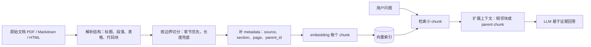

<section class="doc-hero">
  <p class="doc-hero__kicker">RAG 优化</p>
  <h1>文档切分策略 Chunking</h1>
  <p class="doc-hero__lead">让 RAG 检索命中完整证据，而不是把答案切坏、把噪声塞进 prompt。</p>
  <div class="doc-hero__meta" aria-label="本文信息">
    <span>适合阶段：Naive RAG 之后</span>
    <span>核心动作：切分 / 重叠 / 扩展</span>
    <span>面试重点：chunk size 的取舍</span>
  </div>
</section>

> 把文档切成检索能命中的证据块。

## 面试官想考什么

读完这篇你要能正面回答下面这些题。每题后面括号里是面试官真正想看你答出什么。

<div class="interview-grid">
  <div>
    <strong>chunk size 选 256、512 还是 1024？你怎么证明这个选择是对的？</strong>
    <span>考工程判断，不接受背默认值。</span>
  </div>
  <div>
    <strong>chunk overlap 设大一点是不是一定更好？</strong>
    <span>考你是否理解边界召回、索引膨胀和重复上下文。</span>
  </div>
  <div>
    <strong>为什么很多 RAG demo 用 RecursiveCharacterTextSplitter，生产系统却不能只靠它？</strong>
    <span>考文档结构意识，尤其是 Markdown、PDF、表格、代码。</span>
  </div>
  <div>
    <strong>小 chunk 检索准，大 chunk 上下文足，这个矛盾怎么解？</strong>
    <span>考 parent-child retrieval / chunk expansion。</span>
  </div>
  <div>
    <strong>语义切分听起来更聪明，为什么它有时比固定切分还差？</strong>
    <span>考对实验结论和局部贪心问题的理解。</span>
  </div>
  <div>
    <strong>中文、日文这类没有空格边界的文本，默认 splitter 会出什么问题？</strong>
    <span>考细节经验，能不能讲到 separators 和 tokenizer。</span>
  </div>
  <div>
    <strong>长上下文模型已经能吃 128K token，还需要 chunking 吗？</strong>
    <span>考 RAG 与长上下文的边界，以及 Lost in the Middle。</span>
  </div>
</div>

---

## 为什么需要文档切分策略

RAG 失败时，很多人第一反应是换 embedding 模型。真实项目里更常见的原因是：答案在知识库里，embedding 也没坏，但答案被切坏了。

看一个企业 API 文档片段：

```markdown
## XPay 查询订单接口

接口用于查询订单支付状态。调用方必须传 order_id 和 merchant_id。

### 超时策略

timeout 参数允许设置 1-300 秒。超过 300 秒会被网关拒绝。
```

用户问："XPay 查询订单的 timeout 最大能设多少？"

如果你按固定 80 个字符粗暴切：

```python
doc = """## XPay 查询订单接口

接口用于查询订单支付状态。调用方必须传 order_id 和 merchant_id。

### 超时策略

timeout 参数允许设置 1-300 秒。超过 300 秒会被网关拒绝。"""

for i in range(0, len(doc), 80):
    print(f"chunk {i // 80}: {doc[i:i + 80]!r}")
```

你很可能得到一个只含 `timeout 参数允许设置 1-300 秒` 的 chunk。它能回答"最大多少秒"，但丢了"这是 XPay 查询订单接口"这个上级语义。召回阶段看起来命中了，生成阶段却容易答成"timeout 最大 300 秒"，没法确认是哪个接口；如果同一页还有退款接口、对账接口，模型会把几个参数混在一起。

这就是 chunking 的本质矛盾：**检索想要小块，因为小块向量更聚焦；生成想要大块，因为大块保留上下文。** 切分策略不是预处理小事，它直接决定 RAG 的召回上限。

Lewis et al. 在 RAG 原始论文 [Retrieval-Augmented Generation for Knowledge-Intensive NLP Tasks](https://arxiv.org/abs/2005.11401) 里把外部知识放进 dense vector index。工程实现时，"index 里每条记录到底多大"就成了重要设计。这个设计做错，后面的 rerank、prompt、模型升级都只是在补窟窿。

## Chunking 是怎么工作的

它实际做了四件事：先把原始文档解析成有结构的文本单元，再按边界切成可嵌入的 chunk，给每个 chunk 补上来源和章节 metadata，最后把 chunk 作为向量索引里的最小检索单元。



一个健康的 chunk 至少要满足三件事：

- 能被用户问题召回：chunk 里有足够明确的关键词或语义。
- 能独立解释自己：不要只剩"上述参数"、"该接口"这种悬空指代。
- 能放进 prompt 后不制造噪声：不要把三个主题硬塞成一个向量。

面试里聊 chunking，别只说"我设了 512 tokens + 50 overlap"。更好的回答是：**我把 chunk 当成检索单元，把 parent/neighbor 当成生成上下文，两者分开设计。**

## 核心原理 / 关键设计

### chunk size 控制的是向量的"主题纯度"

chunk 越小，主题越纯，向量越像一个明确问题；chunk 越大，上下文越完整，但多个主题会被平均进同一个向量。

```python
def sweep_chunk_sizes(splitter_factory, docs, eval_queries, retriever_factory):
    rows = []
    for size in [256, 512, 800, 1200]:
        splitter = splitter_factory(chunk_size=size, chunk_overlap=size // 8)
        chunks = splitter.split_documents(docs)
        retriever = retriever_factory(chunks)

        hit = 0
        for query, gold_doc_id in eval_queries:
            top_chunks = retriever.invoke(query)
            hit += any(c.metadata["doc_id"] == gold_doc_id for c in top_chunks)

        rows.append({"chunk_size": size, "chunks": len(chunks), "recall": hit / len(eval_queries)})
    return rows
```

这段伪代码看的是评估方式：别凭感觉选 size，用一小批真实问题测 `recall@k`。如果问答任务经常需要一句话级证据，256-512 tokens 往往更稳；如果答案依赖完整条款、长表格、代码函数，800-1200 tokens 更合理。OpenAI 的 embedding 文档给出 `text-embedding-3-small` 和 `text-embedding-3-large` 最大输入 8192 tokens，但最大输入不等于最佳 chunk size，详见 [OpenAI embeddings guide](https://developers.openai.com/api/docs/guides/embeddings)。

### overlap 是边界保险，不是质量按钮

overlap 解决的是"答案刚好跨 chunk 边界"。它不能修复错误的文档结构，也不能让无关段落变相关。

```python
def estimate_index_growth(total_tokens: int, chunk_size: int, overlap: int) -> int:
    stride = chunk_size - overlap
    if stride <= 0:
        raise ValueError("overlap 必须小于 chunk_size")
    return max(1, (total_tokens - overlap + stride - 1) // stride)

print(estimate_index_growth(100_000, chunk_size=500, overlap=50))   # 223
print(estimate_index_growth(100_000, chunk_size=500, overlap=250))  # 399
```

overlap 从 50 提到 250，索引记录几乎翻倍。更麻烦的是，检索结果会出现大量近重复 chunk，top-K 被重复内容占满，LLM 看到一堆相似段落，反而更难抓住真正不同的证据。

经验起点可以用 `10%-20%`，但要用评估调参。LangChain 文档对 `chunk_overlap` 的解释也很克制：它用于缓解上下文被切开时的信息丢失，而不是越大越好，见 [RecursiveCharacterTextSplitter docs](https://docs.langchain.com/oss/python/integrations/splitters/recursive_text_splitter)。

### 先按结构切，再按长度切

固定长度切分最大的问题是无视结构。Markdown 的标题、HTML 的 section、PDF 的页码、代码的函数边界，本来就告诉你"哪里该断"。

```python
from langchain_text_splitters import RecursiveCharacterTextSplitter

splitter = RecursiveCharacterTextSplitter(
    chunk_size=800,
    chunk_overlap=120,
    separators=[
        "\n## ", "\n### ",  # 先保住 Markdown 章节
        "\n\n", "\n",
        "。", "；", "，",   # 中文文档别只按空格切
        " ", "",
    ],
)
chunks = splitter.split_text(markdown_text)
```

LangChain 的默认 separator 是 `["\n\n", "\n", " ", ""]`，官方文档专门提醒：中文、日文、泰文这类没有空格分词边界的文本，用默认列表可能把词切开。生产系统至少要按语种补分隔符；更进一步，要在切分前先做文档解析，把标题、表格、代码块识别出来。

LlamaIndex 的 [SentenceSplitter](https://developers.llamaindex.ai/python/framework-api-reference/node_parsers/sentence_splitter/) 也体现了同一个原则：尽量保留完整句子和段落，减少 chunk 尾部出现半句话。

### 小 chunk 检索，大 chunk 回答

一个常见解法是 parent-child retrieval：索引里放小 chunk，检索命中后返回它所属的大 parent chunk 或相邻窗口。

```python
parents = split_by_section(raw_doc)  # 例如每个 H2 一个 parent
children = []

for parent_id, parent in enumerate(parents):
    for child in split_into_small_chunks(parent.text, size=300, overlap=50):
        children.append({
            "text": child,
            "metadata": {"parent_id": parent_id, "section": parent.title},
        })

vector_index.add(children)

hits = vector_index.search(query, k=8)
parent_ids = {hit.metadata["parent_id"] for hit in hits}
context = [parents[parent_id].text for parent_id in parent_ids]
```

这样做把两个目标拆开：**小 chunk 负责匹配问题，大 parent 负责给模型完整上下文。** LangChain 的 [ParentDocumentRetriever](https://reference.langchain.com/python/langchain-classic/retrievers/parent_document_retriever/ParentDocumentRetriever) 就是这个设计：先取小块，再通过 parent id 找回更大的文档。

### 语义切分也有边界

语义切分会先把文本拆成句子，为相邻句子计算 embedding 距离；距离突然变大，就认为主题切换，可以断开。

```text
sentences = split_into_sentences(text)
vectors = embed(sentences)
distances = [
  cosine_distance(vectors[i], vectors[i + 1])
  for i in range(len(vectors) - 1)
]
breakpoints = [i for i, d in enumerate(distances) if d > threshold]
chunks = merge_sentences_by_breakpoints(sentences, breakpoints)
```

它适合主题频繁切换的长文档，但会引入两个新问题：embedding 成本更高，阈值也更难调。NAACL 2025 Findings 论文 [Is Semantic Chunking Worth the Computational Cost?](https://aclanthology.org/anthology-files/pdf/naacl/2025.naacl-findings.114.pdf) 的实验结论很有用：语义切分在拼接了多个短文档、主题很杂的数据上优势明显；到了原生长文档，固定切分和语义切分的差距会缩小，甚至固定切分更稳。

Late chunking 是另一条路线。Jina AI 的 [Late Chunking](https://arxiv.org/abs/2409.04701) 先让长上下文 embedding 模型看完整文档，再在 pooling 前切 chunk，让每个 chunk embedding 带上全局上下文。它解决的是"短 chunk 缺少上文"的问题，但依赖支持长输入的 embedding 模型，工程复杂度也更高。

## 怎么用：一个结构优先的 Markdown Chunker

下面这段代码可以直接处理 Markdown 文档：先按标题切成结构块，再用递归切分做长度兜底，并保留章节 metadata。它不调用 LLM，也不需要向量库，适合用来检查你的切分结果是否合理。

安装依赖：

```bash
pip install langchain-text-splitters tiktoken
```

```python
from pathlib import Path
from statistics import mean

from langchain_text_splitters import MarkdownHeaderTextSplitter, RecursiveCharacterTextSplitter

try:
    import tiktoken

    _enc = tiktoken.get_encoding("cl100k_base")

    def token_len(text: str) -> int:
        return len(_enc.encode(text))

except ImportError:
    def token_len(text: str) -> int:
        return len(text)


def build_markdown_chunks(path: str):
    text = Path(path).read_text(encoding="utf-8")

    header_splitter = MarkdownHeaderTextSplitter(
        headers_to_split_on=[
            ("#", "h1"),
            ("##", "h2"),
            ("###", "h3"),
        ],
        strip_headers=False,  # header 要留在文本里，否则 embedding 看不到章节语义
    )
    section_docs = header_splitter.split_text(text)

    body_splitter = RecursiveCharacterTextSplitter(
        chunk_size=700,
        chunk_overlap=100,
        length_function=token_len,
        add_start_index=True,
        separators=[
            "\n```",          # 代码块边界比普通换行更重要
            "\n\n",
            "\n",
            "。", "；", "，",
            " ",
            "",
        ],
    )
    chunks = body_splitter.split_documents(section_docs)

    for idx, chunk in enumerate(chunks):
        chunk.metadata["chunk_id"] = f"{Path(path).stem}-{idx:04d}"
        chunk.metadata["source"] = path
        chunk.metadata["tokens"] = token_len(chunk.page_content)

    return chunks


if __name__ == "__main__":
    chunks = build_markdown_chunks("rag/basics.md")
    sizes = [c.metadata["tokens"] for c in chunks]

    print(f"chunks: {len(chunks)}")
    print(f"avg tokens: {mean(sizes):.1f}")
    print(f"max tokens: {max(sizes)}")
    print()

    for c in chunks[:3]:
        section = " / ".join(
            str(c.metadata.get(k, "")) for k in ("h1", "h2", "h3") if c.metadata.get(k)
        )
        print("=" * 80)
        print(c.metadata["chunk_id"], section, c.metadata["tokens"])
        print(c.page_content[:500])
```

跑完先人工看前 20 个 chunk，比直接建索引更有价值。你要检查四件事：标题有没有留住，代码块有没有被切断，表格有没有变成碎片，chunk 里有没有大量"该功能 / 上述配置 / 本参数"这种悬空指代。

## 容易踩的坑

### 坑 1：中文文档直接用默认 separator

**现象**：召回结果里出现半个词、半句话；用户问中文问题时，明明关键词存在却排不上来。

**根因**：LangChain 默认按段落、换行、空格和空字符串递归切。中文没有天然空格，最后会退化到字符级切分。官方文档已经提醒过这个问题，见 [Splitting text from languages without word boundaries](https://docs.langchain.com/oss/python/integrations/splitters/recursive_text_splitter)。

**修法**：按语种补中文句号、逗号、顿号、全角标点；更稳的做法是先用解析器按标题和段落切，再用长度兜底。

### 坑 2：overlap 拉满，索引变贵但召回没变好

**现象**：向量库条数暴涨，检索 top-K 里三四条内容几乎一样，LLM 回答还变啰嗦。

**根因**：overlap 只是复制边界附近的文本。它增加的是重复证据，不是新证据。Unstructured 文档里的 `overlap all` 示例还展示了另一个副作用：按字符重叠可能把单词从中间切开，见 [Unstructured chunking docs](https://docs.unstructured.io/concepts/chunking)。

**修法**：先设 `10%-20%`，用 eval 看 `recall@k` 是否提升。若边界问题仍然多，优先改结构切分或 parent-child retrieval，而不是继续加 overlap。

### 坑 3：把语义切分当成默认正确

**现象**：SemanticChunker 切出来很多单句 chunk，或者把相邻但语义相近的句子跨小节合并，检索结果看起来"相关"，答案却缺上下文。

**根因**：语义切分通常看相邻句子的 embedding 距离，是局部决策。NAACL 2025 的语义切分实验也观察到，阈值变化会导致 chunk 过大或过小；在某些原生长文档上，固定切分并不弱。

**修法**：语义切分只作为候选策略，必须和固定 / 递归切分在同一批问题上 A/B。评估指标至少看 `hit@k`、`MRR`、生成答案正确率和平均 prompt token。

### 坑 4：PDF、表格、代码没解析就开切

**现象**：表格一行被切到多个 chunk，代码函数签名和函数体分离，PDF 页眉页脚反复进入检索结果。

**根因**：切分器看到的是纯文本，不知道哪里是表格、标题、页码、代码块。Unstructured 的 `by_title`、`by_page`、`by_similarity` 这些策略，都会先识别文档结构，再决定 chunk 边界。

**修法**：PDF 先抽取元素和页码，表格转 Markdown 或保留为单独元素，代码按函数 / 类切。chunk metadata 里保留 `page`、`section`、`table_id`、`symbol`，后面引用来源才不会断。

### 坑 5：大 chunk + 大 top-K 触发 Lost in the Middle

**现象**：检索结果里有正确 chunk，prompt 里也塞进去了，但模型仍然答错。

**根因**：上下文越长，正确证据越可能落在 prompt 中间。Liu et al. 的 [Lost in the Middle](https://arxiv.org/abs/2307.03172) 发现，相关信息放在开头或末尾时表现更好，放在中间会明显退化。

**修法**：粗召回多一点，rerank 后只放少量高质量 chunk；把最相关 chunk 放靠近问题的位置；必要时用 parent-child，而不是把 20 个大 chunk 全塞进去。

## 与相似策略的区别

| 策略 | 实际怎么切 | 适合什么文档 | 面试里怎么选 |
|---|---|---|---|
| 固定长度切分 | 每 N tokens 一刀 | 干净纯文本、baseline 实验 | 用来做基线，不要直接当生产答案 |
| 递归字符切分 | 按分隔符列表从粗到细切 | Markdown、说明文、FAQ | RAG demo 的默认起点，记得补中文 separator |
| 结构切分 | 标题、页、表格、代码块优先 | API 文档、PDF、手册、代码仓库 | 生产系统优先做这个 |
| 语义切分 | 用 embedding 距离找主题断点 | 多主题混排长文档 | 有成本，必须用 eval 证明收益 |
| Parent-child | 小块入索引，大块进 prompt | 小块准但缺上下文的场景 | 面试高频，能讲清 retrieval unit 和 generation context |
| Contextual retrieval | 给 chunk 追加全局解释再嵌入 | chunk 离开原文后含义不完整 | Anthropic 实测有效，但会增加离线处理成本 |
| Late chunking | 先整篇编码，再对 token embedding 分块 pooling | 长文档、长上下文 embedding 模型 | 前沿方案，适合讲加分项，不要硬说通用 |

Pinecone 的 [chunking strategies](https://www.pinecone.io/learn/chunking-strategies/) 里也强调同一个判断：没有一个全局 chunk size 能适配所有文档，策略要跟文档结构和检索目标绑定。

## 面试题深度解析

**Q1: chunk size 选 256、512 还是 1024？你怎么证明这个选择是对的？**

- **30 秒版本**：没有固定答案。小 chunk 提高匹配精度，大 chunk 保留上下文。我会用真实 query 集合扫几组 size，看 `recall@k`、答案正确率和 prompt token 成本。
- **追问 1**：如果没有标注数据怎么办？先从线上日志或产品需求里整理 30-50 个代表性问题，手工标 gold section；不需要大评测集，先能区分策略就够。
- **追问 2**：为什么不直接按 embedding 模型最大输入切？最大输入只是 API 限制，不是语义最优。8192-token chunk 可能包含十几个主题，一个向量会把它们平均掉，检索时哪个问题都不够像。

**Q2: chunk overlap 设大一点是不是一定更好？**

- **30 秒版本**：不是。overlap 是防止答案跨边界丢失，过大会增加索引体积和重复召回，让 top-K 被相似 chunk 挤占。
- **追问 1**：怎么判断 overlap 太大？看检索结果的去重率。如果 top-5 里三条来自同一段相邻窗口，而且答案没有更准，就该降 overlap 或加 MMR。
- **追问 2**：边界问题很多怎么办？优先改 splitter 的边界，例如按标题、句子、代码函数切；再考虑 parent-child retrieval。overlap 是最后的保险，不是主设计。

**Q3: 小 chunk 检索准，大 chunk 上下文足，这个矛盾怎么解？**

- **30 秒版本**：用 parent-child。向量库索引小 chunk，命中后通过 `parent_id` 找回大段上下文给 LLM。
- **追问 1**：为什么不直接索引大 parent？大 parent 向量会被多个主题稀释，召回不稳定。小 child 更像 query，适合做匹配单元。
- **追问 2**：parent 多大合适？通常按自然结构：一个 H2 小节、一个 PDF 页、一个函数、一个 FAQ 条目。不要用一个整篇文档当 parent，否则又回到长上下文噪声问题。

**Q4: 语义切分为什么有时比固定切分还差？**

- **30 秒版本**：语义切分依赖 embedding 距离和阈值，可能把局部相似但结构上不该合并的句子放一起，也可能切出缺上下文的单句。
- **追问 1**：它适合哪里？主题混杂、段落边界不可靠的长文本。比如把多个短文档拼在一起的知识库，语义断点能帮你把主题拆开。
- **追问 2**：怎么用到生产？把它当候选策略，不要当默认真理。用同一批问题比较固定、递归、结构、语义四组结果；如果只提升 1 个点但离线成本翻倍，生产上未必值得。

## 延伸阅读

- 论文：[Retrieval-Augmented Generation for Knowledge-Intensive NLP Tasks](https://arxiv.org/abs/2005.11401) — RAG 原始论文，读它是为了理解"参数记忆 + 非参数记忆"这条路线从哪来。
- 论文：[Lost in the Middle: How Language Models Use Long Contexts](https://arxiv.org/abs/2307.03172) — 解释为什么大 chunk 和大 top-K 会让正确证据被模型忽略。
- 论文：[Late Chunking: Contextual Chunk Embeddings Using Long-Context Embedding Models](https://arxiv.org/abs/2409.04701) — 想了解前沿 chunk embedding 方案，可以看它怎么把全局上下文带进局部 chunk。
- 论文：[Is Semantic Chunking Worth the Computational Cost?](https://aclanthology.org/anthology-files/pdf/naacl/2025.naacl-findings.114.pdf) — 语义切分不总是赢，这篇能帮你避免"听起来高级所以默认用"。
- 文档：[LangChain RecursiveCharacterTextSplitter](https://docs.langchain.com/oss/python/integrations/splitters/recursive_text_splitter) — 看默认 separators、`chunk_size`、`chunk_overlap` 的真实行为。
- 文档：[LlamaIndex SentenceSplitter](https://developers.llamaindex.ai/python/framework-api-reference/node_parsers/sentence_splitter/) — 看句子优先切分如何减少半句话 chunk。
- 文档：[Unstructured Chunking](https://docs.unstructured.io/concepts/chunking) — 适合处理 PDF、标题、页面、相似度切分这些文档解析问题。
- 工程文章：[Anthropic Contextual Retrieval](https://www.anthropic.com/engineering/contextual-retrieval) — Anthropic 把 chunk 加上解释性上下文后，实验中 top-20 检索失败率从 5.7% 降到 2.9%，再加 rerank 降到 1.9%。
