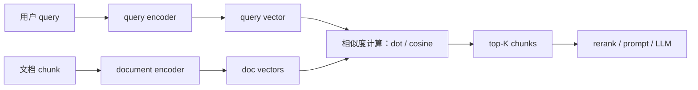

<section class="doc-hero">
  <p class="doc-hero__kicker">RAG 优化</p>
  <h1>嵌入模型选型 Embedding Models</h1>
  <p class="doc-hero__lead">RAG 召回质量的第一道闸门：别只看排行榜，要用自己的问题、语料和成本约束选模型。</p>
  <div class="doc-hero__meta" aria-label="本文信息">
    <span>适合阶段：RAG 入门 → 生产选型</span>
    <span>核心权衡：质量 / 维度 / 成本 / 语言</span>
    <span>面试重点：评测回放与模型迁移</span>
  </div>
</section>

> 用业务问题评测 embedding，而不是用排行榜替你做决定。

## 面试官想考什么

读完这篇你要能正面回答下面这些题。每题后面括号里是面试官真正想看你答出什么。

<div class="interview-grid">
  <div>
    <strong>RAG 里选 embedding 模型，你看 MTEB 总分还是先做自己的 retrieval eval？</strong>
    <span>考评估意识，排行榜只是候选筛选器。</span>
  </div>
  <div>
    <strong>text-embedding-3-small 和 text-embedding-3-large 怎么取舍？</strong>
    <span>考维度、价格、召回质量、向量库成本的整体判断。</span>
  </div>
  <div>
    <strong>为什么 BGE、E5、Cohere 这类模型要区分 query 和 document？</strong>
    <span>考 asymmetric retrieval，不是所有文本都该同样编码。</span>
  </div>
  <div>
    <strong>embedding 维度越大越好吗？降维会不会毁掉召回？</strong>
    <span>考 Matryoshka / dimensions 参数和向量库成本。</span>
  </div>
  <div>
    <strong>为什么线上换 embedding 模型不能只改一行模型名？</strong>
    <span>考索引重建、双写、回滚和向量空间不兼容。</span>
  </div>
  <div>
    <strong>多语言、代码、法律/金融知识库，为什么通用模型可能不够？</strong>
    <span>考领域迁移和专用评测集。</span>
  </div>
  <div>
    <strong>dense embedding、BM25、hybrid search、reranker 各自解决什么问题？</strong>
    <span>考流程分工，避免把所有锅都甩给 embedding。</span>
  </div>
</div>

---

## 为什么需要认真选 embedding 模型

RAG 流程里，LLM 只看你塞进 prompt 的上下文。embedding 模型的工作是在几万、几百万个 chunk 里，把最可能有答案的那几个找出来。它如果漏了，后面的模型再强也只能对着错误资料发挥。

看一个很常见的失败例子：

```text
用户问题：员工离职后，期权还能保留多久？

文档 A：离职员工已归属期权的行权窗口为 90 天。
文档 B：期权授予后按四年归属，首年 cliff 为 25%。
文档 C：员工离职流程包括资产归还、账号注销和离职面谈。
```

如果 embedding 模型没学好"保留多久"和"行权窗口"之间的语义关系，它可能把 C 排在 A 前面，因为 C 里有"离职员工"这些显式词。检索看起来不是空结果，生成却会答成"离职流程包括账号注销"，完全跑偏。

这也是为什么只看模型名很危险。`text-embedding-3-large`、BGE-M3、E5、Voyage、Cohere 都可以做 RAG，但它们对中文、代码、长文档、短 query、领域术语的表现不一样；它们的维度、成本、部署方式也不一样。生产选型的目标是找一个在你自己的 query 分布上 **recall 足够高、延迟扛得住、成本可接受、能长期维护** 的模型。

MTEB 原论文 [MTEB: Massive Text Embedding Benchmark](https://arxiv.org/abs/2210.07316) 说得很清楚：它覆盖 8 类任务、58 个数据集、112 种语言，但没有一种 embedding 方法统治所有任务。BEIR 的 [zero-shot 检索评测](https://arxiv.org/abs/2104.08663) 也提醒过：BM25 是很强的基线，reranking / late-interaction 往往更准但更贵。面试里如果只说"我选排行榜第一"，基本等于没讲选型。

## Embedding 模型是怎么工作的

它实际做的是把 query 和 chunk 映射到同一个向量空间。在线检索时，系统把用户问题编码成向量，在向量库里找距离最近的文档向量。



这里有两个容易被忽略的点。

第一，query 和 document 不一定应该同样编码。用户问题通常短、口语化、意图强；文档 chunk 通常长、正式、信息密度高。E5 模型卡要求输入加 `query:` / `passage:` 前缀，BGE 模型卡建议短 query 检索长 passage 时给 query 加 instruction，Cohere Embed API 直接把 `input_type` 分成 `search_query` 和 `search_document`。这些标记会告诉模型"这段文本在检索任务里扮演什么角色"。

第二，相似度分数大多只适合排序，不适合跨模型当绝对阈值。OpenAI FAQ 说明它的 embedding 默认 L2 归一化，所以点积、余弦相似度和欧氏距离给出的排序等价；BGE 模型卡则提醒相似度绝对值可能偏高。换模型后还沿用 `score > 0.78` 这种阈值，线上很容易悄悄漏召回。

## 核心原理 / 关键设计

### 1. 用业务 eval 选模型，不用总榜替你选

模型排行榜适合缩小候选范围，不能替代你自己的评测。RAG 关心的是"我的用户问题能不能召回包含答案的 chunk"，所以至少要有一组 query、gold doc id 和 `recall@k / MRR@k`。

```python
def recall_at_k(ranked_ids: list[str], gold_ids: set[str], k: int) -> float:
    return len(set(ranked_ids[:k]) & gold_ids) / max(len(gold_ids), 1)


def mrr_at_k(ranked_ids: list[str], gold_ids: set[str], k: int) -> float:
    for rank, doc_id in enumerate(ranked_ids[:k], start=1):
        if doc_id in gold_ids:
            return 1.0 / rank
    return 0.0
```

`recall@k` 看有没有捞到正确文档，`MRR@k` 看正确文档排得靠不靠前。RAG 早期可以先手工标 30-50 个真实问题，不需要一开始就搭大评测平台。只要能区分 "small 便宜但漏召回"、"large 多召回但贵"、"开源模型在中文术语上更稳" 这些差异，就已经比拍脑袋强很多。

### 2. 维度影响向量库成本，不只影响模型效果

OpenAI 官方文档给出：`text-embedding-3-small` 默认 1536 维，`text-embedding-3-large` 默认 3072 维，最大输入都是 8192 tokens，并支持用 `dimensions` 参数缩短向量。OpenAI 发布说明里还提到，`text-embedding-3-large` 在 MTEB 上 64.6%，`text-embedding-3-small` 是 62.3%，但价格也不同。

维度带来的存储差异很直接：

```python
def vector_storage_gib(n_vectors: int, dim: int, dtype_bytes: int = 4) -> float:
    return n_vectors * dim * dtype_bytes / 1024**3


for dim in [384, 768, 1536, 3072]:
    print(dim, f"{vector_storage_gib(10_000_000, dim):.1f} GiB")
```

1000 万条 float32 向量，384 维约 14.3 GiB，3072 维约 114.4 GiB。真实向量库还要加 HNSW 图索引、metadata、压缩策略和副本。API 费用按 token 算，向量库费用和检索延迟却会被维度放大。面试里讲维度，一定要把模型质量和系统成本一起讲。

### 3. query/document 指令是模型契约

E5 论文 [Text Embeddings by Weakly-Supervised Contrastive Pre-training](https://arxiv.org/abs/2212.03533) 把 embedding 训练成可迁移的单向量表示；INSTRUCTOR 论文 [One Embedder, Any Task](https://arxiv.org/abs/2212.09741) 则更进一步，把任务 instruction 和文本一起编码。它们共同说明一件事：embedding 不是"把字符串丢进去就完事"，输入格式会影响向量空间。

```python
def format_e5_query(text: str) -> str:
    return f"query: {text}"


def format_e5_passage(text: str) -> str:
    return f"passage: {text}"


query_text = format_e5_query("离职后期权还能保留多久？")
doc_text = format_e5_passage("离职员工已归属期权的行权窗口为 90 天。")
```

如果你用 E5 嵌入文档时忘了 `passage:`，或者把 query 也当普通 passage 编码，代码不会报错，召回会变差。这种问题很隐蔽，因为单条 query 试跑可能还能命中，到了长尾问题才开始掉。

### 4. dense 模型只负责一部分检索

dense embedding 擅长语义相近，但对精确符号、型号、错误码、专有名词不一定稳。BEIR 论文里 BM25 仍然是强基线，这也是生产 RAG 常做 hybrid search 的原因。

```text
用户问：报错 ERR_AUTH_4017 怎么处理？

dense 可能召回：
- 登录失败排查指南
- OAuth token 过期说明

BM25 更容易召回：
- ERR_AUTH_4017：客户端签名 timestamp 超过 5 分钟
```

这不一定说明 embedding 模型"差"。dense retrieval 和 lexical retrieval 解决的问题不同。常见工程路径是：dense + BM25 粗召回，RRF 或加权融合，再用 reranker 精排。embedding 模型负责召回候选，不应该承担所有排序责任。

### 5. 换模型等于换向量空间

同一段文本，用两个 embedding 模型得到的是两个不同向量空间里的坐标。旧索引里的向量不能和新 query 向量混搜。

```text
错误迁移：
线上 query encoder 换成新模型
向量库里仍然是旧模型文档向量
=> 相似度没有意义，召回随机漂移

正确迁移：
旧索引继续服务
新模型离线重建新索引
影子流量比较 recall / latency / cost
通过后逐步切流，保留回滚窗口
```

这题很适合区分有没有真实上线经验。会 demo 的人说"换一行模型名"；做过生产的人会说"要重建索引、双写、灰度和回滚"。

## 怎么用：用 recall@k 比较 embedding 候选

下面这段代码不依赖向量库，直接在内存里比较几种 embedding 后端。默认会跑 `sentence-transformers/all-MiniLM-L6-v2`；如果设置了 `OPENAI_API_KEY`，会额外跑 OpenAI；如果安装了 FlagEmbedding，也可以跑 BGE-M3。

安装依赖：

```bash
pip install -U numpy sentence-transformers
# 可选：pip install -U openai FlagEmbedding
```

```python
import os
from typing import Iterable

import numpy as np

DOCS = {
    "d1": "Python 的 asyncio 用事件循环调度协程，适合高并发 I/O。",
    "d2": "OpenAI text-embedding-3-small 默认输出 1536 维向量。",
    "d3": "RAG 检索评估常用 recall@k、MRR@k 和 nDCG@k。",
    "d4": "BGE-M3 支持 dense、sparse 和 multi-vector 三种检索表示。",
    "d5": "余弦相似度等于两个 L2 归一化向量的点积。",
}

EVAL = [
    ("怎么评估 RAG 检索是否命中正确文档？", {"d3"}),
    ("text-embedding-3-small 的默认维度是多少？", {"d2"}),
    ("归一化后怎么算 cosine similarity？", {"d5"}),
]

MODELS = [
    {"name": "minilm", "backend": "st", "id": "sentence-transformers/all-MiniLM-L6-v2", "dim": 384},
    {"name": "openai-small-512", "backend": "openai", "id": "text-embedding-3-small", "dim": 512},
]


def l2_normalize(x: np.ndarray) -> np.ndarray:
    x = np.asarray(x, dtype=np.float32)
    return x / np.clip(np.linalg.norm(x, axis=1, keepdims=True), 1e-12, None)


def batched(items: list[str], batch_size: int) -> Iterable[list[str]]:
    for i in range(0, len(items), batch_size):
        yield items[i:i + batch_size]


def embed_texts(spec: dict, texts: list[str], batch_size: int = 32) -> np.ndarray:
    if spec["backend"] == "st":
        from sentence_transformers import SentenceTransformer
        model = SentenceTransformer(spec["id"])
        return model.encode(texts, batch_size=batch_size, normalize_embeddings=True)

    if spec["backend"] == "openai":
        from openai import OpenAI
        client = OpenAI()
        vectors = []
        for batch in batched(texts, batch_size):
            resp = client.embeddings.create(
                model=spec["id"],
                input=batch,
                dimensions=spec["dim"],  # 小维度先试，质量不够再升
                encoding_format="float",
            )
            vectors.extend(item.embedding for item in resp.data)
        return l2_normalize(np.array(vectors))

    raise ValueError(f"unknown backend: {spec['backend']}")


def evaluate(doc_vecs: np.ndarray, query_vecs: np.ndarray, k: int = 3) -> dict:
    doc_ids = list(DOCS)
    scores = query_vecs @ doc_vecs.T  # 归一化后，点积就是 cosine 排序
    ranks = np.argsort(-scores, axis=1)
    recall_values, rr_values = [], []

    for qi, (_, gold_ids) in enumerate(EVAL):
        ranked_ids = [doc_ids[j] for j in ranks[qi, :k]]
        hit_positions = [r + 1 for r, doc_id in enumerate(ranked_ids) if doc_id in gold_ids]
        recall_values.append(len(set(ranked_ids) & gold_ids) / len(gold_ids))
        rr_values.append(1 / hit_positions[0] if hit_positions else 0.0)

    return {f"recall@{k}": float(np.mean(recall_values)), f"mrr@{k}": float(np.mean(rr_values))}


def estimate_storage(n_docs: int, dim: int, dtype_bytes: int = 4) -> str:
    gb = n_docs * dim * dtype_bytes / 1024**3
    return f"{gb:.2f} GiB for {n_docs:,} vectors x {dim} dims x float32"


if __name__ == "__main__":
    docs = list(DOCS.values())
    queries = [q for q, _ in EVAL]

    for spec in MODELS:
        if spec["backend"] == "openai" and not os.getenv("OPENAI_API_KEY"):
            continue
        doc_vecs = embed_texts(spec, docs)
        query_vecs = embed_texts(spec, queries)
        print(spec["name"], evaluate(doc_vecs, query_vecs), estimate_storage(1_000_000, spec["dim"]))
```

这段代码故意不接 LangChain。选 embedding 模型时，先把检索评测做成一个独立脚本，能避免"流程太长，错了不知道错在哪"。等 recall 和 MRR 稳了，再接向量库、hybrid search、reranker 和生成评测。

## 容易踩的坑

### 坑 1：只看 MTEB 总分

**现象**：排行榜分数更高的模型，上线后公司知识库召回反而下降。

**根因**：MTEB 覆盖很多任务，RAG 主要关心 retrieval；你的语料可能是中文政策、代码注释、PDF 表格、客服工单，和榜单数据分布完全不同。MTEB 论文自己也说，没有一种方法统治所有任务。

**修法**：用 MTEB / BEIR 选候选池，用自己的 query 集做最终选择。至少看 `recall@5`、`MRR@10`、平均检索延迟、每百万 token 入库成本和向量库存储成本。

### 坑 2：query/document 输入格式混用

**现象**：demo 问几个问题都能命中，线上长尾 query 掉得很厉害。

**根因**：E5 需要 `query:` / `passage:` 前缀，BGE 对短 query 到长 passage 的检索建议加 query instruction，Cohere Embed v3+ 区分 `search_query` 和 `search_document`。输入格式错了，模型仍然返回向量，但向量空间不再是训练时的任务分布。

**修法**：把 embedding 输入格式封装成函数，禁止业务代码直接调模型。评测和线上必须共用同一套 formatter。

### 坑 3：换模型不重建索引

**现象**：只改 query encoder 后，召回结果忽好忽坏，线上答非所问。

**根因**：新 query 向量和旧 document 向量不在同一个空间，距离没有可比性。即使两个模型维度一样，也不能混用。

**修法**：新模型离线重嵌全量文档，建新索引；影子流量对比旧索引；切流时保留旧索引回滚。大库可以先按高频文档或租户分批重建。

### 坑 4：相似度阈值从一个模型搬到另一个模型

**现象**：旧模型 `score > 0.75` 很稳，新模型同样阈值要么几乎全拒，要么噪声爆炸。

**根因**：不同模型的分数分布不同。BGE 模型卡提醒过，相似度绝对值可能集中在较高区间；OpenAI embedding 又默认归一化。分数可用于同模型内排序，不能跨模型直接迁移阈值。

**修法**：画出正例/负例分数分布，按业务容忍度重新定阈值。更稳的做法是用 top-K + reranker，而不是用单一相似度阈值做硬过滤。

### 坑 5：以为大维度一定更好

**现象**：召回只提升一点点，向量库内存、构建时间、查询延迟却翻倍。

**根因**：维度增加会线性放大向量存储和相似度计算成本。OpenAI 和 Cohere 都支持可配置输出维度，Voyage 也提供多维度和量化选项，说明现代 embedding 选型本来就是质量和成本的折中。

**修法**：对同一模型扫 256 / 512 / 1024 / 默认维度，看 recall 曲线有没有平台期。很多业务在 512 或 1024 维已经足够，省下的成本可以投给 reranker。

## 与相似概念的区别

| 概念 | 解决的问题 | 典型输入输出 | 适合放在哪里 |
|---|---|---|---|
| Dense embedding | 语义召回 | query/chunk → 单向量 | 第一阶段粗召回 |
| Sparse / BM25 | 关键词、编号、错误码 | query/chunk → 词项权重 | 和 dense 做 hybrid |
| Multi-vector / ColBERT | token 级细粒度匹配 | query/chunk → 多个 token 向量 | 高质量检索，成本更高 |
| Reranker / cross-encoder | top-K 精排 | query + doc → relevance score | 粗召回之后 |
| LLM 生成 | 基于证据组织答案 | prompt → answer | rerank 和压缩之后 |

BGE-M3 论文 [M3-Embedding](https://arxiv.org/abs/2402.03216) 的价值就在这里：它尝试把 dense、sparse、multi-vector 三种检索表示统一到一个模型里，覆盖 100+ 语言和最长 8192 token 输入。但即便模型很强，工程上也要看延迟、内存、索引结构和评测结果。

## 面试题深度解析

**Q1: RAG 里选 embedding 模型，你看 MTEB 总分还是自己的 retrieval eval？**

- **30 秒版本**：MTEB 用来筛候选，最终看自己的 retrieval eval。因为 RAG 关心的是业务 query 能不能召回正确 chunk，而不是模型在所有 embedding 任务上的平均表现。
- **追问 1**：没有标注数据怎么办？从客服日志、搜索日志、产品 FAQ 里抽 30-50 个问题，人工标 gold chunk 或 gold section。规模不大也能区分模型方向。
- **追问 2**：指标看什么？先看 `recall@k` 和 `MRR@k`，再看端到端答案正确率。embedding 只负责召回候选，生成正确率还受 chunking、rerank、prompt 影响。

**Q2: text-embedding-3-small 和 text-embedding-3-large 怎么取舍？**

- **30 秒版本**：small 便宜、默认 1536 维，适合成本敏感和大规模入库；large 默认 3072 维，官方 MTEB/MIRACL 分数更高，适合质量优先。最终要用自己的 eval 看 large 多召回的部分值不值得成本。
- **追问 1**：large 能不能降维？可以。OpenAI 的 `dimensions` 参数能缩短 `text-embedding-3` 系列输出。可以先试 1024 或 512，质量不够再升。
- **追问 2**：价格之外还有什么成本？向量库存储、HNSW 图索引、网络传输、检索延迟、备份和重建时间。1000 万向量从 1536 维变 3072 维，存储和算距成本接近翻倍。

**Q3: 为什么 BGE/E5/Cohere 要区分 query 和 document？**

- **30 秒版本**：检索是非对称任务。query 短、意图强；document 长、信息多。模型训练时就学习了这种角色差异，所以输入时要给它正确提示。
- **追问 1**：忘了加 instruction 会怎样？代码不会报错，但 query 和 passage 的向量分布偏离训练格式，长尾召回会掉。
- **追问 2**：怎么防止线上混乱？做一个统一 embedding gateway，业务侧只传 `role=query/document` 和文本，formatter 在网关里处理，评测和线上共用。

**Q4: 为什么只换 embedding 模型经常不够？**

- **30 秒版本**：embedding 解决语义召回，但精确词、错误码、表格、长文档位置偏置、候选排序都不只靠 embedding。生产 RAG 常要 hybrid search + reranker。
- **追问 1**：什么时候 BM25 比 embedding 更重要？错误码、型号、API 名、法规条款编号、函数名这类精确匹配场景。dense 模型可能觉得语义相近，BM25 能抓住字面一致。
- **追问 2**：reranker 为什么更准？bi-encoder 把 query 和 doc 分别编码后算距离，速度快；cross-encoder 把 query 和 doc 一起读，能看细粒度交互，所以更准但更慢。通常只对 top-50 或 top-100 做 rerank。

## 延伸阅读

- 文档：[OpenAI Embeddings Guide](https://developers.openai.com/api/docs/guides/embeddings) — 查 `text-embedding-3-small/large` 的维度、最大输入、`dimensions` 参数和官方示例。
- 发布说明：[OpenAI New embedding models and API updates](https://openai.com/index/new-embedding-models-and-api-updates/) — 看 `ada-002`、`3-small`、`3-large` 在 MIRACL/MTEB 上的官方对比。
- 论文：[MTEB: Massive Text Embedding Benchmark](https://arxiv.org/abs/2210.07316) — 理解为什么总榜不能替代业务评测。
- 论文：[BEIR: A Heterogeneous Benchmark for Zero-shot Evaluation of Information Retrieval Models](https://arxiv.org/abs/2104.08663) — 看 BM25、dense、reranking 在异构检索任务上的差异。
- 论文：[Text Embeddings by Weakly-Supervised Contrastive Pre-training](https://arxiv.org/abs/2212.03533) — E5 的训练思路和 zero-shot 检索表现。
- 论文：[One Embedder, Any Task](https://arxiv.org/abs/2212.09741) — 解释 instruction 为什么能改变 embedding 的任务适配。
- 论文：[M3-Embedding](https://arxiv.org/abs/2402.03216) — 了解 BGE-M3 的 dense / sparse / multi-vector 统一方案。
- 模型卡：[BAAI/bge-large-en-v1.5](https://huggingface.co/BAAI/bge-large-en-v1.5) — 看 BGE 的 query instruction、归一化和相似度分数提醒。
- 文档：[Cohere Embed API](https://docs.cohere.com/v2/reference/embed) — 看 `search_query` / `search_document`、输出维度和量化类型。
- 文档：[Voyage AI Embeddings](https://docs.voyageai.com/docs/embeddings) — 看通用、代码、金融、法律等不同 embedding 模型的适用边界。
